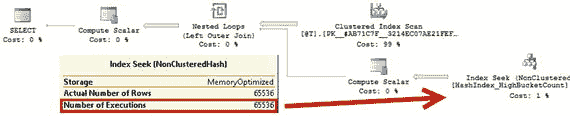

# 代码清单 4-3. 桶计数与性能：在表中选择数据

代码清单 4-3 展示了在每个内存优化表中触发 65,536 次索引查找操作的代码。我以一种效率非常低的方式编写了这个查询，只是为了演示长行链的影响。

```sql
declare
@T table(Id int not null primary key)
;with N1(C) as (select 0 union all select 0) -- 2 rows
,N2(C) as (select 0 from N1 as t1 cross join N1 as t2) -- 4 rows
,N3(C) as (select 0 from N2 as t1 cross join N2 as t2) -- 16 rows
,N4(C) as (select 0 from N3 as t1 cross join N3 as t2) -- 256 rows
,N5(C) as (select 0 from N4 as t1 cross join N4 as t2) -- 65,536 rows
,Ids(Id) as (select row_number() over (order by (select null)) from N5)
insert into @T(Id)
select Id from Ids;
select t.id, c.Cnt
from @T t
cross apply
(
select count(*) as Cnt
from dbo.HashIndex_HighBucketCount h
where h.Id = t.Id
) c;
select t.id, c.Cnt
from @T t
cross apply
(
select count(*) as Cnt
from dbo.HashIndex_LowBucketCount h
where h.Id = t.Id
) c;
```

你可以通过分析图 4-5 中所示的执行计划来确认，这些查询遍历了 65,536 次行链。



