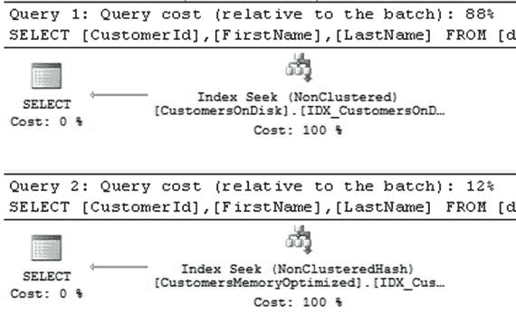
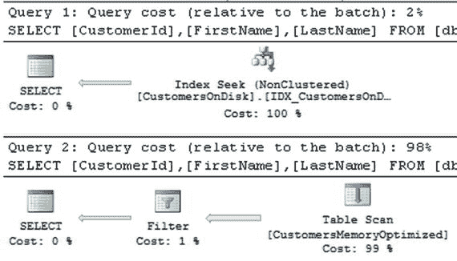
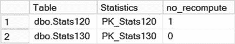
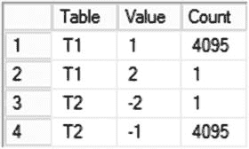
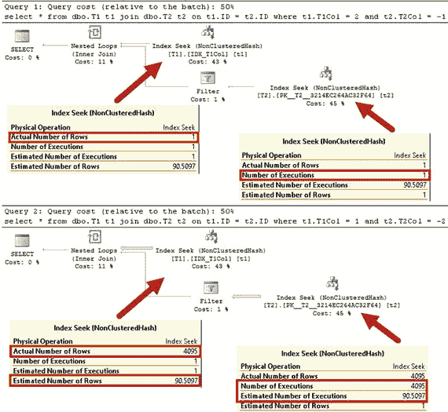
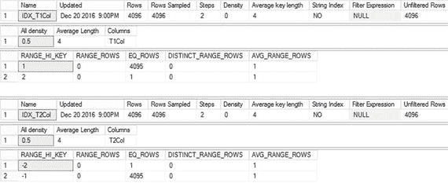
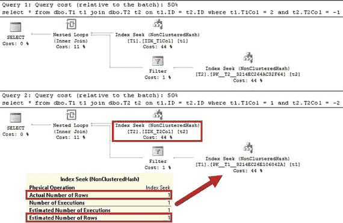

# 表 4-3. SELECT 语句执行时间（空桶开销）

表 4-3 显示了我的环境中的执行时间。如你所见，扫描额外桶的开销并不显著；然而，它仍然存在。

| dbo.HashIndex_HighBucketCount (1,048,576 个桶) | dbo.HashIndex_LowBucketCount (1,024 个桶) |
| --- | --- |
| 51 ms | 62 ms |

同样值得注意的是，在大多数情况下，SQL Server 2016 不会扫描哈希索引，而是使用表扫描操作符扫描表堆。我将在第 6 章更详细地讨论这一点。

### 选择合适的桶计数

在哈希索引中选择合适的桶数量是一个棘手但重要的主题。更糟糕的是，你必须在设计阶段做出正确的决定；一旦表创建完成后，更改`bucket_count`值的唯一方法是修改表，这会在后台创建新的表对象。

在理想情况下，你应该拥有超过索引基数（唯一键的数量）的桶数。显然，你还应该考虑未来的系统增长和预期的工作负载变化。如果你预计系统未来将处理更多数据，那么仅基于当前数据基数创建索引并不是一个好主意。

> **注意**
> 
> 微软建议将`bucket_count`设置为索引中不同值数量的一到两倍。你可以在[此处](https://docs.microsoft.com/en-us/sql/relational-databases/in-memory-oltp/hash-indexes-for-memory-optimized-tables#configuring_bucket_count)阅读更多内容。

具有大量重复值的低基数列通常是哈希索引的糟糕候选者。相同的数据值会产生相同的哈希值；因此，行将被链接到长行链中。显然，总有例外，你应该分析系统中的查询和工作负载，并考虑长行链引入的数据修改开销。

在现有索引中，你可以分析`sys.dm_db_xpt_hash_index_stats`视图的输出以及清单 4-2 中的代码，以确定索引中的桶数是否足够。如果空桶的数量少于索引中桶总数的 10%，那么桶计数可能太低。理想情况下，索引中至少 33%的桶应该是空的。

尽管如此，谨慎起见，高估数量通常比低估要好。即使高估会影响索引扫描操作的性能，这种影响也远低于长行链带来的影响。显然，你需要记住，每个桶无论是否为空，都会使用 8 字节的内存。

> **注意**
> 
> 我将在下一章讨论内存中 OLTP 索引的设计考虑因素以及哈希索引和非聚集索引之间的选择。

## 哈希索引与可搜索性

在数据库领域，当谓词允许数据库引擎在查询执行期间利用索引查找操作时，它们被视为可搜索的。

哈希索引与基于磁盘表上定义的 B-Tree 索引具有不同的可搜索性规则。它们仅在点查找等值搜索的情况下是高效的，这允许 SQL Server 计算索引键（或多个键）的相应哈希值，并找到引用所需行链的桶。在任何其他场景中，例如使用`<`、`>`和`BETWEEN`谓词时，SQL Server 都无法使用哈希索引的索引查找操作。这些谓词的评估需要比较索引键值，而这无法基于哈希值完成。

对于复合哈希索引，SQL Server 会为所有键列组合的值计算哈希值。基于键列子集计算的哈希值将不同，因此，查询应对所有键列具有等值谓词，索引才有用。

此行为与基于磁盘表上的索引不同。考虑在`(LastName, FirstName)`列上定义索引的情况。对于基于磁盘的表，无论查询的`where`子句中是否指定了`FirstName`列上的谓词，该索引都可用于索引查找操作。或者，内存优化表上的复合哈希索引要求查询在`LastName`和`FirstName`上都有等值谓词，以便计算哈希值，从而选择索引中正确的哈希桶。

让我们创建基于磁盘和内存优化的表，它们在`(LastName, FirstName)`列上具有复合索引，并使用清单 4-5 中的相同数据进行填充。

```sql
create table dbo.CustomersOnDisk
(
CustomerId int not null identity(1,1),
FirstName varchar(64) not null,
LastName varchar(64) not null,
Placeholder char(100) null,
constraint PK_CustomersOnDisk
primary key clustered(CustomerId)
);
create nonclustered index IDX_CustomersOnDisk_LastName_FirstName
on dbo.CustomersOnDisk(LastName, FirstName)
go
create table dbo.CustomersMemoryOptimized
(
CustomerId int not null identity(1,1)
constraint PK_CustomersMemoryOptimized
primary key nonclustered
hash with (bucket_count = 32768),
FirstName varchar(64) not null,
LastName varchar(64) not null,
Placeholder char(100) null,
index IDX_CustomersMemoryOptimized_LastName_FirstName
nonclustered hash(LastName, FirstName)
with (bucket_count = 1024),
)
with (memory_optimized = on, durability = schema_only)
go
-- Inserting cross-joined data for all first and last names 50 times
-- using GO 50 command in Management Studio
;with FirstNames(FirstName)
as
(
select Names.Name
from
(
values('Andrew'),('Andy'),('Anton'),('Ashley'),('Boris'),
('Brian'),('Cristopher'),('Cathy'),('Daniel'),('Donny'),
('Edward'),('Eddy'),('Emy'),('Frank'),('George'),('Harry'),
('Henry'),('Ida'),('John'),('Jimmy'),('Jenny'),('Jack'),
('Kathy'),('Kim'),('Larry'),('Mary'),('Max'),('Nancy'),
('Olivia'),('Paul'),('Peter'),('Patrick'),('Robert'),
('Ron'),('Steve'),('Shawn'),('Tom'),('Timothy'),
('Uri'),('Vincent')
) Names(Name)
)
,LastNames(LastName)
as
(
select Names.Name
from
(
values('Smith'),('Johnson'),('Williams'),('Jones'),('Brown'),
('Davis'),('Miller'),('Wilson'),('Moore'),('Taylor'),
('Anderson'),('Jackson'),('White'),('Harris')
) Names(Name)
)
insert into dbo.CustomersOnDisk(LastName, FirstName)
select LastName, FirstName
from FirstNames cross join LastNames
go 50
insert into dbo.CustomersMemoryOptimized(LastName, FirstName)
select LastName, FirstName
from dbo.CustomersOnDisk;
```

清单 4-5. 复合哈希索引：测试表创建


对于第一次测试，让我们对两个表运行 `SELECT` 语句，在查询中同时指定 `LastName` 和 `FirstName` 作为谓词，如清单 4-6 所示。

```
select CustomerId, FirstName, LastName
from dbo.CustomersOnDisk
where FirstName = 'Paul' and LastName = 'White';
select CustomerId, FirstName, LastName
from dbo.CustomersMemoryOptimized
where FirstName = 'Paul' and LastName = 'White';
Listing 4-6.
复合哈希索引：使用两个索引列作为谓词来选择数据
```

如图 4-6 所示，SQL Server 在两种情况下都能够使用索引查找操作。



图 4-6.

复合哈希索引：当查询使用两个索引列作为谓词时的执行计划

在下一步中，让我们检查一下，如果从查询中移除对 `FirstName` 的筛选会发生什么。清单 4-7 显示了代码。

```
select CustomerId, FirstName, LastName
from dbo.CustomersOnDisk
where LastName = 'White';
select CustomerId, FirstName, LastName
from dbo.CustomersMemoryOptimized
where LastName = 'White';
Listing 4-7.
复合哈希索引：仅使用最左侧索引列选择数据
```

对于基于磁盘的索引，SQL Server 仍然能够利用索引查找操作。但对于在内存优化表上定义的复合哈希索引，情况则不同。你可以在图 4-7 中看到查询的执行计划。



图 4-7.

复合哈希索引：当查询仅使用最左侧索引列时的执行计划

## 内存优化表的统计信息

SQL Server 2016 会在内存优化表上创建并自动更新索引级和列级统计信息。但是，在兼容级别低于 130（SQL Server 2016）的数据库下创建的表，其统计信息会启用 `NORECOMPUTE` 选项，这将阻止统计信息的自动更新。

这种情况可能在两种情形下发生：内存优化表是在 SQL Server 2014 中创建的，后来迁移到了 SQL Server 2016；或者 SQL Server 2016 数据库在低于 130 的兼容级别下运行。

让我们来看看这种行为，并运行清单 4-8 中的代码。这段代码将数据库兼容级别更改为 120 并创建表 `dbo.Stats120`。接下来，它将兼容级别切换回 130 并创建另一个表 `dbo.Stats130`。最后，代码查看表索引的统计信息属性。

```
alter database current set compatibility_level=120;
go
create table dbo.Stats120
(
Id int not null
constraint PK_Stats120
primary key nonclustered
hash with (bucket_count=1024),
Value int not null
)
with (memory_optimized=on, durability=schema_only);
go
alter database current set compatibility_level=130;
go
create table dbo.Stats130
(
Id int not null
constraint PK_Stats130
primary key nonclustered
hash with (bucket_count=1024),
Value int not null
)
with (memory_optimized=on, durability=schema_only);
go
select
sc.name + '.' + t.name as [Table]
,s.name as [Statistics]
,s.no_recompute
from
sys.stats s join sys.tables t on
s.object_id = t.object_id
join sys.schemas sc on
t.schema_id = sc.schema_id
where
t.name like 'Stats%';
Listing 4-8.
统计信息 NORECOMPUTE 与兼容级别
```

如图 4-8 所示，`dbo.Stats120.PK_Stats120` 统计信息启用了 `NORECOMPUTE` 选项，这将阻止该统计信息的自动更新。而 `dbo.Stats130.PK_Stats130` 统计信息则不同，它是在数据库兼容级别为 130 下创建的。



图 4-8.

统计信息 NORECOMPUTE 选项

你可以通过使用 `UPDATE STATISTICS` 语句手动更新受影响的统计信息来更改 `NORECOMPUTE` 选项的值并启用统计信息自动更新。值得再次强调的是，统计信息的 `NORECOMPUTE` 选项是由创建表时的数据库兼容级别控制的，而不是由自动统计信息更新设置控制。具有 `NORECOMPUTE=OFF` 选项的统计信息将被自动更新，无论兼容级别如何，前提是启用了“自动更新统计信息”数据库选项。

在将数据库从 SQL Server 2014 迁移后，你应该手动更新内存优化表上的所有统计信息并启用统计信息自动更新。你可以通过运行清单 4-9 所示的代码来实现这一点。它为所有具有 `NORECOMPUTE=ON` 选项的统计信息生成 `UPDATE STATISTICS` 命令，并使用动态 SQL 运行它们。

```
declare
@SQL nvarchar(max)
select
@SQL = convert(nvarchar(max),
(
select
N'update statistics ' as [text()]
,sc.name + N'.' + t.name as [text()]
,N'(' + s.name + N'); ' as [text()]
from
sys.stats s join sys.tables t on
s.object_id = t.object_id
join sys.schemas sc on
t.schema_id = sc.schema_id
where
t.is_memory_optimized = 1 and
s.no_recompute = 1
for xml path('')
));
exec sp_executesql @SQL;
Listing 4-9.
更新所有具有 NORECOMPUTE=ON 的统计信息
```


与基于磁盘的表相比，内存优化表上统计信息缺失或不准确的影响可能稍小。内存优化表上的索引引用实际的数据行，并且本质上覆盖了查询。无论选择哪个索引，内存 OLTP 都不需要键查找操作来访问行数据。然而，当查询通过 Interop 引擎运行时，不正确的基数估计可能会影响查询内存授予的大小以及连接类型的选择。所有这些都可能导致次优的执行计划和糟糕的性能。

还有另一个不太明显的问题。当 SQL Server 为运算符选择内部和外部输入时，不准确的统计信息可能会在嵌套循环连接中引入次优的执行计划。如你所知，嵌套循环连接算法会为外部输入的每一行处理内部输入，并且将较小的输入放在外部更高效。列表 4-10 展示了内部嵌套循环连接算法作为参考。

```
for each row R1 in outer table
for each row R2 in inner table
if R1 joins with R2
return join (R1, R2)
Listing 4-10.
内部嵌套循环连接算法
```

统计信息缺失可能导致 SQL Server 错误地选择内部和外部输入，从而产生效率极低的计划。

让我们在数据库兼容级别为 120 的情况下创建两个表，并填充一些数据，如列表 4-11 所示。如你所知，将使用`NORECOMPUTE=ON`选项创建统计信息，这会阻止统计信息自动更新。

```
alter database current set compatibility_level=120;
go
create table dbo.T1
(
ID int not null identity(1,1)
primary key nonclustered hash
with (bucket_count = 8192),
T1Col int not null,
Placeholder char(100) not null
constraint DEF_T1_Placeholder
default('1'),
index IDX_T1Col
nonclustered hash(T1Col)
with (bucket_count = 1024)
)
with (memory_optimized = on, durability = schema_only);
create table dbo.T2
(
ID int not null identity(1,1)
primary key nonclustered hash
with (bucket_count = 8192),
T2Col int not null,
Placeholder char(100) not null
constraint DEF_T2_Placeholder
default('2'),
index IDX_T2Col
nonclustered hash(T2Col)
with (bucket_count = 1024)
)
with (memory_optimized = on, durability = schema_only);
;with N1(C) as (select 0 union all select 0) -- 2 rows
,N2(C) as (select 0 from N1 as t1 cross join N1 as t2) -- 4 rows
,N3(C) as (select 0 from N2 as t1 cross join N2 as t2) -- 16 rows
,N4(C) as (select 0 from N3 as t1 cross join N3 as t2) -- 256 rows
,N5(C) as (select 0 from N4 as t1 cross join N3 as t2) -- 4,096 rows
,Ids(Id) as (select row_number() over (order by (select null)) from N5)
insert into dbo.T1(T1Col)
select 1 from Ids;
insert into dbo.T2(T2Col)
select -1 from dbo.T1;
update dbo.T1 set T1Col = 2 where ID = 4096;
update dbo.T2 set T2Col = -2 where ID = 1;
Listing 4-11.
统计信息缺失与低效执行计划：表创建
```

两个表中的数据分布不均。你可以通过运行列表 4-12 中的查询来确认这一点。图 4-9 说明了表中的数据分布。



图 4-9.
统计信息缺失与低效执行计划：数据分布

```
select 'T1' as [Table], T1Col as [Value], count(*) as [Count]
from dbo.T1
group by T1Col
union all
select 'T2' as [Table], T2Col as [Value], count(*) as [Count]
from dbo.T2
group by T2Col;
Listing 4-12.
统计信息缺失与低效执行计划：检查表中的数据分布
```

接下来，让我们运行两个连接表中数据的查询，如列表 4-13 所示。两个查询都将只返回一行。

```
select *
from dbo.T1 t1 join dbo.T2 t2 on
t1.ID = t2.ID
where
t1.T1Col = 2 and
t2.T2Col = -1;
select *
from dbo.T1 t1 join dbo.T2 t2 on
t1.ID = t2.ID
where
t1.T1Col = 1 and
t2.T2Col = -2
Listing 4-13.
统计信息缺失与低效执行计划：测试查询
```

如你在图 4-10 中所见，SQL Server 为两个查询生成了相同的执行计划，都使用`dbo.T1`表作为连接的外部部分。这个计划对第一个查询非常高效；只有一行`T1Col = 2`。因此，SQL Server 只需执行一次内部输入查找。不幸的是，第二个查询的情况并非如此，这导致了在`dbo.T2`表上进行了 4,095 次索引查找操作。



图 4-10.
统计信息缺失与低效执行计划：执行计划

让我们更新两个表上的统计信息，如列表 4-14 所示。

```
update statistics dbo.T1;
update statistics dbo.T2;
dbcc show_statistics('dbo.T1','IDX_T1Col');
dbcc show_statistics('dbo.T2','IDX_T2Col');
Listing 4-14.
统计信息缺失与低效执行计划：更新统计信息
```

图 4-11 说明了统计信息已被更新。



图 4-11.
统计信息缺失与低效执行计划：更新后的索引统计信息

现在，如果你再次运行列表 4-13 中的查询，SQL Server 可以为第二个查询生成高效的执行计划，如图 4-12 所示。



图 4-12.
统计信息缺失与低效执行计划：更新统计信息后的执行计划

在使用本机编译模块时，你应该记住这种行为，这些模块的查询执行计划是嵌入代码中的。当统计信息更新时，SQL Server 不会重新编译模块，你应该在数据分布发生显著变化时手动重新编译它们，可以通过修改模块或使用`sp_recompile`存储过程来实现。

## 注意

我将在第 9 章讨论本机编译和本机编译模块的优化。

## 总结

哈希索引由一个哈希桶数组组成，每个桶存储指向具有相同索引键列哈希的行链的指针。当查询使用等于谓词搜索行时，哈希索引有助于优化点查找操作。对于复合哈希索引，查询应对所有键列具有等于谓词，索引才会有效。

选择合适的桶数极其重要。低估会导致长行链，这可能会严重降低查询性能。高估会增加内存消耗并降低索引扫描的性能。然而，在许多情况下，稍微高估比低估要好。

低基数列会导致长行链，通常是哈希索引的不良候选者。

在选择合适的桶数时，你应该分析索引基数并考虑未来的系统增长。理想情况下，你应该至少有 33%的桶是空的。你可以使用`sys.dm_db_xtp_hash_index_stats`视图获取有关桶和行链的信息。

SQL Server 2016 在内存优化表的索引上创建并自动更新统计信息；然而，在兼容级别低于 130 的数据库中创建的统计信息启用了`NORECOMPUTE=ON`选项。对于此类表，你应该使用`UPDATE STATISTICS`语句手动更新统计信息以启用自动统计信息更新。


