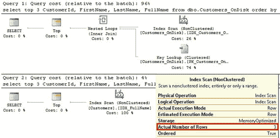
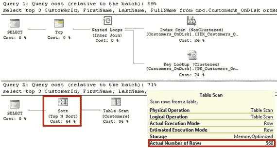
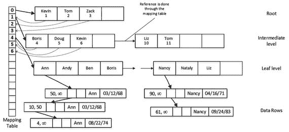
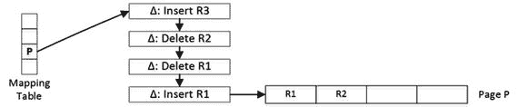
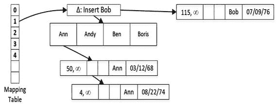

# 索引与排序

让我们运行一些查询，以升序选择多行数据，这与索引的排序顺序相匹配。清单 [5-5] 展示了这些查询。

```sql
select top 3 CustomerId, FirstName, LastName, FullName
from dbo.Customers_OnDisk
order by FullName ASC;
select top 3 CustomerId, FirstName, LastName, FullName
from dbo.Customers
order by FullName ASC;
```

**清单 5-5.**
非聚集索引与排序顺序：按索引键列以相同顺序选择数据

图 [5-1] 展示了这些查询的执行计划。SQL Server 从最小的键值开始扫描索引，并在读取三行后停止。除了基于磁盘的数据需要的 Key Lookup 操作外，两个查询的执行计划是相似的。SQL Server 使用 Key Lookup 从表的聚集索引中获取 `FirstName` 和 `LastName` 列的值。对于内存优化表，则不需要 Key Lookup，因为其中的索引指针是实际数据行的一部分，并且索引覆盖了查询中的所有行内列。



**图 5-1.**
当 `ORDER BY` 条件与索引排序顺序匹配时的执行计划

如果需要以降序排序输出，情况就会发生变化，如清单 [5-6] 所示。

```sql
select top 3 CustomerId, FirstName, LastName, FullName
from dbo.Customers_OnDisk
order by FullName DESC;
select top 3 CustomerId, FirstName, LastName, FullName
from dbo.Customers
order by FullName DESC;
```

**清单 5-6.**
非聚集索引与排序顺序：按索引键列以相反顺序选择数据

如图 [5-2] 所示，由于 B-Tree 索引的双向特性，SQL Server 能够以与定义相反的顺序扫描基于磁盘表的索引。然而，对于内存优化表来说情况并非如此，因为其中的索引是单向的。SQL Server 决定先扫描表，然后再对数据进行排序。



**图 5-2.**
当 `ORDER BY` 条件与索引排序顺序相反时的执行计划

最后，索引统计信息的行为（我在上一章讨论过）仍然适用于非聚集索引。SQL Server 在创建索引时创建统计信息；但是，自动更新统计信息的行为取决于创建表时的数据库兼容级别。

## 非聚集索引内部结构

非聚集索引使用一种无锁且无闩锁的 B-Tree 变体，称为 Bw-Tree，它由 Microsoft Research 在 2011 年设计。让我们详细了解一下 Bw-Tree 的结构。

### Bw-Tree 概述

与 B-Tree 类似，Bw-Tree 中的索引页包含一组有序的索引键值。然而，Bw-Tree 的页面没有固定大小，并且在构建后是不可变的。不过，页面的最大尺寸为 8KB。

非聚集索引叶子级别的行包含指向具有相同索引键值的数据行链的指针。这与哈希索引的工作方式类似，多行和/或一行的多个版本被链接在一起。表中的每个索引都会在行中的索引指针数组中添加一个指针，无论其类型是哈希还是非聚集索引。

非聚集索引中的根级别和中间级别被称为内部页面。与 B-Tree 索引类似，内部页面指向索引中的下一级别。但是，它们不是指向实际的数据页，而是使用一个逻辑页面 ID (`PID`)，这是一个单独的类数组结构（称为映射表）中的位置（偏移量）。反过来，映射表中的每个元素都包含一个指向实际索引页的指针。映射表允许 In-Memory OLTP 在需要更改它们引用的下一级别页面时，避免重建内部页面（本章后面会详细介绍）。在这种情况下，只会更新映射表指针。

图 [5-3] 展示了一个非聚集索引和映射表的例子。来自内部页面的每一行索引都存储了下一级别页面上的最高键值和 `PID`。这与 B-Tree 索引不同，在 B-Tree 索引中，中间级别和根级别的索引行存储的是下一级别页面的最低键值。另一个区别是，Bw-Tree 中的页面没有链接在双链表中。每个页面都知道同一级别下一页的 `PID`，但不知道前一页的 `PID`。尽管在图 [5-3] 中它看起来像一个指针（箭头），但该链接是通过映射表完成的，类似于指向下一级别页面的链接。



**图 5-3.**
非聚集索引结构

尽管 Bw-Tree 看起来与 B-Tree 相似，但有一个概念上的区别：基于磁盘的 B-Tree 索引的叶子级别由索引中每个数据行的独立索引行组成。如果多个数据行具有相同的键值，则索引将存储多个具有相同索引键的叶子级别行。

相反，内存中的非聚集索引存储一个指向行链的索引行（指针），该行链包含所有具有相同键值的数据行。索引中每个键值只存储一个索引行（指针）。你可以在图 [5-3] 中看到这一点，其中索引的叶子级别对于键值 `Ann` 和 `Nancy` 只有单行，即使行链包含每个值的多个数据行。

> **提示**
> 你可以通过查看第 [3] 章中的图 [3-1] 和图 [3-2] 来比较 B-Tree 和 Bw-Tree 索引的结构，这些图展示了基于磁盘表的聚集和非聚集 B-Tree 索引。


### 索引页与增量记录

如前所述，非聚集索引中的页面一旦构建完成就是不可变的。当需要更新时，SQL Server 会构建一个该页面的新版本，并替换映射表中的页面指针，这样就避免了更改引用旧（已废弃）页面的内部页面。

每当 SQL Server 需要更改一个叶级索引页时，它会创建一到两个表示该更改的增量记录。`INSERT` 和 `DELETE` 操作会生成单个插入或删除增量记录，而 `UPDATE` 操作会生成两个增量记录：一个删除旧值，另一个插入新值。同一索引页的增量记录通过一个内存指针链链接起来，链中的最后一个指针指向实际的索引页。SQL Server 还会用链中第一个增量记录的地址替换映射表中的指针。

图 5-4 展示了一个叶级页面和增量记录的示例，该示例基于以下按顺序发生的操作：更新了 R1 索引行，删除了 R2 行，并插入了 R3 行。



图 5-4.
增量记录与非聚集索引叶级页面

> 注意
> 内存 OLTP 引擎的内部实现保证了多个会话不能同时更新各种内存 OLTP 对象中的内存指针，从而避免彼此覆盖对方的更改。我将在附录 A 中详细讨论此过程。

非聚集索引的内部页和叶级页由两个区域组成：头部和数据。头部区域包含有关页面的信息，例如：

*   `PID`：在映射表中的位置（偏移量）
*   `Page type`：页面类型，如叶级、内部、增量或特殊页面
*   `Right-page PID`：映射表中下一个页面的位置（偏移量）
*   `Height`：从当前页面到索引叶级的层数
*   `Key values`：页面上存储的键值（索引行）数量
*   `Delta record statistics`：增量记录的数量及增量键值所使用的空间
*   `Max key value`：页面上键的最大值

页面的数据区域根据索引键数据类型的不同，包含两个或三个数组。这些数组如下：

*   `Values`：一个 8 字节指针数组。内部页存储下一级页面的 PID。叶级页存储指向具有相应键值的行链中第一行的指针。值得注意的是，尽管 PID 需要 4 字节来存储一个值，但 SQL Server 使用 8 字节元素以保持内部页和叶级页之间页面结构的一致。
*   `Keys`：页面上存储的键值数组。
*   `Offsets`：一个 2 字节数组，包含 `Keys` 数组中各个键值的起始偏移量。只有当键包含可变长度数据时才会存储偏移量。

简而言之，增量记录是单记录的索引数据页。增量数据页的结构与内部页和叶级页的结构相似。但是，增量数据页不存储 `Values` 和 `Keys` 数组，而是存储操作码（`insert` 或 `delete`）、单个键值以及指向行链中第一行数据的指针。

图 5-5 展示了一个叶级索引页的示例，其中包含一个针对 `Bob` 的插入增量记录。该增量记录指向 `Bob` 值在逻辑上所属的叶级索引页，并且它还具有指向索引键值为 `Bob` 的数据行链的指针。从概念上讲，您可以将插入增量记录视为叶级索引行，但它在物理上与叶级索引页是分离的。另一方面，删除增量记录则表明该叶级索引行已被删除。



图 5-5.
带有一个插入增量记录的叶级索引页

当访问索引页时，SQL Server 需要遍历并分析所有增量记录。可以想见，过长的增量记录链会影响性能。在这种情况下，SQL Server 会合并增量记录并重建索引页，创建一个新的页面。新创建的页面具有相同的 `PID` 并替换旧页面，旧页面则被标记为待垃圾回收。页面的替换通过更改映射表中的指针来完成。SQL Server 不需要更改内部页，因为它们使用映射表来引用叶级页。

重建过程在以下时刻触发：当一个页面链中已有 16 个增量记录时，又为该页面创建了一个新的增量记录。触发重建的增量记录所描述的操作会被合并到新创建的页面中。

除了增量记录合并外，还有两个其他过程可以创建新的或删除现有的索引页。第一个过程是 `page splitting`，当页面没有足够的空闲空间来容纳新的数据行时发生。另一个过程是 `page merging`，当删除操作导致索引页的占用空间低于最大页面大小（目前为 8KB）的 10%，或者当索引页仅包含单个行时发生。

> 注意
> 我将在附录 B 中深入讨论 `page splitting` 和 `page merging` 过程。


