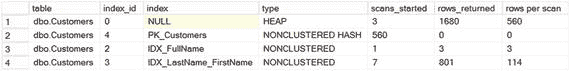
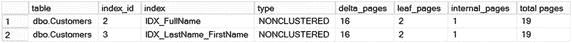
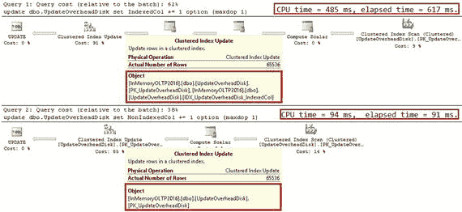
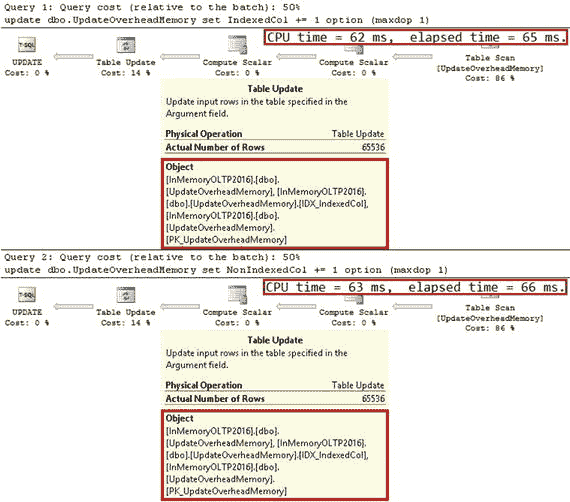

# 获取非聚集索引信息

除了第 4 章讨论的`sys.dm_db_xtp_hash_index_stats`视图外，SQL Server 还提供了另外两个视图来获取内存优化表上的索引信息。这些视图提供的数据是自内存优化表加载到内存以来收集的，该加载过程在数据库启动时发生。

## 使用 `sys.dm_db_xtp_index_stats`

你可以使用`sys.dm_db_xtp_index_stats`视图获取有关哈希索引和非聚集索引的索引访问方法以及幽灵行的信息。该视图中值得注意的列如下：

*   `xtp_object_id` 对应于内存 OLTP 对象的内部 ID。当你修改表（这会在后台重建表）时，此值可能会更改。
*   `scans_started` 显示索引中行链被扫描的次数。由于索引的特性，每次操作（如`SELECT`、`INSERT`、`UPDATE`和`DELETE`）都要求 SQL Server 扫描一个行链并递增此列。
*   `rows_returned` 表示返回到执行计划中下一个运算符的累计行数。它不一定与返回到客户端的行数匹配，因为执行计划中的后续运算符可能会改变它。
*   `rows_touched` 表示在索引中访问的累计行数。
*   `rows_expired` 显示检测到的过期行数。我将在第 11 章讨论垃圾回收过程时更详细地讨论这一点。
*   `rows_expired_removed` 返回已从索引行链中解除链接的过期行数。在讨论垃圾回收时，我也会更详细地讨论这一点。

代码清单 5-7 显示了返回有关`dbo.Customers`表上定义索引信息的查询。

```sql
select
    s.name + '.' + t.name as [table],
    i.index_id,
    i.name as [index],
    i.type_desc as [type],
    st.scans_started,
    st.rows_returned,
    iif(st.scans_started = 0, 0, floor(st.rows_returned / st.scans_started)) as [rows per scan]
from
    sys.dm_db_xtp_index_stats st
    join sys.tables t on st.object_id = t.object_id
    join sys.indexes i on st.object_id = i.object_id and st.index_id = i.index_id
    join sys.schemas s on s.schema_id = t.schema_id
where
    s.name = 'dbo' and t.name = 'Customers'
```

**代码清单 5-7.** 查询 `sys.dm_db_xtp_index_stats` 视图

图 5-6 展示了查询的输出结果。每次扫描返回大量行可能表明索引扫描繁重，这可能是索引策略不佳和/或查询编写不良的标志。



同样重要的是要注意，该视图会返回表堆对象（`index_id=0`）的行。此堆为表中的数据行分配内存。在执行表扫描操作时，内存 OLTP 会访问此堆。我将在下一章详细讨论它。

> **注意**
> 你可以在 [`https://docs.microsoft.com/en-us/sql/relational-databases/system-dynamic-management-views/sys-dm-db-xtp-index-stats-transact-sql`](https://docs.microsoft.com/en-us/sql/relational-databases/system-dynamic-management-views/sys-dm-db-xtp-index-stats-transact-sql) 阅读更多关于 `sys.dm_db_xtp_index_stats` 视图的信息。

## 使用 `sys.dm_db_xtp_nonclustered_index_stats`

`sys.dm_db_xtp_nonclustered_index_stats` 视图返回有关非聚集索引的信息。它包括有关索引中页面总数以及页面拆分、合并和整合相关统计信息。

代码清单 5-8 显示了有关`dbo.Customers`表上定义的非聚集索引的信息。图 5-7 显示了查询的输出。



```sql
select
    s.name + '.' + t.name as [table],
    i.index_id,
    i.name as [index],
    i.type_desc as [type],
    st.delta_pages,
    st.leaf_pages,
    st.internal_pages,
    st.leaf_pages + st.delta_pages + st.internal_pages as [total pages]
from
    sys.dm_db_xtp_nonclustered_index_stats st
    join sys.tables t on st.object_id = t.object_id
    join sys.indexes i on st.object_id = i.object_id and st.index_id = i.index_id
    join sys.schemas s on s.schema_id = t.schema_id
where
    s.name = 'dbo' and t.name = 'Customers'
```

**代码清单 5-8.** 查询 `sys.dm_db_xtp_nonclustered_index_stats` 视图

> **注意**
> 你可以在 [`https://docs.microsoft.com/en-us/sql/relational-databases/system-dynamic-management-views/sys-dm-db-xtp-nonclustered-index-stats-transact-sql`](https://docs.microsoft.com/en-us/sql/relational-databases/system-dynamic-management-views/sys-dm-db-xtp-nonclustered-index-stats-transact-sql) 阅读更多关于 `sys.dm_db_xtp_nonclustered_index_stats` 视图的信息。

## 索引设计注意事项

除了 Bw-Tree 索引的单向性质外，内存优化表上的非聚集索引与基于磁盘的表上的索引行为类似。它们也覆盖表中的所有行内列，这简化了索引过程。

然而，它们的行为有几个方面我想提一下。


### 数据修改开销

`内存优化表`上的索引会引入类似于磁盘基表上索引的数据修改开销。`内存中 OLTP`需要维护多个索引行链以及内部索引结构，例如哈希表和映射表，以及内部和叶非聚集索引页。

让我们详细看看这个开销。`清单 5-9`中的代码创建了一个磁盘基表并填充了 65,536 行数据。接着，它创建了两个内存优化表，分别包含两个和八个索引。

```sql
create table dbo.UpdateOverheadDisk
(
Id int not null,
IndexedCol int not null,
NonIndexedCol int not null,
Col3 int not null,
Col4 int not null,
Col5 int not null,
Col6 int not null,
Col7 int not null,
Col8 int not null,
constraint PK_UpdateOverheadDisk
primary key clustered(ID)
);
create nonclustered index IDX_UpdateOverheadDisk_IndexedCol
on dbo.UpdateOverheadDisk(IndexedCol);
;with N1(C) as (select 0 union all select 0) -- 2 rows
,N2(C) as (select 0 from N1 as t1 cross join N1 as t2) -- 4 rows
,N3(C) as (select 0 from N2 as t1 cross join N2 as t2) -- 16 rows
,N4(C) as (select 0 from N3 as t1 cross join N3 as t2) -- 256 rows
,N5(C) as (select 0 from N4 as t1 cross join N4 as t2) -- 65,536 rows
,Ids(Id) as (select row_number() over (order by (select null)) from N5)
insert into dbo.UpdateOverheadDisk(ID,IndexedCol,NonIndexedCol,Col3
,Col4,Col5,Col6,Col7,Col8)
select Id, Id, Id, Id, Id, Id, Id, Id, Id from Ids;
go
create table dbo.UpdateOverheadMemory
(
Id int not null
constraint PK_UpdateOverheadMemory
primary key nonclustered
hash with (bucket_count=2097152),
IndexedCol int not null,
NonIndexedCol int not null,
Col3 int not null,
Col4 int not null,
Col5 int not null,
Col6 int not null,
Col7 int not null,
Col8 int not null,
index IDX_IndexedCol nonclustered(IndexedCol)
)
with (memory_optimized=on, durability=schema_only);
create table dbo.UpdateOverhead8Idx
(
Id int not null
constraint PK_UpdateOverhead8Idx
primary key nonclustered
hash with (bucket_count=2097152),
IndexedCol int not null,
NonIndexedCol int not null,
Col3 int not null,
Col4 int not null,
Col5 int not null,
Col6 int not null,
Col7 int not null,
Col8 int not null,
index IDX_IndexedCol nonclustered(IndexedCol),
index IDX_Col3 nonclustered(Col3),
index IDX_Col4 nonclustered(Col4),
index IDX_Col5 nonclustered(Col5),
index IDX_Col6 nonclustered(Col6),
index IDX_Col7 nonclustered(Col7),
index IDX_Col8 nonclustered(Col8)
)
with (memory_optimized=on, durability=schema_only);
```
`清单 5-9. 插入开销：表创建`

让我们使用`清单 5-10`中的代码将数据插入两个内存优化表。

```sql
insert into dbo.UpdateOverheadMemory(ID,IndexedCol,NonIndexedCol,Col3
,Col4,Col5,Col6,Col7,Col8)
select ID,IndexedCol,NonIndexedCol,Col3,Col4,Col5,Col6,Col7,Col8
from dbo.UpdateOverheadDisk;
insert into dbo.UpdateOverhead8Idx(ID,IndexedCol,NonIndexedCol,Col3
,Col4,Col5,Col6,Col7,Col8)
select ID,IndexedCol,NonIndexedCol,Col3,Col4,Col5,Col6,Col7,Col8
from dbo.UpdateOverheadDisk;
```
`清单 5-10. 插入开销：向内存优化表插入数据`

在我的环境中，`INSERT`语句的执行时间分别为 138 毫秒和 613 毫秒。如您所见，在`dbo.UpdateOverhead8Idx`表中维护六个额外的索引为该操作增加了显著开销。

在`UPDATE`操作期间也有开销；然而，这与磁盘基表不同。磁盘基表上的`非聚集索引`是存储表中数据副本的独立数据结构。`SQL Server`维护所有这些副本；因此，更新操作会修改所有包含已更新列的索引。但是，当您更新的列未出现在非聚集索引中时，则没有开销。

另一方面，`内存中 OLTP`总是生成新的行对象，无论更新了哪些列。`SQL Server`维护所有索引行链，这导致即使修改的是非索引列也会产生开销。

让我们看一个例子，对磁盘基表`dbo.UpdateOverheadDisk`执行两次更新，分别修改其中的索引列和非索引列。这两个操作都更改了整数定长列的值，不会导致页拆分。`清单 5-11`展示了代码。

```sql
update dbo.UpdateOverheadDisk
set IndexedCol += 1;
update dbo.UpdateOverheadDisk
set NonIndexedCol += 1;
```
`清单 5-11. 更新开销：磁盘基表更新`

`图 5-8`说明了两个语句的执行计划和执行时间。如您所见，更新索引列迫使`SQL Server`修改了两个索引，这比更新非索引列花费的时间显著更长。



`图 5-8. 磁盘基表更新的执行计划和时间`

`清单 5-12`显示了针对内存优化表的相同`UPDATE`语句。两个语句都生成了新的数据行对象，并且必须维护表上的两个索引。无论更新了哪些列，这种开销总是存在。

```sql
update dbo.UpdateOverheadMemory
set IndexedCol += 1;
update dbo.UpdateOverheadMemory
set NonIndexedCol += 1;
```
`清单 5-12. 更新开销：内存优化表更新`

`图 5-9`说明了这些语句的执行计划和执行时间。



`图 5-9. 内存优化表更新的执行计划和时间`

内存优化表上的索引也会延迟垃圾回收。`内存中 OLTP`需要从所有索引链中解除链接旧的过时行，当一行被包含在多个索引中时，这可能需要更长时间。

**注意**
我将在`第 11 章`深入讨论垃圾回收过程。

如您所见，不必要的索引会给系统带来开销。您应避免创建它们，并创建支持工作负载所需的最小索引集。


## 哈希索引与非聚集索引

如您所知，哈希索引仅在查询对所有索引列使用相等谓词的点查询场景中有效。而非聚集索引则能在更广泛的场景中使用，这通常使得选择变得显而易见。当您的查询受益于点查询以外的场景时，应使用非聚集索引。

在点查询的情况下，情况则不那么明显。对于哈希索引，SQL Server 可以通过调用哈希函数并计算哈希值，单步定位到哈希桶，这是数据行链的入口点。对于非聚集索引，SQL Server 必须遍历 Bw-Tree 以找到叶页，步骤数取决于索引的高度以及其中增量记录的数量。

即使非聚集索引需要更多步骤来找到数据行链的入口点，但与哈希索引相比，该链可能更小。非聚集索引中的行链基于唯一的索引键值构建。在哈希索引中，行链基于非唯一的哈希键构建，并且可能由于哈希冲突而更大，尤其是在 `bucket_count` 值不足时。

让我们比较一下点查询场景中哈希索引和非聚集索引的性能。代码清单 5-13 创建了四个结构相同的表。其中三个表在 `Value` 列上定义了哈希索引，使用了不同的 `bucket_count` 值。第四个表则在同一列上定义了非聚集索引。最后，代码使用相同的数据填充所有表。

```sql
create table dbo.Hash_131072
(
Id int not null
constraint PK_Hash_131072
primary key nonclustered
hash with (bucket_count=131072),
Value int not null,
index IDX_Value hash(Value)
with (bucket_count=131072)
)
with (memory_optimized=on, durability=schema_only);
create table dbo.Hash_16384
(
Id int not null
constraint PK_Hash_16384
primary key nonclustered
hash with (bucket_count=16384),
Value int not null,
index IDX_Value hash(Value)
with (bucket_count=16384)
)
with (memory_optimized=on, durability=schema_only);
create table dbo.Hash_1024
(
Id int not null
constraint PK_Hash_1014
primary key nonclustered
hash with (bucket_count=1024),
Value int not null,
index IDX_Value hash(Value)
with (bucket_count=1024)
)
with (memory_optimized=on, durability=schema_only);
create table dbo.NonClusteredIdx
(
Id int not null
constraint PK_NonClusteredIdx
primary key nonclustered
hash with (bucket_count=131072),
Value int not null,
index IDX_Value nonclustered(Value)
)
with (memory_optimized=on, durability=schema_only);
go
;with N1(C) as (select 0 union all select 0) -- 2 rows
,N2(C) as (select 0 from N1 as t1 cross join N1 as t2) -- 4 rows
,N3(C) as (select 0 from N2 as t1 cross join N2 as t2) -- 16 rows
,N4(C) as (select 0 from N3 as t1 cross join N3 as t2) -- 256 rows
,N5(C) as (select 0 from N4 as t1 cross join N4 as t2) -- 65,536 rows
,N6(C) as (select 0 from N5 as t1 cross join N1 as t2) -- 131,072 rows
,Ids(Id) as (select row_number() over (order by (select null)) from N6)
insert into dbo.Hash_131072(Id,Value)
select Id, Id
from ids
where Id <= 75000;
insert into dbo.Hash_16384(Id,Value)
select Id, Value
from dbo.Hash_131072;
insert into dbo.Hash_1024(Id,Value)
select Id, Value
from dbo.Hash_131072;
insert into dbo.NonClusteredIdx(Id,Value)
select Id, Value
from dbo.Hash_131072;
```

*代码清单 5-13. 哈希索引与非聚集索引的点查询性能：表创建*

不同数量的桶导致了索引中索引行链大小的不同。在此案例中，`dbo.Hash_131072`、`dbo.Hash_16384` 和 `dbo.Hash_1024` 表的平均链长分别为 1、4 和 73 行。

**提示**
您可以使用 `sys.dm_db_xtp_hash_index_stats` 视图和第 4 章中的代码清单 4-2 来分析哈希索引属性。

下一步，让我们使用代码清单 5-14 中的代码比较点查询性能。此代码对每个表触发 75,000 次点查询选择。

```sql
declare
@T table(Value int not null primary key)
insert into @T(Value)
select Id from dbo.Hash_131072;
select count(*)
from @T t
cross apply
(
select count(*) as Cnt
from dbo.Hash_131072 h
where h.Value = t.Value
) c
where c.Cnt > 0;
select count(*)
from @T t
cross apply
(
select count(*) as Cnt
from dbo.Hash_16384 h
where h.Value = t.Value
) c
where c.Cnt > 0;
select count(*)
from @T t
cross apply
(
select count(*) as Cnt
from dbo.Hash_1024 h
where h.Value = t.Value
) c
where c.Cnt > 0;
select count(*)
from @T t
cross apply
(
select count(*) as Cnt
from dbo.NonClusteredIdx h
where h.Value = t.Value
) c
where c.Cnt > 0;
```

*代码清单 5-14. 哈希索引与非聚集索引的点查询性能：选择数据*

表 5-1 显示了在我的环境中查询的执行时间。在桶数量充足的情况下，哈希索引的性能优于非聚集索引。然而，桶数量不足和行链过长会显著降低其性能，使其效率低于非聚集索引。

**表 5-1. 查询执行时间**

| | `Hash_131072` | `Hash_16384` | `Hash_1024` | `NonClusteredIdx` |
| :--- | :--- | :--- | :--- | :--- |
| 平均索引行链大小 | 1 | 4 | 73 | 不适用 |
| 执行时间 | 62 ms | 74 ms | 129 ms | 78 ms |

归根结底，这取决于对 `bucket_count` 的正确估算。不幸的是，数据的易变性使这项任务变得复杂，并要求您将未来的数据增长纳入分析。

在某些情况下，当数据相对静态时，您可以创建哈希索引，并高估其中的桶数量。以目录实体为例，例如 `Customers` 表及其 `CustomerId` 和 `Phone` 列。这些列上的哈希索引将提高点查询搜索和联接的性能。尽管客户群会随着时间增长，但这种增长率通常不会过高，预留一百万个空桶可能在很长一段时间内都足够用。每个索引将使用大约 8MB 的内存在大多数情况下是可以接受的。

另一方面，为 `Orders` 表中的 `OrderId` 列选择哈希索引则更危险。负载增长和数据保留规则的变化可能导致原始的 `bucket_count` 值不足。如果您计划监控系统并且能够承担重建索引期间的停机时间，这仍然可以接受；然而，在这种场景下，非聚集索引将是更安全的选择。

内存需求是另一个需要考虑的因素。对于哈希索引，内存使用取决于桶的数量。非聚集索引所需的内存量取决于索引键的大小和索引基数（索引键值的唯一性）。例如，如果一个表有一个 `varchar` 列，包含 1,000,000 个唯一值，每个值 100 字节，那么该列上的非聚集索引将需要大约 800MB 来支持 Bw-Tree 结构并在内部和叶索引页上存储键值。或者，具有 2,097,152 个桶的哈希索引将仅使用 16MB 的内存。

总而言之，对于点查询和相等联接，仅当您可以正确估计桶的数量并将未来数据增长纳入分析时，才创建哈希索引。您还应该监控它们，并且在 `bucket_count` 变得不足时能够承担重建索引的停机时间。否则，请使用非聚集索引，这是更安全的选择，并且不依赖于桶的数量。


