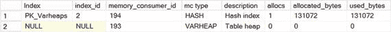
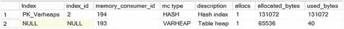
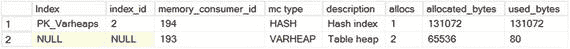
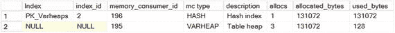
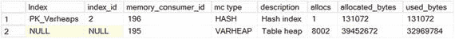
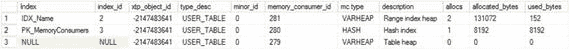
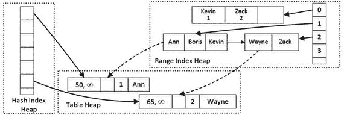
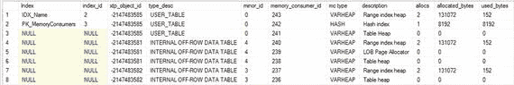
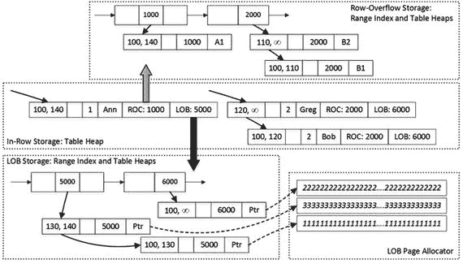

# 6. 内存使用者与行外存储

本章概述了内存 OLTP 如何为不同对象分配内存，并解释了行外列数据是如何存储的。它还说明了表中存在行外列对性能的影响，并解释了 SQL Server 如何选择需要存储在行外的列。

## 变量堆

内存 OLTP 数据库对象从称为变量堆的独立内存堆中分配内存。变量堆是响应并跟踪来自各种数据库对象的内存分配请求的数据结构，它们可以在需要时增长或缩小大小。所有消耗内存的数据库对象都称为内存使用者。

在内部，变量堆以不同大小的页面分配内存，其中 64KB 页面最为常见。每个页面为预定义大小的分配请求提供内存。例如，一个变量堆可以有两个 64KB 页面；一个处理 64 字节分配，另一个处理 256 字节分配。

让我们看一下代码清单 6-1 中所示的例子。该代码创建了带哈希索引的表，并使用 `sys.dm_db_xtp_memory_consumers` 视图分析了表的内存使用者。顾名思义，此视图提供有关数据库中内存使用者的信息。在本章和下一章中，你将看到几个与内存优化表相关的使用者，我将在第 12 章详细讨论此视图。

```sql
create table dbo.Varheaps
(
Col varchar(8000) not null
constraint PK_Varheaps
primary key nonclustered hash
with (bucket_count=16384)
)
with (memory_optimized = on, durability = schema_only);
select
i.name as [Index], i.index_id, c.memory_consumer_id
,c.memory_consumer_type_desc as [mc type]
,c.memory_consumer_desc as [description], c.allocation_count as [allocs]
,c.allocated_bytes, c.used_bytes
from
sys.dm_db_xtp_memory_consumers c
left outer join sys.indexes i on
c.object_id = i.object_id and c.index_id = i.index_id
where
c.object_id = object_id('dbo.Varheaps');
```

代码清单 6-1. 分析变量堆：表创建

如图 6-1 所示，该表有两个内存使用者/变量堆。第一个类型为 `HASH` 的变量堆为哈希索引中的哈希表提供内存。该哈希索引有 16,384 个桶，使用了 131,072 字节的内存，这些内存是在表创建时分配的。第二个类型为 `VARHEAP`、描述为“Table heap”的变量堆为数据行提供内存。由于表为空，它尚未分配任何内存。



图 6-1. 创建表后的内存使用者

让我们使用 `INSERT INTO dbo.Varheaps(Col) VALUES('a')` 语句向表中插入一行。如果你再次使用代码清单 6-1 中的 `SELECT` 语句检查内存使用者，你将看到图 6-2 所示的结果。如图所示，表变量堆分配了一个 64KB 内存页，并提供了 40 字节来存储数据行对象。



图 6-2. 插入第一行后的内存使用者

现在，使用 `INSERT INTO dbo.Varheaps(Col) VALUES('b')` 语句插入另一行大小相同的数据。图 6-3 说明了第二次插入后的内存使用者状态。两行数据大小相同，因此表堆从同一个已分配的内存页为第二行提供了内存。



图 6-3. 插入第二行后的内存使用者

最后，使用 `INSERT INTO dbo.Varheaps(Col) VALUES('ccccc')` 语句插入另一行不同大小的数据。这行数据需要分配不同大小的内存，表变量堆分配了另一个 64KB 内存页来处理这些分配。图 6-4 说明了这一点。



图 6-4. 插入第三行后的内存使用者

显然，为每一个可能的分配大小请求分配单独的内存页是低效的。在某些情况下，变量堆会从一个服务于更大尺寸分配的页面提供内存。例如，62 字节的内存分配可能来自一个服务 64 字节分配的页面。即使内存使用者请求了更小的内存分配，该页面仍会为此分配保留并使用 64 字节内存。

让我们看看实际运行情况，执行代码清单 6-2 中的代码。它插入了 `Col` 值从 2 个字符到 8000 个字符不等的数据行。

```sql
declare
@I int = 2
while @I <= 8000
begin
insert into dbo.Varheaps(Col) values(replicate('0',@I));
set @I += 1;
end;
```

代码清单 6-2. 分析变量堆：插入各种大小的行

图 6-5 说明了变量堆的状态。它分配了 39,452,673 字节内存，相当于 602 个 64KB 内存页，尽管表中只存储了 8,000 种可能的数据行大小组合。



图 6-5. 用数据填充表后的内存使用者

按变量堆分离内存使用者允许你在每个对象的基础上跟踪内存使用情况。它还有助于 SQL Server 优化一些内部操作。例如，当你删除或更改表时，它允许垃圾回收过程更快地释放内存。

这种架构还允许 SQL Server 以非常高效的方式执行表扫描操作来扫描变量堆页面。每个变量堆页面服务于相同大小的分配请求，因此很容易计算存储在页面上的每个对象的位置。与索引扫描操作相比，这使得表（变量堆）扫描操作更加高效。


**代码清单 6-3.**
分析内存消费者：行内存储

如图 6-6 所示，是查询的输出结果。`xtp_object_id` 列代表内部内存优化 OLTP 的 `object_id`，它与 SQL Server 的 `object_id` 不同。`USER_TABLE` 类型表明该 `varheap` 属于主表对象。



**图 6-6.**
内存消费者信息（行内存储）

如图 6-6 所示，该表有三个内存消费者，它们具有与主表相同的 `xtp_object_id` 值。范围索引堆存储非聚集索引的内部页和叶页。哈希索引堆存储索引的哈希表。最后，表堆存储实际的表行。图 6-7 说明了这一点。



**图 6-7.**
表内存消费者

### 行外存储

现在，让我们修改表并添加行外存储列，如代码清单 6-4 所示。`RowOverflowCol` 使行的大小超过 8060 字节，它将被存储在行外。

```sql
alter table dbo.MemoryConsumers add
RowOverflowCol varchar(8000),
LOBCol varchar(max);
```

**代码清单 6-4.**
添加行外列

现在，如果你再次使用代码清单 6-3 中的查询获取内存消费者列表，你将看到如图 6-8 所示的输出。值得注意的是，`USER_TABLE` 对象的 `xtp_object_id` 列已更改，因为 `ALTER TABLE` 操作重建了表，并在内部创建了新的表对象。



**图 6-8.**
具有行外存储的内存消费者

如你所见，两个行外列都引入了它们自己的范围索引堆和表堆内存消费者。此外，LOB 列还添加了一个 LOB 页分配器内存消费者（稍后会详细介绍）。`minor_id` 列提供了内存消费者所属表中的 `column_id` 值。两个行外列的 `varheap` 都有它们自己的 `xtp_object_id` 值，这表明这些列在内部被存储为不同的对象。

正如你从输出中猜到的那样，SQL Server 将行溢出列和 LOB 列都存储在单独的内部表中。这些表中的行由一个作为非聚集索引实现的 8 字节人工主键和行外列值组成。主行通过那个人工键引用行外列，该键在行创建时生成。值得重申的是，这种引用是通过人工值而不是内存指针完成的。

这种方法允许内存优化 OLTP 通过为行外列使用不同的生命周期来将它们与主行解耦。例如，如果你更新主行数据而不触及行外列，SQL Server 将不会生成行外列行的新版本。反之，当只修改行外数据时，主行保持不变。

## LOB 存储

内存优化 OLTP 将 LOB 数据存储在 LOB 页分配器提供的内存中。该消费者不受 8060 字节行分配的限制，可以分配大量内存来存储数据。LOB 列的表堆中的行包含指向 LOB 页分配器中行数据的指针。

假设你运行了几个 DML 语句，其全局事务时间戳值如代码清单 6-5 所示。

```sql
-- Global Transaction Timestamp: 100
insert into dbo.MemoryConsumers(ID, Name, RowOverflowCol, LobCol)
values
(1,'Ann','A1',replicate(convert(varchar(max),'1'),100000))
,(2,'Bob','B1',replicate(convert(varchar(max),'2'),100000));
-- Global Transaction Timestamp: 110
update dbo.MemoryConsumers set RowOverflowCol = 'B2' where ID = 2;
-- Global Transaction Timestamp: 120
update dbo.MemoryConsumers set Name= 'Greg' where ID = 2;
-- Global Transaction Timestamp: 130
update dbo.MemoryConsumers
set LobCol = replicate(convert(varchar(max),'3'),100000)
where ID = 1;
-- Global Transaction Timestamp: 140
delete from dbo.MemoryConsumers where ID = 1;
```

**代码清单 6-5.**
修改表中的数据

图 6-9 说明了数据的状态以及行之间的链接。为简单起见，它省略了主表中的哈希表和非聚集索引结构，以及行外列的非聚集索引的内部页。



**图 6-9.**
行内与行外存储

## 总结

SQL Server 在表创建阶段根据表架构决定哪些列应存储在行外。`(n)varchar(max)` 和 `varbinary(max)` 列总是作为 LOB 列存储在行外。此外，当表定义中的数据行大小超过 8060 字节时，最大的非 `(max)` 可变长度列（或多个列）将作为行溢出列（或多个列）存储在行外。

这种行为与基于磁盘的表不同，后者是根据每行的数据行大小在每行基础上做出此决定的。对于基于磁盘的表，如果 LOB 列和大型可变长度列的数据能放入数据页，则它们会存储在行内。对于内存优化表则不是这样。行外列无论数据大小如何，总是存储在行外。例如，`varchar(max)` 列中的一个字符串即使总行大小小于 8060 字节，也会作为 LOB 数据存储在行外。


## 溢出存储的性能影响

行内数据与溢出数据的解耦，降低了在数据修改过程中创建额外行版本的开销。然而，在插入和删除数据时，这会增加额外的开销。在插入阶段，SQL Server 可能需要创建多个行对象；在删除阶段，则需要更新多行的 `EndTs` 值。它还需要为溢出列维护内部表。

让我们看一个示例，创建两个具有相似架构的表，如代码清单 6-6 所示。其中一个表有 20 个 `varchar(3)` 列，而另一个则使用 20 个 `varchar(max)` 列。接下来，你将用每个列中包含 1 个字符的值填充这些表，各 100,000 行。

```sql
create table dbo.DataInRow
(
ID int not null
constraint PK_DataInRow
primary key nonclustered hash(ID)
with (bucket_count = 262144)
,Col1 varchar(3) not null
,Col2 varchar(3) not null
,Col3 varchar(3) not null
,Col4 varchar(3) not null
,Col5 varchar(3) not null
,Col6 varchar(3) not null
,Col7 varchar(3) not null
,Col8 varchar(3) not null
,Col9 varchar(3) not null
,Col10 varchar(3) not null
,Col11 varchar(3) not null
,Col12 varchar(3) not null
,Col13 varchar(3) not null
,Col14 varchar(3) not null
,Col15 varchar(3) not null
,Col16 varchar(3) not null
,Col17 varchar(3) not null
,Col18 varchar(3) not null
,Col19 varchar(3) not null
,Col20 varchar(3) not null
)
with (memory_optimized = on, durability = schema_only);
create table dbo.DataOffRow
(
ID int not null
constraint PK_DataOffRow
primary key nonclustered hash(ID)
with (bucket_count = 262144)
,Col1 varchar(max) not null
,Col2 varchar(max) not null
,Col3 varchar(max) not null
,Col4 varchar(max) not null
,Col5 varchar(max) not null
,Col6 varchar(max) not null
,Col7 varchar(max) not null
,Col8 varchar(max) not null
,Col9 varchar(max) not null
,Col10 varchar(max) not null
,Col11 varchar(max) not null
,Col12 varchar(max) not null
,Col13 varchar(max) not null
,Col14 varchar(max) not null
,Col15 varchar(max) not null
,Col16 varchar(max) not null
,Col17 varchar(max) not null
,Col18 varchar(max) not null
,Col19 varchar(max) not null
,Col20 varchar(max) not null
)
with (memory_optimized = on, durability = schema_only);
declare
@Nums table(Num int not null primary key)
;with N1(C) as (select 0 union all select 0) -- 2 rows
,N2(C) as (select 0 from N1 as t1 cross join N1 as t2) -- 4 rows
,N3(C) as (select 0 from N2 as t1 cross join N2 as t2) -- 16 rows
,N4(C) as (select 0 from N3 as t1 cross join N3 as t2) -- 256 rows
,N5(C) as (select 0 from N4 as t1 cross join N4 as t2) -- 65,536 rows
,N6(C) as (select 0 from N5 as t1 cross join N1 as t2) -- 131,072 rows
,Ids(Id) as (select row_number() over (order by (select null)) from N6)
insert into @Nums(Num)
select Id from Ids where Id <= 100000;
insert into dbo.DataInRow(ID,Col1,Col2,Col3,Col4,Col5,Col6,Col7,Col8,Col9
,Col10,Col11,Col12,Col13,Col14,Col15,Col16,Col17,Col18,Col19,Col20)
select Num,'0','0','0','0','0','0','0','0','0','0','0','0','0'
,'0','0','0','0','0','0','0'
from @Nums;
insert into dbo.DataOffRow(ID,Col1,Col2,Col3,Col4,Col5,Col6,Col7,Col8,Col9
,Col10,Col11,Col12,Col13,Col14,Col15,Col16,Col17,Col18,Col19,Col20)
select Num,'0','0','0','0','0','0','0','0','0','0','0','0','0'
,'0','0','0','0','0','0','0'
from @Nums;
```
代码清单 6-6. 溢出存储性能影响：插入操作

表 6-1 展示了在我的环境中 `INSERT` 语句的执行时间。如你所见，管理多个内部表会带来相当大的性能开销。

表 6-1. INSERT 语句的执行时间

| `dbo.DataInRow` 插入时间 | `dbo.DataOffRow` 插入时间 |
| --- | --- |
| 157 ms | 8,062 ms |

图 6-10 展示了来自两个表的部分内存消耗者列表。正如你已知，`dbo.DataOffRow` 表中的每个 `varchar(max)` 列都会引入一个包含三个内存消耗者的内部表。

`A340879_2_En_6_Fig10_HTML.jpg`

图 6-10. 表的内存消耗者

代码清单 6-7 展示了分别计算 `dbo.DataInRow` 和 `dbo.DataOffRow` 表总内存使用情况的查询。

```sql
select
sum(c.allocated_bytes) / 1024 as [Allocated KB]
,sum(c.used_bytes) / 1024 as [Used KB]
from
sys.dm_db_xtp_memory_consumers c
where
c.object_id = object_id('dbo.DataInRow');
select
sum(c.allocated_bytes) / 1024 as [Allocated KB]
,sum(c.used_bytes) / 1024 as [Used KB]
from
sys.dm_db_xtp_memory_consumers c
where
c.object_id = object_id('dbo.DataOffRow');
```
代码清单 6-7. 溢出存储性能影响：内存使用情况

如图 6-11 所示，`dbo.DataOffRow` 表使用的内存是 `dbo.DataInRow` 表的 30 多倍。每个溢出列会给每个非空值增加 64 字节以上的开销。此开销包含以下部分：

*   溢出数据行中 32 字节的行头和索引数组
*   行内存储、并在两个位置（非聚集索引的叶子级别和溢出数据行中）溢出存储的 8 字节人工键
*   叶子级别索引行上的 8 字节指针
*   存储溢出列内部表中非聚集索引结构的额外内存

`A340879_2_En_6_Fig11_HTML.jpg`

图 6-11. 表内存使用情况

对于在单独的 varheap 中存储数据的 LOB 列，开销甚至更大（80 字节以上），因为每行需要两个额外的指针。此外，对于每 8KB 的 LOB 数据，还有 32 字节的额外开销，如果存储的值相对较小，这可能非常显著。

还有另一个重要的性能影响。在表上定义的索引并不能覆盖选择溢出数据的查询。SQL Server 需要遍历溢出列上的非聚集索引来获取它们的值。从概念上讲，这类似于基于磁盘的表中的键查找操作，只是方向相反，从聚集索引到非聚集索引。尽管与基于磁盘的表相比，开销显著更小，但它仍然是你希望避免的开销。

代码清单 6-8 展示了从表中所有溢出列选择数据的代码。SQL Server 需要遍历所有内部表中的非聚集索引来获取数据。

```sql
select count(*)
from dbo.DataInRow
where Col1='0' and Col2='0' and Col3='0' and Col4='0' and Col5='0'
and Col6='0' and Col7='0' and Col8='0' and Col9='0' and Col10='0'
and Col11='0' and Col12='0' and Col13='0' and Col14='0' and Col15='0'
and Col16='0' and Col17='0' and Col18='0' and Col19='0' and Col20='0';
select count(*)
from dbo.DataOffRow
where Col1='0' and Col2='0' and Col3='0' and Col4='0' and Col5='0'
and Col6='0' and Col7='0' and Col8='0' and Col9='0' and Col10='0'
and Col11='0' and Col12='0' and Col13='0' and Col14='0' and Col15='0'
and Col16='0' and Col17='0' and Col18='0' and Col19='0' and Col20='0';
```
代码清单 6-8. 溢出存储性能影响：选择开销

表 6-2 说明了在我环境中的执行时间。如你所见，对于溢出数据，执行时间几乎慢了 20 倍，这与表中的溢出列数量相对应。

表 6-2. SELECT 语句的执行时间

| `dbo.DataInRow` 选择时间 | `dbo.DataOffRow` 选择时间 |
| --- | --- |
| 86 ms | 1,750 ms |

当修改溢出列时，更新操作也会有开销。SQL Server 需要为每个受影响的列创建新的行对象。


同样地，数据的删除操作要求 SQL Server 删除所有内部表中的行。`表 6-3` 显示了从两张表中删除所有数据的 `DELETE` 语句的执行时间。

**表 6-3.** DELETE 语句的执行时间

| `dbo.DataInRow` 查询时间 | `dbo.DataOffRow` 查询时间 |
| --- | --- |
| 32 毫秒 | 1,406 毫秒 |

除非有正当理由，否则应避免使用行外存储。仅仅为了以防万一（即并未实际存储大量数据时）就将文本列定义为 `(n)varchar(max)` 显然是个糟糕的主意。别忘了，内存 OLTP 会根据表定义而非数据大小来使用行外存储。

## 总结

内存 OLTP 数据库对象从名为 `varheap` 的独立内存池中分配内存。`varheap` 是响应并跟踪来自各种数据库对象（称为内存使用者）的内存分配的数据结构。

与内存优化表相关的最常见 `varheap` 类型有三种。哈希索引 `varheap` 为哈希索引中的哈希表分配内存。范围索引 `varheap` 为非聚集索引页和映射表提供内存。最后，表池 `varheap` 为数据行分配内存。

每个行外列将数据存储在一个内部表中，该表包含一个实现为非聚集索引的 8 字节人工主键以及列数据。行溢出列则在列数据中存储实际值。而 LOB 列存储指向另一个 `LOB 页面分配器 varheap` 的指针，该 varheap 存储 LOB 值。数据行通过那个人工的 8 字节主键来引用行外列，而不是通过内存指针。

尽管行外存储简化了系统向内存 OLTP 的迁移，但使用时必须极其谨慎。每个非空的行外值都会增加 64 字节以上的开销。内部行外表在数据修改时会带来显著的性能影响。最后，为内存优化表定义的索引不覆盖行外列，查询需要像在基于磁盘的表上执行 `键查找` 操作一样遍历内部表。除非绝对必要，否则应避免使用行外存储。

