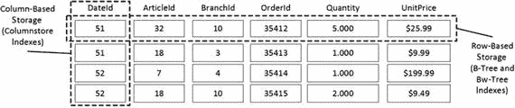
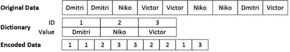
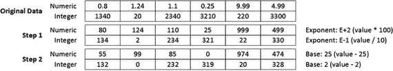

# 7. 列存储索引

本章概述了列式存储以及可在内存优化表上定义的聚集列存储索引。它解释了它们的内部结构，并讨论了几种可提升系统中数据仓库/报表和操作分析查询性能的最佳实践。

## 列式存储概述

尽管每个数据库系统都是独特的，但数据库领域定义了两种截然不同的工作负载模式。第一种是在线事务处理（OLTP）。OLTP 系统通常处理来自多个客户的大量并发事务。这些事务通常小而轻量，使用点查找搜索或小范围扫描。

第二种工作负载类型是数据仓库，包括分析、报表和决策支持。这些类型的用例使用执行聚合操作并处理大量数据的复杂查询。专用数据仓库系统中的数据通常是静态的，并且通常基于某些预定义的时间表进行更新。

例如，考虑一家向客户销售产品的公司。从其销售点（POS）系统发出的典型 OLTP 查询可能具有如下语义：提供此特定客户本周下达的订单列表。或者，数据仓库系统中的典型查询可能如下：提供本年度迄今为止的销售总额，按产品类别和客户地区对结果进行分组。

数据仓库系统与 OLTP 系统之间还存在其他差异。OLTP 系统中的数据通常是易变的。此类系统同时服务大量请求，并且它们通常具有与面向客户的查询相关联的性能 SLA。相比之下，数据仓库系统中的数据相对静态，通常基于固定时间表（如夜间或周末）进行更新。这些系统通常服务于少量客户，通常是业务分析师、经理和高管，由于需要处理的数据量较大，他们可以接受较长的查询执行时间。

从角度来看，简短的 OLTP 查询的响应时间通常需要在毫秒范围内。然而，对于复杂的数据仓库查询，几秒甚至几分钟的响应时间通常是可以接受的。

显然，几乎不可能找到没有混合 OLTP 和数据仓库工作负载的系统。即使公司已经实施了专用的数据仓库解决方案，OLTP 系统中也总是存在一定程度的报表和分析活动。更复杂的是，现在还有另一类任务称为操作分析，它变得越来越受欢迎。以 POS 系统为例，您可能希望监控最新的销售情况，并根据产品的受欢迎程度动态调整其销售价格。这要求您在近期且易变的 OLTP 数据上运行分析查询。

不幸的是，OLTP 和数据仓库系统需要不同的优化和性能调整方法。它们受益于不同的数据库模式和索引策略。例如，数据仓库数据库通常具有过度规范化的星型或雪花型数据库模式，包含少量巨大的事实表和许多维度表。这种设计对 OLTP 查询来说效率不高。

此外，OLTP 和数据仓库工作负载受益于不同的存储和处理技术。这一点需要一些解释。


## 基于行的存储与基于列的存储

在 SQL Server 中，经典的 B-Tree 索引和堆（`heaps`）使用基于行的存储（`row-based storage`）。属于一行的所有列都存储在单个行对象中。即使有些列可以存储在行外，它们也是从主数据行结构中引用的，SQL Server 通过主数据行访问它们。这同样适用于内存优化表；数据行中的列被分组到单个内存数据行对象中。

基于行的存储对于 OLTP（`OLTP`）工作负载能高效工作。OLTP 查询通常访问少量数据行，并且在许多情况下返回表中列的一个大子集。基于行的存储允许这些查询在单次操作中访问数据行，这在数据修改期间尤其关键，因为整个行对象会被插入、更新或删除。

数据仓库查询（`Data warehouse queries`）的行为则不同。正如我已经提到的，典型的数据仓库查询连接事实表和维度表，并进行一些计算和聚合，仅访问事实表列的一个子集。清单 7-1 展示了一个在假想的 POS 数据仓库中此类查询的示例。

```sql
select a.ArticleCode, sum(s.Quantity) as [Units Sold]
from dbo.FactSales s join dbo.DimArticles a on
s.ArticleId = a.ArticleId
join dbo.DimDates d on
s.DateId = d.DateId
where d.AnYear = 2017
group by a.ArticleCode
```
清单 7-1.
数据仓库环境中的典型查询

如你所见，此查询需要扫描事实表中的大量数据；然而，它只使用了两个表列。使用基于行的存储时，SQL Server 逐行访问，将整个行加载到内存中，无论该行中有多少列是必需的。考虑到大型数据仓库环境中的典型事实表可能存储数百 GB 甚至 TB 的数据，该查询将导致数百万次 I/O 操作，读取大量查询不需要的列数据。

对于基于磁盘的表，你可以通过实现页面压缩（`page compression`）来减少表的存储大小，从而减少 I/O 操作次数。然而，页面压缩是在单个页面的范围内工作的。所有页面都将维护压缩字典的单独副本，该字典用于页面上的所有行。行中的不同列存储不同的数据，这减少了重复字节序列的可能性，并限制了压缩可以节省的空间。

显然，扫描内存优化表中的数据不会导致 I/O 活动。尽管如此，它仍然需要遍历大量索引行链或扫描许多 `varheap` 内存页，基于行的存储的开销仍然存在。

SQL Server 通过列存储索引（`columnstore indexes`）来解决这些问题，它按列而不是按行存储数据。图 7-1 说明了这种方法。


图 7-1.
基于行的存储与基于列的存储

列存储索引中的数据使用算法进行了大量压缩，即使与页面压缩相比也能提供显著的空间节省。此外，SQL Server 可以跳过查询未请求的列，按列读取数据。

基于列的存储允许 SQL Server 实现其他查询优化技术。最显著的是批处理模式执行（`batch mode execution`）。在此模式下，SQL Server 按组或批次处理数据，而不是一次处理一行。批次的大小会调整以适应 CPU 缓存，这减少了 CPU 需要从内存请求外部数据的次数。此外，批处理方法提高了聚合的性能，因为聚合可以按批次计算，而不是按行计算。所有这些都让你能够实现数据仓库工作负载查询性能的数量级提升。

## 列存储索引概述

基于列的存储中，每个数据列都单独存储在称为行组（`row groups`）的一组结构中。每个行组存储最多大约 100 万行，精确地说是 `2 ^ 20 = 1,048,576` 行。SQL Server 在创建期间尝试完全填充行组，只让最后一个行组部分填充。例如，在有 `1,500,000` 行的情况下，SQL Server 会创建两个行组，分别包含 `1,048,576` 行和 `451,424` 行。

行组构建完成后，SQL Server 会在行组基础上组合所有列数据，对其进行编码和压缩。如果有助于实现更好的压缩率，行组内的行可以被重新排列。行组内的列数据称为段（`segment`）。SQL Server 还在段元数据中保留有关每个段中存储数据的信息，例如最小值和最大值，并且可以跳过处理过程中不包含所需数据的段。

数据行的数据可以根据行定位符（`row locator`）重建，行定位符由行组段中的值偏移量组成。行组中具有相同偏移量的所有值（相同的行定位符）属于同一行。例如，特定行组中段的第一个值属于第一行，第二个值属于第二行，依此类推。

SQL Server 使用几种方法来编码和压缩数据，目标是将数据中的所有值替换为 64 位整数。两种最著名的算法是字典编码（`dictionary encoding`）和基于值的编码（`value-based encoding`）。使用字典编码时，SQL Server 将数据中的不同值存储在一个称为字典（`dictionary`）的单独结构中。字典中的每个值都有一个唯一分配的 ID。SQL Server 用字典中的 ID 替换数据中的实际值。图 7-2 说明了该算法的主要思想。


图 7-2.
字典编码

基于值的编码主要用于没有足够重复值的数字和整数数据类型。在此条件下，字典编码效率低下。基于值的编码的目的是将整数和数值转换为更小范围的 64 位整数。此过程包括以下两个步骤。

第一步，使用允许此转换的最小正指数将数值数据类型转换为整数。这样的指数称为量级（`magnitude`）。例如，对于一组值如 `0.8`、`1.24` 和 `1.1`，最小指数是 `2`，表示乘数为 `100`。应用此指数后，值将分别转换为 `80`、`124` 和 `110`。此过程的目标是将所有数值转换为整数。

或者，对于整数数据类型，SQL Server 选择可应用于所有值而不丢失其精度的最小负指数。例如，对于值 `1340`、`20` 和 `2,340`，该指数是 `-1`，表示除数为 `10`。此操作后，值将分别转换为 `134`、`2` 和 `234`。此类操作的目标是减少段中存储的最小值和最大值之间的间隔。

在第二步中，SQL Server 选择基准值（`base value`），即段中的最小值，并从所有其他值中减去它。这使得段中的最小值变为 `0`。

图 7-3 说明了基于值的编码的过程。


图 7-3.
基于值的编码


