# 列存储索引的数据修改与内部结构

从概念上讲，每个可更新的列存储索引都包含两个额外的元素以支持数据修改。第一个是**删除位图**，它指明了表中哪些行已被删除。第二个结构是**增量存储**，它包含了新插入的行。在常规的数据修改过程中，`SQL Server` 不会更新压缩行组中的数据。每次删除存储在压缩行组中的一行时，`SQL Server` 都会将有关该已删除行的信息添加到删除位图中。原始行不会发生任何变化，它仍然存储在行组中。然而，`SQL Server` 会在查询执行期间检查删除位图，从而将已删除的行排除在处理之外。

类似地，当你向列存储索引插入数据时，数据会进入增量存储。更新存储在压缩行组中的行也不会更改行数据。这种更新会触发一行的删除，这实际上是在删除位图中插入一条记录，并将该行的新版本插入到增量存储中。但是，对增量存储中未压缩行的任何数据修改都会在增量存储中就地完成。

增量存储和删除位图的内部实现因不同技术而异。对于基于磁盘的表，增量存储和删除位图都是作为一组内部 `B-Tree` 表来实现的。每个表分区可以有一个删除位图表和多个增量存储表，如图 7-4 所示。内存中 `OLTP` 的实现则略有不同，本章稍后将看到。

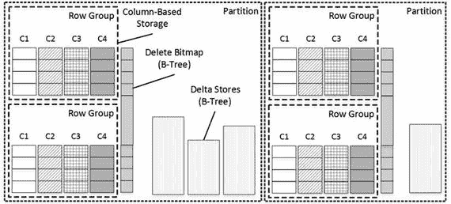
*图 7-4。基于磁盘的聚集列存储索引结构*

> 注意：内存中 `OLTP` 的文档通常将增量存储称为“尾部”，将删除位图称为“已删除行表”。然而，在本书中，我将使用经典术语。

在某个时间点，`SQL Server` 会压缩增量存储中的数据，创建另一个压缩行组。最常见的情况是当增量存储达到 `1,048,576` 行时发生；然而，对于基于磁盘的表，也可以通过重新组织索引来强制进行此压缩。对于内存优化表，仅当增量存储填满时才会触发增量存储压缩。

让我们详细看看内存中 `OLTP` 的列存储索引实现。

## 聚集列存储索引

从 `SQL Server 2016` 开始，您可以在内存优化表上创建聚集列存储索引。但是，不要因为列存储索引被定义为聚集而感到困惑。与基于磁盘的表相反，内存优化表上的聚集列存储索引是保存数据副本的独立数据结构。在此上下文中，“聚集”意味着这些索引包含表中的所有列。

具有聚集列存储索引的内存优化表包含隐藏列 `columnstore RID`，该列用作列存储索引中的行定位符。与基于磁盘的列存储索引一样，它由行组 `ID` 和行在行组中的位置组成。内存中 `OLTP` 使用此列作为删除位图中的行定位符，该删除位图是作为具有非聚集范围索引的内部表实现的。

内存优化列存储索引没有专用的增量存储。内存优化表中最近的行成为增量存储。当您创建聚集列存储索引时，内存中 `OLTP` 为增量存储中的行使用另一个内存使用者。来自 `INSERT` 或 `UPDATE` 操作的所有新行对象都从这个 `varheap` 中分配。图 7-5 说明了这一点。

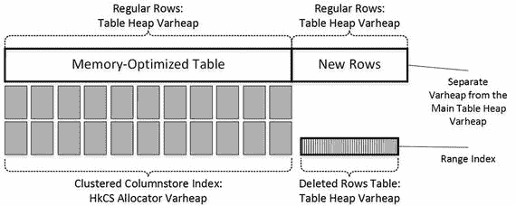
*图 7-5。内存优化表上的聚集列存储索引*

表中的索引行链可以链接来自主表堆和增量存储 `varheap` 的行。

让我们看一个例子，并创建一个带有聚集列存储索引的表，如清单 7-2 所示。表创建后，让我们使用 `sys.indexes` 目录视图查看表上定义的索引。

```
create table dbo.OrderItems
(
OrderItemID int identity(1,1) not null
constraint PK_OrderItems
primary key nonclustered hash
with (bucket_count = 4194329)
,OrderId int not null
,ArticleId int not null
,SalesPrice money not null
,index CCI_OrderItems clustered columnstore
)
with (memory_optimized = on, durability = schema_and_data);
select index_id, name, type, type_desc, compression_delay
from sys.indexes
where object_id = object_id('dbo.OrderItems');
```
*清单 7-2。创建带有列存储索引的内存优化表*

如图 7-6 所示，该表有两个索引：一个实现为哈希索引的主键和一个聚集列存储索引。我想重申一下，尽管索引定义和 `index_id=1` 中有“聚集”一词，但聚集列存储索引并不代表表数据的主要存储格式。它仅表示所有表列都包含在索引中。

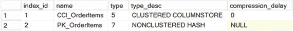
*图 7-6。内存优化表上的索引*

与哈希索引和非聚集索引相反（这些索引在数据加载到内存时会重新创建），`SQL Server` 将列存储索引持久保存在磁盘上。我将在第 10 章更深入地讨论内存中 `OLTP` 的数据存储。

让我们用 `3,200,000` 行填充该表，如清单 7-3 所示。

```
;with N1(C) as (select 0 union all select 0) -- 2 rows
,N2(C) as (select 0 from N1 as t1 cross join N1 as t2) -- 4 rows
,N3(C) as (select 0 from N2 as t1 cross join N2 as t2) -- 16 rows
,N4(C) as (select 0 from N3 as t1 cross join N3 as t2) -- 256 rows
,N5(C) as (select 0 from N4 as t1 cross join N4 as t2) -- 65,536 rows
,N6(C) as (select 0 from N5 as t1 cross join N4 as t2) -- 16,777,316 rows
,Ids(Id) as (select row_number() over (order by (select null)) from N6)
insert into dbo.OrderItems(OrderId, ArticleId, SalesPrice)
select ID / 3 + 1, ID % 50000, 49.99
from Ids
where ID <= 3200000;
```
*清单 7-3。用数据填充表并分析内存使用者*


清单 7-4 展示了分析 `dbo.OrderItems` 表中内存使用者的代码。

```sql
select
a.xtp_object_id, a.type_desc, a.minor_id
,c.memory_consumer_id as [mc id]
,c.memory_consumer_type_desc as [mc type]
,c.memory_consumer_desc as [description]
,c.allocation_count as [allocs]
,c.allocated_bytes / 1024 as [Allocated KB]
,c.used_bytes / 1024 as [Used KB]
from
sys.dm_db_xtp_memory_consumers c join
sys.memory_optimized_tables_internal_attributes a on
a.object_id = c.object_id and a.xtp_object_id = c.xtp_object_id
where
c.object_id = object_id('dbo.OrderItems');
清单 7-4.
向表中填充数据并分析内存使用者
```

图 7-7 展示了清单 7-4 的输出结果。如你所见，主表对象（输出中的前四行）有四个内存使用者。`HKCS_COMPRESSED` 使用者存储压缩后的行组。`id=74` 的表堆使用者为增量存储提供内存。表中的所有新数据行都分配在此处。另一个 `id=75` 的表堆是主表堆，它存储的是已在列存储索引中压缩过的行。这些数据尚未被压缩，因此该使用者不使用任何内存。

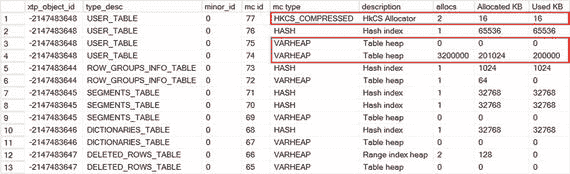
图 7-7.
表填充数据后的内存使用者

列存储索引还有其他几个内部对象。

*   `DELETED_ROWS_TABLE` 是一个内部表，用于存储删除位图，其中包含关于已删除行的信息。它被实现为一个非聚集（范围）索引，并包含已删除行的列存储定位符（RID）。
*   `ROW_GROUPS_INFO_TABLE` 存储关于列存储索引中行组的信息。
*   `SEGMENTS_TABLE` 存储关于行组中列段的信息。
*   `DICTIONARIES_TABLE` 存储列存储索引的字典。

有一个称为**元组移动器**的后台进程，它大约每两分钟唤醒一次，并估算增量存储中的行数。当它估算出增量存储至少有 1,048,576 行时，元组移动器会通过压缩和编码增量存储中的行来创建新的行组。在压缩过程中，元组移动器会更新增量存储中行的行定位符 RID 列，这会生成这些行的新版本。新行对象的内存从主表堆中分配。

最后，元组移动器删除（填充 `EndTs` 时间戳）增量存储中已压缩的行，这些行最终将由垃圾回收器进程回收。

图 7-8 展示了元组移动器压缩数据后的内存使用者情况。如你所见，行已从增量存储移动到主表堆中，压缩后的数据也存储在 `HKCS_COMPRESSED` 分配器中。

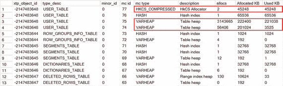
图 7-8.
增量存储被压缩后的内存使用者

让我们看看当你删除一些数据时会发生什么。清单 7-5 展示了删除表中每第 100 行的语句。

```sql
delete from dbo.OrderItems where OrderItemId % 100 = 0;
清单 7-5.
删除 1% 的行
```

正如我前面提到的，SQL Server 不会从列存储索引中移除已删除的行。已删除行的信息（RID）被插入到删除位图中，如图 7-9 所示，该表显示为 `DELETED_ROWS_TABLE`。

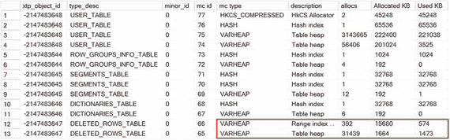
图 7-9.
行被删除后的内存使用者

你可以从 `sys.dm_db_column_store_row_group_physical_stats` 视图中获取关于列存储索引行组的详细信息，如清单 7-6 所示。

```sql
select row_group_id, state_desc, total_rows, deleted_rows
,size_in_bytes, trim_reason_desc
from sys.dm_db_column_store_row_group_physical_stats
where object_id = object_id('dbo.OrderItems')
order by row_group_id
清单 7-6.
分析行组
```

图 7-10 展示了该视图的输出。`row_group_id=-1` 的行组对应于增量存储。

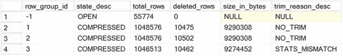
图 7-10.
行组统计信息

`trim_reason_desc` 列指明了压缩行组的行数少于 1,048,476 行的原因。对于内存优化表，该列可以包含以下值之一：

*   `NO_TRIM` 表示行组已完全填充。
*   `STATS_MISMATCH` 表示对增量存储大小的估算不正确。
*   `SPILLOVER` 表示在所有完整的行组创建完成后，该行组包含剩余的行。如果增量存储中有超过 102,500 行，SQL Server 会将这些行压缩到一个较小的行组中。否则，这些行会保留在增量存储中，如图 7-10 所示。
*   `MEMORY_LIMITATION` 表示系统没有足够的内存来一起压缩所有行。
*   `DICTIONARY_SIZE` 表示字典变得过大，无法一起压缩所有行。


## 性能考量

正如你所能想到的，大型增量存储区和删除位图会在查询执行期间增加开销。SQL Server 需要扫描增量存储区中未压缩的行，这比扫描压缩行组的速度要慢得多。类似地，删除位图中有大量行时，如果需要检查压缩行是否已被删除，也会增加验证开销。

让我们详细看看这个开销，并使用清单 7-7 中的代码向表中添加 1,500,000 行数据。

```
;with N1(C) as (select 0 union all select 0) -- 2 行
,N2(C) as (select 0 from N1 as t1 cross join N1 as t2) -- 4 行
,N3(C) as (select 0 from N2 as t1 cross join N2 as t2) -- 16 行
,N4(C) as (select 0 from N3 as t1 cross join N3 as t2) -- 256 行
,N5(C) as (select 0 from N4 as t1 cross join N4 as t2) -- 65,536 行
,N6(C) as (select 0 from N5 as t1 cross join N4 as t2) -- 16,777,316 行
,Ids(Id) as (select row_number() over (order by (select null)) from N6)
insert into dbo.OrderItems(OrderId, ArticleId, SalesPrice)
select 4000000 + ID / 3 + 1, ID % 50000, 49.99
from Ids
where ID <= 1500000;
清单 7-7.
向增量存储区插入 150 万行数据
```

如果在数据插入后再次运行清单 7-6 中的代码，你将看到如图 7-11 所示的输出。新行未被压缩，它们保留在增量存储区中。

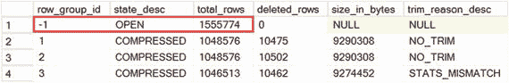

图 7-11.
插入后的行组状态

如果在元组移动器执行后再次运行清单 7-6 中的查询，你将看到新行已被压缩到两个新的行组中。图 7-12 显示了发生这种情况时行组的状态。

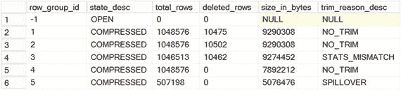

图 7-12.
数据压缩后的行组状态

清单 7-8 展示了受益于列存储索引的测试查询。我在增量存储区的行被压缩前后各执行了一次此查询。在我的环境中，执行时间分别为 343 毫秒和 160 毫秒。可以看到，扫描增量存储区中大量未压缩的行会影响查询性能。然而，值得注意的是，由于内存数据访问和可变长度堆扫描的效率，此开销相比基于磁盘的列存储索引中的增量存储区扫描要小得多。

```
select top 10 ArticleId, avg(SalesPrice)
from dbo.OrderItems
group by ArticleId
order by avg(SalesPrice) desc;
清单 7-8.
测试查询
```

下一步，让我们看看大量删除行所引入的开销。清单 7-9 展示了从表中删除一半行的查询。图 7-13 说明了删除后的行组统计信息。

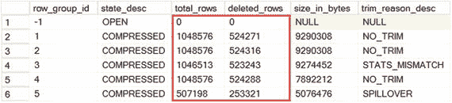

图 7-13.
数据删除后的行组状态

```
delete from dbo.OrderItems where OrderItemId % 2 = 0;
清单 7-9.
删除 50% 的数据
```

在我的环境中，清单 7-8 中测试查询的执行时间为 516 毫秒。SQL Server 需要检查压缩行的 RID 是否存在于 `DELETED_ROWS_TABLE` 中，并将已删除的行排除在处理之外。所有这些都显著增加了查询执行的开销。

大量已删除行和大型删除位图还有另一个影响。它们会减少可用于内存 OLTP 和其他 SQL Server 组件的内存量。

不幸的是，在内存优化列存储索引中出现大量已删除行是很常见的。OLTP 系统中的数据通常高度易变，数据行可能被多次更新。如果数据行在被压缩后又被更新，每个过时的行版本都将在索引的删除位图中被引用。

幸运的是，数据行在一段时间后变得静止也是常见情况。你可以通过指定 `COMPRESSION_DELAY` 列存储索引选项来延迟增量存储区行的压缩。此属性指示行在可以被压缩到行组之前应在增量存储区中保留多长时间。你应该将 `COMPRESSION_DELAY` 设置为超过系统中典型后处理时间的值。

以在线购物车系统为例。在这种场景下，单个订单的状态在履行过程中可能会被多次更新。将 `COMPRESSION_DELAY` 设置为超过典型的履行时间，并在订单完成前避免压缩订单行的旧版本，可能是有益的。

清单 7-10 展示了一个表的示例，该表的列存储索引设置了 1440 分钟（即 24 小时）的压缩延迟。尽管这会增加增量存储区的大小，但它也能防止压缩那些尚未被删除的行版本。作为一般规则，拥有稍大的增量存储区比增加删除位图的大小要好。

```
create table dbo.OrdersCCI
(
OrderId int not null
constraint PK_OrdersCCI
primary key nonclustered,
OrderDate datetime2(0) not null,
OrderNum varchar(32) not null,
Amount money not null,
CustomerId int not null,
OrderStatus tinyint not null,
FulfillmentDate datetime2(0) not null,
index CCI_OrdersCCI clustered columnstore
with (compression_delay=1440)
)
with (memory_optimized=on, durability=schema_and_data);
清单 7-10.
创建带有压缩延迟的列存储索引
```

你可以监控行组中已删除行的百分比，并微调索引的 `COMPRESSION_DELAY` 值以将其最小化。不幸的是，更改此属性需要你删除并重新创建列存储索引。这是一个离线操作，将导致两次表重建，并且对于大表来说可能耗费大量时间和内存。你也不能通过重建列存储索引来减小删除位图的大小。删除并重新创建索引是唯一可用的选项。

然而，有一种情况，内存 OLTP 会在内部重建行组。当行组中 90% 或更多的行被删除时，SQL Server 会解压缩行组，将行移回增量存储区。

清单 7-11 说明了从表中删除 99% 数据的代码。图 7-14 显示了删除后行组的即时状态。

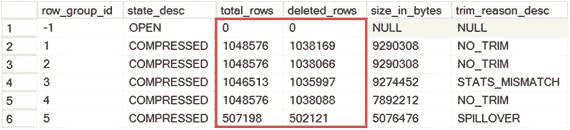

图 7-14.
删除 99% 行后的行组状态

```
delete from dbo.OrderItems where OrderId % 100 < 98;
清单 7-11.
删除 99% 的数据
```

如果在几分钟后查看行组，你会发现元组移动器进程已将所有未删除的行移回增量存储区，释放了系统中所有压缩的行组。图 7-15 说明了这种情况。

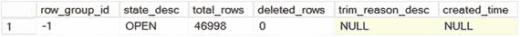

图 7-15.
元组移动器运行后的行组状态


## 列存储索引的限制

列存储索引存在一些限制。其中最重要的或许是，SQL Server 只能在查询互操作模式下利用列存储索引。原生编译的代码永远不会使用这些索引。

其他重要限制包括：
* 如果表使用行外存储，则无法创建列存储索引，因此行大小不能超过 8,060 字节。
* 包含列存储索引的内存优化表无法被修改。您需要先删除索引，修改表，然后重新创建索引。
* 内存优化表上的列存储索引无法重建或重新组织。
* 不支持存档压缩。

显然，系统应有足够的内存来容纳列存储索引。然而，这些索引经过高度压缩，可能仅占用非压缩行所用内存的一小部分。

## 目录和数据管理视图

SQL Server 提供了多个与列存储索引相关的目录和数据管理视图。

### sys.dm_db_column_store_row_group_physical_stats

`sys.dm_db_column_store_row_group_physical_stats` 视图返回有关列存储索引中行组的信息。您已在本章中见过此视图的实际应用。

输出中的列表示以下内容：
* `object_id` 和 `index_id` 提供行组所属对象和索引的信息。
* `partition_number` 是表中的分区号。对于内存优化表，它始终为 1。
* `row_group_id` 是分区内行组的 ID。内存优化表中的增量存储具有 `row_group_id=-1`。
* `delta_store_hobt_id` 是开放增量存储的 `hobt_id`。对于内存优化表，此值为 `NULL`。
* `state` 和 `state_description` 显示行组的状态。
* `total_rows`、`deleted_rows` 和 `size_in_bytes` 提供行数和行组大小的信息。
* `trim_reason` 和 `trim_reason_desc` 指示为什么某个行组的行数少于 1,048,576。
* `transition_to_compressed_state` 提供行组被压缩的原因。在内存优化表中，行组总是由元组移动器压缩。
* `generation` 显示创建行组的序列号。

正如我已经讨论过的，监控行组中的总行数和已删除行数，并微调 `COMPRESSION_DELAY` 索引选项是有益的。

还有另一个视图称为 `sys.column_store_row_groups`，它提供了 `sys.dm_db_column_store_row_group_physical_stats` 视图中列的子集。前者是在 SQL Server 2014 中引入的，而后者则是 SQL Server 2016 特有的。

### sys.column_store_segments

`sys.column_store_segments` 视图为每个列的每个段返回一行。

清单 7-12 展示了一个查询，该查询返回有关 `CCI_OrderItems` 列存储索引的信息。这里有几点需要注意。首先，该视图不返回索引的 `object_id` 或 `index_id` 值。这不是问题，因为一个表只能定义一个列存储索引。但是，当需要 `object_id` 值时，您需要使用 `sys.partitions` 视图来获取。

其次，`column_id` 值与 `sys.index_columns` 视图中的 `column_id` 值不匹配，这是因为存在内部的列存储定位符 (RID) 列，该列未在 `sys.index_columns` 中公开。在联接时，您需要将 `sys.column_store_segments` 中的 `column_id` 减 1。在未来的 In-Memory OLTP 版本中，这一点可能会也可能不会改变。

```sql
select
s.segment_id, s.column_id - 1 as [column_id], c.name as [column]
,s.version, s.encoding_type, s.row_count, s.has_nulls, s.magnitude
,s.primary_dictionary_id, s.secondary_dictionary_id, s.min_data_id
,s.max_data_id, s.null_value
,convert(decimal(12,3),s.on_disk_size / 1024.0 / 1024.0)  as [Size MB]
from
sys.column_store_segments s join sys.partitions p on
p.partition_id = s.partition_id
join sys.indexes i on
p.object_id = i.object_id
left join sys.index_columns ic on
i.index_id = ic.index_id and
i.object_id = ic.object_id and
s.column_id - 1 = ic.index_column_id
left join sys.columns c on
ic.column_id = c.column_id and
ic.object_id = c.object_id
where
i.name = 'CCI_OrderItems'
order by
s.segment_id, s.column_id
```

图 7-16 显示了查询的部分输出。

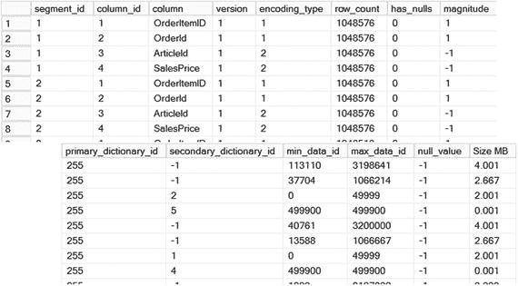

输出中的列表示以下内容：
* `column_id` 是索引中列的 ID，您可以使用此 ID 与 `sys.index_columns` 视图进行联接。正如我已经提到的，在联接时需要将其减 1。
* `partition_id` 引用行组（因此也是段）所属的分区。在内存优化表中，此值始终为 1。
* `segment_id` 是段的 ID，基本上就是行组的 ID。分区中的第一个段/行组的 ID 为 1。
* `version` 表示列存储段格式。SQL Server 2012、2014 和 2016 返回值 1。
* `encoding_type` 表示此段使用的编码类型。它可以是以下四个值之一：
  * 基于值的编码的 `encoding_type = 1`。
  * 非字符串的字典编码的 `encoding_type = 2`。
  * 字符串值的字典编码的 `encoding_type = 3`。
  * 未使用编码的 `encoding_type = 4`。
* `row_count` 表示段中的行数。
* `has_null` 指示数据是否包含空值。
* `magnitude` 是用于基于值编码的幅度。对于其他编码类型，它返回 -1。
* `min_data_id` 和 `max_data_id` 表示段内列的最小和最大值。SQL Server 在查询执行期间分析这些值，并消除不存储满足查询谓词的值的段。此过程的工作方式类似于分区表中的分区消除。
* `null_value` 表示用于指示空值的值。
* `on_disk_size` 表示段的大小（以字节为单位）。


### sys.column_store_dictionaries

`sys.column_store_dictionaries` 视图提供了有关列存储索引所使用字典的信息。

清单 7-13 展示了可用于检查字典列表的代码。与 `sys.column_store_segments` 视图类似，在连接中应将 `column_id` 减 1。

```sql
select
d.dictionary_id, d.column_id - 1 as [column_id], c.name as [column]
,d.version, d.type, d.last_id, d.entry_count
,convert(decimal(12,3),d.on_disk_size / 1024.0 / 1024.0)  as [Size MB]
from
sys.column_store_dictionaries d join sys.partitions p on
p.partition_id = d.partition_id
join sys.indexes i on
p.object_id = i.object_id
left join sys.index_columns ic on
i.index_id = ic.index_id and
i.object_id = ic.object_id and
d.column_id - 1 = ic.index_column_id
left join sys.columns c on
ic.column_id = c.column_id and
ic.object_id = c.object_id
where
i.name = 'CCI_OrderItems'
order by
d.dictionary_id
```
清单 7-13. 检查 sys.column_store_dictionaries 视图

图 7-17 展示了查询输出。

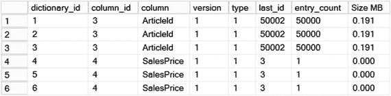
图 7-17. sys.column_store_dictionaries 的输出

输出中的列代表以下含义：

*   `column_id` 是索引中列的 ID。
*   `dictionary_id` 是字典的 ID。
*   `version` 表示字典格式。SQL Server 2012、2014 和 2016 返回值 1。
*   `type` 表示字典中存储的值的类型。它可以是以下三个值之一：
    *   包含 `int` 值的字典由 `type = 1` 指定。
    *   包含 `string` 值的字典由 `type = 3` 指定。
    *   包含 `float` 值的字典由 `type = 4` 指定。
*   `last_id` 是字典中的最后一个数据 ID。
*   `entry_count` 包含字典中的条目数。
*   `on_disk_size` 指示字典的大小（以字节为单位）。

## Summary

与按行存储数据的 B-Tree 和 Bw-Tree 索引不同，列存储索引按列存储未排序和压缩的数据。它们在数据仓库环境中非常有益，典型的查询会扫描和聚合大型事实表的数据，只选择表列的子集。借助内存 OLTP，这些索引在操作分析场景中也有帮助，此时系统针对热 OLTP 数据执行报告和分析查询。

内存 OLTP 聚集列存储索引是独立于主要数据行的数据结构。它们由压缩的行组、实现为带有非聚集（范围）索引的内部表的删除位图以及其他几个内部表组成。没有专用的增量存储；新版本的行被包含在常规数据行链中，尽管它们是从不同的 `varheap` 分配的。元组移动器进程分析此 `varheap` 中已分配的行数，并在行数达到 1,048,576 时进行压缩，然后移至常规表堆。

大的增量存储和删除位图会影响查询的性能。你可以通过指定 `COMPRESSION_DELAY` 索引选项来延迟压缩。建议将此值设置为超过系统中典型的数据后处理时间。

列存储索引有几个限制。它们不支持行外存储，将行大小限制为 8,060 字节。它们阻止表更改，当需要更改表时，应删除并重新创建列存储索引。最重要的是，它们只能通过互操作引擎利用；SQL Server 不会在本机编译的代码中使用它们。

