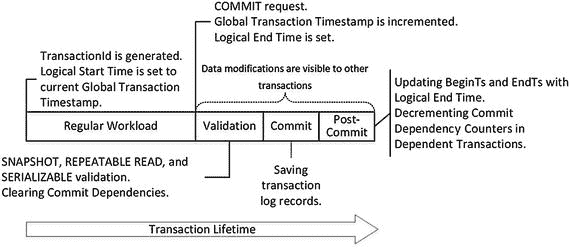
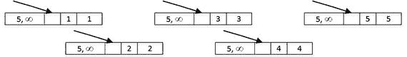
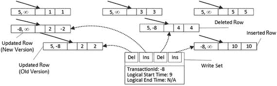
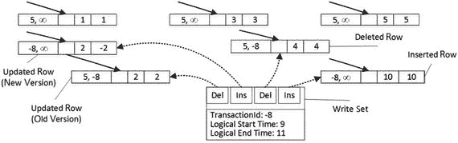
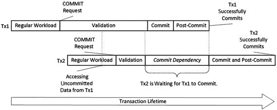
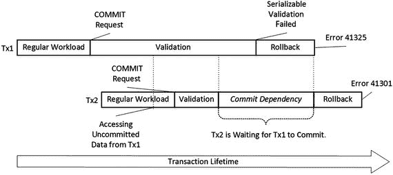
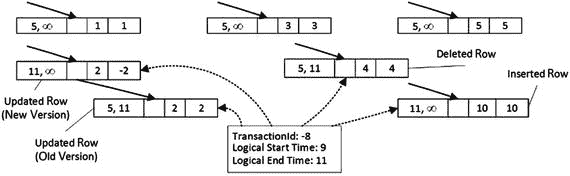
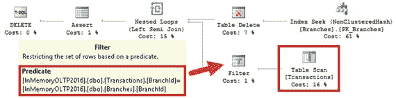
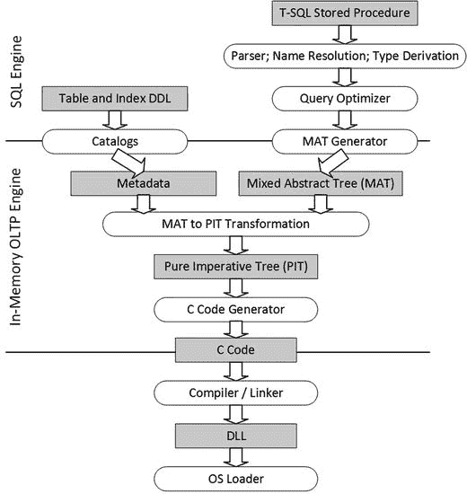
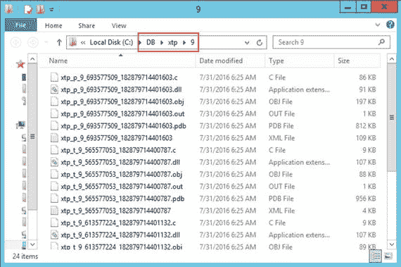

# 8. 内存 OLTP 中的事务处理

本章讨论内存 OLTP 中的事务处理。它阐述了本机编译和跨容器事务支持哪些隔离级别，概述了数据库系统中遇到的并发现象，并解释了内存 OLTP 如何解决它们。最后，本章详细讨论了内存 OLTP 事务的生命周期。

## ACID、事务隔离级别与并发现象概述

事务是读取和修改数据库中数据的工作单位，有助于强制执行系统中数据的一致性和持久性。在正确实施的事务管理系统中，每个事务都具有四个特性，称为原子性、一致性、隔离性和持久性，通常简称为 ACID。

*   **原子性**保证每个事务都以“全有或全无”的方式执行。事务内完成的所有更改要么全部提交，要么全部回滚。考虑在支票和储蓄银行账户之间转账的经典示例。该操作包括两个独立的操作：减少支票账户的余额和增加储蓄账户的余额。事务原子性保证这两个操作要么同时成功，要么同时失败，因此系统永远不会出现钱从支票账户扣除但从未添加到储蓄账户的情况。
*   **一致性**确保任何数据库事务都将数据库从一个一致状态带到另一个一致状态，不违反任何已定义的数据库规则或约束。
*   **隔离性**确保事务中所做的更改是隔离的，并且在事务提交之前对其他事务不可见。严格来说，事务隔离应保证多个事务的并发执行应使系统达到与这些事务串行执行时相同的状态。然而，在大多数数据库系统中，这种要求通常被放宽，并通过事务隔离级别进行控制。
*   **持久性**保证事务提交后，该事务所做的所有更改都是永久性的，并且能够在系统崩溃中幸存下来。SQL Server 通过使用预写日志来实现持久性，该日志与数据修改同步地硬化事务日志中的日志记录。

在多用户环境中，隔离要求是最难实现的。尽管可以完全隔离不同的事务，但这可能导致系统在具有易失性数据时出现高级别的阻塞和其他并发问题。SQL Server 通过引入几个事务隔离级别来解决这种情况，这些级别以可能的与读取数据一致性相关的并发现象为代价，放宽了隔离要求。

*   **脏读**：事务从未提交的（脏）其他事务中读取数据。
*   **不可重复读**：在同一事务内再次尝试读取相同数据返回不同的结果。当其他事务在受影响的事务进行读取之间修改甚至删除数据时，会出现此数据不一致问题。
*   **幻读**：当同一事务内的后续读取返回新行（该事务之前未读取的行）时，会发生此现象。当另一个事务在受影响的事务进行读取之间插入新数据时，就会发生这种情况。

表 8-1 显示了不同事务隔离级别可能出现的数据不一致问题。值得一提的是，每个隔离级别都解决了写/写冲突，防止多个活动事务同时更新相同的行。

表 8-1. 事务隔离级别与并发现象

| 隔离级别 | 脏读 | 不可重复读 | 幻读 |
| --- | --- | --- | --- |
| `READ UNCOMMITTED` | 是 | 是 | 是 |
| `READ COMMITTED` | 否 | 是 | 是 |
| `REPEATABLE READ` | 否 | 否 | 是 |
| `SERIALIZABLE` | 否 | 否 | 否 |
| `SNAPSHOT` | 否 | 否 | 否 |


除了 `SNAPSHOT` 隔离级别外，SQL Server 在处理基于磁盘的表时使用锁来解决并发现象。当一个事务修改一行时，它会获取该行上的排他（`X`）锁，并一直持有该锁直到事务结束。这个排他（`X`）锁会阻止其他会话访问未提交的数据，直到事务完成且锁被释放。这种行为也称为**悲观并发**。

这种行为也意味着，在发生写/写冲突时，最后的修改获胜。例如，当两个事务尝试修改同一行时，SQL Server 会阻塞其中一个，直到另一个事务提交，然后再允许被阻塞的事务修改数据。不会引发错误或异常；然而，第一个事务所做的更改会被覆盖。

对于基于磁盘的表和悲观并发，事务隔离级别控制着会话在读取数据时获取和释放共享（`S`）锁的方式。表 8-2 演示了这种行为。

表 8-2.
基于磁盘表的事务隔离级别和共享（`S`）锁行为

| 隔离级别 | 共享（`S`）锁行为 | 注释 |
| --- | --- | --- |
| `READ UNCOMMITTED` | 不获取（`S`）锁 | 事务可以看到其他会话未提交的更改（脏读）。 |
| `READ COMMITTED` | 获取（`S`）锁并立即释放 | 当事务尝试读取被其他会话持有排他（`X`）锁的未提交行时，它将被阻塞（无脏读）。 |
| `REPEATABLE READ` | 获取（`S`）锁并持有到事务结束 | 读取一行后，其他会话无法修改该行（无不可重复读）。然而，它们仍然可以在读取之间插入新行（幻读）。 |
| `SERIALIZABLE` | 获取范围（`S`）锁并持有到事务结束 | 读取一行后，其他会话无法修改该行，也无法在已读取的行之间插入新行（无不可重复读或幻读）。 |

`SNAPSHOT` 隔离级别使用行版本控制模型，在修改后创建行的新版本。在此模型中，事务开始后，其他事务所做的所有数据修改对它都是不可见的。

尽管 `SNAPSHOT` 隔离在基于磁盘的表和内存优化表中的实现方式不同，但其逻辑行为是相同的。事务将读取在其开始时有效的行版本，会话之间不会相互阻塞。然而，当两个事务尝试更新相同数据时，其中一个将被中止并回滚以解决写/写冲突。这种行为被称为**乐观并发**。

### 可序列化与快照隔离级别

虽然 `SERIALIZABLE` 和 `SNAPSHOT` 隔离级别在防范数据不一致问题上提供相同级别的保护，但它们在基于磁盘表上的行为有一个细微差别。`SNAPSHOT` 隔离级别事务看到的数据是事务开始时的状态。而 `SERIALIZABLE` 隔离级别事务看到的数据是首次访问该数据时的状态。

考虑这种情况：一个会话在事务中间从基于磁盘的表读取数据。如果另一个会话在事务开始后但在数据读取前更改了该表中的数据，则 `SERIALIZABLE` 隔离级别中的事务将看到这些更改，而 `SNAPSHOT` 事务则不会。

## 内存 OLTP 中的事务隔离级别

内存 OLTP 支持三种事务隔离级别：`SNAPSHOT`、`REPEATABLE READ` 和 `SERIALIZABLE`。然而，与基于磁盘的表相比，内存 OLTP 采用了完全不同的方法来强制执行数据一致性规则。它不是阻塞或被其他会话阻塞，而是在事务 `COMMIT` 时验证数据一致性，如果违反规则则抛出异常并回滚事务。

*   在 `SNAPSHOT` 隔离级别中，其他会话所做的任何更改对事务都是不可见的。`SNAPSHOT` 事务总是处理事务开始时数据的快照。在提交时唯一的验证是检查主键违规，这称为快照验证。
*   在 `REPEATABLE READ` 隔离级别中，内存 OLTP 验证事务读取的行未被其他事务修改或删除。如果发生这种情况，`REPEATABLE READ` 事务将无法提交。该操作称为可重复读验证，它在快照验证之外执行。
*   在 `SERIALIZABLE` 隔离级别中，SQL Server 执行可重复读验证，并检查可能由其他会话插入的幻影行。此过程称为可序列化验证，它在快照验证之外执行。

让我们看几个演示此行为的例子。第一步，如清单 8-1 所示，我们创建一个内存优化表并插入几行数据。

```sql
create table dbo.HKData
(
ID int not null
constraint PK_HKData
primary key nonclustered hash with (bucket_count=64),
Col int not null
)
with (memory_optimized=on, durability=schema_only);
insert into dbo.HKData(ID, Col) values(1,1),(2,2),(3,3),(4,4),(5,5);
```
清单 8-1.
数据一致性与事务隔离级别：表创建

表 8-3 显示了在 `REPEATABLE READ` 事务隔离级别中并发是如何工作的。需要注意的是，SQL Server 在第一次数据访问时启动事务，而不是在 `BEGIN TRAN` 语句时启动。因此，会话 1 的事务在第一个 `SELECT` 操作符执行时开始。

表 8-3.
REPEATABLE READ 事务隔离级别中的并发

| 会话 1 | 会话 2 | 结果 |
| --- | --- | --- |
| `begin tran` `select ID, Col` `from dbo.HKData` `with (repeatableread)` | | |
| | `update dbo.HKData` `set Col = -2` `where ID = 2` | |
| `select ID, Col` `from dbo.HKData` `with (repeatableread)` | | 返回行的旧版本（`Col = 2`）。 |
| `commit` | | 消息 41305，级别 16，状态 0，第 0 行。当前事务由于可重复读验证失败而未能提交。 |
| `begin tran` `select ID, Col` `from dbo.HKData` `with (repeatableread)` | | |
| | `insert into dbo.HKData` `values(10,10)` | |
| `select ID, Col` `from dbo.HKData` `with (repeatableread)` | | 不返回新行（`10,10`）。 |
| `commit` | | 成功。 |

如你所见，对于内存优化表，其他会话能够修改活动 `REPEATABLE READ` 事务正在读取的数据。这导致在 `COMMIT` 时，当可重复读验证失败时，事务中止。这与基于磁盘表的行为完全不同，在基于磁盘表中，其他会话会被阻塞，直到 `REPEATABLE READ` 事务成功提交之前都无法修改数据。


同样值得注意的是，在内存优化表的情况下，`REPEATABLE READ`（可重复读）隔离级别可以保护你免受**幻读**现象的影响，而这对于基于磁盘的表来说并非如此。新插入行的 `BeginTs` 值将超过活动事务的逻辑开始时间（稍后详述），这使得这些行对该事务不可见。

接下来，让我们在 `SERIALIZABLE`（可序列化）隔离级别中重复这些测试。你可以在表 8-4 中查看代码和执行结果。

表 8-4. 可序列化事务隔离级别下的并发情况

| 会话 1 | 会话 2 | 结果 |
| --- | --- | --- |
| `begin tran` `select ID, Col` `from dbo.HKData` `with (serializable)` | | |
| | `update dbo.HKData` `set Col = -2` `where ID = 2` | |
| `select ID, Col` `from dbo.HKData` `with (serializable)` | | 返回旧行版本 (`Col = 2`)。 |
| `commit` | | 消息 41305，级别 16，状态 0，第 0 行。当前事务因可重复读验证失败而未能提交。 |
| `begin tran` `select ID, Col` `from dbo.HKData` `with (serializable)` | | |
| | `insert into dbo.HKData` `values(10,10)` | |
| `select ID, Col` `from dbo.HKData` `with (serializable)` | | 不返回新行 (`10,10`)。 |
| `commit` | | 消息 41325，级别 16，状态 0，第 0 行。当前事务因可序列化验证失败而未能提交。 |

如你所见，`SERIALIZABLE` 隔离级别会阻止会话提交事务，前提是另一个会话插入了新行并违反了可序列化验证。与 `REPEATABLE READ` 隔离级别类似，这种行为不同于基于磁盘的表，在后者的 `SERIALIZABLE` 事务会成功阻塞其他会话，直到事务完成。

最后，让我们在 `SNAPSHOT`（快照）隔离级别中重复测试。表 8-5 显示了代码和结果。

表 8-5. 快照事务隔离级别下的并发情况

| 会话 1 | 会话 2 | 结果 |
| --- | --- | --- |
| `begin tran` `select ID, Col` `from dbo.HKData` `with (snapshot)` | | |
| | `update dbo.HKData` `set Col = -2` `where ID = 2` | |
| `select ID, Col` `from dbo.HKData` `with (snapshot)` | | 返回旧行版本 (`Col = 2`)。 |
| `commit` | | 成功。 |
| `begin tran` `select ID, Col` `from dbo.HKData` `with (snapshot)` | | |
| | `insert into dbo.HKData` `values(10,10)` | |
| `select ID, Col` `from dbo.HKData` `with (snapshot)` | | 不返回新行 (`10,10`)。 |
| `commit` | | 成功。 |

`SNAPSHOT` 隔离级别的行为与基于磁盘的表类似，它可以防止不可重复读和幻读现象。正如你所猜想的，它不需要在提交阶段执行可重复读和可序列化验证；因此，它减轻了 SQL Server 的负载。但是，仍然存在快照验证，它会检查主键违规，并且在任何事务隔离级别下都会进行。

表 8-6 显示了导致主键违规条件的代码。与基于磁盘的表相反，异常是在提交阶段而非第二次 `INSERT` 操作时抛出的。

表 8-6. 主键违规

| 会话 1 | 会话 2 | 结果 |
| --- | --- | --- |
| `begin tran` `insert into dbo.HKData` `with (snapshot)` `(ID, Col)` `values(100,100)` | | |
| | `begin tran` `insert into dbo.HKData` `with (snapshot)` `(ID, Col)` `values(100,100)` | |
| `commit` | | 成功提交第一个会话。 |
| | `commit` | 消息 41325，级别 16，状态 1，第 0 行。当前事务因可序列化验证失败而未能提交。 |

值得一提的是，即使 SQL Server 验证的是不同的规则，错误编号和消息也与可序列化验证失败相同。

在内存 OLTP 中，无论事务隔离级别如何，写/写冲突的工作方式都是相同的。SQL Server 不允许事务修改已被其他未提交事务修改的行。表 8-7 说明了这一行为。它使用了 `SNAPSHOT` 隔离级别；然而，使用不同的隔离级别时行为不会改变。

表 8-7. 内存 OLTP 中的写/写冲突

| 会话 1 | 会话 2 | 结果 |
| --- | --- | --- |
| `begin tran` `select ID, Col` `from dbo.HKData` `with (snapshot)` | | |
| | `begin tran` `update dbo.HKData` `with (snapshot)` `set Col = -3` `where ID = 2` `commit` | |
| `update dbo.HKData` `with (snapshot)` `set Col = -2` `where ID = 2` | | 消息 41302，级别 16，状态 110，第 1 行。当前事务尝试更新一条记录，但该记录自本事务启动以来已被更新。事务已中止。消息 3998，级别 16，状态 1，第 1 行。在批处理结束时检测到无法提交的事务。事务已回滚。语句已终止。 |
| `begin tran` `select ID, Col` `from dbo.HKData` `with (snapshot)` | | |
| | `begin tran` `update dbo.HKData` `with (snapshot)` `set Col = -3` `where ID = 2` | |
| `update dbo.HKData` `with (snapshot)` `set Col = -2` `where ID = 2` | | 消息 41302，级别 16，状态 110，第 1 行。当前事务尝试更新一条记录，但该记录自本事务启动以来已被更新。事务已中止。消息 3998，级别 16，状态 1，第 1 行。在批处理结束时检测到无法提交的事务。事务已回滚。语句已终止。 |
| | `commit` | 会话 2 的事务成功提交。 |


## 跨容器事务

任何对内存优化表的解释执行 T-SQL 访问都会通过查询互操作引擎进行，并导致跨容器事务。你可以为基于磁盘的表和内存优化表使用不同的事务隔离级别。然而，并非所有组合都受支持。表 8-8 说明了跨容器事务中可能的事务隔离级别组合。

表 8-8.
跨容器事务允许的隔离级别

| 基于磁盘的表的隔离级别 | 内存优化表的隔离级别 |
| --- | --- |
| `READ UNCOMMITTED`, `READ COMMITTED`, `READ COMMITTED SNAPSHOT` | `SNAPSHOT`, `REPEATABLE READ`, `SERIALIZABLE` |
| `REPEATABLE READ`, `SERIALIZABLE` | 仅 `SNAPSHOT` |
| `SNAPSHOT` | 不支持 |

正如你所知，`REPEATABLE READ` 和 `SERIALIZABLE` 隔离级别的内部实现对于基于磁盘的表和内存优化表来说非常不同。基于磁盘表的数据一致性规则依赖于锁，而内存中 OLTP 使用预提交验证。这导致了在跨容器事务中，当基于磁盘的表要求 `REPEATABLE READ` 或 `SERIALIZABLE` 隔离时，SQL Server 仅支持内存优化表的 `SNAPSHOT` 隔离级别。

此外，当基于磁盘的表要求 `SNAPSHOT` 隔离时，SQL Server 不允许访问内存优化表。简而言之，跨容器事务由两个内部事务组成：一个用于基于磁盘的表，另一个用于内存优化的表。不可能在同一时间精确启动这两个事务并保证事务开始时数据的状态。

作为一般准则，建议在常规工作负载的跨容器事务中使用 `READ COMMITTED`/`SNAPSHOT` 组合。这种组合提供了最小的阻塞和最低的预提交开销，在大量用例中应该是可接受的。其他组合在数据迁移期间更合适，此时避免不可重复读和幻读现象很重要。

你可能已经注意到，SQL Server 要求你在访问内存优化表时通过表提示指定事务隔离级别。这不适用于在显式启动（使用 `BEGIN TRAN`）的事务之外执行的单独语句。这些语句称为自动提交事务，每个语句都在一个单独的事务中执行，该事务在语句执行期间处于活动状态。清单 8-2 展示了包含三个语句的代码。它们每个都将在自己的自动提交事务中运行。

```
delete from dbo.HKData;
insert into dbo.HKData(ID, Col) values(1,1),(2,2),(3,3),(4,4),(5,5);
select ID, Col from dbo.HKData;
```
清单 8-2.
自动提交事务

对于在自动提交事务中运行的语句，不需要隔离级别提示。如果省略提示，语句将在 `SNAPSHOT` 隔离级别下运行。

SQL Server 允许你在从自动提交事务访问内存优化表时保留 `NOLOCK` 提示。该提示将被忽略。然而，`READUNCOMMITTED` 提示不受支持并会触发错误。

有一个有用的数据库选项 `MEMORY_OPTIMIZED_ELEVATE_TO_SNAPSHOT`，默认情况下是禁用的。启用此选项后，SQL Server 允许你在非自动提交事务中省略隔离级别提示。如果在启用了 `MEMORY_OPTIMIZED_ELEVATE_TO_SNAPSHOT` 选项时未指定隔离级别提示，SQL Server 将使用 `SNAPSHOT` 隔离级别，如同自动提交事务一样。当你将现有系统移植到内存中 OLTP 并拥有访问已成为内存优化表的 T-SQL 代码时，请考虑启用此选项。

## 事务生命周期

虽然我已经讨论了内存中 OLTP 用于管理数据访问和并发模型的几个关键元素，但让我们在这里回顾一下。

*   全局事务时间戳是一个自动递增的值，唯一地标识系统中的每个事务。SQL Server 在事务提交阶段递增并获取此值。
*   每一行都有 `BeginTs` 和 `EndTs` 时间戳，它们对应于创建或删除该行版本的事务的全局事务时间戳。

当新事务启动时，内存中 OLTP 生成一个 `TransactionId` 值，该值唯一地标识该事务。此外，内存中 OLTP 分配事务的逻辑开始时间，即事务启动时的全局事务时间戳值。它决定了事务可以看到哪些行版本。对于行要可见，逻辑开始时间应在该行的 `BeginTs` 和 `EndTs` 值之间。

当事务发出 `COMMIT` 语句时，内存中 OLTP 递增全局事务时间戳值并将其分配给事务的逻辑结束时间。逻辑结束时间在事务提交后将成为该事务插入行的 `BeginTs` 和删除行的 `EndTs`。

图 8-1 显示了处理内存优化表的事务的生命周期。



图 8-1.
事务生命周期

当事务需要删除一行时，它会用 `TransactionId` 值更新 `EndTs` 时间戳。插入操作创建一个新行，其 `BeginTs` 值为 `TransactionId`，`EndTs` 值为 `Infinity`。最后，更新操作在内部由删除和插入操作组成。同样值得注意的是，在数据修改期间，如果它们正在修改的行存在任何未提交的版本，事务会引发错误。这可以防止多个会话修改相同数据时发生写/写冲突。

当另一个事务（称为 `Tx1`）遇到 `BeginTs` 或 `EndTs` 时间戳中包含 `TransactionId` 的未提交行时（`TransactionId` 有一个标志指示这种情况），它会检查具有 `TransactionId` 的事务的状态。如果该事务正在提交且逻辑结束时间已设置，这些未提交的行可能对 `Tx1` 事务可见，这导致了一种称为提交依赖项的情况。`Tx1` 不会被阻塞；但是，在它依赖的原始事务自身提交之前，它不会向客户端返回数据也不会提交。我稍后会谈到提交依赖项。

让我们详细看看事务的生命周期。图 8-2 显示了在清单 8-1 中创建并填充 `dbo.HKData` 表之后的数据行，假设这些行是由全局事务时间戳值为 5 的事务创建的。（为简单起见，省略了哈希索引结构。）



图 8-2.
插入后的 dbo.HKData 表中的数据

假设你有一个事务，它在全局事务时间戳值为 9 时启动，并生成的 `TransactionId` 为-8。（我在图中使用负值作为 `TransactionId` 以说明两种类型时间戳的区别。）

假设该事务执行清单 8-3 中所示的操作。显式事务已经启动，`BEGIN TRAN` 语句未包含在清单中。所有三个语句都在单个活动事务的上下文中执行。


### 清单 8-3. 数据修改操作

```sql
insert into dbo.HKData with (snapshot) (ID, Col) values(10,10);
update dbo.HKData with (snapshot) set Col = -2 where ID = 2;
delete from dbo.HKData with (snapshot) where ID = 4;
```

### 图 8-3. 修改后 dbo.HKData 表中的数据

图 8-3 展示了数据修改后的状态。一条 `INSERT` 语句创建了一个新行，一条 `DELETE` 语句更新了 `ID=4` 的行中的 `EndTs` 值，而一条 `UPDATE` 语句更改了 `ID=2` 的行的 `EndTs` 值，并创建了一个具有相同 `ID` 的新版本行。



需要注意的是，事务维护一个**写入集**，即指向事务插入和删除的行的指针，用于生成事务日志记录。

除了写入集，在 `REPEATABLE READ`（可重复读）和 `SERIALIZABLE`（可序列化）隔离级别下，事务还维护一个**读取集**，其中包含事务读取的行，并用其进行可重复读验证。最后，在 `SERIALIZABLE` 隔离级别下，事务维护一个**扫描集**，其中包含事务中查询所使用的谓词信息。扫描集用于进行可序列化验证。

当发出 `COMMIT`（提交）请求时，事务开始验证阶段。首先，它会自动递增当前的全局事务时间戳值，该值成为事务的逻辑结束时间。图 8-4 展示了此状态，假设新的全局事务时间戳值为 11。请注意，在此阶段，行中的 `BeginTs` 和 `EndTs` 时间戳仍然具有 `TransactionId`（事务 ID）。

### 图 8-4. 验证阶段开始



此时，即使事务尚未提交，被事务修改的行也对系统中的其他事务可见，这可能导致提交依赖。稍后我将再次讨论它们。

作为下一步，SQL Server 根据事务的隔离级别执行若干验证，如表 8-9 所示。

### 表 8-9. 在不同事务隔离级别执行的验证

|   | 快照验证 | 可重复读验证 | 可序列化验证 |
| --- | --- | --- | --- |
|   | 检查主键冲突 | 检查不可重复读 | 检查幻读 |
| `SNAPSHOT` | 是 | 否 | 否 |
| `REPEATABLE READ` | 是 | 是 | 否 |
| `SERIALIZABLE` | 是 | 是 | 是 |

**重要提示：** 可重复读和可序列化验证会给系统增加开销。除非您有合理的用例需要此类数据一致性，否则不要使用 `REPEATABLE READ` 和 `SERIALIZABLE` 隔离级别。

在完成所需规则的验证后，事务会等待其提交依赖清除以及它所依赖的事务提交。如果那些事务因任何原因未能提交（例如，违反了验证规则），则依赖事务也会回滚，并生成错误 41301。

### 图 8-5. 提交依赖：成功提交

图 8-5 展示了一个提交依赖场景。事务 `Tx2` 可以在 `Tx1` 的验证和提交阶段访问 `Tx1` 的未提交行；因此，`Tx2` 对 `Tx1` 存在提交依赖。`Tx2` 的验证阶段完成后，`Tx2` 必须等待 `Tx1` 提交且提交依赖清除，才能进入提交阶段。



如果 `Tx1` 因可序列化验证违规而未能提交，`Tx2` 将随错误 41301 一起回滚，如图 8-6 所示。

### 图 8-6. 提交依赖：验证错误



**注意：** 从技术上讲，提交依赖是内存中 OLTP 中的一种阻塞情况。但是，事务的验证和提交阶段相对较短，这种阻塞不应过度。

SQL Server 允许单个事务最多有八个提交依赖。当达到此数量时，其他尝试获取依赖的事务将失败，并出现错误 41839。

**注意：** 您可以使用 `dependency_acquiredtx_event` 和 `waiting_for_dependenciestx_event` 扩展事件来跟踪提交依赖。

当所有提交依赖都清除后，事务进入提交阶段，生成一个或多个日志记录，并将它们保存到事务日志，随后进入提交后阶段。我将在第 10 章更详细地讨论事务日志记录。

在提交后阶段，事务用逻辑结束时间值替换 `BeginTs` 和 `EndTs` 时间戳，并递减依赖事务中的提交依赖计数器。图 8-7 展示了事务的最终状态。

### 图 8-7. 已完成的事务



最后，当事务因显式的 `ROLLBACK` 命令或验证违规而回滚时，内存中 OLTP 会将被删除行的 `EndTs` 时间戳重置为无穷大。由事务插入的行的新版本将成为**幽灵行**。它们将通过常规的垃圾回收过程来释放，我将在第 11 章讨论这个过程。


## 引用完整性强制执行

在纯 `SNAPSHOT`（快照）隔离级别中不可能强制执行引用完整性，因为事务彼此完全隔离。考虑这样一种情况：一个事务删除了一行，而另一个在原始事务之后启动的事务中，新插入的行引用了该行。`SNAPSHOT` 隔离级别将阻止事务看到更改，从而违反引用完整性。

内存中 OLTP 通过为受引用完整性验证影响的表和查询在 `SNAPSHOT` 隔离级别下维护读取和/或扫描集来解决此问题。与 `REPEATABLE READ`（可重复读）和 `SERIALIZABLE`（可序列化）事务相比，这些集仅为受影响的表维护，而非整个事务。但是，它们会包含在引用完整性检查期间读取的所有行以及应用的谓词。

当引用表在外键列上没有索引时，这种行为可能会导致问题。类似于基于磁盘的表，当您在被引用的（主）表中删除一行时，SQL Server 将不得不扫描整个引用的（详细）表。除了性能影响外，事务还将维护读取集，该集包含它在扫描期间读取的所有行，无论这些行是否引用了被删除的行。如果任何其他事务更新或删除了读取集中的任何行，原始事务将因违反可重复读取规则的错误而失败。

让我们看一个例子，并使用清单 8-4 中的代码创建两个表。

```sql
create table dbo.Branches
(
BranchId int not null
constraint PK_Branches
primary key nonclustered hash with (bucket_count = 4)
)
with (memory_optimized = on, durability = schema_only);
create table dbo.Transactions
(
TransactionId int not null
constraint PK_Transactions
primary key nonclustered hash with (bucket_count = 4),
BranchId int not null
constraint FK_Transactions_Branches
foreign key references dbo.Branches(BranchId),
Amount money not null
)
with (memory_optimized = on, durability = schema_only);
insert into dbo.Branches(BranchId) values(1),(10);
insert into dbo.Transactions(TransactionId,BranchId,Amount)
values(1,1,10),(2,1,20);
```
清单 8-4.
引用完整性验证：表创建

`dbo.Transactions` 表有一个外键约束引用 `dbo.Branches` 表。然而，目前没有行引用 `BranchId = 10` 的行。接下来，让我们运行清单 8-5 所示的代码，删除此行并保持事务活动状态。

```sql
begin tran
delete from dbo.Branches with (snapshot) where BranchId = 10;
```
清单 8-5.
引用完整性验证：第一个会话代码

`DELETE` 语句将验证外键约束并成功完成。但是，`dbo.Transactions` 表在 `BranchId` 列上没有索引，验证将需要扫描整个表，如图 8-8 所示。



图 8-8.
引用完整性验证：DELETE 语句的执行计划

此时，`dbo.Transactions` 表中的所有行都将包含在事务读取集中。如果另一个会话使用清单 8-6 中的代码更新了读取集中的某一行，它将成功，而第一个会话将因违反可重复读取规则的错误而无法提交。

```sql
update dbo.Transactions with (snapshot)
set Amount = 30
where TransactionId = 2;
```
清单 8-6.
引用完整性验证：第二个会话代码

**重要提示**

类似于基于磁盘的表，您应该始终在引用表的外键列上创建索引，以避免此问题。

## 总结

内存中 OLTP 支持三种事务隔离级别：`SNAPSHOT`、`REPEATABLE READ` 和 `SERIALIZABLE`。与基于磁盘的表通过获取和保持锁来处理不可重复读和幻读不同，内存中 OLTP 在事务提交阶段验证数据一致性规则。如果违反规则，将引发异常并且回滚事务。

可重复读和可序列化验证会给事务处理增加开销。建议您在常规工作负载期间使用 `SNAPSHOT` 隔离级别，除非您需要 `REPEATABLE READ` 或 `SERIALIZABLE` 的数据一致性。

SQL Server 执行可重复读和可序列化验证以在系统中强制执行引用完整性。请始终在引用表的外键列上创建索引以提高性能并避免验证错误。

您可以在跨容器事务中为基于磁盘的表和内存优化表使用不同的事务隔离级别；但是，并非所有组合都受支持。推荐做法是对基于磁盘的表使用 `READ COMMITTED` 隔离级别，对内存优化表使用 `SNAPSHOT` 隔离级别。

当您通过互操作引擎在自动提交（单条语句）事务中访问内存优化表时，SQL Server 不需要您指定事务隔离级别。SQL Server 会自动将此类事务提升到 `SNAPSHOT` 隔离级别。但是，当使用 `BEGIN TRAN` 语句显式启动事务时，您应该指定隔离级别提示。您可以通过启用 `MEMORY_OPTIMIZED_ELEVATE_TO_SNAPSHOT` 数据库选项来避免这种情况。在将现有系统移植到使用内存中 OLTP 时，此选项非常有用。

## 9. 内存中 OLTP 可编程性

本章重点介绍 SQL Server 中内存中 OLTP 引擎的可编程性方面。它描述了本机编译的过程，并概述了本机编译模块以及内存中 OLTP 中支持的 T-SQL 功能。最后，本章比较了几种使用案例的性能，这些案例使用本机编译模块和通过互操作引擎使用解释型 T-SQL 来处理内存优化表中的数据。


## 原生编译概述

正如您已经了解的，通过 `查询互操作引擎`，可以使用常规的 T-SQL 代码访问内存优化表。这种方法非常灵活。只要您使用的是受支持的功能集，数据的位置就是透明的。代码无需知道也无需担心它操作的是基于磁盘的表还是内存优化表。

不幸的是，这种灵活性是有代价的。T-SQL 是一种解释型且 CPU 密集型的语言。即使是一个简单的 T-SQL 语句，执行时也可能需要数千甚至数百万条 CPU 指令。尽管内存中的数据位置加快了数据访问速度，并消除了闩锁和锁争用，但 T-SQL 解释的开销限制了 `In-Memory OLTP` 可实现的性能提升水平。

注意
原生编译在操作型分析场景中并无帮助。`列存储`索引只能在查询互操作模式下使用。

### 性能与原生编译

在实践中，当通过 `互操作引擎` 访问内存优化数据时，系统吞吐量增加两到四倍是常见的。为了进一步提升性能，`In-Memory OLTP` 利用了原生编译。作为第一步，它将任何行数据操作和访问逻辑转换为 C 代码，该代码被编译成 `DLL` 并加载到 SQL Server 的进程内存中。这些 `DLL`（每个表一个）由原生的 CPU 指令组成，它们执行时无需 T-SQL 语句的任何进一步代码解释开销。

考虑一个简单的情况：您需要从数据行中读取一个定长列的值。对于基于磁盘的表，SQL Server 从系统目录中获取该列的起始偏移量和长度，并执行所需的操作将字节序列转换为所需的数据类型。对于内存优化表，`DLL` 已经知道了列偏移量和数据类型。SQL Server 可以使用正确数据类型的指针，从行中预定义的偏移量读取数据，而无需任何额外的开销。正如您可以猜到的，这种方法极大地减少了该操作所需的 CPU 指令数量。

### 限制与挑战

另一方面，这种方法带来了一些限制。在 `DLL` 生成后，您无法更改行的格式。编译后的代码对更改一无所知。这个问题比看起来要复杂，简单地重新编译 `DLL` 并不能解决它。

再次考虑需要向表中添加另一个可空列的情况。对于基于磁盘的表，这是一个元数据级别的操作，不会更改现有表行中的数据。T-SQL 能够在运行时通过分析各种数据行属性来检测到列数据不存在。

在内存优化表和原生编译代码的情况下，情况要复杂得多。生成一个知晓新数据列的新版本 `DLL` 很容易；然而，这还不够。`DLL` 需要根据列数据是否存在来处理不同版本的行和不同的数据格式。虽然这在技术上是可行的，但它为 `DLL` 增加了额外的逻辑，导致更多的处理指令，从而减慢了数据访问速度。此外，支持多种数据格式的逻辑会永久保留在代码中，每次表更改都会进一步降低性能。

正如您已经了解的，SQL Server 通过在后台重建表来解决这个问题。表更改会生成新版本的 `DLL` 和新的表对象，并将数据行转换为新格式。我将在下一章详细讨论这个过程。

### T-SQL 模块的原生编译

为了进一步降低 T-SQL 解释的开销，`In-Memory OLTP 引擎` 允许您对 T-SQL 模块（如存储过程、标量用户定义函数和触发器）执行原生编译。这些模块的编译方式与表相关的 `DLL` 相同，也会被加载到 SQL Server 进程内存中。

原生编译同时利用 SQL Server 和 `In-Memory OLTP` 引擎。第一步，SQL Server 解析 T-SQL 代码，对于 T-SQL 模块，使用 `查询优化器` 生成执行计划。在此阶段结束时，SQL Server 生成一个称为混合抽象树（`MAT`）的结构，它表示元数据、命令式逻辑、表达式和查询计划。我将在本章后面讨论 SQL Server 如何优化原生编译模块。

下一步，`In-Memory OLTP` 将 `MAT` 转换为另一个称为纯命令式树（`PAT`）的结构，该结构用于生成源代码，然后被编译并链接到 `DLL` 中。


图 9-1. SQL Server 中的原生编译

为原生编译生成的代码使用纯 C 语言，效率非常高。然而，它难以阅读。例如，每个方法都被实现为一个单一的函数，该函数不调用其他函数，而是使用 `GOTO` 作为控制流语句内联实现其代码。其意图从来不是生成人类可读的代码；它仅用作原生编译的源代码。

### DLL 管理与安全

二进制 `DLL` 文件不会持久存储在数据库备份中。SQL Server 在数据库启动时重新创建表相关的 `DLL`，在首次调用时重新创建模块相关的 `DLL`。这种方法减轻了黑客用恶意副本替换 `DLL` 的安全风险。记住这种行为很重要，因为它可能在数据库启动时增加开销，并在数据库重启后更改原生编译模块的执行计划。

提示
原生编译模块通常比解释型 T-SQL 模块更快。然而，与 T-SQL 模块相比，它们的编译时间可能显著更长。您应该记住这种行为，并避免在原生编译模块调用中使用极短的超时时间。

### 文件存储与结构

SQL Server 将二进制 `DLL` 文件和所有其他与原生编译相关的文件放在主 SQL Server 数据目录下的 `XTP` 子文件夹中。它通过创建另一级子文件夹按数据库对文件进行分组。图 9-2 显示了数据库（ID 为 9）的文件夹内容，该数据库包含多个 `In-Memory OLTP` 对象。


图 9-2. 包含原生编译对象的文件夹

所有文件名都以 `xtp_` 前缀开头，后跟 `p`（存储过程、标量函数或触发器）或 `t`（表），以指示对象类型。名称的最后两部分包含该对象的数据库 ID 和对象 ID。

文件扩展名决定了文件的类型，如下所示：
*   `*.mat.xml` 文件存储 `MAT` 结构的 XML 表示形式。
*   `*.c` 文件是 C 代码生成器生成的源文件。
*   `*.obj` 文件是 C 编译器生成的目标文件。
*   `*.pub` 文件是 C 编译器生成的符号文件。
*   `*.out` 文件是 C 编译器的日志文件。
*   `*.dll` 文件是 C 链接器生成的原生编译 `DLL`。这些文件被加载到 SQL Server 内存中，并由 `In-Memory OLTP` 引擎使用。

提示
您可以在文本编辑器应用程序中打开并分析 C 源代码和 XML `MAT`，以了解原生编译过程。


