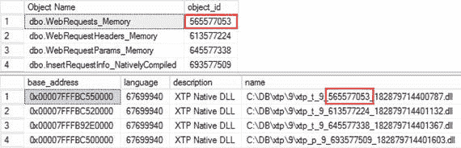

# 原生编译模块

## 原生编译对象简介

`Listing 9-1` 展示了如何获取加载到 SQL Server 内存中的原生编译对象列表。它同时从数据库中返回表和存储过程的列表，以显示 DLL 文件名与对象 ID 之间的关联性。

```sql
select
s.name + '.' + o.name as [Object Name]
,o.object_id
from
(
select schema_id, name, object_id
from sys.tables
where is_memory_optimized = 1
union all
select schema_id, name, object_id
from sys.procedures
) o join sys.schemas s on
o.schema_id = s.schema_id;
select base_address, file_version, language, description, name
from sys.dm_os_loaded_modules
where description = 'XTP Native DLL';
```
`Listing 9-1. 获取加载到 SQL Server 内存中的原生编译对象列表`

`Figure 9-3` 说明了上述代码的输出结果。


`Figure 9-3. 加载到 SQL Server 内存中的原生编译对象`

原生编译模块是指那些被编译为原生代码的存储过程、标量用户定义函数和触发器。它们极其高效，与通过查询互操作组件访问内存优化表的解释型 T-SQL 语句相比，能带来显著的性能提升。

> **注意**
> 在本章中，我将把常规的解释型（非原生编译）模块称为 `T-SQL 模块`。

## 原生编译存储过程

你可以使用常规的 `CREATE PROCEDURE` 语句和 T-SQL 语言来创建原生编译存储过程。然而，这些过程需要指定几个额外的选项。`Listing 9-2` 展示了原生编译存储过程的结构以及这些选项。

```sql
create proc dbo.NativelyCompiledProc
(
/* 参数 */
@Param1 int not null = 1
,@Param2 int
)
with
native_compilation    -- 表示这是原生编译存储过程
,schemabinding        -- 必需
,execute as owner     -- 可选的安全上下文
as
-- 原生编译存储过程作为原子块执行
-- （全部成功或全部失败）
begin atomic with
(
transaction isolation level = snapshot  -- 必需
,language = N'English'                  -- 必需
,delayed_durability = off               -- 可选
,datefirst = 7                          -- 可选
,dateformat = 'mdy'                     -- 可选
)
/* 存储过程主体 */
end
```
`Listing 9-2. 原生编译存储过程结构`

你可以像定义 `T-SQL` 过程一样定义原生编译存储过程的参数。但是，原生编译存储过程允许你在定义中使用 `NOT NULL` 结构来指定参数是否为必需，并且必须在调用时提供。如果你在调用时未提供其值，SQL Server 会引发错误。

> **重要提示**
> 建议你在调用原生编译存储过程时避免类型转换，并且不要使用命名参数。使用 `exec Proc value [..,value]` 的调用格式比 `exec Proc @Param=value [..,@Param=value]` 的调用格式效率更高。
> 你可以使用 `hekaton_slow_parameter_parsing` 扩展事件来检测低效的参数化。

所有原生编译模块都必须是架构绑定的，并且可以指定一个可选的安全上下文。最好避免使用 `EXECUTE AS CALLER` 上下文，因为它会在执行期间增加每条语句的权限检查开销。

> **注意**
> 你可以在 [`https://docs.microsoft.com/en-us/sql/t-sql/statements/execute-as-clause-transact-sql`](https://docs.microsoft.com/en-us/sql/t-sql/statements/execute-as-clause-transact-sql) 阅读有关执行上下文的信息。

另外两个必需的选项包括事务隔离级别和语言设置，后者控制消息的语言和默认日期格式。原生编译模块不使用运行时的 `SET LANGUAGE` 会话选项，而是依赖 `LANGUAGE` 设置。

你可以分别使用 `DATEFORMAT`、`DATEFIRST` 和 `DELAYED_DURABILITY` 设置来控制存储过程的日期格式、每周第一天以及延迟持久性。

> **注意**
> 延迟持久性是 SQL Server 的一个功能，它控制 SQL Server 如何将日志记录硬化，即将其从日志缓冲区刷新到事务日志中。启用延迟持久性有助于在非常繁忙的 OLTP 系统中提高事务吞吐量，但代价是在发生意外的 SQL Server 关机或崩溃时可能会有少量数据丢失。
> 你可以在 [`https://docs.microsoft.com/en-us/sql/relational-databases/logs/control-transaction-durability`](https://docs.microsoft.com/en-us/sql/relational-databases/logs/control-transaction-durability) 阅读更多关于延迟持久性的信息。你也可以在我的《Pro SQL Server Internals》一书的第 30 章中阅读相关内容。

原生编译模块作为原子块执行，这是一种“全部或全部不”的方法；存储过程中的所有语句要么全部成功，要么全部失败。我将在本章后面讨论原子块如何工作。

## 原生编译触发器和用户定义函数

SQL Server 允许你在内存优化表上创建原生编译 DML 触发器以及标量用户定义函数。与原生编译存储过程一样，这些模块无法访问基于磁盘的对象。

`Listing 9-3` 展示了创建这两种对象的代码。

```sql
create trigger NativelyCompiledTrigger on dbo.MemoryOptimizedTable
with native_compilation, schemabinding
after insert
as
begin atomic with
(
transaction isolation level = snapshot
,language = N'English'
)
if @@rowcount = 0
return;
/* 触发器主体 */
end
go
create function dbo.NativelyCompiledScalarFunction(@Param1 int not null)
returns int
with native_compilation, schemabinding
as
begin atomic with
(
transaction isolation level = snapshot
,language = N'us_english'
)
declare
@Result int = 0
/* 函数主体 */
return @Result;
end
```
`Listing 9-3. 原生编译触发器和用户定义函数`

与 `T-SQL` 触发器和标量用户定义函数一样，你应该考虑这些模块带来的开销。你将在本章后面看到用户定义函数的性能开销。

你也可以将内联表值函数标记为原生编译。然而，它们的行为与其他模块不同。当你将这些函数标记为原生编译时，SQL Server 只是验证它们是否使用了原生编译支持的语言结构。这些函数实际上并未被编译，而是被嵌入到引用它们的其他原生编译模块中。

当你通过查询互操作从 `T-SQL` 调用原生编译内联表值函数时，SQL Server 将它们视为常规的 `T-SQL` 内联表值函数，将其语句嵌入到引用的查询中。

`Listing 9-4` 展示了一个原生编译内联表值函数。如你所料，你不需要指定该函数作为原子块执行。

```sql
create function dbo.NativeCompiledInlineTVF(@Param datetime)
returns table
with native_compilation, schemabinding
as
return
(
select count(*) as Result
from dbo.MemoryOptimizedTable
where DateCol >= @Param
)
```
`Listing 9-4. 原生编译内联表值函数`

你可以像定义常规 `T-SQL` 模块一样定义原生编译模块的主体。然而，原生编译模块只支持有限的 `T-SQL` 结构。让我们详细看看在不同 `T-SQL` 领域中支持的功能和限制。


### 支持的 T-SQL 功能

原生编译模块最大的限制之一是它们只能访问内存优化表。若要联接来自内存优化表和磁盘表的数据，唯一的选择是使用解释型 T-SQL 和互操作引擎。

还有一些其他限制需要牢记。原生编译代码不支持并行处理，并且始终具有串行执行计划。它也无法使用 `varheap Table Scan` 操作符访问和扫描表。表扫描是通过扫描其中一个索引的方式来实现的。

SQL Server 2016 支持以下 T-SQL 功能和结构，可用于原生编译。

### 控制流

支持以下控制流选项：

*   `IF` 和 `WHILE`。
*   使用 `SELECT` 和 `SET` 操作符为变量赋值。
*   `RETURN`。
*   `TRY`/`CATCH`/`THROW`（不支持 `RAISERROR`）。为获得更好的性能，建议为整个存储过程使用单个 `TRY`/`CATCH` 块。
*   只要 `DECLARE` 语句中包含初始化程序，就可以将变量声明为 `NOT NULL`。
*   支持嵌套执行。例如，原生编译存储过程可以调用另一个原生编译过程或函数。
*   SQL Server 2016 不支持 `CASE` 语句。但是，它将在 SQL Server 2017 中得到支持。

### 操作符

支持以下操作符：

*   比较运算符，例如 `=`、`<`、`<=`、`>`、`>=`、`<>` 和 `BETWEEN`。
*   一元和二元运算符，例如 `+`、`-`、`*`、`/` 和 `%`。请注意，`+` 运算符同时支持数字和字符串。
*   位运算符，例如 `&`、`|`、`∼`、`^`。
*   逻辑运算符，例如 `AND`、`OR` 和 `NOT`。
*   `IN`、`BETWEEN` 和 `EXISTS` 运算符。

### 查询功能区域

支持以下查询功能区域函数：

*   `SELECT`、`INSERT`、`UPDATE` 和 `DELETE` 操作符。
*   `SELECT DISTINCT` 操作符。
*   与 `INSERT`、`UPDATE` 和 `DELETE` 操作符一起使用的 `OUTPUT` 子句。
*   支持 `CROSS JOIN`、`INNER JOIN`、`LEFT OUTER JOIN` 和 `RIGHT OUTER JOIN`。所有联接在内部都实现为 `LOOP JOIN`。既不支持 `MERGE JOIN` 也不支持 `HASH JOIN`。最后，只能对 `SELECT` 操作符使用联接。
*   `SELECT` 列表以及 `WHERE` 和 `HAVING` 子句中的表达式，只要它们使用支持的运算符，就得到支持。
*   可以在 `FROM` 和 `WHERE` 子句中使用子查询，在 `SELECT` 子句中使用标量子查询。
*   `IS NULL` 和 `IS NOT NULL`。
*   支持 `GROUP BY`，但按字符串或二进制数据分组除外。
*   `TOP` 和 `ORDER BY`。但是，不能在 `TOP` 子句中使用 `WITH TIES` 和 `PERCENT`。此外，当使用 `TOP <constant>` 时，`TOP` 操作符限制为 8,192 行，在联接的情况下甚至可能更少。你可以通过使用 `TOP <变量>` 方法来解决后一个限制。然而，就性能而言，它的效率较低。值得一提的是，`TOP (N) WITH TIES` 将在 SQL Server 2017 中得到支持。
*   `INDEX`、`FORCESCAN`、`FORCESEEK`、`FORCE ORDER`、`INNER LOOP JOIN` 和 `OPTIMIZE FOR` 提示。

### 内置函数

支持以下内置函数：

*   支持所有数学函数。
*   日期/时间函数：`CURRENT_TIMESTAMP`、`DATEADD`、`DATEDIFF`、`DATEFROMPARTS`、`DATEPART`、`DATETIME2FROMPARTS`、`DATETIMEFROMPARTS`、`DAY`、`EOMONTH`、`GETDATE`、`GETUTCDATE`、`MONTH`、`SMALLDATETIMEFROMPARTS`、`SYSDATETIME`、`SYSUTCDATETIME` 和 `YEAR`。
*   字符串函数：`LEN`、`LTRIM`、`RTRIM` 和 `SUBSTRING`。SQL Server 2017 还将支持 `TRIM`、`TRANSLATE` 和 `CONCAT_WS`。
*   错误函数：`ERROR_LINE`、`ERROR_MESSAGE`、`ERROR_NUMBER`、`ERROR_PROCEDURE`、`ERROR_SEVERITY` 和 `ERROR_STATE`。
*   安全函数：`IS_MEMBER`、`IS_ROLEMEMBER`、`IS_SRVROLEMEMBER`、`ORIGINAL_LOGIN`、`SESSION_USER`、`CURRENT_USER`、`SUSER_ID`、`SUSER_SID`、`SUSER_SNAME`、`SYSTEM_USER`、`SUSER_NAME`、`USER`、`USER_ID`、`USER_NAME` 和 `CONTEXT_INFO`。
*   `NEWID` 和 `NEWSEQUENTIALID`。
*   `CAST` 和 `CONVERT`。但是，无法在非 Unicode 字符串和 Unicode 字符串之间进行转换。
*   `ISNULL`。
*   `SCOPE_IDENTITY`。
*   `@@SPID`。
*   可以在原生编译模块内使用 `@@ROWCOUNT`；但是，它的值在模块的开头和结尾都会重置为 0。


### 原子块

原生编译模块以原子块的形式执行，这是一种“全有或全无”的方法；模块中的所有语句要么全部成功，要么全部失败。

当在活动事务的上下文之外调用原生编译模块时，它会启动一个新事务，并在执行结束时提交或回滚该事务。

如果模块是在活动事务的上下文中被调用的，SQL Server 会在模块执行开始时创建一个保存点。如果模块中出现错误，SQL Server 会将事务回滚到创建的保存点。根据错误的严重程度和类型，事务要么能够继续并提交，要么会变得“受损”且无法提交。

让我们创建一个内存优化表和原生编译存储过程，如代码清单 9-5 所示。

```sql
create table dbo.MOData
(
ID int not null
primary key nonclustered
hash with (bucket_count=16),
Value int null
)
with (memory_optimized=on, durability=schema_only);
insert into dbo.MOData(ID, Value)
values(1,1), (2,2);
go
create proc dbo.AtomicBlockDemo
(
@ID1 int not null
,@Value1 bigint not null
,@ID2 int
,@Value2 bigint
)
with native_compilation, schemabinding, execute as owner
as
begin atomic
with
(
transaction isolation level = snapshot
,language=N'English'
)
update dbo.MOData set Value = @Value1 where ID = @ID1;
if @ID2 is not null
update dbo.MOData set Value = @Value2 where ID = @ID2;
end;
```
代码清单 9-5.
原子块与事务：对象创建

此时，`dbo.MOData`表有两行数据，值分别为`(1,1)`和`(2,2)`。第一步，让我们启动事务并调用存储过程两次，如代码清单 9-6 所示。

```sql
begin tran
exec dbo.AtomicBlockDemo 1, -1, 2, -2;
exec dbo.AtomicBlockDemo 1, 0, 2, 999999999999999;
```
代码清单 9-6.
原子块与事务：调用存储过程

存储过程的第一次调用成功，而第二次调用则触发了一个算术溢出错误，如下所示：

```
Msg 8115, Level 16, State 0, Procedure AtomicBlockDemo, Line 49
Arithmetic overflow error converting bigint to data type int.
```

你可以通过这个 select 语句来检查事务是否仍处于活动且可提交状态：`SELECT @@TRANCOUNT as [@@TRANCOUNT], XACT_STATE() as [XACT_STATE()]`。它返回以下结果：

```
@@TRANCOUNT XACT_STATE()
----------- ------------
1           1
```

如果你提交事务并检查表的内容，你会看到数据反映了由第一次存储过程调用所做的更改。尽管第二次调用中的第一条更新语句成功了，但 SQL Server 将其回滚了，因为原生编译存储过程是作为原子块执行的。你可以在`dbo.MOData`表中看到数据。

```
ID          Value
----------- -----------
1           -1
2           -2
```

作为第二个例子，让我们触发一个严重错误，这会使事务“受损”，使其无法提交。一种这样的情况是写/写冲突，即多个会话试图更新相同的行。你可以在两个不同的会话中执行代码清单 9-7 中的代码来触发它。

```sql
begin tran
exec dbo.AtomicBlockDemo 1, 0, null, null;
```
代码清单 9-7.
原子块与事务：写/写冲突

当你在第二个会话中运行代码时，会触发以下异常：

```
Msg 41302, Level 16, State 110, Procedure AtomicBlockDemo, Line 13
The current transaction attempted to update a record that has been updated since this transaction started. The transaction was aborted.
Msg 3998, Level 16, State 1, Line 1
Uncommittable transaction is detected at the end of the batch. The transaction is rolled back.
```

如果你在第二个会话中检查`@@TRANCOUNT`，你会看到 SQL Server 终止了该事务。

```
@@TRANCOUNT

```

如你所见，当原子块在活动事务的上下文中执行时，原子块中的严重错误会回滚整个事务，而非关键错误则将事务回滚到对应于块开始时的保存点。

最后，值得一提的是，原子块是内存 OLTP 的一项功能，在 T-SQL 存储过程中不支持。

## 原生编译模块的优化

解释型 T-SQL 存储过程和其他模块在第一次执行时编译。此外，当它们被清除出计划缓存后，或者在少数其他情况下，例如统计信息过时、数据库架构更改或代码中明确请求的重新编译，它们可能会被重新编译。

这种行为与原生编译模块不同，后者在创建时编译。它们从不自动重新编译，唯一的例外是 SQL Server 或数据库重启。在这些情况下，重新编译发生在第一次调用时。同样值得注意的是，`DBCC FREEPROCCACHE`命令不会强制重新编译原生编译模块。

SQL Server 在编译时不“窥探”参数，而是针对`UNKNOWN`值优化语句。它在优化过程中使用内存优化表的统计信息，这些信息可能已更新，也可能未更新。执行计划在模块重新编译（无论是显式重新编译还是数据库重启后重新编译）之前不会改变。

幸运的是，在原生编译模块的情况下，基数估算错误对性能的影响较小。与基于磁盘的表相反（在后者中，此类错误可能导致由于索引选择不正确而产生的效率极低的计划，从而导致大量的键或 RID 查找操作），内存优化表中的所有索引都引用相同的数据行，简而言之，它们都是行内列的覆盖索引。此外，错误不会影响连接策略的选择——嵌套循环是原生编译模块中唯一支持的连接类型。

然而，编译时的过时统计信息仍然可能导致效率低下的计划。一个例子是在索引列上有多个谓词的查询。SQL Server 需要知道索引的选择性以选择最有效的索引。另一个例子是嵌套循环连接的内外输入选择错误，正如你在第 4 章中看到的那样。

如果表中的数据发生了显著变化，最好重新编译原生编译模块。你可以通过两种不同的方式来做到这一点——要么通过修改模块，要么使用`sp_recompile`存储过程。

这些方法的内部实现和影响是不同的。`sp_recompile`存储过程只是将原生编译模块标记为过时。模块的第一次调用将触发重新编译，类似于数据库启动后发生的情况。触发重新编译的会话以及所有在重新编译期间调用该模块的其他会话都将被阻塞，直到编译完成。

另一方面，模块修改的工作方式不同。SQL Server 在后台重新编译模块，允许其他会话在此期间使用旧版本的代码。编译完成后，SQL Server 会等待所有运行旧代码的会话完成，然后替换内存中的代码。尽管在最终的模块替换阶段仍然存在阻塞，但在编译期间（这通常需要大量时间）没有阻塞。因此，与调用`sp_recompile`相比，模块修改对工作负载的影响更小，并且是在繁忙系统中修改模块的推荐方法。

**提示**

在重新编译或修改原生编译模块之前，请考虑更新其引用表中的统计信息。


最后，值得一提的是，本地编译模块的存在要求你调整系统中的部署流程。通常的做法是在部署开始时创建所有数据库架构对象，包括表和模块。对于 T-SQL 模块而言，部署时机并不重要，但这种策略会在数据库表为空时编译本地编译模块。你应该在表填充了数据且统计信息更新后，稍后重新编译（重新创建）本地编译模块。

## 解释型 T-SQL 与内存优化表

查询互操作（Query Interop）组件为解释型 T-SQL 代码提供了透明的内存优化表访问。在解释模式下，SQL Server 处理内存优化表的方式与处理基于磁盘的表几乎相同。它会优化查询并缓存执行计划，而不管表位于何处。查询执行期间使用的是相同的操作符集。从高层来看，当调用操作符的 `GetRow()` 方法时，根据底层表类型的不同，该调用会被路由到存储引擎或内存 OLTP 引擎。

大多数 T-SQL 功能在解释模式下都受到支持。不过，仍然存在一些例外情况。

*   `TRUNCATE TABLE`。
*   以内存优化表为目标的 `MERGE` 操作符。
*   从 CLR 代码发出的上下文连接。
*   在索引视图中引用内存优化表。你可以在分区视图中引用内存优化表，将来自内存优化表和基于磁盘表的数据组合起来。
*   `DYNAMIC` 和 `KEYSET` 游标，它们会自动降级为 `STATIC`。
*   跨数据库查询和事务。
*   链接服务器。

如你所见，限制列表相当短。然而，查询互操作访问的灵活性是有代价的。本地编译模块通常比其解释型 T-SQL 对应物更高效。在某些情况下，例如内存优化表与基于磁盘表之间的联接，查询互操作是唯一的选择；但是，在可能的情况下，通常更倾向于使用本地编译模块。

## 性能比较

让我们运行几个测试，比较使用本地编译模块和 T-SQL 模块操作内存优化表的几种用例的性能。

### 存储过程性能

作为第一步，我们将比较 T-SQL 和本地编译存储过程的性能。让我们使用 `schema_only` 持久性选项创建两个内存优化表，以避免测试期间的任何 I/O 和事务日志记录开销。你可以在清单 9-8 中看到代码，该清单还创建了一个数字表并填充了值。

```
create table dbo.Customers
(
CustomerId int not null
primary key nonclustered
hash with (bucket_count=262144),
Name nvarchar(255) not null,
CreatedOn datetime2(0) not null
constraint DEF_Customers_CreatedOn
default sysutcdatetime(),
Placeholder char(200) not null,
index IDX_Name nonclustered(Name)
)
with (memory_optimized=on, durability=schema_only);
create table dbo.Orders
(
OrderId int not null
primary key nonclustered
hash with (bucket_count=2097152),
CustomerId int not null,
OrderNum varchar(32) not null,
OrderDate datetime2(0) not null
constraint DEF_Orders_OrderDate
default sysutcdatetime(),
Amount money not null,
Placeholder char(200) not null,
index IDX_CustomerId
nonclustered hash(CustomerId)
with (bucket_count=262144),
index IDX_OrderNum nonclustered(OrderNum)
)
with (memory_optimized=on, durability=schema_only);
create table dbo.Numbers
(
Num int not null
constraint PK_Numbers
primary key clustered
);
;with N1(C) as (select 0 union all select 0) -- 2 rows
,N2(C) as (select 0 from N1 as t1 cross join N1 as t2) -- 4 rows
,N3(C) as (select 0 from N2 as t1 cross join N2 as t2) -- 16 rows
,N4(C) as (select 0 from N3 as t1 cross join N3 as t2) -- 256 rows
,N5(C) as (select 0 from N4 as t1 cross join N4 as t2) -- 65,536 rows
,N6(C) as (select 0 from N5 as t1 cross join N3 as t2) -- 1,048,576 rows
,Ids(Id) as (select row_number() over (order by (select null)) from N6)
insert into dbo.Numbers(Num)
select Id from Ids;
```
清单 9-8. 创建测试表

作为第一步，你将使用三种不同的方法和不同大小的批次来衡量 `INSERT` 性能。前两个存储过程 `InsertCustomers_Row` 和 `InsertCustomers_NativelyCompiled` 将分别使用互操作引擎和本地编译在逐行基础上运行 `INSERT` 语句。第三个存储过程 `InsertCustomers_Batch` 将通过互操作引擎在单个批次中插入所有行。清单 9-9 显示了存储过程的实现。

```
create proc dbo.InsertCustomers_Row
(
@NumCustomers int
)
as
begin
set nocount on
set xact_abort on
declare
@I int = 1;
begin tran
while @I  1048576
begin
raiserror('@NumCustomers should not exceed 1,048,576',10,1);
return;
end;
begin tran
insert into dbo.Customers(CustomerId,Name,Placeholder)
select Num, N'Customer ' + convert(nvarchar(10),Num),'Data'
from dbo.Numbers
where Num <= @NumCustomers
commit
end
go
create proc dbo.InsertCustomers_NativelyCompiled
(
@NumCustomers int not null
)
with native_compilation, schemabinding, execute as owner
as begin atomic with
(
transaction isolation level = snapshot
,language = N'English'
)
declare
@I int = 1;
while @I <= @NumCustomers
begin
insert into dbo.Customers(CustomerId,Name,Placeholder)
values(@I,N'Customer ' + convert(nvarchar(10),@I), 'Data');
set @I += 1;
end;
end;
```
清单 9-9. 向 dbo.Customers 表插入数据

表 9-1 显示了我的环境中，每个存储过程针对 10,000、50,000 和 100,000 行批次的执行时间。如你所见，在逐行插入时，本地编译存储过程几乎快了三倍；与通过互操作引擎进行批量插入相比，大约快了 30% 到 40%。

表 9-1. InsertCustomers 存储过程的执行时间


## Insert 操作性能对比

|   | 10,000 行 | 50,000 行 | 100,000 行 |
| --- | --- | --- | --- |
| `InsertCustomers_Row` | 77 ms | 333 ms | 640 ms |
| `InsertCustomers_Batch` | 40 ms | 170 ms | 340 ms |
| `InsertCustomers_NativelyCompiled` | 24 ms | 120 ms | 222 ms |

## Update 操作性能对比

接下来，让我们比较`UPDATE`操作的性能。清单 9-10 展示了一个本机编译存储过程，该过程更新`dbo.Customers`表中 50%的行。

```sql
create proc dbo.UpdateCustomers
(
@Placeholder char(100) not null
)
with native_compilation, schemabinding, execute as owner
as
begin atomic with
(
transaction isolation level = snapshot
,language = N'English'
)
update dbo.Customers
set Placeholder = @Placeholder
where CustomerId % 2 = 0;
end;
```
清单 9-10.
本机编译存储过程，用于更新`dbo.Customers`表中的数据

表 9-2 显示了`UpdateCustomers`存储过程和通过互操作引擎执行的相同`UPDATE`语句的执行时间。如你所见，本机编译存储过程几乎比互操作方法快五倍。

表 9-2.
更新操作的执行时间

| dbo.UpdateCustomers 本机编译存储过程 | 通过互操作引擎执行的 UPDATE 语句 |
| --- | --- |
| 33 ms | 154 ms |

## Delete 操作性能对比

最后，让我们比较`DELETE`操作的性能。清单 9-11 展示了一个从两个表中删除数据的本机编译存储过程。

```sql
create proc dbo.DeleteCustomersAndOrders
with native_compilation, schemabinding, execute as owner
as
begin atomic with
(
transaction isolation level = snapshot
,language = N'English'
)
delete from dbo.Orders;
delete from dbo.Customers;
end;
```
清单 9-11.
编译存储过程，用于从两个表中删除数据

表 9-3 显示了该存储过程和通过互操作引擎执行的`DELETE`语句的执行时间。在两种情况下，`dbo.Customers`和`dbo.Orders`表都填充了相同的数据，分别为 100,000 行和 1,000,000 行。同样，本机编译存储过程明显更快。

表 9-3.
删除操作的执行时间

| dbo.DeleteCustomersAndOrders 本机编译存储过程 | 通过互操作引擎执行的 DELETE 语句 |
| --- | --- |
| 164 ms | 690 ms |

## SELECT 查询与不同工作负载

另一方面，`SELECT`查询的性能在很大程度上取决于用例。本机编译代码在由点查找和小范围扫描操作组成的 OLTP 工作负载中效果最佳。然而，对于报表和数据仓库查询，互操作引擎可能是更好的选择。正如我已经提到的，本机编译代码不支持并行执行计划，也不使用`varheap`表扫描运算符扫描数据。数据仓库查询在互操作模式下运行得更快是完全可能的，特别是当它们具有并行执行计划和/或使用列存储索引时。此外，本机编译代码不支持哈希连接和合并连接，而在数据仓库工作负载中，对于大型且未排序的输入，这些连接可能比嵌套循环连接性能更好。

### 标量用户定义函数性能

尽管本机编译可以提高标量用户定义函数的性能，但函数调用仍然存在开销。

让我们运行几个测试，比较解释型 T-SQL 和本机编译标量函数的性能。清单 9-12 创建了两个简单的函数，它们只是运行一个空的`WHILE`循环，不进行任何数据访问。

```sql
create function dbo.ScalarInterpret(@LoopCnt int)
returns int
as
begin
declare
@I int = 0
while @I < @LoopCnt
select @I += 1;
return @I;
end
go
create function dbo.ScalarNativelyCompiled(@LoopCnt int)
returns int
with native_compilation, schemabinding
as
begin atomic with
(
transaction isolation level = snapshot
,language = N'us_english')
declare
@I int = 0
while @I < @LoopCnt
select @I += 1;
return @I;
end
```
清单 9-12.
本机编译 vs. 解释型函数：函数创建

在第一个测试中，我们调用函数，在函数内部运行 1,000,000 个执行循环，如清单 9-13 所示。

```sql
select dbo.ScalarInterpret(1000000);
select dbo.ScalarNativelyCompiled(1000000);
```
清单 9-13.
本机编译 vs. 解释型函数：在函数内运行循环

表 9-4 说明了在执行此测试时，我的环境中的执行时间。如你所见，本机编译函数比解释型 T-SQL 对应函数快了几个数量级。

表 9-4.
函数运行 1,000,000 个执行循环时的执行时间

| 解释型 T-SQL 函数 | 本机编译函数 |
| --- | --- |
| 454 ms | 5 ms |

让我们运行另一个测试，在循环中调用函数，如清单 9-14 所示。函数内部不执行`WHILE`循环，而是被调用 1,000,000 次。表 9-5 显示了此测试在我的环境中的执行时间。

表 9-5.
1,000,000 次函数调用的执行时间

| 解释型 T-SQL 函数 | 本机编译函数 |
| --- | --- |
| 12,344 ms | 11,392 ms |

```sql
declare
@Dummy int
,@I int = 0
while @I < 1000000
begin
select @Dummy = dbo.ScalarInterpret(0);
select @I += 1;
end;
set @I = 0;
while @I < 1000000
begin
select @Dummy = dbo.ScalarNativelyCompiled(0);
select @I += 1;
end;
```
清单 9-14.
本机编译 vs. 解释型函数：多次调用

尽管本机编译函数比解释型 T-SQL 函数快得多，但两者的函数调用开销是相似的。除非绝对必要，否则你应该避免在代码中使用标量用户定义函数，即使它们是本机编译的。


