# 10. 数据存储、日志记录与恢复

本章讨论内存 OLTP 如何将持久化内存优化表的数据存储到磁盘上。它阐述了 SQL Server 用于持久化数据的检查点文件对概念，概述了内存 OLTP 中的检查点过程，并讨论了内存优化数据的恢复。本章还解释了为什么与基于磁盘的表相比，内存 OLTP 的日志记录更加高效。

最后，本章演示了内存 OLTP 如何执行表更改，并将其记录在日志和检查点文件中。


## 数据存储

来自持久化内存优化表的数据与基于磁盘的表分开存储。SQL Server 使用一种基于 `FILESTREAM` 技术的流机制来存储它。然而，内存 OLTP 和 `FILESTREAM` 是彼此分开存储数据的，当数据库同时使用这两种技术时，你应该有两个独立的文件组：一个用于内存 OLTP，另一个用于 `FILESTREAM` 数据。

基于磁盘的数据和内存优化数据的存储方式存在概念上的差异。基于磁盘的表存储行的唯一、最新版本。对一行的多次更新会多次更改同一个行对象。行的删除会将其从数据库中移除。最后，在需要时总是可以在数据文件中定位到数据行。

内存 OLTP 采用一种完全不同的方法，它将行的多个版本持久化到磁盘上。对数据行的多次更新会生成多个行对象，每个对象具有不同的生命周期。SQL Server 将它们追加到存储在内存 OLTP 文件组中的二进制文件中，这些文件称为检查点文件，有时也称为检查点文件对（`CFP`）。

无法预测数据行存储在检查点文件中的哪个位置。也没有使用这种操作的用例。这些文件的唯一目的是提供数据持久性，并在数据库启动时提高将数据加载到内存中的性能。

顾名思义，每个检查点文件对由两个文件组成：一个数据文件和一个增量文件。每个 `CFP` 覆盖一定范围的全局事务时间戳值的操作，记录那些 `BeginTs` 值在此范围内的行上的操作。每次插入一行时，它都会被保存到数据文件中。每次删除一行时，有关已删除行的信息都会保存到增量文件中。一次更新会产生两个操作，`INSERT` 和 `DELETE`，并将此信息保存到两个文件中。本章稍后将更详细地介绍所有这些操作的工作原理。

图 10-1 提供了检查点文件对结构的高级概述。

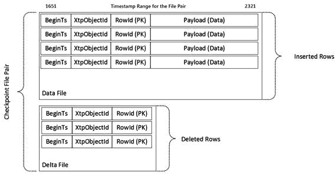

图 10-1. 检查点文件中的数据

如你所记得的，内存优化表可能包含额外的内部表，用于存储溢出行列和列存储索引相关结构的数据。这些内部表被视为单独的对象（检查点文件中的行使用 `xtp_object_id` 作为引用），其中的数据与主行内数据行分开存储。

来自 LOB 列（如 `(n)varchar(max)` 和 `varbinary(max)`）的数据存储在另一种类型的数据文件中，称为大容量数据文件。大容量数据文件具有与常规数据文件相似的结构；但是，它们可以在行的有效负载部分存储超过 8,060 字节的数据。值得注意的是，来自行溢出列表的数据存储在常规数据文件中。

大容量数据文件也用于存储压缩的列存储段。压缩的段数据存储在行的有效负载部分，并通过 `segment_id` 和 `column_id` 值引用。另一方面，删除位图（已删除行表）则作为常规表存储在另一个检查点文件对中。

最后，还有另一种类型的检查点文件，称为根文件。根文件在每次检查点事件时生成，用于跟踪系统中的检查点文件。

图 10-2 展示了一个具有 15 个处于不同状态的检查点文件的数据库示例。我稍后将详细介绍检查点文件的状态。这只是一个示意图；实际数据库中至少会有 17 个处于各种状态的检查点文件。

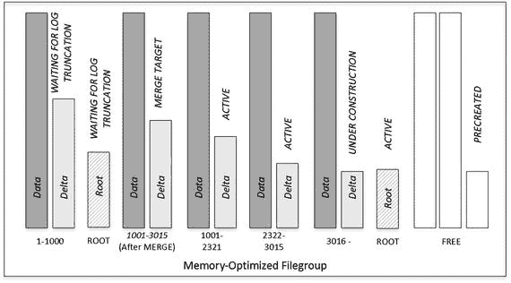

图 10-2. 具有多个检查点文件对的数据库

使用单独的增量文件来记录删除操作，使 SQL Server 能够避免在删除行时修改数据文件和随机 I/O。所有检查点文件都是仅追加的。此外，当文件关闭时（稍后会详细介绍），它们会变为只读。

### 检查点文件状态

每个检查点文件在其生命周期中可以处于几种状态之一，如图 10-3 所示。

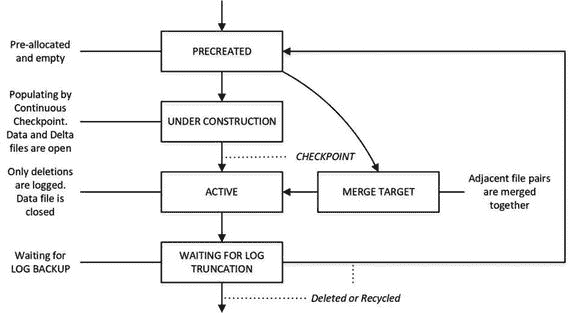

图 10-3. 检查点文件状态

让我们更详细地了解所有这些状态。

#### PRECREATED 状态

当你在数据库中创建第一个内存 OLTP 对象时（包括内存优化表类型和非持久化内存优化表），SQL Server 会生成 17 个检查点文件：1 个根文件和 16 个空文件。这样做是为了在需要新文件时最小化等待时间。

文件的初始大小基于服务器内存量，如表 10-1 所示。然而，如果需要，SQL Server 有可能更改预创建文件的类型。例如，预创建的大容量数据文件可以在需要时转换并用作常规数据文件。

表 10-1. 检查点文件的初始大小

| 服务器内存 | 数据文件大小 | 大容量数据文件大小 | 增量文件大小 | 根文件大小 |
| --- | --- | --- | --- | --- |
| 小于 16GB | 16MB | 8MB | 8MB | 2MB |
| 16GB 或以上 | 128MB | 64MB | 8MB | 16MB |

SQL Server 2016 RTM 支持大型检查点，这是检查点文件的另一种配置，当服务器满足以下要求时启用：

*   服务器具有 16 个或更多逻辑处理器。
*   服务器具有 128GB 或更大内存。
*   服务器 I/O 系统为数据库提供超过 200MB/秒的吞吐量。

在此模式下，SQL Server 使用 1GB/128MB 的数据和增量文件，并将自动检查点过程延迟到事务日志增长 12GB（稍后详述）。虽然此配置可能有助于提高事务日志生成率极高的系统的性能，但可能导致数据库启动时恢复时间更长。此行为已在 SQL Server 2016 CU1/SQL Server 2016 SP1 中被禁用。


#### “构建中”状态与检查点进程

如您所知，SQL Server 使用事务日志来持久化记录数据库中数据的修改信息。在发生意外关机或崩溃时，事务日志记录可用于重做任何数据更改；然而，如果需要重放大量的日志记录，这个过程可能会非常耗时。

SQL Server 使用检查点来缓解这个问题。尽管基于磁盘的表和内存中 OLTP 的检查点进程彼此独立，但它们的作用是相同的：将数据更改持久化到磁盘，从而缩短数据库恢复时间。最后一个检查点标识了数据更改已持久化到哪个时点，以及哪些日志记录需要重放。

对于基于磁盘的表，检查点操作的频率取决于服务器级别的 `recovery interval` 和数据库级别的 `TARGET_RECOVERY_TIME` 设置。虽然这种方法有助于 SQL Server 通过将多个随机 I/O 写入操作批处理在一起来提高写入性能，但它会在检查点发生时导致 I/O 活动出现尖峰。

相比之下，内存中 OLTP 实现了持续检查点。它持续扫描事务日志，将更改流式传输并附加到处于 `UNDER CONSTRUCTION` 状态的检查点文件对中。行的新增版本被附加到数据文件中，删除操作则被附加到增量文件中。持续检查点也会将删除信息附加到处于 `ACTIVE` 状态的 CFP 中，这一点我稍后会讨论。

值得再次强调的是，内存中 OLTP 的检查点依赖于事务日志记录，这与存储引擎的检查点不同，后者扫描并刷新缓冲池中的脏数据页。

在 SQL Server 2016 中，内存中 OLTP 的持续检查点进程是多线程的，与 SQL Server 2014 中的单线程检查点相比效率显著提高。主要工作由序列化线程完成，它们以大约 1MB 的间隔（称为 `segments`）扫描事务日志。这些线程处理这些段，并根据其中的内存中 OLTP 事务日志记录填充数据文件和增量文件。

这些段由段日志记录标识，这些日志记录在事务日志自上一个段日志记录以来增长超过 1MB 时生成。这些日志记录包含有关段内事务范围的信息。控制器线程扫描日志，识别这些段并将其传递给序列化线程。

另一个线程——`timer tasks`——按计划唤醒，并检查自上一个检查点事件以来事务日志是否增长了 1.5GB，或者上一个检查点事件是否发生在六小时之前。当这种情况发生时，内存中 OLTP 会创建另一个内部事务，该事务用一个特殊标志关闭当前打开的段，该标志表示应触发检查点。当控制器线程检测到这个段时，它会唤醒另一个关闭线程，该线程通过将所有 `UNDER CONSTRUCTION` 数据文件转换为 `ACTIVE` 状态，并生成另一个包含检查点时所有活动文件信息的根文件，来执行实际的检查点操作。值得注意的是，无论事务日志增长是由于基于磁盘的事务还是内存中 OLTP 事务引起的，都会触发检查点。

在 SQL Server 2016 RTM 版本中，对于大型检查点，检查点基于 12GB 的事务日志增长来触发。

### ACTIVE 状态

如前所述，检查点事件将所有 `UNDER CONSTRUCTION` 检查点文件的状态更改为 `ACTIVE`。SQL Server 不会将新的数据行附加到 `ACTIVE` 数据文件中，因此它们变为只读；但是，它仍然会将从 `ACTIVE` 数据文件中删除行的信息附加到 `ACTIVE` 增量文件中。

考虑这样一种情况：数据库有两个检查点文件对——一个处于 `ACTIVE` 状态，覆盖 `BeginTs` 区间 0 到 1,000；另一个处于 `UNDER CONSTRUCTION` 状态，覆盖从 `BeginTs` 值 1,001 开始的区间。假设表中在 `ACTIVE` 数据文件中存储了三个数据行。图 10-4 说明了这一点。

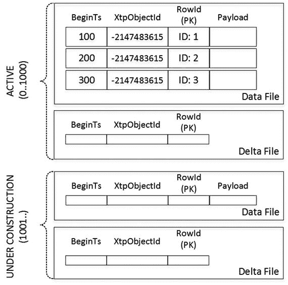

图 10-4. ACTIVE 和 UNDER CONSTRUCTION 检查点文件对

假设有两个事务修改数据，如清单 10-1 所示。

```sql
-- Global Transaction Timestamp: 1100
begin tran
delete from T where RowId = 1;
update T set Col = 1 where RowId = 3;
insert into T(RowId) values(4);
commit;
-- Global Transaction Timestamp: 1200
delete from T where RowId = 4;
```

清单 10-1. 修改表中的数据

第一个事务（全局事务时间戳值为 1,100）删除了 `RowId = 1` 的行，这会将该行添加到 `ACTIVE` CFP 的增量文件中。它还更新了 `RowId = 2` 的行（译者注：原文为 `RowId = 2`，但清单中是 `RowId = 3`，此处按清单翻译），这会在 `ACTIVE` 增量文件中添加另一行，标记旧行版本的删除。数据行的新版本与 `INSERT` 语句中的行一起被插入到 `UNDER CONSTRUCTION` 数据文件中。

第二个事务删除了新插入的行，这会将该行添加到 `UNDER CONSTRUCTION` 增量文件中，如图 10-5 所示。

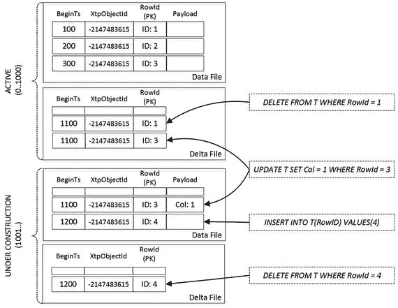

图 10-5. 数据修改后的 ACTIVE 和 UNDER CONSTRUCTION 检查点文件对

通常，磁盘上 `ACTIVE` 检查点文件的总大小约为内存中持久化内存优化表大小的两倍。但在某些情况下，SQL Server 可能需要更多空间来存储内存优化数据。

### MERGE TARGET 状态与合并过程

随着时间的推移，随着数据修改的进行，`ACTIVE` 检查点文件中被删除行的比例会增加。这种情况会增加不必要的存储开销，并减慢恢复期间的数据加载过程。SQL Server 通过一个称为合并的过程来解决这种情况。

一个称为合并策略评估器的后台任务会定期分析相邻的 `ACTIVE` CFP 是否可以合并，以便合并后数据文件中活动的、未删除的行能够容纳进新的 16MB 或 128MB 数据文件中。当这种情况发生时，SQL Server 会创建一个处于 `MERGE TARGET` 状态的新 CFP，并用来自多个 `ACTIVE` CFP 的数据填充它，同时过滤掉被删除的行。

尽管合并策略评估器可以识别多个可能的合并，但每个 CFP 只能参与其中一个合并。表 10-2 展示了一些可能的合并示例。

表 10-2. 合并示例

| 相邻源文件（填充百分比） | 合并结果 |
| --- | --- |
| CFP0 (40%), CFP1 (45%), CFP2 (60%) | CFP0 + CFP1 (85%)。 |
| CFP0 (10%), CFP1 (15%), CFP2 (70%), CFP3 (10%) | CFP0 + CFP1 + CFP2 (95%)。 |
| CFP0 (55%), CFP1 (50%) | 不进行合并。 |

一旦合并过程完成并且检查点发生，`MERGE TARGET` CFP 将转换为 `ACTIVE` 状态，而先前的 `ACTIVE` CFP 将转换为 `WAITING FOR LOG TRUNCATION` 状态。

内存中 OLTP 合并 LOB 列大型数据文件的方式与常规数据文件相同。但是，包含列存储段和根文件的大型数据文件不会被合并，并且可能在不需要合并操作的情况下转换为 `WAITING FOR LOG TRUNCATION` 状态。这种转换发生在检查点事件生成新的根文件之后，或者当列存储索引行组中 90% 的行被删除后该行组被解压缩时。


#### 等待日志截断状态

原先处于`活跃`状态、现处于`等待日志截断`状态的文件中的数据，不再用于数据库恢复。原先的`合并目标`、现处于`活跃`状态的`检查点文件对`可以用于此目的。但是，如果您希望从备份还原数据库，则仍需要那些`等待日志截断`的文件。

检查点文件将保持此状态，直到日志截断点超过其`LSN`。在`完整`恢复模式下，这意味着已进行日志备份，日志记录已发送到辅助节点，并且其他读取事务日志的进程没有落后。显然，在`简单`恢复模式下，不需要日志备份，日志截断点由检查点控制。

一旦发生截断，`等待日志截断`的文件就不再需要。它们可以转换回`预创建`状态，或者如果系统已有足够的`预创建`文件，则可以被删除。

注意：您可以使用`sys.dm_db_xtp_checkpoint_files`视图来分析检查点文件的状态。附录 C 更深入地讨论了此视图，并展示了检查点文件状态在其生命周期中如何变化。

## 恢复

如您所知，恢复过程可能发生在数据库或实例重启、故障转移到另一节点或从备份还原数据库之后。SQL Server 使用`活跃`数据文件和`内存中 OLTP`数据的事务日志，并行执行基于磁盘的表和内存优化表的恢复。

在恢复阶段开始时，SQL Server 定位包含检查点文件信息的最新根文件，并将其传递给`内存中 OLTP 引擎`。引擎获取所有`活跃`检查点文件对的列表，并开始从中加载数据。它仅使用增量文件作为筛选器来加载未删除的行版本。它检查数据文件中的行是否未被删除，且未在增量文件中被引用。根据此检查的结果，行要么被加载到内存中，要么被丢弃。

数据加载过程具有高度可扩展性。SQL Server 为每个逻辑 CPU 创建一个线程，每个线程处理一个单独的检查点文件对。在许多情况下，I/O 子系统的性能成为数据加载性能的限制因素。这就是为什么您应该将检查点文件放在快速的、最好是基于闪存的存储上的原因。

与基于磁盘的表相反，内存优化表上的索引不会被持久化。您还记得，`内存中 OLTP`中的索引只是内存指针，并且行在重新加载到内存中后其内存地址会发生变化。因此，在恢复阶段必须重新创建索引。

图 10-6 说明了数据加载过程。

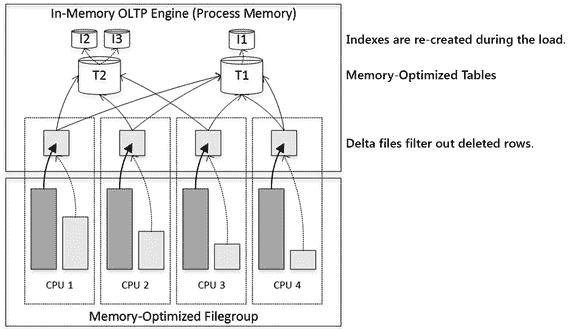

图 10-6. 将数据加载到内存

从`检查点文件对`加载数据后，SQL Server 通过从事务日志尾部应用更改来完成恢复，将数据库恢复到崩溃或关闭时的状态。您已经知道，`内存中 OLTP`不记录未提交的更改；因此，恢复期间不需要`撤销`阶段。

最后，必须提及`AlwaysOn 可用性组`和`故障转移群集`实例在故障转移期间恢复过程的差异。使用`AlwaysOn 故障转移群集`时，故障转移在概念上类似于 SQL Server 重启。数据库将联机，所有内存优化数据都需要加载到内存中。而`AlwaysOn 可用性组`节点只需处理`重做`队列，重放事务日志中未应用部分的事务。内存优化表的数据已经加载到所有节点的内存中。

您应该记住这种行为，并在系统中存在可用性 SLA 时考虑内存优化数据的恢复时间。如果您在基础设施中使用故障转移群集，这一点尤其重要。如前所述，您可以通过将检查点文件放在快速存储上来减少此时间。


## 事务日志记录

正如你已经知道的，与存储引擎相比，内存 OLTP 中的事务日志记录效率更高。两个引擎共享同一个事务日志并执行预写日志(WAL)；然而，日志记录的格式和算法却大不相同。

对于基于磁盘的表，SQL Server 按索引逐个生成事务日志记录。例如，当向一个包含聚集索引和非聚集索引的表中插入单行时，它会在每个单独的索引中分别记录插入操作。此外，它还会记录内部操作，例如区和页分配、页拆分以及其他一些操作。

所有日志记录都保存在事务日志中，并且几乎在创建时就同步固化到磁盘上。尽管每个数据库都有一个名为日志缓冲区的缓存来批量写入日志，但该缓存非常小，大约 60KB。此外，某些操作，如`COMMIT`和`CHECKPOINT`，无论缓存是否已满，都会刷新该缓存。

最后，SQL Server 必须在日志记录中包含行的更新前(UNDO)和更新后(REDO)版本。检查点过程是异步的，它不会检查修改了数据页的事务的状态。检查点完全有可能保存来自未提交事务的脏数据页，而日志记录的 UNDO 部分则用于回滚这些更改。

### 内存 OLTP 日志记录

内存 OLTP 中的事务日志记录解决了这些效率低下的问题。第一个主要区别是，内存 OLTP 在事务`COMMIT`时生成并保存日志记录，而不是在每次数据行修改时。因此，被回滚的事务不会产生任何日志活动。

日志记录的格式也不同。日志记录不包含任何`UNDO`信息。未提交事务的脏数据永远不会持久化到磁盘上；因此，内存 OLTP 日志数据不需要支持崩溃恢复的 UNDO 阶段，也不需要记录未提交的更改。

内存 OLTP 根据事务的写入集生成日志记录。所有数据修改根据写入集和插入行的大小，合并到一个或极少数几个日志记录中。

### 演示日志行为

让我们来检验这种行为，并运行清单 10-2 中显示的代码。它启动一个事务并向内存优化表中插入 500 行数据。然后，它使用未公开的系统函数`sys.fn_dblog`检查事务日志的内容。

```
create table dbo.HKData
(
ID int not null,
Col int not null,
constraint PK_HKData
primary key nonclustered hash(ID)
with (bucket_count=2048),
)
with (memory_optimized=on, durability=schema_and_data);
declare
@I int = 1
begin tran
while @I <= 500
begin
insert into dbo.HKData with (snapshot)
(ID, Col)
values(@I, @I);
set @I += 1
end
commit
go
select *
from sys.fn_dblog(NULL, NULL)
order by [Current LSN];
Listing 10-2.
内存 OLTP 中的事务日志记录：内存优化表日志记录
```

图 10-7 展示了事务日志的内容。你可以看到内存 OLTP 事务的单条事务记录。

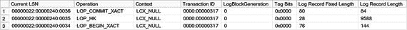
图 10-7.
内存 OLTP 事务后的事务日志内容

### 与基于磁盘的表比较

让我们使用具有类似结构的基于磁盘的表重复此测试。清单 10-3 显示了创建表并用数据填充它的代码。

```
create table dbo.DiskData
(
ID int not null,
Col int not null,
constraint PK_DiskData
primary key nonclustered(ID)
);
declare
@I int = 1
begin tran
while @I <= 500
begin
insert into dbo.DiskData(ID, Col)
values(@I, @I);
set @I += 1;
end
commit
Listing 10-3.
内存 OLTP 中的事务日志记录：基于磁盘的表日志记录
```

如图 10-8 所示，同一个事务生成了超过 1700 条日志记录。

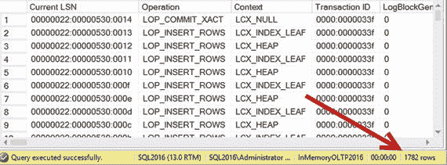
图 10-8.
基于磁盘的表修改后的事务日志内容

### 分析内存 OLTP 日志记录

你可以使用另一个未公开的函数`sys.fn_dblog_xtp`来检查内存 OLTP 日志记录的逻辑内容。清单 10-4 显示了使用此函数的代码。你应该使用清单 10-2 输出中的`LSN_HK`日志记录的 LSN 作为该函数的参数。

```
select [Current LSN], xtp_object_id, operation_desc
,tx_end_timestamp, total_size
from sys.fn_dblog_xtp(null, null)
-- 
where [Current LSN] = '00000022:00000240:0035';
Listing 10-4.
分析一条内存 OLTP 日志记录
```

图 10-9 显示了该代码的输出。

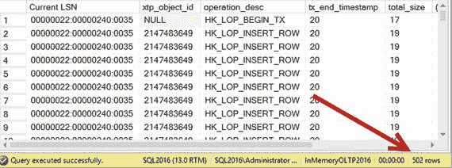
图 10-9.
内存 OLTP 事务日志记录详情

最后，值得再次说明的是，对非持久化表(`DURABILITY=SCHEMA_ONLY`)的任何数据修改都不会记录在事务日志中，其数据也不会持久化到磁盘上。


## 表修改

正如你已了解的，SQL Server 2016 支持使用 `ALTER TABLE` 语句进行表修改。这是一种离线操作，在执行期间会阻塞对表的访问。SQL Server 会生成并编译新版本的表 DLL，然后将其加载到进程内存中。

根据所需更改的不同，`ALTER TABLE` 语句在两种不同的模式下运行。

*   仅元数据修改：对于仅元数据修改，内存优化 OLTP 不会修改数据行的结构。这可能发生在你添加或移除 `DEFAULT`、`CHECK` 和 `FOREIGN KEY` 约束，和/或为内存优化表启用或禁用系统版本控制（时态表）时。
*   常规修改：此类修改要求内存优化 OLTP 更改数据行的格式或内部表对象。这发生在你添加或移除列和索引、更改列数据类型、修改哈希索引的 `bucket_count` 值，以及其他需要数据转换的情况下。

在仅元数据修改期间，SQL Server 更新表元数据，并在需要时创建、删除或刷新与系统版本控制相关的对象到磁盘。数据行不会被重新创建，但添加 `CHECK` 或 `FOREIGN KEY` 约束可能要求内存优化 OLTP 扫描表中的所有数据以验证约束。

另一方面，常规修改将要求内存优化 OLTP 重新创建表。这发生在你需要更改表中的数据行格式和/或索引时。在这种情况下，SQL Server 会创建另一个具有不同 `xtp_object_id` 值的表对象，并将数据从旧对象复制到新对象，在此过程中进行转换。显然，系统需要有足够的内存来容纳数据的两个副本。

### 创建表并获取 xtp_object_id 值

让我们看一个例子，创建两个表，并获取它们的 `xtp_object_id` 值。清单 10-5 展示了执行此操作的代码。

```
create table dbo.TableA
(
Col1 int not null
constraint PK_TableA
primary key nonclustered hash
with (bucket_count=1024),
)
with (memory_optimized=on, durability=schema_and_data);
create table dbo.TableB
(
Col1 int not null
constraint PK_TableB
primary key nonclustered hash
with (bucket_count=1024),
)
with (memory_optimized=on, durability=schema_and_data);
select
'dbo.TableA' as [Table]
,c.index_id, a.xtp_object_id, a.type_desc, a.minor_id
,c.memory_consumer_id, c.memory_consumer_type_desc as [mc type]
from
sys.dm_db_xtp_memory_consumers c join
sys.memory_optimized_tables_internal_attributes a on
a.object_id = c.object_id and
a.xtp_object_id = c.xtp_object_id
where
c.object_id = object_id('dbo.TableA');
select
'dbo.TableB' as [Table]
,c.index_id, a.xtp_object_id, a.type_desc, a.minor_id
,c.memory_consumer_id, c.memory_consumer_type_desc as [mc type]
from
sys.dm_db_xtp_memory_consumers c join
sys.memory_optimized_tables_internal_attributes a on
a.object_id = c.object_id and
a.xtp_object_id = c.xtp_object_id
where
c.object_id = object_id('dbo.TableB');
```

清单 10-5. 创建两个表并获取 xtp_object_id 值

图 10-10 说明了代码的输出结果。

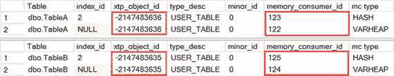

图 10-10. 创建表后的 Xtp_object_id 值

### 修改表

作为下一步，让我们修改这两个表，如清单 10-6 所示。该代码向 `dbo.TableA` 添加了一个 `CHECK` 约束，并向 `dbo.TableB` 添加了一个新列。最后，它再次查询表的 `xtp_object_id` 值。

```
alter table dbo.TableA
add constraint CHK_Col1
check (Col1 > 0);
alter table dbo.TableB
add Col2 int null;
select
'dbo.TableA' as [Table]
,c.index_id, a.xtp_object_id, a.type_desc, a.minor_id
,c.memory_consumer_id, c.memory_consumer_type_desc as [mc type]
from
sys.dm_db_xtp_memory_consumers c join
sys.memory_optimized_tables_internal_attributes a on
a.object_id = c.object_id and
a.xtp_object_id = c.xtp_object_id
where
c.object_id = object_id('dbo.TableA');
select
'dbo.TableB' as [Table]
,c.index_id, a.xtp_object_id, a.type_desc, a.minor_id
,c.memory_consumer_id, c.memory_consumer_type_desc as [mc type]
from
sys.dm_db_xtp_memory_consumers c join
sys.memory_optimized_tables_internal_attributes a on
a.object_id = c.object_id and
a.xtp_object_id = c.xtp_object_id
where
c.object_id = object_id('dbo.TableB');
```

清单 10-6. 修改表

如图 10-11 所示，添加 `CHECK` 约束是一种仅元数据修改，并未更改表的 `xtp_object_id` 值。另一方面，添加一个新列则要求 SQL Server 在内部创建另一个表对象。

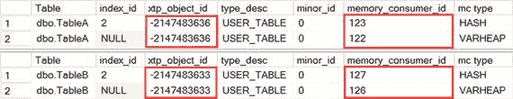

图 10-11. 修改后的 Xtp_object_id 值

### 日志优化

显然，SQL Server 必须记录并持久化表修改事件。此外，在常规修改的情况下，检查点数据文件可能以旧的、修改前的格式存储数据行，这与新的表模式和 DLL 不兼容。内存优化 OLTP 通过应用一种称为日志优化的技术来解决此问题，它将模式更改的历史记录持久化在一个内部转换表中。SQL Server 使用该表在数据库启动期间将数据行转换为新格式，同时将数据加载到内存中。

让我们用一个例子来说明。清单 10-7 展示了创建表并执行两次表修改的代码，在两次修改之间向表中插入了一些数据行。

```
-- Global Transaction Timestamp = 1
-- xtp_object_id = -2147483615
create table dbo.T1
(
Id int not null
constraint PK_T1
primary key nonclustered hash
with (bucket_count=1024),
Col1 int not null;
)
with (memory_optimized=on, durability=schema_and_data);
-- Global Transaction Timestamp = 100
insert into dbo.T1(ID,Col1) values(1,1);
-- Global Transaction Timestamp = 200
-- xtp_object_id = -2147483612
alter table dbo.T1 add Col2 varchar(100);
-- Global Transaction Timestamp = 300
insert into dbo.T1(ID,Col1,Col2) values(2,2,'2');
-- Global Transaction Timestamp = 400
-- xtp_object_id = -2147483609
alter table dbo.T1 alter column Col1 money;
-- Global Transaction Timestamp = 500
insert into dbo.T1(ID,Col1,Col2) values(3,3.33,'3');
```

清单 10-7. 日志优化

表 10-3 说明了转换表的逻辑结构。

表 10-3. 转换表的逻辑结构

| BeginTs | xtp_object_id | Action |
| --- | --- | --- |
| `200` | `-2147483612` | `ADD Coll2 int` |
| `400` | `-2147483609` | `MODIFY Col1 money` |

在数据库启动期间，内存优化 OLTP 从检查点文件中读取行，并根据转换表中的数据将其转换为最新模式。图 10-12 说明了此过程。

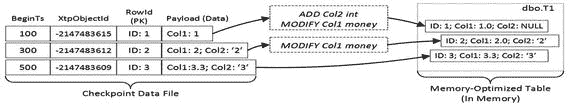

图 10-12. 数据库启动期间的数据行转换


正如你所猜测的，日志优化要求转换过程是确定性的。转换后行的列值必须与原始更改后的值相同。不幸的是，这并非总是可行。考虑一下当你向表中添加一个新列，无论是作为 `identity` 列还是带有 `DEFAULT NEWID() WITH VALUES` 约束的情况。这种修改是非确定性的。无法预测在更改和转换过程中生成的值；因此，日志优化将不起作用。

当日志优化不可能时，SQL Server 会使用朴素日志（naïve logging），并将表更改记录为向新表的一系列独立插入操作，如代码清单 10-8 所示。在此过程中，行会根据新表的架构进行转换。

```
create table NewVersionOfT(..);
insert into NewVersionOfT(..)
select and transform rows according to the new schema
from T;
drop table T;
Listing 10-8.
朴素日志：表 T 的更改（伪代码）
```

内存优化 OLTP（In-Memory OLTP）将 `INSERT SELECT` 操作视为与常规 `INSERT` 操作相同的方式处理。它会将其记录在事务日志中，并且持续检查点会将行写入检查点数据文件。正如你所猜测的，这种方法可能会引入显著的日志开销，尤其是在大表的情况下。此外，需要朴素日志的表更改是单线程的，可能比多线程的日志优化更改慢得多。

还有其他几种情况会导致朴素日志。最值得注意的是向表中添加新的 LOB（大型对象）或行溢出列。如你所知，行外列存储在单独的内部表中，主行通过人工 ID 引用它们。无法预测这些 ID 值并使用日志优化。不幸的是，行外列的更改也不支持日志优化，对行外列的任何更改，包括删除它们或将它们移回行内，都将导致朴素日志。

最后，SQL Server 对任何使用系统或用户定义函数的 `DEFAULT WITH VALUES` 约束都使用朴素日志，即使函数是确定性的。

让我们看看朴素日志的开销。代码清单 10-9 创建了新数据库和内存优化表，并用大约 8GB 的数据填充它。最后，它执行了一个 `CHECKPOINT` 操作，确保内存优化 OLTP 填充了检查点数据文件。

```
create database [InMemoryOLTP2016_Ch10]
on primary
(
name = N'Ch10'
,filename = N'C:\Data\Ch10.mdf'
),
filegroup HKData CONTAINS MEMORY_OPTIMIZED_DATA
(
name = N'Ch10_HKData'
,filename = N'C:\Data\HKData\Ch10'
)
log on
(
name = N'Ch10_Log'
,filename = N'C:\Data\Ch10_log.ldf'
)
go
create table dbo.AlterLogging
(
ID int not null
constraint PK_AlterLogging
primary key nonclustered,
IntCol int not null,
CharCol char(8000) not null
)
with (memory_optimized = on, durability = schema_and_data);
;with N1(C) as (select 0 union all select 0) -- 2 rows
,N2(C) as (select 0 from N1 as t1 cross join N1 as t2) -- 4 rows
,N3(C) as (select 0 from N2 as t1 cross join N2 as t2) -- 16 rows
,N4(C) as (select 0 from N3 as t1 cross join N3 as t2) -- 256 rows
,N5(C) as (select 0 from N4 as t1 cross join N4 as t2) -- 65,536 rows
,N6(C) as (select 0 from N5 as t1 cross join N3 as t2) -- 1,048,576 rows
,Ids(Id) as (select row_number() over (order by (select null)) from N6)
insert into dbo.AlterLogging(Id, IntCol, CharCol)
select Id, Id, Replicate('0',8000)
from Ids;
checkpoint;
Listing 10-9.
朴素日志开销：对象创建
```

代码清单 10-10 展示了如何获取事务日志和检查点文件的文件大小及已用空间信息。

```
select
convert(decimal(9,3),sum(file_size_in_bytes) / 1024\. / 1024)
as [Checkpoint Files Size MB]
,convert(decimal(9,3),sum(file_size_used_in_bytes) / 1024\. / 1024)
as [Checkpoint Files Size Used MB]
from
sys.dm_db_xtp_checkpoint_files;
select
name as [FileName]
,convert(decimal(9,3),size / 128.)
as [Log Size MB]
,convert(decimal(9,3),fileproperty(name,'SpaceUsed') / 128.)
as [Log Size Used MB]
from sys.database_files
where name = 'InMemoryOLTP2016_Ch10_log';
Listing 10-10.
朴素日志开销：获取事务日志和检查点文件的大小
```

图 10-13 展示了 `INSERT` 操作后事务日志和检查点文件的大小。

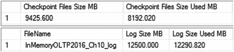
*图 10-13. INSERT 操作后的日志和检查点文件大小*

下一步，让我们通过向表中添加另一个 `int` 列来执行表更改，如代码清单 10-11 所示。如你所知，此操作是日志优化的，在我的环境中耗时 5.3 秒。

```
alter table dbo.AlterLogging add IntCol2 int;
checkpoint;
Listing 10-11.
朴素日志开销：更改表（日志优化更改）
```

如果你再次运行代码清单 10-10 中的查询，你会看到如图 10-14 所示的结果。可以看出，更改并没有显著增加日志和检查点文件的大小。

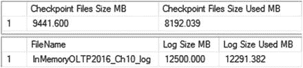
*图 10-14. 日志优化更改后的日志和检查点文件大小*

最后，让我们运行另一个 `ALTER TABLE` 语句，向表中添加一个 LOB 列。此操作不支持日志优化，需要朴素日志。代码清单 10-12 显示了执行此操作的代码。

```
alter table dbo.AlterLogging add LOBCol varchar(max);
checkpoint;
Listing 10-12.
朴素日志开销：更改表（朴素日志）
```

正如我已经提到的，非日志优化的更改是单线程过程。该操作在我的环境中耗时 47.1 秒，大约比日志优化更改慢九倍。它还增加了显著的事务日志开销，并使磁盘上的检查点文件大小翻倍，如图 10-15 所示。

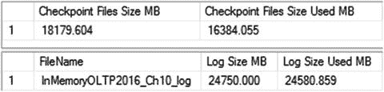
*图 10-15. 朴素日志更改后的日志和检查点文件大小*

表更改开销是另一个你应该在内存优化表中极其谨慎使用行外存储和 LOB 列的原因。

你可以通过将多个类似的架构更改组合到单个 `ALTER TABLE` 语句中来减少表更改的影响，如代码清单 10-13 所示。不幸的是，无法将不同的操作组合到同一个 `ALTER TABLE` 语句中；例如，你不能同时添加和删除列。

```
alter table dbo.TableA add
Col3 int
,Col4 int
,constraint CHK_Columns_Positive
check(Col3 > 0 and Col4 > 0);
alter table dbo.TableB drop column Col1, Col2;
Listing 10-13.
将多个操作组合到单个 ALTER TABLE 语句中
```

最后，SQL Server 2016 SP1 引入了几项重大的性能改进，可以显著减少表更改的时间。此外，添加列存储索引变成了日志优化操作，这在 SQL Server 2016 RTM 中并非如此。


## 总结

持久化内存优化表的数据，在底层被置于一个使用 `FILESTREAM` 技术的独立文件组中。数据存储在一系列不同类型的检查点文件中。数据文件存储行版本数据。增量文件存储有关已删除行的信息。大型对象列和列存索引的数据存储在大型数据文件中。最后，根文件在系统中存储关于检查点文件的信息。

检查点文件中的数据永不更新。`DELETE` 操作会在增量文件中生成新条目。`UPDATE` 操作将行的新版本存储在数据文件中，并在增量文件中将旧版本标记为已删除。SQL Server 利用顺序流式 API 将数据写入这些文件，不涉及任何随机 I/O。

每个检查点文件对都覆盖一个特定的全局事务时间戳值区间，并经历一系列预定义的状态。SQL Server 将新的行数据存储在处于 `UNDER CONSTRUCTION` 状态的 CFP 中。这些 CFP 在检查点事件时转换为 `ACTIVE` 状态。`ACTIVE` CFP 的数据文件被关闭，不再接受新的行版本；但是，它们仍然会在增量文件中记录删除信息。

SQL Server 合并来自 `ACTIVE` 检查点文件对的数据，并过滤掉已删除的行。合并完成后，且源 CFP 已备份，SQL Server 会释放它们或将其切换回 `FREE` 状态。

在数据库恢复期间，`ACTIVE` 检查点文件对连同日志尾部一起使用。内存 OLTP 的恢复过程具有高度可扩展性且非常快速。内存优化表上的索引不会持久化到磁盘，而是在数据加载到内存时重新创建。

与基于磁盘的表相比，内存 OLTP 中的事务日志记录效率更高。事务在 `COMMIT` 时根据事务写入集进行日志记录。日志记录紧凑，并包含多个与行相关操作的信息。

在 SQL Server 2016 中有两种类型的表更改。当您添加或删除表约束和/或更改系统版本控制表属性时，会发生仅元数据更改。SQL Server 不会重新创建表对象；但是，它可能会扫描表中的数据以验证约束。

相比之下，常规更改会在后台重新创建表对象，并为其分配不同的 `xtp_object_id` 值。在确定性转换的情况下，SQL Server 执行日志优化，仅持久化模式更改信息，并在数据库启动时从检查点文件转换行。在非确定性转换的情况下，SQL Server 使用朴素日志记录，并为表中的每一行记录 `INSERT` 事件。

表更改是一个离线操作，在执行期间会阻止对表的访问。您可以通过将多个类似的操作合并到一个 `ALTER TABLE` 语句中来减少更改的影响。

