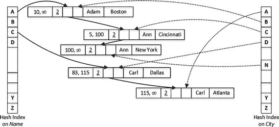
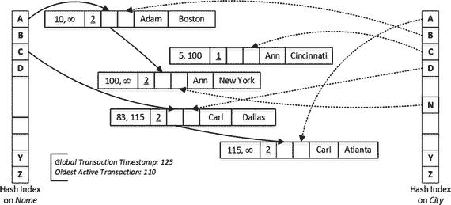
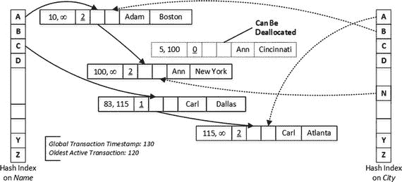
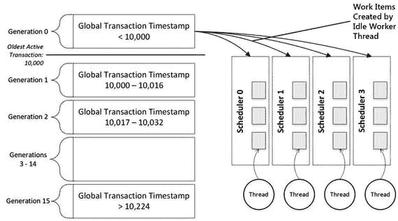
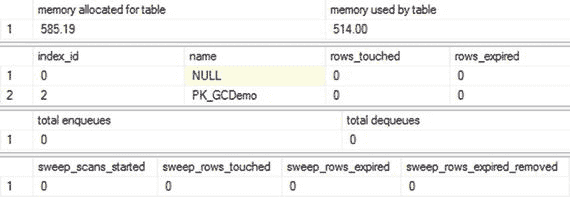
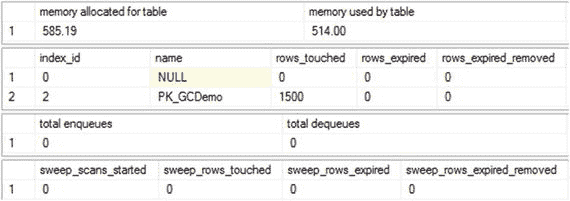
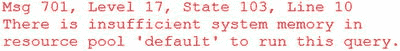

# 11. 垃圾回收

本章涵盖内存 OLTP 引擎中使用的垃圾回收过程。它概述了参与垃圾回收的各种组件，并演示了它们如何相互交互。

## 垃圾回收过程概述

内存 OLTP 是一个行版本控制系统。`UPDATE` 操作生成行的新版本，而不是更新行数据。`DELETE` 操作不会移除行，而是更新行的 `EndTs` 时间戳。由中止事务创建的行不会立即释放，即使在回滚后，它们仍作为索引行链的一部分保留。

如您所知，每一行都有两个时间戳（`BeginTs` 和 `EndTs`），通过指定行的创建时间和删除时间来指示行的生命周期。事务只能看到在其启动时有效的行版本。实际上，这意味着一行仅当事务的逻辑开始时间（事务开始时的全局事务时间戳值）介于该行的 `BeginTs` 和 `EndTs` 时间戳之间时，才对该事务可见。

在某个时刻，当一行的 `EndTs` 时间戳早于系统中最老活动事务的全局事务时间戳时，该行过期。过期的行对活动事务不可见，最终需要被释放以回收系统内存并加速索引链导航。此过程称为垃圾回收。

内存 OLTP 中的垃圾回收过程设计目标如下：

*   **无阻塞**：垃圾回收过程不应阻塞用户线程，并对系统产生最小的性能影响。
*   **响应迅速**：垃圾回收过程应对内存压力做出反应。
*   **协作且可扩展**：垃圾回收过程不应依赖单个系统线程执行内存释放，并且应在过程中利用常规工作线程。

垃圾回收的协作性质使其与典型的 SQL Server 后台进程大不相同。尽管有一个专门的系统垃圾回收线程（每个 NUMA 节点一个），称为空闲工作线程，但大部分工作是由常规的用户工作线程完成的。这使得该过程能够扩展并跟上系统中的工作负载。

用户线程以两种不同的方式参与垃圾回收过程：它们从行链中解除链接旧的、过期的行，并执行实际的释放操作。正如您将看到的，这些操作是相互独立的。

让我们详细看看这个过程。图 11-1 展示了一个表的逻辑结构，该表在 `Name` 和 `City` 列上有两个哈希索引。您在前几章中见过此图；然而，在本章中，我添加了另一个称为 `idxLinkCount` 的元素，它指示行参与了多少个索引链。在图中以带下划线显示；请注意，所有行的值均为 2，这对应于表中的索引数量。



图 11-1. 数据的初始状态

假设您有一个会话，在最老活动事务时间戳为 110、全局事务时间戳为 125 时，运行了如清单 11-1 所示的两个查询。

```
select * from dbo.People where Name = 'Adam';
select * from dbo.People where Name = 'Carl';
```

清单 11-1. 第一个批处理

第一个 `SELECT` 扫描了 `Name` 索引行链中值为 `A` 的存储桶，并检测到 `Ann` 行，其 `EndTs` 值为 100。最老活动事务时间戳是 110，因此该行已过期，对系统中的活动事务不可见。因此，用户线程将该行从 `Name` 索引行链中解除链接，并减少了 `idxLinkCnt` 值。

我想重申一下，此操作是由常规用户工作线程而非系统线程完成的。这说明了垃圾回收的协作性质。


第二个 `SELECT` 检测到了已删除的 `Carl` 行。然而，该行的 `EndTs` 值大于最旧活动事务时间戳，因此该行对于某些活动事务仍然可见。所以，该行无法从索引链中解除链接。图 11-2 说明了执行查询后的数据状态。



图 11-2.
前两个查询执行后的数据状态

现在，假设部分活动事务已完成，你在最旧活动事务时间为 120、全局事务时间为 130 时，运行了清单 11-2 中的第二批查询。

```
select * from dbo.People where City = 'Cincinnat';
select * from dbo.People where City = 'Dallas';
清单 11-2.
第二批查询
```

第一个 `SELECT` 在 `City` 索引链中找到了已过期的 `Ann` 行，并将其从那里移除。此时，该行不再参与任何行链，因此可以被释放。但是，该行不会立即释放；这是在后续阶段完成的。

`Carl` 行现在也已过期，对于活动事务不可见。第二个 `SELECT` 将其从 `City` 索引链中移除；然而，它仍然存在于 `Name` 索引链中，无法被释放。图 11-3 显示了此时的数据状态。



图 11-3.
第二批两个查询执行后的数据状态

重要提示

你应该记住，`最旧活动事务时间戳` 值控制着过期行何时可以从索引链中移除并释放。长时间运行和已放弃的事务会延迟垃圾回收，并可能导致系统因过期行数量过多而耗尽内存。

当事务完成时，`In-Memory OLTP` 会将有关它的信息放入由负责垃圾回收管理的空闲工作线程使用的队列中。空闲工作线程每分钟唤醒一次，或者在负载较重的情况下，当完成的事务数量超过预定义阈值时唤醒。它分析已完成事务列表和系统中的 `最旧活动事务时间戳`，并将已完成的事务分为 16 个不同的队列，称为 `代`，并根据其 `全局事务时间戳` 值进行排序。

*   `第 0 代` 包含在当前 `最旧活动事务时间戳` 之前完成的事务列表。这些事务生成的行立即可供垃圾回收。可以存储在此处的事务数量没有限制。
*   `第 1-14 代` 存储在当前 `最旧活动事务时间戳` 之后完成的事务列表。每代最多可容纳约 16 个事务的信息。你可以猜到，系统可以在 `第 1-14 代` 队列中最多保存 224 个事务。
*   `第 15 代` 存储有关在当前 `最旧活动事务时间戳` 之后完成的其余事务的信息。可以存储在此处的事务数量没有限制。

队列中的每个事务都会向空闲工作线程公开其写入集，该线程为每个待释放的行构建 16 行的工作项集。这些工作项分布在另一组工作线程队列中——每个调度器一个队列——然后由用户线程拾取并处理。用户线程拾取这些项，并在完成其他用户事务的工作后执行释放。

图 11-4 说明了在一个 `最旧活动事务时间戳` 为 10,000 的系统中垃圾回收工作流的示例。



图 11-4.
垃圾回收工作流

用户线程通常从与其运行在相同调度器的队列中获取工作项。但是，如果该队列为空，线程会检查属于同一 `NUMA` 节点的其他 CPU 的队列。最后，在系统负载较重的情况下，线程可以从任何队列中拾取工作项，无论其所属的 `NUMA` 节点是哪个。

对于热点数据和频繁使用的索引，用户线程能相对较快地检测到过期行。然而，对于很少使用的索引和/或很少访问的数据，过期行可能无法被及时检测到。

这个问题由空闲工作线程解决，它们会定期扫描索引并检测其中的过期行。空闲工作线程可以立即释放这些行，或者在它们从所有索引链中解除链接后，将它们添加到工作项中。这个过程称为 **尘埃角落扫描**，有时也称为 **清理扫描**。

如你所见，`In-Memory OLTP` 中的垃圾回收过程是异步完成的。已删除的行和来自中止事务的行会继续使用系统内存，直到它们被释放。你需要记住这一点，并在系统中预留足够的内存来容纳这些行。


## 与垃圾回收相关的数据管理视图

SQL Server 提供了多个可用于监控和分析垃圾回收过程的数据管理视图。

*   `sys.dm_xtp_gc_stats` 视图提供有关垃圾回收过程的统计信息。它包括垃圾回收子系统检查的行数、用户和空闲工作线程处理的行数等信息，以及其他一些属性。你可以在 [`https://docs.microsoft.com/en-us/sql/relational-databases/system-dynamic-management-views/sys-dm-xtp-gc-stats-transact-sql`](https://docs.microsoft.com/en-us/sql/relational-databases/system-dynamic-management-views/sys-dm-xtp-gc-stats-transact-sql) 阅读关于此视图的更多信息。
*   `sys.dm_xtp_gc_queue_stats` 视图提供有关垃圾回收器工作队列的信息。它提供关于已排队和出队的工作项总数、当前队列长度、队列上次访问时间以及队列所见过的最大深度等信息。你可以监控当前队列长度，确保垃圾回收器能跟上进度。更多信息可在 [`https://docs.microsoft.com/en-us/sql/relational-databases/system-dynamic-management-views/sys-dm-xtp-gc-queue-stats-transact-sql`](https://docs.microsoft.com/en-us/sql/relational-databases/system-dynamic-management-views/sys-dm-xtp-gc-queue-stats-transact-sql) 获取。
*   `sys.dm_db_xtp_gc_cycle_stats` 视图提供有关最近（最多 1,024 个）垃圾回收执行周期的信息，包括周期的时间和持续时间，以及事务在代际间的分布。你可以使用此视图查找垃圾回收活动中的峰值，并在排查长时间运行的事务问题时使用。你可以在 [`https://docs.microsoft.com/en-us/sql/relational-databases/system-dynamic-management-views/sys-dm-db-xtp-gc-cycle-stats-transact-sql`](https://docs.microsoft.com/en-us/sql/relational-databases/system-dynamic-management-views/sys-dm-db-xtp-gc-cycle-stats-transact-sql) 阅读关于此视图的更多信息。
*   最后，`sys.dm_db_xtp_index_stats` 视图包含若干与垃圾回收相关的指标。`rows_expired` 列指示有多少行已过期。`rows_expired_removed` 值指示从索引链中取消链接的行数。Phantom row 列提供有关由中止事务插入的行的信息。你可以在 [`https://docs.microsoft.com/en-us/sql/relational-databases/system-dynamic-management-views/sys-dm-db-xtp-index-stats-transact-sql`](https://docs.microsoft.com/en-us/sql/relational-databases/system-dynamic-management-views/sys-dm-db-xtp-index-stats-transact-sql) 阅读关于此视图的更多信息。

## 探索垃圾回收过程

让我们来检查一下垃圾回收过程及其异步特性。第一步，创建一个内存优化表并用 65,536 行数据填充它，如代码清单 11-3 所示。

```
create table dbo.GCDemo
(
ID int not null,
Placeholder char(8000) not null,
constraint PK_GCDemo primary key nonclustered(ID)
)
with (memory_optimized=on, durability=schema_only)
go
;with N1(C) as (select 0 union all select 0) -- 2 行
,N2(C) as (select 0 from N1 as t1 cross join N1 as t2) -- 4 行
,N3(C) as (select 0 from N2 as t1 cross join N2 as t2) -- 16 行
,N4(C) as (select 0 from N3 as t1 cross join N3 as t2) -- 256 行
,N5(C) as (select 0 from N4 as t1 cross join N4 as t2) -- 65,536 行
,Ids(Id) as (select row_number() over (order by (select null)) from N5)
insert into dbo.GCDemo(Id, Placeholder)
select Id, Replicate('0',8000)
from ids;
Listing 11-3.
创建表
```

让我们使用代码清单 11-4 中的代码查看表中使用的内存量、索引统计信息和垃圾回收工作队列统计信息。

```
select
convert(decimal(7,2),memory_allocated_for_table_kb / 1024.)
as [为表分配的内存]
,convert(decimal(7,2),memory_used_by_table_kb / 1024.)
as [表使用的内存]
from
sys.dm_db_xtp_table_memory_stats
where
object_id = object_id(N'dbo.GCDemo');
select
s.index_id, i.name, s.rows_touched
,s.rows_expired, s.rows_expired_removed
from
sys.dm_db_xtp_index_stats s left join sys.indexes i on
s.object_id = i.object_id and
s.index_id = i.index_id
where
s.object_id = object_id(N'dbo.GCDemo');
select
sum(total_enqueues) as [总入队数]
,sum(total_dequeues) as [总出队数]
from
sys.dm_xtp_gc_queue_stats;
select sweep_scans_started, sweep_rows_touched
,sweep_rows_expired, sweep_rows_expired_removed
from sys.dm_xtp_gc_stats;
Listing 11-4.
分析表内存使用情况、索引和工作队列统计信息
```

图 11-5 展示了查询的输出。如你所见，表分配了大约 585MB，使用了 514MB 的空间。没有行被删除或被访问（扫描）。另外，我在测试前重新启动了测试服务器，因此垃圾回收工作队列是空的。作为提醒，第二个输出中 `index_id = 0` 的行代表表 varheap。



图 11-5. 创建表后的内存和垃圾回收统计信息

现在运行几个查询，并在每次运行后分析统计信息。第一步，运行一个在单独事务中删除 1,500 行的脚本（见代码清单 11-5）。

```
declare
@I int = 1
while @I <= 1500
begin
delete from dbo.GCDemo where ID = @I;
set @I += 1;
end;
Listing 11-5.
从表中删除 1,500 行
```

现在再次运行代码清单 11-4 中的代码并查看输出。如图 11-6 所示，索引统计信息表明删除语句访问了 1,500 行；然而，即使删除语句是在单独的自动提交事务中运行的，也没有任何行被标记为过期。



图 11-6. 删除后的内存和垃圾回收统计信息

接下来，运行一个扫描整个索引的 `SELECT` 查询，如代码清单 11-6 所示。我通过在查询中使用索引提示来强制使用索引扫描而不是表扫描。

```
select count(*) from dbo.GCDemo with (index = 2);
Listing 11-6.
扫描表
```


## 12. 部署与管理

本章讨论利用内存 OLTP 的系统的部署与管理方面。它提供了一套关于硬件与服务器配置的指南，并涵盖了与内存 OLTP 相关的数据库管理任务。最后，本章概述了与内存 OLTP 相关的目录和数据管理对象的变更和增强。

### 硬件考量

内存 OLTP 以不同于 SQL Server 存储引擎的方式使用硬件，并且通常更高效。即使使用中端服务器，通常也能实现高 OLTP 吞吐量。此外，内存 OLTP 具有高度可扩展性，随着系统负载和数据量的增加，可以通过向服务器添加更多 CPU 和内存，以及向磁盘阵列添加更多驱动器来提高事务吞吐量。

显然，你不应忘记内存 OLTP 与其他 SQL Server 组件在同一个“沙箱”中运行，并与它们共享资源。内存成为内存 OLTP 和存储引擎竞争的最关键的资源之一。内存优化数据使用的内存对于存储引擎是不可访问的，因此不能用于缓冲池。完全有可能，在内存量不足的服务器上使用内存 OLTP 会对基于磁盘的表的查询性能造成影响，如果需要过多的物理 I/O。在设计系统时应记住这一点，避免将不必要的数据放入内存优化的表中。

> **提示**
> 考虑将热门的当前数据和很少访问的历史数据分别放在内存优化的表和基于磁盘的表中。我将在下一章更深入地讨论这种场景。

让我们讨论内存 OLTP 对不同硬件组件的要求。显然，在构建利用内存 OLTP 的服务器时，你需要考虑来自其他 SQL Server 组件的工作负载。

### CPU

系统中的 CPU 数量很大程度上取决于所需的 OLTP 吞吐量。然而，如前所述，即使使用中端服务器，也完全有可能实现高事务吞吐量。如果不进行一些测试和分析，就无法预测需要多少个 CPU；但是，使用合适的硬件是有益的，它允许你随着负载增长进行扩展并添加更多 CPU。

在可能的情况下，你应该选择基础时钟速度更高的处理器。使用 SQL Server 按核心许可，与速度较慢、核心较多的 CPU 相比，使用高端 CPU（核心较少但单线程性能更高）通常可以获得更好的 OLTP 性能/成本比。这在 SQL Server 标准版的情况下也极为关键，其限制为 4 个插槽或 24 个核心中的较小值。你将无法将 CPU 扩展到此限制之外，而更快的 CPU 将允许你在 SQL Server 的非企业版中实现更好的事务吞吐量。

最后，你应该在服务器上启用超线程。


### I/O 子系统

一般规则是，应将内存优化 OLTP 文件组放置在专为顺序 I/O 性能优化的专用磁盘阵列上。在可能的情况下，最好使用基于闪存的存储。尽管基于 HDD 的磁盘阵列可以提供足够好的顺序 I/O 性能来处理常规的内存优化 OLTP 工作负载，但它们在数据库启动期间可能成为瓶颈。如您所知，内存优化 OLTP 恢复过程具有高度的可扩展性，多个调度器并行地从不同的检查点文件加载数据。通常，I/O 性能成为 SQL Server 恢复内存优化数据的速度限制因素。

如果数据库在其服务级别协议（SLA）中具有较低的恢复时间目标（RTO）指标，则恢复性能变得更加重要。尽管包含内存优化 OLTP 文件组的数据库支持企业版的分段恢复，但 SQL Server 必须将所有内存优化 OLTP 数据与 `PRIMARY` 文件组一起联机。您无法将内存优化 OLTP 文件组的恢复推迟到恢复过程的后期阶段。

提高恢复性能的方法之一是在内存优化 OLTP 文件组中创建多个容器，将它们放置在使用不同 HBA 适配器的不同磁盘阵列中，如果是网络存储，则使用不同的访问路径。SQL Server 将检查点文件分布在各个容器上，并将从多个驱动器并行加载它们。

清单 12-1 展示了如何创建一个在内存优化 OLTP 文件组中包含两个容器的数据库，分别将它们放置在 `H:\HKData` 和 `K:\HKData` 文件夹中。

```
create database HKMultiContainers
on primary
(
name = N'HKMultiContainers'
,filename = N'M:\HKMultiContainers.mdf'
),
filegroup HKData CONTAINS MEMORY_OPTIMIZED_DATA
(
name = N'HKMultiContainers_HKData1'
,filename = N'H:\HKData\HKMultiContainers'
),
(
name = N'HKMultiContainers_HKData2'
,filename = N'K:\HKData\HKMultiContainers'
)
log on
(
name = N'HKMultiContainers_Log'
,filename = N'L:\KMultiContainers_log.ldf'
);
```
清单 12-1. 在内存优化 OLTP 文件组中创建带有两个容器的数据库

持续检查点通常不会给磁盘子系统带来极端负载。该过程利用流式 API，并使用有限数量的线程将数据写入磁盘。显然，实际需求将取决于内存优化 OLTP 事务的日志生成速率。

然而，磁盘子系统应提供足够的带宽来并行处理合并过程和持续检查点。通常，如果检查点以给定的 IOPS 填充数据和差异文件，则 I/O 子系统应能处理三倍于该 IOPS 的负载，以同时满足检查点和合并过程的需求。

至于磁盘空间，Microsoft 建议您有足够的空间来容纳来自持久内存优化表的数据大小的四倍空间。显然，您需要将未来的数据增长纳入您的分析考量。

### 内存

系统中需要有足够的内存来容纳所有内存优化表的数据。当 SQL Server 无法为新的行对象分配内存时，它会失败一个事务。通常，SQL Server 在 `INSERT` 和 `UPDATE` 操作期间执行内存分配；但是，如果表包含非聚集索引，并且没有足够的内存来容纳新的差异记录或执行页面合并操作，`DELETE` 操作也可能失败。此外，如果表包含聚集列存储索引，`DELETE` 操作可能需要为删除位图内部表中的新行分配内存。

图 12-1 显示了一条指示内存不足情况的错误消息。


图 12-1. 内存不足错误

内存不足的情况本质上使内存优化 OLTP 数据变为只读。您仍然可以查询数据；但是，在问题解决之前，您无法执行任何数据修改操作。当发生这种情况时，检查垃圾回收过程的状态以确保它没有被旧的活动事务延迟是很有益的。我将在本章后面讨论如何检测此类事务。

在许多情况下，解决内存不足情况的唯一选择是增加可供 SQL Server 和内存优化 OLTP 引擎使用的内存量。当这不可能时，特别是对于 SQL Server 的标准版，您应该检测内存优化 OLTP 中最大的内存消耗者，并通过重构或将它们迁移到基于磁盘的表来减少其内存占用。我将在本章后面讨论如何检测它们。

注意
SQL Server 的标准版每个数据库的内存优化数据限制为 32GB。


