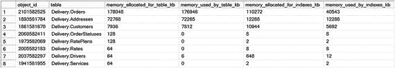
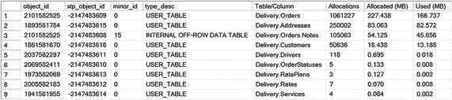
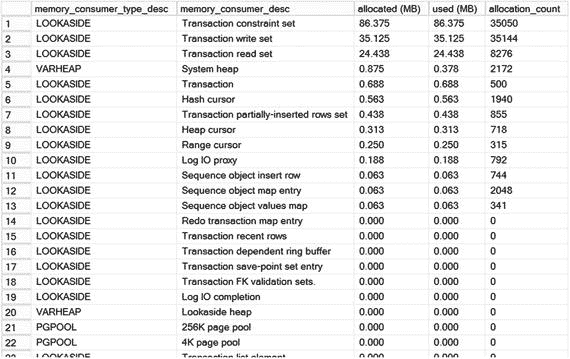
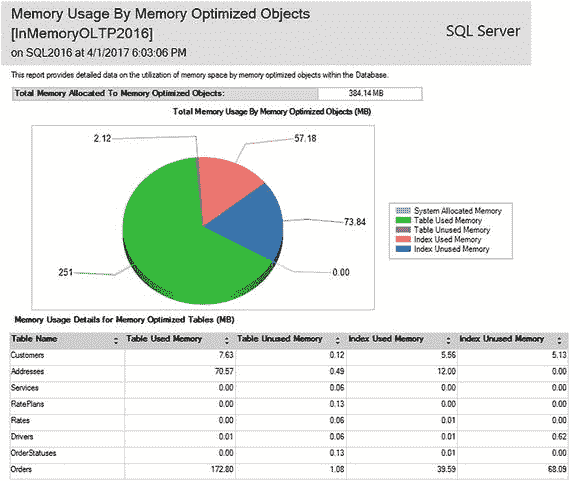
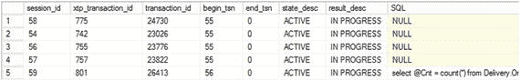
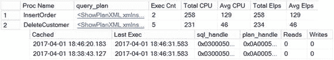

# 估算内存 OLTP 所需内存量

估算内存优化表所需的内存量并非一项简单的任务。作为经验法则，如果表没有溢出存储列，你可以将表中数据的大小翻倍作为估算基础。然而，若要进行更精确的估算，你应综合考虑以下几个不同组件的内存需求。

*   数据行由 24 字节的头部、一个索引指针数组（每个索引 8 字节）和有效负载（实际行数据）组成。例如，如果你的表有 1 亿行、3 个索引，且每行平均约 200 字节，那么存储这些行数据（此数字中未包含任何版本控制开销）将需要 `(24 + 3 * 8 + 200) * 100,000,000 = ∼23.1GB` 的内存。
*   哈希索引每个存储桶使用 8 字节。如果一个表定义了两个哈希索引，每个有 1.5 亿个存储桶，SQL Server 将创建具有 268,435,456 个存储桶的索引（将索引属性中指定的存储桶数向上舍入到下一个 2 的幂）。这两个索引将占用 `268,435,456 * 2 * 8 = 4GB` 的内存。
*   非聚集索引的内存使用量基于唯一索引键的数量和索引键的大小。如果一个表有一个非聚集索引，包含 2500 万个唯一键值，且每个键值平均占用 30 字节，则它将使用 `(30 + 8(指针)) * 25,000,000 = ∼906MB` 的内存。在你的估算中可以忽略页头和非叶级页，因为它们的大小与叶级行大小相比微不足道。
*   溢出存储开销取决于存储在溢出存储内部表中的非空值数量。每个行溢出值增加 64 字节开销，包括一个 24 字节的内部表行结构、两个 8 字节的范围索引指针（在叶级和行内）以及用于存储人工溢出存储 ID 的 24 字节（行内、溢出存储以及内部表范围索引的叶级）。此外，LOB `max` 列会引入 16 个额外字节，用于指向存储数据的 `LOB PAGE ALLOCATOR` 可变堆，并且在那里每 8KB 数据还有额外的 32 字节开销。还有额外的内存用于存储内部范围索引数据页和一个映射表，但与实际数据相比，这部分开销很小。举例来说，如果一个内存优化表在一个行溢出 `varchar(8000)` 列中有 1000 万个非空值，这将需要 `64 * 10,000,000 = ∼610MB` 的内存来将这些数据存储在内部溢出存储表中。
*   列存储索引的内存需求难以估算。数据通常会被高度压缩，并且根据经验法则，其消耗的内存通常仅为表中未压缩数据大小的 10% 到 15%。但请记住，内存 OLTP 直到压缩行组中约 90% 的行过期后，才会释放这些行的旧版本。你应在分析中考虑数据的波动性，并微调 `compression_delay` 索引选项，将压缩推迟到数据变为静态时进行。
*   行版本控制内存估算取决于最长事务的持续时间和每秒平均数据修改（插入和更新）次数。例如，如果系统中的某些进程有持续 10 秒的事务，并且系统平均每秒处理 10,000 次数据修改，你可以估算行版本控制存储需要 `10 * 10,000 * 248(行大小) = ∼24MB` 的内存。

显然，以上数字概述了最低限度的内存量。你应该考虑未来的增长和工作负载的变化，并预留一些额外的内存以确保安全。

如前所述，同样重要的是要记住，内存 OLTP 并非在真空中运行；SQL Server 需要为其他组件提供足够的可用内存。请务必将此纳入你的分析。

在系统中设计高可用性或灾难恢复策略时，你也应牢记内存 OLTP 的内存需求。常见的配置是，辅助或备用服务器使用比主服务器性能更低的硬件。这种方法有助于通过在灾难发生时允许系统以降级的性能运行来降低硬件成本。

如果你的数据库使用了内存 OLTP 技术，你必须极其谨慎地使用这种方法。辅助服务器上内存量不足可能会破坏节点间的同步，或导致你在灾难发生时无法恢复数据库。后一种情况也可能发生在你想将生产数据库的副本迁移到开发或测试环境时，而这些环境中的 SQL Server 没有足够的内存来容纳来自生产环境的内存 OLTP 数据。

## 管理与监控任务

让我们看看几个常见的与内存 OLTP 相关的数据库管理和监控任务。

### 限制可用于内存中 OLTP 的内存量

SQL Server 的企业版允许你通过使用资源调控器来管理工作负载和系统资源消耗。在内部，资源调控器使用资源池，这些资源池代表可供 SQL Server 使用的物理资源的子集。你可以将每个资源池视为 SQL Server 内部的一个虚拟实例，并通过指定其参数来控制该资源池可用的资源。最后，你可以通过分类过程将工作负载分配到资源池之间，或更准确地说，分配到资源池的工作组之间。分类是基于用户定义的函数完成的，这允许你为此目的定义复杂的算法。

注意：你可以在 [`https://docs.microsoft.com/en-us/sql/relational-databases/resource-governor/resource-governor`](https://docs.microsoft.com/en-us/sql/relational-databases/resource-governor/resource-governor) 以及我的《Pro SQL Server Internal》一书中阅读更多关于资源调控器的信息。

每个资源调控器配置都会创建两个预定义的资源池：`internal` 和 `default`。顾名思义，`internal` 池处理 SQL Server 的内部工作负载，而 `default` 池处理未分类的工作负载，即所有未被分类到其他资源池的用户工作负载。你可以根据需要创建其他资源池。

如前所述，你可以通过指定参数来控制资源池之间的 CPU、内存和 I/O 分配，例如 `MIN_CPU_PERCENT` 和 `MAX_CPU_PERCENT`、`MIN_MEMORY_PERCENT` 和 `MAX_MEMORY_PERCENT`、`AFFINITY` 以及其他一些参数。你可以将数据库绑定到资源池，对于内存中 OLTP 而言，这将允许你限制数据库中用于内存优化数据的内存量。每个数据库只能绑定到一个资源池；但是，多个数据库可以共享同一个池。在这种情况下，限制将适用于所有这些数据库。

一个资源池最多可以利用系统内存的 80%，这为可用于内存中 OLTP 的内存量设定了限制。该阈值保证了其他 SQL Server 组件有足够的系统内存可以工作，并确保系统在内存压力下保持稳定。

清单 12-2 说明了如何创建和配置资源池，允许其使用 40% 的系统内存。

```sql
create resource pool InMemoryDataPool
with
(
min_memory_percent=40
,max_memory_percent=40
);
alter resource governor reconfigure;
```

清单 12-2. 创建一个资源池

创建资源池后，你可以使用 `sys.sp_xtp_bind_db_resource_pool` 存储过程将数据库绑定到它，如清单 12-3 所示。正如我提到的，这将允许内存中 OLTP 使用资源池内存的 80%。在我们的示例中，资源池内存使用被限制为 40%，这允许内存中 OLTP 最多利用 40 * 0.80 = 32% 的系统内存。

```sql
exec sys.sp_xtp_bind_db_resource_pool
@database_name = 'InMemoryOLTPDemo'
,@pool_name = 'InMemoryDataPool';
-- 你需要将数据库脱机然后再联机
-- 以使更改生效
alter database InMemoryOLTPDemo set offline;
alter database InMemoryOLTPDemo set online;
```

清单 12-3. 将数据库绑定到资源池

不幸的是，将数据库绑定到资源池并不会自动将先前分配的内存转移到新池，你需要将数据库脱机然后再联机以实现这一点。请记住，这将导致一个恢复过程，对于大量的内存中 OLTP 数据，这个过程可能非常耗时。

类似地，你可以通过调用 `sys.sp_xtp_unbind_db_resource_pool` 存储过程来移除绑定，如清单 12-4 所示。调用后，数据库将绑定回默认资源池。

```sql
exec sys.sp_xtp_unbind_db_resource_pool
@database_name = 'InMemoryOLTPDemo';
-- 你需要将数据库脱机然后再联机
-- 以使更改生效
alter database InMemoryOLTPDemo set offline;
alter database InMemoryOLTPDemo set online;
```

清单 12-4. 移除数据库与资源池之间的绑定

你应该记住，资源池的内存将在内存中 OLTP 数据和已分类到该资源池工作组的用户会话之间共享。如果池没有足够的工作空间内存来为查询分配内存授权，查询可能会因内存不足错误而失败，或者被阻塞并必须等待可用内存。将用于限制内存中 OLTP 内存的资源池与处理用户工作负载的池分开更安全。

提示：你可以监控 `RESOURCE_SEMAPHORE` 等待、**内存授权挂起**性能计数器以及 `sys.dm_exec_query_resource_semaphores` 和 `sys.dm_exec_query_memory_grants` 视图，以排查与工作空间内存相关的问题。


### 监控内存优化表的内存使用情况

您可以使用一组数据库管理视图，结合 SQL Server Management Studio 中的 **“内存优化对象的内存使用情况”** 报告，来监控各种内存 OLTP 对象的内存使用情况。

`sys.dm_db_xtp_table_memory_stats` 视图提供了当前数据库中用户和系统内存优化表的高层内存使用统计信息。代码清单 12-5 展示了使用此视图的查询。

```sql
select
    ms.object_id
    ,s.name + '.' + t.name as [table]
    ,ms.memory_allocated_for_table_kb
    ,ms.memory_used_by_table_kb
    ,ms.memory_allocated_for_indexes_kb
    ,ms.memory_used_by_indexes_kb
from
    sys.dm_db_xtp_table_memory_stats ms
    left outer join sys.tables t on
        ms.object_id = t.object_id
    left outer join sys.schemas s on
        t.schema_id = s.schema_id
order by
    ms.memory_allocated_for_table_kb desc
-- 代码清单 12-5.
-- 使用 sys.dm_db_xtp_table_memory_stats 视图
```

图 12-2 展示了我在某个数据库上运行该查询时的输出结果。负的 `object_id` 值将表示系统表（未在输出中显示）。


*图 12-2. sys.dm_db_xtp_table_memory_stats 视图的输出结果*

**注意**
您可以在 [`https://docs.microsoft.com/en-us/sql/relational-databases/system-dynamic-management-views/sys-dm-db-xtp-table-memory-stats-transact-sql`](https://docs.microsoft.com/en-us/sql/relational-databases/system-dynamic-management-views/sys-dm-db-xtp-table-memory-stats-transact-sql) 阅读更多关于 `sys.dm_db_xtp_table_memory_stats` 视图的信息。

`sys.dm_db_xtp_memory_consumers` 视图提供了数据库级别内存使用者的详细信息。您已在第 6 章和第 7 章中见过此视图的实际应用，当时您用它来获取表内存使用者的信息。您可以对该视图的输出进行分组，以获取所需详细程度的内存使用信息。

代码清单 12-6 展示了提供每个内部对象 (`xtp_object_id`) 级别内存使用信息的查询。

```sql
;with MemConsumers(object_id, xtp_object_id, alloc_mb, used_mb, allocs)
as
(
    select
        mc.object_id, mc.xtp_object_id
        ,convert(decimal(9,3),sum(mc.allocated_bytes) / 1024. / 1024.)
            as [allocated (MB)]
        ,convert(decimal(9,3),sum(mc.used_bytes) / 1024. / 1024.)
            as [used (MB)]
        ,sum(mc.allocation_count) as [allocs]
    from
        sys.dm_db_xtp_memory_consumers mc
    group by
        mc.object_id, mc.xtp_object_id
)
select
    mc.object_id, mc.xtp_object_id
    ,a.minor_id, a.type_desc
    ,s.name + '.' + t.name  +
        iif(a.minor_id = 0,'','.' + col.Name)
        as [Table/Column]
    ,mc.allocs as [Allocations]
    ,mc.alloc_mb as [Allocated (MB)]
    ,mc.used_mb as [Used (MB)]
from
    MemConsumers mc
    join sys.memory_optimized_tables_internal_attributes a on
        a.object_id = mc.object_id and
        a.xtp_object_id = mc.xtp_object_id
    left outer join sys.columns col on
        a.object_id = col.object_id and
        a.minor_id > 0 and
        a.minor_id = col.column_id
    left outer join sys.tables t on
        a.object_id = t.object_id
    left outer join sys.schemas s on
        s.schema_id = t.schema_id
order by
    [Allocated (MB)] desc
-- 代码清单 12-6.
-- 使用 sys.dm_db_xtp_memory_consumers 视图
```

图 12-3 展示了该查询的输出。如您所见，输出包含了为 LOB 列 `Delivery.Orders.Notes` 存储数据的内部表的一个单独行。


*图 12-3. sys.dm_db_memory_consumers 视图的输出结果*

**注意**
您可以在 [`https://docs.microsoft.com/en-us/sql/relational-databases/system-dynamic-management-views/sys-dm-db-xtp-memory-consumers-transact-sql`](https://docs.microsoft.com/en-us/sql/relational-databases/system-dynamic-management-views/sys-dm-db-xtp-memory-consumers-transact-sql) 阅读更多关于 `sys.dm_db_xtp_memory_consumers` 视图的信息。

`sys.dm_xtp_system_memory_consumers` 视图提供了内部内存 OLTP 组件所使用内存的信息。代码清单 12-7 展示了使用此视图的查询。

```sql
select
    memory_consumer_type_desc
    ,memory_consumer_desc
    ,convert(decimal(9,3),allocated_bytes / 1024. / 1024.)
        as [allocated (MB)]
    ,convert(decimal(9,3),used_bytes / 1024. / 1024.)
        as [used (MB)]
    ,allocation_count
from
    sys.dm_xtp_system_memory_consumers
order by
    [allocated (MB)] desc
-- 代码清单 12-7.
-- 使用 sys.dm_xtp_system_memory_consumers 视图
```

图 12-4 展示了我的系统中该查询的部分输出。


*图 12-4. sys.dm_xtp_system_memory_consumers 视图的输出结果*

**注意**
您可以在 [`https://docs.microsoft.com/en-us/sql/relational-databases/system-dynamic-management-views/sys-dm-xtp-system-memory-consumers-transact-sql`](https://docs.microsoft.com/en-us/sql/relational-databases/system-dynamic-management-views/sys-dm-xtp-system-memory-consumers-transact-sql) 阅读更多关于 `sys.dm_xtp_system_memory_consumers` 视图的信息。

您可以在 SQL Server Management Studio 对象资源管理器中，通过数据库上下文菜单的 **报告** > **标准报告** 部分访问 **“内存优化对象的内存使用情况”** 报告。图 12-5 展示了该报告的输出。如您所见，此报告返回的数据与 `sys.dm_db_xtp_table_memory_stats` 视图类似。


*图 12-5. “内存优化对象的内存使用情况”报告输出*


### 监控内存 OLTP 事务

`sys.dm_db_xtp_transactions` 视图提供关于系统中活动内存 OLTP 事务的信息。以下是该视图中最为重要的列：
*   `xtp_transaction_id` 是内存 OLTP 事务管理器中事务的内部 ID。
*   `transaction_id` 是系统中的事务 ID。您可以将其用于与其他事务管理视图（例如 `sys.dm_tran_active_transactions`）进行联接。仅涉及内存 OLTP 的事务，例如由本地编译存储过程启动的事务，其 `transaction_id` 值返回为 0。
*   `session_id` 指示启动事务的会话。
*   `begin_tsn` 和 `end_tsn` 指示事务时间戳。
*   `state` 和 `state_desc` 指示事务的状态。可能的值为 `(0)-ACTIVE`（活动）、`(1)-COMMITTED`（已提交）、`(2)-ABORTED`（已中止）和 `(3)-VALIDATING`（正在验证）。
*   `result` 和 `result_desc` 指示事务的结果。可能的值为 `(0)-IN PROGRESS`（进行中）；`(1)-SUCCESS`（成功）；`(2)-ERROR`（错误）；`(3)-COMMIT DEPENDENCY`（提交依赖）；`(4)-VALIDATION FAILED (RR)`（验证失败（RR）），表示违反可重复读取规则；`(5)-VALIDATION FAILED (SR)`（验证失败（SR）），表示违反可序列化规则；以及 `(6)-ROLLBACK`（回滚）。
*   `read_set_row_count`、`write_set_row_count` 和 `scan_set_row_count` 提供关于事务的读取集、写入集和扫描集大小的信息。
*   `commit_dependency_count` 指示该依赖事务已接受的提交数量。

您可以使用 `sys.dm_db_xtp_transactions` 视图来检测系统中运行时间长和孤立的事务。您可能还记得，这些事务会延迟垃圾回收过程并导致内存不足错误。

清单 12-8 展示了一个查询，该查询返回系统中五个最旧的活动内存 OLTP 事务的信息。

```sql
select top 5
t.session_id
,t.transaction_id
,t.begin_tsn
,t.end_tsn
,t.state_desc
,t.result_desc
,substring(
qt.text
,er.statement_start_offset / 2 + 1
,(case er.statement_end_offset
when -1 then datalength(qt.text)
else er.statement_end_offset
end - er.statement_start_offset
) / 2 +1
) as SQL
from
sys.dm_db_xtp_transactions t
left outer join sys.dm_exec_requests er on
t.session_id = er.session_id
outer apply
sys.dm_exec_sql_text(er.sql_handle) qt
where
t.state in (0,3) /* ACTIVE/VALIDATING */
order by
t.begin_tsn
```
清单 12-8.
获取关于五个最旧的活动内存 OLTP 事务的信息

图 12-6 说明了该查询的输出结果。



图 12-6.
系统中五个最旧的活动内存 OLTP 事务

注意

您可以在 [`https://docs.microsoft.com/en-us/sql/relational-databases/system-dynamic-management-views/sys-dm-db-xtp-transactions-transact-sql`](https://docs.microsoft.com/en-us/sql/relational-databases/system-dynamic-management-views/sys-dm-db-xtp-transactions-transact-sql) 阅读更多关于 `sys.dm_db_xtp_transactions` 视图的信息。

### 为本地编译存储过程收集执行统计信息

在查询互操作模式下，当执行计划被缓存时，SQL Server 会收集访问内存优化表的语句的执行统计信息。然而，由于会引入性能影响，它不会收集本地编译模块的执行统计信息。您可以使用 `sys.sp_xtp_control_proc_exec_stats` 在模块级别启用此类收集，并使用系统存储过程 `sys.sp_xtp_control_query_exec_stats` 在语句级别启用。

这两个过程都接受一个布尔参数 `@new_collection_value`，该参数指示是启用还是禁用收集。此外，`sys.sp_xtp_control_query_exec_stats` 允许您提供 `@database_id` 和 `@xtp_object_id` 值来指定要监控的模块。同样值得注意的是，SQL Server 不会持久化收集设置，您需要在每次 SQL Server 重启后重新启用统计信息收集。

重要提示

收集执行统计信息会降低系统的性能。除非正在进行故障排除，否则请勿收集执行统计信息。此外，考虑将收集限制在特定的本地编译模块，以减少对系统的性能影响。

当统计信息收集完毕后，您可以通过 `sys.dm_exec_procedure_stats`、`sys.dm_exec_function_stats` 和 `sys.dm_exec_query_stats` 视图访问它们。

清单 12-9 展示了使用 `sys.dm_exec_procedure_stats` 视图返回存储过程执行统计信息的代码。该代码未将输出限制为本地编译存储过程；但是，您可以通过联接 `sys.dm_exec_procedure_stats` 和 `sys.sql_modules` 视图并按 `uses_native_compliation = 1` 值进行筛选来实现这一点。

```sql
select
object_name(ps.object_id) as [Proc Name]
,p.query_plan
,ps.execution_count as [Exec Cnt]
,ps.total_worker_time as [Total CPU]
,convert(int,ps.total_worker_time / ps.execution_count)
as [Avg CPU] -- in Microseconds
,ps.total_elapsed_time as [Total Elps]
,convert(int,ps.total_elapsed_time / ps.execution_count)
as [Avg Elps] -- in Microseconds
,ps.cached_time as [Cached]
,ps.last_execution_time as [Last Exec]
,ps.sql_handle
,ps.plan_handle
,ps.total_logical_reads as [Reads]
,ps.total_logical_writes as [Writes]
from
sys.dm_exec_procedure_stats ps cross apply
sys.dm_exec_query_plan(ps.plan_handle) p
order by
[Avg CPU] desc
```
清单 12-9.
分析存储过程执行统计信息

图 12-7 说明了清单 12-9 中代码的输出。如您所见，在 SQL Server 2016 中，`sql_handle` 和 `plan_handle` 列都被填充，并且可用于获取存储过程文本和执行计划。同样值得注意的是，没有提供与 I/O 相关的统计信息。本地编译模块仅与内存优化表一起工作，因此不涉及 I/O。



图 12-7.
来自 `sys.dm_exec_procedure_stats` 视图的数据

清单 12-10 展示了使用 `sys.dm_exec_query_stats` 视图获取单个语句执行统计信息的代码。


