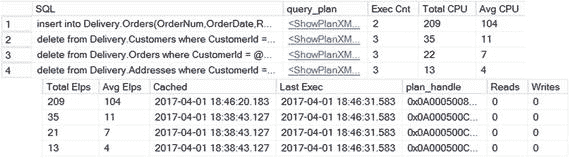
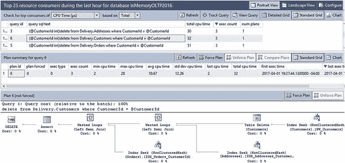
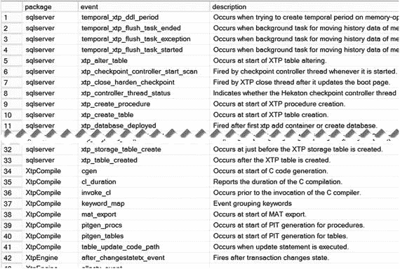
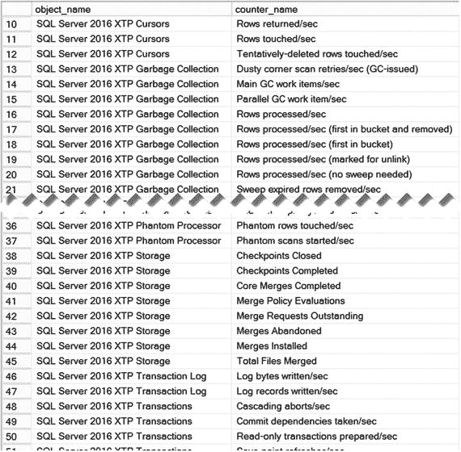

# 代码清单 12-10. 分析存储过程语句执行统计信息

```sql
select
substring(qt.text
,(qs.statement_start_offset/2) + 1
,(case qs.statement_end_offset
when -1 then datalength(qt.text)
else qs.statement_end_offset
end - qs.statement_start_offset) / 2 + 1
) as SQL
,p.query_plan
,qs.execution_count as [执行次数]
,qs.total_worker_time as [总 CPU 时间]
,convert(int,qs.total_worker_time / qs.execution_count)
as [平均 CPU 时间] -- 单位：微秒
,total_elapsed_time as [总耗时]
,convert(int,qs.total_elapsed_time / qs.execution_count)
as [平均耗时] -- 单位：微秒
,qs.creation_time as [缓存时间]
,last_execution_time as [最后执行时间]
,qs.plan_handle
,qs.total_logical_reads as [逻辑读取次数]
,qs.total_logical_writes as [逻辑写入次数]
from
sys.dm_exec_query_stats qs
cross apply sys.dm_exec_sql_text(qs.sql_handle) qt
cross apply sys.dm_exec_query_plan(qs.plan_handle) p
where -- 对于本机编译存储过程，此列为空
qs.plan_generation_num is null
order by
[平均 CPU 时间] desc
```

## 数据来自 sys.dm_exec_query_stats 视图

图 12-8 展示了代码清单 12-10 的输出结果。


**图 12-8.** 来自 `sys.dm_exec_query_stats` 视图的数据

> **注意**
> 你可以在 [`https://docs.microsoft.com/en-us/sql/relational-databases/system-stored-procedures/sys-sp-xtp-control-proc-exec-stats-transact-sql`](https://docs.microsoft.com/en-us/sql/relational-databases/system-stored-procedures/sys-sp-xtp-control-proc-exec-stats-transact-sql) 阅读更多关于 `sys.sp_xtp_control_proc_exec_stats` 存储过程的信息。关于 `sys.sp_xtp_control_query_exec_stats` 存储过程的更多信息可在 [`https://docs.microsoft.com/en-us/sql/relational-databases/system-stored-procedures/sys-sp-xtp-control-query-exec-stats-transact-sql`](https://docs.microsoft.com/en-us/sql/relational-databases/system-stored-procedures/sys-sp-xtp-control-query-exec-stats-transact-sql) 获取。

最后，值得注意的是，无论是 `DBCC FREEPROCCACHE` 命令还是 `ALTER DATABASE SCOPED CONFIGURATION CLEAR PROCEDURE_CACHE` 命令，都不会从计划缓存中移除本机编译模块的执行统计信息。但是，当模块被重新编译时，统计信息会被移除。

## 内存 OLTP 与查询存储集成

查询存储是 SQL Server 2016 的新组件，用于收集系统中查询的执行计划和运行时统计信息。这些统计信息持久化在数据库中，在数据库重启或故障转移后依然存在，这与我刚才讨论的基于计划缓存的执行统计信息不同。

与基于计划缓存的执行统计信息类似，查询存储默认不收集本机编译模块的执行统计信息。你需要使用 `sys.sp_xtp_control_query_exec_stats` 系统存储过程来启用它们。请考虑这带来的性能开销，除非正在排查性能问题，否则不要启用它们。

图 12-9 展示了一个查询存储报告，该报告用于处理来自本机编译存储过程的语句。如你所见，Management Studio 提供了一套强大且便捷的工具，极大地简化了性能故障排查和调优。


**图 12-9.** 查询存储中的“消耗资源最多的查询”报告

> **注意**
> 查询存储的覆盖范围超出了本书的讨论范围。你可以在 [`https://docs.microsoft.com/en-us/sql/relational-databases/performance/monitoring-performance-by-using-the-query-store`](https://docs.microsoft.com/en-us/sql/relational-databases/performance/monitoring-performance-by-using-the-query-store) 以及我的《Pro SQL Server Internals》一书中阅读更多相关信息。

## 元数据更改与增强

内存 OLTP 在目录和数据管理视图中引入了大量更改。

### 目录视图

SQL Server 2016 中有两个与内存 OLTP 相关的目录视图。

#### sys.hash_indexes

顾名思义，`sys.hash_indexes` 视图提供了数据库中定义的哈希索引的信息。它继承自 `sys.indexes` 视图并具有相同的列，额外增加了一个名为 `bucket_count` 的列。你可以在 [`https://docs.microsoft.com/en-us/sql/relational-databases/system-catalog-views/sys-hash-indexes-transact-sql`](https://docs.microsoft.com/en-us/sql/relational-databases/system-catalog-views/sys-hash-indexes-transact-sql) 阅读关于此视图的信息。

#### sys.memory_optimized_tables_internal_attributes

正如你已经知道的，每个内存优化表可能包含额外的内部表来存储行外列数据、列存储索引内部结构以及少数其他对象。`sys.memory_optimized_tables_internal_attributes` 目录视图提供了关于这些内部表的信息，它包含以下列：

*   `object_id` 是用户表的 ID。对于属于该用户表的所有内部表，此 ID 相同。当你更改表时，`object_id` 值不会改变。
*   `xtp_object_id` 是内部表的内部对象 ID。在表更改期间重新创建表对象时，此值可能会改变。
*   `minor_id` 在内部表存储行外列数据时，提供表列的 `column_id` 值。在其他情况下，其值为 0。
*   `type` 和 `type_description` 列指示内部表的类型。可能值如下：
    *   `(0)`: `DELETED_ROWS_TABLE` 是列存储索引中的删除位图。
    *   `(1)`: `USER_TABLE` 是存储行内数据的主表结构。
    *   `(2)`: `DICTIONARIES_TABLE` 是列存储索引的字典。
    *   `(3)`: `SEGMENTS_TABLE` 是列存储索引的压缩段。
    *   `(4)`: `ROW_GROUPS_INFO_TABLE` 是列存储索引中压缩行组的元数据。
    *   `(5)`: `INTERNAL_OFF_ROW_DATA_TABLE` 是存储行外列数据的表。正如我已提到的，`minor_id` 提供行外列的 `column_id` 值，可用于与 `sys.columns` 目录视图进行联接。
    *   `(252)`: `INTERNAL_TEMPORAL_HISTORY_TABLE` 是一个内存缓冲区，包含基于磁盘的历史表的热尾部。历史行首先插入到此内部表中，然后异步移动到基于磁盘的历史表。

当你分析系统中内存优化表的内存消耗时，可以将 `sys.memory_optimized_tables_internal_attributes` 与 `sys.dm_db_xtp_memory_consumers` 视图结合使用。你在本书中已经多次看到它的实际应用。

你可以在 [`https://docs.microsoft.com/en-us/sql/relational-databases/system-catalog-views/sys-memory-optimized-tables-internal-attributes-transact-sql`](https://docs.microsoft.com/en-us/sql/relational-databases/system-catalog-views/sys-memory-optimized-tables-internal-attributes-transact-sql) 阅读更多关于 `sys.memory_optimized_tables_internal_attributes` 视图的信息。


#### 其他目录视图的变更

其他目录视图的变更包括以下内容：

*   `sys.tables` 视图新增了三列。`is_memory_optimized` 列指示表是否为内存优化表。`durability` 和 `durability_desc` 列指示内存优化表的持久性模式。其值为 `(0)-SCHEMA_AND_DATA` 和 `(1)-SCHEMA_ONLY`。
*   `sys.indexes` 视图的 `type` 和 `type_description` 列中新增了一个可能的值，例如 `(7)-NONCLUSTERED HASH`。非聚集 Bw-Tree 索引使用的值为 `(2)-NONCLUSTERED`，与定义在基于磁盘的表上的常规非聚集 B-Tree 索引相同。聚集列存储索引使用的值为 `(5) – CLUSTERED COLUMNSTORE`，并且 `index_id` 值为 1。
*   `sys.sql_modules` 和 `sys.all_sql_modules` 视图新增了一个名为 `uses_native_compilation` 的列。
*   `sys.table_types` 视图新增了一个名为 `is_memory_optimized` 的列，用于指示某个类型是否代表内存优化的表变量。
*   `sys.data_spaces` 视图现在有了新的 `type` 和 `type_desc` 值：`(FX)-MEMORY_OPTIMIZED_DATA_FILEGROUP`。

### 数据管理视图

内存 OLTP 提供了大量新的数据管理视图；通过它们名称中的 `xtp_` 前缀可以轻松识别。命名约定也提供了关于其作用域的信息。`sys.dm_xtp_*` 视图返回实例级别的信息，而 `sys.dm_db_xtp_*` 视图提供数据库级别的信息。让我们按区域分组，更详细地了解它们。

#### 对象与索引统计

以下数据管理视图提供与索引和数据修改相关的统计信息：

*   `sys.dm_db_xtp_object_stats` 按对象报告数据修改影响的行数，以及写入冲突和唯一约束违规。您可以使用此视图分析内存优化表中数据的易变性，并将其与索引使用统计相关联。与基于磁盘的表一样，您可以通过删除在易变表上定义的很少使用的索引来提高数据修改性能。有关此视图的更多信息，请访问 [`https://docs.microsoft.com/zh-cn/sql/relational-databases/system-dynamic-management-views/sys-dm-db-xtp-object-stats-transact-sql`](https://docs.microsoft.com/zh-cn/sql/relational-databases/system-dynamic-management-views/sys-dm-db-xtp-object-stats-transact-sql)。
*   `sys.dm_db_xtp_index_stats` 返回有关索引使用情况的信息，包括行链扫描次数、扫描的行数 (`rows_touched`)、返回给客户端的行数 (`rows_returned`) 以及有关过期行的数据。`rows_touched` 和 `rows_returned` 之间的巨大差异可能表明索引策略效率低下，查询执行了大范围扫描。对于哈希索引，这可能还表明由于哈希表中桶的数量不足，导致索引行链过长。您可以在 [`https://docs.microsoft.com/zh-cn/sql/relational-databases/system-dynamic-management-views/sys-dm-db-xtp-index-stats-transact-sql`](https://docs.microsoft.com/zh-cn/sql/relational-databases/system-dynamic-management-views/sys-dm-db-xtp-index-stats-transact-sql) 阅读有关此视图的信息。
*   `sys.dm_db_xtp_nonclustered_index_stats` 提供有关非聚集（范围）索引的信息，例如索引中的页数、增量页数以及页拆分和合并统计信息。您可以在 [`https://docs.microsoft.com/zh-cn/sql/relational-databases/system-dynamic-management-views/sys-dm-db-xtp-nonclustered-index-stats-transact-sql`](https://docs.microsoft.com/zh-cn/sql/relational-databases/system-dynamic-management-views/sys-dm-db-xtp-nonclustered-index-stats-transact-sql) 阅读有关此视图的信息。
*   `sys.dm_db_xtp_hash_index_stats` 提供有关哈希索引的信息，例如索引中的桶数、空桶数以及行链长度信息。当您需要分析哈希索引的状态并微调其 `bucket_count` 分配时，此视图非常有用。您可以在 [`https://docs.microsoft.com/zh-cn/sql/relational-databases/system-dynamic-management-views/sys-dm-db-xtp-hash-index-stats-transact-sql`](https://docs.microsoft.com/zh-cn/sql/relational-databases/system-dynamic-management-views/sys-dm-db-xtp-hash-index-stats-transact-sql) 阅读有关此视图的信息。

清单 12-11 展示了可用于查找 `bucket_count` 值可能非最优的哈希索引的脚本。

```sql
select
s.name + '.' + t.name as [Table]
,i.name as [Index]
,stat.total_bucket_count as [Total Buckets]
,stat.empty_bucket_count as [Empty Buckets]
,floor(100. * empty_bucket_count / total_bucket_count)
as [Empty Bucket %]
,stat.avg_chain_length as [Avg Chain]
,stat.max_chain_length as [Max Chain]
from
sys.dm_db_xtp_hash_index_stats stat
join sys.tables t on
stat.object_id = t.object_id
join sys.indexes i on
stat.object_id = i.object_id and
stat.index_id = i.index_id
join sys.schemas s on
t.schema_id = s.schema_id
where
stat.avg_chain_length > 3 or
stat.max_chain_length > 50 or
floor(100. * empty_bucket_count /
total_bucket_count) > 50
```
*清单 12-11. 获取关于 `bucket_count` 值可能非最优的哈希索引的信息*

#### 内存使用统计

我已在本章和其他章节讨论过与内存使用相关的视图。不过，作为快速概览，这些视图如下：

*   `sys.dm_xtp_system_memory_consumers` 报告系统中系统级内存使用者的信息。有关此视图的更多信息，请访问 [`https://docs.microsoft.com/zh-cn/sql/relational-databases/system-dynamic-management-views/sys-dm-xtp-system-memory-consumers-transact-sql`](https://docs.microsoft.com/zh-cn/sql/relational-databases/system-dynamic-management-views/sys-dm-xtp-system-memory-consumers-transact-sql)。
*   `sys.dm_db_xtp_table_memory_stats` 提供每个对象级别的内存使用统计信息。您可以在 [`https://docs.microsoft.com/zh-cn/sql/relational-databases/system-dynamic-management-views/sys-dm-db-xtp-table-memory-stats-transact-sql`](https://docs.microsoft.com/zh-cn/sql/relational-databases/system-dynamic-management-views/sys-dm-db-xtp-table-memory-stats-transact-sql) 阅读更多信息。
*   `sys.dm_db_xtp_memory_consumers` 提供有关数据库级别内存使用者的信息。您可以使用此视图分析系统中每个索引的内存分配以及内部表消耗的内存。文档可在 [`https://docs.microsoft.com/zh-cn/sql/relational-databases/system-dynamic-management-views/sys-dm-xtp-system-memory-consumers-transact-sql`](https://docs.microsoft.com/zh-cn/sql/relational-databases/system-dynamic-management-views/sys-dm-xtp-system-memory-consumers-transact-sql) 获取。

#### 事务管理

以下视图提供系统中与事务相关的统计信息：

*   `sys.dm_xtp_transaction_stats` 报告自上次服务器重启以来系统中事务活动的统计信息。它包括事务数量、事务日志活动信息以及许多其他指标。有关此视图的更多信息，请访问 [`https://docs.microsoft.com/zh-cn/sql/relational-databases/system-dynamic-management-views/sys-dm-xtp-transaction-stats-transact-sql`](https://docs.microsoft.com/zh-cn/sql/relational-databases/system-dynamic-management-views/sys-dm-xtp-transaction-stats-transact-sql)。
*   `sys.dm_db_xtp_transactions` 提供系统中当前活动事务的信息。我们在本章中讨论过此视图，您可以在 [`https://docs.microsoft.com/zh-cn/sql/relational-databases/system-dynamic-management-views/sys-dm-db-xtp-transactions-transact-sql`](https://docs.microsoft.com/zh-cn/sql/relational-databases/system-dynamic-management-views/sys-dm-db-xtp-transactions-transact-sql) 阅读更多信息。


### 垃圾回收

以下视图提供系统中垃圾回收过程的信息：

*   `sys.dm_xtp_gc_stats` 报告关于垃圾回收过程的整体统计信息。更多详细信息请访问 [`https://docs.microsoft.com/en-us/sql/relational-databases/system-dynamic-management-views/sys-dm-xtp-gc-stats-transact-sql`](https://docs.microsoft.com/en-us/sql/relational-databases/system-dynamic-management-views/sys-dm-xtp-gc-stats-transact-sql)。
*   `sys.dm_xtp_gc_queue_stats` 提供有关垃圾回收工作项队列状态的信息。您可以使用此视图来监视垃圾回收解除分配过程是否跟得上系统负载。您可以在 [`https://docs.microsoft.com/en-us/sql/relational-databases/system-dynamic-management-views/sys-dm-xtp-gc-queue-stats-transact-sql`](https://docs.microsoft.com/en-us/sql/relational-databases/system-dynamic-management-views/sys-dm-xtp-gc-queue-stats-transact-sql) 阅读关于此视图的更多信息。
*   `sys.dm_db_xtp_gc_cycle_stats` 提供有关空闲工作线程生成队列的信息。我在第 11 章讨论了此视图，您可以在 [`https://docs.microsoft.com/en-us/sql/relational-databases/system-dynamic-management-views/sys-dm-db-xtp-gc-cycle-stats-transact-sql`](https://docs.microsoft.com/en-us/sql/relational-databases/system-dynamic-management-views/sys-dm-db-xtp-gc-cycle-stats-transact-sql) 阅读更多相关内容。

### 检查点

以下视图提供有关当前数据库中检查点操作的信息：

*   `sys.dm_db_xtp_checkpoint_stats` 报告关于数据库检查点操作的整体统计信息。它包含日志文件 I/O 统计信息、连续检查点期间处理的数据量、自上次检查点操作以来的时间以及许多其他指标。有关此视图的更多信息，请访问 [`https://docs.microsoft.com/en-us/sql/relational-databases/system-dynamic-management-views/sys-dm-db-xtp-checkpoint-stats-transact-sql`](https://docs.microsoft.com/en-us/sql/relational-databases/system-dynamic-management-views/sys-dm-db-xtp-checkpoint-stats-transact-sql)。
*   `sys.dm_db_xtp_checkpoint_files` 提供有关数据库中检查点文件对的信息。附录 C 展示了此视图的实际应用，您可以在 [`https://docs.microsoft.com/en-us/sql/relational-databases/system-dynamic-management-views/sys-dm-db-xtp-checkpoint-files-transact-sql`](https://docs.microsoft.com/en-us/sql/relational-databases/system-dynamic-management-views/sys-dm-db-xtp-checkpoint-files-transact-sql) 阅读更多相关内容。

### 扩展事件和性能计数器

SQL Server 拥有大量可用于监视和诊断内存优化表相关操作的扩展事件和性能计数器。您可以使用清单 12-12 中的代码来获取内存优化表扩展事件列表。

```sql
select
xp.name as [package]
,xo.name as [event]
,xo.description as [description]
from
sys.dm_xe_packages xp
join sys.dm_xe_objects xo on
xp.guid = xo.package_guid
where
xp.name like 'XTP%' or xo.name like '%XTP%'
order by
xp.name, xo.name
-- 清单 12-12. 分析内存优化表扩展事件
```

图 12-10 展示了该查询的部分输出。我建议您分析查询的完整输出，并熟悉那些可能对监视和诊断有用的事件。



图 12-10. 内存优化表扩展事件

类似地，您可以使用清单 12-13 中所示的查询来查看内存优化表性能计数器。

```sql
select object_name, counter_name
from sys.dm_os_performance_counters
where object_name like '%XTP%'
order by object_name, counter_name
-- 清单 12-13. 分析内存优化表性能计数器
```

图 12-11 展示了该查询的部分输出。与扩展事件一样，熟悉性能计数器并使用它们来基线化系统工作负载，并在监视和诊断性能问题时使用它们，是非常有益的。



图 12-11. 内存优化表性能计数器

> **注意**
>
> 您可以在 [`https://docs.microsoft.com/en-us/sql/relational-databases/performance-monitor/sql-server-xtp-in-memory-oltp-performance-counters`](https://docs.microsoft.com/en-us/sql/relational-databases/performance-monitor/sql-server-xtp-in-memory-oltp-performance-counters) 阅读关于内存优化表性能计数器的信息。

## 总结

选择正确的硬件是实现良好内存优化表性能和事务吞吐量的关键部分。内存优化表使用硬件的方式与存储引擎不同，当系统使用内存优化表时，您需要仔细规划部署和服务器配置。

内存优化表受益于单线程 CPU 性能。您应选择基础时钟频率高的 CPU，并在系统中启用超线程。

您应该将内存优化表检查点文件存储在针对顺序 I/O 性能优化的磁盘阵列中，最好使用基于 SSD 的驱动器。如果数据库恢复时间至关重要，您可以考虑在内存优化表文件组中使用多个容器，将它们放置在不同的驱动器上。

显然，系统中应有足够的内存来容纳内存优化表数据，同时为其他 SQL Server 组件留出足够的内存。在 SQL Server 企业版中，您可以通过在 Resource Governor 资源池中配置内存并将数据库绑定到该池来限制内存优化表内存使用量。在标准版中，内存优化表每个数据库限于 32GB 的内存优化数据。

内存优化表提供了大量的数据管理视图、性能计数器和扩展事件，您可以用它们来进行系统监控。

