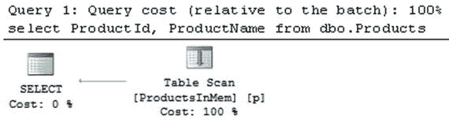

# 13. 利用内存优化表

本章讨论了利用内存优化表的系统的一些设计考虑事项，并演示了在迁移现有系统成本过高时如何从该技术中获益。它还讨论了实现数据分区的方法，这对于拥有大量数据和混合工作负载的系统可能很有帮助。


## 内存 OLTP 系统的设计考量

两年前，我参与本书第一版的撰写时，本章约有一半内容专注于介绍那些有助于克服技术局限性的技术。这些局限性使得`内存 OLTP`在`SQL Server 2014`中仅能作为一种小众技术，因其高昂的实施和重构成本而未能被广泛采用。

幸运的是，`SQL Server 2016`已移除了大部分限制。此外，从`SQL Server 2016 SP1`开始，`内存 OLTP`技术在`SQL Server`的`标准版`中也可用，这使您能够从该技术中获益，并在产品的多个版本间保持统一的系统架构和代码库。

> **注意**
> 请记住，非`企业版`的版本对其可利用的内存数量有所限制。例如，`标准版`每个数据库最多只能使用`32GB`的内存优化数据。

尽管如此，采纳`内存 OLTP`技术是有成本的。您需要购买或升级到`SQL Server 2016`，花费时间学习该技术，并且如果是在迁移现有系统，还需要重构代码并测试变更。进行成本效益分析以确定`内存 OLTP`带来的收益是否足以抵消其成本，这很重要。

`内存 OLTP`绝非某种通过简单地切换开关并将数据移入内存就能提升服务器性能的神奇解决方案。它旨在解决一系列特定问题，例如在非常活跃的 OLTP 系统上的闩锁和锁争用。此外，它还有助于提升那些执行点查找和小范围扫描的小型、频繁执行的 OLTP 查询的性能。

对于并发活动少、数据量大、且查询需要执行大型扫描和复杂聚合的数据仓库系统，`内存 OLTP`的益处则较为有限。在某些情况下，通过将数据移入内存或在内存优化表上创建`列存储索引`，仍然可能实现性能提升；但是，通常使用基于磁盘的表配合`列存储索引`会获得更好的效果，尤其是在专用的数据仓库实现中。

请记住，内存优化的`列存储索引`主要面向操作型分析场景，即需要针对热的 OLTP 数据运行不频繁的报告和分析查询。与基于磁盘的列式存储相比，其功能实现有所限制。内存优化的`列存储索引`无法进行分区，也不能像基于磁盘的聚集`列存储索引`那样成为表中的数据主副本。此外，`内存 OLTP`不允许您`重建`或`重组``列存储索引`来减少增量存储区和删除位图的大小。

您还应记住，内存优化表完全驻留在内存中，内存不足的情况将导致系统停机。对于非`企业版`而言，这一点尤其重要，因为您无法通过向服务器添加额外内存来随数据增长扩展系统。在许多情况下，通过采用数据分区策略来设计系统可能是有益的，即将近期的热数据保存在内存优化表中，而将历史冷数据保存在基于磁盘的表中。我将在本章后面讨论这种实现方式。

正如您所知，`SQL Server 2016`已移除了`SQL Server 2014`中该技术存在的大部分限制。在许多情况下，您可以在无需更改系统模式和代码的情况下，将基于磁盘的表迁移到内存中。然而，有一些重要的注意事项和行为差异您需要牢记，并纳入决策考量。让我们来谈谈最重要的几个。

### 行外存储

尽管`内存 OLTP`支持`LOB`和行溢出列，但其处理方式与存储引擎不同。对于基于磁盘的表，哪些列存储在行外是基于每行数据的行大小决定的；只要数据能装入 8,060 字节的限制内，所有数据都会存储在行内。相比之下，对于内存优化表，该决定严格基于表模式做出；行外列数据将存储在独立的内部表中，无论您在那里存储多少数据，所有行都是如此。

正如您从第[6]章所回忆的，过多的行外列会因`内存 OLTP`必须执行的内部表管理而导致严重的性能影响。此外，行外列会增加内存使用量；每个非空的行外值会增加`64+`字节的开销。您应极其谨慎地使用行外列，除非绝对必要，否则应避免在内存优化表中使用它们。

常见的情况是，许多系统中的文本列被定义为`(n)varchar(max)`以防万一。这是一种不良实践，它会增加查询内存 grant，在系统中引入并发问题，并使索引管理复杂化。然而，这种开销并非总是显而易见，或者也许并非总是与行外数据的存在直接相关。

如果您将这些表迁移到`内存 OLTP`，同时保持行外列不变，情况将会改变。这一决定可能会显著增加内存使用量，并减慢对这些表的查询速度。毕竟，从多个内部表查询或修改数据总是比处理单个表要慢。在迁移前，您需要牢记此行为并分析行外列的使用情况。在许多情况下，您可以将数据类型更改为`(n)varchar(N)`，并将这些列存储在行内。

您还可以考虑实施垂直分区，将一些行外列存储在基于磁盘的表中，如代码清单[13-1]所示。`Description`列存储在基于磁盘的表中，而所有其他列则存储在内存优化表中。系统中的大多数用例不会处理产品描述，因此，在处理`dbo.ProductsInMem`表时，您可以利用原生编译。此外，将产品描述移至基于磁盘的表将允许您利用`全文搜索`功能，而该功能不支持内存优化表。

```
create table dbo.ProductsInMem
(
ProductId int not null identity(1,1)
constraint PK_ ProductsInMem
primary key nonclustered hash
with (bucket_count = 65536),
ProductName nvarchar(64) not null,
ShortDescription nvarchar(256) not null,
index IDX_ProductsInMem_ProductName
nonclustered(ProductName)
)
with (memory_optimized = on, durability = schema_and_data);
create table dbo.ProductDescriptions
(
ProductId int not null,
Description nvarchar(max) not null,
constraint PK_ ProductDescriptions
primary key clustered(ProductId)
);
代码清单 13-1.
垂直分区
```

您可以通过定义视图来向互操作`SELECT`查询隐藏某些实现细节，如代码清单[13-2]所示。您还可以在视图上定义`INSTEAD OF`触发器，并将其用作数据修改的目标；不过，直接更新表中的数据效率更高。

```
create view dbo.Products(ProductId, ProductName,
ShortDescription, Description)
as
select
p.ProductId, p.ProductName, p.ShortDescription
,pd.Description
from
dbo.ProductsInMem p left outer join
dbo.ProductDescriptions pd on
p.ProductId = pd.ProductId
代码清单 13-2.
创建组合来自两个表数据的视图
```


正如你应该注意到的，该视图使用了外连接。这使得当客户端应用程序在查询视图时未引用 `dbo.ProductDescriptions` 表的任何列时，SQL Server 可以执行连接消除。例如，如果你运行了清单 13-3 中的查询，你将看到如图 13-1 所示的执行计划。正如你所见，计划中没有连接操作，并且未访问 `dbo.ProductDescriptions` 表。



图 13-1.
查询的执行计划

```
select ProductId, ProductName
from dbo.Products
清单 13-3.
针对视图的查询
```

不幸的是，无法为基于磁盘的表定义引用内存优化表的 `FOREIGN KEY` 约束；此外，你需要在代码中支持引用完整性。

清单 13-4 展示了向 `dbo.ProductDescriptions` 表插入一行的存储过程。实现看起来很简单；然而，有一个非常重要的细节。该代码使用 `REPEATABLE READ` 事务隔离级别检查 `dbo.ProductsInMem` 行是否存在。这会强制内存 OLTP 为事务构建读取集，并在事务提交时验证所选的 `dbo.ProductsInMem` 行是否存在。如果在 `SELECT` 和 `INSERT` 语句之间其他会话删除了产品行，事务将因可重复读取验证失败而失败。

```
create proc dbo.InsertProductDescription
(
@ProductId int
,@Description nvarchar(max)
)
as
begin
set nocount on
declare
@Exists int
set transaction isolation level read committed
begin tran
-- 使用 REPEATABLE READ 隔离级别
-- 来构建事务读取集
select @Exists = ProductId
from dbo.ProductsInMem with (repeatableread)
where ProductId = @ProductId;
if @Exists is null
raiserror('ProductId %d not found',16,1,@ProductId);
else
insert into dbo.ProductDescriptions
(ProductId, Description)
values(1,@Description);
commit;
end
清单 13-4.
在基于磁盘的表和内存优化表之间强制引用完整性：将行插入引用表
```

清单 13-5 展示了如何执行 `dbo.ProductsInMem` 行的删除操作。正如你所见，`SELECT` 语句使用 `SERIALIZABLE` 隔离级别检查 `dbo.ProductDescriptions` 行是否存在，这会放置一个键范围共享锁，防止其他会话插入具有相同 `ProductId` 值的产品描述。

```
declare
@Cnt int
,@ProductId int = 1
begin tran
-- 使用 SERIALIZABLE 级别来获取范围锁
select @Cnt = count(*)
from dbo.ProductDescriptions with (serializable)
where ProductId = @ProductId;
if @Cnt > 0
raiserror('Referential Integrity Violation',16,1);
else
delete from dbo.ProductsInMem with (snapshot)
where ProductId = @ProductId;
commit;
清单 13-5.
在基于磁盘的表和内存优化表之间强制引用完整性：从被引用表中删除行
```

当你需要在相反方向（即内存优化表引用基于磁盘的表）强制引用完整性时，可以使用类似的方法。然而，在这种情况下，后一个例子（检查内存优化表中引用行的存在）将依赖于事务提交时的可序列化验证，而不是依赖于锁。

综上所述，将数据拆分到内存优化表和基于磁盘的表中会增加系统的复杂性及其开发成本。当表具有大量无法移入行内的溢出列，和/或当你想利用内存 OLTP 不支持的技术（例如全文搜索）时，这可能是有益的。然而，在许多情况下，将溢出列保留在内存优化表中可能更具成本效益，特别是当溢出列数量很少时。

### 不支持的数据类型

尽管 SQL Server 2016 中的内存 OLTP 支持大多数数据类型，但仍有一些不支持的类型，例如 `xml`、`geometry`、`geography`、`hierarchyid`、`datetimeoffset`、`rowversion` 和 `sql_variant`。此外，用户定义的数据类型也不受支持。

作为最简单的解决方法，你可以将它们以二进制或文本格式存储，或者在某些情况下，在可能时将它们分解为关系数据类型。

让我们看一个例子。清单 13-6 展示了一个基于磁盘的表，该表存储来自设备的事件信息以及事件发生的位置。

```
create table dbo.DeviceEvents
(
DeviceId int not null,
EventTime datetime2(0) not null,
Location geography not null,
EventInfo xml not null,
);
create unique clustered index
IDX_DeviceEvents_DeviceId_EventTime
on dbo.DeviceEvents(DeviceId, EventTime);
清单 13-6.
DeviceEvents 基于磁盘的表
```

`geography` 和 `xml` 数据类型在内存 OLTP 中都不受支持。你可以通过将位置信息存储在一对 `decimal` 列中，并使用 `varbinary` 列存储 `xml` 数据来解决此问题，如清单 13-7 所示。

```
create table dbo.DeviceEvents
(
DeviceId int not null,
EventTime datetime2(0) not null,
Lat decimal(9,6) not null,
Long decimal(9,6) not null,
EventInfo varbinary(max) not null,
constraint PK_DeviceEvents
primary key nonclustered(DeviceId, EventTime)
)
with (memory_optimized = on, durability = schema_and_data);
清单 13-7.
DeviceEvents 内存优化表
```

当你通过互操作引擎访问表时，可以将数据转换回 `geometry` 和 `xml` 数据类型，并利用 `XQuery` 和地理空间方法，如清单 13-8 所示。

```
declare
@Loc geography =
geography::Point(47.65600,-122.36000, 4326);
;with DeviceData(DeviceId, EventTime, Location, EventInfo)
as
(
select
DeviceId, EventTime
,geography::Point(Lat, Long, 4326) as Location
,convert(xml,EventInfo) as EventInfo
from dbo.DeviceEvents
)
select
DeviceId, EventTime
,Location.STDistance(@Loc) as Distance
,EventInfo.value('/Event[1]/@Code','int') as [Code]
,EventInfo.value('/Event[1]/@Sensor1','varchar(3)')
as [Status]
from DeviceData;
清单 13-8.
处理 DeviceEvents 数据
```

显然，你也可以像清单 13-1 中的 `dbo.ProductsInMem` 和 `dbo.ProductDescriptions` 表那样，将数据拆分在内存优化表和基于磁盘的表之间。如果你需要为空间或 XML 数据利用索引，这可能是有益的。

不幸的是，没有对 `rowversion` 数据类型行为的内置支持。幸运的是，手动实现这一点很容易。清单 13-9 展示了如何在代码中实现乐观并发，类似于依赖 `rowversion` 列的基于磁盘的实现。

```
create table dbo.OptimisticConcurrency
(
ID int not null
constraint PK_OptimisticConcurrency
primary key nonclustered,
Data int not null,
RowVer uniqueidentifier not null
constraint DEF_OptimisticConcurrency_RowVer
default newid()
)
with (memory_optimized = on, durability = schema_only);
-- 从客户端读取数据
declare
@Data int
,@OldRowVer uniqueidentifier
select @Data = Data, @OldRowVer = RowVer
from dbo.OptimisticConcurrency
where ID = @ID;
-- 将数据保存到数据库
update dbo.OptimisticConcurrency
set
Data = @NewData
,RowVer = newid()
where ID = @ID and RowVer = @OldRowVer;
if @@rowcount = 0
raiserror('Row with ID: %d has been modified by other session',
16,1,@ID);
清单 13-9.
实现乐观并发
```


## 索引注意事项

正如我在本书中已经讨论过的，内存中事务处理（In-Memory OLTP）的索引策略以及在非聚集（范围）索引和哈希索引之间的选择，很大程度上取决于使用它们的数据和查询。非聚集（范围）索引提供了与常规 B-Tree 索引类似的体验。它们可用于相同的使用场景，并提供一套相当的 SARGability 规则。唯一的例外是反向扫描索引。非聚集（范围）索引是单向的，内存中事务处理无法利用它们进行此类扫描。

另一方面，哈希索引仅对点查找搜索和等值连接有用，前提是查询在所有索引键列上使用了等值谓词。假设哈希表中有足够的桶数，它们在那些场景下可能优于范围索引。然而，不充分的 `bucket_count` 值会极大地影响其性能，并使索引变得低效。

对于数据量相对静态且能正确估计索引桶数的目录实体，可以使用哈希索引作为主键。这些实体经常用于等值连接，哈希索引在这些场景下可能非常高效。然而，作为一般规则，使用范围索引是更安全的选择，它简化了内存中事务处理迁移，也减少了系统中的维护开销。

还需要考虑其他几个因素。首先，应该记住，内存优化表上的索引指向实际的数据行对象，并且覆盖行内列。它们不覆盖溢出列，内存中事务处理需要执行类似于 Key Lookup 操作的动作来获取溢出列的值。在将基于磁盘的表迁移到内存时，应该分析表结构，并将经常选择的列保持在行内。

其次，应尝试最小化表中的索引数量，这与基于磁盘的表类似。索引会在 `INSERT` 操作期间增加开销，并减慢数据库恢复和垃圾回收过程。此外，内存中事务处理使用行版本控制，每次更新行时都会创建一个新版本。每个额外的索引都会增加更新开销；无论索引键列是否被更新，内存中事务处理都必须维护索引行链。这与基于磁盘的 B-Tree 索引不同，后者除非更新索引列，否则保持不变。

让我们看一个例子，创建具有相同结构的内存优化表和基于磁盘的表，并插入一些数据。如清单 13-10 所示，两个表都有两个索引和四列。

```sql
create table dbo.MOTable
(
Id int not null,
IdxCol int not null,
IntCol int not null,
VarCharCol varchar(128) null,
constraint PK_MOTable
primary key nonclustered hash(Id)
with (bucket_count = 2097152),
index IDX_IdxCol nonclustered hash(IdxCol)
with (bucket_count = 2097152),
)
with (memory_optimized=on, durability=schema_only);
create table dbo.DBTable
(
Id int not null,
IdxCol int not null,
IntCol int not null,
VarCharCol varchar(128) null,
constraint PK_DBTable
primary key clustered(Id)
);
create index IDX_DBTable_IdxCol on dbo.DBTable(IdxCol);
;with N1(C) as (select 0 union all select 0) -- 2 rows
,N2(C) as (select 0 from N1 as t1 cross join N1 as t2) -- 4 rows
,N3(C) as (select 0 from N2 as t1 cross join N2 as t2) -- 16 rows
,N4(C) as (select 0 from N3 as t1 cross join N3 as t2) -- 256 rows
,N5(C) as (select 0 from N4 as t1 cross join N4 as t2) -- 65,536 rows
,N6(C) as (select 0 from N5 as t1 cross join N3 as t2) -- 1,048,576 rows
,Ids(Id) as (select row_number() over (order by (select null)) from N6)
insert into dbo.MOTable(ID,IdxCol,IntCol)
select Id, Id, Id from Ids;
insert into DBTable(Id, IdxCol, IntCol)
select Id, IdxCol, IntCol from dbo.MOTable;
```

**清单 13-10. 更新开销：表创建**

接下来，让我们对每个表运行三个 `UPDATE` 语句，如清单 13-11 所示。第一条语句修改未索引的固定长度列。第二条更改已索引的固定长度列的值。最后一条语句用一个值填充空的变长列，这会增加行大小并在基于磁盘的表中触发大量的页拆分。

```sql
update dbo.MOTable set IntCol += 1;
update dbo.MOTable set IdxCol += 1;
update dbo.MOTable set VarCharCol = replicate('a',128);
update dbo.DBTable set IntCol += 1;
update dbo.DBTable set IdxCol += 1;
update dbo.DBTable set VarCharCol = replicate('a',128);
```

**清单 13-11. 更新开销：Update 语句**

表 13-1 显示了在我的环境下这些语句的执行时间。如你所见，在内存优化表的情况下，执行时间几乎保持不变，它取决于表中的索引数量。在更新索引键列时，仍然存在与索引维护相关的索引更新开销。内存中事务处理需要计算哈希索引中新的索引键值的哈希桶，或者在非聚集索引中找到新的索引键行链。然而，这个开销相对较小。

**表 13-1. Update 语句的执行时间**

| 操作 | 内存优化表 | 基于磁盘的表 |
| --- | --- | --- |
| 更新未索引列 | 1,016 ms | 1,879 ms |
| 更新已索引列 | 1,036 ms | 4,586 ms |
| 增加行大小的更新 | 1,045 ms | 3,906 ms |

对于基于磁盘的表则不是这种情况，更新索引键列会导致非聚集索引 B-Tree 结构的更新。类似地，增加行的大小会导致页拆分。当行的新版本不适合原始页时，存储引擎必须分配新的数据页并将数据移过去。这是一个非常昂贵的操作，它会更新分配映射页并导致显著的事务日志开销。

为了说明内存优化表的更新开销取决于索引数量，让我们使用清单 13-12 中的代码向表中添加另一个索引。

```sql
alter table dbo.MOTable
add index IDX_VarCharCol nonclustered(VarCharCol);
```

**清单 13-12. 更新开销：向内存优化表添加额外索引**

表 13-2 说明了创建索引后更新语句的执行时间。如你所见，添加一个额外索引会给操作增加开销；然而，所有三条语句花费的时间都相似。

**表 13-2.**


### 排序规则性能与索引策略

## 更新语句执行时间（含新索引）

| 操作 | 内存优化表 |
| :--- | :--- |
| 更新非索引列 | 1,840 毫秒 |
| 更新索引列 | 1,900 毫秒 |
| 行大小增加时的更新 | 1,921 毫秒 |

在系统迁移期间，分析并调整索引策略是有益的。您可以使用 `sys.dm_db_index_usage_stats` 和 `sys.dm_db_index_operational_stats` 数据管理视图来获取系统中的索引使用统计信息。请记住，SQL Server 在重启时不会持久化这些统计信息。此外，某些版本可能在索引重建时清除它们。

## SQL Server 2014 的二进制排序规则限制

最后，我将讨论另一个在 SQL Server 2016 中被移除的 SQL Server 2014 限制。正如您可能记得的，In-Memory OLTP 的第一个版本要求您为索引键列使用二进制排序规则。在 SQL Server 2014 中，这可能会由于排序规则区分大小写而导致系统行为发生破坏性更改。然而，从大局来看，二进制排序规则是有益的。与非二进制对应物相比，对存储二进制排序规则数据的列进行比较操作要高效得多。当需要处理大量行时，您可以获得显著的性能改进。

一个这样的例子是在大表中进行子字符串搜索。考虑这样一种情况：您需要在大型 `Products` 表中按产品名称的一部分进行搜索。不幸的是，子字符串搜索将导致以下谓词：`WHERE ProductName LIKE '%' + @Param + '%'`。这不是 SARGable 的，SQL Server 在这种情况下无法使用 Index Seek 操作。唯一的选择是扫描数据，评估表中的每一行，而使用二进制排序规则时这一过程要快得多。

## 二进制排序规则性能测试：表创建

让我们看一个例子，创建如代码清单 13-13 所示的表。该表有四个文本列，分别以二进制和非二进制格式存储 Unicode 和非 Unicode 数据。最后，您用 65,536 行随机数据填充它。

```sql
create table dbo.CollationTest
(
ID int not null,
VarCol varchar(108) not null,
NVarCol nvarchar(108) not null,
VarColBin varchar(108)
collate Latin1_General_100_BIN2 not null,
NVarColBin nvarchar(108)
collate Latin1_General_100_BIN2 not null,
constraint PK_CollationTest
primary key nonclustered hash(ID)
with (bucket_count=131072)
)
with (memory_optimized=on, durability=schema_only);
create table #CollData
(
ID int not null,
Col1 uniqueidentifier not null
default NEWID(),
Col2 uniqueidentifier not null
default NEWID(),
Col3 uniqueidentifier not null
default NEWID()
);
;with N1(C) as (select 0 union all select 0) -- 2 rows
,N2(C) as (select 0 from N1 as T1 cross join N1 as T2) -- 4 rows
,N3(C) as (select 0 from N2 as T1 cross join N2 as T2) -- 16 rows
,N4(C) as (select 0 from N3 as T1 cross join N3 as T2) -- 256 rows
,N5(C) as (select 0 from N4 as T1 cross join N4 as T2) -- 65,536 rows
,IDs(ID) as (select row_number() over (order by (select NULL)) from N5)
insert into #CollData(ID)
select ID from IDs;
insert into dbo.CollationTest(ID,VarCol,NVarCol,VarColBin,NVarColBin)
select
ID
/* VarCol */
,convert(varchar(36),Col1) + convert(varchar(36),Col2) +
convert(varchar(36),Col3)
/* NVarCol */
,convert(nvarchar(36),Col1) + convert(nvarchar(36),Col2) +
convert(nvarchar(36),Col3)
/* VarColBin */
,convert(varchar(36),Col1) + convert(varchar(36),Col2) +
convert(varchar(36),Col3)
/* NVarColBin */
,convert(nvarchar(36),Col1) + convert(nvarchar(36),Col2) +
convert(nvarchar(36),Col3)
from
#CollData
```
代码清单 13-13。二进制排序规则性能：表创建

## 二进制排序规则性能测试：测试查询

作为下一步，运行代码清单 13-14 中的查询，比较不同场景下的搜索性能。所有查询都会扫描表，为表中的每一行评估谓词。

```sql
declare
@Param varchar(16)
,@NParam varchar(16)
-- Getting substring for the search
select
@Param = substring(VarCol,43,6)
,@NParam = substring(NVarCol,43,6)
from
dbo.CollationTest
where
ID = 1000;
select count(*)
from dbo.CollationTest
where VarCol like '%' + @Param + '%';
select count(*)
from dbo.CollationTest
where NVarCol like '%' + @NParam + N'%';
select count(*)
from dbo.CollationTest
where VarColBin like '%' + upper(@Param) + '%'
collate Latin1_General_100_Bin2;
select count(*)
from dbo.CollationTest
where NVarColBin like '%' + upper(@NParam) + N'%'
collate Latin1_General_100_Bin2;
```
代码清单 13-14。二进制排序规则性能：测试查询

## 二进制排序规则性能：测试结果

表 13-3 显示了我系统中所有查询的执行时间。如您所见，针对二进制排序规则列的查询明显更快，尤其是在 Unicode 数据的情况下。

表 13-3。二进制排序规则性能：测试结果

| 非二进制排序规则的 Varchar 列 | 二进制排序规则的 Varchar 列 | 非二进制排序规则的 Nvarchar 列 | 二进制排序规则的 Nvarchar 列 |
| :--- | :--- | :--- | :--- |
| 135 毫秒 | 75 毫秒 | 624 毫秒 | 34 毫秒 |

请记住，二进制排序规则是区分大小写的。您可能需要创建另一个二进制排序规则列，并在那里存储数据的副本，在需要时将其转换为大写或小写。

最后，值得注意的是，这种行为不仅限于内存优化表。当使用二进制排序规则时，基于磁盘的表也会获得类似水平的性能改进。


## 可维护性与管理开销

在 `SQL Server 2014` 和 `SQL Server 2016 RTM` 中，`内存 OLTP` 仅包含在产品的 `企业版` 中。从 `SQL Server 2016 SP1` 开始，您可以在 `SQL Server` 的每一个版本中使用 `内存 OLTP`。它在 `Microsoft Azure SQL 数据库` 的高级层级中也可用。虽然这使您能够在多个 `SQL Server` 版本间维护单一的架构和代码，但这种方法中存在隐藏的风险。

`内存 OLTP` 几乎不是一种“一劳永逸”的技术。数据库专业人员应在部署后积极参与系统监控和维护。他们需要监控系统内存使用情况、分析数据、在需要调整存储桶计数时重新创建哈希索引、重新编译 `本机编译模块` 以应对数据分布和统计信息的变化，以及执行其他任务。

内存使用情况的监控可能是最重要的任务。`内存 OLTP` 会消耗系统内存，这可能会影响其他 `SQL Server` 组件的性能。例如，`内存优化表` 中的大量数据可能会减少 `缓冲池` 的大小，这将增加物理 `I/O` 并降低针对基于磁盘表的查询性能。同样，它也可能减少 `计划缓存` 的大小，这将导致重新编译并增加系统中的 `CPU` 负载。具有讽刺意味的是，在 `标准版` 中，当服务器拥有足够的 `RAM` 来容纳两者时，`32GB` 的 `内存优化数据` 不会影响 `缓冲池` 内存。

您还应该记住，如果 `内存 OLTP` 没有足够的内存继续运行，`内存优化表` 中的数据将变为只读。这可能导致长时间的系统中断，尤其是在非 `企业版` 的 `SQL Server` 实例中。您无法通过添加更多内存并超过版本限制来解决此问题。唯一的选项是减少 `内存优化表` 中的数据量。

**重要提示**

未提交的已丢弃事务可能会延迟垃圾回收过程，并导致系统出现内存不足的情况。

在为系统设计高可用性策略时，您还应考虑 `内存 OLTP` 的内存使用情况。备用节点配置低于主节点的实现方式并不少见。这降低了解决方案的实施成本，并且即使系统在故障转移后性能有所下降，也可能提供所需的高可用性。

如果备用节点没有足够的内存来容纳 `内存 OLTP` 数据，情况就会发生变化。这将破坏节点间的同步，并可能影响系统的可用性。

`SQL Server 2016 SP1` 及以上版本对该技术的跨版本支持允许您进行一次系统架构设计，然后随着数据量和负载的增加而升级版本。其目标并非面向独立软件供应商，这些供应商开发的产品需要部署给大量客户，而这些客户可能有也可能没有 `DBA` 团队来支持系统。在这种情况下，`内存 OLTP` 不是最佳选择。


