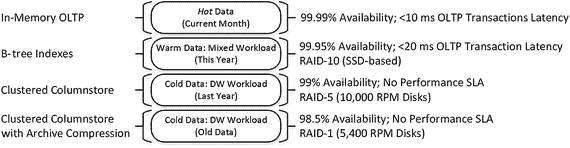
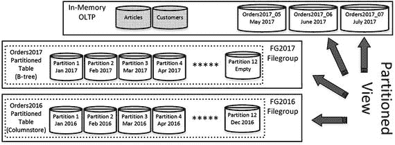
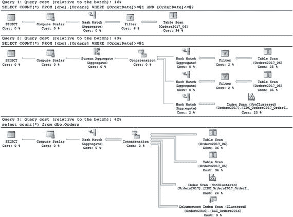
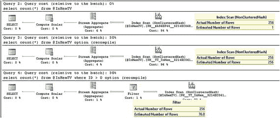
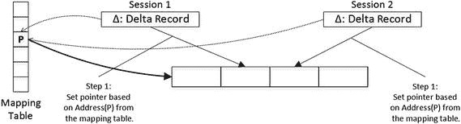
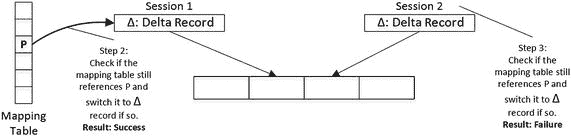
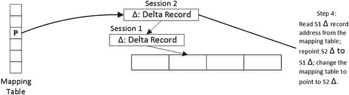
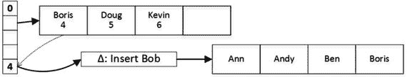
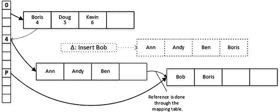
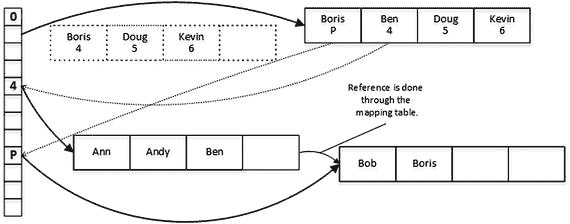

# 在混合工作负载系统中使用内存 OLTP

### 混合工作负载的挑战

`In-Memory OLTP` 可以为 `OLTP` 系统带来显著的性能提升。然而，对于数据仓库工作负载，结果可能有所不同。内存优化的列存储索引可能有助于提高某些数据仓库和操作型分析查询的性能；但是，与基于磁盘的列存储相比，内存优化列存储索引仍然存在许多限制。

当针对内存优化列存储索引运行查询时，`In-Memory OLTP` 必须扫描所有索引行组。尽管 `SQL Server` 可能会基于段元数据跳过某些行组，但你不应依赖这种行为。

相比之下，基于磁盘的列存储索引可以进行分区，并且可以从扫描中排除整个分区。当系统具有长期数据保留策略且查询仅处理数据的子集时，这可以显著减少需要处理的数据量。

将旧数据保留在内存优化表中也会对 `OLTP` 查询的性能产生负面影响。它会增加索引行链的扫描长度并减慢扫描速度。更重要的是，它将消耗 `SQL Server` 内存。尽管如今内存相对便宜，但 `NUMA` 服务器按插座划分内存，在某些情况下，你必须添加更多 `CPU` 才能利用内存。这可能需要你为这些 `CPU` 购买许可，代价高昂。

最后，这个问题还有另一个不那么明显的方面。系统中的不同数据可能有不同的可用性要求。例如，在关键任务系统中，当前的热数据可能有 `99.99%` 或更高的 `SLA`，而旧的冷数据的可用性要求可能显著降低。

`SQL Server` 企业版允许你利用逐段还原，按文件组将数据库联机。这可以在灾难情况下显著减少停机时间。然而，逐段还原要求 `In-Memory OLTP` 文件组在线，数据库才能部分可用。将大量旧的冷数据保留在内存中会减慢恢复过程。

### 分区解决方案

构建独立的数据仓库环境来处理系统的分析和报告通常是有益的。然而，在许多情况下，系统需要长时间保留数据，并支持针对相同数据的混合 `OLTP` 和数据仓库工作负载。将数据完全移入内存通常不是最佳选择，尤其是当你预期数据量随时间增长时。

此场景中的一种解决方案是在内存优化表和基于磁盘的表之间对数据进行分区。你可以将最近的 **热数据** 放入内存优化表，将旧的 **冷数据** 保留在基于磁盘的表中。这使你可以根据工作负载创建不同的索引并利用不同的技术，从而获得最大的性能提升并减少磁盘上的数据大小。

图 13-2 展示了一个在系统中分区数据的架构示例。显然，分区标准应取决于系统工作负载和其他要求。



图 13-2：数据分区示例

热操作数据存储在内存优化表中。这些数据面向客户，并处理系统中大部分的 `OLTP` 活动。前几个操作期间的暖数据可以存储在基于磁盘的 `B-Tree` 表中。通常，对此类数据会有一定程度的 `OLTP` 和数据仓库工作负载。

冷历史数据主要处理数据仓库工作负载。它可以存储在包含聚集列存储索引的表中，可能使用 `COLUMNSTORE_ARCHIVE` 压缩。如果需要支持 `OLTP` 用例，也可以在此类表上创建非聚集 `B-Tree` 索引。最后，如果数据是静态的，将其放在只读文件组中并从常规的 `FULL` 数据库备份中排除是有益的。

让我们看一个此类实现的例子，假设你有一个虚构的订单录入系统，其中大部分 `OLTP` 事务发生在当月的数据上。图 13-3 显示了截至 2017 年 6 月系统中存在的可能的数据分区。



图 13-3：订单录入系统 - 数据分区

当前（2017 年 6 月）、前一个（2017 年 5 月）和下一个（2017 年 7 月）操作期间的热数据存储在内存优化表中。2017 年 1 月至 4 月的暖数据存储在 `FG2017` 文件组上的 `B-Tree` 表中。最后，2016 年的冷数据存储在 `FG2016` 文件组上包含聚集列存储索引的表中。目录实体，如 `Articles` 和 `Customers`，被实现为内存优化表，这将允许你在处理热订单时利用原生编译。

根据操作期间对基于磁盘的表进行分区也是有益的。这将有助于在期间变化时管理表之间的数据移动。你稍后会看到这一点。

清单 13-15 说明了此实现。为了节省本书篇幅，我省略了 `dbo.Orders2017_07` 表。但是，你应该始终为下一个（未来）操作期间准备好表，以避免系统停机。

```sql
create table dbo.Customers
(
CustomerId int not null
constraint PK_Customers
primary key nonclustered hash
with (bucket_count=65536),
Name nvarchar(256) not null,
index IDX_Customers_Name nonclustered(Name)
)
with (memory_optimized=on, durability=schema_and_data);
-- Storing data for 2017_06
create table dbo.Orders2017_06
(
OrderId bigint identity(1,1) not null,
OrderDate datetime2(0) not null,
CustomerId int not null,
Amount money not null,
Status tinyint not null,
/* Other columns */
constraint PK_Orders2017_06
primary key nonclustered (OrderId),
index IDX_Orders2017_06_CustomerId
nonclustered hash(CustomerId)
with (bucket_count=65536),
constraint CHK_Orders2017_06
check (OrderDate >= '2017-06-01' and OrderDate < '2017-07-01')
)
on ps2017(OrderDate);
-- Storing data for 2017_05
create table dbo.Orders2017_05
(
OrderId bigint identity(1,1) not null,
OrderDate datetime2(0) not null,
CustomerId int not null,
Amount money not null,
Status tinyint not null,
/* Other columns */
constraint PK_Orders2017_05
primary key nonclustered (OrderId),
index IDX_Orders2017_05_CustomerId
nonclustered hash(CustomerId)
with (bucket_count=65536),
constraint CHK_Orders2017_05
check (OrderDate >= '2017-05-01' and OrderDate < '2017-06-01')
)
on ps2017(OrderDate);
-- Storing data for 2017_01 - 2017_04
create table dbo.Orders2017
(
OrderId bigint not null,
OrderDate datetime2(0) not null,
CustomerId int not null,
Amount money not null,
Status tinyint not null,
/* Other columns */
constraint PK_Orders2017
primary key nonclustered (OrderDate, OrderId),
index IDX_Orders2017_CustomerId
nonclustered (CustomerId) include (Amount),
constraint CHK_Orders2017_01
check (OrderDate >= '2017-01-01' and OrderDate < '2017-02-01'),
constraint CHK_Orders2017_02
check (OrderDate >= '2017-02-01' and OrderDate < '2017-03-01'),
constraint CHK_Orders2017_03
check (OrderDate >= '2017-03-01' and OrderDate < '2017-04-01'),
constraint CHK_Orders2017_04
check (OrderDate >= '2017-04-01' and OrderDate < '2017-05-01'),
constraint CHK_Orders2017_05
check (OrderDate >= '2017-05-01' and OrderDate < '2017-06-01')
)
on ps2017(OrderDate);
-- Storing data for 2016
create table dbo.Orders2016
(
OrderId bigint not null,
OrderDate datetime2(0) not null,
CustomerId int not null,
Amount money not null,
Status tinyint not null,
/* Other columns */
constraint CHK_Orders2016
check (OrderDate >= '2016-01-01' and OrderDate < '2017-01-01'),
)
on ps2016(OrderDate);
create clustered columnstore index CCI_Orders2016
on dbo.Orders2016
with (data_compression=columnstore_archive)
on ps2016(OrderDate);
create nonclustered index IDX_Orders2016_CustomerId
on  dbo.Orders2016(CustomerId)
include(Amount)
with (data_compression=row)
on ps2016(OrderDate);
go
create view dbo.Orders(OrderDate, OrderId, CustomerId, Amount, Status)
as
select OrderDate, OrderId, CustomerId, Amount, Status
from dbo.Orders2017_06
union all
select OrderDate, OrderId, CustomerId, Amount, Status
from dbo.Orders2017_05
union all
select OrderDate, OrderId, CustomerId, Amount, Status
from dbo.Orders2017
union all
select OrderDate, OrderId, CustomerId, Amount, Status
from dbo.Orders2016;
```

清单 13-15：数据分区：对象创建

### 查询分区视图

你可以通过实现一个组合所有表中数据的分区视图，向只读报告查询隐藏实现细节。每个表都应具有指示表中存储了什么数据的 `CHECK` 约束。这将允许 `SQL Server` 在查询中引用视图时跳过处理不必要的表。现在不要关注 `dbo.Orders2017` 表中的多个 `CHECK` 约束；我稍后会解释需要它们的原因。

清单 13-16 说明了针对分区视图的几个查询。

```sql
select count(*)
from dbo.Orders
where OrderDate between '2017-06-02' and '2017-06-03';
select count(*)
from dbo.Orders
where OrderDate >= '2017-01-01';
select count(*) from dbo.Orders;
```

清单 13-16：数据分区：查询分区视图

图 13-4 显示了查询的执行计划。如你所见，`SQL Server` 能够在查询执行期间消除对不必要表的扫描。



图 13-4：查询的执行计划

### 处理标识列

你可能已经注意到，内存优化表将 `OrderId` 列定义为 `identity(1,1)`。`In-Memory OLTP` 要求在定义标识列时使用 `SEED` 值 1。幸运的是，你可以通过在表创建后立即对虚拟行执行 `identity_insert` 来重新设定种子并强制实施键的唯一性。

清单 13-17 展示了这种方法。它假设系统每月处理少于 `100,000,000` 个新订单。

```sql
set identity_insert dbo.Orders2017_06 on
insert into dbo.Orders2017_06(OrderDate, OrderId, CustomerId, Amount, Status)
values('2017-06-01',201706000000000,1,1,1);
delete from dbo.Orders2017_06;
set identity_insert dbo.Orders2017_06 off;
```

清单 13-17：数据分区：更改标识 SEED 属性

### 数据迁移

与任何多表数据分区实现一样，你应该支持表之间的数据迁移。随着时间的推移，订单需要从内存优化表移动到基于磁盘的表。

可以使用 `INSERT..SELECT` 方法；但是，该语句将移动事务开始时拍摄的数据快照。随后，你将需要移动在语句执行期间和之后发生的数据更改。你可以通过在内存优化表上定义触发器来捕获这些更改。

让我们看一个数据移动的例子，假设你希望将上个月（2017 年 5 月）的数据移动到基于磁盘的表中。清单 13-18 显示了该过程的第一步，该步骤将数据插入单独的基于磁盘的暂存表中，以避免系统中的数据重复。这还会创建两个表来保存已更新和已删除行的 `OrderId` 值，并使用触发器填充它们（我假设没有向上月表中插入数据）。

```sql
create table dbo.Orders2017_05_Tmp
(
OrderId bigint not null,
OrderDate datetime2(0) not null,
CustomerId int not null,
Amount money not null,
Status tinyint not null,
check (OrderDate >= '2017-05-01' and OrderDate < '2017-06-01')
)
on [FG2017];
create unique clustered index IDX_Orders2017_05_Tmp_OrderDate_OrderId
on dbo.Orders2017_05_Tmp(OrderDate, OrderId)
with (data_compression=row)
on [FG2017];
create nonclustered index IDX_Orders2017_05_Tmp_CustomerId
on  dbo.Orders2017_05_Tmp(CustomerId)
with (data_compression=row)
on [FG2017];
create nonclustered index IDX_Orders2017_05_Tmp_OrderId
on  dbo.Orders2017_05_Tmp(OrderId)
with (data_compression=row)
on [FG2017]
go
create table dbo.OrdersUpdateQueue
(
ID int not null identity(1,1)
constraint PK_OrdersUpdateQueue
primary key nonclustered hash
with (bucket_count=262144),
OrderId bigint not null,
)
with (memory_optimized=on, durability=schema_and_data)
go
create table dbo.OrdersDeleteQueue
(
ID int not null identity(1,1)
constraint PK_OrdersDeleteQueue
primary key nonclustered hash
with (bucket_count=262144),
OrderId bigint not null
)
with (memory_optimized=on, durability=schema_and_data)
go
create trigger trgAfterUpdate on dbo.Orders2017_05
with native_compilation, schemabinding
after update
as
begin atomic with
(
transaction isolation level = snapshot
,language = N'English'
)
insert into dbo.OrdersUpdateQueue(OrderId)
select OrderId from inserted;
end
go
create trigger trgAfterDelete on dbo.Orders2017_05
with native_compilation, schemabinding
after delete
as
begin atomic with
(
transaction isolation level = snapshot
,language = N'English'
)
insert into dbo.OrdersDeleteQueue(OrderId)
select OrderId from deleted;
end
go
-- Step 1: Copy data to the staging table
insert into dbo.Orders2017_05_Tmp(OrderDate, OrderId, CustomerId, Amount, Status)
select OrderDate, OrderId, CustomerId, Amount, Status
from dbo.Orders2017_05 with (snapshot);
```

清单 13-18：数据移动：步骤 1

在 `INSERT..SELECT` 执行期间更新和删除的行的 `OrderId` 存储在 `dbo.OrdersUpdateQueue` 和 `dbo.OrdersDeleteQueue` 表中。你可以使用清单 13-19 中的代码将这些数据修改应用到暂存表。根据系统中数据的易变性，你可能需要运行它几次，直到表几乎为空。

```sql
declare
@MaxUpdateId int
,@MaxDeleteId int
select @MaxUpdateId = max(ID)
from dbo.OrdersUpdateQueue with (snapshot);
select @MaxDeleteId = max(ID)
from dbo.OrdersDeleteQueue with (snapshot);
begin tran
if @MaxUpdateId is not null
begin
update t
set t.Amount = s.Amount, t.Status = s.Status
from
dbo.OrdersUpdateQueue q with (snapshot) join
dbo.Orders2017_05 s with (snapshot) on
q.OrderId = s.OrderId
join dbo.Orders2017_05_Tmp t on
t.OrderId = s.OrderId
where
q.ID <= @MaxUpdateId;
delete from dbo.OrdersUpdateQueue with (snapshot)
where ID <= @MaxUpdateId;
end;
if @MaxDeleteId is not null
begin
delete from t
from
dbo.OrdersDeleteQueue q with (snapshot) join
dbo.Orders2017_05_Tmp t on
t.OrderId = q.OrderId
where
q.ID <= @MaxDeleteId;
delete from dbo.OrdersDeleteQueue with (snapshot)
where ID <= @MaxDeleteId;
end
commit;
```

清单 13-19：数据移动：步骤 2

最后，你需要删除 `dbo.Orders2017_05` 表，将暂存表作为分区切换到 `dbo.Orders2017` 表，并更改分区视图。在这些操作期间，你应该阻止客户端访问 2017 年 5 月的数据。幸运的是，停机时间将非常短；更新和删除队列表几乎为空，其他操作将在元数据级别完成，如清单 13-20 所示。

> 注意
>
> 如果你通过 `T-SQL`（互操作）存储过程访问 `dbo.Orders2017_05` 表中的数据，你可以在事务开始时更改它们并获取其架构修改 (`Sch-M`) 锁。这将阻止客户端调用存储过程，直到事务提交。

```sql
-- Disconnect clients before running those steps.
-- Alternatively, if the Data Access Tier uses Interop
-- stored procedures, you can start the transaction and
-- alter SPs before the updates. This will block clients
-- from calling those SPs.
update t
set t.Amount = s.Amount, t.Status = s.Status
from
dbo.OrdersUpdateQueue q with (snapshot)
join dbo.Orders2017_05 s with (snapshot) on
q.OrderId = s.OrderId
join dbo.Orders2017_05_Tmp t on
t.OrderId = s.OrderId;
delete from t
from
dbo.OrdersDeleteQueue q with (snapshot) join
dbo.Orders2017_05_Tmp t on
t.OrderId = q.OrderId;
alter table dbo.Orders2017
drop constraint CHK_Order2017_01_05
go
alter table dbo.Orders2017_05_Tmp
switch to dbo.Orders2017 partition 5
go
alter view dbo.Orders(OrderDate, OrderId, CustomerId, Amount, Status)
as
select OrderDate, OrderId, CustomerId, Amount, Status
from dbo.Orders2017_06
union all
select OrderDate, OrderId, CustomerId, Amount, Status
from dbo.Orders2017
union all
select OrderDate, OrderId, CustomerId, Amount, Status
from dbo.Orders2016
go
drop table dbo.Orders2017_05;
```

清单 13-20：数据移动：最后一步

## 优化 CHECK 约束

在此过程中你需要做的一件事是更改 `dbo.Orders2017` 表上的 `CHECK` 约束，以指示该表现在存储了 2017 年 5 月的数据。不幸的是，`SQL Server` 总是扫描表中的一个索引来验证新的 `CHECK` 约束，持有架构修改 (`SCH-M`) 锁并在扫描期间阻止对表的访问。

解决此类问题的一种方法是在 `CREATE TABLE` 语句中创建多个 `CHECK` 约束——每月一个约束。每次将另一个月的数据移入表时，你都是删除一个约束（这是一个元数据操作），而不是创建一个新的。`SQL Server` 在优化期间评估所有约束并选择限制性最强的约束。这就是为什么你在清单 13-15 的 `dbo.Orders2017` 表中创建了九个 `CHECK` 约束的原因。

> 注意
>
> 你可以在本书的配套材料中查看更全面和详细的代码版本。

### 结论

虽然实现数据分区需要额外的努力，但从长远来看是值得的。它允许你为每个工作负载利用最佳技术，简化数据库管理和维护，提高系统可用性，并有助于降低硬件和存储成本。当你预期要在系统中存储大量数据时，请考虑实现它。

> 注意
>
> 我的《Pro SQL Server Internals》一书包含关于数据分区的详细章节。它展示了如何实现分层存储并在不同的表和文件组之间移动数据，同时对用户保持透明。


## 跳出内存局限思考

即使没有充分利用该技术并将数据迁移到内存中，你仍然可以从内存 OLTP 中获益。让我们看几个示例。

### 从客户端应用程序批量导入行

在我的《Pro SQL Server Internals》一书的第 13 章中，我比较了将客户端应用程序中的一批行插入数据库的几种方法的性能。我考察了调用单独的`INSERT`语句、将数据编码为 XML 和 JSON 并传递给存储过程、使用.NET 的`SqlBulkCopy`类以及将数据传递给利用表值参数的存储过程的性能。表值参数成为测试中明显的赢家，提供了与`SqlBulkCopy`实现相当的性能，外加在导入过程中使用存储过程的灵活性。

清单 13-21 展示了我在测试中使用的数据库模式和存储过程。

```sql
create table dbo.Data
(
ID int not null,
Col1 varchar(20) not null,
Col2 varchar(20) not null,
/* Seventeen more columns Col3 - Col19*/
Col20 varchar(20) not null,
constraint PK_DataRecords
primary key clustered(ID)
)
go
create type dbo.tvpData as table
(
ID int not null,
Col1 varchar(20) not null,
Col2 varchar(20) not null,
/* Seventeen more columns: Col3 - Col19 */
Col20 varchar(20) not null,
primary key(ID)
)
go
create proc dbo.InsertDataTVP
(
@Data dbo.tvpData readonly
)
as
insert into dbo.Data
(
ID,Col1,Col2,Col3,Col4,Col5,Col6,Col7
,Col8,Col9,Col10,Col11,Col12,Col13,Col14
,Col15,Col16,Col17,Col18,Col19,Col20
)
select ID,Col1,Col2,Col3,Col4,Col5,Col6
,Col7,Col8,Col9,Col10,Col11,Col12
,Col13,Col14,Col15,Col16,Col17,Col18
,Col19,Col20
from @Data;
```
清单 13-21.
批量导入行：表、TVP 和存储过程

清单 13-22 展示了在使用表值参数的情况下执行导入的 ADO.NET 代码。

```csharp
using (SqlConnection conn = GetConnection())
{
/* Creating and populating DataTable object with dummy data */
DataTable table = new DataTable();
table.Columns.Add("ID", typeof(Int32));
for (int i = 1; i <= 20; i++)
table.Columns.Add("Col" + i.ToString(), typeof(string));
for (int i = 0; i < packetSize; i++)
table.Rows.Add(i, "Parameter: 1"
,"Parameter: 2"
/* Other columns */
,"Parameter: 20");
/* Calling SP with TVP parameter */
SqlCommand insertCmd =
new SqlCommand("dbo.InsertDataTVP", conn);
insertCmd.Parameters.Add("@Data", SqlDbType.Structured);
insertCmd.Parameters[0].TypeName = "dbo.tvpData";
insertCmd.Parameters[0].Value = table;
insertCmd.ExecuteNonQuery();
}
```
清单 13-22.
批量导入行：客户端代码

通过将`dbo.tvpData`表类型设置为内存优化的，你可以进一步提升性能，这对存储过程和客户端代码是透明的。清单 13-23 展示了新的类型定义。

```sql
create type dbo.tvpData as table
(
ID int not null,
Col1 varchar(20) not null,
Col2 varchar(20) not null,
/* Seventeen more columns: Col3 - Col19 */
Col20 varchar(20) not null,
primary key nonclustered hash(ID)
with (bucket_count=65536)
)
with (memory_optimized=on);
```
清单 13-23.
批量导入行：定义内存优化的表类型

性能提升的程度取决于表模式，并且随着批量大小的增加而增长。在我的测试环境中，对于小批量的 5,000 行，我获得了大约 5%到 10%的提升；对于 50,000 行的批量，提升了 20%到 25%；对于 500,000 行的批量，提升了 45%到 50%。

此外，内存优化表不使用`tempdb`，这可以减少非常繁忙的系统上`tempdb`页面分配争用（`PAGELATCH`等待），并可能进一步提升性能。然而，它们不能溢出到`tempdb`，这在处理非常大的批量以及服务器内存不足的情况下可能是危险的。你还应该根据典型的批量大小为索引定义`bucket_count`值，如本书第 4 章所述。

**注意**

你可以从本书的配套资料中下载测试应用程序，并比较各种导入方法的性能。


### 使用内存优化对象作为临时表和暂存表的替代方案

内存优化表和表变量可以用作基于磁盘的临时表和暂存表的替代品。然而，性能提升的程度可能各不相同，这在很大程度上取决于表结构、工作负载模式以及表中的数据量。

让我们看几个例子，首先在一个你经常在 OLTP 系统中遇到的简单场景中，比较内存优化表变量与基于磁盘的临时对象的性能。代码清单 13-24 展示了向对象插入最多 256 行数据，然后扫描该对象的存储过程。

```sql
create table dbo.TestRows
(
Id int not null
primary key nonclustered hash
with (bucket_count=512),
)
with (memory_optimized=on, durability=schema_only)
go
;with N1(C) as (select 0 union all select 0) -- 2 rows
,N2(C) as (select 0 from N1 as t1 cross join N1 as t2) -- 4 rows
,N3(C) as (select 0 from N2 as t1 cross join N2 as t2) -- 16 rows
,N4(C) as (select 0 from N3 as t1 cross join N3 as t2) -- 256 rows
,Ids(Id) as (select row_number() over (order by (select null)) from N4)
insert into dbo.TestRows(Id)
select Id from Ids;
go
create type dbo.InMemTV as table
(
Id int not null
primary key nonclustered hash
with (bucket_count=512),
Placeholder char(255)
)
with (memory_optimized=on)
go
create proc dbo.TestInMemTempTables(@Rows int)
as
declare
@ttTemp dbo.InMemTV
,@Cnt int
insert into @ttTemp(Id)
select Id
from dbo.TestRows with (snapshot)
where Id <= @Rows;
select @Cnt = count(*) from @ttTemp;
go
create proc dbo.TestTempTables(@Rows int)
as
declare
@Cnt int
create table #TTTemp
(
Id int not null primary key,
Placeholder char(255)
)
insert into #TTTemp    (Id)
select Id
from dbo.TestRows with (snapshot)
where Id <= @Rows;
select @Cnt = count(*) from #TTTemp;
go
create proc dbo.TestTempVars(@Rows int)
as
declare
@Cnt int
declare
@ttTemp table
(
Id int not null primary key,
Placeholder char(255)
)
insert into @ttTemp(Id)
select Id
from dbo.TestRows with (snapshot)
where Id <= @Rows;
select @Cnt = count(*) from @ttTemp;
```

代码清单 13-24.
比较内存优化表变量与基于磁盘的临时对象的性能

表 13-4 展示了这些存储过程在循环中执行 10,000 次的运行时间。我在两种环境下进行了测试，分别使用 Intel i7-4770HQ 和 AMD Opteron 6328 CPU。如你所见，即使在使用了非常快速的 PCI-e SSD 驱动器的系统中，内存优化表变量的性能也优于基于磁盘的对象。当基于磁盘的表需要分配更多数据页来存储数据时，性能提升的程度会随着数据量的增加而增大。这也是一个很好的例子，说明 In-Memory OLTP 通常是受 CPU 限制的，并且受益于 Intel CPU 提供的更快的单线程性能。

#### 内存优化表变量的性能提升

表 13-4.
存储过程的执行时间（10,000 次执行）

|   | 16 行 | 64 行 | 256 行 |
| --- | --- | --- | --- |
| 内存优化表变量 (i7-4770HQ) | 843 毫秒 | 1,016 毫秒 | 1,850 毫秒 |
| 内存优化表变量 (AMD Opteron 6328) | 980 毫秒 | 1,360 毫秒 | 2,617 毫秒 |
| 表变量 | 1,450 毫秒 | 3,054 毫秒 | 8,390 毫秒 |
| 临时表 | 6,267 毫秒 | 8,020 毫秒 | 12,546 毫秒 |

同样值得一提的是，在 `tempdb` 负载很重的系统中，由于可能存在分配映射争用，性能提升可能会更加显著。

#### 基数估算注意事项

你需要记住，与基于磁盘的表变量类似，内存优化表变量不保留索引统计信息。查询优化器在生成执行计划时，会假设它们只存储单行数据。这种基数估算错误可能导致效率极低的计划，尤其是在涉及大量数据和连接时。

与基于磁盘的表变量类似，使用 `OPTION (RECOMPILE)` 进行语句级重新编译，允许查询优化器获取内存优化表变量中的行数。然而，由于缺少统计信息直方图，它无法提供有关数据分布的信息。即使涉及语句级重新编译，这种行为也可能导致低效的执行计划。

让我们通过代码清单 13-25 中的代码，看一下使用和不使用语句级重新编译时基数估算的例子。

```sql
declare
@InMemTV dbo.InMemTV;
insert into @InMemTV(Id)
select Id from dbo.TestRows with (snapshot);
select count(*) from @InMemTV;
select count(*) from @InMemTV option (recompile);
select count(*) from @InMemTV where ID > 0 option (recompile);
```

代码清单 13-25.
内存优化表变量和语句级重新编译

你可以在图 13-5 中看到索引扫描和筛选器操作的基数估算。如果没有语句级重新编译，SQL Server 会假设内存优化表变量只有一行。语句级重新编译允许 SQL Server 获取表中行数的信息。但是，表中没有关于数据分布的信息，添加 `where` 子句导致了基数估算错误。这种行为与基于磁盘的表变量的行为一致。



图 13-5.
内存优化表变量和基数估算

#### 使用内存优化表作为 ETL 暂存区

内存优化表可用作 ETL 过程的暂存区。一般来说，它们在 `INSERT` 性能上优于基于磁盘的表，特别是当该过程从多个来源并行导入数据时。内存优化表的无锁和无闩锁特性将消除闩锁争用，并提供插入吞吐量的显著增加。你在本书第 2 章中已经看到了类似的例子。

In-Memory OLTP 还将减少 I/O 和事务日志开销。此外，对于非持久性内存优化表，它将消除暂存表产生的所有磁盘和事务日志活动。

不同技术之间的数据修改开销有所不同。如你所知，对于内存优化表，`UPDATE` 开销取决于表中的索引数量。而对于基于磁盘的表，则取决于更新了哪些列以及由此产生的页拆分数量。

另一方面，扫描性能在很大程度上取决于用例。在 SQL Server 2014 中，In-Memory OLTP 不支持并行度和可变堆扫描，这极大地影响了扫描性能。遍历内存指针是一项快速操作，与从缓冲池获取页面相比要快得多。然而，页面上的行访问可能比遍历长的内存指针链更快。在 SQL Server 2014 中，对于较小的数据行和每页较多的行数，在扫描期间基于磁盘的表可能优于内存优化表，特别是在查询使用并行执行计划时。

幸运的是，这两个限制在 SQL Server 2016 中已被移除，在大多数情况下，内存优化表扫描的性能将优于 B-Tree 磁盘表。尽管如此，结果可能因数据、硬件和 ETL 逻辑而异。

你还应该记住，并行度和可变堆扫描仅在查询互操作模式下受支持。你需要比较负责 ETL 逻辑的原生编译代码与互操作 T-SQL 实现的性能。这些限制可能会抵消原生编译带来的性能优势，并在涉及大型扫描和复杂 ETL 转换的情况下使互操作方法更有效率。


综上所述，通过将 ETL 流程调整为内存 OLTP，你可以获得最佳效果。考虑这样一种情况：你需要使用多个平面文件作为源将数据导入数据仓库。内存 OLTP 将允许你并行地从多个文件执行导入，而不会产生任何闩锁争用开销。此外，通过以大批次而非逐文件的方式执行数据处理和转换，你可以获得更好的结果。

> **提示**
> 当你将内存 OLTP 用于 ETL 流程时，考虑使用一个单独的**暂存数据库**。这将避免你在主数据库中创建一个包含检查点文件的内存 OLTP 文件组。

## 使用内存 OLTP 作为会话或对象状态存储

现代软件系统已变得极其复杂。它们由大量负责各种任务的组件和服务组成，例如与用户交互、数据处理、与其他系统集成、报表等。它们必须具备可扩展性和冗余性，需要能够处理负载增长，并且需要能够经受硬件故障和崩溃的考验。

解决可扩展性和冗余性问题的一个常见方法是，以允许部署和运行单个服务的多个实例的方式来设计系统。这允许你在负载增长时添加更多服务器和实例，并通过将负载分散到其他活动服务器上来帮助你经受硬件故障。这些服务通常以无状态方式实现，它们不存储或依赖任何本地数据。

然而，大多数系统都有需要在实例间共享的数据。例如，前端 Web 服务器通常需要维护 Web 会话状态。后端处理服务通常需要有一个包含某些数据的共享缓存。

#### 传统解决方案及其局限性

从历史上看，有两种方法可以解决这个问题。第一种是使用专用的存储/缓存，并将其托管在系统中的某个地方。还记得旧的 ASP.NET 模型吗？它使用 SQL Server 数据库或单独的 Web 服务器来存储会话数据。这种方法的问题在于可扩展性和冗余性有限。将会话数据存储在 Web 服务器内存中速度很快，但它不具备冗余性。另一方面，SQL Server 数据库可以受到保护，但由于页面闩锁争用和其他问题，它在负载下的扩展性不佳。

另一种方法是在多个服务器之间复制缓存的内容。每个实例使用缓存的本地副本，而另一个后台进程则将更改分发到其他服务器。市场上有几种提供这种能力的解决方案；有些是开源的，有些是商业产品。

### 将内存 OLTP 用作会话存储

如果你的系统使用 SQL Server 作为数据库后端，你可以选择在系统中利用内存 OLTP 作为会话或对象存储。由于它会给 SQL Server 增加额外负载，这不一定是最佳选择；然而，它可能是最简单的方法之一，特别是当 SQL Server 有足够的额外带宽来处理负载时。

简而言之，它类似于 ASP.NET 的 SQL Server 会话存储模型；但是，内存 OLTP 的吞吐量和性能提升解决了旧的基于磁盘解决方案的可扩展性问题。通过使用非持久性的内存优化表，你可以进一步提升性能。即使发生故障转移时数据会丢失，这在许多情况下也是可以接受的。

清单 13-26 展示了可用于在数据库中存储和操作数据的表及本机编译存储过程。客户端应用程序调用 `LoadObjectFromStore` 和 `SaveObjectToStore` 存储过程来加载和保存数据。`PurgeExpiredObjects` 存储过程从表中删除过期行，可以基于计划从 SQL Agent 或其他进程中调用它。

#### 实现注意事项

序列化的对象数据存储在 `varbinary(max)` 列中。如果你的对象不会超过 8000 字节，使用行内的 `varbinary(8000)` 数据类型可以获得稍好的性能。或者，如果需要，你可以为大型和小型对象使用单独的表。然而，请考虑开发和维护开销以及未来对象增长的可能性；消除行外内部表所带来的微小性能提升可能完全不值得付出这些努力。


```sql
create table dbo.ObjStore
(
ObjectKey uniqueidentifier not null,
ExpirationTime datetime2(2) not null,
Data varbinary(max) not null,
constraint PK_ObjStore
primary key nonclustered hash(ObjectKey)
with (bucket_count = 131072),
)
with (memory_optimized = on, durability = schema_only);
create proc dbo.SaveObjectToStore
(
@ObjectKey uniqueidentifier
,@ExpirationTime datetime2(2)
,@Data varbinary(max)
)
with native_compilation, schemabinding, exec as owner
as
begin atomic with
(
transaction isolation level = snapshot
,language = N'English'
)
-- @ObjectKeys 是随机生成的，并且在多个会话中是唯一的
update dbo.ObjStore
set Data = @Data, ExpirationTime = @ExpirationTime
where ObjectKey = @ObjectKey;
if (@@rowcount = 0)
insert into dbo.ObjStore(ObjectKey, ExpirationTime, Data)
values(@ObjectKey, @ExpirationTime, @Data)
end;
create proc dbo.LoadObjectFromStore
(
@ObjectKey uniqueidentifier not null
,@Data varbinary(max) output
)
with native_compilation, schemabinding, exec as owner
as
begin atomic
with
(
transaction isolation level = snapshot
,language = N'English'
)
select @Data = t.Data
from dbo.ObjStore t
where t.ObjectKey = @ObjectKey and
ExpirationTime >= sysutcdatetime();
end;
create proc dbo.PurgeExpiredObjects
with native_compilation, schemabinding, exec as owner
as
begin atomic
with
(
transaction isolation level = snapshot
,language = N'English'
)
declare @CurrentTime
datetime2(2) = sysutcdatetime();
delete dbo.ObjStore
where ExpirationTime < @CurrentTime
end
```
代码清单 13-26. 实现会话存储：数据库架构

客户端实现包含几个静态类。`ObjStoreUtils` 类提供了两个方法，用于将对象序列化和反序列化为字节数组。你可以在代码清单 13-27 中查看其实现。

```csharp
public static class ObjStoreUtils
{
/// 
/// 将类型为 T 的对象序列化为字节数组
/// 
public static byte[] Serialize(T obj)
{
if (obj == null)
return null;
using (var ms = new MemoryStream())
{
var formatter = new BinaryFormatter();
formatter.Serialize(ms, obj);
return ms.ToArray();
}
}
/// 
/// 将字节数组反序列化为对象
/// 
public static T Deserialize(byte[] data)
{
if (data == null || data.Length == 0)
return default(T);
using (var output = new MemoryStream(data))
{
var binForm = new BinaryFormatter();
return (T) binForm.Deserialize(output);
}
}
}
```
代码清单 13-27. 实现会话存储：`ObjStoreUtils` 类

代码清单 13-28 所示的 `ObjStoreDataAccess` 类负责从数据库加载和向数据库保存二进制数据。它利用了另一个名为 `DBConnManager` 的静态类，该类返回目标数据库的 `SqlConnection` 对象。此 `DBConnManager` 类未在代码清单中展示。

```csharp
public static class ObjStoreDataAccess
{
/// 
/// 将序列化后的对象保存到数据库
/// 
public static void SaveObjectData(Guid key,
DateTime expirationTime, byte[] obj)
{
using (var cnn = DBConnManager.GetConnection())
{
using (var cmd = cnn.CreateCommand())
{
cmd.CommandText = "dbo.SaveObjectToStore";
cmd.CommandType = CommandType.StoredProcedure;
cmd.Parameters.Add("@ObjectKey",
 SqlDbType.UniqueIdentifier).Value = key;
cmd.Parameters.Add("@ExpirationTime",
 SqlDbType.DateTime2).Value = expirationTime;
cmd.Parameters.Add("@Data",
 SqlDbType.VarBinary,-1).Value = obj;
cmd.ExecuteNonQuery();
}
}
}
/// 
/// 从数据库加载序列化后的对象
/// 
public byte[] LoadObjectData(Guid key)
{
using (var cnn = DBConnManager.GetConnection())
{
using (var cmd = cnn.CreateCommand())
{
cmd.CommandText = "dbo.LoadObjectFromStore";
cmd.CommandType = CommandType.StoredProcedure;
cmd.Parameters.Add("ObjectKey",
 SqlDbType.UniqueIdentifier).Value = key;
cmd.Parameters.Add("@Data",
 SqlDbType.VarBinary,-1).Direction =
 ParameterDirection.Output;
cmd.ExecuteNonQuery();
return (byte[])cmd.Parameters[1].Value;
}
}
}
}
```
代码清单 13-28. 实现会话存储：`ObjStoreDataAccess` 类

最后，代码清单 13-29 所示的 `ObjStoreService` 类将所有部分整合在一起，并管理整个流程。它实现了两个简单的方法，`Load` 和 `Save`，调用前面定义的辅助类。

```csharp
public static class ObjStoreService
{
/// 
/// 将对象保存到对象存储中
/// 
public static void Save(Guid key,
DateTime expirationTime, object obj)
{
var objectBytes = ObjStoreUtils.Serialize(obj);
ObjStoreDataAccess.SaveObjectData(key, expirationTime, objectBytes);
}
/// 
/// 从对象存储中加载对象
/// 
public static T Load(Guid key) where T: class
{
var obj = ObjStoreDataAccess.LoadObjectData(key);
if (obj == null)
return default(T); // 未找到对象
return ObjStoreUtils.Deserialize(objectBytes);
}
}
```
代码清单 13-29. 实现会话存储：`ObjStoreService` 类

显然，这是一个过度简化的示例，生产环境中的实现可能会复杂得多，尤其是当多个会话可能同时更新同一个对象时。如果遇到这种情况，你可以在系统中实现重试逻辑或创建某种对象锁定管理机制。

同样值得一提的是，在将二进制数据保存到数据库之前可以对其进行压缩。对于小对象，压缩会引入不必要的开销；但是，如果对象很大，压缩可以显著节省空间并提升性能。

尽管你可以使用 `GZipStream` 或 `DeflateStream` 类轻松实现压缩，但我在示例中并未包含压缩代码。

注意

相关代码和测试应用程序包含在本书的配套资料中。

## 总结

SQL Server 2016 消除了该技术首次发布时存在的大多数内存 OLTP 限制。然而，迁移到内存 OLTP 仍然会产生实现成本。你应该进行成本效益分析，确保这个成本是可接受的。

内存 OLTP 可以显著提高 OLTP 系统的性能。它不一定是数据仓库工作负载和内存中数据仓库实现的最佳选择。你可以考虑实施数据分区，并结合使用内存优化表和基于磁盘的表，以充分利用所有 SQL Server 技术的优势。

即使不执行完整的内存 OLTP 迁移，你也可以从这项技术中获益。仅举几个用例：内存优化表变量可以替代基于磁盘的临时对象；内存优化表值参数是在客户端和 T-SQL 例程之间传递批处理行的最快方式；内存优化表可以用作 ETL 过程的暂存区。

但请记住，内存 OLTP 并非一种“一劳永逸”的技术，在部署到生产环境后可能需要进行管理和监控。

## 附录 A：内存指针管理

本章解释了 SQL Server 如何处理链接内存 OLTP 对象的内存指针。


## 内存指针管理

内存 OLTP (In-Memory OLTP) 引擎依赖内存指针，并使用它们来链接对象。例如，嵌入到数据行中的指针将它们链接成数据行链，而这些链又被哈希和非聚集索引对象引用。

内存 OLTP 的无锁和无闩锁特性增加了一个挑战：如何在高度易变的环境中管理内存指针，在这些环境中，多个会话可能试图同时更改指针，覆盖彼此的更改。

考虑多个会话试图将行插入同一个数据行链的情况。每个会话遍历该链以定位最后一行，并将其指针更新为新创建行的地址。SQL Server 必须保证，即使来自不同并行线程的多个会话试图同时执行该指针更新，每一行也会被添加到链中。

SQL Server 使用 `InterlockedCompareExchangePointer` API 函数来保证多个会话不能更新同一个指针，从而不会覆盖彼此的更改，导致丢失对彼此对象的引用。`InterlockedCompareExchangePointer` 函数会更改指针的值，同时检查现有值（更新前）是否与作为另一个参数提供的预期值（旧值）匹配。仅当检查成功时，指针值才会更新。所有这些操作都作为单个 CPU 指令完成。

为了说明这一点，假设有两个会话希望同时为同一个非聚集索引叶页插入新的增量记录。第一步（如图 A-1 所示），会话创建增量记录，并根据映射表中的地址将其指针设置为指向一个页面。


**图 A-1.** 数据修改和并发性：步骤 1

在下一步中，两个会话都调用 `InterlockedCompareExchangePointer` 函数，尝试通过将引用从页面更改为会话刚刚创建的增量记录来更新映射表。`InterlockedCompareExchangePointer` 对映射表元素的更新进行序列化，仅当其当前的更新前值与作为参数提供的旧指针值（页面的地址）匹配时才更改它。第一次 `InterlockedCompareExchangePointer` 调用成功。然而，第二次调用失败，因为映射表元素引用的是来自另一个会话的增量记录，而不是原始页面。

图 A-2 展示了这种场景。


**图 A-2.** 数据修改和并发性：步骤 2 和 3

此时，第二个会话需要重复该操作。它会从映射表中读取会话 1 增量页的地址，并将其自己的增量页重新指向该增量页。最后，它将再次调用 `InterlockedCompareExchangePointer`，在调用期间使用会话 1 增量页的地址作为旧指针值。图 A-3 说明了这一点。


**图 A-3.** 数据修改和并发性：最后步骤

如你所见，除了在 `InterlockedCompareExchangePointer` 调用期间有短暂的序列化外，在修改过程中没有对数据进行锁定或加闩锁。

在每次需要维护指针链时，SQL Server 都会使用相同的 `InterlockedCompareExchangePointer` 方法，例如在更新期间创建行的另一个版本时，当需要更改索引映射或哈希表中的指针时，以及其他相当多的情况下。

### 总结

SQL Server 使用 `InterlockedCompareExchangePointer` 机制来保证多个会话不能同时更新相同的内存指针，从而避免丢失对彼此对象的引用。

`InterlockedCompareExchangePointer` 函数会更改指针的值，同时检查现有值（更新前）是否与作为另一个参数提供的预期值（旧值）匹配。仅当检查成功时，指针值才会更新。所有这些操作都作为单个 CPU 指令完成。

## 附录 B：非聚集索引中的页面拆分与页面合并

本附录概述了非聚集索引的内部操作，例如页面拆分和页面合并。

## 非聚集索引的内部维护

内存 OLTP 引擎有几个维护非聚集索引结构的内部操作。正如你从第 5 章已经了解到的，页面整合会重建非聚集索引页面，整合由页面增量记录定义的所有更改。它有助于避免由长增量记录链引入的性能影响。新创建的页面在映射表中具有相同的 PID，并替换了被标记为垃圾回收的旧页面。

另外两个过程可以创建新的索引页面：页面拆分和页面合并。两者都是复杂的操作，值得对其内部实现进行详细解释。

#### 页面拆分

当页面没有足够的可用空间来容纳新数据行时，会发生页面拆分。尽管该过程类似于基于磁盘的 B-Tree 索引页面拆分，但有一个概念上的区别。在 B-Tree 索引中，页面拆分将部分数据移动到新的数据页面，从而在原始页面上释放空间。然而，在 Bw-Tree 索引中，页面是不可修改的，SQL Server 用两个新页面替换旧页面，并将数据拆分到它们之间。

让我们更详细地看一下这种情况。图 B-1 显示了一个非聚集索引的内部页和叶页。假设其中一个会话希望插入一个键值为 `Bob` 的行。


**图 B-1.** 页面拆分：初始状态

当创建增量记录时，SQL Server 调整索引页上的增量记录统计信息，并检测到一旦增量记录被整合，页面上没有空间容纳新的索引值。这会触发页面拆分过程，该过程以两个原子步骤完成。

第一步，SQL Server 创建两个新的叶级页面，并将旧页面的值拆分到它们之间。之后，它将映射表重新指向第一个新创建的页面，并将旧页面和增量记录标记为垃圾回收。

图 B-2 说明了这个状态。在此状态下，内部页没有对第二个新创建的叶级页的引用。然而，第一个叶级页维护着页面之间的链接（通过映射表），如果需要，SQL Server 能够访问和扫描第二个页面。


**图 B-2.** 页面拆分：第一步

在第二步中，SQL Server 创建另一个内部页，其中的键值代表新的叶级页面布局。当新页面创建后，SQL Server 切换映射表中的指针，并将旧内部页标记为垃圾回收。图 B-3 说明了这一动作。


**图 B-3.** 页面拆分：第二步

最终，旧数据页面和增量记录会被垃圾回收过程释放。


