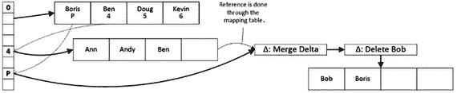
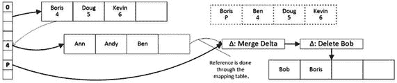
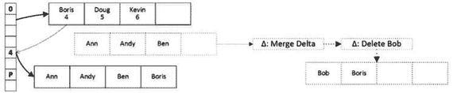

# 页面合并

页面合并发生在删除操作导致索引页大小低于最大页面大小（当前为 8KB）的 10%，或者索引页仅包含单行数据时。在此操作期间，SQL Server 会合并两个相邻索引页的数据，用新的合并数据页替换它们。

假设您有如图 B-3 所示的页面布局，并且您想要删除索引键值`Bob`，这意味着所有名称为`Bob`的数据行都已被删除。这会留下一个仅包含`Boris`值的索引页，从而触发页面合并。

第一步，SQL Server 为`Bob`创建一个删除增量记录，以及另一种称为合并增量的特殊增量记录。图 B-4 展示了第一步之后的布局。

图 B-4. 页面合并：第一步

在页面合并的第二步中，SQL Server 创建一个新的内部页面，该页面不引用即将被合并的叶级页面。之后，SQL Server 将映射表切换为指向新创建的内部页面，并将旧页面标记为待垃圾回收。图 B-5 说明了此操作。

图 B-5. 页面合并：第二步

最后，SQL Server 构建一个新的叶级页面，将`Boris`值复制到该页面。新页面创建后，它会更新映射表，并将旧页面和增量记录标记为待垃圾回收。

图 B-6 展示了页面合并完成后的最终数据布局。

图 B-6. 页面合并：第三步（最终步骤）

您可以从`sys.dm_db_xtp_nonclustered_index_stats`视图获取页面整合、合并和拆分的统计信息。

**注意**
您可以在[`https://docs.microsoft.com/en-us/sql/relational-databases/system-dynamic-management-views/sys-dm-db-xtp-nonclustered-index-stats-transact-sql`](https://docs.microsoft.com/en-us/sql/relational-databases/system-dynamic-management-views/sys-dm-db-xtp-nonclustered-index-stats-transact-sql)阅读关于`sys.dm_db_xtp_nonclustered_index_stats`视图的文档。

## 总结

内存中 OLTP 引擎使用几种内部操作来维护非聚集索引的结构。页面整合重建索引页，将页面数据与增量记录合并。它有助于避免由长增量记录链引入的性能影响。

页面拆分发生在索引页没有足够空间容纳新行时。与基于磁盘的 B 树索引中的页面拆分（它将部分数据移动到新页）不同，Bw-Tree 页面拆分用包含数据的新页面替换旧数据页面。

页面合并发生在索引页大小低于最大页面大小的 10%或仅包含单行数据时。SQL Server 合并相邻数据页的数据，并用包含合并数据的新页面替换它们。

