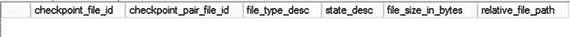
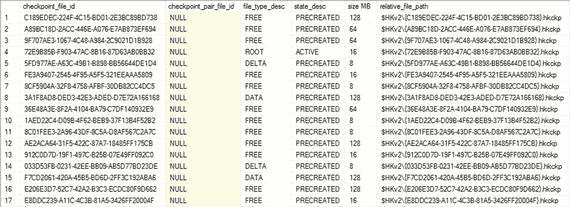
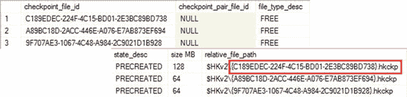
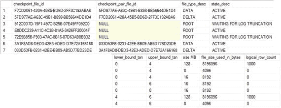
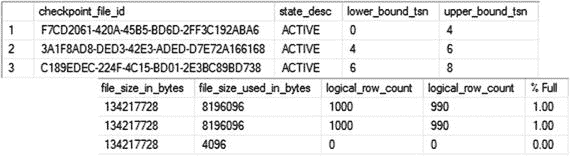
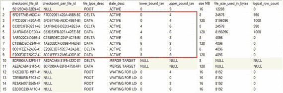
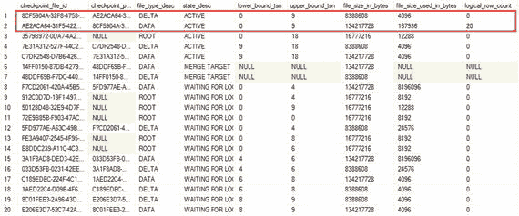
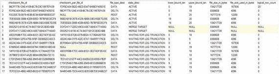

# 附录 C：分析检查点文件的状态

SQL Server 将持久化内存优化表的数据持久化在检查点文件中。本附录演示了如何使用`sys.dm_db_xtp_checkpoint_files`视图分析检查点文件的状态，并展示了文件在其生命周期内的状态转换过程。

## sys.dm_db_xtp_checkpoint_files 视图

`sys.dm_db_xtp_checkpoint_files`视图提供了关于数据库检查点文件的信息，包括其状态、大小和物理位置。您将在本附录中广泛使用此视图。让我们看看最重要的列：

*   `container_id`和`container_guid`列提供了关于检查点文件所属的`FILESTREAM`容器的信息。`container_id`列对应于`sys.database_files`视图中的`file_id`列。
*   `checkpoint_file_id`是一个 GUID，表示文件的 ID。
*   `checkpoint_pair_file_id`是配对中的第二个文件（数据或增量文件）的 ID。
*   `relative_file_path`显示容器中的相对文件路径。
*   `state`和`state_desc`描述文件的状态。正如您从第 10 章已经了解到的，检查点文件可以处于以下状态之一（数字表示`state`列值）：`0`代表`PRECREATED`，`1`代表`UNDER CONSTRUCTION`，`2`代表`ACTIVE`，`3`代表`MERGE TARGET`，`8`代表`WAITING FOR LOG TRUNCATION`。
*   `file_type`和`file_type_desc`描述文件类型：`-1`代表`FREE`，`0`代表`DATA`，`1`代表`DELTA`，`2`代表`ROOT`，`3`代表`LARGE_DATA`。
*   `lower_bound_tsn`和`upper_bound_tsn`指示文件所覆盖的最早和最晚事务的时间戳。这些列仅在`ACTIVE`和`MERGE TARGET`状态下才会填充。
*   `file_size_in_bytes`和`file_size_used_in_bytes`提供关于文件大小和文件中已用空间的信息。`file_size_used_in_bytes`值在检查点事件时更新。
*   `logical_row_count`提供数据文件和增量文件中的行数。

值得注意的是，在某些情况下，尤其是早期的 SQL Server 2016 版本中，该视图可能提供稍显过时的数据。例如，SQL Server 2016 RTM 版本可能会忽略数据库中一些`PRECREATED`文件的信息。

让我们使用此视图来分析检查点文件的状态转换。


## 检查点文件的生命周期

作为此测试的第一步，让我们使用 `DBCC TRACEON(9851,-1)` 命令启用未公开的跟踪标志 `T9851`。此跟踪标志会禁用自动合并过程，从而使您可以更好地控制测试环境。

重要提示：请勿在生产环境中设置 `T9851`。

让我们创建一个包含内存优化（In-Memory OLTP）文件组的数据库并执行完整备份，从而启动备份链，如代码清单 C-1 所示。我在测试环境中执行此操作，并未遵循最佳实践（例如将内存优化数据和基于磁盘的数据放在不同的驱动器上、为基于磁盘的数据创建辅助文件组等）。显然，在设计真实数据库时，您应记得遵循最佳实践。

```sql
create database [InMemoryOLTP2016_AppendixC]
on primary
(
name = N'AppendixC',
filename = N'C:\Data\AppendixC.mdf'
),
filegroup HKData CONTAINS MEMORY_OPTIMIZED_DATA
(
name = N'AppendixC_HKData',
filename = N'C:\Data\HKData\AppendixC'
)
log on
(
name = N'AppendixC_Log',
filename = N'C:\Data\AppendixC_log.ldf'
)
go
create table InMemoryOLTP2016_AppendixC.dbo.T(ID int);
go
backup database [InMemoryOLTP2016_AppendixC]
to disk = N'C:\Data\Backups\AppendixC.bak'
with noformat, init, name = 'AppendixC - Full', compression;
```
代码清单 C-1. 创建数据库并执行备份

数据库当前为空，因此未创建任何检查点文件。您可以通过查询 `sys.dm_db_xtp_checkpoint_files` 视图来确认这一点，如代码清单 C-2 所示。

```sql
use [InMemoryOLTP2016_AppendixC]
go
select
checkpoint_file_id
,checkpoint_pair_file_id
,file_type_desc
,state_desc
,file_size_in_bytes / 1024 / 1024 as [size MB]
,relative_file_path
from
sys.dm_db_xtp_checkpoint_files;
```
代码清单 C-2. 检查检查点文件

图 C-1 显示结果集为空，并且 `sys.dm_db_xtp_checkpoint_files` 视图未返回任何数据。



图 C-1. 数据库创建后的检查点文件状态

接下来，让我们创建一个持久化的内存优化表，如代码清单 C-3 所示。

```sql
create table dbo.HKData
(
ID int not null,
Placeholder char(8000) not null,
constraint PK_HKData
primary key nonclustered hash(ID)
with (bucket_count=8192),
)
with (memory_optimized=on, durability=schema_and_data);
```
代码清单 C-3. 创建持久化内存优化表

如果您现在检查检查点文件的状态并再次运行代码清单 C-2 中的代码，您将看到如图 C-2 所示的输出。文件大小在您的环境中可能不同，并取决于硬件。我的测试机有 16 个 CPU 和 256GB RAM，因此 SQL Server 为数据预分配了 128MB，为大数据预分配了 64MB，为增量文件预分配了 8MB，为根文件预分配了 16MB。根文件以 `ACTIVE` 状态创建；所有其他文件类型为空且处于 `PRECREATED` 状态。



图 C-2. 创建持久化内存优化表后的检查点文件状态

让我们放大显示其中一些文件，如图 C-3 所示。



图 C-3. 检查点文件（放大视图）

`relative_file_path` 列提供相对于内存优化文件组中 `FILESTREAM` 容器的文件路径。图 C-4 显示了磁盘上文件夹中的检查点文件。


### 图 C-4. 磁盘上的检查点文件

现在，让我们用 1,000 行数据填充 `dbo.HKData` 表，并检查检查点文件的状态，如代码清单 [C-4] 所示。查询从输出中过滤掉了处于 `PRECREATED` 状态的检查点文件。该代码清单还将数据插入基于磁盘的表中，以生成日志记录，并强制检查点控制器线程扫描日志并启动内存中 OLTP 检查点过程。

```sql
;with N1(C) as (select 0 union all select 0) -- 2 行
,N2(C) as (select 0 from N1 as t1 cross join N1 as t2) -- 4 行
,N3(C) as (select 0 from N2 as t1 cross join N2 as t2) -- 16 行
,N4(C) as (select 0 from N3 as t1 cross join N3 as t2) -- 256 行
,N5(C) as (select 0 from N4 as t1 cross join N4 as t2) -- 65,536 行
,Ids(Id) as (select row_number() over (order by (select null)) from N5)
insert into dbo.HKData(Id, Placeholder)
select Id, Replicate('0',8000)
from ids
where Id between 1 and 1000;
select
checkpoint_file_id
,checkpoint_pair_file_id
,file_type_desc
,state_desc
,lower_bound_tsn
,upper_bound_tsn
,file_size_in_bytes / 1024 / 1024 as [size MB]
,file_size_used_in_bytes / 1024 / 1024 as [size used MB]
,logical_row_count
from
sys.dm_db_xtp_checkpoint_files
where
state_desc <> 'PRECREATED'
order by
file_type, lower_bound_tsn;
```

**代码清单 C-4.** 填充 `dbo.HKData` 表并检查检查点文件的状态

如图 [C-5] 所示，SQL Server 将两个 `PRECREATED` 文件转换为 `UNDER CONSTRUCTION` 状态，并在那里将 1,000 行数据插入到数据文件中。`lower_bound_tsn` 和 `upper_bound_tsn` 列表示文件所涵盖的事务范围。您还可以看到 `checkpoint_file_pair_id` 列指示了配对中相应的数据或增量文件。

### 图 C-5. UNDER CONSTRUCTION 文件

让我们运行一个手动的 `CHECKPOINT` 命令，并检查检查点文件的状态，如代码清单 [C-5] 所示。

```sql
checkpoint
go
select
checkpoint_file_id
,checkpoint_pair_file_id
,file_type_desc
,state_desc
,lower_bound_tsn
,upper_bound_tsn
,file_size_in_bytes / 1024 / 1024 as [size MB]
,file_size_used_in_bytes / 1024 / 1024 as [size used MB]
,logical_row_count
from
sys.dm_db_xtp_checkpoint_files
where
state_desc <> 'PRECREATED'
order by
file_type, lower_bound_tsn;
```

**代码清单 C-5.** 强制执行 `CHECKPOINT` 并检查检查点文件的状态

如图 [C-6] 所示，`CHECKPOINT` 操作将 `UNDER CONSTRUCTION` 文件转换为了 `ACTIVE` 状态。它还创建了新的根文件，并将旧文件切换到 `WAITING FOR LOG TRUNCATION` 状态。

### 图 C-6. CHECKPOINT 后的文件状态

让我们再向 `dbo.HKData` 表插入另外 1,000 行数据，并检查文件的状态。代码清单 [C-6] 展示了执行此操作的代码。

```sql
;with N1(C) as (select 0 union all select 0) -- 2 行
,N2(C) as (select 0 from N1 as t1 cross join N1 as t2) -- 4 行
,N3(C) as (select 0 from N2 as t1 cross join N2 as t2) -- 16 行
,N4(C) as (select 0 from N3 as t1 cross join N3 as t2) -- 256 行
,N5(C) as (select 0 from N4 as t1 cross join N4 as t2) -- 65,536 行
,Ids(Id) as (select row_number() over (order by (select null)) from N5)
insert into dbo.HKData(Id, Placeholder)
select 1000 + Id, Replicate('0',8000)
from ids
where Id between 1 and 1000;
select
checkpoint_file_id
,checkpoint_pair_file_id
,file_type_desc
,state_desc
,lower_bound_tsn
,upper_bound_tsn
,file_size_in_bytes / 1024 / 1024 as [size MB]
,file_size_used_in_bytes / 1024 / 1024 as [size used MB]
,logical_row_count
from
sys.dm_db_xtp_checkpoint_files
where
state_desc <> 'PRECREATED'
order by
file_type, lower_bound_tsn;
```

**代码清单 C-6.** 用另一批行填充 `dbo.HKData` 表，并在此后检查文件的状态

图 [C-7] 显示了第二次插入后检查点文件的状态。如您所见，SQL Server 将另一组数据和增量文件转换到了 `UNDER CONSTRUCTION` 状态，其 `lower_bound_tsn = 4`。

### 图 C-7


图 C-7.

第二次 INSERT 操作后的文件状态

另一次 `CHECKPOINT` 会将 `正在构建` 的文件转换为 `活动` 状态，如图 C-8 所示。你可以通过再次运行清单 C-5 中的代码来强制执行此操作。此时，你拥有两个 `活动` 状态的检查点文件对，它们覆盖了不同的事务时间戳范围。



图 C-8.

第二次 CHECKPOINT 后的文件状态

接下来，让我们从表中删除 99% 的行，如清单 C-7 所示。在此清单中，你还运行了合并数据文件和增量文件信息的查询，该查询演示了两个检查点文件对基本都为空。你还需要执行 `CHECKPOINT` 来更新增量文件中的 `logical_row_count` 列，这将生成另一个处于 `活动` 状态的空检查点文件对。

```sql
delete from dbo.HKData
where ID % 100 = 0;
checkpoint
go
select
    data.checkpoint_file_id
    ,data.state_desc
    ,data.lower_bound_tsn
    ,data.upper_bound_tsn
    ,data.file_size_in_bytes
    ,data.file_size_used_in_bytes
    ,data.logical_row_count
    ,delta.logical_row_count
    ,convert(decimal(5,2),
        iif(data.logical_row_count = 0,0,
            100. - 100. * delta.logical_row_count /
            data.logical_row_count))
        as [% Full]
from
    sys.dm_db_xtp_checkpoint_files data join
    sys.dm_db_xtp_checkpoint_files delta on
        data.checkpoint_pair_file_id = delta.checkpoint_file_id
where
    data.file_type_desc = 'DATA' and
    data.state_desc <> 'PRECREATED'
order by
    data.lower_bound_tsn
```

清单 C-7.
从表中删除 99% 的行

如图 C-9 所示，数据文件几乎为空，它们是合并操作的绝佳候选对象。



图 C-9.

删除操作后的文件状态

接下来，让我们通过执行 `DBCC TRACEOFF(9851,-1)` 命令关闭跟踪标志 `T9851` 来开启自动合并进程。之后，你将发出另一个 `CHECKPOINT` 命令来触发合并进程。

图 C-10 说明了合并启动后检查点文件对的状态。如你所见，SQL Server 创建了处于 `合并目标` 状态的新检查点文件对，并合并了四个覆盖事务范围从 0 到 9 的 `活动` 文件对中的数据。



图 C-10.

合并启动后的检查点文件状态

下一次 `CHECKPOINT` 会将参与合并的检查点文件从 `活动` 转换为 `等待日志截断`，并将 `合并目标` 转换为 `活动`。图 C-11 展示了这一点。如你所见，新的 `活动`（原 `合并目标`）数据文件覆盖范围从 0 到 9，并且现在只有 20 行数据。该对中的增量文件为空。



图 C-11.

合并完成后的检查点文件状态

在执行事务日志备份后，日志记录会被传输到辅助节点，并且发生检查点事件，之后处于 `等待日志截断` 状态的文件将被删除或回收回 `空闲` 状态。清单 C-8 执行了事务日志备份以及 `CHECKPOINT`。

```sql
backup log [InMemoryOLTP2016_AppendixC]
to disk = N'C:\Data\Backups\AppendixC.bak'
with noformat, noinit, name = 'AppendixC - Log', compression
go
checkpoint;
```

清单 C-8.
执行日志备份并强制垃圾回收

注意

实际上，可能需要多次日志备份和检查点事件才能释放处于 `等待日志截断` 状态的文件。如果这种情况发生在你的系统上，你可以多次执行清单 C-8 中的代码。

图 C-12 说明了一些文件已被删除。



图 C-12.

备份/日志截断后的检查点文件

## 总结

每个检查点文件在其生命周期中都会经历各种状态。你可以使用 `sys.dm_db_xtp_checkpoint_files` 数据管理视图来分析这些状态。此视图返回有关各个检查点文件的信息，包括其类型、大小、状态、覆盖的事务间隔、行数以及许多其他属性。

合并进程会合并那些有大量已删除行的 `活动` 检查点文件中的信息，创建一个新的检查点文件对。这有助于减少磁盘上的数据大小并加速数据库恢复过程。

合并后的检查点文件在释放之前应包含在日志备份中。定期的事务日志备份将减少磁盘上的内存优化表数据量。请确保设计数据库备份策略时考虑到这种行为。

