# 附录 D：内存优化表迁移工具

本附录讨论了几个有助于内存优化表迁移的 SQL Server 2016 工具。

## “事务性能分析概览”报告

在进行内存 OLTP 迁移时，面临的挑战之一是确定哪些对象能从中获益最多。帕累托原则在此很容易适用：如果迁移目标识别正确，你可以花费 20%的时间实现 80%的可能收益。

SQL Server 2016 提供了一个“事务性能分析概览”报告，可以帮助你识别系统中的迁移目标。它会显示遭受锁和闩锁争用的表，以及在服务器上消耗最多 CPU 资源且频繁执行的存储过程。此报告与 SQL Server 2014 版本类似；但是，它不需要你设置管理数据仓库。所有工作都由 SQL Server 自动完成。

让我们看看“事务性能分析概览”报告提供的信息。在本附录中，我使用了本书第 2 章中的演示应用程序和`WebRequests*_Disk`表。为了说明工具如何提供相关信息，我还向表和存储过程添加了几个不支持的结构。

你可以从正在分析的数据库的“标准报告”弹出菜单项访问该报告，如图 D-1 所示。可以猜到，此报告是基于每个数据库运行的。

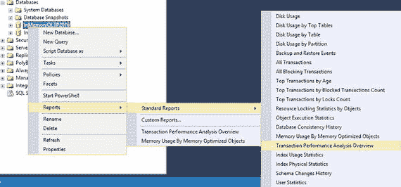

图 D-1. 访问“事务性能分析概览”报告

图 D-2 显示了该报告。

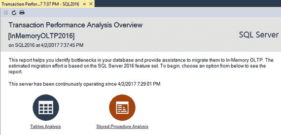

图 D-2. “事务性能分析概览”报告

从这个页面，你可以访问两个下钻报告。“表分析”根据表的访问频率以及它们遭受锁和闩锁争用的程度，提供与表相关的统计信息。

图 D-3 展示了“表分析”报告的输出。如你所见，它根据迁移所需的工作量和预计带来的性能提升，将输出显示在四个象限中。迁移右上角象限中的对象，将用最少的工作量带来最大的性能提升。

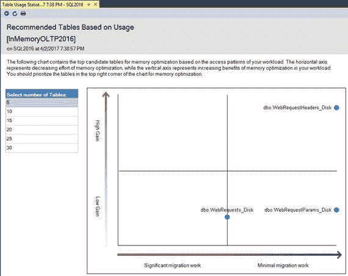

图 D-3. “表分析”报告

通过点击图表中的对象，你可以查看表级别的统计数据。图 D-4 显示了系统中`WebRequestHeaders_Disk`表的详细信息。第一个输出显示了该表与锁和闩锁相关的统计数据。正如你在第 2 章中看到的，该表遭受了大量的页闩锁。

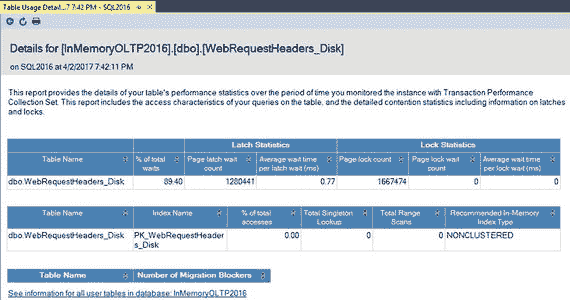

图 D-4. 表级统计信息

第二个输出说明了与访问方法相关的统计信息。演示应用程序不从表中读取数据，这影响了你在此输出中看到的数字。

最后，第三个输出说明了迁移阻碍因素的数量以及迁移前需要解决的问题。该表没有任何不兼容性，无需任何架构更改即可迁移到内存中。

类似地，“存储过程分析”报告根据存储过程消耗的 CPU 时间量来显示其使用情况。图 D-5 展示了该报告的输出。演示应用程序仅调用了一个过程，此处即显示它。

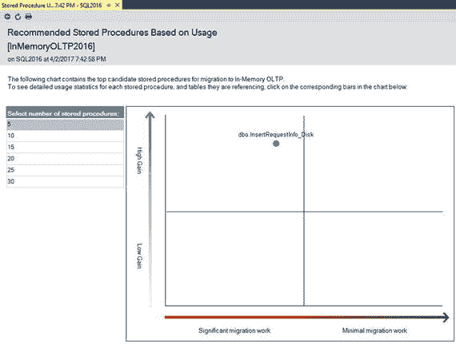

图 D-5. “过程使用情况分析”报告

你可以下钻到过程级别的统计信息，它会显示执行次数、执行时间指标以及存储过程引用的表。图 D-6 说明了此页面。

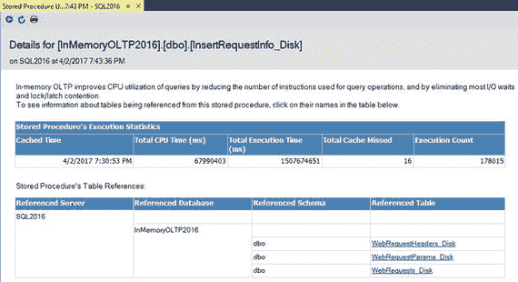

图 D-6. 过程级统计信息

“事务性能分析概览”报告是一个强大的工具，可以帮助你识别将从迁移中受益的对象。然而，你不应仅仅依赖其结果。在做出任何决策之前，需要查看并分析整个系统。

最后，值得一提的是，与任何工具一样，输出的质量很大程度上取决于输入的质量。你需要在生产服务器上或在工作负载与生产环境相似的测试环境中运行此报告，以获得准确的结果。

## 内存优化与本机编译顾问

除了“事务性能分析概述”报告之外，SQL Server 2016 还包含另外两个有助于进行内存 OLTP 迁移的工具。**内存优化顾问**和**本机编译顾问**可以分析数据库表、存储过程和用户定义函数，以识别不支持的构造。此外，内存优化顾问可以执行实际的迁移操作，创建内存 OLTP 文件组和内存优化表，并将数据从基于磁盘的表移动到其中。

你可以从 SSMS 中的对象上下文菜单访问这两个顾问。图 D-7 显示了表上下文菜单，其中高亮显示了“内存优化顾问”菜单项。

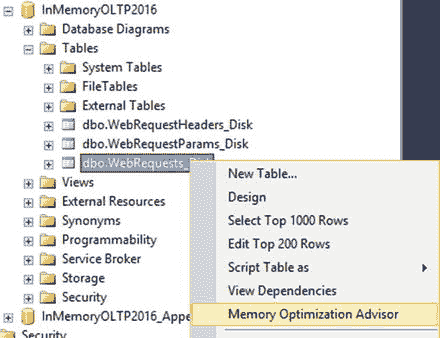

图 D-7. 内存优化顾问菜单

作为第一步，向导会分析表并显示内存 OLTP 不支持的构造。图 D-8 显示了针对 `WebRequests_Disk` 表的验证输出。如前所述，我向该表添加了 `xml` 和 `geography` 列，这些列已被顾问报告出来。

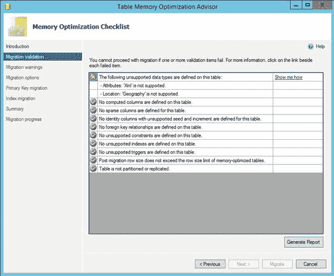

图 D-8. 内存优化顾问验证结果

如果该表未使用任何不受支持的构造，顾问将继续执行创建内存 OLTP 文件组并执行实际表迁移的选项。

然而，该向导的简洁性是一把双刃剑。它可以简化迁移过程，并且在某些情况下，只需点击几下鼠标即可启用内存 OLTP 并将数据移动到内存中。但是，正如你已经了解的，内存 OLTP 部署需要仔细的硬件和基础设施规划、索引策略的重新设计、数据库维护和监控的变更，以及许多其他步骤才能成功。不恰当的迁移可能导致结果不理想，而顾问的简洁性增加了这种可能性。

该顾问是识别迁移障碍的有用工具。但是，在依赖它执行实际迁移过程时，你应该谨慎。

与内存优化顾问相反，本机编译顾问不会创建模块的本机编译版本。它只是分析模块是否存在阻止本机编译的不支持构造。

图 D-9 展示了本机编译顾问针对第 2 章定义的 `InsertRequestInfo_Disk` 存储过程（添加了一个额外的 `MERGE` 语句）的输出。

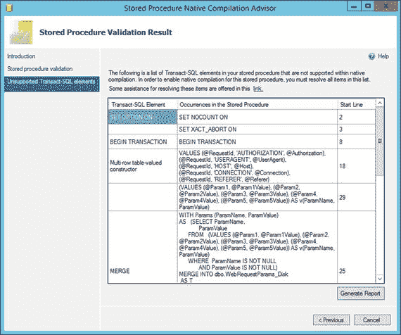

图 D-9. 本机编译顾问输出

`Generate Report` 按钮将创建一个包含分析结果的 HTML 文件，类似于顾问窗口中显示的内容。

最后，Management Studio 允许你通过“内存 OLTP 迁移检查清单向导”为多个数据库对象运行内存优化和本机编译顾问。你可以通过数据库弹出菜单中的“任务”菜单项访问此向导，如图 D-10 所示。

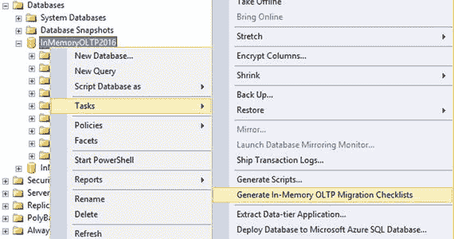

图 D-10. “生成内存 OLTP 迁移检查清单”菜单项

“生成内存 OLTP 迁移检查清单向导”允许你选择要验证的数据库对象列表，如图 D-11 所示。

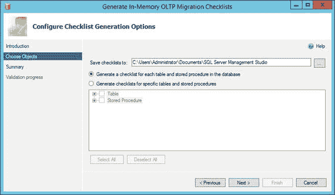

图 D-11. “生成内存 OLTP 迁移检查清单向导”的参数

该过程完成后，SQL Server 会生成一组 HTML 文件（每个对象一个），并将其保存在定义的位置。每个文件将包含一个类似于内存优化和本机编译顾问生成的报告，如图 D-12 所示。

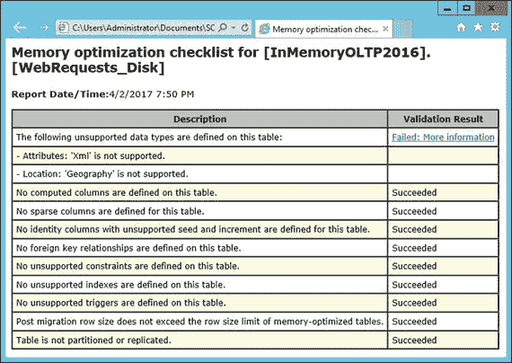

图 D-12. “生成内存 OLTP 迁移检查清单向导”的报告文件

内存 OLTP 迁移工具可以帮助你识别迁移目标，并在迁移过程中为你提供帮助。然而，最好对它们的建议持保留态度，不要完全依赖其输出。毕竟，你比任何自动化工具都更了解自己的系统。

## 总结

SQL Server 2016 提供了多种有助于进行内存 OLTP 迁移的工具。“事务性能分析概述”报告允许你识别可从迁移中受益的对象。内存优化和本机编译顾问分析表、存储过程和用户定义函数，以识别内存 OLTP 不支持的构造。最后，“生成内存 OLTP 迁移检查清单向导”允许你为多个数据库对象运行内存优化和本机编译顾问。

这些工具非常有益，可以在迁移过程中为你节省大量时间。但是，在执行分析时，你不应严格依赖其输出。你需要分析整个系统，包括基础设施和硬件、索引策略、数据库管理例程和其他因素，以实现内存 OLTP 的最佳效果。

再次感谢你对这项技术的兴趣！为你撰写此文非常愉快！

