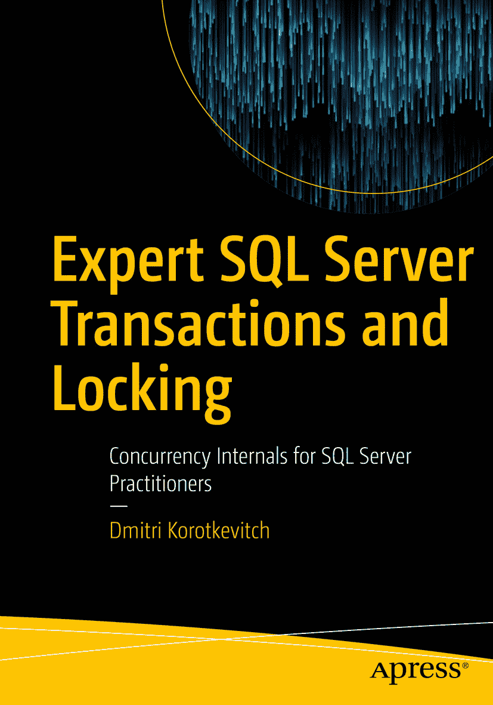

ISBN 978-1-4842-3956-8e-ISBN 978-1-4842-3957-5 [`doi.org/10.1007/978-1-4842-3957-5`](https://doi.org/10.1007/978-1-4842-3957-5) 美国国会图书馆控制号：2018958877 © Dmitri Korotkevitch 2018
本作品受版权保护。出版商保留所有权利，无论涉及材料的全部或部分，特别是翻译、转载、插图重用、朗诵、广播、缩微胶片或其他任何物理方式的复制，以及信息存储与检索、电子改编、计算机软件，或目前已知或未来开发的类似或不同方法。
书中可能出现商标名称、标识和图像。我们仅以编辑方式并为商标所有者利益使用商标名称、标识和图像，并无意侵犯商标权。
本出版物中对商品名称、商标、服务标识及类似术语的使用，即使未特别标识，也不应被视为表达意见，判断其是否受专有权利约束。
虽然本书中的建议和信息在出版时被认为是真实准确的，但作者、编辑或出版商均不对可能出现的任何错误或遗漏承担法律责任。出版商对本出版物所含材料不作任何明示或暗示的保证。
本书通过 Springer Science+Business Media New York 在全球图书贸易中发行，地址：233 Spring Street, 6th Floor, New York, NY 10013。电话：1-800-SPRINGER，传真：(201) 348-4505，电子邮件：orders-ny@springer-sbm.com，或访问 www.springeronline.com。Apress Media, LLC 是一家加利福尼亚州有限责任公司，其唯一成员（所有者）是 Springer Science + Business Media Finance Inc (SSBM Finance Inc)。SSBM Finance Inc 是一家特拉华州公司。

*献给我来自 Chewy.com 的朋友们：感谢你们为我生活带来的所有欢乐！*

## 引言

不久前，一位同事问我：“你最喜欢 `SQL Server` 的哪一点？”这个问题我以前听过很多次，所以给出了我通常的回答：“`SQL Server 内部机制`。我喜欢理解这个产品如何工作，并用这些知识解决复杂问题。”

但他接下来的问题可没那么简单了：“你是怎么爱上 `SQL Server 内部机制`的？”我想了一会儿，答道：“嗯，我想是从我不得不处理锁问题开始的。为了排查复杂的死锁和阻塞情况，我必须学习 `SQL Server 内部机制`。而且我很享受那些挑战带给我的满足感。”

事实上，这就是真相。并发模型一直是我 `SQL Server` 之旅的重要组成部分，并且我一直对它着迷。并发，也许是 `SQL Server` 中最令人困惑、最不为人所理解的部分之一，但与此同时，它也相当有逻辑性。其内部实现文档记录甚少；然而，一旦你掌握了核心概念，一切就开始完美契合了。

同样可以说，并发主题一直是我最喜欢的。我最初的几次 `SQL Saturday` 演讲和最初的几篇博客文章都是关于锁和阻塞的。我甚至开始写我的第一本书，即 `Pro SQL Server Internals` 的第一版，就是从第 [17](https://doi.org/10.1007/978-1-4842-3957-5_17) 章——“锁、阻塞和并发”部分的第一章——开始写的，然后再回去写开头部分。

顺便说一下，那几章是我写过的最早也是最糟糕的章节。我很高兴有机会在 `Internals` 第二版中重新修订它们。然而，由于时间和篇幅限制，我未能如我所愿深入涵盖该主题（我确信 `Apress` 在打印当前版本的 900 页手稿时经常纸张不够用）。因此，我现在非常高兴能向大家单独呈现这本关于 `SQL Server` 锁、阻塞和并发的书。

如果你之前读过 `Pro SQL Server Internals`，你会注意到一些熟悉的内容。尽管如此，我已尽力扩展了旧主题的覆盖范围，并新增了不少新内容。我还修改了许多演示脚本，并添加了新的 `阻塞监控框架` 代码，这极大地简化了系统中并发问题的排查。

本书涵盖了从 `SQL Server 2005` 开始的所有现代 `SQL Server` 版本，以及 `Microsoft Azure SQL Database`。可能会有一些非常微小的版本特定差异；但从概念上讲，`SQL Server` 并发模型多年来变化不大。

我也不期望它在不久的将来会发生巨大变化，所以这本书至少应适用于未来几个版本的 `SQL Server`。

最后，我想再次感谢您选择这本书并信任我。希望您能像我享受写作过程一样，享受阅读本书的乐趣！

## 本书结构

本书包含 14 章，结构如下：

*   第 1 章，“数据存储与访问方法”，描述了 `SQL Server` 如何在基于磁盘的表中存储和处理数据。这些知识是理解 `SQL Server` 并发模型的重要基石。
*   第 2 章，“事务管理与并发模型”，概述了乐观和悲观并发，并重点介绍了系统中的事务管理和错误处理。
*   第 3 章，“锁类型”，解释了 `SQL Server` 并发的关键要素，例如锁的类型。
*   第 4 章，“系统中的阻塞”，讨论了系统中阻塞发生的原因，并展示了如何排查阻塞。
*   第 5 章，“死锁”，演示了死锁的常见原因，并概述了如何解决死锁。
*   第 6 章，“乐观隔离级别”，涵盖了 `SQL Server` 中的乐观并发。
*   第 7 章，“锁升级”，讨论了 `SQL Server` 用于减少系统锁开销的锁升级技术。
*   第 8 章，“架构锁与低优先级锁”，涵盖了数据库中发生架构修改时出现的架构锁。它还解释了低优先级锁，这有助于在 `SQL Server` 的近期版本中减少索引和分区管理期间的阻塞。
*   第 9 章，“锁分区”，讨论了锁分区，`SQL Server` 在拥有 16 个或更多逻辑 CPU 的系统中使用此技术。
*   第 10 章，“应用程序锁”，重点介绍了可以在代码中以编程方式创建的应用程序锁。
*   第 11 章，“设计事务策略”，提供了关于如何在系统中设计事务策略的指南。
*   第 12 章，“并发问题排查”，讨论了系统化的排查流程，并演示了如何检测和解决系统中的并发问题。
*   第 13 章，“内存中 OLTP 并发模型”，概述了并发在 `内存中 OLTP` 环境中如何工作。
*   第 14 章，“锁与列存储索引”，解释了在可更新的 `列存储索引` 上发生的锁。

## 下载代码

你可以从 Apress 网站的“源代码”部分（[`www.apress.com`](http://www.apress.com)）或我的博客“出版物”部分（[`http://aboutsqlserver.com`](http://aboutsqlserver.com)）下载本书中使用的代码。源代码包含一个 SQL Server Management Studio 解决方案，其中包含一组项目（每章一个）。还有一个独立的解决方案，包含阻塞监控框架代码。

我计划在未来定期更新和增强阻塞监控框架。你随时可以从 [`http://aboutsqlserver.com/bmframework`](http://aboutsqlserver.com/bmframework) 下载最新版本。

## 致谢

写作是一个极其耗时的过程，如果没有家人的耐心、理解和持续支持，我不可能写成此书。非常感谢你们所做的一切！

我非常感激 **Mark Broadbent**，他协助了本书的技术审阅。他的建议和坚持极大地提高了我的工作质量。Mark，与你一起工作很愉快！

同样，我要感谢 **Victor Isakov**，他协助了我其他书籍的技术审阅。尽管 Victor 没有参与这个项目，但你依然可以看到他无处不在的影响力。

我要感谢 **Nazanin Mashayekh**，她阅读了手稿并提供了许多很好的建议。Nazanin 居住在德黑兰，她在不同岗位上拥有多年使用 SQL Server 的经验。

当然，我还要感谢整个 Apress 团队，特别是 **Jill Balzano**、**April Rondeau** 和 **Jonathan Gennick**。感谢你们所有的帮助和努力，让我们保持条理清晰！

显然，如果没有我们拥有的这个伟大产品，我的任何一本书都无法存在。感谢 **Microsoft 工程团队** 所有的辛勤工作和努力！我还要感谢 **Kalen Delaney** 的 `SQL Server 内部机制` 书籍，它们帮助我和许多其他人掌握了 SQL Server 技能。

最后，我要感谢 SQL Server 社区的所有朋友们，感谢你们的支持和鼓励。如果没有你们所有人，我都不确定自己是否还有写作的动力！

感谢大家！

### 关于作者和关于技术审阅者

#### 关于作者

#### 关于技术审阅者

