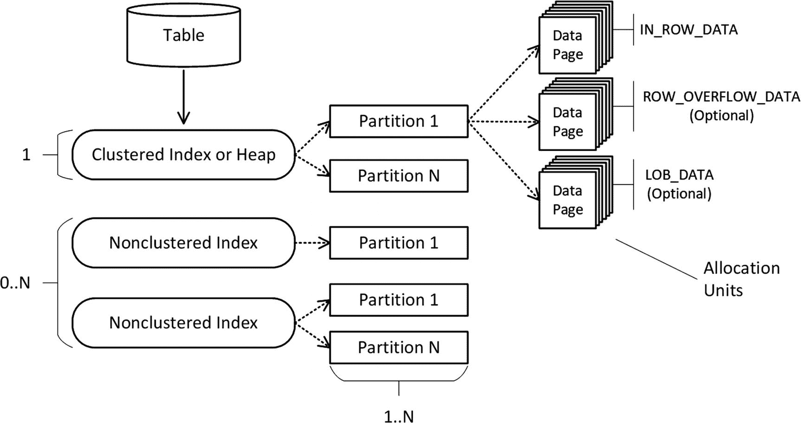
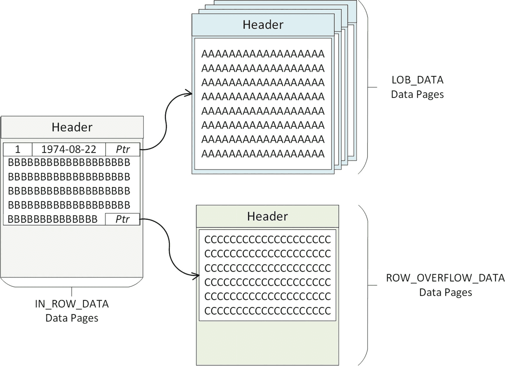
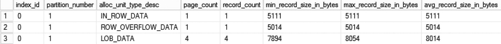
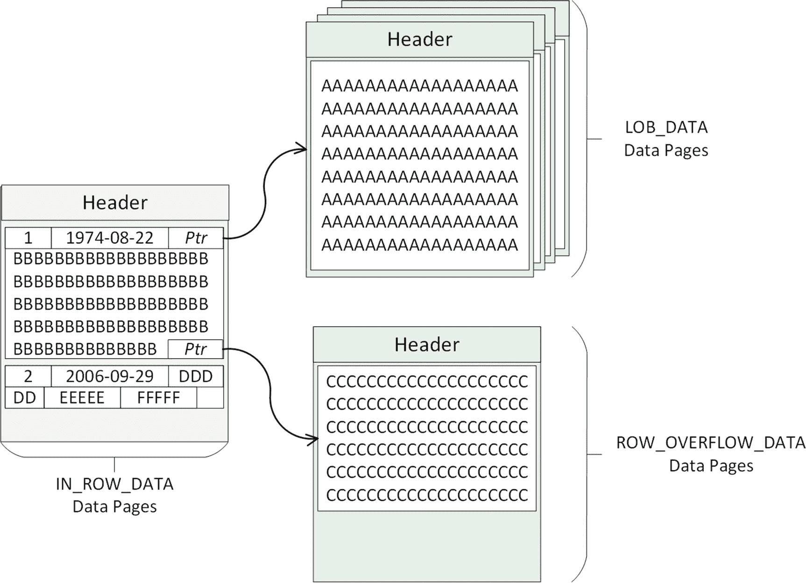
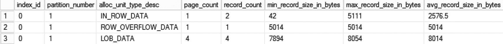
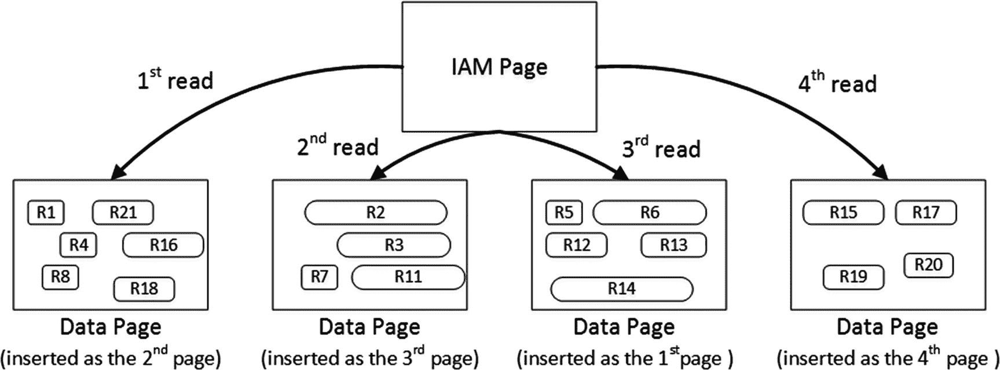
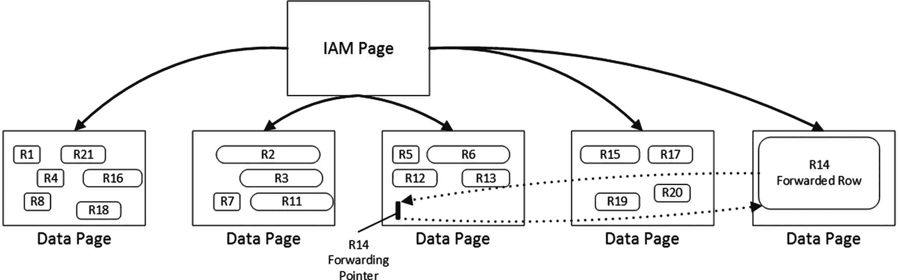
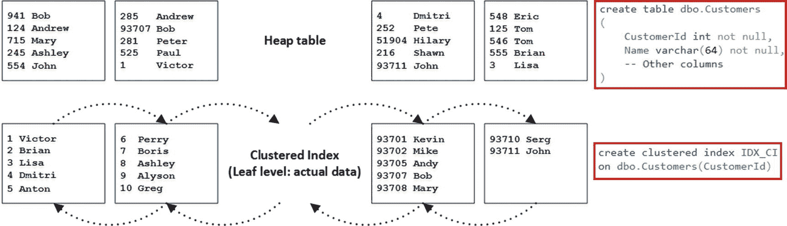
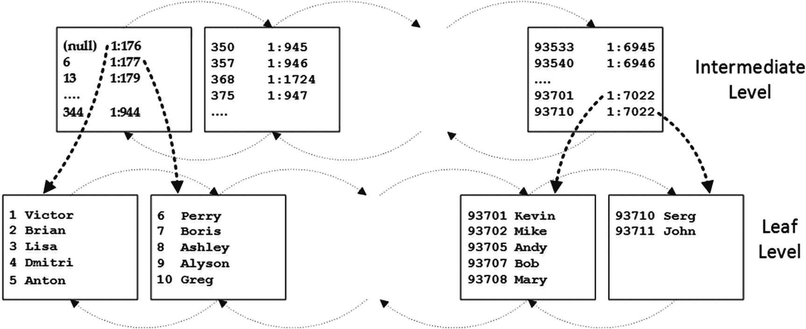

# 1. 数据存储与访问方法

如果不理解 SQL Server 如何存储和访问数据，就不可能掌握其并发模型。这些知识有助于你理解系统中锁行为的各个方面，对于排查并发问题也至关重要。

如今，SQL Server 和 Microsoft Azure SQL 数据库支持三种不同的技术，这些技术决定了系统中数据的存储和操作方式。经典的**存储引擎**实现基于行的存储。该技术将表中的所有列组合成数据行，持久化在基于磁盘的表中。数据行则驻留在 8 KB 的数据页上，每页可以包含一行或多行数据。

从 SQL Server 2012 开始，你可以使用**列存储索引**以列式格式存储数据。SQL Server 将数据拆分成最多包含 1,048,576 行的 `行组`。行组内的数据是按列而非按行组合和存储的。这种格式针对报表和分析查询进行了优化。

最后，在 SQL Server 2014 中引入的**内存 OLTP 引擎**，允许你定义内存优化表，这些表将所有数据完全保存在内存中。内存中的数据行通过内存指针链接到数据行链。该技术针对高负载的 OLTP 工作进行了优化。

在介绍完经典存储引擎的并发模型后，我们将在本书后面讨论内存 OLTP 和列存储索引中的锁行为。这些知识是理解 SQL Server 在多用户环境下行为方式的基石。

本章的目标是高层概述 SQL Server 中基于行的存储。它将解释 SQL Server 如何在基于磁盘的表中存储数据，阐述 B-Tree 索引的结构，并演示 SQL Server 如何从中访问数据。

你不应将本章视为对 SQL Server 存储引擎的深入探讨。然而，它应提供足够的信息来讨论 SQL Server 中的并发模型。

## 表的剖析

基于磁盘的表的内部结构相当复杂，由多个元素和内部对象组成，如图 1-1 所示。



图 1-1：表的内部结构

表中的数据要么是完全未排序的（这些表称为 `堆表` 或 `堆`），要么在表定义了聚集索引时，根据聚集索引键的值进行排序。

除了单个聚集索引之外，每个表还可以有一组非聚集索引。这些索引是独立的数据结构，它们存储表中数据的副本，并根据索引键列进行排序。例如，如果一个列被包含在三个非聚集索引中，SQL Server 将存储该数据四次——一次在聚集索引或堆中，另外三次分别在三个非聚集索引中。

根据 SQL Server 版本的不同，你可以为每个表创建 250 或 999 个非聚集索引。然而，由于它们带来的开销，创建大量索引显然不是一个好主意。除了存储开销，SQL Server 在数据修改时还需要在每个非聚集索引中插入或删除数据。此外，更新操作要求 SQL Server 修改包含被更新列的所有索引中的数据。

在内部，每个索引（和堆）由一个或多个 `分区` 组成。简而言之，每个分区都是一个独立于对象中其他分区的内部数据结构（索引或堆）。SQL Server 允许为表中的每个索引使用不同的分区策略；然而，在大多数情况下，所有索引的分区方式相同并且相互对齐。


**注意**

SQL Server 中的每个表/索引都进行了分区。未分区的表在内部被视为单分区表/索引。

正如我已经提到的，实际数据存储在 8 KB 的*数据页*上的*数据行*中，用户可用空间为 8,060 字节。存储用户数据的页面根据其存储的数据类型，可能属于三个不同的类别，称为*分配单元*。

`IN_ROW_DATA` 分配单元页存储*主要的*数据行对象，这些对象由内部属性和固定长度列（如 `int`、`datetime`、`float` 等）的数据组成。数据行的行内部分必须适合单个数据页，因此不能超过 8,060 字节。当可变长度列（如 `(n)varchar(max)`、`(n)varbinary(max)`、`xml` 等）的数据能够适应该限制时，也可能存储在主要行对象的行内部分。

当可变长度数据不适合行内存储时，SQL Server 会将其存储在行外的不同数据页上，并通过行内指针引用它们。超过 8,000 字节的可变长度数据存储在 `LOB_DATA` 分配单元数据页上（`LOB` 代表*大对象*）。否则，数据存储在 `ROW_OVERFLOW_DATA` 分配单元页中。

让我们看一个例子，创建一个包含几个固定长度和可变长度列的表，并在其中插入一行，如代码清单 1-1 所示。

```
create table dbo.DataRows
(
ID int not null,
ADate datetime not null,
VarCol1 varchar(max),
VarCol2 varchar(5000),
VarCol3 varchar(5000)
);
insert into dbo.DataRows(ID, ADate, VarCol1, VarCol2, VarCol3)
values
(
1
,'1974-08-22'
,replicate(convert(varchar(max),'A'),32000)
,replicate(convert(varchar(max),'B'),5000)
,replicate(convert(varchar(max),'C'),5000)
);
```
代码清单 1-1：数据行存储：创建测试表

来自固定长度列（`ID`、`ADate`）的数据将存储在 `IN_ROW_DATA` 分配单元页的行内。`VarCol1` 列的数据为 32,000 字节，将存储在 `LOB_DATA` 数据页上。

`VarCol2` 和 `VarCol3` 列各有 5,000 字节的数据。SQL Server 会将其中一列保留在行内（它将适合 8,060 字节的限制），并将另一列放置在单个 `ROW_OVERFLOW_DATA` 页上。

**注意**
行外列指针在行内使用 16 或 24 字节，这会计入 8,060 的最大行大小。在实践中，这可能会限制表中可以拥有的列数。

图 1-2 说明了此状态。


图 1-2：数据行存储：首次 INSERT 后的数据页

`sys.dm_db_index_physical_stats` 数据管理函数通常用于分析索引碎片。它还按分配单元显示有关数据页的信息。

代码清单 1-2 显示了返回有关 `dbo.DataRows` 表信息的查询。

```
select
index_id, partition_number, alloc_unit_type_desc
,page_count, record_count, min_record_size_in_bytes
,max_record_size_in_bytes, avg_record_size_in_bytes
from
sys.dm_db_index_physical_stats
(
db_id()
,object_id(N'dbo.DataRows')
,0  /* IndexId = 0 -> Table Heap */
,NULL /* All Partitions */
,'DETAILED'
);
```
代码清单 1-2：数据行存储：使用 `sys.dm_db_index_physical_stats` DMO 分析表

图 1-3 展示了代码的输出。如预期所示，该表有一个 `IN_ROW_DATA` 页、一个 `ROW_OVERFLOW_DATA` 页和四个 `LOB_DATA` 页。`IN_ROW_DATA` 页有大约 2,900 字节的可用空闲空间。


图 1-3：数据行存储：首次 INSERT 后 `sys.dm_db_index_physical_stats` 的输出

让我们使用代码清单 1-3 中的代码插入另一行。

```
insert into dbo.DataRows(ID, ADate, VarCol1, VarCol2, VarCol3)
values(2,'2006-09-29','DDDDD','EEEEE','FFFFF');
```
代码清单 1-3：数据行存储：插入第二行

所有三个可变长度列都存储五个字符的字符串，因此该行将适合已分配的 `IN_ROW_DATA` 页。图 1-4 说明了此阶段的数据页。


图 1-4：数据行存储：第二次 INSERT 后的数据页

你可以通过再次运行代码清单 1-2 中的代码来确认这一点。图 1-5 展示了该视图的输出。


图 1-5：数据行存储：第二次 INSERT 后 `sys.dm_db_index_physical_stats` 的输出

SQL Server 在逻辑上将八个页面组合成 64KB 的单元，称为*区*。有两种类型的区可用：*混合区*存储属于不同对象的数据，而*统一区*存储同一对象的数据。

默认情况下，当创建新对象时，SQL Server 将前八个对象页存储在混合区中。此后，该对象的所有后续空间分配都使用统一区完成。

**提示**
禁用混合区分配可能有助于提高系统中 `tempdb` 的吞吐量。在 2016 版之前的 SQL Server 中，你可以通过启用服务器级别的跟踪标志 `T1118` 来实现。在 SQL Server 2016 及更高版本中，`tempdb` 不再使用混合区，因此不需要此跟踪标志。

SQL Server 使用一种特殊类型的页面，称为*分配映射图*，来跟踪数据库文件中的区和页面使用情况。*索引分配映射图 (IAM)* 页按分区跟踪属于分配单元的区。简而言之，这些页面是位图，其中每个位指示该区是否属于对象分区的特定分配单元。

每个 IAM 页覆盖大约 64,000 个区，或数据文件中近 4 GB 的数据。对于更大的文件，多个 IAM 页会链接在一起形成 *IAM 链*。

**注意**
还有许多其他类型的分配映射图用于数据库管理。你可以在 [`https://docs.microsoft.com/en-us/sql/relational-databases/pages-and-extents-architecture-guide`](https://docs.microsoft.com/en-us/sql/relational-databases/pages-and-extents-architecture-guide) 或书籍 *Pro SQL Server Internals* 中阅读相关内容。


### 堆表

堆表是没有聚集索引的表。堆表中的数据是未排序的。SQL Server 既不保证也不维护堆表中数据的排序顺序。

当向堆表中插入数据时，SQL Server 会尽可能填满数据页，尽管它不会分析页面上实际的可用空闲空间。它使用另一种称为 *页空闲空间 (Page Free Space, PFS)* 的分配图页来跟踪页面上的可用空闲空间量。然而，这种跟踪并不精确。SQL Server 使用三个位来指示页面是否为空，或者其填充率是 1 到 50%、51 到 80%、81 到 95% 还是 95% 以上。完全有可能，即使页面有可用空间，SQL Server 也可能不会在该页上存储新行。

当从堆表中选择数据时，SQL Server 使用 IAM 页来查找属于该表的页和区，并根据它们在 IAM 页上的顺序而不是数据插入的顺序来处理它们。图 1-6 说明了这一点。此操作在执行计划中显示为 *表扫描 (Table Scan)*。



图 1-6：从堆表中选择数据

当更新堆表中的行时，SQL Server 会尝试将其保留在同一页上。如果没有可用的空闲空间，SQL Server 会将该行的新版本移动到另一页，并用一个特殊的 16 字节的行（称为 *转发指针*）替换旧行。该行的新版本称为 *转发行*。图 1-7 说明了这一点。



图 1-7：转发指针

使用转发指针主要有两个原因。首先，它们可以防止更新引用该行的非聚集索引键。我们将在本章后面更详细地讨论非聚集索引。

此外，转发指针有助于最小化重复读取的次数；即在表扫描期间单个行被读取多次的情况。让我们以图 1-7 为例，并假设 SQL Server 按从左到右的顺序扫描页面。再进一步假设，在 SQL Server 读取第 4 页时（在第 3 页已被读取之后），第 3 页中的行被修改了。该行的新版本会被移动到尚未处理的第 5 页。如果没有转发指针，SQL Server 将不知道该行的旧版本已经被读取过，并会在扫描第 5 页时再次读取它。有了转发指针，SQL Server 会跳过转发行——它们的内部属性中有一个标志指示该状态。

虽然转发指针有助于最小化重复读取，但它们同时也引入了额外的读取操作。SQL Server 在遇到转发指针时会遵循它并读取行的新版本。当堆表被频繁更新且有大量转发行时，这种行为可能会导致过多的 I/O 操作。

#### 注意

你可以通过检查 `sys.dm_db_index_physical_stats` 视图中的 `forwarded_record_count` 列来分析表中的转发行数量。

当转发行的大小因另一次更新而减小，并且包含转发指针的数据页有足够空间容纳更新后的行版本时，SQL Server 可能会将其移回其原始数据页并删除转发指针行。然而，消除所有转发指针的唯一可靠方法是重建堆表。你可以使用 `ALTER TABLE REBUILD` 语句来完成此操作。

堆表在暂存环境中可能很有用，例如当你需要将大量数据快速导入系统时。向堆表中插入数据通常比向带有聚集索引的表中插入数据更快。然而，在常规工作负载下，由于堆表次优的空间控制以及转发指针引入的额外 I/O 操作，带有聚集索引的表通常比堆表性能更佳。

#### 注意

你可以在本书的配套材料中找到演示转发指针开销和堆表中次优空间控制的脚本。

### 聚集索引与 B 树

聚集索引决定了表中数据的物理顺序，数据根据聚集索引键进行排序。一个表只能定义一个聚集索引。

假设你想在已有数据的堆表上创建聚集索引。第一步如图 1-8 所示，SQL Server 会创建数据的另一个副本，并根据聚集键的值对其进行排序。数据页在一个双链表中链接，其中每个页都包含指向链中下一个和上一个页的指针。这个列表称为索引的 *叶级别*，它包含实际的表数据。



图 1-8：聚集索引结构：叶级别

#### 注意

页面通过页地址相互引用，该地址由两个值组成：数据库中的 `file_id` 和文件中的页序号。

当叶级别由多个页组成时，SQL Server 开始构建索引的 *中间级别*，如图 1-9 所示。



图 1-9：聚集索引结构：中间级别

中间级别为每个叶级别页存储一行。它存储两条信息：它所引用页的物理地址和该页索引键的最小值。唯一的例外是第一页的第一行，SQL Server 在其中存储 `NULL` 而不是最小索引键值。通过这种优化，当你在表中插入具有最小键值的行时，SQL Server 无需更新非叶级别行。

中间级别的页也链接在一个双链表中。SQL Server 会不断增加中间级别，直到出现一个只包含单个页的级别。这个级别称为 *根级别*，它成为索引的入口点，如图 1-10 所示。


