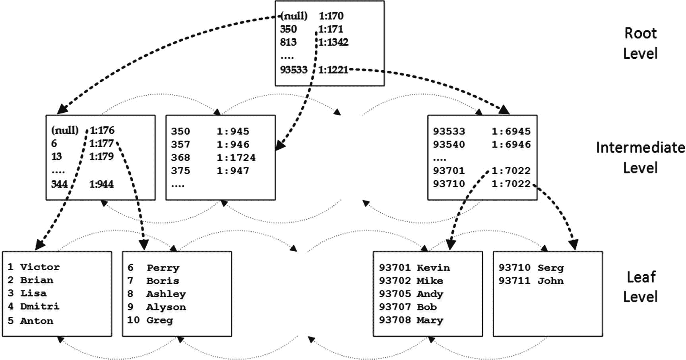
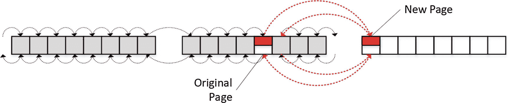
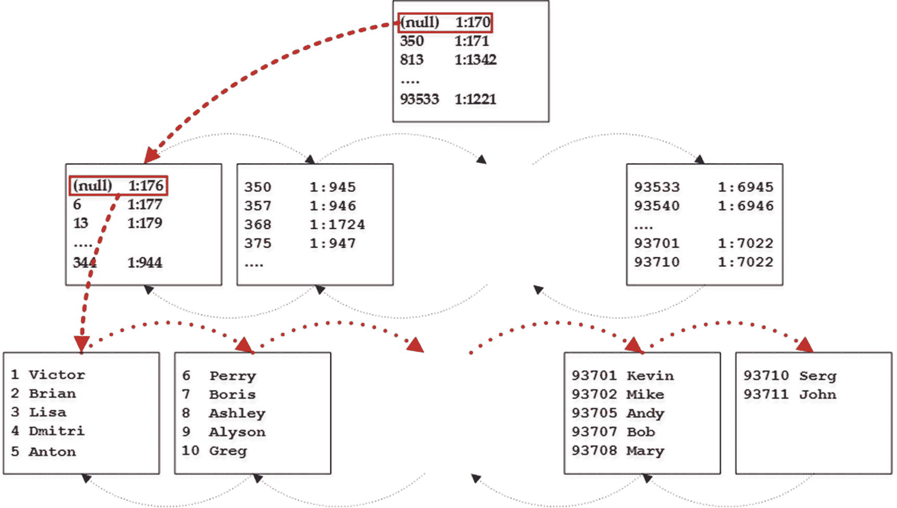
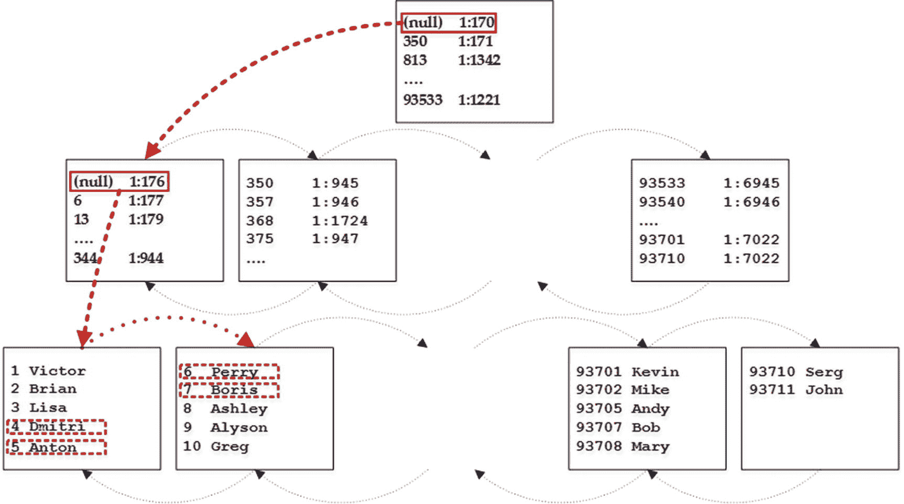
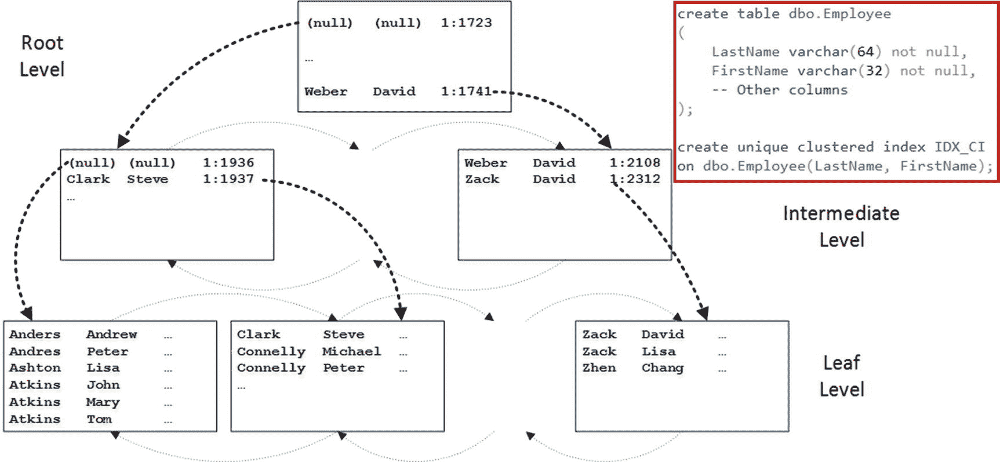
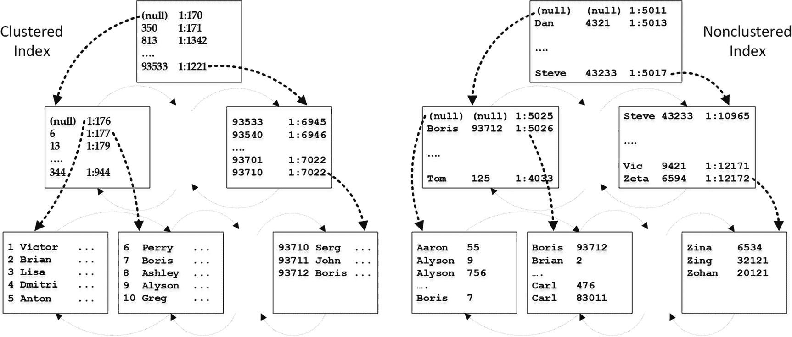
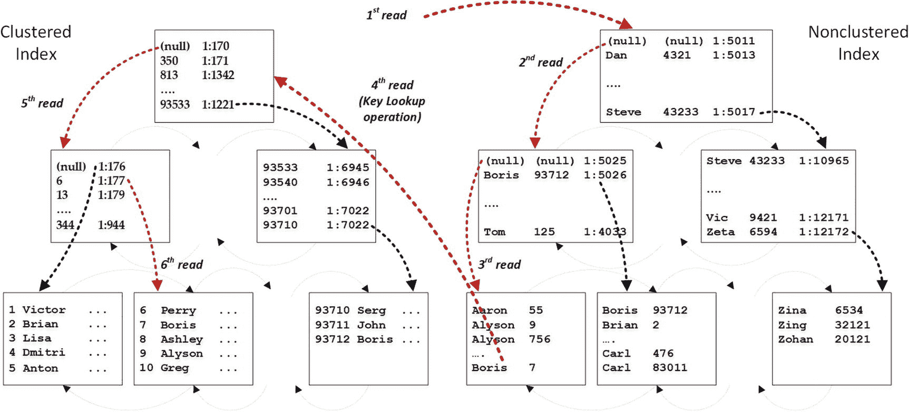
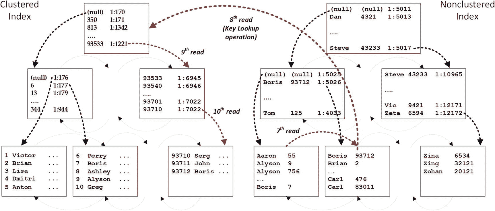
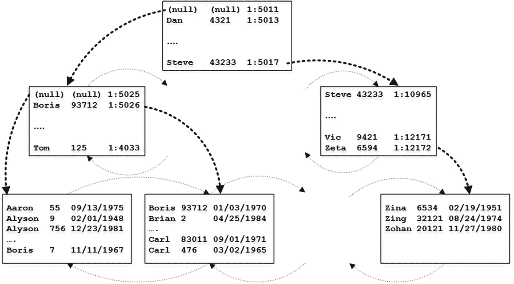

# B 树索引结构详解

#### 注意

此索引结构称为`B-Tree Index`，即`Balanced Tree`（平衡树）。


图 1-10 聚集索引结构：根级别

如图所示，索引始终包含一个叶级别、一个根级别以及零个或多个中间级别。唯一的例外是当索引数据可以容纳在单个页面中时。在这种情况下，SQL Server 不会创建单独的根级别页面，索引仅由单个叶级别页面组成。

SQL Server 始终维护索引中数据的顺序，将新行插入到它们所属的数据页面中。当数据页面没有足够的空闲空间时，SQL Server 会分配一个新页面并将行放置在那里，同时调整双向链表页面列表中的指针以保持索引中的逻辑排序顺序。此操作称为`page split`（页面拆分），会导致索引碎片化。

图 1-11 说明了这种情况。当`Original Page`（原始页面）没有足够空间容纳新行时，SQL Server 执行页面拆分，将大约一半的数据从`Original Page`移动到`New Page`（新页面），然后调整页面指针。


图 1-11 页面拆分后的叶级别数据页面

页面拆分也可能在数据修改期间发生。SQL Server 在 B-Tree 索引中不使用转发展指针。相反，当无法就地执行更新时（例如，在数据行增长期间），SQL Server 会执行页面拆分，将更新后的行及后续行从页面移动到另一个页面。尽管如此，索引排序顺序通过页面指针得以维持。

SQL Server 可以通过三种不同的方式从索引中读取数据。第一种是`allocation order scan`（分配顺序扫描）。SQL Server 通过 IAM 页面访问表数据，类似于处理堆表的方式。然而，这种方法可能引入数据一致性现象——在页面拆分时，行可能被跳过或重复读取——因此，分配顺序扫描很少使用。我们将在本书后面讨论可能导致分配顺序扫描的情况。

第二种方法称为`ordered scan`（有序扫描）。假设我们要运行`SELECT Name FROM dbo.Customers`查询。所有数据行都驻留在索引的叶级别，SQL Server 可以扫描索引并将行返回给客户端。

SQL Server 从索引的根页面开始，并从那里读取第一行。该行引用具有表中最小键值的中间页面。SQL Server 读取该页面并重复此过程，直到找到叶级别上的第一个页面。然后，SQL Server 开始逐行读取行，通过页面的链接列表移动，直到读取所有行。图 1-12 说明了此过程。


图 1-12 有序索引扫描

分配顺序扫描和有序扫描在执行计划中都表示为`Index Scan`（索引扫描）运算符。

#### 注意

服务器可以向前和向后两个方向导航索引。但是，SQL Server 在向后索引扫描期间不使用并行度。

最后一种索引访问方法称为`index seek`（索引查找）。假设我们要运行以下查询：
```
SELECT Name FROM dbo.Customers WHERE CustomerId BETWEEN 4 AND 7
```
图 1-13 说明了 SQL Server 可能如何处理它。


图 1-13 索引查找

为了从表中读取行范围，SQL Server 需要找到范围内键的最小值（即 4）。SQL Server 从根页面开始，其中第二行引用了键最小值为 350 的页面。该值大于我们要查找的键值，因此 SQL Server 读取根页面第一行所引用的中间级别数据页面（1:170）。

类似地，中间页面将 SQL Server 引导到第一个叶级别页面（1:176）。SQL Server 读取该页面，然后读取`CustomerId`等于 4 和 5 的行，最后从第二个页面读取剩余的两行。

从技术上讲，索引查找操作有两种类型。第一种称为`point-lookup`（点查找，有时也称为`singleton lookup`），SQL Server 查找并返回单个行。可以将`WHERE CustomerId = 2`谓词视为一个例子。

另一种类型称为`range scan`（范围扫描），它要求 SQL Server 找到键的最低值或最高值，然后（向前或向后）扫描行集，直到达到扫描范围的末尾。谓词`WHERE CustomerId BETWEEN 4 AND 7`会导致范围扫描。这两种情况在执行计划中都显示为`Index Seek`运算符。

如你所猜，索引查找比索引扫描更高效，因为 SQL Server 只处理行和数据页面的子集，而不是扫描整个索引。然而，执行计划中的`Index Seek`运算符可能会产生误导，它可能代表一个扫描大量行甚至整个索引的范围扫描。例如，在我们的表中，`WHERE CustomerId > 0`谓词要求 SQL Server 扫描整个索引；但它将在执行计划中表示为`Index Seek`运算符。

关系数据库中有一个称为`SARGable predicates`（可搜索谓词）的概念，即`Search Argument-able`。如果 SQL Server 在索引存在时可以利用索引查找操作，则该谓词是`SARGable`的。简而言之，当 SQL Server 在谓词求值期间可以确定要处理的单个或范围的索引键值时，谓词就是`SARGable`的。显然，使用`SARGable`谓词编写查询并尽可能利用索引查找是有益的。

`SARGable`谓词包括以下运算符：`=`、`>`、`>=`、`<`、`<=`、`IN`、`BETWEEN`和`LIKE`（前缀匹配情况下）。非`SARGable`运算符包括`NOT`、`<>`、`LIKE`（非前缀匹配情况下）和`NOT IN`。

另一种使谓词变为非`SARGable`的情况是对表列使用函数（标准或用户定义）。SQL Server 必须为处理的每一行调用该函数，这阻止了索引查找的使用。

这同样适用于数据类型转换，此时 SQL Server 使用`CONVERT_IMPLICIT`内部函数。可能发生这种情况的一个常见示例是在谓词中对`varchar`列使用`nvarchar`参数。另一种情况是在连接谓词中参与的列具有不同的数据类型。这两种情况即使谓词运算符看似是`SARGable`，也可能导致索引扫描。


## 复合索引

具有多个键列的索引被称为 *复合（或组合）索引*。复合索引中的数据按照从左到右的列，逐列进行排序。图 1-14 展示了在表的 `LastName` 和 `FirstName` 列上定义的复合索引结构。数据首先基于 `LastName`（最左列）排序，然后在每个 `LastName` 值内，再基于 `FirstName` 排序。



图 1-14
复合索引结构

复合索引的 SARGable（搜索参数可用性）取决于最左侧索引列上谓词的 SARGable，这使 SQL Server 能够确定要处理的索引键的范围。

表 1-1 以图 1-14 中的索引为例，展示了 SARGable 和非 SARGable 谓词的示例。

表 1-1
复合索引上的 SARGable 和非 SARGable 谓词

| SARGable 谓词 | 非 SARGable 谓词 |
| --- | --- |
| `LastName = 'Clark' and FirstName = 'Steve'` | `LastName <> 'Clark' and FirstName = 'Steve'` |
| `LastName = 'Clark' and FirstName <> 'Steve'` | `LastName LIKE '%ar%' and FirstName = 'Steve'` |
| `LastName = 'Clark'` | `FirstName = 'Steve'` |
| `LastName LIKE 'Cl%'` |   |

## 非聚集索引

聚集索引指定了表中数据行的排序方式，而非聚集索引则为一列或多列定义了独立的排序顺序，并将它们作为独立的数据结构持久化存储。

你可以以一本书为例。页码代表了这本书的 *聚集索引*。书末的索引按字母顺序列出了书中出现的术语列表。每个术语引用了该术语被提及的页码。这代表了术语的 *非聚集索引*。

当你需要在书中查找一个术语时，你可以在术语索引中查找它。这是一个快速且高效的操作，因为术语是按字母顺序排序的。接下来，你可以使用那里指定的页码快速找到该术语被提及的页面。如果没有术语索引，唯一的选择就是一页一页地阅读整本书，直到找到该术语的所有提及之处。

非聚集索引结构与聚集索引结构非常相似。让我们使用 `CREATE NONCLUSTERED INDEX IDX_NCI ON dbo.Customers(Name)` 语句，在 `dbo.Customers` 表的 `Name` 列上创建一个非聚集索引。图 1-15 展示了两种索引的结构。



图 1-15
聚集和非聚集索引结构

非聚集索引的叶子级别根据索引键的值（本例中是 `Name`）排序。叶子级别的每一行都包含键值和 `row-id` 值。对于堆表，`row-id` 是行的物理位置，定义为 `file:page:slot` 地址，其中 `slot` 标识了行在数据页上的位置。

对于具有聚集索引的表，`row-id` 代表该行聚集索引键的值。这是需要记住的一个非常重要的点。*当表定义了聚集索引时，非聚集索引不会存储关于物理行位置的信息；相反，它们存储聚集索引键的值。*

与聚集索引类似，非聚集索引的中间级别和根级别为它们所引用的每个页面存储一行。该行由物理地址和该页面上键的最小值组成。此外，对于非唯一索引，它还会存储该行的 `row-id`。

让我们看看 SQL Server 如何使用非聚集索引，假设你运行以下查询：
```sql
SELECT * FROM dbo.Customers WHERE Name = 'Boris'
```
如图 1-16 中的第一步所示，SQL Server 从非聚集索引的根页面开始。键值 *Boris* 小于 *Dan*，因此 SQL Server 转到根级别页面第一行引用的中间页面。



图 1-16
非聚集索引使用：步骤 1

该中间页面的第二行表明，页面上的最小键值是 *Boris*，尽管索引未定义为唯一，SQL Server 不知道第一页上是否存储了其他 *Boris* 行。因此，它转到索引的第一个叶子页面，在那里找到键值为 *Boris* 且 `row-id` 等于 7 的行。

在我们的例子中，非聚集索引除了 `CustomerId` 和 `Name` 之外不存储任何其他数据，因此 SQL Server 需要遍历聚集索引树，从表中获取其他列的数据，并将其返回给客户端。此操作称为 *键查找*。在不存在聚集索引的堆表中，SQL Server 使用 `row-id` 访问数据行，`row-id` 存储行在数据库中的物理位置。此操作称为 *RID 查找*。

在图 1-17 所示的下一步中，SQL Server 回到非聚集索引，读取叶子级别的第二个页面。它找到另一个键值为 *Boris*、`row-id` 为 93712 的行，并再次执行键查找。



图 1-17
非聚集索引使用：步骤 2

如你所见，即使查询只返回了两行数据，SQL Server 也不得不读取数据页 10 次。I/O 操作的次数可以根据以下公式计算：
```
(非聚集索引的级别数) + (从非聚集索引叶子级别读取的页数) + (找到的行数) * (聚集索引的级别数)
```
正如你可以猜到的，大的 `找到的行数`（键查找操作）会导致大量的 I/O 操作，这使得非聚集索引的使用效率低下。

这也适用于堆表。从堆中读取主要数据行（RID 查找操作）不需要 SQL Server 遍历聚集索引 B-Tree 的根级别和中间级别。然而，这仍然是一项昂贵的操作，尤其是在使用转发指针时。当堆表行被移动到另一页并创建转发指针时，SQL Server 不会更新非聚集索引中的 `row-id`。非聚集索引仍然引用旧行的位置，这可能在 SQL Server 读取转发行时导致额外的 I/O 操作。

因此，当 SQL Server 预计需要大量键或 RID 查找操作时，它在选择非聚集索引方面非常保守。SQL Server 选择扫描另一个索引或表而非执行键查找的阈值各不相同；然而，这个阈值非常低。

最后，值得重申的是，非聚集索引存储了索引列数据的副本，这引入了更新开销。当列被更新时，SQL Server 需要在该列出现的每个索引中更新它们。同样，每个插入或删除操作都要求 SQL Server 在每个非聚集索引 B-Tree 上执行该操作。

请记住这个开销，避免在系统中创建不必要的非聚集索引。


## 包含列的索引

正如我们刚才讨论的，当 SQL Server 预计需要大量的键查找或 RID 查找操作时，它很少使用非聚集索引。这些操作通常会导致大量的逻辑读和物理读。

在进行键查找操作时，SQL Server 每次需要获取单行数据时，都必须从聚集索引访问多个数据页。尽管根节点和中间索引级别通常缓存在缓冲池中，但访问叶级页面会产生随机（且通常是物理）的 I/O 读取，这很慢，尤其是在磁盘驱动器的情况下。

对于堆表也是如此。即使非聚集索引中的`row-id`存储了行在表中的物理位置，并且 RID 查找操作不需要遍历聚集索引树，它们仍然会引入随机 I/O。此外，如果行被更新并移动到另一个页面，转发指针可能会导致额外的读取。

这里的关键因素是键查找或 RID 查找的存在。非聚集索引中的行比聚集索引中的行更小。非聚集索引使用更少的数据页，因此更高效。只要不需要进行键查找或 RID 查找，即使预计需要选择大量行，SQL Server 也会使用非聚集索引。

如您所知，非聚集索引存储索引键列的数据和`row-id`。对于具有聚集索引的表，`row-id`就是索引行的聚集键值。所有索引中的值都是相同的：当您更新一行时，SQL Server 会同步更新所有索引。

当查询所需的所有数据都存在于非聚集索引中时，SQL Server 就不需要执行键查找或 RID 查找。这些索引被称为*覆盖索引*，因为它们提供了查询所需的全部信息，本质上是*覆盖*了该查询。

使非聚集索引成为*覆盖索引*是最常用的查询优化技术之一，它提高了索引效率，并允许您从执行计划中消除昂贵的键查找或 RID 查找。您可以通过在`CREATE INDEX`语句的`INCLUDE`子句中包含所需列来实现这一点。这些列的数据仅存储在叶级，不会添加到索引键中，也不影响索引行的排序顺序。

图 1-18 展示了一个包含列的索引结构，该索引定义如下：

```sql
CREATE INDEX IDX_Customers_Name ON dbo.Customers(Name) INCLUDE(DateOfBirth)
```
作用于我们之前定义的、以`CustomerId`为聚集索引列的表上。



图 1-18
包含列的索引结构

现在，如果查询引用的所有列都存在于索引中，SQL Server 就可以直接从非聚集索引 B-树的叶级获取所有数据，而无需执行键查找或 RID 查找。无论需要从那里选择多少行，它都可以使用该索引。

尽管覆盖索引是一个有助于优化查询的强大工具，但它们也是有代价的。索引中的每个列都会增加其行大小以及在磁盘和内存中使用的数据页数量。这会在索引维护期间引入额外开销，并增加数据库大小。此外，在扫描索引的全部或部分内容时，查询需要读取更多的页。当进行小范围扫描时，与键查找相比，多读取几个页的效率要高得多，这不一定会带来明显的性能影响。但是，它可能会对扫描大量数据页或整个索引的查询性能产生负面影响。

显然，它们也会增加更新开销。通过向非聚集索引添加列，您将数据存储在多个地方。这提高了选择数据查询的性能。然而，在更新期间，SQL Server 需要更改每个包含被更新列的索引中的行。请记住这一点，谨慎地将频繁修改的列包含到索引中。

## 总结

经典的 SQL Server 存储引擎使用基于行的存储将数据存储在基于磁盘的表中。表中的所有列都一起存储在驻留于 8 KB 数据页上的数据行中。

表中的数据可以以两种不同的方式存储——要么完全无序地存储在堆表中，要么在定义了聚集索引时按照聚集索引键排序存储。在正常工作负载下，带有聚集索引的表通常比堆表性能更好。

每个表都可以定义一组非聚集索引。每个非聚集索引都是一个独立的数据结构，它存储了表中数据的副本，并按照索引键列排序。非聚集索引可以以引入更新开销为代价来提高查询的性能。

SQL Server 使用键查找和 RID 查找操作来获取非聚集索引中不存在的列的数据。这些操作代价高昂，如果 SQL Server 预计需要大量此类操作，它就不会使用非聚集索引。您可以将额外的列包含在索引中，使其成为覆盖索引，从而从执行计划中消除键查找和 RID 查找。

SQL Server 在使用索引时主要采用两种数据访问模式。索引扫描通过扫描索引中的所有页面来读取整个索引。或者，索引查找操作仅处理索引行和页面的子集。索引查找比索引扫描更高效，当存在索引时，使用可支持索引查找（SARGable）的谓词是有益的。

