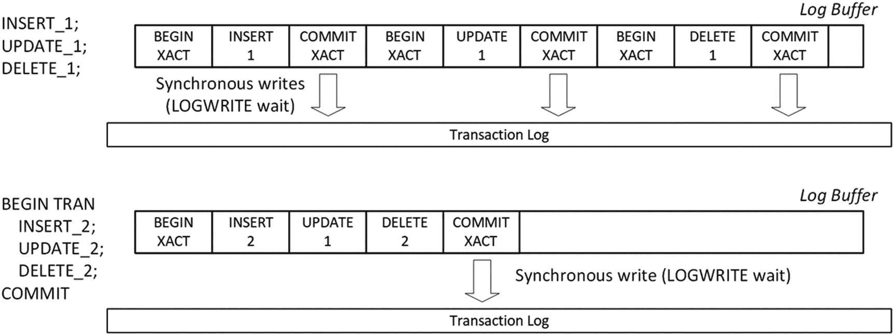
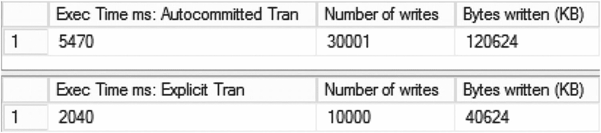
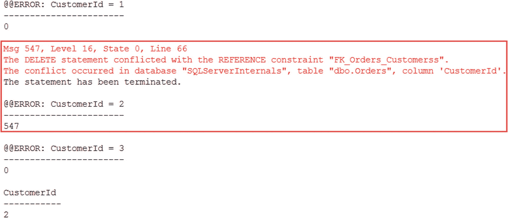
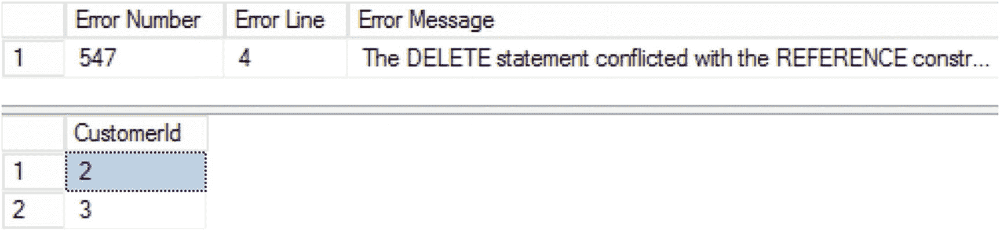
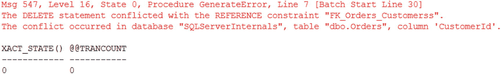
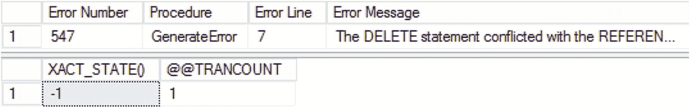
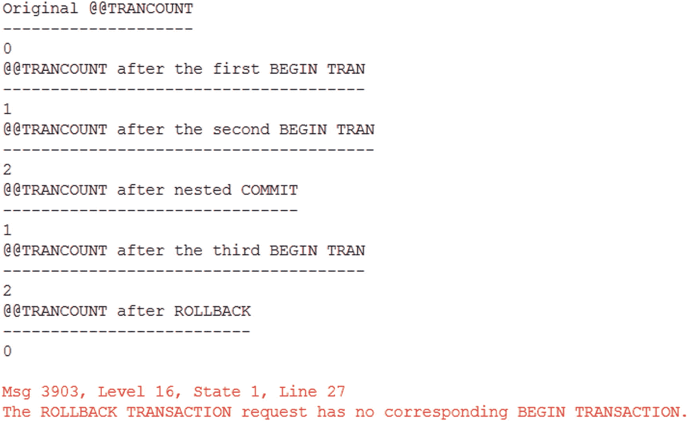
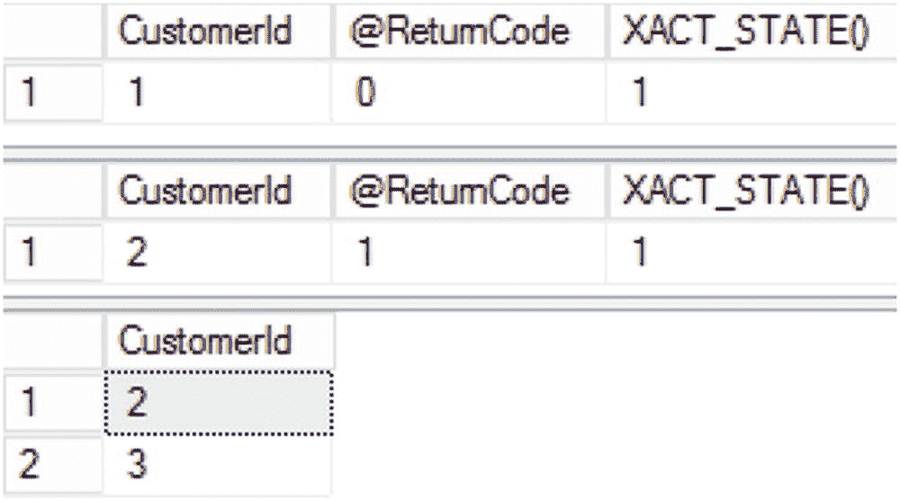

# 2. 事务管理与并发模型

事务是数据管理系统的核心概念；它们保证了数据库中数据的一致性和持久性。没有适当的事务管理，就不可能实现数据库系统。

本章将阐述事务的重要性，概述悲观和乐观并发模型，并简述事务隔离级别以及它们可能引入的数据一致性现象。最后，本章将讨论与 SQL Server 中事务管理和错误处理相关的几个问题。

## 事务

Microsoft SQL Server 的设计初衷是与其他通用数据库服务器一样，能在多用户环境中运行。数据库引擎需要处理来自多个用户的并发工作负载，并在用户查询和修改相同数据时，提供所需级别的数据一致性。

在数据库和数据管理系统中，有一个核心概念称为 *事务*。事务是读取和修改数据库中数据的单一工作单元，有助于确保数据的一致性和持久性。在正确实现的事务管理系统中，每个事务都具有四个不同的特性：*原子性*、*一致性*、*隔离性*和*持久性*，通常统称为 *ACID*。

### ACID 特性

*   **原子性** 保证每个事务作为一个单一工作单元执行，采用“要么全做，要么全不做”的原则。事务中的所有更改要么全部提交，要么全部回滚。考虑经典的银行活期账户和储蓄账户之间转账的例子。该操作由两个独立的步骤组成：减少活期账户余额和增加储蓄账户余额。事务的原子性保证这两个操作要么同时成功，要么同时失败，系统永远不会出现资金已从活期账户扣除但未存入储蓄账户的不一致状态。

*   **一致性** 确保任何数据库事务都使数据库从一个一致的状态转换到另一个一致的状态，并且不违反任何已定义的数据库规则和约束。

*   **隔离性** 确保事务中所做的更改是隔离的，并且在事务提交之前对其他事务不可见。严格来说，事务隔离性应保证多个事务的并发执行使系统达到与这些事务串行执行相同的状态。然而，在大多数数据库系统中，此要求通常被放宽，并通过 *事务隔离级别* 进行控制，我们将在本章后面讨论。

*   **持久性** 保证事务提交后，该事务所做的所有更改都是永久性的，并能在系统故障后幸存。SQL Server 通过使用 *预写式日志* 将日志记录硬化到事务日志中来实现持久性。事务只有在由其生成的所有日志记录都硬化到日志文件后，才被视为已提交。

在多用户环境中，隔离性要求是最难实现的。尽管可以完全隔离不同的事务，但这可能导致在具有易变数据的系统中出现高级别的阻塞和其他并发问题。SQL Server 通过引入几种事务隔离级别来解决这种情况，这些隔离级别以可能的、与读取数据一致性相关的并发现象为代价放宽了隔离要求：

*   **脏读：** 一个事务从其他未提交的事务中读取未提交（脏）数据。
*   **不可重复读：** 在同一个事务中，后续尝试读取相同的数据会返回不同的结果。当受影响的事务在两次读取之间，其他事务修改甚至删除了数据时，就会出现这种数据不一致问题。
*   **幻读：** 当同一个事务中的后续读取返回了新的行（该事务之前未读取过的行）时，就会发生这种现象。这发生在另一个事务在受影响的事务两次读取之间插入了新数据的情况下。

## 悲观和乐观并发控制

事务隔离级别控制着 SQL Server 行为的另一个方面，即决定事务的 *并发模型*。从概念上讲，数据库系统中使用两种并发模型：

*   **悲观并发** 基于这样的假设：访问相同数据的多个用户最终都可能希望修改数据并覆盖彼此的更改。数据库引擎通过在第一个会话访问和/或修改数据后立即锁定数据，直到事务结束，来防止这种情况发生。
*   **乐观并发** 则假设，虽然多个用户可能访问相同数据，但同时更新的可能性较低。数据不会被锁定；然而，多个更新操作会触发写-写冲突并回滚受影响的事务。

让我们通过一个例子来说明这些模型之间的区别。再次假设我们有一个事务想要在活期账户和储蓄账户之间转账。如前所述，这将导致两个更新操作——减少活期账户余额和增加储蓄账户余额。另外假设你还有另一个会话，希望与转账操作并行地从活期账户取款。此操作将减少活期账户余额（更新同一行）并执行其他操作。

在悲观并发模型下，第一个更新（在某些情况下甚至是读取）活期账户余额的会话将锁定该行，阻止其他会话访问或更新它。第二个会话将被阻塞，直到第一个会话完成事务，之后它才能读取新的活期账户余额。

在乐观并发模型下，两个会话都不会被阻塞。但是，其中一个会话将无法提交，并会因 *写-写冲突* 错误而失败。

两种并发模型各有优缺点。悲观并发可能在系统中引入阻塞。而乐观并发则需要妥善处理写-写冲突，并且通常在数据修改期间引入额外的开销。

SQL Server 同时支持悲观和乐观并发模型，并通过事务隔离级别来控制它们。


### 事务隔离级别

对于基于磁盘的表，SQL Server 支持六种不同的事务隔离级别，如表 2-1 所示。该表还展示了每种事务隔离级别下可能发生的并发现象。

表 2-1

事务隔离级别与并发现象

| 隔离级别 | 类型 | 脏读 | 不可重复读 | 幻读 | 写-写冲突 |
| --- | --- | --- | --- | --- | --- |
| `READ UNCOMMITTED` | 悲观 | 是 | 是 | 是 | 否 |
| `READ COMMITTED` | 悲观 | 否 | 是 | 是 | 否 |
| `REPEATABLE READ` | 悲观 | 否 | 否 | 是 | 否 |
| `SERIALIZABLE` | 悲观 | 否 | 否 | 否 | 否 |
| `READ COMMITTED SNAPSHOT` | 对读操作是乐观的。对写操作是悲观的。 | 否 | 是 | 是 | 否 |
| `SNAPSHOT` | 乐观 | 否 | 否 | 否 | 是 |

对于悲观隔离级别，SQL Server 严格依赖锁来防止访问被其他会话修改（有时甚至是读取）的行。对于乐观隔离级别，SQL Server 使用行版本控制，并将修改行的旧版本复制到 `tempdb` 中一个称为版本存储区的特殊区域。其他会话将从那里读取行的旧（已提交的）版本，而不是被阻塞。

需要注意的是，在乐观隔离级别下，SQL Server 仍然会对更新的行获取锁，以防止其他会话同时更新相同的行。我们将在第 6 章更详细地讨论这一点。

`READ COMMITTED SNAPSHOT` 隔离级别结合了乐观和悲观并发模型。读操作（`SELECT` 查询）使用行版本控制，而写操作（`INSERT`、`UPDATE` 和 `DELETE` 查询）则依赖锁。

严格来说，`READ COMMITTED SNAPSHOT` 并不是一个真正的隔离级别，而是一个数据库选项（`READ_COMMITTED_SNAPSHOT`），它改变了 `READ COMMITTED` 隔离级别下读操作（`SELECT` 查询）的默认行为。然而，在本书中，我将把此选项视为一个独立的事务隔离级别。

#### 注意

`READ_COMMITTED_SNAPSHOT` 数据库选项在 Microsoft Azure SQL 数据库中默认启用，而在常规版本的 SQL Server 中默认禁用。

你可以使用 `SET TRANSACTION ISOLATION LEVEL` 语句在会话级别设置事务隔离级别。大多数客户端库使用 `READ COMMITTED`（或者在启用 `READ_COMMITTED_SNAPSHOT` 数据库选项时使用 `READ COMMITTED SNAPSHOT`）作为默认隔离级别。你也可以使用锁提示在每表基础上控制隔离级别，我们将在下一章讨论。

### 处理事务

让我们看看系统中事务管理的几个方面，从事务类型开始。

#### 事务类型

SQL Server 中有三种类型的事务：显式事务、自动提交事务和隐式事务。

显式事务由代码显式控制。你可以使用 `BEGIN TRAN` 语句启动它们。它们将保持活动状态，直到你在代码中显式调用 `COMMIT` 或 `ROLLBACK`。

如果没有活动的事务存在，SQL Server 将使用自动提交事务——为它执行的每个语句启动并提交事务。需要特别记住的是，自动提交事务是按语句而非按模块工作的。例如，当一个存储过程由五个语句组成时，SQL Server 将执行五个自动提交事务。此外，如果此过程在执行过程中失败，SQL Server 不会回滚其先前已提交的自动提交事务。这种行为可能导致系统中的逻辑数据不一致。

对于包含多个数据修改语句的逻辑，由于它们引入的日志记录开销，自动提交事务的效率低于显式事务。在这种模式下，每个语句都会为隐式的 `BEGIN TRAN` 和 `COMMIT` 操作生成事务日志记录，这将导致大量的事务日志活动并降低系统性能。

过多的自动提交事务还可能引起另一个潜在的性能问题。正如我已经提到的，SQL Server 实现了预写日志以支持事务持久性，通过同步地将日志记录硬化到磁盘来与数据修改保持一致。然而，在内部，SQL Server 会批量处理日志写入操作，并将日志记录缓存在称为日志缓冲区的小型 60 KB 内存结构中。提交日志记录会强制 SQL Server 将日志缓冲区刷新到磁盘，从而引入同步 I/O 操作。

图 2-1 说明了这种情况。`INSERT_1`、`UPDATE_1` 和 `DELETE_1` 操作在自动提交事务中运行，生成额外的日志记录，并在每次 `COMMIT` 时强制日志缓冲区刷新。相比之下，`INSERT_2`、`UPDATE_2` 和 `DELETE_2` 操作在一个显式事务中运行，从而实现了更高效的日志记录。



图 2-1

使用自动提交和显式事务的事务日志记录

清单 2-1 中的代码演示了这种开销的实际表现。它在一个循环中以自动提交和显式事务执行 `INSERT/UPDATE/DELETE` 序列 10,000 次，并使用 `sys.dm_io_virtual_file_stats` 视图测量执行时间和事务日志吞吐量。


## 事务处理与错误处理

### 自动提交与显式事务

以下代码展示了自动提交事务与显式事务的区别。

```sql
create table dbo.TranOverhead
(
Id int not null,
Col char(50) null,
constraint PK_TranOverhead
primary key clustered(Id)
);
-- Autocommitted transactions
declare
@Id int = 1,
@StartTime datetime = getDate(),
@num_of_writes bigint,
@num_of_bytes_written bigint
select
@num_of_writes = num_of_writes
,@num_of_bytes_written = num_of_bytes_written
from
sys.dm_io_virtual_file_stats(db_id(),2);
while @Id < 10000
begin
insert into dbo.TranOverhead(Id, Col) values(@Id, ‘A’);
update dbo.TranOverhead set Col = ‘B’ where Id = @Id;
delete from dbo.TranOverhead where Id = @Id;
set @Id += 1;
end;
select
datediff(millisecond, @StartTime, getDate())
as [Exec Time ms: Autocommitted Tran]
,s.num_of_writes - @num_of_writes as [Number of writes]
,(s.num_of_bytes_written - @num_of_bytes_written) / 1024
as [Bytes written (KB)]
from
sys.dm_io_virtual_file_stats(db_id(),2) s;
go
-- Explicit Tran
declare
@Id int = 1,
@StartTime datetime = getDate(),
@num_of_writes bigint,
@num_of_bytes_written bigint
select
@num_of_writes = num_of_writes
,@num_of_bytes_written = num_of_bytes_written
from
sys.dm_io_virtual_file_stats(db_id(),2);
while @Id < 10000
begin
begin tran
insert into dbo.TranOverhead(Id, Col) values(@Id, ‘A’);
update dbo.TranOverhead set Col = ‘B’ where Id = @Id;
delete from dbo.TranOverhead where Id = @Id;
commit
set @Id += 1;
end;
select
datediff(millisecond, @StartTime, getDate())
as [Exec Time ms: Explicit Tran]
,s.num_of_writes - @num_of_writes as [Number of writes]
,(s.num_of_bytes_written - @num_of_bytes_written) / 1024
as [Bytes written (KB)]
```

**代码清单 2-1** 自动提交与显式事务

图 2-2 展示了代码在我的环境中的输出。如你所见，显式事务比自动提交事务快大约两倍，并且产生的日志活动减少了三分之一。



**图 2-2** 显式与自动提交事务性能

SQL Server 2014 及以上版本允许你通过使用 `延迟持久性` 来提高事务日志吞吐量。在此模式下，当生成 `COMMIT` 日志记录时，SQL Server 不会刷新日志缓冲区。这减少了磁盘写入次数，但在发生灾难时可能会造成少量数据丢失。

#### 注意

你可以在 [`https://docs.microsoft.com/en-us/sql/relational-databases/logs/control-transaction-durability`](https://docs.microsoft.com/en-us/sql/relational-databases/logs/control-transaction-durability) 或我写的 `Pro SQL Server Internals` 一书中阅读更多关于延迟持久性的内容。

SQL Server 还支持 `隐式事务`，你可以通过 `SET IMPLICIT_TRANSACTION ON` 语句启用它。启用此选项后，当没有活动的显式事务存在时，SQL Server 会开始一个新的事务。该事务将保持活动状态，直到你显式发出 `COMMIT` 或 `ROLLBACK` 语句。

从性能和事务日志吞吐量的角度来看，隐式事务与显式事务类似。然而，它们使事务管理更加复杂，在生产环境中很少使用。但需要注意的是——`SET ANSI_DEFAULT ON` 选项也会自动启用隐式事务。这种行为可能会导致系统中出现意外的并发问题。

### 错误处理

SQL Server 中的错误处理是一个棘手的问题，尤其是在涉及事务时。SQL Server 根据错误严重性、活动事务上下文和其他几个因素来不同地处理异常。

让我们看看异常在执行过程中如何影响控制流。代码清单 2-2 创建了两个表——`dbo.Customers` 和 `dbo.Orders`——并向其中填充数据。注意 `dbo.Orders` 表中定义的外键约束。

```sql
create table dbo.Customers
(
CustomerId int not null,
constraint PK_Customers
primary key(CustomerId)
);
create table dbo.Orders
(
OrderId int not null,
CustomerId int not null,
constraint FK_Orders_Customerss
foreign key(CustomerId)
references dbo.Customers(CustomerId)
);
go
create proc dbo.ResetData
as
begin
begin tran
delete from dbo.Orders;
delete from dbo.Customers;
insert into dbo.Customers(CustomerId) values(1),(2),(3);
insert into dbo.Orders(OrderId, CustomerId) values(2,2);
commit
end;
go
exec dbo.ResetData;
```

**代码清单 2-2** 错误处理：表创建

让我们在一个批处理中运行三个 `DELETE` 语句，如代码清单 2-3 所示。第二个语句将触发 *外键违反* 错误。`@@ERROR` 系统变量提供了最后执行的 T-SQL 语句的错误号（`0` 表示没有错误）。

```sql
delete from  dbo.Customers where CustomerId = 1; -- 成功
select @@ERROR as [@@ERROR: CustomerId = 1];
delete from  dbo.Customers where CustomerId = 2; -- 外键违反
select @@ERROR as [@@ERROR: CustomerId = 2];
delete from  dbo.Customers where CustomerId = 3; -- 成功
select @@ERROR as [@@ERROR: CustomerId = 3];
go
select * from dbo.Customers;
```

**代码清单 2-3** 错误处理：删除客户

图 2-3 展示了代码的输出。如你所见，SQL Server 在非关键的 *外键违反* 错误后继续执行，随后删除了 `CustomerId=3` 的行。



**图 2-3** 在批处理中删除三个客户

如果你使用 `TRY..CATCH` 块，情况会有所不同，如代码清单 2-4 所示。

```sql
exec dbo.ResetData;
go
begin try
delete from  dbo.Customers where CustomerId = 1; -- 成功
delete from  dbo.Customers where CustomerId = 2; -- 外键违反
delete from  dbo.Customers where CustomerId = 3; -- 未执行
end try
begin catch
select
ERROR_NUMBER() as [Error Number]
,ERROR_LINE() as [Error Line]
,ERROR_MESSAGE() as [Error Message];
end catch
go
select * from dbo.Customers;
```

**代码清单 2-4** 错误处理：在 TRY..CATCH 块中删除客户

如图 2-4 所示，错误在 `CATCH` 块中被捕获，第三个删除语句没有被执行。



**图 2-4** 在 TRY..CATCH 块中删除三个客户

你可以在 `CATCH` 块中使用以下几个函数：

*   `ERROR_NUMBER()` 返回导致 `CATCH` 块运行的错误编号。
*   `ERROR_MESSAGE()` 提供错误消息。
*   `ERROR_SEVERITY()` 和 `ERROR_STATE()` 分别表示错误的严重性和状态号。
*   `ERROR_PROCEDURE()` 返回发生错误的存储过程或触发器的名称。如果外部模块中有嵌套的存储过程调用并使用了 `TRY..CATCH`，这将非常有用。
*   `ERROR_LINE()` 提供发生错误的行号。
*   最后，`THROW` 操作符允许你从 `CATCH` 块中重新抛出错误。


## 重要

非关键异常不会自动回滚显式或隐式事务，无论是否存在 `TRY..CATCH` 块。在错误发生后，你仍然需要提交或回滚事务。

根据错误的严重程度，发生错误的事务可能是可提交的，也可能变为不可提交并被标记为“已损坏”。SQL Server 将不允许你提交不可提交的事务，必须回滚它才能完成。

`XACT_STATE()` 函数允许你分析事务的状态；它返回以下三个值之一：

*   `0` 表示当前没有活动事务。
*   `1` 表示存在一个活动的、*可提交* 事务。你可以执行任何操作和数据修改，随后提交事务。
*   `-1` 表示存在一个活动的、*不可提交* 事务。你无法提交此类事务。

有一个非常重要的 `SET` 选项 `XACT_ABORT`，它允许你控制代码中的错误处理行为。当此选项设置为 `ON` 时，SQL Server 会将每个运行时错误都视为严重错误，使事务变为不可提交。这可以防止你在某些数据修改因非关键错误而失败时，意外地提交事务。再次回想一下在支票账户和储蓄账户之间转账的例子。如果其中一个 `UPDATE` 语句触发了错误，无论其严重程度如何，都不应提交此事务。

当启用 `XACT_ABORT` 时，如果不存在 `TRY..CATCH` 块，任何错误都将终止批处理。例如，如果你使用 `SET XACT_ABORT ON` 再次运行清单 2-3 中的代码，第三个 `DELETE` 语句将不会被执行，并且只有 `CustomerId=1` 的行会被删除。此外，在批处理完成后，SQL Server 会自动回滚已损坏的未提交事务。

清单 2-5 说明了此行为。存储过程 `dbo.GenerateError` 将 `XACT_ABORT` 设置为 `ON`，并在活动事务中生成一个错误。`@@TRANCOUNT` 变量返回事务的嵌套级别（稍后会详细介绍），非零值表示事务是活动的。

```sql
create proc dbo.GenerateError
as
begin
    set xact_abort on
    begin tran
        delete from dbo.Customers where CustomerId = 2; -- Error
        select 'This statement will never be executed';
end
go
exec dbo.GenerateError;
select 'This statement will never be executed';
go
-- Another batch
select XACT_STATE() as [XACT_STATE()], @@TRANCOUNT as [@@TRANCOUNT];
go
-- Listing 2-5
-- SET XACT_ABORT behavior
```

图 2-5 展示了代码的输出。如你所见，批处理执行已终止，并且在批处理结束时事务已自动回滚。



图 2-5
XACT_ABORT 行为

然而，即使 `XACT_ABORT` 设置为 `ON`，`TRY..CATCH` 块也允许你捕获错误。清单 2-6 说明了这种情况。

```sql
begin try
    exec dbo.GenerateError;
    select 'This statement will never be executed';
end try
begin catch
    select
        ERROR_NUMBER() as [Error Number]
        ,ERROR_PROCEDURE() as [Procedure]
        ,ERROR_LINE() as [Error Line]
        ,ERROR_MESSAGE() as [Error Message];
    select
        XACT_STATE() as [XACT_STATE()]
        ,@@TRANCOUNT as [@@TRANCOUNT];
    if @@TRANCOUNT > 0
        rollback;
end catch
-- Listing 2-6
-- SET XACT_ABORT behavior with TRY..CATCH block
```

如图 2-6 所示，异常已在 `CATCH` 块中被捕获，此时事务在该块中仍处于活动状态。



图 2-6
带有 TRY..CATCH 块的 XACT_ABORT 行为

一致的错误处理和事务管理策略极其重要，可以帮助你避免数据一致性错误并提高系统中的数据质量。我推荐以下最佳实践方法：

*   在数据修改期间，始终在代码中使用显式事务。这将保证由多个操作组成的事务中的数据一致性。它也比单个自动提交的事务更高效。
*   在启动事务之前，将 `XACT_ABORT` 设置为 `ON`。这将保证事务的“全部或没有”行为，防止 SQL Server 忽略非严重错误或提交部分完成的事务。
*   使用适当的 `TRY..CATCH` 块进行错误处理，并在出现异常时显式回滚事务。这有助于避免错误发生时产生不可预见的副作用。

在事务变为不可提交后，执行生成事务日志记录的操作是不可能的。实际上，这意味着在回滚不可提交的事务之前，你无法执行任何数据修改操作——例如，在 `CATCH` 块中将错误记录到数据库中。如果需要，可以将数据持久化在表变量中。

#### 提示

与临时表相反，表变量不参与事务。表变量中的数据不会受到事务回滚的影响。

客户端与服务器端事务管理的选择取决于应用程序架构。当数据修改在应用程序代码中完成时（例如，更改由 ORM 框架生成），需要客户端管理。另一方面，基于存储过程的数据访问层可能受益于服务器端事务管理。

清单 2-7 提供了一个实现服务器端事务管理的存储过程示例。

```sql
create proc dbo.PerformDataModifications
as
begin
    set xact_abort on
    begin try
        begin tran
            /* Perform required data modifications */
        commit
    end try
    begin catch
        if @@TRANCOUNT > 0 -- Transaction is active
            rollback;
        /* Additional error-handling code */
        throw;  -- Re-throw error. Alternatively, SP may return the error code
    end catch;
end;
-- Listing 2-7
-- Server-side transaction management
```


#### 嵌套事务与保存点

SQL Server *从技术上讲* 支持嵌套事务；然而，它们主要用于简化嵌套存储过程调用期间的事务管理。在实践中，这意味着代码需要显式提交所有嵌套事务，并且 `COMMIT` 调用的次数应与 `BEGIN TRAN` 调用的次数相匹配。而 `ROLLBACK` 语句则会回滚整个事务，无论当前的嵌套级别如何。

代码清单 2-8 展示了此行为。正如我已经提到的，系统变量 `@@TRANCOUNT` 返回事务的嵌套级别。

```
select @@TRANCOUNT as [Original @@TRANCOUNT];
begin tran
select @@TRANCOUNT as [@@TRANCOUNT after the first BEGIN TRAN];
begin tran
select @@TRANCOUNT as [@@TRANCOUNT after the second BEGIN TRAN];
commit
select @@TRANCOUNT as [@@TRANCOUNT after nested COMMIT];
begin tran
select @@TRANCOUNT as [@@TRANCOUNT after the third BEGIN TRAN];
rollback
select @@TRANCOUNT as [@@TRANCOUNT after ROLLBACK];
rollback; -- This ROLLBACK generates the error
Listing 2-8
嵌套事务
```

您可以在图 2-7 中看到代码的输出。



图 2-7
嵌套事务

您可以使用 `SAVE TRANSACTION` 语句来保存事务的状态并创建一个*保存点*。这将允许您部分回滚事务，返回到最近的保存点。该事务将保持活动状态，并且需要在之后通过显式的 `COMMIT` 或 `ROLLBACK` 语句来完成。

#### 注意

具有 `XACT_STATE() = -1` 的不可提交事务无法回滚到保存点。在实践中，这意味着如果 `XACT_ABORT` 设置为 `ON`，则在发生错误后您无法回滚到保存点。

代码清单 2-9 说明了此行为。该存储过程在运行活动事务时创建保存点，并在遇到可提交错误时回滚到此保存点。

```
create proc dbo.TryDeleteCustomer
(
@CustomerId int
)
as
begin
-- Setting XACT_ABORT to OFF for rollback to savepoint to work
set xact_abort off
declare
@ActiveTran bit
-- Check if SP is calling in context of active transaction
set @ActiveTran = IIF(@@TranCount > 0, 1, 0);
if @ActiveTran = 0
begin tran;
else
save transaction TryDeleteCustomer;
begin try
delete dbo.Customers where CustomerId = @CustomerId;
if @ActiveTran = 0
commit;
return 0;
end try
begin catch
if @ActiveTran = 0 or XACT_STATE() = -1
begin
-- Roll back entire transaction
rollback tran;
return -1;
end
else begin
-- Roll back to savepoint
rollback tran TryDeleteCustomer;
return 1;
end
end catch;
end;
Listing 2-9
保存点
```

代码清单 2-10 在第二次调用 `dbo.TryDeleteCustomer` 时触发了外键约束违规。这是一个非关键错误，因此代码能够在错误发生后提交。

```
declare
@ReturnCode int
exec dbo.ResetData;
begin tran
exec @ReturnCode = TryDeleteCustomer @CustomerId = 1;
select
1 as [CustomerId]
,@ReturnCode as [@ReturnCode]
,XACT_STATE() as [XACT_STATE()];
if @ReturnCode >= 0
begin
exec @ReturnCode = TryDeleteCustomer @CustomerId = 2;
select
2 as [CustomerId]
,@ReturnCode as [@ReturnCode]
,XACT_STATE() as [XACT_STATE()];
end
if @ReturnCode >= 0
commit;
else
if @@TRANCOUNT > 0
rollback;
go
select * from dbo.Customers;
Listing 2-10
dbo.TryDeleteCustomer 实战演示
```

图 2-8 显示了代码的输出。如您所见，SQL Server 成功删除了 `CustomerId=1` 的行并在该状态下提交了事务。



图 2-8
代码清单 2-10 的输出

值得注意的是，此示例仅用于演示目的。从效率角度考虑，在删除操作发生前就验证引用完整性和订单的存在性，会比在发生错误时捕获异常并回滚到保存点更好。

## 总结

事务是数据管理系统中的一个核心概念，它支持系统中数据修改的原子性、一致性、隔离性和持久性要求。

数据库系统中使用两种并发模型。悲观并发预期用户可能想要更新相同的数据，并阻止其他会话访问未提交的更改。乐观并发假设同时发生数据更新的概率较低。在此模型下没有阻塞；然而，同时更新将导致写-写冲突。

SQL Server 支持四种悲观（`READ UNCOMMITTED`、`READ COMMITTED`、`REPEATABLE READ` 和 `SERIALIZABLE`）和一种乐观（`SNAPSHOT`）隔离级别。它还支持 `READ COMMITTED SNAPSHOT` 隔离级别，该级别为读取器实现乐观并发，为数据修改查询实现悲观并发。

SQL Server 中有三种类型的事务——显式事务、自动提交事务和隐式事务。自动提交事务由于它们引入的事务日志开销而效率较低。

根据错误的严重程度和其他一些因素，事务可能是可提交的，或者可能变得不可提交并被标记为“已损坏”。您可以通过将 `XACT_ABORT` 选项设置为 `ON` 来将所有错误视为不可提交。这种方法简化了错误处理并降低了系统中数据不一致的可能性。

SQL Server 支持嵌套事务。要使事务被提交，`COMMIT` 调用的次数应与 `BEGIN TRAN` 调用次数相匹配。而 `ROLLBACK` 语句则会回滚整个事务，无论嵌套级别如何。

