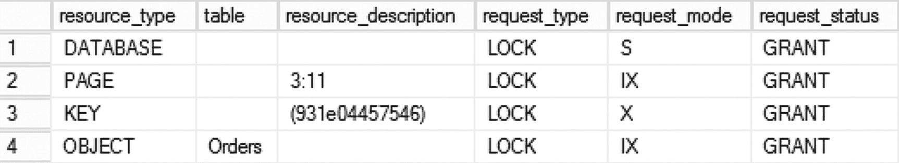
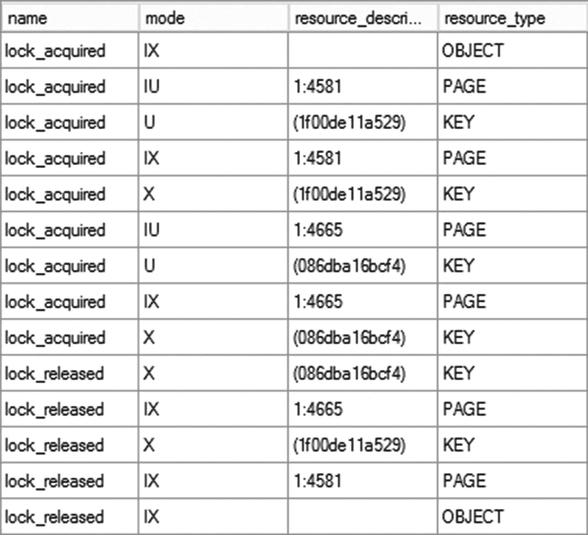
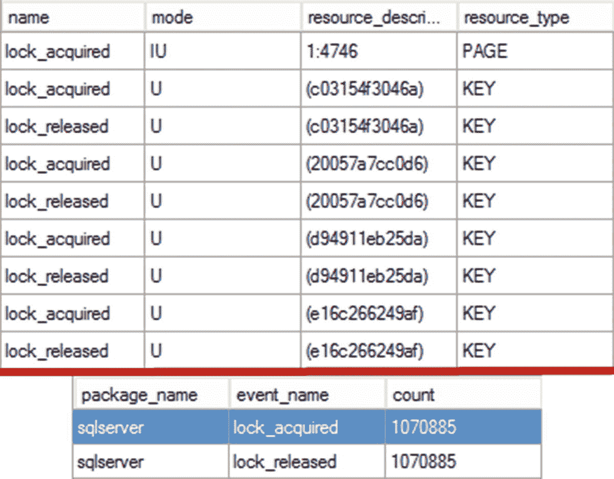
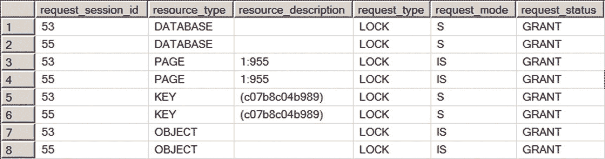
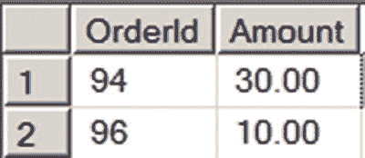
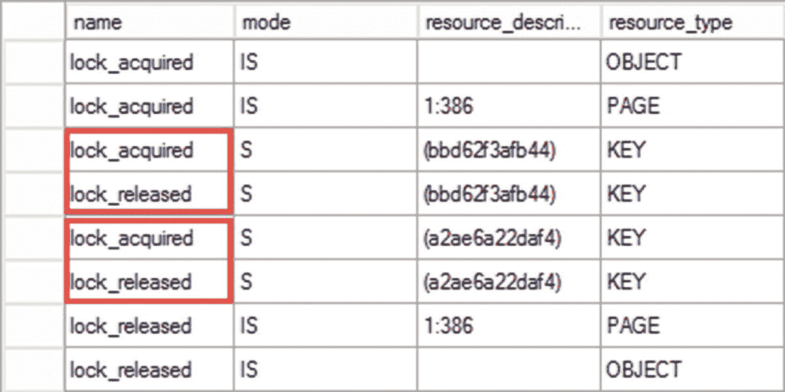
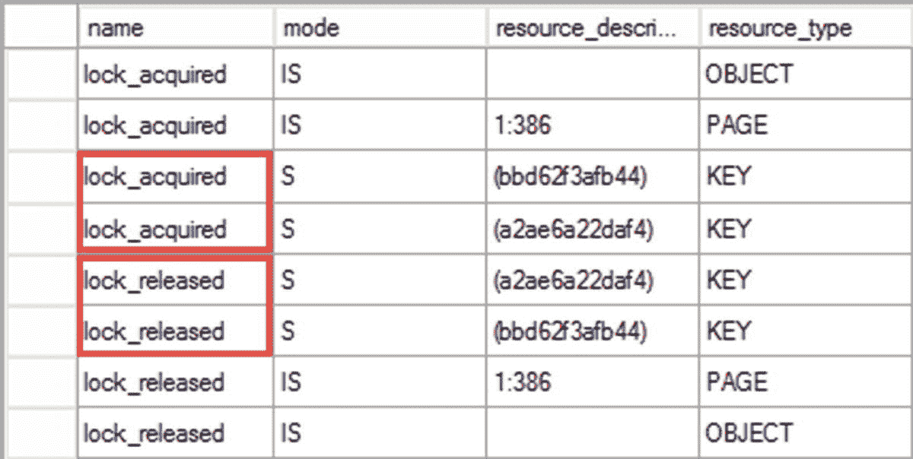
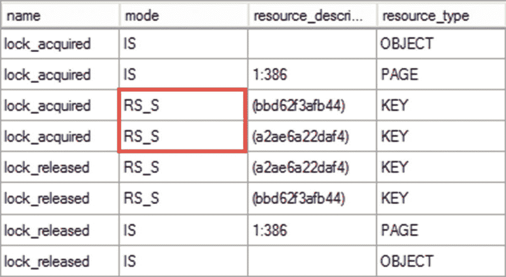
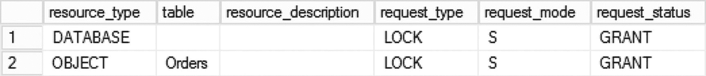
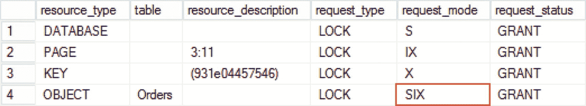

# 3. 锁类型

本章将讨论 SQL Server 并发中的关键概念——*锁*。它将概述 SQL Server 中的主要锁类型，解释它们的兼容性，并最终演示不同的事务隔离级别如何影响系统中锁的生命周期。

## 主要锁类型

SQL Server 使用锁来支持事务的隔离需求。简而言之，每个锁都是一个由名为*锁管理器*的 SQL Server 组件管理的内存中结构。每个锁结构在 SQL Server 的 32 位版本上使用 64 字节内存，在 64 位版本上使用 128 字节内存。

锁在*资源*（如数据行、页、分区、表（对象）、数据库等）上获取和持有。默认情况下，SQL Server 使用行级锁来获取数据行上的锁，这最大限度地减少了系统中可能的并发问题。然而，您应该记住，SQL Server 提供的唯一保证是基于事务隔离级别强制执行数据隔离和一致性。锁定行为未被记录，并且在某些情况下，SQL Server 可以选择在页或表级别而不是行级别锁定。尽管如此，锁兼容性规则始终强制执行，并且理解锁定模型足以解决和处理系统中大多数并发问题。

锁结构中的关键属性是*锁类型*。在内部，SQL Server 使用超过 20 种不同的锁类型。它们可以根据其类型和用途分为几个主要类别。

### 代码示例

本章及后续章节中的代码示例将依赖于此处定义的 `Delivery.Orders` 表。该表在 `OrderId` 列上定义了聚集主键，且未定义任何非聚集索引。

你可以在本书的配套资料中找到创建该表并填充数据的脚本。

```sql
create schema Delivery;
create table Delivery.Orders
(
OrderId int not null identity(1,1),
OrderDate smalldatetime not null,
OrderNum varchar(20) not null,
Reference varchar(64) null,
CustomerId int not null,
PickupAddressId int not null,
DeliveryAddressId int not null,
ServiceId int not null,
RatePlanId int not null,
OrderStatusId int not null,
DriverId int null,
Pieces smallint not null,
Amount smallmoney not null,
ModTime datetime not null
constraint DEF_Orders_ModTime
default getDate(),
PlaceHolder char(100) not null
constraint DEF_Orders_Placeholder
default 'Placeholder',
constraint PK_Orders
primary key clustered(OrderId)
)
go
declare
@MaxOrderId int = 65536
,@MaxCustomers int = 1000
,@MaxAddresses int = 20
,@MaxDrivers int = 125
;with N1(C) as (select 0 union all select 0) -- 2 rows
,N2(C) as (select 0 from N1 as T1 cross join N1 as T2) -- 4 rows
,N3(C) as (select 0 from N2 as T1 cross join N2 as T2) -- 16 rows
,N4(C) as (select 0 from N3 as T1 cross join N3 as T2) -- 256 rows
,N5(C) as (select 0 from N4 as T1 cross join N4 as T2) -- 65,536 rows
,IDs(ID) as (select row_number() over (order by (select null)) from N5)
,Info(OrderId, CustomerId, OrderDateOffset, RatePlanId, ServiceId, Pieces)
as
(
select
ID, ID % @MaxCustomers + 1, ID % (365*24*60)
,ID % 2 + 1, ID % 3 + 1, ID % 5 + 1
from IDs
where ID  5 * 24 * 60
then 4
else OrderId % 4 + 1
end
,(OrderId % 5 + 1) * 10.
from Info
)
insert into Delivery.Orders(OrderDate, OrderNum, CustomerId,
PickupAddressId, DeliveryAddressId, ServiceId, RatePlanId,
OrderStatusId, DriverId, Pieces, Amount)
select
o.OrderDate
,o.OrderNum
,o.CustomerId
,o.PickupAddressId
,case
when o.PickupAddressId % @MaxAddresses = 0
then o.PickupAddressId + 1
else o.PickupAddressId - 1
end
,o.ServiceId
,o.RatePlanId
,o.OrderStatusId
,case
when o.OrderStatusId in (1,4)
then NULL
else OrderId % @MaxDrivers + 1
end
,o.Pieces
,o.Rate
from Info2 o;
```

### 排他锁

排他锁由 `写入者`（即修改数据的 `INSERT`、`UPDATE`、`DELETE` 和 `MERGE` 语句）获取。这些查询会对受影响的行获取排他锁，并持有该锁直到事务结束。

顾名思义——`排他` 意味着 `互斥`——在任何给定时间点，只有一个会话可以持有资源上的排他锁。这种行为强制了系统中最重要的并发规则：多个会话不能同时修改相同的数据。也就是说，在第一个事务完成并释放被修改行上的排他锁之前，其他会话无法获取该行上的排他锁。

事务隔离级别不影响排他锁的行为。即使在 `READ UNCOMMITTED` 模式下，排他锁也会被获取并持有直到事务结束。事务持续时间越长，排他锁持有时间也越长，这将增加发生阻塞的可能性。

### 意向锁

尽管行级锁减少了系统中的阻塞，但仅在行级别保持锁从性能角度来看是不利的。考虑这样一种情况：一个会话需要独占访问一个表，例如在表结构变更期间。如果只存在行级锁，那么该会话就必须扫描整个表，检查是否存在任何行级锁。可以想象，这将是一个极其低效的过程，尤其是在大表上。

SQL Server 通过引入意向锁的概念来解决这种情况。意向锁在数据页和表级别持有，用以指示其子对象上存在锁。

让我们运行清单 3-1 中的代码，检查在更新表中一行后持有哪些锁。该代码使用了 `sys.dm_tran_locks` 动态管理视图，它返回有关系统中当前锁请求的信息。

值得注意的是，我使用了 `READ UNCOMMITTED` 隔离级别来展示排他锁在任何事务隔离级别下都会被获取。

```sql
set transaction isolation level read uncommitted
begin tran
update Delivery.Orders
set Reference = 'New Reference'
where OrderId = 100;
select
l.resource_type
,case
when l.resource_type = 'OBJECT'
then
object_name
(
l.resource_associated_entity_id,
l.resource_database_id
)
else ''
end as [table]
,l.resource_description
,l.request_type
,l.request_mode
,l.request_status
from
sys.dm_tran_locks l
where
l.request_session_id = @@spid;
commit
-- 清单 3-1
-- 更新一行并检查持有的锁
```

图 3-1 展示了 `SELECT` 语句的输出。可以看到，SQL Server 在行（键）上持有排他锁，并在页和对象（表）上持有意向排他锁。`这些意向排他锁指示了存在行级别的排他锁。` 此外，数据库上还有一个共享锁，表明该会话正在访问它。我们将在本章后面介绍共享锁。



**图 3-1**
UPDATE 语句后持有的锁

`resource_description` 列指示了获取这些锁的资源。对于页，它指示了其物理位置（数据库文件 1 中的页 944），对于行（键），它指示了索引键的哈希值。对于对象锁，你可以从视图中的 `resource_associated_entry_id` 列获取 `object_id`。

当会话需要获取对象或页级别的锁时，它可以检查与表或页上持有的其他锁（意向或完全）的锁兼容性，而不是扫描表/页并检查那里的行级锁。

最后，值得注意的是，在某些情况下，SQL Server 可能在其他中间对象上获取意向锁，例如表分区或列存储索引中的行组。


### 更新(U)锁

SQL Server 在数据修改过程中使用另一种锁类型——更新(U)锁，在搜索需要更新的行时获取它们。获取更新(U)锁后，SQL Server 会读取行并通过对照查询谓词检查行数据来评估是否需要更新该行。如果是这种情况，SQL Server 会将更新(U)锁转换为排他(X)锁并执行数据修改。否则，更新(U)锁将被释放。

让我们看一个例子，并运行代码清单 3-2 中的代码。

```
begin tran
update Delivery.Orders
set Reference = 'New Reference'
where OrderId in (1000, 5000);
commit
代码清单 3-2
使用聚集索引键作为谓词更新多行
```

图 3-2 展示了捕获 `lock_acquired` 和 `lock_released` 事件的扩展事件会话的输出。SQL Server 在页上获取了意向更新(IU)锁，在行上获取了更新(U)锁，随后将它们转换为意向排他(IX)锁和排他(X)锁。这些锁一直保持到事务结束，并在 `COMMIT` 时释放。


*图 3-2：更新(U)锁和排他(X)锁*

更新(U)锁的行为取决于执行计划。在某些情况下，SQL Server 首先在所有行上获取更新(U)锁，随后将它们转换为排他(X)锁。在其他情况下——例如，当你基于聚集索引键值仅更新一行时——SQL Server 可以直接获取排他(X)锁，而完全不使用更新(U)锁。

要获取的锁数量也很大程度上取决于执行计划。让我们运行 `UPDATE Delivery.Orders SET Reference = 'Ref' WHERE OrderNum="1000"` 语句，基于 `OrderNum` 列过滤数据。图 3-3 展示了获取和释放的锁以及处理的锁总数。


*图 3-3：查询执行期间的锁*

`OrderNum` 列上没有索引，因此 SQL Server 需要执行*聚集索引扫描*，在表中的每一行上获取更新(U)锁。尽管该语句只更新了一行，却获取了超过一百万个锁。

这种行为说明了一个典型的阻塞场景。假设其中一个会话在单个行上持有一个排他(X)锁。如果另一个会话通过运行未优化的 `UPDATE` 语句来更新不同的行，SQL Server 将在其扫描的每一行上获取一个更新(U)锁，并最终在尝试读取持有排他(X)锁的行时被阻塞。即使第二个会话最终并不需要更新该行——SQL Server 仍然需要获取一个更新(U)锁来评估该行是否需要更新。

### 共享(S)锁

共享(S)锁由系统中的读取者——`SELECT` 查询——获取。顾名思义，共享(S)锁彼此兼容，多个会话可以在同一资源上持有共享(S)锁。

让我们运行表 3-1 中的代码来说明这一点。

*表 3-1：共享(S)锁*

| 会话 1 (SPID=53) | 会话 2 (SPID=55) |
| --- | --- |
| `set transaction isolation level repeatable read`<br>`begin tran`<br>`select OrderNum`<br>`from Delivery.Orders`<br>`where OrderId = 500;` | `set transaction isolation level repeatable read`<br>`begin tran`<br>`select OrderNum`<br>`from Delivery.Orders`<br>`where OrderId = 500;` |
| `select`<br>`request_session_id`<br>`,resource_type`<br>`,resource_description`<br>`,request_type`<br>`,request_mode`<br>`,request_status`<br>`from sys.dm_tran_locks;` |  |
| `commit;` | `commit` |

图 3-4 展示了 `sys.dm_tran_locks` 视图的输出。如你所见，两个会话都在数据库上获取了共享(S)锁，在表和页(1:955)上获取了意向共享(IS)锁，并在行上获取了共享(S)锁，所有这些都没有相互阻塞。


*图 3-4：会话获取的锁*

## 锁兼容性、行为和生命周期

表 3-2 显示了锁兼容性矩阵，展示了锁类型之间的兼容性。

*表 3-2：锁兼容性矩阵 (IS, S, U, X 锁)*

| | (IS) | (S) | (IU) | (U) | (IX) | (X) |
| --- | --- | --- | --- | --- | --- | --- |
| (IS) | 是 | 是 | 是 | 是 | 是 | 否 |
| (S) | 是 | 是 | 是 | 是 | 否 | 否 |
| (IU) | 是 | 是 | 是 | 否 | 是 | 否 |
| (U) | 是 | 是 | 否 | 否 | 否 | 否 |
| (IX) | 是 | 否 | 是 | 否 | 是 | 否 |
| (X) | 否 | 否 | 否 | 否 | 否 | 否 |

最重要的锁兼容性规则是：

1.  意向(IS/IU/IX)锁彼此兼容。意向锁表示在子对象上存在锁，多个会话可以同时在对象和页级别持有意向锁。
2.  排他(X)锁彼此不兼容，也与任何其他锁类型不兼容。多个会话不能同时更新同一行。此外，获取共享(S)锁的读取者无法读取持有排他(X)锁的未提交行。
3.  更新(U)锁彼此不兼容，也与排他(X)锁不兼容。写入者不能同时评估行是否需要更新，也不能访问持有排他(X)锁的行。
4.  更新(U)锁与共享(S)锁兼容。写入者可以评估行是否需要更新，而不会被读取者阻塞或阻塞读取者。值得注意的是，(S)/(U) 锁兼容性是 SQL Server 在内部使用更新(U)锁的主要原因。它们减少了读取者和写入者之间的阻塞。

正如你已经知道的，排他(X)锁的行为不依赖于事务隔离级别。写入者总是获取排他(X)锁并将其保持到事务结束。除了 `SNAPSHOT` 隔离级别外，更新(U)锁也是如此——写入者在扫描每一行时都会获取更新(U)锁，同时评估这些行是否需要更新。

另一方面，共享(S)锁的行为取决于事务隔离级别。


### SQL Server 中的事务隔离级别与锁

SQL Server 始终在事务上下文中处理数据。在这种情况下，当应用程序未使用 `BEGIN TRAN` / `COMMIT` 语句启动显式事务时，SQL Server 会为语句的持续时间使用自动提交事务。即使是 `SELECT` 语句也在其自己的轻量级事务中运行。SQL Server 不会将它们写入事务日志，尽管所有锁定和并发规则仍然适用。

#### READ UNCOMMITTED 隔离级别

使用 `READ UNCOMMITTED` 隔离级别时，不会获取共享（S）锁。因此，读取器可以读取其他会话已修改并持有排他（X）锁的行。此隔离级别通过消除读取器和写入器之间的冲突来减少系统中的阻塞，代价是数据一致性。无论接下来发生什么（例如更改被回滚或一行被多次修改），读取器都会读取行的当前（已修改）版本。这解释了为什么此隔离级别通常被称为 `脏读`。

表 3-3 中的代码说明了这一点。第一个会话运行 `DELETE` 语句，在行上获取排他（X）锁。第二个会话在 `READ UNCOMMITTED` 模式下运行 `SELECT` 语句。

**表 3-3：READ UNCOMMITTED 隔离级别一致性**

| 会话 1 | 会话 2 |
| --- | --- |
| `begin tran`       `delete from Delivery.Orders`       `where OrderId = 95;` |   |
|   | `-- 成功 / 无阻塞``set transaction isolation level read uncommitted;``select OrderId, Amount``from Delivery.Orders``where OrderId between 94 and 96;` |
| `rollback;` |   |

在 `READ UNCOMMITTED` 隔离级别中，读取器不获取共享（S）锁。会话 2 不会被阻塞，并将返回如图 3-5 所示的结果集。它不包含 `OrderId=95` 的行，该行在第一个会话的未提交事务中已被删除，即使该事务随后被回滚。



**图 3-5：READ UNCOMMITTED 和共享（S）锁行为**

值得再次注意的是，排他（X）锁和更新（U）锁的行为不受事务隔离级别影响。即使在 `READ UNCOMMITTED` 模式下，你仍然会遇到写入器/写入器阻塞。

#### READ COMMITTED 隔离级别

在 `READ COMMITTED` 隔离级别中，SQL Server 在读取行后立即获取并释放共享（S）锁。这保证了事务无法读取其他会话的未提交数据。让我们运行清单 3-3 中的代码。

```sql
set transaction isolation level read committed;
select OrderId, Amount
from Delivery.Orders
where OrderId in (90,91);
-- 清单 3-3：在 READ COMMITTED 隔离级别中读取数据
```

图 3-6 说明了 SQL Server 如何获取和释放锁。如你所见，行级锁被获取并立即释放。



**图 3-6：READ COMMITTED 模式下的共享（S）锁行为**

值得注意的是，在某些情况下，在 `READ COMMITTED` 模式下，SQL Server 可能在 `SELECT` 语句的持续时间内持有共享（S）锁，仅在完成后才释放锁。一个这样的例子是从表中读取 LOB 列数据的查询。

#### 提示

不要在代码中选择不必要的列或使用 `SELECT *` 模式。这可能会引入性能开销并增加系统中的锁定。

#### REPEATABLE READ 隔离级别

在 `REPEATABLE READ` 隔离级别中，SQL Server 获取共享（S）锁并一直持有到事务结束。这保证了其他会话在数据被读取后无法修改它。你可以通过运行清单 3-3 的代码（将隔离级别更改为 `REPEATABLE READ`）来查看此行为。

图 3-7 说明了 SQL Server 如何获取和释放锁。如你所见，SQL Server 首先获取两个共享（S）锁，并在事务结束时释放它们。



**图 3-7：REPEATABLE READ 模式下的共享（S）锁行为**

#### SERIALIZABLE 隔离级别

在 `SERIALIZABLE` 隔离级别中，共享（S）锁也会一直持有到事务结束。但是，SQL Server 使用另一种称为 `范围锁` 的锁变体。范围锁（共享和排他）保护索引键范围，而不是单个行。

考虑一个 `Delivery.Orders` 表只有两行，`OrderId` 分别为 1 和 10 的情况。在 `REPEATABLE READ` 隔离级别中，`SELECT` 语句将获取两个行级锁。其他会话将无法修改这些行，但仍然可以插入 `OrderId` 值介于两者之间的新行。在 `SERIALIZABLE` 隔离级别中，`SELECT` 语句将获取一个范围共享（RangeS-S）锁，阻止其他会话在 `OrderId` 1 到 10 之间插入任何行。

图 3-8 说明了 SQL Server 在 `SERIALIZABLE` 隔离级别中如何获取和释放锁。



**图 3-8：SERIALIZABLE 隔离级别下的共享（S）锁行为**

#### 乐观隔离级别

乐观隔离级别——`READ COMMITTED SNAPSHOT` 和 `SNAPSHOT`——不获取共享（S）锁。当读取器（`SELECT` 查询）遇到一个持有排他（X）锁的行时，它们从 `tempdb` 中的版本存储读取该行的旧（先前提交的）版本。写入器和未提交的数据修改不会在系统中阻塞读取器。

从阻塞和并发的角度来看，`READ COMMITTED SNAPSHOT` 与 `READ UNCOMMITTED` 具有相同的行为。这两个隔离级别都消除了系统中读取器/写入器阻塞的问题。然而，`READ COMMITTED SNAPSHOT` 通过消除对未提交数据的访问和脏读，提供了更好的数据一致性。在绝大多数情况下，你不应该使用 `READ UNCOMMITTED`，而应改用 `READ COMMITTED SNAPSHOT`。

#### 注意

我们将在第 6 章中更深入地讨论乐观隔离级别。

表 3-4 总结了 SQL Server 如何根据事务隔离级别处理共享（S）锁。

**表 3-4：事务隔离级别和共享（S）锁行为**

| 事务隔离级别 | 表提示 | 共享锁行为 |
| --- | --- | --- |
| `READ UNCOMMITTED` | `(NOLOCK)` | 不获取 (S) 锁 |
| `READ COMMITTED` (默认) | `(READCOMMITTED)` | 获取 (S) 锁并立即释放 |
| `REPEATABLE READ` | `(REPEATABLEREAD)` | 获取 (S) 锁并持有到事务结束 |
| `SERIALIZABLE` | `(SERIALIZABLE)` 或 `(HOLDLOCK)` | 获取范围锁并持有到事务结束 |
| `READ COMMITTED SNAPSHOT` | `N/A` | 不获取 (S) 锁 |
| `SNAPSHOT` | `N/A` | 不获取 (S) 锁 |

你可以使用 `SET TRANSACTION ISOLATION LEVEL` 语句在事务级别控制隔离级别和锁定行为，或者使用表锁定提示在表级别进行控制。

可以在同一个查询中针对不同的表使用不同的隔离级别，如清单 3-4 所示。

```sql
select c.CustomerName, sum(o.Total) as [Total]
from
dbo.Customers c with (READCOMMITTED) join
dbo.Orders o with (SERIALIZABLE) on
o.CustomerId = c.CustomerId
group by
c.CustomerName;
-- 清单 3-4：使用表提示控制锁定行为
```


## 注意事项

著名的 `NOLOCK` 提示只是 `READ UNCOMMITTED` 表访问方式的同义词。

最后，我想重申一点：除了 `SNAPSHOT` 以外，所有事务隔离级别行为方式相同，都会在更新扫描期间使用更新 (`U`) 锁，并在数据修改期间使用排他 (`X`) 锁。这会导致系统中出现写入器/写入器阻塞。

`SNAPSHOT` 隔离级别在数据修改期间同样使用排他 (`X`) 锁。然而，它在更新扫描期间不使用更新 (`U`) 锁，而是从 `tempdb` 中的版本存储区读取行的旧版本。除非多个会话同时尝试更新相同的行，否则这消除了写入器/写入器阻塞。

### 事务隔离级别与数据一致性

正如前一章已经提到的，我们可能会在系统中遇到几种并发现象。现在，让我们基于事务隔离级别的锁行为，来分析为什么这些现象是可能发生的。

*   **脏读**：当一个事务从其他未提交的事务中读取到未提交的（脏）数据时，就会出现此问题。尚不清楚这些活动事务是会提交还是回滚，或者数据在逻辑上是否一致。
    从锁的角度看，在 `READ UNCOMMITTED` 隔离级别中，当会话不获取共享 (`S`) 锁并忽略其他会话的排他 (`X`) 锁时，就可能发生此现象。所有其他隔离级别都能避免脏读。悲观隔离级别使用共享 (`S`) 锁，当尝试访问持有排他 (`X`) 锁的未提交行时会被阻塞。而乐观隔离级别则从版本存储区读取行的旧的（先前提交的）版本。

*   **不可重复读**：在同一个事务中，后续尝试读取相同的数据返回不同的结果。当其他事务在读取之间修改甚至删除数据时，就会出现这种数据不一致问题。设想一个情况：您正在生成一份报告，显示特定客户的订单列表以及一些汇总信息（例如，客户每月消费总额）。如果另一个会话在这些查询之间修改或删除了订单，结果集就会不一致。
    从锁的角度来看，当会话在读取之间不保护/锁定数据时，就可能发生这种现象。在 `READ UNCOMMITTED` 和 `READ COMMITTED SNAPSHOT` 隔离级别中（它们不使用共享 (`S`) 锁）以及在 `READ COMMITTED` 隔离级别中（当会话立即获取并释放共享 (`S`) 锁时），都可能发生这种情况。`REPEATABLE READ` 和 `SERIALIZABLE` 隔离级别会持有共享 (`S)` 锁直到事务结束，这可以防止数据在被读取后遭到修改。
    `SNAPSHOT` 隔离级别也能避免此现象，因为它处理的是事务开始时数据的快照。我们将在第 6 章深入讨论它。

*   **幻读**：此现象发生在同一个事务中的后续读取返回新行（即该事务之前未读取过的行）时。回想一下前面的例子，如果在查询执行期间，另一个会话插入了一个新订单。只有 `SERIALIZABLE` 和 `SNAPSHOT` 隔离级别能避免此现象。`SERIALIZABLE` 使用范围锁，而 `SNAPSHOT` 访问事务开始时数据的快照。

另外两种现象与因索引键值更改导致的数据移动有关。这两种现象都不会在乐观隔离级别中发生。

*   **重复读**：当一个查询多次返回相同的行时，就会出现此问题。考虑一个查询，它返回特定时间间隔内的订单列表，在执行期间扫描 `OrderDate` 列上的索引。如果另一个查询更改了 `OrderDate` 值，将行从已处理（扫描过）的索引部分移动到未处理部分，那么该行将被读取两次。
    这种情况类似于不可重复读，当读取器在 `READ UNCOMMITTED` 和 `READ COMMITTED` 隔离级别中读取行后不持有共享 (`S`) 锁时，就可能发生。

*   **跳过的行**：当查询没有返回某些行时，就会发生此现象。在类似重复读描述的条件下，如果行从索引的未处理部分移动到已处理部分，就可能发生这种情况。`SERIALIZABLE` 隔离级别（锁定索引键范围区间）以及乐观隔离级别——`READ COMMITTED SNAPSHOT` 和 `SNAPSHOT`——都能避免此现象。

表 3-5 总结了不同事务隔离级别下的数据不一致问题。

表 3-5：事务隔离级别与数据不一致异常

| | 脏读 | 不可重复读 | 重复读 | 幻读 | 跳过的行 |
| :--- | :--- | :--- | :--- | :--- | :--- |
| `READ UNCOMMITTED` | 是 | 是 | 是 | 是 | 是 |
| `READ COMMITTED` | 否 | 是 | 是 | 是 | 是 |
| `REPEATABLE READ` | 否 | 否 | 否 | 是 | 是 |
| `SERIALIZABLE` | 否 | 否 | 否 | 否 | 否 |
| `READ COMMITTED SNAPSHOT` | 否 | 是 | 否 | 是 | 否 |
| `SNAPSHOT` | 否 | 否 | 否 | 否 | 否 |

`SERIALIZABLE` 和 `SNAPSHOT` 是唯一能保护您免受数据不一致问题影响的事务隔离级别。然而，两者都有缺点。`SERIALIZABLE` 在数据易变的系统中可能因过度加锁而引入严重的阻塞问题和死锁。另一方面，`SNAPSHOT` 可能导致显著的 `tempdb` 负载以及写入/写入冲突错误。请谨慎使用它们！

### 与锁相关的表提示

除了我们已经介绍的隔离级别相关提示外，还有其他几个与锁相关的表提示。

您可以使用 `(UPDLOCK)` 和 `(XLOCK)` 表提示来控制读取器获取的锁类型。这些提示强制 `SELECT` 查询分别使用更新 (`U`) 锁和排他 (`X`) 锁，而不是共享 (`S`) 锁。当您需要防止多个 `SELECT` 查询同时读取相同的行时，这会非常有用。

清单 3-5 展示了一个这样的例子，在系统中实现自定义计数器。`SELECT` 语句使用了更新 (`U`) 锁，这将阻止其他会话读取相同的计数器行，直到事务提交。


#### 注意

此代码仅用于演示目的，并未处理计数器表中不存在特定计数器的情况。最好使用 `SEQUENCE` 对象代替。

```sql
begin tran
select @Value = Value
from dbo.Counters with (UPDLOCK)
where CounterName = @CounterName;
update dbo.Counters
set Value += @ReserveCount
where CounterName = @CounterName;
commit
```
**代码清单 3-5: 计数器表管理**

有几种锁提示可以帮助你控制锁的粒度。`(TABLOCK)` 和 `(TABLOCKX)` 提示强制 SQL Server 获取共享（S）或排他（X）表级锁。使用 `(TABLOCK)` 提示时，锁的类型取决于语句——读取器获取共享（S）锁，写入器获取排他（X）锁。而 `(TABLOCKX)` 提示则始终在表上获取排他（X）锁，即使对于读取器也是如此。

正如我已经提到的，SQL Server 在某些情况下可能会决定使用更低粒度的锁。例如，在扫描过程中，SQL Server 可能决定使用完整的（非意向）页锁，而不是在页的每一行上都获取行级锁。然而，这种行为并不保证，但可以在一定程度上通过 `(PAGLOCK)` 和 `(ROWLOCK)` 提示来控制。

`(PAGLOCK)` 提示强制 SQL Server 在页级别而非行级别使用完整锁。或者，`(ROWLOCK)` 提示阻止 SQL Server 使用完整的页级锁，强制其使用行级锁。和往常一样，这两种方法都有利弊，在绝大多数情况下，最好允许 SQL Server 选择合适的锁定策略，而不是使用这些提示。

`(READPAST)` 提示允许会话跳过那些被其他会话持有不兼容锁的行，而不是被阻塞。你将在第 10 章看到一个此类提示有用的示例。或者，`(NOWAIT)` 提示会在 SQL Server 遇到其他会话持有的不兼容行或页级锁时立即触发错误。

只要多个锁提示彼此不冲突，你就可以将它们组合在一起。代码清单 3-6 展示了这样一个例子。第一个 `SELECT` 语句将使用页级排他（X）锁。第二个 `SELECT` 语句将使用行级锁，并且由于 `(REPEATABLEREAD)` 提示，共享（S）锁会一直保持到事务结束，同时它会跳过持有不兼容锁类型的行。最后，第三个语句将由于锁提示组合冲突而失败。

```sql
select OrderId, OrderDate
from Delivery.Orders with (PAGLOCK XLOCK)
where CustomerId = @CustomerId;
select OrderId, OrderDate
from Delivery.Orders with (ROWLOCK REPEATABLEREAD READPAST)
where CustomerId = @CustomerId;
select OrderId, OrderDate
from Delivery.Orders with (NOLOCK TABLOCK)
where CustomerId = @CustomerId;
```
**代码清单 3-6: 组合锁提示**

#### 注意

有关表提示的更多信息，请访问 [`https://docs.microsoft.com/en-us/sql/t-sql/queries/hints-transact-sql-table`](https://docs.microsoft.com/en-us/sql/t-sql/queries/hints-transact-sql-table)。

最后是 `SET LOCK_TIMEOUT` 选项，它可以在会话级别使用，以控制会话应等待锁请求被授予的时间。如果请求无法在指定的间隔内被授予，SQL Server 会生成一个错误。值为 -1 表示无超时，值为 0 表示立即超时，类似于 `(NOWAIT)` 提示。

SQL Server 处理锁超时错误的方式与系统中其他错误类似。除非你将 `XACT_ABORT` 选项设置为 `ON`，否则该错误不会终止批处理，也不会使显式事务变为不可提交。正如我们在上一章讨论的那样，你需要将此行为纳入错误处理策略中。

另外，请记住 `SET LOCK_TIMEOUT` 不会覆盖 SQL 客户端的 `CommandTimeout` 值。当语句执行时间超过 `CommandTimeout` 时，无论等待的根本原因是什么，客户端调用都会失败。


## 转换锁

`转换锁`是你在生产环境中可能遇到的另一组锁类型。它们是完全锁和意向锁的组合，可以在页和对象级别获取。当 SQL Server 需要*扩展*已获取的完全锁（附加一个意向锁），或者用另一种不同类型的完全锁来扩展已获取的意向锁时，就会使用它们。你可以将它们视为一种内部优化，使得会话能够避免在同一个资源上持有多个锁。

让我们看一个例子，并运行代码清单 3-7 中的代码。第一步，我们将在活动事务中使用 `(REPEATABLEREAD TABLOCK)` 提示运行一个 `SELECT` 语句。这些提示将强制该语句获取对象级锁并在事务持续期间持有它。

```
begin tran
select top 10 OrderId, Amount
from Delivery.Orders with (REPEATABLEREAD TABLOCK)
order by OrderId;
select
l.resource_type
,case
when l.resource_type = 'OBJECT'
then
object_name
(
l.resource_associated_entity_id
,l.resource_database_id
)
else ''
end as [table]
,l.resource_description
,l.request_type
,l.request_mode
,l.request_status
from
sys.dm_tran_locks l
where
l.request_session_id = @@spid;
代码清单 3-7
转换锁：运行 SELECT 语句
```

图 3-9 说明了该语句获取的锁。你可以看到对象级别的共享 (S) 锁已就位。



图 3-9：转换锁：由 SELECT 语句持有的锁

现在，让我们在同一个活动事务中运行另一个更新其中一行的查询，如代码清单 3-8 所示。

```
update Delivery.Orders
set Amount *= 0.95
where OrderId = 100;
代码清单 3-8
转换锁：运行 UPDATE 语句
```

此操作要求 SQL Server 在行上获取排他 (X) 锁，并在页和对象级别获取意向排他 (IX) 锁。然而，该表已经持有一个完全共享 (S) 锁，SQL Server 将其替换为 `共享意向排他 (SIX)` 锁，如图 3-10 所示。



图 3-10：转换锁：UPDATE 语句之后持有的锁

除了 `SIX` 之外，还有另外两种转换锁：

*   `共享意向更新 (SIU)` 锁在更新扫描期间获取，此时 SQL Server 需要在已持有共享 (S) 锁的同一资源上获取意向更新 (IU) 锁。
*   `更新意向排他 (UIX)` 锁可能在 SQL Server 需要在已持有更新 (U) 锁的资源上获取意向排他 (IX) 锁时获取。此锁类型通常在更新扫描期间用于数据页，此时 SQL Server 使用页级而不是行级锁定。在此模式下，SQL Server 首先获取页级更新 (U) 锁，如果该页上的某些行需要更新，则将其更改为更新意向排他 (UIX) 锁。值得注意的是，SQL Server 之后不会将页级 (UIX) 锁替换为意向排他 (IX) 锁，而是会保持 (UIX) 锁直到事务结束。

简而言之，转换锁由两种不同的锁类型组成。其他锁需要与两者都兼容才能被授予。例如，意向共享 (IS) 锁与共享意向排他 (SIX) 锁兼容，因为 (IS) 锁与 (S) 和 (IX) 锁都兼容。另一方面，意向排他 (IX) 锁由于与 (S) 锁不兼容，因此与 (SIX) 锁不兼容。

#### 注意

本章中的表 3-2 展示了常规锁的锁兼容性矩阵。

## 总结

SQL Server 使用锁来支持数据隔离和一致性规则，并使用行级锁作为最高的粒度级别。

排他 (X) 锁在修改数据时由写入者获取。无论隔离级别如何，排他 (X) 锁总是被获取并持有到事务结束。更新 (U) 锁在写入者评估是否需要修改数据时获取。如果数据需要更新，这些锁将转换为排他 (X) 锁，否则将被释放。意向 (I*) 锁在对象和页级别获取，表示存在相同类型的子行级锁。

除了 `READ UNCOMMITED` 隔离级别外，SQL Server 在悲观隔离级别下读取数据时会获取共享 (S) 锁。事务隔离级别控制何时释放共享 (S) 锁。在 `READ COMMITTED` 隔离级别中，这些锁在行被读取后立即释放。在 `REPEATABLE READ` 和 `SERIALIZABLE` 隔离级别中，共享 (S) 锁将持有到事务结束。此外，在 `SERIALIZABLE` 隔离级别中，SQL Server 使用范围锁来锁定索引键的范围，而不是锁定单个行。

乐观隔离级别依赖于行版本控制，并从 `tempdb` 中的版本存储区读取行的旧（先前提交的）版本。`READ COMMMITTED SNAPSHOT` 具有与 `READ UNCOMMITTED` 相同的阻塞行为；然而，它通过防止访问未提交的脏数据提供了更好的数据一致性。你应该使用 `READ COMMITTED SNAPSHOT` 而不是 `READ UNCOMMITTED`。

你可以使用 `SET TRANSACTION ISOLATION LEVEL` 语句在事务级别控制事务隔离级别，或者在单个查询中使用表锁定提示在表级别控制。

