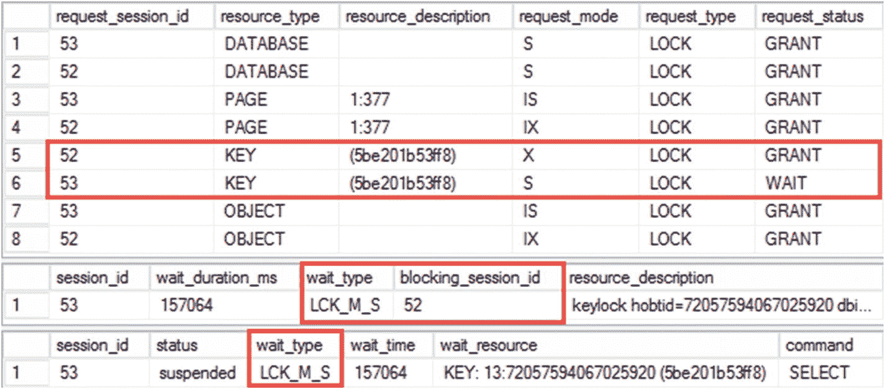
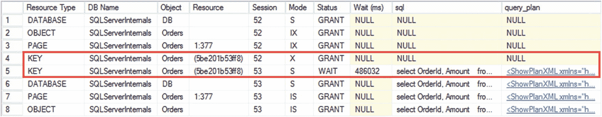
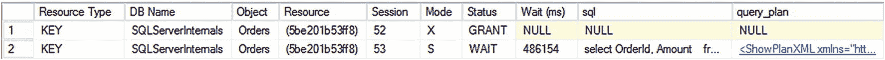
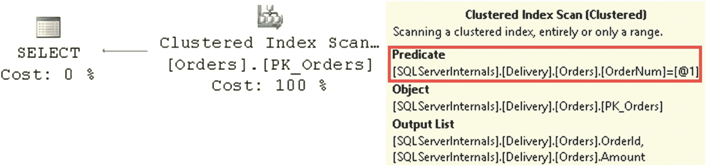
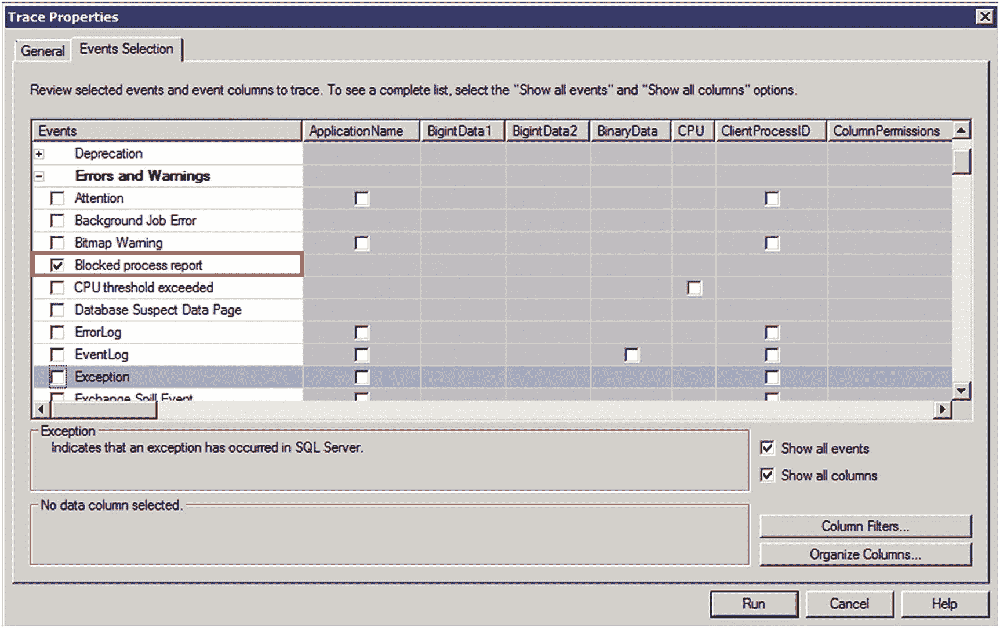
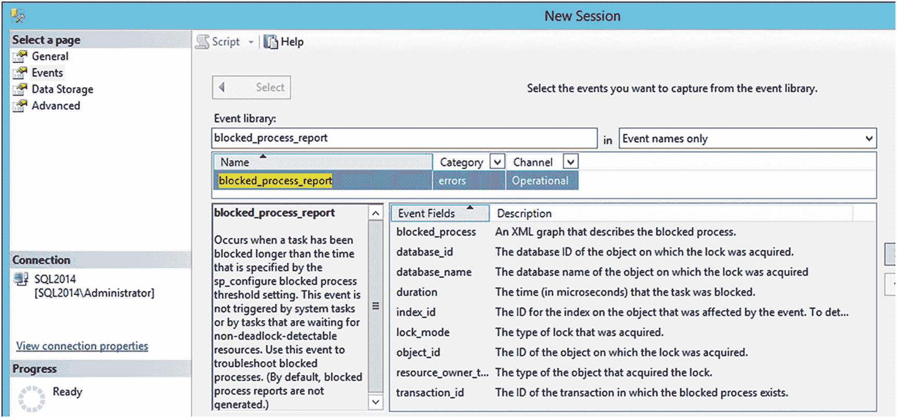
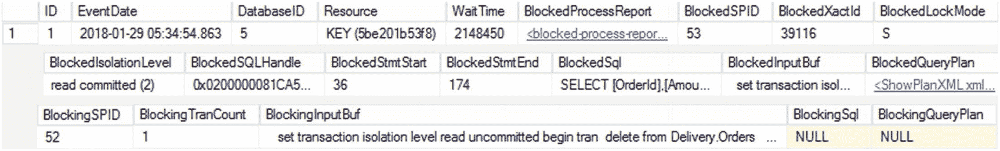

# 4. 系统中的阻塞

阻塞可能是系统中遇到的最常见的并发问题之一。当阻塞发生时，多个查询相互阻塞，这增加了查询的执行时间并导致超时。所有这些都会对用户体验系统产生负面影响。

本章将展示如何对系统中的阻塞问题进行故障排除。它将说明如何实时分析阻塞情况并收集信息以供进一步分析。


## 通用的故障排查方法

当多个会话争用同一资源时，就会发生阻塞。在某些情况下，这是正确且预期的行为；例如，多个会话无法同时更新同一行。然而，在许多情况下，阻塞是意外发生的，这是因为查询试图获取不必要的锁。

系统中总是存在一定程度的阻塞，这完全正常。然而，不正常的是过度的阻塞。从最终用户的角度来看，过度阻塞会表现为一般的性能问题。系统运行缓慢、查询超时，并且经常出现死锁。

除了死锁，系统缓慢并不一定是阻塞问题的迹象——许多其他因素都可能对性能产生负面影响。但是，阻塞问题确实可能导致系统整体变慢。

在性能故障排查的初始阶段，你应该从系统的全局视角出发，找出需要解决的最关键问题。正如你可能猜到的那样，阻塞和并发问题可能在这个列表中，也可能不在。我们将在第 12 章讨论如何进行这种全局分析，而本章将重点讨论通用的阻塞故障排查。

简而言之，要排查阻塞问题，必须遵循以下步骤：
1.  检测涉及阻塞的查询。
2.  找出阻塞发生的原因。
3.  修复问题的根本原因。

SQL Server 提供了几个可以帮助你完成这些任务的工具。这些工具可以分为两个不同的类别。第一类由动态管理视图组成，你可以使用它们来排查系统当前正在发生的情况。当你在阻塞发生时能够访问系统并希望进行实时故障排查时，这些工具非常有用。

第二类工具允许你收集有关系统中阻塞问题的信息，并将其保留以供进一步分析。让我们详细看看这两类工具。

## 实时排查阻塞问题

用于实时阻塞排查的关键工具是 `sys.dm_tran_locks` 动态管理视图，它提供有关系统中当前活动锁请求的信息。它会返回一个锁请求列表及其类型、请求状态（`GRANT` 或 `WAIT`）、有关请求锁的资源的信息以及其他几个有用的属性。

表 4-1 展示了导致阻塞情况的代码。

表 4-1
导致阻塞情况的代码

| 会话 1 (SPID=52) | 会话 2 (SPID=53) | 注释 |
| --- | --- | --- |
| `begin tran`        `delete from Delivery.Orders`        `where OrderId = 95` |   | 会话 1 在 OrderId=95 的行上获取了排他 (X) 锁 |
|   | `select OrderId, Amount``from Delivery.Orders``with (readcommitted)``where OrderNum = '1000'` | 会话 2 被阻塞，试图在 OrderId=95 的行上获取共享 (S) 锁 |
| `rollback` |   |   |

图 4-1 显示了阻塞发生时，`sys.dm_tran_locks`、`sys.dm_os_waiting_tasks` 和 `sys.dm_exec_requests` 视图的部分输出。如你所见，会话 53 正在等待对由会话 52 持有排他 (X) 锁的行获取共享 (S) 锁。输出中的 `LCK_M_S` 等待类型表示共享 (S) 锁等待。我们将在第 12 章更详细地讨论等待类型。


图 4-1
阻塞发生时系统视图的输出

#### 注意

在你的系统中运行此代码时，可能会出现页级阻塞。会话 53 需要扫描页面上的所有行，而 SQL Server 可能决定获取页级共享 (S) 锁，而不是行级锁。尽管如此，由于页级的 (S) / (IX) 锁不兼容，该会话仍会被阻塞。

`sys.dm_tran_locks` 视图提供的信息对于故障排查来说有点过于晦涩，你通常需要将其与其他动态管理视图（如 `sys.dm_exec_requests` 和 `sys.dm_os_waiting_tasks`）进行连接，以获得更清晰的图景。代码清单 4-1 提供了所需的代码。

```
select
tl.resource_type as [Resource Type]
,db_name(tl.resource_database_id) as [DB Name]
,case tl.resource_type
when 'OBJECT' then
object_name
(
tl.resource_associated_entity_id
,tl.resource_database_id
)
when 'DATABASE' then 'DB'
else
case when tl.resource_database_id = db_id()
then
(  select object_name(object_id, tl.resource_database_id)
from sys.partitions
where hobt_id = tl.resource_associated_entity_id )
else '(Run under DB context)'
end
end as [Object]
,tl.resource_description as [Resource]
,tl.request_session_id as [Session]
,tl.request_mode as [Mode]
,tl.request_status as [Status]
,wt.wait_duration_ms as [Wait (ms)]
,qi.sql
,qi.query_plan
from
sys.dm_tran_locks tl with (nolock) left outer join
sys.dm_os_waiting_tasks wt with (nolock) on
tl.lock_owner_address = wt.resource_address and
tl.request_status = 'WAIT'
outer apply
(
select
substring(s.text, (er.statement_start_offset / 2) + 1,
((  case er.statement_end_offset
when -1
then datalength(s.text)
else er.statement_end_offset
end - er.statement_start_offset) / 2) + 1) as sql
, qp.query_plan
from
sys.dm_exec_requests er with (nolock)
cross apply sys.dm_exec_sql_text(er.sql_handle) s
cross apply sys.dm_exec_query_plan(er.plan_handle) qp
where
tl.request_session_id = er.session_id
) qi
where
tl.request_session_id  @@spid
order by
tl.request_session_id
option (recompile)
代码清单 4-1
获取有关被阻塞和阻塞会话的更多信息
```

图 4-2 显示了该查询的结果。如你所见，它更容易理解，并为你提供了更多有用的信息，包括当前正在运行的批处理及其执行计划。请记住，从 `sys.dm_exec_requests` 和 `sys.dm_exec_query_stats` DMV 获取的执行计划不包含实际的执行统计指标，例如操作符实际返回的行数及其执行次数。此外，对于锁请求已被授予的会话，SQL 语句和查询计划表示的是 *当前正在执行的批处理*（如果会话处于休眠状态则为 `NULL`），而不是获取原始锁的批处理。


图 4-2
将 sys.dm_os_tran_locks 与其他 DMV 连接

你需要在涉及阻塞的数据库上下文中运行查询，才能正确解析对象名称。同样重要的是，代码中使用的 `OBJECT_NAME()` 函数会对对象获取架构稳定性 (Sch-S) 锁，如果你尝试解析的对象持有活动的架构修改 (Sch-M) 锁，则该语句将被阻塞。SQL Server 在架构更改期间会获取这些锁；我们将在第 8 章深入讨论它们。


`sys.dm_tran_locks` 视图为系统中的每个活动锁请求返回一行，当在繁忙的服务器上运行时，可能导致结果集非常庞大。你可以通过基于 `resource_description` 和 `resource_associated_entity_id` 列对此视图进行自联接来减少信息量，并识别竞争相同资源的会话，如代码清单 4-2 所示。这种方法允许你筛选结果，仅查看涉及活动阻塞条件的会话。

```sql
select
tl1.resource_type as [Resource Type]
,db_name(tl1.resource_database_id) as [DB Name]
,case tl1.resource_type
when 'OBJECT' then
object_name
(
tl1.resource_associated_entity_id
,tl1.resource_database_id
)
when 'DATABASE' then 'DB'
else
case when tl1.resource_database_id = db_id()
then
(
select
object_name(object_id, tl1.resource_database_id)
from sys.partitions
where hobt_id = tl1.resource_associated_entity_id
)
else '(Run under DB context)'
end
end as [Object]
,tl1.resource_description as [Resource]
,tl1.request_session_id as [Session]
,tl1.request_mode as [Mode]
,tl1.request_status as [Status]
,wt.wait_duration_ms as [Wait (ms)]
,qi.sql
,qi.query_plan
from
sys.dm_tran_locks tl1 with (nolock) join
sys.dm_tran_locks tl2 with (nolock) on
tl1.resource_associated_entity_id = tl2.resource_associated_entity_id
left outer join sys.dm_os_waiting_tasks wt with (nolock) on
tl1.lock_owner_address = wt.resource_address and
tl1.request_status = 'WAIT'
outer apply
(
select
substring(s.text, (er.statement_start_offset / 2) + 1,
((  case er.statement_end_offset
when -1
then datalength(s.text)
else er.statement_end_offset
end - er.statement_start_offset) / 2) + 1) as sql
, qp.query_plan
from
sys.dm_exec_requests er with (nolock)
cross apply sys.dm_exec_sql_text(er.sql_handle) s
cross apply sys.dm_exec_query_plan(er.plan_handle) qp
where
tl1.request_session_id = er.session_id
) qi
where
tl1.request_status <> tl2.request_status and
(
tl1.resource_description = tl2.resource_description or
(
tl1.resource_description is null and
tl2.resource_description is null
)
)
option (recompile)
```

代码清单 4-2
筛选被阻塞和阻塞会话信息

图 4-3 展示了此代码的输出。如你所见，这种方法显著减少了输出大小并简化了分析。



图 4-3
阻塞和被阻塞的会话

## 阻塞排查

正如你已经知道的，当两个或多个会话竞争同一资源时，就会发生阻塞。在排查过程中，你需要回答两个问题：

1.  为什么 `阻塞` 会话持有该资源上的锁？
2.  为什么 `被阻塞` 会话需要获取该资源上的锁？

这两个问题同等重要；然而，在分析 `阻塞` 会话数据时，你可能会遇到几个挑战。首先，正如我已经提到的，`阻塞` 会话数据会显示当前正在执行的查询，而不是导致阻塞的查询。

例如，考虑一种情况，一个会话在单个事务中运行了多个数据修改语句。你记得，SQL Server 会在更新的行上获取并保持排他锁，直到事务结束。阻塞可能发生在任何先前更新过的、持有排他锁的行上，而这些锁可能是或可能不是该会话当前正在执行的语句所获取的。

第二个挑战与 `阻塞链` 相关，即阻塞会话本身也被另一个会话阻塞。这在繁忙的 OLTP 系统中很常见，通常与在架构更改、索引维护或其他少数情况下获取的对象级锁有关。

考虑一种情况：你有一个会话 1，它在表上持有意向锁。这个意向锁会阻塞会话 2，会话 2 可能想要获取一个完整的表锁；例如，在离线索引重建期间。被阻塞的会话 2 进而又会阻塞所有其他可能尝试在该表上获取意向锁的会话。

#### 注意

我们将在本书后面讨论此情况以及其他可能导致阻塞链的情况。但现在，请记住，当你遇到这种情况时，你需要回溯阻塞链，并将根阻塞会话纳入分析中。

这些挑战可能导致这样一种情况：通过查看 `被阻塞` 会话开始排查会更容易，在那里你可以获得被阻塞的语句及其执行计划。在许多情况下，通过分析其执行计划（你可以从动态管理视图获取，如前面演示的，或者通过重新运行查询来获取），你可以确定阻塞的根本原因。

图 4-4 展示了我们示例中被阻塞查询的执行计划。



图 4-4
被阻塞查询的执行计划

从执行计划中可以看出，被阻塞的查询正在扫描整个表以查找 `OrderNum` 列上带有谓词的订单。该查询使用 `READ COMMITTED` 事务隔离级别，并在表中的每一行上获取共享锁。结果，在某个时刻，该查询被第一个 `DELETE` 查询阻塞，后者在其中一行上持有排他锁。值得注意的是，即使持有排他锁的行其 `OrderNum` 不等于 `'1000'`，该查询也会被阻塞。在获取共享锁并读取该行之前，SQL Server 无法计算该谓词。

你可以通过优化查询并在 `OrderNum` 列上添加索引来解决此问题，这将在执行计划中将 `聚集索引扫描` 替换为 `非聚集索引查找` 操作符。只要查询不删除和选择相同的行，这将显著减少该语句获取的锁的数量，并消除锁冲突和阻塞。

尽管在许多情况下，你可以通过分析和优化 `被阻塞` 查询来检测和解决阻塞的根本原因，但情况并非总是如此。考虑这样一种情况：你有一个会话正在更新表中的大量行，从而在这些行上获取并持有大量的排他锁。其他需要访问这些行的会话将被阻塞，即使是在执行计划高效、不执行不必要扫描的情况下。这种情况下，阻塞的根本原因是 `阻塞` 会话，而不是 `被阻塞` 会话。

正如我们已经讨论过的，你不能总是依赖数据管理视图返回的被阻塞语句。在许多情况下，你需要分析阻塞会话中的什么代码导致了阻塞。你可以使用 `sys.dm_exec_sessions` 视图来获取关于阻塞会话的主机和应用程序的信息。当你知道阻塞会话当前正在执行哪个语句时，你可以分析客户端和 T-SQL 代码以定位该语句所属的事务。该事务中先前执行的某个语句将是导致阻塞情况的语句。

我们即将讨论的 `阻塞进程报告` 也可以在此类排查中提供帮助。


## 收集阻塞信息以供进一步分析

虽然动态管理视图（DMV）在提供系统当前状态信息方面非常有用，但它们仅在阻塞发生的**确切时刻**运行时才能发挥作用。幸运的是，SQL Server 通过 `blocked process report`（阻塞进程报告）自动帮助捕获阻塞信息。该报告提供了关于阻塞状况的信息，您可以保留它以供进一步分析。当您需要处理阻塞链和复杂的阻塞案例时，它也极其有用。

有一个名为 `blocked process threshold`（阻塞进程阈值）的配置设置，它指定 SQL Server 检查系统中阻塞情况并生成报告的频率（默认情况下是禁用的）。代码清单 4-3 显示了将阈值设置为十秒的代码。

```
sp_configure 'show advanced options', 1;
go
reconfigure;
go
sp_configure 'blocked process threshold', 10; -- 单位：秒
go
reconfigure;
go
代码清单 4-3
指定阻塞进程阈值
```

在生产环境中，您需要微调 `blocked process threshold` 的值。重要的是要避免误报，同时又能捕获到问题。微软建议最小值不要低于五秒，并且您显然需要将该值设置得小于查询超时时间。我通常使用五秒或十秒，具体取决于系统中的阻塞量以及故障排除的阶段。

在系统中捕获该报告有几种方法。您可以使用 SQL 跟踪（SQL Trace）；在“错误和警告”部分有一个“阻塞进程报告”事件，如图 4-5 所示。



图 4-5
SQL 跟踪中的“阻塞进程报告”事件

或者，您可以使用 `blocked_process_report` 事件创建一个扩展事件（Extended Events）会话，如图 4-6 所示。与 SQL 跟踪相比，此会话将为您提供几个额外的属性。



图 4-6
使用扩展事件捕获阻塞进程报告

#### 注意

扩展事件比 SQL 跟踪效率更高，开销更小。

阻塞进程报告包含 XML，其中显示了系统中关于阻塞进程和被阻塞进程的信息（其中最重要的部分在代码清单 4-4 中以粗体突出显示）。

```
set transaction isolation level read committed
select OrderId, Amount
from Delivery.Orders
where OrderNum = '1000'

set transaction isolation level read uncommitted
begin tran
delete from Delivery.Orders
where OrderId = 95

代码清单 4-4
阻塞进程报告 XML
```

与实时故障排除一样，您应该同时分析阻塞进程和被阻塞进程，并找出问题的根本原因。从被阻塞进程的角度来看，最重要的信息是：

*   `waittime`：查询等待的时间长度，单位为毫秒
*   `lockMode`：正在等待的锁类型
*   `isolationlevel`：事务隔离级别
*   `executionStack` 和 `inputBuf`：查询和/或执行堆栈。您将在代码清单 4-5 中看到如何获取涉及阻塞的实际 SQL 语句。

从阻塞进程的角度来看，您必须查看以下内容：

*   `status`：它指示进程是 `running`（运行中）、`sleeping`（睡眠）还是 `suspended`（挂起）。当进程处于睡眠状态时，存在未提交的事务。当进程挂起时，该进程要么在等待非锁相关资源（例如，来自磁盘的页面），要么也被其他会话阻塞，因此存在阻塞链状况。
*   `trancount`：值大于 1 表示存在嵌套事务。如果同时进程状态是 `sleeping`，则客户端可能未正确提交嵌套事务（例如，代码中 `commit` 语句的数量少于 `begin tran` 语句的数量）。
*   `executionStack` 和 `inputBuf`：正如我们已经讨论过的，在某些情况下，您需要分析阻塞进程中发生了什么。一些常见问题包括失控事务（例如，嵌套事务中缺少 `commit` 语句）；可能涉及某些用户界面（UI）的长时间运行事务；以及过度的扫描（例如，明细表中引用列上缺少索引，导致在引用完整性检查期间进行扫描）。关于阻塞会话的查询信息在这里可能有用。请记住，对于被阻塞进程的情况，`executionStack` 和 `inputBuf` 将对应于生成阻塞进程报告时刻正在运行的查询，而不是对应于阻塞发生时刻的查询。

在许多情况下，阻塞的发生是由于非优化查询导致不必要的扫描。这些查询获取了不必要的大量锁，从而导致锁争用和阻塞。您可以通过查看被阻塞查询的执行计划并发现其中的低效之处来检测此类情况。

您可以运行查询并检查执行计划，或者使用动态管理视图（DMV），根据执行堆栈中的 `sql_handle`、`stmtStart` 和 `stmtEnd` 元素从 `sys.dm_exec_query_stats` 获取执行计划。代码清单 4-5 显示了实现这一目标的代码。


```
declare
@H varbinary(max) = /* 从执行堆栈顶部插入 sql_handle */
,@S int = /* 从执行堆栈顶部插入 stmtStart */
,@E int = /* 从执行堆栈顶部插入 stmtEnd */
select
substring(qt.text, (qs.statement_start_offset / 2) + 1,
(( case qs.statement_end_offset
when -1 then datalength(qt.text)
else qs.statement_end_offset
end - qs.statement_start_offset) / 2) + 1) as sql
,qp.query_plan
,qs.creation_time
,qs.last_execution_time
from
sys.dm_exec_query_stats qs with (nolock)
cross apply sys.dm_exec_sql_text(qs.sql_handle) qt
cross apply sys.dm_exec_query_plan(qs.plan_handle) qp
where
qs.sql_handle = @H and
qs.statement_start_offset = @S
and qs.statement_end_offset = @E
option (recompile)
```

清单 4-5
通过 SQL 句柄获取查询文本和执行计划

图 4-7 展示了查询输出。


图 4-7
从 `sys.dm_exec_query_stats` 获取信息

使用 `sys.dm_exec_query_stats` 视图时，有几个潜在问题需要注意。首先，该视图依赖于执行计划缓存。如果计划不在缓存中，您将无法获取执行计划；例如，如果查询使用了带有 `option (recompile)` 子句的语句级重编译。
其次，有可能会返回多个缓存计划。在某些情况下，即使发生重编译，SQL Server 也会保留执行统计信息，这可能导致结果集中出现多行数据。此外，当会话使用不同的 `SET` 选项时，您也可能会有多个缓存计划。有两个列——`creation_time` 和 `last_execution_time`——可以帮助确定正确的计划。
在故障排除过程中对计划缓存的这种依赖，是阻塞进程报告的最大缺点。在查询被重编译和/或计划不再被重用后，SQL Server 最终会从计划缓存中移除旧计划。因此，等待进行故障排除的时间越长，计划仍然存在于缓存中的可能性就越小。
Microsoft Azure SQL 数据库和 SQL Server 2016 及以上版本允许您在 *查询存储* 中收集并持久化有关正在运行的查询及其执行计划和统计信息。查询存储不依赖于计划缓存，在系统故障排除期间非常有用。

#### 注意
您可以在 [`https://docs.microsoft.com/en-us/sql/relational-databases/performance/monitoring-performance-by-using-the-query-store`](https://docs.microsoft.com/en-us/sql/relational-databases/performance/monitoring-performance-by-using-the-query-store) 阅读关于查询存储的文档。

## 使用事件通知进行阻塞监控
尽管阻塞进程报告允许您收集并持久化阻塞信息以供进一步分析，但您通常需要访问计划缓存以获取涉及阻塞的查询的文本和执行计划。不幸的是，计划缓存会随时间变化，等待时间越长，您所需数据存在于其中的可能性就越小。
您可以通过构建基于 SQL Server 事件通知的监控解决方案来解决此问题。事件通知是一项基于 Service Broker 的技术，允许您捕获有关特定 SQL Server 和 DDL 事件的信息，并将有关它们的消息发布到 Service Broker 队列中。此外，您可以在队列上定义激活过程，并近乎实时地对事件做出反应——在我们的例子中，即解析阻塞进程报告。

#### 注意
您可以在 [`https://docs.microsoft.com/en-us/sql/relational-databases/service-broker/event-notifications`](https://docs.microsoft.com/en-us/sql/relational-databases/service-broker/event-notifications) 阅读关于事件通知的文档。

让我们看看实现。在我的环境中，我更喜欢将阻塞信息持久化到一个单独的数据库中。清单 4-6 创建了数据库及相应的 Service Broker 和事件通知对象。请记住：您需要设置阻塞进程阈值才能触发事件。
```
use master
go
create database DBA;
exec sp_executesql
N'alter database DBA set enable_broker;
alter database DBA set recovery simple;';
go
use DBA
go
create queue dbo.BlockedProcessNotificationQueue
with status = on;
go
create service BlockedProcessNotificationService
on queue dbo.BlockedProcessNotificationQueue
([http://schemas.microsoft.com/SQL/Notifications/PostEventNotification]);
go
create event notification BlockedProcessNotificationEvent
on server
for BLOCKED_PROCESS_REPORT
to service
'BlockedProcessNotificationService',
'current database';
```
清单 4-6
设置事件通知对象

下一步，如清单 4-7 所示，我们需要创建一个激活存储过程来解析阻塞进程报告，以及一个表来持久化阻塞信息。
您可以通过在存储过程中设置 `@collectPlan` 变量来启用或禁用执行计划的收集。虽然执行计划在故障排除期间非常有用，但 `sys.dm_exec_query_plan` 调用是 CPU 密集型的，并且可能在系统中引入显著的 CPU 开销，同时伴随大量的阻塞。您需要考虑这一点，并在服务器 CPU 负载过高时禁用计划收集。


## 创建表和激活存储过程

```sql
create table dbo.BlockedProcessesInfo
(
ID int not null identity(1,1),
EventDate datetime not null,
-- 发生锁定的数据库 ID
DatabaseID smallint not null,
-- 阻塞资源
[Resource] varchar(64) null,
-- 等待时间（毫秒）
WaitTime int not null,
-- 原始阻塞进程报告
BlockedProcessReport xml not null,
-- 被阻塞进程的 SPID
BlockedSPID smallint not null,
-- 被阻塞进程的 XACTID
BlockedXactId bigint null,
-- 被阻塞的锁请求模式
BlockedLockMode varchar(16) null,
-- 被阻塞会话的事务隔离级别
BlockedIsolationLevel varchar(32) null,
-- 执行堆栈中的顶级 SQL 句柄
BlockedSQLHandle varbinary(64) null,
-- 被阻塞 SQL 语句的开始偏移量
BlockedStmtStart int null,
-- 被阻塞 SQL 语句的结束偏移量
BlockedStmtEnd int null,
-- 被阻塞查询的哈希值
BlockedQueryHash binary(8) null,
-- 被阻塞查询计划的哈希值
BlockedPlanHash binary(8) null,
-- 基于 SQL 句柄的被阻塞 SQL
BlockedSql nvarchar(max) null,
-- 报告中的被阻塞输入缓冲区
BlockedInputBuf nvarchar(max) null,
-- 基于 SQL 句柄的被阻塞查询计划
BlockedQueryPlan xml null,
-- 阻塞进程的 SPID
BlockingSPID smallint null,
-- 阻塞进程的状态
BlockingStatus varchar(16) null,
-- 阻塞进程的事务计数
BlockingTranCount int null,
-- 报告中的阻塞输入缓冲区
BlockingInputBuf nvarchar(max) null,
-- 基于 SQL 句柄的阻塞 SQL
BlockingSql nvarchar(max) null,
-- 基于 SQL 句柄的阻塞查询计划
BlockingQueryPlan xml null
);
create unique clustered index IDX_BlockedProcessInfo_EventDate_ID
on dbo.BlockedProcessesInfo(EventDate, ID);
go
create function dbo.fnGetSqlText
(
@SqlHandle varbinary(64)
, @StmtStart int
,@StmtEnd int
)
returns table
/**********************************************************************
函数：dbo.fnGetSqlText
作者：Dmitri V. Korotkevitch
目的：
根据 sql_handle 和语句开始/结束偏移量返回 SQL 文本
包含多项安全措施以避免异常
返回：包含 SQL 文本的单列表
*********************************************************************/
as
return
(
select
substring(
t.text
,@StmtStart / 2 + 1
,((
case
when @StmtEnd = -1
then datalength(t.text)
else @StmtEnd
end - @StmtStart) / 2) + 1
) as [SQL]
from sys.dm_exec_sql_text(nullif(@SqlHandle,0x)) t
where
isnulL(@SqlHandle,0x)  0x and
-- 在某些罕见情况下，SQL Server 可能返回空的或
-- 不正确的 SQL 文本
isnull(t.text,'')  '' and
(
case when @StmtEnd = -1
then datalength(t.text)
else @StmtEnd
end > @StmtStart
)
)
go
create function dbo.fnGetQueryInfoFromExecRequests
(
@collectPlan bit
,@SPID smallint
,@SqlHandle varbinary(64)
,@StmtStart int
,@StmtEnd int
)
/**********************************************************************
函数：dbo. fnGetQueryInfoFromExecRequests
作者：Dmitri V. Korotkevitch
目的：
根据 @@spid、sql_handle 和语句开始/结束偏移量，
从 sys.dm_exec_requests 返回查询和计划哈希，以及可选的查询计划
*********************************************************************/
returns table
as
return
(
select
1 as DataExists
,er.query_plan_hash as plan_hash
,er.query_hash
,case
when @collectPlan = 1
then
(
select qp.query_plan
from sys.dm_exec_query_plan(er.plan_handle) qp
)
else null
end as query_plan
from
sys.dm_exec_requests er
where
er.session_id = @SPID and
er.sql_handle = @SqlHandle and
er.statement_start_offset = @StmtStart and
er.statement_end_offset = @StmtEnd
)
go
create function dbo.fnGetQueryInfoFromQueryStats
(
@collectPlan bit
,@SqlHandle varbinary(64)
,@StmtStart int
,@StmtEnd int
,@EventDate datetime
,@LastExecTimeBuffer int
)
/**********************************************************************
函数：dbo. fnGetQueryInfoFromQueryStats
作者：Dmitri V. Korotkevitch
目的：
根据 @@spid、sql_handle 和语句开始/结束偏移量，
从 sys.dm_exec_query_stats 返回查询和计划哈希，以及可选的查询计划
*********************************************************************/
returns table
as
return
(
select top 1
qs.query_plan_hash as plan_hash
,qs.query_hash
,case
when @collectPlan = 1
then
(
select qp.query_plan
from sys.dm_exec_query_plan(qs.plan_handle) qp
)
else null
end as query_plan
from
sys.dm_exec_query_stats qs with (nolock)
where
qs.sql_handle = @SqlHandle and
qs.statement_start_offset = @StmtStart and
qs.statement_end_offset = @StmtEnd and
@EventDate between qs.creation_time and
dateadd(second,@LastExecTimeBuffer,qs.last_execution_time)
order by
qs.last_execution_time desc
)
go
create procedure [dbo].[SB_BlockedProcessReport_Activation]
with execute as owner
/********************************************************************
存储过程：dbo.SB_BlockedProcessReport_Activation
作者：Dmitri V. Korotkevitch
目的：
阻塞进程事件通知的激活存储过程
*******************************************************************/
as
begin
set nocount on
declare
@Msg varbinary(max)
,@ch uniqueidentifier
,@MsgType sysname
,@Report xml
,@EventDate datetime
,@DBID smallint
,@EventType varchar(128)
,@blockedSPID int
,@blockedXactID bigint
,@resource varchar(64)
,@blockingSPID int
,@blockedSqlHandle varbinary(64)
,@blockedStmtStart int
,@blockedStmtEnd int
,@waitTime int
,@blockedXML xml
,@blockingXML xml
,@collectPlan bit = 1 -- 控制是否收集执行计划
while 1 = 1
begin
begin try
begin tran
waitfor
(
receive top (1)
@ch = conversation_handle
,@Msg = message_body
,@MsgType = message_type_name
from dbo.BlockedProcessNotificationQueue
), timeout 10000
if @@ROWCOUNT = 0
begin
rollback;
break;
end
if @MsgType = N'http://schemas.microsoft.com/SQL/Notifications/EventNotification'
begin
select
@Report = convert(xml,@Msg)
select
@EventDate = @Report
.value('(/EVENT_INSTANCE/StartTime/text())[1]','datetime')
,@DBID = @Report
.value('(/EVENT_INSTANCE/DatabaseID/text())[1]','smallint')
,@EventType = @Report
.value('(/EVENT_INSTANCE/EventType/text())[1]','varchar(128)');
IF @EventType = 'BLOCKED_PROCESS_REPORT'
begin
select
@Report = @Report
.query('/EVENT_INSTANCE/TextData/*');
select
@blockedXML = @Report
.query('/blocked-process-report/blocked-process/*')
select
@resource = @blockedXML
.value('/process[1]/@waitresource','varchar(64)')
,@blockedXactID = @blockedXML
.value('/process[1]/@xactid','bigint')
,@waitTime = @blockedXML
.value('/process[1]/@waittime','int')
,@blockedSPID = @blockedXML
.value('process[1]/@spid','smallint')
,@blockingSPID = @Report
.value ('/blocked-process-report[1]/blocking-process[1]/process[1]/@spid','smallint')
,@blockedSqlHandle = @blockedXML
.value ('xs:hexBinary(substring((/process[1]/executionStack[1]/frame[1]/@sqlhandle)[1],3))','varbinary(max)')
,@blockedStmtStart = isnull(@blockedXML
.value('/process[1]/executionStack[1]/frame[1]/@stmtstart','int'), 0)
,@blockedStmtEnd = isnull(@blockedXML
.value('/process[1]/executionStack[1]/frame[1]/@stmtend','int'), -1);
update t
set t.WaitTime =
case when t.WaitTime =
dateadd(millisecond,-@waitTime - 100, @EventDate);
IF @@rowcount = 0
begin
select
@blockingXML = @Report
.query('/blocked-process-report/blocking-process/*');
;with Source
as
(
select
repData.BlockedLockMode
,repData.BlockedIsolationLevel
,repData.BlockingStmtStart
,repData.BlockingStmtEnd
,repData.BlockedInputBuf
,repData.BlockingStatus
,repData.BlockingTranCount
,BlockedSQLText.SQL as BlockedSQL
,coalesce(
blockedERPlan.query_plan
,blockedQSPlan.query_plan
) AS BlockedQueryPlan
,coalesce(
blockedERPlan.query_hash
,blockedQSPlan.query_hash
) AS BlockedQueryHash
,coalesce(
blockedERPlan.plan_hash
,blockedQSPlan.plan_hash
) AS BlockedPlanHash
,BlockingSQLText.SQL as BlockingSQL
,repData.BlockingInputBuf
,coalesce(
blockingERPlan.query_plan
,blockingQSPlan.query_plan
) AS BlockingQueryPlan
from
-- 解析报告 XML
(
select
@blockedXML
.value('/process[1]/@lockMode','varchar(16)')
as BlockedLockMode
,@blockedXML
.value('/process[1]/@isolationlevel','varchar(32)')
as BlockedIsolationLevel
,isnull(@blockingXML
.value('/process[1]/executionStack[1]/frame[1]/@stmtstart'
,'int') , 0) as BlockingStmtStart
,isnull(@blockingXML
.value('/process[1]/executionStack[1]/frame[1]/@stmtend'
,'int'), -1) as BlockingStmtEnd
,@blockedXML
.value('(/process[1]/inputbuf/text())[1]','nvarchar(max)')
as BlockedInputBuf
,@blockingXML
.value('/process[1]/@status','varchar(16)')
as BlockingStatus
,@blockingXML
.value('/process[1]/@trancount','smallint')
as BlockingTranCount
,@blockingXML
.value('(/process[1]/inputbuf/text())[1]','nvarchar(max)')
as BlockingInputBuf
,@blockingXML
.value('xs:hexBinary(substring((/process[1]/executionStack[1]/frame[1]/@sqlhandle)[1],3))'
,'varbinary(max)')
as BlockingSQLHandle
) as repData
-- 获取查询文本
outer apply
dbo.fnGetSqlText
(
@blockedSqlHandle
,@blockedStmtStart
,@blockedStmtEnd
) BlockedSQLText
outer apply
dbo.fnGetSqlText
(
repData.BlockingSQLHandle
,repData.BlockingStmtStart
,repData.BlockingStmtEnd
) BlockingSQLText
-- 检查语句是否仍在 sys.dm_exec_requests 中被阻塞
outer apply
dbo.fnGetQueryInfoFromExecRequests
(
@collectPlan
,@blockedSPID
,@blockedSqlHandle
,@blockedStmtStart
,@blockedStmtEnd
) blockedERPlan
-- 如果没有计划句柄
-- 尝试 sys.dm_exec_query_stats
outer apply
(
select plan_hash, query_hash, query_plan
from
dbo.fnGetQueryInfoFromQueryStats
(
@collectPlan
,@blockedSqlHandle
,@blockedStmtStart
,@blockedStmtEnd
,@EventDate
,60
)
where
blockedERPlan.DataExists is null
) blockedQSPlan
outer apply
dbo.fnGetQueryInfoFromExecRequests
(
@collectPlan
,@blockingSPID
,repData.BlockingSQLHandle
,repData.BlockingStmtStart
,repData.BlockingStmtEnd
) blockingERPlan
-- 如果没有计划句柄
-- 尝试 sys.dm_exec_query_stats
outer apply
(
select query_plan
from dbo.fnGetQueryInfoFromQueryStats
(
@collectPlan
,repData.BlockingSQLHandle
,repData.BlockingStmtStart
,repData.BlockingStmtEnd
,@EventDate
,60
)
where blockingERPlan.DataExists is null
) blockingQSPlan
)
insert into [dbo].[BlockedProcessesInfo]
(
EventDate,DatabaseID,[Resource]
,WaitTime,BlockedProcessReport
,BlockedSPID,BlockedXactId
,BlockedLockMode,BlockedIsolationLevel
,BlockedSQLHandle,BlockedStmtStart
,BlockedStmtEnd,BlockedSql
,BlockedInputBuf,BlockedQueryPlan
,BlockingSPID,BlockingStatus,BlockingTranCount
,BlockingSql,BlockingInputBuf,BlockingQueryPlan
,BlockedQueryHash,BlockedPlanHash
)
select
@EventDate,@DBID,@resource
,@waitTime,@Report,@blockedSPID
,@blockedXactID,BlockedLockMode
,BlockedIsolationLevel,@blockedSqlHandle
,@blockedStmtStart,@blockedStmtEnd
,BlockedSQL,BlockedInputBuf,BlockedQueryPlan
,@blockingSPID,BlockingStatus,BlockingTranCount
,BlockingSQL,BlockingInputBuf,BlockingQueryPlan
,BlockedQueryHash,BlockedPlanHash
from Source
option (maxdop 1);
end
end -- @EventType = BLOCKED_PROCESS_REPORT
end -- @MsgType = http://schemas.microsoft.com/SQL/Notifications/EventNotification
else if @MsgType = N'http://schemas.microsoft.com/SQL/ServiceBroker/EndDialog'
end conversation @ch;
-- 在此处处理错误
commit
end try
begin catch
-- 在此处捕获错误消息信息
if @@trancount > 0
rollback;
declare
@Recipient VARCHAR(255) = 'DBA@mycompany.com',
@Subject NVARCHAR(255) = + @@SERVERNAME +
': SB_BlockedProcessReport_Activation - Error',
@Body NVARCHAR(MAX) = 'LINE: ' +
convert(nvarchar(16), error_line()) +
char(13) + char(10) + 'ERROR:' + error_message()
exec msdb.dbo.sp_send_dbmail
@recipients = @Recipient,
@subject = @Subject,
@body = @Body;
throw;
end catch
end
end
```


作为下一步，我们需要授予存储过程足够的权限以执行和访问数据管理视图。我们可以通过使用证书对存储过程进行签名（如清单 4-8 所示），或者使用`ALTER DATABASE DBA SET TRUSTWORTHY ON`语句将数据库标记为可信任。请记住：将数据库标记为可信任违反了安全最佳实践，通常不推荐。

```
use DBA
go
create master key encryption by password = 'Str0ngPas$word1';
go
create certificate BMFrameworkCert
with subject = 'Cert for event monitoring',
expiry_date = '20301031';
go
add signature to dbo.SB_BlockedProcessReport_Activation
by certificate BMFrameworkCert;
go
backup certificate BMFrameworkCert
to file='BMFrameworkCert.cer';
go
use master
go
create certificate BMFrameworkCert
from file='BMFrameworkCert.cer';
go
create login BMFrameworkLogin
from certificate BMFrameworkCert;
go
grant view server state, authenticate server to BMFrameworkLogin;
Listing 4-8
使用证书为存储过程签名
```

作为最后一步，我们需要在`dbo.BlockedProcessNotificationQueue`上启用激活，如清单 4-9 所示。

```
use DBA
go
alter queue dbo.BlockedProcessNotificationQueue
with
status = on,
retention = off,
activation
(
status = on,
procedure_name = dbo.SB_BlockedProcessReport_Activation,
max_queue_readers = 1,
execute as owner
);
Listing 4-9
在队列上启用激活
```

现在，如果我们使用表 4-1 中的代码重复阻塞条件，阻塞进程报告将被捕获并解析，数据将保存在`dbo.BlockedProcessInfo`表中，如图 4-8 所示。



图 4-8

捕获的阻塞信息

使用事件通知设置阻塞监控在并发问题故障排除期间极其有用。我通常将其作为常规监控框架的一部分，在所有服务器上启用。

#### 注意

源代码包含在本书的配套资料中。最新版本也可以从我的博客 [`http://aboutsqlserver.com/bmframework`](http://aboutsqlserver.com/bmframework) 下载。

## 总结

当多个会话使用不兼容的锁类型竞争相同资源时，就会发生阻塞。故障排除过程需要您检测涉及阻塞的查询，找到问题的根本原因并解决它。

`sys.dm_tran_locks` 数据管理视图为您提供有关系统中所有活动锁请求的信息。它可以帮助您实时检测阻塞条件。您可以将此视图与其他 DMV（如 `sys.dm_exec_requests`、`sys.dm_exec_query_stats`、`sys.dm_exec_sessions` 和 `sys.dm_os_waiting_tasks`）联接，以获取有关涉及阻塞条件的会话和查询的更多信息。

SQL Server 可以生成阻塞进程报告，为您提供有关阻塞的信息，您可以收集并保留以供进一步分析。您可以使用 SQL 跟踪、扩展事件和事件通知来捕获它。

在大量情况下，阻塞是由非优化查询引入的过度扫描引起的。您应该分析阻塞和被阻塞查询的执行计划，以检测和优化低效之处。

另一个导致阻塞的常见问题是代码中不正确的事务管理，包括失控的事务以及在打开事务期间与用户交互等。

