# 5. 死锁

死锁是一种特殊的阻塞情况，当多个会话（有时是单个会话内的多个执行线程）相互阻塞时发生。当它发生时，SQL Server 会终止其中一个会话，允许其他会话继续。

本章将演示为什么系统中会发生死锁，并解释如何对它们进行故障排除和解决。

## 经典死锁

经典死锁发生在两个或更多会话竞争同一组资源时。让我们看一个典型的例子，假设您有两个会话以相反的顺序更新表中的两行。

作为第一步，会话 1 更新行 *R1*，会话 2 更新行 *R2*。您知道此时两个会话都在行上获取并保持排他 (X) 锁。您可以在图 5-1 中看到这种情况。

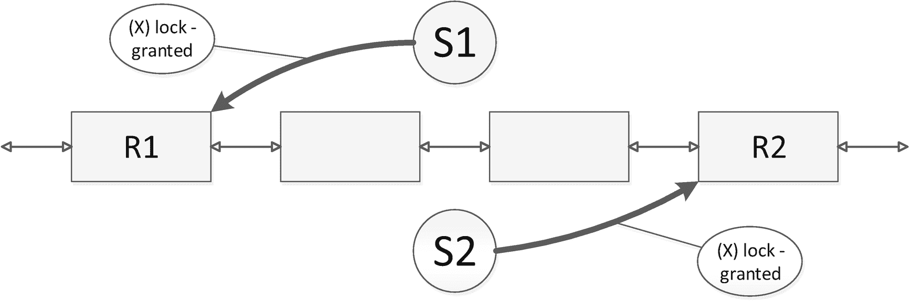

图 5-1

经典死锁：步骤 1

接下来，我们假设会话 1 想要更新行 *R2*。它将尝试获取 *R2* 上的排他 (X) 锁，但由于会话 2 已经持有的排他 (X) 锁而被阻塞。如果会话 2 想要更新 R1，同样的事情会发生——它将被会话 1 持有的排他 (X) 锁阻塞。正如您所看到的，此时两个会话都在等待对方，无法继续执行。这代表了*经典*或*循环*死锁，如图 5-2 所示。

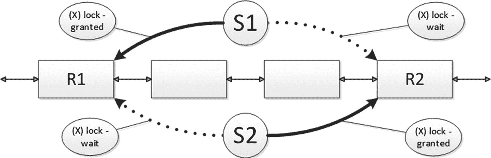

图 5-2

经典死锁：步骤 2

系统任务 *Deadlock Monitor* 每五秒唤醒一次，检查系统中是否有任何死锁。检测到死锁时，SQL Server 会回滚其中一个事务并显示错误 1205。这会释放该事务中持有的所有锁，并允许其他会话继续。

#### 注意

如果系统中存在死锁，死锁监视器唤醒间隔会缩短。在某些情况下，它可能每秒唤醒多达十次。

选择哪个会话作为死锁受害者的决定取决于几个因素。默认情况下，SQL Server 会回滚使用较少日志空间进行事务的会话。您可以通过使用 `SET DEADLOCK_PRIORITY` 选项为会话设置死锁优先级来在一定程度上控制它。

## 因未优化查询导致的死锁

经典的死锁通常发生在数据高度易变且多个会话更新相同行时，但死锁还有另一个常见原因。它是由于未优化查询引入的扫描操作所导致的。让我们看一个例子：假设你有一个进程，它更新 `Delivery.Orders` 表中的一行，然后查询该客户有多少订单。让我们看看当两个这样的会话使用 `READ COMMITTED` 事务隔离级别并行运行时会发生什么。

第一步，两个会话执行两条 `UPDATE` 语句。这两条语句都能顺利运行，不会涉及阻塞——正如你所记得的，该表在 `OrderId` 列上有聚集索引，因此执行计划中会有 *聚集索引 seek* 操作符。图 5-3 展示了这一步。

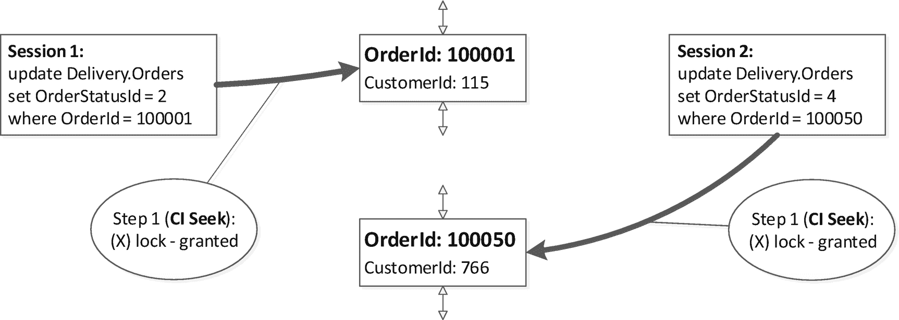

**图 5-3** 由扫描导致的死锁：第一步

此时，两个会话都在其更新的行上持有排他锁。作为第二步，会话运行基于 `CustomerId` 过滤器的 `SELECT` 语句。该表上没有非聚集索引，因此执行计划中将包含 *聚集索引扫描* 操作。在 `READ COMMITTED` 隔离级别下，SQL Server 在读取数据时会获取共享锁，结果就是，一旦两个会话尝试读取已被持有排他锁的行，它们就会被阻塞。图 5-4 展示了这种情况。

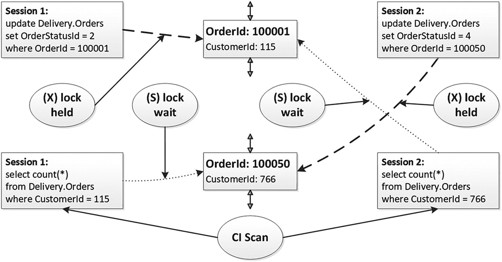

**图 5-4** 由扫描导致的死锁：第二步

如果在两个会话都被阻塞之后、死锁监视器任务唤醒之前，你运行清单 5-1 所示的查询，你会看到两个会话正在互相阻塞。

```sql
select
tl.request_session_id as [SPID]
,tl.resource_type as [Resouce Type]
,tl.resource_description as [Resource]
,tl.request_mode as [Mode]
,tl.request_status as [Status]
,wt.blocking_session_id as [Blocked By]
from
sys.dm_tran_locks tl with (nolock) left outer join
sys.dm_os_waiting_tasks wt with (nolock) on
tl.lock_owner_address = wt.resource_address and
tl.request_status = 'WAIT'
where
tl.request_session_id <> @@SPID and tl.resource_type = 'KEY'
order by
tl.request_session_id
```

**清单 5-1** 两个会话被阻塞时的锁请求

图 5-5 显示了该查询的输出。如你所见，两个会话正在互相阻塞。即使这些会话并不打算将这些行包含在计数计算中，这也无关紧要。在共享锁被获取且行被读取之前，SQL Server 无法评估 `CustomerId` 谓词。

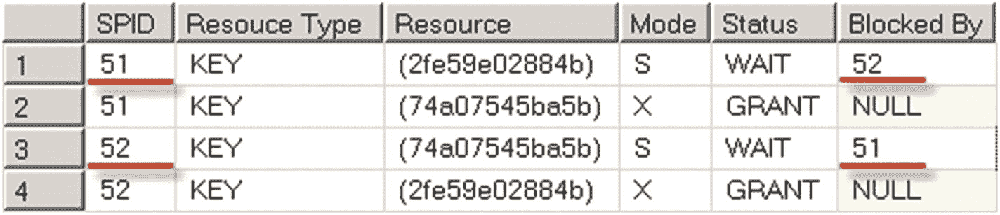

**图 5-5** 死锁发生时的锁请求

在任何读者需要获取共享锁的事务隔离级别中，你都会遇到类似的死锁。在 `READ UNCOMMITTED`、`READ COMMITTED SNAPSHOT` 或 `SNAPSHOT` 这些不使用共享锁的隔离级别下，则不会发生这种死锁。

尽管如此，在 `READ UNCOMMITTED` 和 `READ COMMITTED SNAPSHOT` 隔离级别下，你仍可能因为写入者冲突而发生死锁。你可以在前面的例子中将 `SELECT` 语句替换为引入扫描操作的 `UPDATE` 语句来触发它。另一方面，`SNAPSHOT` 隔离级别除非在你更新相同行的情况下，否则不会发生写入者/写入者阻塞，即使使用 `UPDATE` 语句也不会导致死锁。

查询优化有助于修复由扫描和未优化查询引起的死锁。在上述案例中，你可以通过在 `CustomerId` 列上添加一个非聚集索引来解决问题。这会改变 `SELECT` 语句的执行计划，用 *非聚集索引 seek* 替换掉 *聚集索引扫描*。结果，会话将无需读取被另一个会话修改过且持有不兼容锁的行。

## 键查找死锁

在某些情况下，当多个会话尝试同时读取和更新同一行时，可能会发生死锁。

假设你表上有一个非聚集索引，一个会话想要使用该索引来读取该行。如果该索引不是覆盖索引，并且会话需要从聚集索引中获取一些数据，SQL Server 生成的执行计划可能包含 `非聚集索引 seek` 和 `键查找` 操作。该会话将首先在非聚集索引行上获取共享锁，然后在聚集索引行上获取共享锁。

同时，如果你有另一个会话，它使用聚集键值作为查询谓词来更新属于该非聚集索引的一部分的某个列，那么该会话将以相反的顺序获取排他锁；即先在聚集索引行上获取排他锁，然后在非聚集索引行上获取。

图 5-6 显示了第一步之后发生的情况：两个会话都成功地在聚集索引和非聚集索引的行上获取了锁。

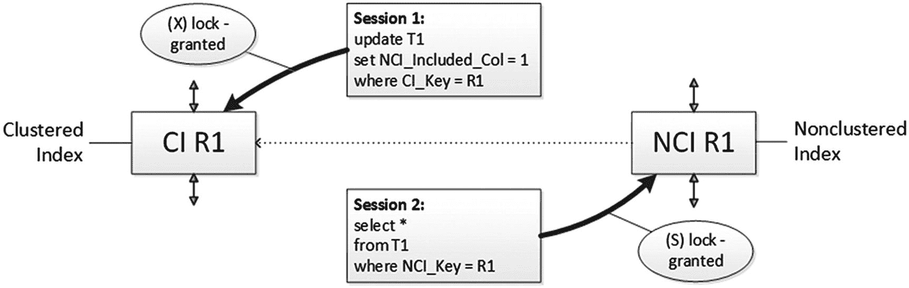

**图 5-6** 键查找死锁：第一步

在下一步中，两个会话都尝试在另一个索引的行上获取锁，结果如图 5-7 所示，它们被阻塞了。

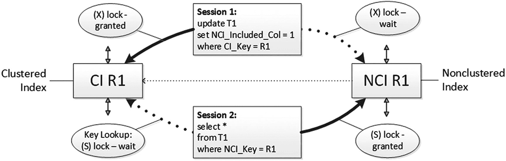

**图 5-7** 键查找死锁：第二步

如果这恰好同时发生，你就会遇到死锁，并且读取数据的会被选作死锁牺牲品。这是我们之前看到的典型循环死锁的一个例子。尽管两个会话操作的是单表单行，但 SQL Server 在内部处理的是两行——分别位于聚集索引和非聚集索引中。

你可以通过将非聚集索引设为覆盖索引并避免 `键查找` 操作来解决这类死锁。不幸的是，这种方案会增加非聚集索引中叶子行的大小，并在数据修改和索引维护期间引入额外开销。或者，你可以使用乐观隔离级别，并切换到 `READ COMMITTED SNAPSHOT` 模式，在该模式下，读取者不获取共享锁。

## 死锁：因同一行被多次更新而引发

一种与之前类似的死锁模式，可能会因对同一行进行多次更新而引入，特别是当这些更新访问或修改了位于不同索引中的列时。这可能导致一种死锁情况——类似于键查找死锁——即另一个会话在更新操作之间锁定了非聚集索引行。一个常见的场景是使用 `AFTER UPDATE` 触发器来更新同一行。

让我们看一个场景：你有一个同时包含聚集索引和非聚集索引的表，并且定义了 `AFTER UPDATE` 触发器。让会话 1 更新一个不属于非聚集索引的列。此步骤如图 5-8 所示。它仅获取聚集索引上该行的排他锁（X 锁）。

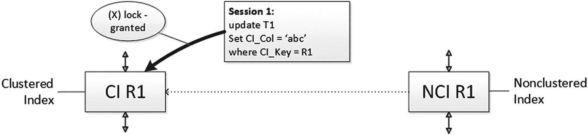
*图 5-8：因同一行多次更新导致的死锁：步骤 1*

更新操作触发了 `AFTER UPDATE` 触发器。同时，假设另一个会话正尝试通过非聚集索引选择同一行。该会话在非聚集索引查找操作期间，成功获取了非聚集索引行上的共享锁（S 锁）。然而，在尝试键查找操作以获取聚集索引行上的共享锁（S 锁）时，它将被阻塞，如图 5-9 所示。

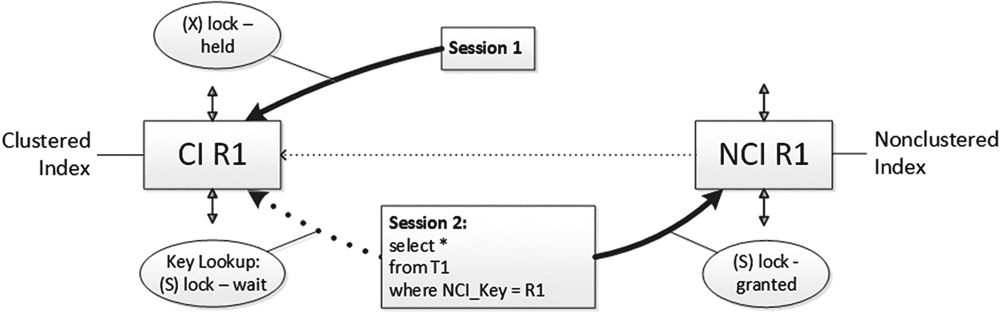
*图 5-9：因同一行多次更新导致的死锁：步骤 2*

最后，如果会话 1 中的触发器尝试再次更新同一行，修改存在于非聚集索引中的列，它将被会话 2 持有的共享锁（S 锁）阻塞。图 5-10 说明了这种情况。

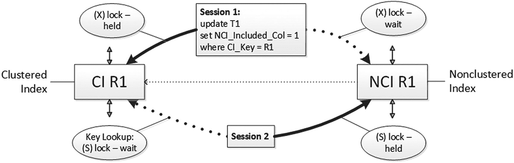
*图 5-10：因同一行多次更新导致的死锁*

让我们通过清单 5-2 中的代码来验证这一点。

```sql
create table dbo.T1
(
CI_Key int not null,
NCI_Key int not null,
CI_Col varchar(32),
NCI_Included_Col int
);
create unique clustered index IDX_T1_CI on dbo.T1(CI_Key);
create nonclustered index IDX_T1_NCI
on dbo.T1(NCI_Key)
include (NCI_Included_Col);
insert into dbo.T1(CI_Key,NCI_Key,CI_Col,NCI_Included_Col)
values(1,1,'a',0), (2,2,'b',0), (3,3,'c',0), (4,4,'d',0);
begin tran
update dbo.T1 set CI_Col = 'abc' where CI_Key = 1;
select
l.request_session_id as [SPID]
,object_name(p.object_id) as [Object]
,i.name as [Index]
,l.resource_type as [Lock Type]
,l.resource_description as [Resource]
,l.request_mode as [Mode]
,l.request_status as [Status]
,wt.blocking_session_id as [Blocked By]
from
sys.dm_tran_locks l join sys.partitions p on
p.hobt_id = l.resource_associated_entity_id
join sys.indexes i on
p.object_id = i.object_id and p.index_id = i.index_id
left outer join sys.dm_os_waiting_tasks wt with (nolock) on
l.lock_owner_address = wt.resource_address and
l.request_status = 'WAIT'
where
resource_type = 'KEY' and request_session_id = @@SPID;
update dbo.T1 set NCI_Included_Col = 1 where NCI_Key = 1
select
l.request_session_id as [SPID]
,object_name(p.object_id) as [Object]
,i.name as [Index]
,l.resource_type as [Lock Type]
,l.resource_description as [Resource]
,l.request_mode as [Mode]
,l.request_status as [Status]
,wt.blocking_session_id as [Blocked By]
from
sys.dm_tran_locks l join sys.partitions p on
p.hobt_id = l.resource_associated_entity_id
join sys.indexes i on
p.object_id = i.object_id and p.index_id = i.index_id
left outer join sys.dm_os_waiting_tasks wt with (nolock) on
l.lock_owner_address = wt.resource_address and
l.request_status = 'WAIT'
where
resource_type = 'KEY' and request_session_id = @@SPID;
commit
```
*清单 5-2：同一行的多次更新*

清单 5-2 中的代码对该行执行了两次更新。如果你查看第一次更新后持有的行级锁，你会看到仅在聚集索引上持有一个锁，如图 5-11 所示。


*图 5-11：第一次更新后的行级锁*

第二次更新（修改了存在于非聚集索引中的列）在那里放置了另一个排他锁（X 锁），如图 5-12 所示。这证明了，除非实际更新了索引列，否则不会在非聚集索引行上获取锁。

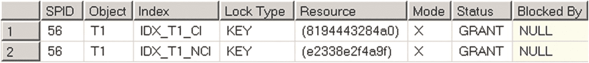
*图 5-12：第二次更新后的行级锁*

现在，让我们看另一个 `SPID = 55` 的会话，在两次更新之间运行清单 5-3 中所示的 `SELECT` 语句，此时你只有一个行级锁被持有。

```sql
select CI_Key, CI_Col
from dbo.T1 with (index = IDX_T1_NCI)
where NCI_Key = 1
```
*清单 5-3：导致死锁的代码*

如图 5-13 所示，该查询成功获取了非聚集索引行上的共享锁（S 锁），并因尝试获取聚集索引行上的锁而被阻塞。

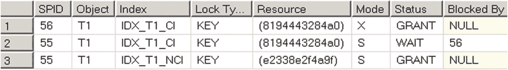
*图 5-13：SELECT 查询被阻塞时的行级锁*

如果你在原始会话（`SPID = 56`）中运行第二个更新语句，它将尝试获取非聚集索引上的排他锁（X 锁），并会被第二个（`SELECT`）会话阻塞，如图 5-14 所示。这便导致了死锁条件。

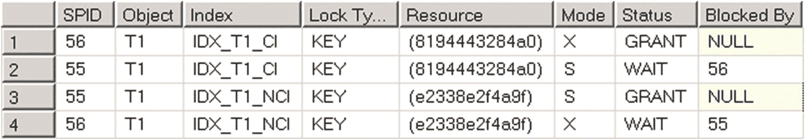
*图 5-14：第二次更新运行时的行级锁（死锁）*

## 避免死锁的方法

避免此类问题的最佳方法是消除对同一行的多次更新。你可以使用变量或临时表来存储初步数据，并在事务接近结束时运行单一的 `UPDATE` 语句。或者，你可以修改代码，在第一次 `UPDATE` 语句中为 `NCI_Included_Col` 分配一个临时值，该语句将在两个索引上获取排他（X）锁。来自第二个会话的 `SELECT` 语句将无法在非聚集索引上获取锁，因此第二个更新可以正常运行。

作为最后的手段，你可以使用需要两个索引都使用 `(XLOCK)` 锁定提示的计划来读取行，这将同时在两行上放置排他（X）锁，如清单 5-4 和图 5-15 所示。显然，你需要考虑这会带来的开销。

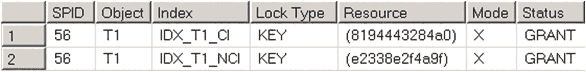

**图 5-15** 使用 `(XLOCK)` 提示的 SELECT 语句后的行级锁

```
begin tran
declare
@Dummy varchar(32)
select @Dummy = CI_Col
from dbo.T1 with (XLOCK index=IDX_T1_NCI)
where NCI_Key = 1;
select
l.request_session_id as [SPID]
,object_name(p.object_id) as [Object]
,i.name as [Index]
,l.resource_type as [Lock Type]
,l.resource_description as [Resource]
,l.request_mode as [Mode]
,l.request_status as [Status]
,wt.blocking_session_id as [Blocked By]
from
sys.dm_tran_locks l join sys.partitions p on
p.hobt_id = l.resource_associated_entity_id
join sys.indexes i on
p.object_id = i.object_id and p.index_id = i.index_id
left outer join sys.dm_os_waiting_tasks wt with (nolock) on
l.lock_owner_address = wt.resource_address and
l.request_status = 'WAIT'
where
resource_type = 'KEY' and request_session_id = @@SPID;
update dbo.T1 set CI_Col = 'abc' where CI_Key = 1;
/* some code */
update dbo.T1 set NCI_Included_Col = 1 where NCI_Key = 1;
commit
```

**清单 5-4** 在两个索引的行上获取排他（X）锁

### 死锁排查

简而言之，死锁排查与上一章讨论的阻塞排查非常相似。你需要分析涉及死锁的进程和查询，识别问题的根本原因，并最终解决它。

类似于 *阻塞进程报告*，有一个 *死锁图*，它以 XML 格式为你提供有关死锁的信息。获取死锁图的方法有很多：

*   `xml_deadlock_report` 扩展事件
*   从 SQL Server 2008 开始，每个系统在默认的 SQL Server 安装中都有一个启用的 `system_health` 扩展事件会话。该会话捕获基本的服务器运行状况信息，包括 `xml_deadlock_report` 事件。
*   跟踪标志 1222：此跟踪标志将死锁信息保存到 SQL Server 错误日志中。你可以使用 `DBCC TRACEON(1222,-1)` 命令或使用启动参数 `T1222` 为所有会话启用它。这在生产环境中是绝对安全的方法；然而，由于 `system_health` 会话的存在，现在它可能是多余的。
*   `Deadlock graph` SQL 跟踪事件。值得注意的是，SQL Profiler 以图形方式显示死锁。事件上下文菜单（鼠标右键单击）中的“提取事件数据”操作允许你提取 XML 死锁图。

使用 `system_health` xEvent 会话时，默认捕获 `xml_deadlock_graph`。即使你没有显式启用任何其他收集方法，你也可能拥有用于故障排除的数据。在 SQL Server 2012 及以上版本中，你可以从 Management Studio 的 *管理* 节点访问 `system_health` 会话数据，如图 5-16 所示。你可以分析 *目标数据*，搜索 `xml_deadlock_report` 事件。

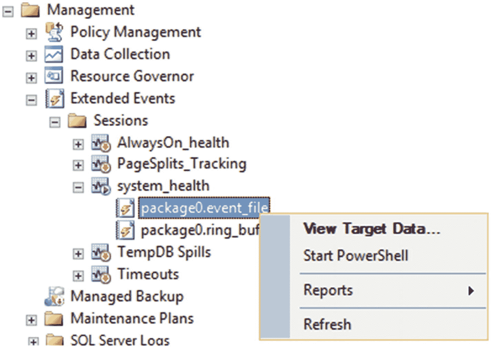

**图 5-16** 访问 system_health xEvents 会话

死锁图的 XML 表示包含两个不同的部分，如清单 5-5 所示。`<process-list>` 和 `<resource-list>` 部分分别包含有关死锁中涉及的进程和资源的信息。

```
...
...
...
...
```

**清单 5-5** 死锁图格式

让我们使用表 5-1 中所示的代码在系统中触发死锁。你需要并行运行两个会话——先运行 `UPDATE` 语句，然后运行 `SELECT` 语句。

**表 5-1** 在系统中触发死锁

| 会话 1 | 会话 2 |
| --- | --- |
| `begin tran`        `update Delivery.Orders`        `set OrderStatusId = 1`        `where OrderId = 10001;` | `begin tran`        `update Delivery.Orders`        `set OrderStatusId = 1`        `where OrderId = 10050;` |
|         `select count(*) as [Cnt]`        `from Delivery.Orders with (READCOMMITTED)`        `where CustomerId = 317;``commit` |         `select count(*) as [Cnt]`        `from Delivery.Orders with (READCOMMITTED)`        `where CustomerId = 766;``commit` |

死锁图中的每个 `<process>` 节点显示特定进程的详细信息，如清单 5-6 所示。为了便于阅读，我移除了一些属性的值。我还特别高亮显示了那些在故障排除过程中我发现特别有用的属性。

```
...
```

**清单 5-6** 死锁图：`<process>` 节点

`id` 属性唯一标识进程。`Waitresource` 和 `lockMode` 提供有关锁类型和进程正在等待的资源的信息。在我们的示例中，你可以看到该进程正在等待其中一行（键）上的共享（S）锁。


`Isolationlevel` 属性向您展示当前的事务隔离级别。最后，`executionStack` 和 `inputBuf` 允许您找到死锁发生时执行的 SQL 语句。与 `blocked process report` 相反，死锁图中的 `executionStack` 通常为您提供有关涉及死锁的查询和模块的信息。然而，在某些情况下，您需要像前一章的清单 4-5 中所做的那样，使用 `sys.dm_exec_sql_text` 函数来获取 SQL 语句。

死锁图的 `<resource-list>` 部分包含了有关涉及死锁的资源的信息。如清单 5-7 所示。

#### 清单 5-7
死锁图：`<resource-list>` 节点

XML 元素的名称标识了资源的类型。`Keylock`、`pagelock` 和 `objectlock` 分别代表行级锁、页锁和对象锁。您还可以看到这些锁属于哪些对象和索引。最后，`owner-list` 和 `waiter-list` 节点提供了有关拥有锁和等待锁的进程的信息，以及已获取和请求的锁的类型。您可以将这些信息与图中 `process-list` 部分的数据关联起来。

您可能已经猜到了，接下来的步骤与阻塞故障排除非常相似；即，您需要精确定位涉及死锁的查询，并找出死锁发生的原因。

然而，有一个重要因素需要考虑。在大多数情况下，一个死锁涉及同一事务中每个会话的多个语句。死锁图仅为您提供最后一个语句的信息——即触发死锁的那个语句。

您可以在 `<resource-list>` 节点中看到其他语句的 `迹象`。它显示了事务持有的锁，但没有告诉您获取这些锁的语句。在分析问题的根本原因时，识别这些语句非常有用。

在我们的示例中，当您查看表 5-1 中显示的代码时，您会看到两个语句。`UPDATE` 语句更新单行——它在那里获取并持有一个排他 (X) 锁。您可以在死锁图的 `<resource-list>` 节点中看到，两个进程都拥有那些排他 (X) 锁。

接下来，您需要理解为什么 `SELECT` 查询试图在已持有排他 (X) 锁的行上获取共享 (S) 锁。您可以通过运行查询或使用 `sys.dm_exec_query_stats` DMV（如前一章清单 4-5 所示）从进程节点查看 `SELECT` 语句的执行计划。结果，您将得到如图 5-17 所示的执行计划。该图还显示了查询执行期间获取的锁的数量。

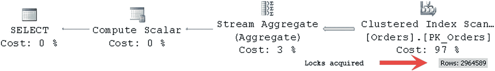

##### 图 5-17
查询的执行计划

#### 提示
您可以使用 `sys.dm_exec_procedure_stats` 视图获取存储过程的缓存执行计划。

如您所见，计划中有一个 `Clustered Index Scan`，这为您提供了足够的分析数据。`SELECT` 查询扫描了整个表。因为两个进程都使用 `READ COMMITTED` 隔离级别，查询试图获取表中每一行的共享 (S) 锁，并被另一个会话持有的排他 (X) 锁所阻塞。即使那些行没有查询正在寻找的 `CustomerId` 也无所谓。为了评估这个谓词，查询必须读取这些行，这需要获取它们的共享 (S) 锁。

您可以通过在 `CustomerID` 列上添加一个非聚集索引来解决这种死锁情况。这将消除 `Clustered Index Scan` 并用 `Index Seek` 运算符替代，如图 5-18 所示。

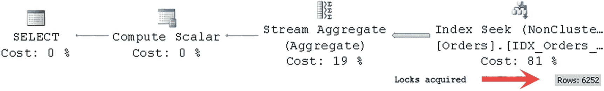

##### 图 5-18
带有非聚集索引的查询执行计划

查询将只读取属于特定客户的行，而不是获取表中每一行的共享 (S) 锁。这将大大减少需要获取的共享 (S) 锁的数量，并防止查询被属于不同客户的行上的排他 (X) 锁所阻塞。

不幸的是，死锁故障排除对计划缓存的依赖性与阻塞故障排除相同。您通常需要从那里获取涉及死锁的语句的文本和执行计划。计划缓存中的数据会随时间变化，等待时间越长，所需信息存在的可能性就越小。

您可以通过实施基于事件通知的监控解决方案来解决此问题，类似于我们在前一章所做的。该代码作为阻塞监控框架代码的一部分包含在本书的配套材料中，也可以从我的博客下载：[`http://aboutsqlserver.com/bmframework`](http://aboutsqlserver.com/bmframework)。

最后，在某些情况下，您可能会遇到查询内并行死锁——当一个具有并行执行计划的查询自身发生死锁时。幸运的是，这种情况很少见，通常是由 SQL Server 中的错误而不是应用程序或数据库问题引起的。当死锁图中有两个以上具有相同 `SPID` 的进程，并且 `<resource-list>` 中列出了 `exchangeEvent` 和/或 `threadPoll` 作为资源，而没有任何关联的锁资源时，您可以检测到这种情况。当这种情况发生时，您可以通过使用 `MAXDOP` 提示减少甚至完全移除查询的并行度来解决问题。此问题也很可能已在最新的服务包或累积更新中得到修复。


## 由于 `IGNORE_DUP_KEY` 索引选项导致的死锁

存在一种非常特殊且令人困惑、难以解释的死锁类型。乍看之下，这种死锁似乎通过在非 `SERIALIZABLE` 隔离级别使用范围锁，违反了 SQL Server 的并发模型。然而，其解释其实很简单。

如你所知，SQL Server 使用范围锁来保护索引键的范围，从而避免幻读和不可重复读现象。此类锁保证在事务中执行的查询始终处理同一组数据，并且不受其他会话修改的影响。

但是，还有另一种情况 SQL Server 会使用范围锁：在对设置了 `IGNORE_DUP_KEY` 选项为 `ON` 的非聚集索引进行数据修改时。在这种情况下，SQL Server 会忽略具有重复键值的行，而不是引发异常。

让我们看一个例子，创建一个表，如清单 5-8 所示。

```sql
create table dbo.IgnoreDupKeysDeadlock
(
CICol int not null,
NCICol int not null
);
create unique clustered index IDX_IgnoreDupKeysDeadlock_CICol
on dbo.IgnoreDupKeysDeadlock(CICol);
create unique nonclustered index IDX_IgnoreDupKeysDeadlock_NCICol
on dbo.IgnoreDupKeysDeadlock(NCICol)
with (ignore_dup_key = on);
insert into dbo.IgnoreDupKeysDeadlock(CICol, NCICol)
values(0,0),(5,5),(10,10),(20,20);
```
**清单 5-8** `IGNORE_DUP_KEY` 死锁：表创建

现在，让我们使用 `READ UNCOMMITTED` 隔离级别启动事务，然后向表中插入一行，并检查会话获取的锁。代码如清单 5-9 所示。

```sql
set transaction isolation level read uncommitted
begin tran
insert into dbo.IgnoreDupKeysDeadlock(CICol,NCICol)
values(1,1);
select request_session_id, resource_type, resource_description
,resource_associated_entity_id, request_mode, request_type, request_status
from sys.dm_tran_locks
where request_session_id = @@SPID;
```
**清单 5-9** `IGNORE_DUP_KEY` 死锁：向表中插入一行

图 5-19 展示了 `sys.dm_tran_locks` 视图的输出。如你所见，会话在聚集索引和非聚集索引的行上获取了两个排他锁。它还在非聚集索引上获取了一个范围锁。此锁类型表示现有键受共享锁保护，而区间本身受更新锁保护。

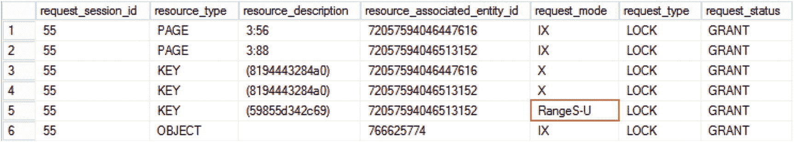
**图 5-19** 第一个会话获取的锁

在此场景中，由于 SQL Server 处理数据修改的方式，需要范围锁。正如我们已经讨论过的，数据首先在聚集索引中修改，然后是非聚集索引。当 `IGNORE_DUP_KEY=ON` 时，SQL Server 需要防止在聚集索引插入后，重复键同时插入到非聚集索引中的情况，从而导致某些插入需要回滚。因此，它锁定非聚集索引中的键范围，阻止其他会话在那里插入任何行。

我们可以通过查看图 5-20 所示的 `lock_acquired` 扩展事件来确认这一点。如你所见，范围锁是在两个索引中获取排他锁之前获取的。

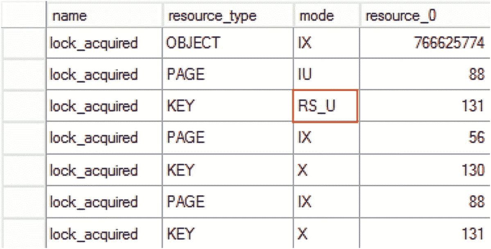
**图 5-20** `lock_acquired` 扩展事件

然而，这里的关键问题是，范围锁的行为与在 `SERIALIZABLE` 隔离级别中的行为相同。无论使用何种隔离级别，它们都会一直持有直到事务结束。这种行为大大增加了死锁的可能性。

让我们在另一个会话中运行清单 5-10 中的代码。第一条语句会成功，而第二条语句将被阻塞。

```sql
set transaction isolation level read uncommitted
begin tran
-- Success
insert into dbo.IgnoreDupKeysDeadlock(CICol,NCICol)
values(12,12);
-- Statement is blocked
insert into dbo.IgnoreDupKeysDeadlock(CICol,NCICol)
values(2,2);
commit;
```
**清单 5-10** `IGNORE_DUP_KEY` 死锁：第二个会话代码

现在，如果我们查看两个会话持有的锁，将会看到图 5-21 所示的情况。来自第一个会话的范围锁保护了 `0..5` 区间，并阻塞了试图在同一区间获取范围锁的第二个会话。

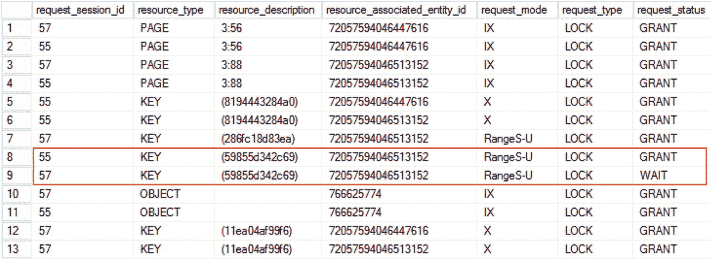
**图 5-21** 阻塞发生时的锁请求

反过来，第二个会话持有 `10..20` 区间上的范围锁。如果第一个会话尝试使用清单 5-11 中的代码向该区间插入另一行，它将被阻塞，从而导致经典的死锁情况。

```sql
insert into dbo.IgnoreDupKeysDeadlock(CICol,NCICol)
values(11,11);
```
**清单 5-11** `IGNORE_DUP_KEY` 死锁：第一个会话的第二次插入

图 5-22 显示了死锁图的部分输出。如你所见，通过存在非 `SERIALIZABLE` 隔离级别中的范围锁，可以清晰地识别出这种特定模式。

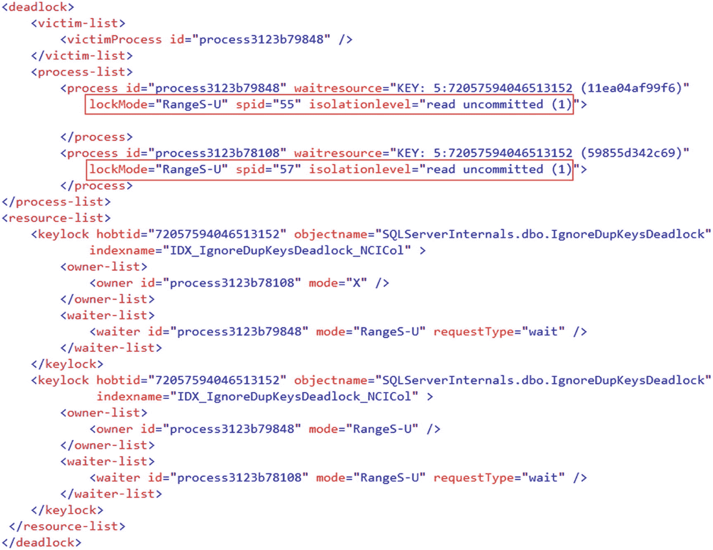
**图 5-22** 死锁图

除了移除 `IGNORE_DUP_KEY` 索引选项外，你对此问题几乎无能为力。幸运的是，这个选项很少需要，并且在许多情况下，可以通过使用 `NOT EXISTS` 谓词和/或暂存表来解决。

最后，需要注意的是，SQL Server 不会使用范围锁来强制在聚集索引中设置 `IGNORE_DUP_KEY=ON`。数据首先在聚集索引中插入或修改，SQL Server 不需要使用范围锁来避免竞争条件。


## 降低死锁发生的可能性

最后，我可以提供几点实用的建议，以帮助降低系统中死锁发生的可能性：

1.  **优化查询**。由未优化的查询引起的扫描是死锁最常见的原因。合适的索引不仅能提升查询性能，还能减少需要读取的行数和需要获取的锁，从而降低与其他会话发生锁冲突的可能性。

2.  **尽可能缩短锁的持有时间**。回想一下，所有的排他（`X`）锁都会一直持有到事务结束。应使事务保持简短，并尝试在尽可能接近事务结束时更新数据，以减少锁冲突的机会。在我们表 5-1 的示例中，你可以修改代码，交换`SELECT`和`UPDATE`语句的顺序。这将解决那个特定的死锁问题，因为事务在获取排他（`X`）锁之后，没有任何可能被阻塞的语句了。

3.  **考虑使用乐观隔离级别，例如 `READ COMMITTED SNAPSHOT` 或 `SNAPSHOT`**。如果不可行，则使用能提供所需数据一致性的最低事务隔离级别。这可以减少共享（`S`）锁的持有时间。即使你在之前的例子中交换了`SELECT`和`UPDATE`语句的顺序，在`REPEATABLE READ`或`SERIALIZABLE`隔离级别下，你仍然会遇到死锁。在这些隔离级别下，共享（`S`）锁会一直持有到事务结束，从而会阻塞`UPDATE`语句。而在`READ COMMITTED`模式下，共享（`S`）锁在读取一行后就会释放，`UPDATE`语句就不会被阻塞。

4.  **当涉及多个索引时，避免在同一事务内多次更新同一行**。正如本章前面所见，当索引列未被更新时，SQL Server 不会在非聚集索引行上放置排他（`X`）锁。其他会话可以在那里放置不兼容的锁并阻塞后续的更新，从而导致死锁。

5.  **使用重试逻辑**。将关键代码包裹在`TRY..CATCH`块中，如果发生死锁则重试该操作。由死锁引起的异常错误号是`1205`。代码清单 5-12 展示了如何实现这一点。

```sql
-- 声明并设置变量，用于跟踪在退出前尝试重试的次数。
declare
    @retry tinyint = 5
-- 如果此任务被选为死锁牺牲品，则持续尝试更新表。
while (@retry > 0)
begin
    begin try
        begin tran
            -- 可能导致死锁的一些代码
        commit
    end try
    begin catch
        -- 检查错误号。如果是死锁牺牲品错误，则减少下次重试的计数。
        -- 如果发生其他错误，则退出 WHILE 循环。
        if (error_number() = 1205)
            set @retry = @retry - 1;
        else
            set @retry = 0;
        if @@trancount > 0
            rollback;
    end catch
end
```
代码清单 5-12
使用`TRY..CATCH`块在发生死锁时重试操作

## 小结

除了被认为属于 SQL Server 代码错误的查询内并行死锁外，死锁发生在多个会话竞争同一组资源时。

死锁疑难解答中的关键元素是死锁图，它提供了关于死锁中涉及的进程和资源的信息。你可以通过启用跟踪标志`T1222`、捕获`xml_deadlock_report`扩展事件和`Deadlock graph` SQL 跟踪事件，或者在系统中设置死锁事件通知来收集死锁图。在 SQL Server 2008 及更高版本中，`xml_deadlock_report`事件包含在默认情况下每个 SQL Server 安装都启用的`system_health`扩展事件会话中。

死锁图会为你提供有关触发死锁的查询的信息。然而，你应该记住，在大多数情况下，死锁涉及在同一事务内获取并持有锁的多个语句，你可能需要分析所有这些语句才能解决问题。

尽管死锁可能由多种原因引起，但通常是因为未优化的查询在扫描过程中产生了过多的锁。查询优化可以帮助解决这些问题。

