# 6. 乐观隔离级别

乐观事务隔离级别在 SQL Server 2005 中被引入，作为一种处理阻塞问题和解决系统中并发现象的新方法。使用乐观事务隔离级别，查询在访问被其他会话修改的数据时，会读取行的“旧”已提交版本，而不是被共享（`S`）锁和排他（`X`）锁的不兼容性所阻塞。

本章将解释乐观隔离级别是如何实现的，以及它们如何影响系统的锁行为。

## 行版本控制概述

使用乐观事务隔离级别时，当发生更新时，SQL Server 将行的旧版本存储在`tempdb`中一个称为`版本存储区`的特殊部分。数据库中的原始行通过一个 14 字节的版本指针引用它们，SQL Server 会将这个指针添加到被修改（更新和删除）的行中。根据情况，一行在版本存储区中可能存储多个版本记录。图 6-1 说明了此行为。

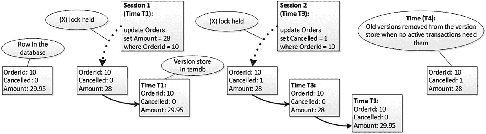

图 6-1
版本存储区

现在，当读取器（有时是写入器）访问持有排他（`X`）锁的行时，它们会从版本存储区读取旧版本，而不是被阻塞，如图 6-2 所示。

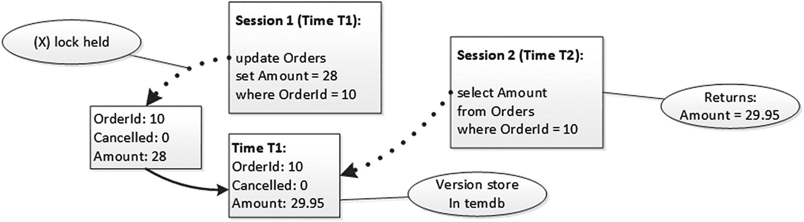

图 6-2
读取器与版本存储区

正如你所猜想的，虽然乐观隔离级别有助于减少阻塞，但也存在一些权衡。其中最显著的是它们增加了`tempdb`的负载。在高度易变的系统上使用乐观隔离级别可能导致非常繁重的`tempdb`活动，并显著增加`tempdb`的大小。我们将在本章后面更详细地探讨这个问题。

数据修改和检索过程中存在开销。SQL Server 需要将数据复制到`tempdb`，并维护版本记录的链表。同样，在读取数据时需要遍历该链表。这增加了额外的 CPU、内存和 I/O 负载。你需要记住这些权衡，尤其是在云端托管系统时，那里的 I/O 性能通常不如本地现代高端磁盘阵列高效。

最后，乐观隔离级别会导致索引碎片。当一行被修改时，SQL Server 会因为版本指针而使行大小增加 14 字节。如果一个页面被紧密填充，并且行的新版本无法容纳在该页面中，它将导致页面拆分和进一步的碎片。我们将在本章后面更深入地研究这种行为。

## 乐观事务隔离级别

有两种乐观事务隔离级别：`READ COMMITTED SNAPSHOT` 和 `SNAPSHOT`。准确来说，`SNAPSHOT`是一个独立的事务隔离级别，而`READ COMMITTED SNAPSHOT`是一个数据库选项，它改变了`READ COMMITTED`事务隔离级别中读取器的行为。

让我们深入研究这些级别。


## 快照隔离级别详解

### 读取提交快照隔离级别

两种乐观隔离级别都需要在数据库级别启用。你可以使用 `ALTER DATABASE SET READ_COMMITTED_SNAPSHOT ON` 命令来启用 `读取提交快照 (RCSI)`。该语句会获取一个独占（X）数据库锁来更改数据库选项，如果数据库中还有其他用户连接，则会被阻塞。你可以通过运行 `ALTER DATABASE SET READ_COMMITTED_SNAPSHOT ON WITH ROLLBACK AFTER X SECONDS` 命令来解决这个问题。这将回滚所有活动事务并终止现有数据库连接，从而允许更改数据库选项。

#### 注意

在 Microsoft Azure SQL 数据库中，`读取提交快照` 默认是启用的。

如前所述，`RCSI` 改变了 `读取提交` 模式下读取器的行为。然而，它并不影响写入器的行为。

如图 6-3 所示，读取器不再获取共享（S）锁并被行上持有的任何独占（X）锁阻塞，而是使用版本存储中的旧版本。写入器仍然以与悲观隔离级别相同的方式获取更新（U）和独占（X）锁。再次说明，正如你所看到的，不同会话的写入器之间仍然存在阻塞，尽管写入器不会像 `读取未提交` 模式那样阻塞读取器。

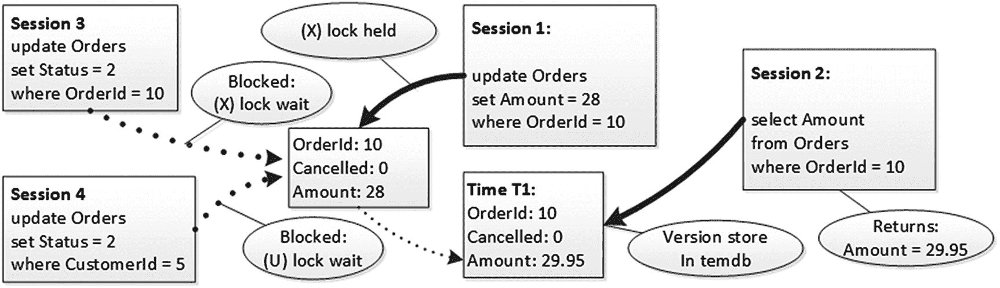

图 6-3 读取提交快照隔离级别的行为

然而，`读取未提交` 和 `读取提交快照` 隔离级别之间有一个主要区别。`读取未提交` 以牺牲数据一致性为代价消除了阻塞。可能发生许多一致性异常，包括读取未提交数据、重复读取和遗漏行。另一方面，`读取提交快照` 隔离级别为你提供了完整的*语句级一致性*。在此隔离级别运行的语句既不会访问未提交的数据，也不会访问语句开始后提交的数据。

一个显而易见的结论是，当启用了 `读取提交快照` 隔离级别时，应避免在查询中使用 `（NOLOCK）` 提示。虽然使用 `（NOLOCK）` 和 `读取未提交` 本身就是一种糟糕的做法，但当 `读取提交快照` 能在不丢失查询数据一致性的情况下提供类似的非阻塞行为时，使用它就完全没用了。

#### 提示

将数据库切换到 `读取提交快照` 隔离级别可以是一个很好的紧急技术，当系统正遭受阻塞问题时。假设读取器运行在 `读取提交` 隔离级别，它可以在不更改任何代码的情况下消除写入器/读取器阻塞。显然，这只是临时解决方案，你需要检测并消除阻塞的根本原因。

### 快照隔离级别

`快照` 是一个独立的事务隔离级别，需要在代码中使用 `SET TRANSACTION ISOLATION LEVEL SNAPSHOT` 语句显式设置。

默认情况下，禁止使用 `快照` 隔离级别。你必须使用 `ALTER DATABASE SET ALLOW_SNAPSHOT_ISOLATION ON` 语句来启用它。此语句不需要独占数据库锁，并且可以在有其他用户连接到数据库时执行。

`快照` 隔离级别提供了*事务级一致性*。无论事务活动时间多长以及其他事务在此期间做了多少数据更改，事务都将看到事务开始时数据的*快照*。

#### 注意

SQL Server 在第一次访问数据时启动显式事务，而不是在 `BEGIN TRAN` 语句时。

在图 6-4 所示的示例中，我们有一个会话 1 在时间 *T1* 启动事务并读取行。在时间 *T2*，我们有一个会话 2 在自动提交事务中修改了该行。此时，该行的旧（原始）版本移动到 `tempdb` 中的版本存储。

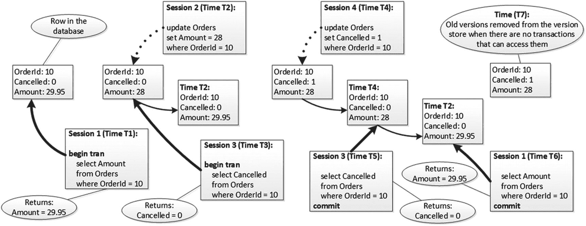

图 6-4 快照隔离级别和读取器行为

接下来，我们有一个会话 3 启动另一个事务，并在时间 *T3* 读取同一行。它看到的是会话 2（在时间 *T2*）修改并提交的行版本。在时间 *T4*，我们有一个会话 4 再次在自动提交事务中修改该行。此时，版本存储中有该行的两个版本——一个存在于 *T2* 到 *T4* 之间，以及在 *T2* 之前存在的原始版本。现在，如果会话 3 再次运行 `SELECT`，它将使用在 *T2* 到 *T4* 之间存在的版本，因为该版本是在会话 3 事务开始时提交的。同样，会话 1 将使用在 *T2* 之前存在的原始行版本。在会话 1 和会话 3 提交后的某个时间点，*版本存储清理任务* 将从版本存储中删除这两条记录，当然，前提是其他事务不再需要它们。

`可序列化` 和 `快照` 隔离级别提供了相同级别的防止数据不一致问题的保护；然而，它们的行为存在细微差别。`快照` 隔离级别事务看到的是事务开始时的数据。使用 `可序列化` 隔离级别，事务看到的是首次访问数据并获取锁时的数据。考虑一种情况，一个会话在事务中间从表中读取数据。如果另一个会话在事务开始之后但在读取数据之前更改了该表中的数据，那么在 `可序列化` 隔离级别中的事务将看到这些更改，而 `快照` 事务则不会。

乐观事务隔离级别通过减少甚至消除阻塞来提供语句级或事务级的数据一致性，尽管它们可能会在 `tempdb` 中生成大量数据。如果有一个会话从表中删除数百万行，即使原始的 `DELETE` 语句运行在悲观隔离级别，所有这些行也需要复制到版本存储中，只是为了为可能的 `快照` 或 `RCSI` 事务保留数据状态。你将在本章后面看到这样的例子。

现在，让我们检查写入器的行为。假设会话 1 启动事务并更新其中一行。如图 6-5 所示，该会话在那里持有一个独占（X）锁。

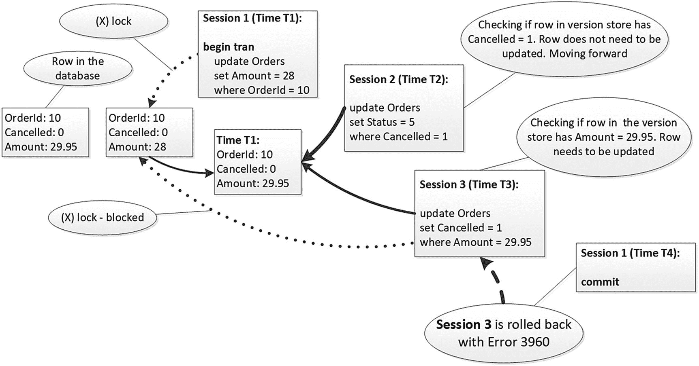

图 6-5 快照隔离级别和写入器的行为

会话 2 想要更新 `Cancelled = 1` 的所有行。它开始扫描表，当需要读取 `OrderId = 10` 的数据时，它从版本存储中读取该行；也就是说，读取会话 2 事务开始前最后提交的版本。此版本是该行的原始（未更新）版本，其 `Cancelled = 0`，因此会话 2 不需要更新它。会话 2 继续扫描行，而不会被更新（U）和独占（X）锁不兼容性所阻塞。


同样地，会话 3 希望更新所有 `Amount = 29.95` 的行。当它从版本存储中读取该行的版本时，它判定该行需要被更新。同样地，会话 1 也修改了同一行的金额，但这并不重要。此时，该行的“新版本”尚未提交，对其他会话不可见。现在，会话 3 想要更新数据库中的该行，试图获取一个排他锁（X），但被阻塞，因为会话 1 已经在该行上持有了一个排他锁（X）。

现在，如果会话 1 提交了事务，会话 3 将会回滚，并出现 `Error 3960`，如图 6-6 所示，这指示了一个写/写冲突。这与任何其他隔离级别下的行为都不同，在其他隔离级别下，一旦会话 1 的排他锁（X）被释放，会话 3 就能成功覆盖会话 1 所做的更改。

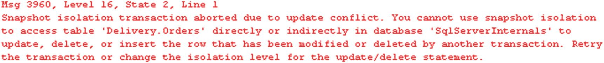
图 6-6
`Error 3960`

当一个 `SNAPSHOT` 事务试图更新在该事务启动后已被修改的数据时，就会发生写/写冲突。在我们的示例中，即使会话 1 在会话 3 的 `UPDATE` 语句之前提交，只要这次提交发生在会话 3 的事务启动之后，冲突仍然会发生。

#### 提示
如果业务逻辑允许，你可以使用 `TRY..CATCH` 语句实现重试逻辑来处理 `3960` 错误。

在数据易变的系统中使用 `SNAPSHOT` 隔离级别更新数据时，你需要牢记这种行为。如果在事务启动后，其他会话更新了你正在修改的行，你最终会遇到 `Error 3960`，即使你在更新前并未访问这些行。一种可能的解决方法是在 `UPDATE` 语句中使用（`READCOMMITTED`）或其他非乐观隔离级别的表提示，如清单 6-1 所示。

```
set transaction isolation level snapshot
begin tran
select count(*) from Delivery.Drivers;
update Delivery.Orders with (readcommitted)
set Cancelled = 1
where OrderId = 10;
commit
```
清单 6-1
使用 `READCOMMITTED` 提示来防止 `3960` 错误

`SNAPSHOT` 隔离级别可以改变系统的行为。假设有一个表 `dbo.Colors`，包含两行数据：`Black` 和 `White`。创建该表的代码如清单 6-2 所示。

```
create table dbo.Colors
(
Id int not null,
Color char(5) not null
);
insert into dbo.Colors(Id, Color) values(1,'Black'),(2,'White')
```
清单 6-2
`SNAPSHOT` 隔离级别更新行为：表创建

现在，让我们同时运行两个会话。在第一个会话中，我们运行更新语句，将颜色当前为 `black` 的行设置为 `white`，使用的语句是 `UPDATE dbo.Colors SET Color="White" WHERE Color="Black"`。在第二个会话中，我们执行相反的操作，使用语句 `UPDATE dbo.Colors SET Color="Black" WHERE Color="White"`。

让我们在 `READ COMMITTED` 或任何其他悲观的事务隔离级别下同时运行这两个会话。如图 6-7 所示，在第一步中，我们遇到了竞争条件。一个会话在它更新的行上放置了排他锁（X），而另一个会话在尝试获取同一行的更新锁（U）时被阻塞。

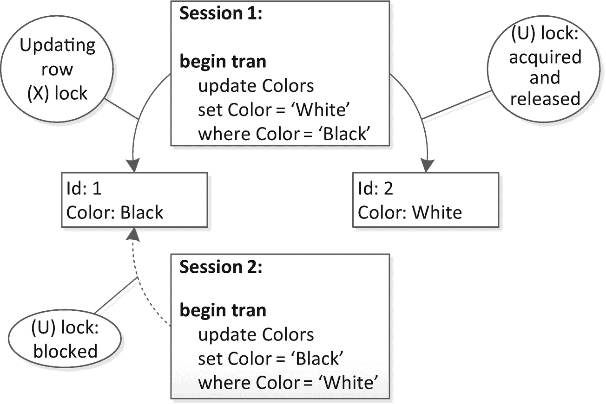
图 6-7
悲观锁行为：步骤 1

当第一个会话提交事务时，排他锁（X）被释放。此时，该行的 `Color` 值已被第一个会话更新，因此第二个会话更新了两行而不是一行，如图 6-8 所示。最终，表中的两行都将变为黑色或白色，具体取决于哪个会话先获取到锁。

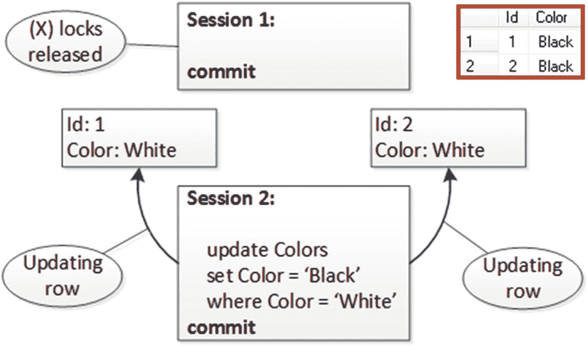
图 6-8
悲观锁行为：步骤 2

然而，在 `SNAPSHOT` 隔离级别下，这个过程的工作方式有所不同，如图 6-9 所示。当一个会话更新行时，它会将该行的旧版本移动到版本存储中。另一个会话将从那里读取该行，而不是被阻塞，反之亦然。结果是，颜色将被互换。

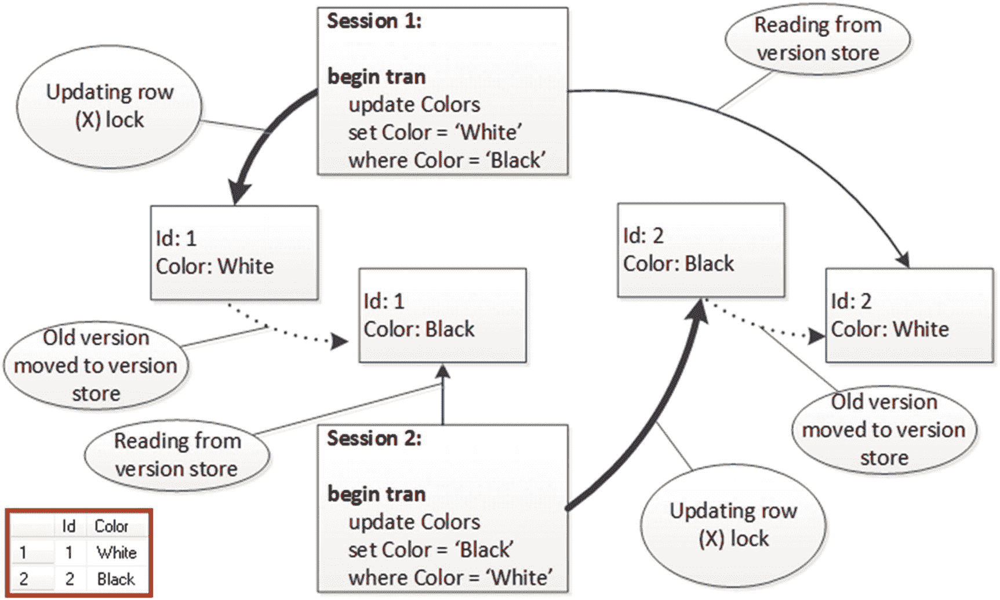
图 6-9
`SNAPSHOT` 隔离级别锁行为

你需要了解 `RCSI` 和 `SNAPSHOT` 隔离级别的行为，特别是当你的代码依赖于阻塞时。一个例子是基于触发器的参照完整性实现。你可以在被引用表上有一个 `ON DELETE` 触发器，其中运行一个 `SELECT` 语句；这个触发器将检查是否有其他表中的行引用了被删除的行。在乐观隔离级别下，该触发器可能会跳过在事务启动后插入的行。这里的解决方案同样是在被引用表和引用表上的触发器中，将（`READCOMMITTED`）或其他悲观隔离级别的表提示作为 `SELECT` 语句的一部分。

#### 注意
SQL Server 在验证外键约束时使用 `READ COMMITTED` 隔离级别。这意味着即使使用乐观隔离级别，写入者和读取者之间仍然可能发生阻塞，特别是在引用列上没有索引导致对引用表进行表扫描的情况下。


## 版本存储行为与监控

正如已经提到的，你需要监控乐观隔离级别如何影响系统中的 `tempdb`。例如，让我们运行清单 6-3 中的代码，该代码使用 `READ UNCOMMITTED` 事务隔离级别从 `Delivery.Orders` 表中删除所有行。

```
set transaction isolation level read uncommitted
begin tran
delete from Delivery.Orders;
commit
Listing 6-3
从 Delivery.Orders 表中删除数据
```

即使在 `DELETE` 语句开始时没有其他使用乐观隔离级别的事务，仍然有可能在当前事务提交之前启动一个这样的事务。因此，SQL Server 需要维护版本存储，无论是否有活动事务正在使用乐观隔离级别。

图 6-10 显示了 `tempdb` 的可用空间和版本存储大小。可以看到，一旦删除开始，版本存储就会增长并占据 `tempdb` 中的所有可用空间。

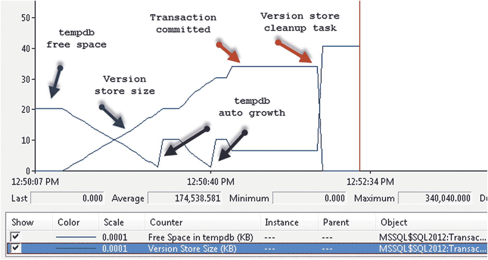

图 6-10
tempdb 可用空间与版本存储大小

在图 6-11 中，你可以看到版本存储的生成速率和清理速率。生成速率在执行期间基本保持不变，而清理任务则在事务提交后清理版本存储。默认情况下，清理任务每分钟运行一次，并且在 `tempdb` 已满的情况下，也会在任何自动增长事件之前运行。

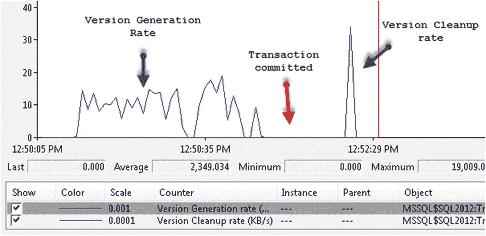

图 6-11
版本生成与清理速率

如你所见，版本存储会给系统带来额外开销。除非你计划使用，否则不要在数据库中启用乐观隔离级别。对于 `SNAPSHOT` 隔离尤其如此，因为它需要你在代码中显式设置。虽然许多系统可以无需更改任何代码就从 `READ COMMITTED SNAPSHOT` 中受益，但 `SNAPSHOT` 隔离级别则不会这样。

还有另外三个与乐观隔离级别相关的性能计数器，在版本存储监控期间可能有所帮助：

1.  `Snapshot Transactions`：显示活动快照事务的总数。你可以分析此计数器，以确定在系统启用 `SNAPSHOT` 隔离级别后，应用程序是否使用了它。
2.  `Update Conflict Ratio`：显示更新冲突次数与更新快照事务总数的比率。
3.  `Longest Transaction Running Time`：显示使用行版本控制的最老活动事务的运行时长（以秒为单位）。此计数器的高值可能解释了系统中版本存储过大的原因。

还有几个动态管理视图（DMVs）可用于排查与版本存储及事务相关的各种问题。

`sys.dm_db_file_space_usage` 视图返回数据库中每个文件的空间使用信息。该视图中的一列 `version_store_reserved_page_count` 返回了版本存储使用的页数。清单 6-4 展示了此视图的实际用法。

```
select
sum(user_object_reserved_page_count) * 8
as [用户对象 (KB)]
,sum(internal_object_reserved_page_count) * 8
as [内部对象 (KB)]
,sum(version_store_reserved_page_count) * 8
as [版本存储 (KB)]
,sum(unallocated_extent_page_count) * 8
as [可用空间 (KB)]
from
tempdb.sys.dm_db_file_space_usage;
Listing 6-4
使用 sys.dm_db_file_space_usage 视图
```

你可以使用 `sys.dm_tran_version_store` 视图按数据库跟踪版本存储使用情况，如清单 6-5 所示。此视图返回版本存储中每一行的信息，当版本存储很大时，它可能极其低效。它也不包括已保留但未使用的空间信息。

```
select
db_name(database_id) as [数据库]
,database_id
,sum(record_length_first_part_in_bytes + record_length_second_part_in_bytes) / 1024
as [版本存储 (KB)]
from
sys.dm_tran_version_store
group by
database_id
Listing 6-5
使用 sys.dm_tran_version_store 视图
```

在 SQL Server 2017 中，你可以使用 `sys.dm_tran_version_store_space_usage` 视图获取相同的信息。此视图比 `sys.dm_tran_version_store` 更高效，并且它也返回有关保留空间的信息，如清单 6-6 所示。

```
select
db_name(database_id) as [数据库]
,database_id
,reserved_page_count
,reserved_space_kb
from
sys.dm_tran_version_store_space_usage
Listing 6-6
使用 sys.dm_tran_version_store_space_usage 视图
```

当版本存储变得非常大时，你需要找出阻止其清理的活动事务。记住：一旦启用了乐观隔离级别，无论执行数据修改的事务使用何种隔离级别，都会使用行版本控制。

清单 6-7 展示了如何识别系统中五个最老的用户事务。长时间运行的事务是版本存储无法清理的最常见原因。它们也可能在系统中引入其他问题；例如，阻止事务日志的截断。

### 重要提示

SQL Server 的某些功能，如在线索引重建、`AFTER UPDATE` 和 `AFTER DELETE` 触发器以及 MARS，无论是否启用了乐观隔离级别，都会使用版本存储。此外，在启用了可读辅助副本的 AlwaysOn 可用性组的系统中也会使用行版本控制。我们将在第 12 章更详细地讨论这一点。

```
select top 5
at.transaction_id
,at.elapsed_time_seconds
,at.session_id
,s.login_time
,s.login_name
,s.host_name
,s.program_name
,s.last_request_start_time
,s.last_request_end_time
,er.status
,er.wait_type
,er.blocking_session_id
,er.wait_type
,substring(
st.text,
(er.statement_start_offset / 2) + 1,
(case
er.statement_end_offset
when -1
then datalength(st.text)
else er.statement_end_offset
end - er.statement_start_offset) / 2 + 1
) as [SQL]
from
sys.dm_tran_active_snapshot_database_transactions at
join sys.dm_exec_sessions s on
at.session_id = s.session_id
left join sys.dm_exec_requests er on
at.session_id = er.session_id
outer apply
sys.dm_exec_sql_text(er.sql_handle) st
order by
at.elapsed_time_seconds desc
Listing 6-7
识别系统中最老的活动事务
```

#### 注意

还有其他几个有用的事务相关动态管理视图。你可以在 [`https://docs.microsoft.com/zh-cn/sql/relational-databases/system-dynamic-management-views/transaction-related-dynamic-management-views-and-functions-transact-sql`](https://docs.microsoft.com/zh-cn/sql/relational-databases/system-dynamic-management-views/transaction-related-dynamic-management-views-and-functions-transact-sql) 阅读有关它们的信息。

最后，值得注意的是，SQL Server 在 `sys.databases` 视图中公开了 `READ COMMITTED SNAPSHOT` 和 `SNAPSHOT` 隔离级别是否启用的信息。`is_read_committed_snapshot` 列指示是否启用了 RCSI。`snapshot_isolation_state` 和 `snapshot_isolation_state_desc` 列分别指示在运行 `ALTER DATABASE SET ALLOW_SNAPSHOT_ISOLATION` 语句后，是否允许 `SNAPSHOT` 事务和/或数据库是否处于过渡状态。


### 行版本控制与索引碎片

乐观隔离级依赖于行版本控制。在更新操作期间，行的旧版本被复制到`tempdb`中的版本存储。数据库中的行通过更新操作期间添加的 14 字节版本存储指针来引用它们。

在删除操作期间也会发生同样的事情。在 SQL Server 中，`DELETE`语句并不会从表中移除行，而是将它们标记为`deleted`，并在事务提交后在后台回收空间。使用乐观隔离级时，删除操作也会将行复制到版本存储，并通过版本存储指针扩展已删除的行。

版本存储指针使行大小增加了 14 字节，这可能导致数据页没有足够的空闲空间来容纳行的新版本。这将触发`页面拆分`并增加索引碎片。

让我们看一个例子。第一步，我们将禁用乐观隔离级，并使用`FILLFACTOR=100`重建`Delivery.Orders`表上的索引。这强制 SQL Server 完全填充数据页，不在其中预留任何空闲空间。代码如清单 6-8 所示。

```
alter database SQLServerInternals
set read_committed_snapshot off
with rollback immediate;
go
alter database SQLServerInternals
set allow_snapshot_isolation off;
go
alter index PK_Orders on Delivery.Orders rebuild
with (fillfactor = 100);
清单 6-8
乐观隔离级与碎片：索引重建
```

清单 6-9 展示了分析`Delivery.Orders`表中聚集索引碎片的代码。

```
select
alloc_unit_type_desc as [alloc_unit]
,index_level
,page_count
,convert(decimal(4,2),avg_page_space_used_in_percent)
as [space_used]
,convert(decimal(4,2),avg_fragmentation_in_percent)
as [frag %]
,min_record_size_in_bytes as [min_size]
,max_record_size_in_bytes as [max_size]
,avg_record_size_in_bytes as [avg_size]
from
sys.dm_db_index_physical_stats(db_id()
,object_id(N'Delivery.Orders'),1,null,'DETAILED');
清单 6-9
乐观隔离级与碎片：分析碎片
```

如图 6-12 所示，索引使用了 1,392 个页面，没有任何碎片。


图 6-12

FILLFACTOR = 100 时的索引统计信息

现在，让我们运行清单 6-10 中的代码，从表中删除 50%的行。注意，我们在下一次测试之前回滚了事务以重置环境。

```
begin tran
delete from Delivery.Orders where OrderId % 2 = 0;
-- update Delivery.Orders set Pieces += 1;
select
alloc_unit_type_desc as [alloc_unit]
,index_level
,page_count
,convert(decimal(4,2),avg_page_space_used_in_percent)
as [space_used]
,convert(decimal(4,2),avg_fragmentation_in_percent)
as [frag %]
,min_record_size_in_bytes as [min_size]
,max_record_size_in_bytes as [max_size]
,avg_record_size_in_bytes as [avg_size]
from
sys.dm_db_index_physical_stats(db_id()
,object_id(N'Delivery.Orders'),1,null,'DETAILED');
rollback
清单 6-10
乐观隔离级与碎片：删除 50%的行
```

图 6-13 显示了此代码的输出。如您所见，此操作不会增加索引中的页面数量。如果您更新任何定长列的值，也会发生同样的情况。此更新不会改变行的大小，因此不会触发任何页面拆分。

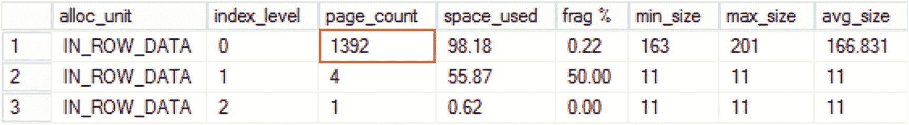

图 6-13

DELETE 语句后的索引统计信息

现在，我们启用`READ COMMITTED SNAPSHOT`隔离级并重复我们的测试。清单 6-11 显示了执行此操作的代码。

```
alter database SQLServerInternals
set read_committed_snapshot on
with rollback immediate;
go
set transaction isolation level read uncommitted
begin tran
delete from Delivery.Orders where OrderId % 2 = 0;
-- update Delivery.Orders set Pieces += 1;
rollback
清单 6-11
乐观隔离级与碎片：在启用 RCSI 的情况下重复测试
```

图 6-14 显示了操作后的索引统计信息。注意，我们使用了`READ UNCOMMITTED`隔离级并回滚了事务。尽管如此，行版本控制仍在使用，这会导致数据删除期间出现页面拆分。

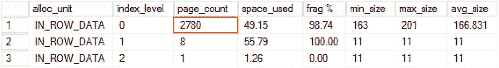

图 6-14

启用 RCSI 后 DELETE 语句的索引统计信息

添加后，14 字节的版本存储指针会保留在行中，即使在记录从版本存储中移除后也是如此。您可以通过执行索引重建来回收此空间。

您需要记住此行为，并将其纳入索引维护策略。如果启用了乐观隔离级，最好不要使用`FILLFACTOR = 100`。这同样适用于定义在具有`AFTER UPDATE`和`AFTER DELETE`触发器的表上的索引。这些触发器依赖于行版本控制，并且在内部也会使用版本存储。

## 总结

SQL Server 在使用乐观隔离级时采用行版本控制模型。查询访问行的“旧”已提交版本，而不是被共享(S)、更新(U)和排他(X)锁的不兼容性所阻塞。有两种可用的乐观事务隔离级：`READ COMMITTED SNAPSHOT`和`SNAPSHOT`。

`READ COMMITTED SNAPSHOT`是一个数据库选项，它会改变`READ COMMITTED`模式下读取者的行为。它不会改变写入者的行为——由于(U)/(U)和(U)/(X)锁的不兼容性，仍然存在阻塞。`READ COMMITTED SNAPSHOT`不需要任何代码更改，并且可以在系统遇到阻塞问题时用作紧急技术。

`READ COMMITTED SNAPSHOT`提供语句级一致性；也就是说，查询读取的是语句开始时数据的快照。

`SNAPSHOT`隔离级是一个独立的事务隔离级，需要在代码中显式指定。此级别提供事务级一致性；也就是说，查询访问的是事务开始时数据的快照。

使用`SNAPSHOT`隔离级时，写入者不会相互阻塞，除非两个会话正在更新相同的行。这种情况要么导致阻塞，要么导致 3960 错误。

虽然乐观隔离级减少了阻塞，但它们会显著增加`tempdb`负载，尤其是在数据不断变化的 OLTP 系统中。它们还通过向数据行添加 14 字节指针来加剧索引碎片。您应在实施阶段考虑使用它们的权衡，执行`tempdb`优化，并监控系统以确保版本存储不被滥用。

## 7. 锁升级

尽管从并发性角度来看行级锁很棒，但它开销很大。在内存中，锁结构在 32 位操作系统中使用 64 字节，在 64 位操作系统中使用 128 字节。保存数百万个行级和页级锁的信息将使用千兆字节的内存。

SQL Server 使用一种称为`锁升级`的技术来减少内存中持有的锁数量，我们将在本章中讨论该技术。


## 锁升级概述

SQL Server 尝试通过一种称为锁升级的简单技术来减少内存消耗和锁管理开销。一旦某个语句在同一个对象上获取了至少 5,000 个行级和页级锁，SQL Server 就会尝试将这些锁升级——或者更准确地说，替换为单个表级锁，或者如果启用了分区，则替换为分区级锁。如果其他会话没有在该对象或分区上持有不兼容的锁，则此操作成功。

当操作成功时，SQL Server 会释放事务在该对象（或分区）上持有的所有行级和页级锁，仅保留对象级（或分区级）锁。如果操作失败，SQL Server 将继续使用行级锁，并在大约每获取 1,250 个新锁后重复升级尝试。除了响应已获取的锁数量外，当实例中的锁总数超过内存或配置阈值时，SQL Server 也可以进行锁升级。

#### 注意

5,000/1,250 的锁数量阈值是一个近似值。触发锁升级的实际获取锁数量可能有所不同，通常略大于该阈值。

让我们看一个例子，在一个使用 `REPEATABLE READ` 隔离级别的事务中运行一个 `SELECT` 语句，该语句统计 `Delivery.Orders` 表中的行数。你会记得，在这种隔离级别下，SQL Server 会一直持有共享（S）锁直到事务结束。

让我们使用 `ALTER TABLE SET (LOCK_ESCALATION=DISABLE)` 命令（稍后会详细介绍）为该表禁用锁升级，并观察 SQL Server 获取的锁数量以及存储它们所需的内存。我们将使用 `(ROWLOCK)` 提示来防止 SQL Server `优化` 锁定，即获取页级共享（S）锁而不是行级锁。此外，在事务仍处于活动状态时，让我们从另一个会话插入另一行，以演示锁升级如何影响系统并发性。

#### 表 7-1

禁用锁升级的测试代码

| 会话 1 | 会话 2 |
| --- | --- |
| `alter table Delivery.Orders``set (lock_escalation=disable);``set transaction isolation level repeatable read``begin tran`       `select count(*)`       `from Delivery.Orders`           `with (rowlock);` |   |
|   | `-- 成功``insert into Delivery.Orders``(OrderDate,OrderNum,CustomerId)``values(getUTCDate(),'99999',100);` |
|        `-- 结果: 10,212,326`       `select count(*) as [Lock Count]`       `from sys.dm_tran_locks;`       `-- 结果: 1,940,272 KB`       `select sum(pages_kb) as [Memory, KB]`       `from sys.dm_os_memory_clerks`       `where type =`           `'OBJECTSTORE_LOCK_MANAGER';``commit` |   |

图 7-1 显示了事务活动期间的 *锁内存（KB）* 系统性能计数器。

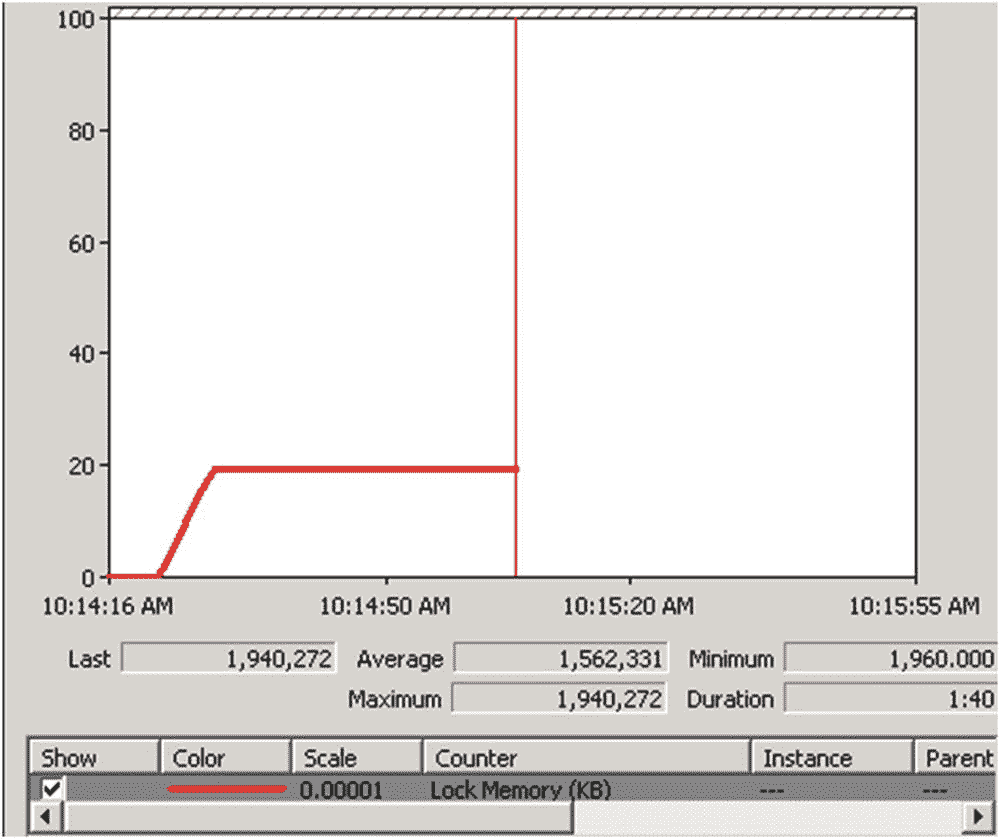

如你所见，从并发角度来看，行级锁定是完美的。只要会话不争夺相同的行，它们就不会相互阻塞。同时，维护大量锁是内存密集型的，而内存是 SQL Server 中最宝贵的资源之一。在我们的示例中，SQL Server 需要维护数百万个锁结构，占用了近 2 GB 的 RAM。这个数字包括行级共享（S）锁以及页级意向共享（IS）锁。此外，维护锁定信息和系统中的大量锁结构也有开销。

让我们看看，如果我们使用 `ALTER TABLE SET (LOCK_ESCALATION=TABLE)` 命令启用默认的锁升进行为，并运行表 7-2 中所示的代码，会发生什么情况。

#### 表 7-2

启用锁升级的测试代码

| 会话 1 (SPID=57) | 会话 2 (SPID=58) |
| --- | --- |
| `alter table Delivery.Orders``set (lock_escalation=table);``set transaction isolation level repeatable read``begin tran`       `select count(*)`       `from Delivery.Orders`           `with (rowlock);` |   |
|   | `-- 该会话被阻塞``insert into Delivery.Orders``(OrderDate,OrderNum,CustomerId)``values(getUTCDate(),'100000',100);` |
|        `select`           `request_session_id as [SPID]`           `,resource_type as [Resource]`           `,request_mode as [Lock Mode]`           `,request_status as [Status]`       `from sys.dm_tran_locks;``commit` |   |

图 7-2 显示了从 `sys.dm_tran_locks` 视图输出的查询结果。

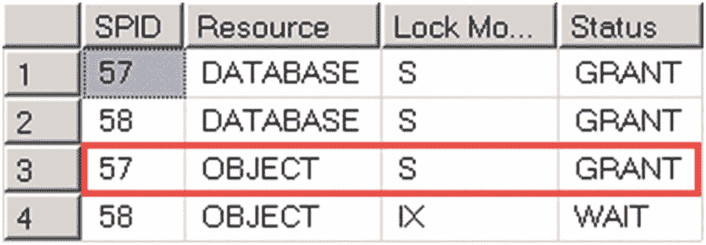


## 启用锁升级时的 Sys.dm_tran_locks 输出

SQL Server 会用对象共享（S）锁替换行级和页级锁。尽管从内存使用角度看这很棒——只需要维护一个锁——但它会影响并发性。正如你所见，第二个会话被阻塞了——它无法在表上获取意向排他（IX）锁，因为它与第一个会话持有的完整共享（S）锁不兼容。

锁粒度提示，例如 `(ROWLOCK)` 和 `(PAGLOCK)`，不会影响锁升级行为。例如，使用 `(PAGLOCK)` 提示时，SQL Server 使用完整的页级锁而非行级锁。然而，如果获取的锁数量超过阈值，这仍然可能触发锁升级。

锁升级默认启用，并且可能引发阻塞问题，这对开发人员和数据库管理员来说可能令人困惑。我们来讨论几种典型情况。

第一种情况是报表查询为了数据一致性目的而使用 `REPEATABLE READ` 或 `SERIALIZABLE` 隔离级别。如果报表查询在没有会话更新数据的情况下读取大量数据，这些查询可能会将共享（S）锁升级到表级。随后，所有写入者都会被阻塞，即使它们试图插入新数据或修改报表查询未读取的数据，正如你在本章前面所见。解决此问题的方法之一是切换到乐观事务隔离级别，我们在前一章中讨论过。

第二种情况是清理过程的实现。假设你需要使用 `DELETE` 语句清理大量旧数据。如果实现方式是一次性删除大量行，你可能会将排他（X）锁升级到表级。这将阻塞所有写入者访问该表，以及处于 `READ COMMITTED`、`REPEATABLE READ` 或 `SERIALIZABLE` 隔离级别的读取者，即使这些查询操作的数据集与你正在清理的数据完全不同。

最后，你可以想象一个使用单个 `INSERT` 语句插入大批量行的过程。与清理过程类似，它可能将排他（X）锁升级到表级，并阻止其他会话访问该表。

所有这些模式都有一个共同点——它们作为单个语句的一部分获取并持有大量行级和页级锁。这会触发锁升级，如果当时没有其他会话在表（或分区）级别持有不兼容的锁，升级就会成功。这将阻止其他会话在第一个会话完成事务之前获取不兼容的意向锁或完整锁（在表或分区上），无论被阻塞的会话是否试图访问受第一个会话影响的数据。

值得再次强调的是，锁升级是由语句获取的锁数量触发的，而不是由整个事务触发的。如果各个语句各自获取的行级和页级锁少于 5,000 个，则不会触发锁升级，无论该事务持有的锁总数是多少。清单 7-1 展示了一个在单个事务中循环运行多个 `UPDATE` 语句的例子。

```sql
declare
@id int = 1
begin tran
while @id < 100000
begin
update Delivery.Orders
set OrderStatusId = 1
where OrderId between @id and @id + 4998;
select @id += 4999;
end
select count(*) as [Lock Count]
from sys.dm_tran_locks
where request_session_id = @@SPID;
commit
```
清单 7-1：锁升级与多条语句


图 7-3：事务持有的锁数量

## 锁升级故障排除

锁升级是完全正常的。它有助于减少锁管理开销和内存使用，从而提高系统性能。除非它开始在系统中引起明显的阻塞问题，否则你应该保持其启用状态。不幸的是，检测锁升级是否导致阻塞并不总是那么容易，你需要分析具体的阻塞案例来理解它。

潜在的由锁升级引起的阻塞的一个迹象是，在等待统计中，意向锁等待 `(LCK_M_I*)` 占比很高。然而，锁升级并非此类等待的唯一原因，你在分析时还需要查看其他指标。


#### 注意

我们将在第 12 章中讨论等待统计分析。

锁升级事件会导致完全的表级锁。你可以在 `sys.dm_tran_locks` 视图输出和被阻塞进程报告中看到这一点。图 7-4 展示了如果你在阻塞发生时运行第 3 章中的清单 3-2 所得到的输出。如你所见，被阻塞的会话正试图在对象上获取一个意向锁，而阻塞会话——即触发锁升级的那个会话——持有一个不兼容的完全锁。

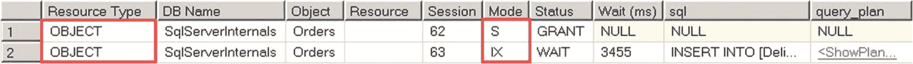

图 7-4. 锁升级期间的清单 3-2 输出 (`sys.dm_tran_locks` 视图)

如果你查看被阻塞进程报告，你会看到被阻塞的进程正在等待对象上的意向锁，如清单 7-2 所示。

```
清单 7-2
被阻塞进程报告（部分）
```

再次提醒，请记住，会话获取完全对象锁或在等待表上的意向锁时被阻塞，可能有其他原因。你必须关联来自其他来源的信息，以确认阻塞是由于锁升级造成的。

你可以使用 SQL 跟踪捕获锁升级事件。图 7-5 展示了 `Profiler` 应用程序中的输出。

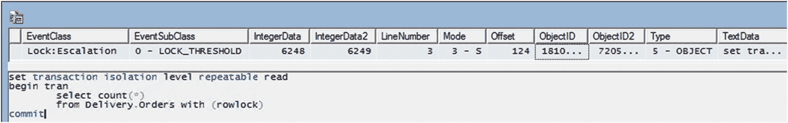

图 7-5. SQL Server Profiler 中显示的锁升级事件

SQL 跟踪提供以下属性：

*   `EventSubClass` 指示是什么触发了锁升级——锁的数量或内存阈值。
*   `IntegerData` 和 `IntegerData2` 显示升级发生时存在的锁数量以及在升级过程中转换了多少个锁。值得注意的是，在我们的示例中，当语句获取了 6,248 个锁而非 5,000 个时，发生了锁升级。
*   `Mode` 告知哪种类型的锁被升级。
*   `ObjectID` 是触发锁升级的表的 `object_id`。
*   `ObjectID2` 是触发锁升级的 `HoBT` ID。
*   `Type` 代表锁升级的粒度。
*   `TextData`、`LineNumber` 和 `Offset` 提供有关触发锁升级的批处理和语句的信息。

另一种也是更好的捕获锁升级发生的方法是使用扩展事件。图 7-6 展示了一个 `lock_escalation` 事件及一些可用的事件字段。此事件在 SQL Server 2012 及更高版本中可用。

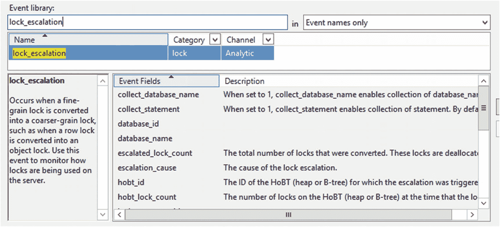

图 7-6. `lock_escalation` 扩展事件

该扩展事件有助于了解哪些对象最常触发锁升级。你可以查询和聚合原始捕获的数据，或者，也可以使用 `histogram` 目标在扩展事件会话中进行聚合。

清单 7-3 展示了后一种方法，按 `object_id` 字段对数据进行分组。此代码适用于 SQL Server 2012 及更高版本。

```sql
create event session LockEscalationInfo
on server
add event
    sqlserver.lock_escalation
    (
        where
            database_id = 5  -- DB_ID()
    )
add target
    package0.histogram
    (
        set
            slots = 1024 -- 基于数据库中的表数量
            ,filtering_event_name = 'sqlserver.lock_escalation'
            ,source_type = 0 -- 事件数据列
            ,source = 'object_id' -- 分组列
    )
with
    (
        event_retention_mode=allow_single_event_loss
        ,max_dispatch_latency=10 seconds
    );
alter event session LockEscalationInfo
on server
state=start;
```
清单 7-3. 使用 xEvents 捕获锁升级事件的发生次数

清单 7-4 中的代码查询会话目标并返回基于每个表的锁升级次数。

```sql
;with TargetData(Data)
as
(
    select convert(xml,st.target_data) as Data
    from sys.dm_xe_sessions s join sys.dm_xe_session_targets st on
        s.address = st.event_session_address
    where s.name = 'LockEscalationInfo' and st.target_name = 'histogram'
)
,EventInfo([count],object_id)
as
(
    select
        t.e.value('@count','int')
        ,t.e.value('((./value)/text())[1]','int')
    from
        TargetData cross apply
        TargetData.Data.nodes('/HistogramTarget/Slot') as t(e)
)
select
    e.object_id
    ,s.name + '.' + t.name as [table]
    ,e.[count]
from
    EventInfo e join sys.tables t on
        e.object_id = t.object_id
    join sys.schemas s on
        t.schema_id = s.schema_id
order by
    e.count desc;
```
清单 7-4. 分析捕获的结果

你不应仅仅为了禁用锁升级而使用此数据。然而，当分析涉及对象级阻塞的阻塞案例时，它非常有用。

我想重申，锁升级是完全正常的，并且是 SQL Server 中一个非常有用的功能。尽管它可能引起阻塞问题，但它有助于保留 SQL Server 内存。实例持有的大量锁会减少缓冲池的大小。因此，缓存中的数据页会减少，这可能导致更多的物理 I/O 操作并降低查询性能。

此外，当没有可用内存来存储锁信息时，SQL Server 可能会终止查询并返回错误 1204。图 7-7 显示了这样一个错误消息。

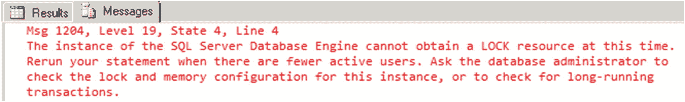

图 7-7. 错误 1204

在 SQL Server 2008 及更高版本中，你可以使用 `ALTER TABLE SET LOCK_ESCALATION` 语句在表级别控制升级行为。此选项影响为表定义的所有索引（包括聚集索引和非聚集索引）的锁升级行为。提供三个选项：

*   `DISABLE:` 此选项禁用特定表的锁升级。
*   `TABLE:` SQL Server 将锁升级到表级别。这是默认选项。
*   `AUTO:` 当表已分区时，SQL Server 将锁升级到分区级别；当表未分区时，升级到表级别。对于大型分区表，尤其是当有大型报告或清理查询在旧数据上运行时，请使用此选项。

#### 注意

`sys.tables` 目录视图在 `lock_escalation` 和 `lock_escalation_desc` 列中提供了有关表锁升级模式的信息。

不幸的是，SQL Server 2005 不支持此选项，在该版本中禁用锁升级的唯一方法是使用有记录的跟踪标志 `T1211` 或 `T1224`，在实例或会话级别进行设置。请记住，你需要拥有 `sysadmin` 权限才能调用 `DBCC TRACEON` 命令并在会话级别设置跟踪标志。

*   `T1211` 禁用锁升级，无论内存条件如何。
*   `T1224` 基于锁数量阈值禁用锁升级，尽管在内存压力下仍可能触发锁升级。


## 注意事项

你可以在 [`https://docs.microsoft.com/en-us/sql/t-sql/database-console-commands/dbcc-traceon-trace-flags-transact-sql`](https://docs.microsoft.com/en-us/sql/t-sql/database-console-commands/dbcc-traceon-trace-flags-transact-sql) 阅读更多关于跟踪标志 `T1211` 和 `T1224` 的信息。

与其他阻塞问题一样，你应该找到锁升级的根本原因。你还应该考虑在系统中的特定表上禁用锁升级的利弊。虽然这可能会减少系统中的阻塞，但 SQL Server 将使用更多内存来存储锁信息。当然，你也可以将代码重构视为另一种选择。

如果锁升级是由写入者触发的，你可以减少批处理的大小，直到每个对象获取的行级和页级锁少于 5,000 个。你仍然可以在同一个事务中处理多个批处理——5,000 个锁的阈值是每个语句的。同时，你应该记住，较小的批处理通常比较大的批处理效率低。你需要微调批处理大小并找到最优值。如果对象级锁没有被保持过长时间和/或其他会话没有受到影响，触发锁升级是正常的。

至于由读取者触发的锁升级，你应该避免持有许多共享 (S) 锁的情况。一个例子是由于未优化的查询或报表查询在 `REPEATABLE READ` 或 `SERIALIZABLE` 事务隔离级别下进行扫描，这些查询会持有共享 (S) 锁直到事务结束。清单 7-5 中显示的示例使用 `SERIALIZABLE` 隔离级别从 `Delivery.Orders` 表运行 `SELECT`。

```
set transaction isolation level serializable
begin tran
select OrderId, OrderDate, Amount
from Delivery.Orders with (rowlock)
where OrderNum = '1';
select
resource_type as [Resource Type]
,case resource_type
when 'OBJECT' then
object_name
(
resource_associated_entity_id
,resource_database_id
)
when 'DATABASE' then 'DB'
else
(
select object_name(object_id, resource_database_id)
from sys.partitions
where hobt_id = resource_associated_entity_id
)
end as [Object]
,request_mode as [Mode]
,request_status as [Status]
from sys.dm_tran_locks
where request_session_id = @@SPID;
commit
Listing 7-5
由未优化查询触发的锁升级
```

图 7-8 显示了来自 `sys.dm_tran_locks` 视图的第二个查询的输出。

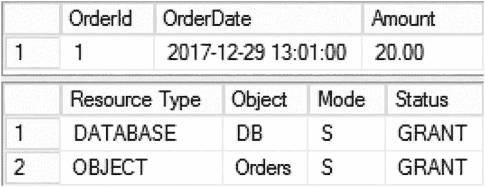

图 7-8

在 SERIALIZABLE 隔离级别中选择数据

即使查询只返回一行，你也会看到共享 (S) 锁已升级到表级别。和往常一样，我们需要查看执行计划（如图 7-9 所示）来对其进行故障排除。

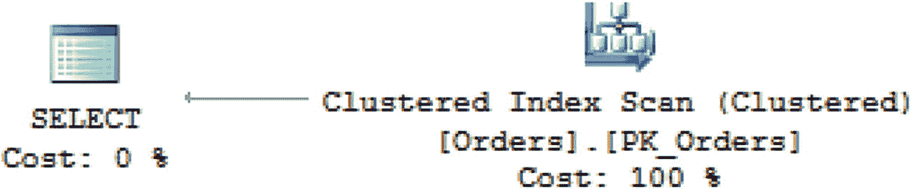

图 7-9

查询的执行计划

`OrderNum` 列上没有索引，SQL Server 使用了 `Clustered Index Scan` 运算符。尽管查询只返回一行，但由于 `SERIALIZABLE` 隔离级别，它获取并保持了它读取的所有行的共享 (S) 范围锁。结果，触发了锁升级。如果你在 `OrderNum` 列上添加索引，它会将执行计划更改为 `Nonclustered Index Seek`。只读取一行，获取并保持的行级和页级锁非常少，因此不需要锁升级。

在某些情况下，你可以考虑对表进行分区，并使用 `ALTER TABLE SET (LOCK_ESCALATION=AUTO)` 语句将锁升级选项设置为使用分区级升级，而不是表级。在必须使用 `DELETE` 语句清除旧数据或在 `REPEATABLE READ` 或 `SERIALIZABLE` 隔离级别下对旧数据运行报表查询的情况下，这可能会有所帮助。在这些情况下，语句会将锁升级到分区，而不是表，而不访问这些分区的查询将不会被阻塞。

在其他情况下，你可以切换到乐观隔离级别。最后，在 `READ UNCOMMITTED` 事务隔离级别下，你不会有任何与读取者相关的阻塞问题，因为不会获取共享 (S) 锁，但由于它带来的所有其他数据一致性问题，不推荐使用此方法。

## 总结

在语句获取并保持大约 5,000 个行级和页级锁后，SQL Server 会将锁升级到对象或分区级别。当升级成功时，SQL Server 保留单个对象级锁，阻止具有不兼容锁类型的其他会话访问表。如果升级失败，SQL Server 会在大约每获取 1,250 个新锁后重复升级尝试。

锁升级完全符合“视情况而定”的类别。它减少了 SQL Server 锁管理器的内存使用和维护大量锁的开销。同时，由于持有的对象或分区级锁，它可能会增加系统中的阻塞。

你应该保持锁升级启用，除非你发现它在系统中引入了明显的阻塞问题。即使在这些情况下，你也应该进行根本原因分析，以了解为何会发生由锁升级引起的阻塞，并评估禁用它的利弊。你还应该查看其他可用选项，例如代码和数据库模式重构、查询调优以及切换到乐观事务隔离级别。这些选项中的任何一个都可能是比禁用锁升级更好的选择，以解决你的阻塞问题。

