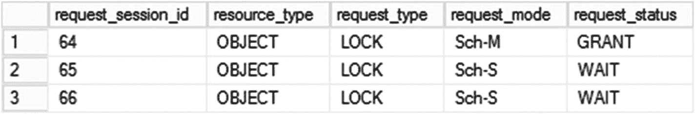
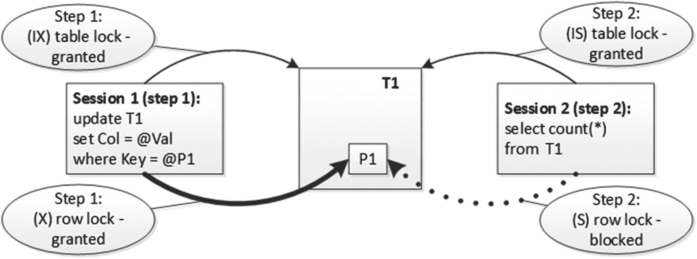
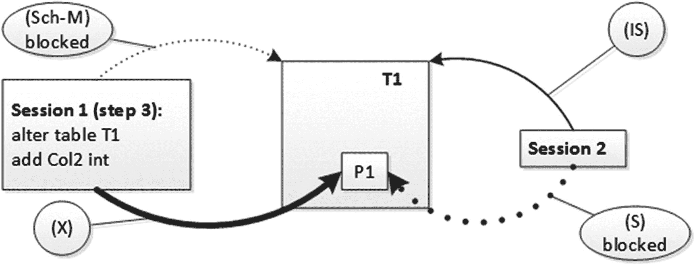
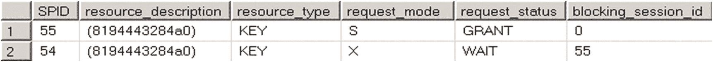
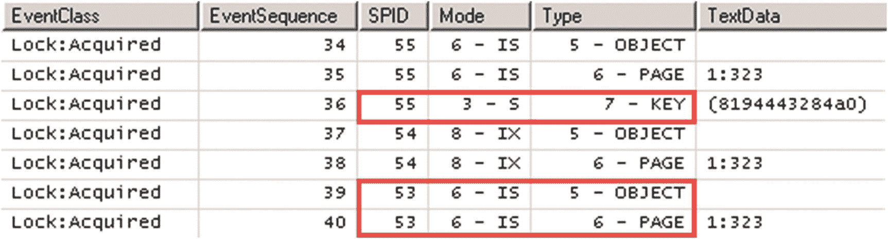
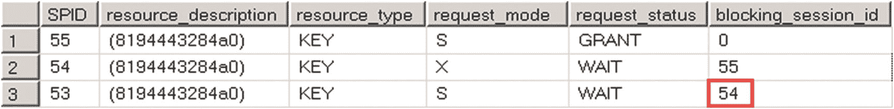
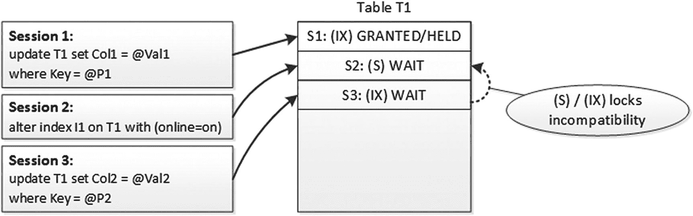
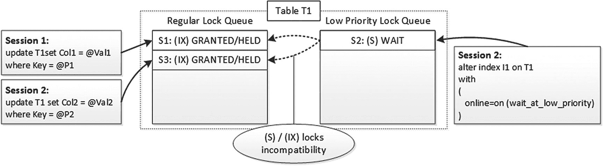
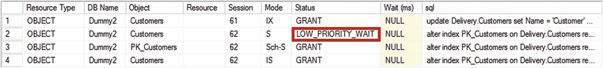

# 8. 模式锁和低优先级锁

SQL Server 使用两种额外的锁类型，称为模式锁，以防止在查询执行期间更改表和元数据。本章将深入讨论模式锁以及低优先级锁，后者在 SQL Server 2014 中引入，旨在减少在线索引重建和分区切换操作期间的阻塞。

## 模式锁

SQL Server 需要保护数据库元数据，以防止在查询执行过程中更改表结构的情况。这个问题比看起来更复杂。虽然理论上独占 (X) 表锁可以在 `ALTER TABLE` 操作期间阻止对表的访问，但它们在 `READ UNCOMMITTED`、`READ COMMITTED SNAPSHOT` 和 `SNAPSHOT` 隔离级别中不起作用，因为在这些级别下读取者不获取意向共享 (IS) 表锁。

SQL Server 使用两种额外的锁类型来解决这个问题：模式稳定性 (Sch-S) 锁和模式修改 (Sch-M) 锁。模式修改 (Sch-M) 锁在发生任何元数据更改时以及执行 `TRUNCATE TABLE` 语句期间获取。你可以将这种锁类型视为“超级锁”。它与任何其他锁类型都不兼容，并且完全阻止对对象的访问。

像独占 (X) 锁一样，模式修改 (Sch-M) 锁会一直保持到事务结束。在显式事务中运行 DDL 语句时，你需要记住这一点。虽然这允许你在发生错误时回滚所有模式更改，但它也会阻止对受影响对象的任何访问，直到事务提交。


### 重要提示

许多数据库架构比较工具会在修改脚本中使用显式事务。当你在其他用户正在访问系统的实时服务器上运行此脚本时，这可能会导致严重的阻塞。

SQL Server 在修改分区函数时也会使用架构修改锁。当此类修改导致数据移动或扫描时，这会严重影响系统的可用性。所有使用该分区函数的分区表的访问都会被阻塞，直到操作完成。

### 架构稳定性锁

`架构稳定性锁`在 DML 查询编译和执行期间使用。SQL Server 会获取它，无论事务隔离级别如何，即使在`READ UNCOMMITTED`模式下也是如此。它们的唯一目的是在查询访问表时，保护表不被更改或删除。`架构稳定性锁`与任何其他锁类型都兼容，但`架构修改锁`除外。

SQL Server 可以执行一些优化来减少获取的锁数量。虽然在查询编译期间始终使用`架构稳定性锁`，但 SQL Server 可以在查询执行期间用意向对象锁替换它。让我们看一下表 8-1 中的示例。

### 架构锁：查询编译

表 8-1

| 会话 1 (SPID=64) | 会话 2 (SPID=65) | 会话 3 (SPID=66) |
| --- | --- | --- |
| `begin tran`<br>`alter table Delivery.Orders`<br>`add Dummy int;` |  |  |
|  | `select count(*) from Delivery.Orders with (nolock);` | `delete from Delivery.Orders where OrderId = 1;` |
| `select`<br>`request_session_id, resource_type, request_type, request_mode, request_status`<br>`from sys.dm_tran_locks`<br>`where resource_type = 'OBJECT';`<br>`rollback` |  |  |

第一个会话启动事务并修改表，在那里获取了一个`架构修改锁`。在下一步中，另外两个会话分别在`READ UNCOMMITTED`隔离级别下运行`SELECT`语句和`DELETE`语句。

如图 8-1 所示，会话 2 和 3 因等待查询编译所需的`架构稳定性锁`而被阻塞。



图 8-1
查询编译期间的架构锁

### 带有缓存计划的架构锁

如果你第二次运行该示例，此时查询已被编译且计划已缓存，你会看到略有不同的情况，如图 8-2 所示。


图 8-2
执行计划被缓存时的架构锁

第二个会话仍然会等待授予`架构稳定性锁`。在`READ UNCOMMITTED`模式下没有`共享锁`，而`架构稳定性锁`是在执行期间保持架构稳定的唯一方式。但是，运行`DELETE`语句的会话会等待`意向排他锁`。无论如何都需要获取该锁类型，因为它也与`架构修改锁`不兼容并能防止架构被更改，所以它可以替换`架构稳定性锁`。

### 混合锁导致的死锁

在同一事务中混合使用`架构修改锁`与其他锁类型会增加死锁的可能性。假设我们有两个会话：第一个启动事务，并更新表中的一行。此时，它持有该行上的`排他锁`以及页和表上的两个`意向排他锁`。如果另一个会话尝试读取（或更新）同一行，它将被阻塞。此时，它会等待该行上的`共享锁`，并在页和表上持有`意向共享锁`。此阶段如图 8-3 所示。（省略了页级意向锁。）



图 8-3
由于混合 DDL 和 DML 语句导致的死锁：步骤 1 和 2

如果此时第一个会话想要修改表，它需要获取`架构修改锁`。该锁类型与任何其他锁类型都不兼容，而该会话会被第二个会话持有的`意向共享锁`阻塞，这导致了死锁条件，如图 8-4 所示。



图 8-4
由于混合 DDL 和 DML 语句导致的死锁：步骤 3

值得注意的是，这种特定的死锁模式可能发生在任何完整的表级锁上。然而，`架构修改锁`由于与系统中所有其他锁类型不兼容，增加了死锁的可能性。


### 锁队列与锁兼容性

到目前为止，我们所讨论的阻塞情况仅涉及两个会话，并且资源上已持有不兼容的锁类型。在实际情况中，问题通常更为复杂。在繁忙的系统中，同时有数十甚至数百个会话访问同一资源（例如一个表）是很常见的。让我们通过几个例子，来分析在多会话场景下的锁兼容性规则。

#### 多会话与 READ COMMITTED 隔离级别

首先，让我们看一个多个会话获取行级锁的场景。如表 8-2 所示，第一个会话`(SPID=55)`在该行上持有一个共享锁(`S`)。第二个会话`(SPID=54)`试图在同一行上获取一个排他锁(`X`)，但由于锁不兼容而被阻塞。第三个会话`(SPID=53)`在`READ COMMITTED`事务隔离级别下读取同一行。该会话没有被阻塞。

**表 8-2：多会话与锁兼容性：READ COMMITTED 隔离级别**

| 会话 1 (SPID=55) | 会话 2 (SPID=54) | 会话 3 (SPID=53) |
| --- | --- | --- |
| ```begin tran    select OrderId, Amount    from Delivery.Orders        with (repeatableread)    where OrderId = 1;``` | | |
| | ```-- 被阻塞 delete from Delivery.Orders where OrderId = 1;``` | ```-- 成功 select OrderId, Amount from Delivery.Orders    with (readcommitted)where OrderId = 1;``` |
| ```    select          l.request_session_id as [SPID]        ,l.resource_description        ,l.resource_type        ,l.request_mode        ,l.request_status        ,r.blocking_session_id    from          sys.dm_tran_locks l join    sys.dm_exec_requests r on    l.request_session_id =                r.session_id    where l.resource_type = 'KEY'rollback``` | | |

图 8-5 展示了在`OrderId=1`的行上持有的行级锁。



如图 8-6 所示，第三个会话(`SPID=53`)甚至没有尝试在该行上获取共享锁(`S`)。该行上已经有一个由第一个会话(`SPID=55`)持有的共享锁(`S`)，这保证了该行没有被未提交的事务修改过。在`READ COMMITTED`隔离级别下，共享锁(`S`)在行被读取后会立即释放。因此，会话 3(`SPID=53`)在读取该行后无需持有自己的共享锁(`S`)，它可以依赖来自会话 1 的锁。



#### 多会话与 REPEATABLE READ 隔离级别

让我们修改例子，看看如果第三个会话尝试在`REPEATABLE READ`隔离级别下读取该行会发生什么。在该隔离级别下，共享锁(`S`)需要持有到事务结束，如表 8-3 所示。这种情况下，第三个会话不能依赖来自其他会话的共享锁(`S`)，因为它的生命周期可能不同。该会话需要获取自己的共享锁(`S`)，但将被队列中第二个会话持有的不兼容排他锁(`X`)所阻塞。

**表 8-3：多会话与锁兼容性 (REPEATABLE READ 隔离级别)**

| 会话 1 (SPID=55) | 会话 2 (SPID=54) | 会话 3 (SPID=53) |
| --- | --- | --- |
| ```begin tran  select OrderId, Amount  from Delivery.Orders       with (repeatableread)  where OrderId = 1;``` | | |
| | ```-- 被阻塞 delete from Delivery.Orders where OrderId = 1;``` | ```-- 被阻塞 select OrderId, Amountfrom Delivery.Orders    with (repeatableread)where OrderId = 1;``` |
| ```  select      l.request_session_id       as [SPID],l.resource_description    ,l.resource_type    ,l.request_mode    ,l.request_status,r.blocking_session_id  from      sys.dm_tran_locks l join    sys.dm_exec_requests r        on    l.request_session_id =            r.session_id  where l.resource_type = 'KEY';rollback``` | | |

图 8-7 展示了此时的行级锁请求。



#### 重要结论

这让我们得出一个非常重要的结论：一个锁要被授予，必须与该资源上的**所有**锁请求（无论是否已授予）都兼容。


### 重要提示

第一种场景，当第三个会话在 `READ COMMITTED` 隔离级别下运行且未获取到资源上的锁时，可以被视为一种内部优化，但你不应依赖于此。在某些情况下，SQL Server 在 `READ COMMITTED` 模式下仍然会尝试获取资源上的另一个共享 (S) 锁，即使该资源上已经存在另一个共享 (S) 锁。在这种情况下，查询将像在 `REPEATABLE READ` 隔离级别示例中一样被阻塞。

不幸的是，SQL Server 中的会话不会重用其他会话在表级别的锁。无法估计任何表级锁意图、完全锁或架构稳定性锁需要保持的时间。会话将始终尝试获取对象级锁，如果锁队列中存在任何其他不兼容的锁类型，它将被阻塞。

这种行为可能会在系统中引入严重的阻塞问题。最常见的案例之一是在线索引重建操作。尽管它在重建过程中持有意向共享 (IS) 表锁，但它需要在开始时获取一个共享 (S) 表锁，并在执行的最后阶段获取一个架构修改 (Sch-M) 锁。这两个锁的持有时间都非常短；然而，它们在繁忙的 OLTP 环境中可能会引发阻塞问题。

考虑这样一种情况：当另一个活动事务正在修改表中的数据时，你启动了在线索引重建。该事务将持有表上的意向排他 (IX) 锁，这会阻止在线索引重建获取共享 (S) 表锁。锁请求将在队列中等待，并阻塞所有其他想要修改表中数据并请求意向排他 (IX) 锁的事务。图 8-8 说明了这种情况。


图 8-8
索引重建初始阶段的阻塞

只有当第一个事务完成，并且在线索引重建获取并释放了共享 (S) 表锁后，这种阻塞状况才会清除。同样，更严重的阻塞可能发生在在线索引重建的最后阶段，此时它需要获取一个架构修改 (Sch-M) 锁以在元数据中替换索引引用。在索引重建等待架构修改 (Sch-M) 锁被授予期间，读取者和写入者都将被阻塞。

在分区切换操作期间也可能发生类似的阻塞，该操作也会获取架构修改 (Sch-M) 锁。尽管分区切换是在元数据级别完成且速度非常快，但架构修改 (Sch-M) 锁在队列中等待被授予时会阻塞其他会话。

在设计索引维护和分区管理策略时，你需要记住这一行为。在 SQL Server 的非企业版，甚至在 SQL Server 2014 之前的企业版中，能做的很少。你可以在系统负载最低的时间段安排操作运行。或者，你可以使用 `LOCK_TIMEOUT` 设置编写代码来终止操作。

清单 8-1 说明了这种方法。你可以将其用于离线索引重建和分区切换操作。在离线索引重建期间，当架构修改 (Sch-M) 锁被持有时，你仍然会遇到阻塞。但是，如果在 `LOCK_TIMEOUT` 间隔内无法获取此锁，你将消除阻塞。请记住，当 `XACT_ABORT` 设置为 `OFF` 时，锁超时错误不会回滚事务。请使用适当的事务管理和错误处理，正如我们在第 2 章讨论的那样。

另外，作为另一个告诫，不要在在线索引重建中使用 `LOCK_TIMEOUT`，因为它可能会在会话等待架构修改 (Sch-M) 锁以在元数据中替换索引定义时，在最后阶段终止并回滚操作。

```sql
set xact_abort off
set lock_timeout 100 -- 100 milliseconds
go
declare
    @attempt int = 1
    ,@maxAttempts int = 10
while @attempt <= @maxAttempts
begin
    begin try
        raiserror('Rebuilding index. Attempt %d / %d',0,1,@attempt,@maxAttempts) with nowait;
        alter index PK_Orders
        on Delivery.Orders rebuild
        with (online = off);
        break;
    end try
    begin catch
        if ERROR_NUMBER() = 1222 and @attempt < @maxAttempts
        begin
            set @attempt += 1;
            waitfor delay '00:00:15.000';
        end
        else
            throw;
    end catch
end;
```
清单 8-1
减少离线索引重建期间的阻塞

幸运的是，SQL Server 2014 及以上版本的企业版提供了一种更好的方法来处理此问题。

## 低优先级锁

SQL Server 2014 引入了一个新功能——低优先级锁，它有助于减少在线索引重建和分区切换操作期间的阻塞。从概念上讲，你可以将低优先级锁视为驻留在与常规锁不同的锁队列中。

图 8-9 说明了这一点。


图 8-9
低优先级锁

### 重要提示

必须记住，一旦获取了低优先级锁，其行为将与常规锁相同，阻止其他会话在该资源上获取不兼容的锁。

图 8-10 展示了第 3 章清单 3-2 中查询的输出。它演示了低优先级锁如何在 `sys.dm_tran_locks` 视图输出中显示。值得注意的是，该视图不提供这些锁的等待时间。


图 8-10
`sys.dm_tran_locks` 数据管理视图中的低优先级锁

你可以在 `ALTER INDEX` 和 `ALTER TABLE` 语句中使用 `WAIT_AT_LOW_PRIORITY` 子句来指定锁优先级，如清单 8-2 所示。

```sql
alter index PK_Customers on Delivery.Customers rebuild
with
(
    online=on
    (
        wait_at_low_priority(   max_duration=10 minutes  ,abort_after_wait=blockers )
    )
);
alter table Delivery.Orders
switch partition 1 to Delivery.OrdersTmp
with
(
    wait_at_low_priority (   max_duration=60 minutes  ,abort_after_wait=self )
)
```
清单 8-2
指定锁优先级

如你所见，`WAIT_AT_LOW_PRIORITY` 有两个选项。`MAX_DURATION` 设置指定以分钟为单位的锁等待时间。`ABORT_AFTER_WAIT` 设置定义了如果在指定时间限制内无法获取锁时，会话的行为。可能的值为：

*   `NONE`：低优先级锁转换为常规锁。之后，它的行为就像常规锁一样，会阻塞尝试在该资源上获取不兼容锁类型的其他会话。会话继续等待，直到锁被获取。
*   `SELF`：如果在 `MAX_DURATION` 设置指定的时间内无法授予锁，则操作将中止。
*   `BLOCKERS`：所有持有该资源锁的会话都将被中止，等待低优先级锁的会话将能够获取它。


#### 注意

省略 `WAIT_AT_LOW_PRIORITY` 选项的效果与指定 `WAIT_AT_LOW_PRIORITY(MAX_DURATION=0 MINUTES, ABORT_AFTER_WAIT=NONE)` 相同。

非常活跃的 OLTP 表总是有大量的并发会话访问它们。因此，即使指定了较长的 `MAX_DURATION`，会话仍有可能无法获得低优先级锁。你可以考虑使用 `ABORT_AFTER_WAIT=BLOCKERS` 选项，这将允许操作完成，尤其是在客户端应用程序实现了适当的异常处理和重试逻辑的情况下。

最后值得注意的是，在线索引重建仅在 SQL Server 的企业版和 Microsoft Azure SQL 数据库中受支持。在其他版本中，无法在索引重建期间使用低优先级锁。然而，从 SQL Server 2016 SP1 开始，表分区在非企业版本中也得到支持，并且你可以在任何版本的 SQL Server 中在此场景下使用低优先级锁。

## 总结

SQL Server 使用架构锁在查询编译和执行期间保护元数据不被更改。SQL Server 中有两种类型的架构锁：架构稳定性锁 (`Sch-S`) 和架构修改锁 (`Sch-M`)。

在查询编译和执行期间，会在查询引用的对象上获取架构稳定性 (`Sch-S`) 锁。但在某些情况下，SQL Server 可以用意向表锁替换架构稳定性 (`Sch-S`) 锁，这也能保护表架构。架构稳定性 (`Sch-S`) 锁与任何其他锁类型兼容，除了架构修改 (`Sch-M`) 锁。

架构修改 (`Sch-M`) 锁与任何其他锁类型都不兼容。SQL Server 在 DDL 操作期间使用它们。如果 DDL 操作需要扫描或修改数据（例如，向表添加受信任的外键约束或在非空分区上修改分区函数），则架构修改 (`Sch-M`) 锁将在整个操作期间保持。在大型表上，这可能需要很长时间，并导致系统中出现严重的阻塞问题。在设计并行运行 DDL 和 DML 操作的系统时，你需要牢记这一点。

为了被授予，一个锁需要与该资源上所有（无论是否已授予的）锁请求兼容。这可能导致在繁忙的系统中，当某个会话请求表上的架构修改 (`Sch-M`) 锁或完整的对象级锁时，出现严重的阻塞。在系统设计索引或分区维护策略时，你需要记住这种行为。

SQL Server 2014 及以上版本支持低优先级锁，可用于减少在线索引重建和分区切换操作期间的阻塞。当操作正在等待获取低优先级锁时，这些锁不会阻塞请求不兼容锁类型的其他会话。

