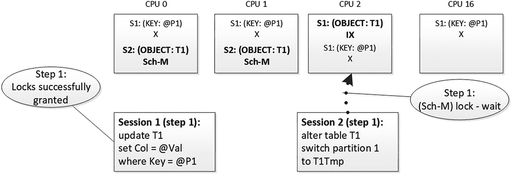
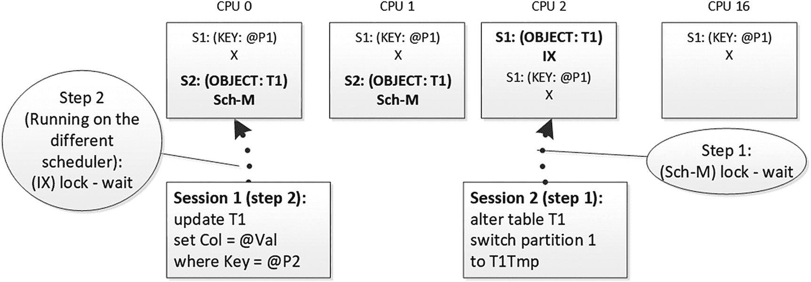
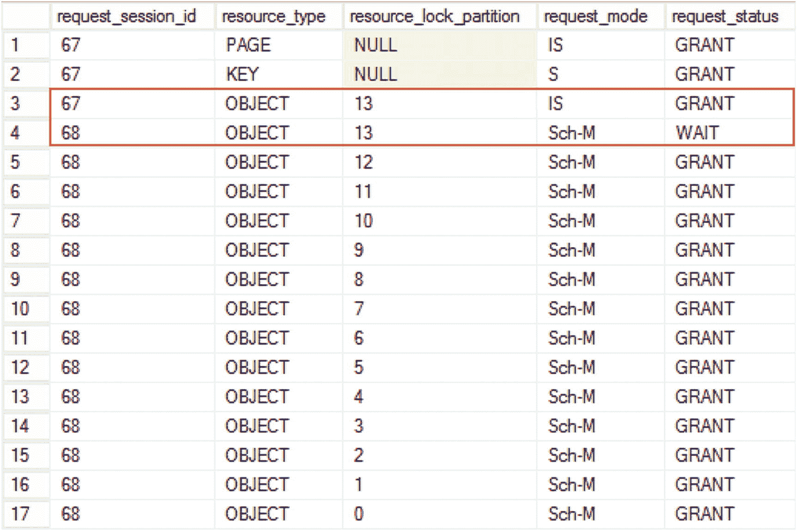
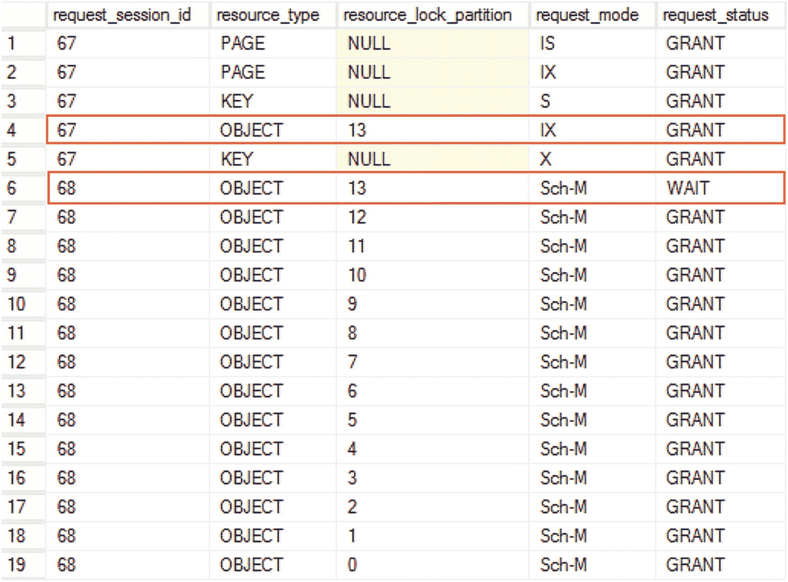

# 9. 锁分区

与其它现代数据库引擎一样，SQL Server 设计用于在具有大量 CPU 的服务器上运行。它具有许多优化措施，帮助引擎在此类环境中扩展并高效工作。

本章将讨论其中一项优化：锁分区，当服务器具有 16 个或更多逻辑 CPU 时，该功能会自动启用。

## 锁分区概述

众所周知，硬件成本随着时间的推移不断下降，使我们能够构建更强大的服务器。二十年前，数据库服务器通常只有一个或极少数 CPU。如今，使用具有几十个甚至有时数百个核心的服务器已经非常普遍。

大多数多 CPU 服务器使用*非统一内存访问 (NUMA)* 架构构建。在此架构中，物理 CPU 被分区为称为 *NUMA 节点* 的组。内存也在各节点间进行分区，每个节点使用独立的系统总线来访问其内存。每个处理器都可以访问系统中的所有内存；但是，访问属于 CPU 的 NUMA 节点的*本地内存* 比访问来自不同 NUMA 节点的*外部内存* 更快。

#### 注意

你可以在 [`https://technet.microsoft.com/en-us/library/ms178144.aspx`](https://technet.microsoft.com/en-us/library/ms178144.aspx) 阅读更多关于 NUMA 架构的信息。

SQL Server 原生支持 NUMA 架构，并拥有一些内部优化来利用它。例如，SQL Server 总是尝试为线程分配本地内存，并且它还具有基于每个 NUMA 节点的分布式 I/O 线程。

此外，各种缓存和队列在 NUMA 节点级别——有时是调度器级别——进行分区，这减少了多个调度器（逻辑 CPU）访问它们时可能出现的争用。这包括系统中的锁队列。当系统有 16 个或更多逻辑处理器时，SQL Server 开始使用一种称为*锁分区*的技术。

启用锁分区后，SQL Server 开始基于每个调度器存储锁信息。在此模式下，对象级的意向共享锁 (`IS`)、意向排他锁 (`IX`) 和架构稳定性锁 (`Sch-S`) 在执行批处理的 CPU（调度器）上的单个分区中获取和存储。所有其他锁类型需要在所有分区上获取。

从锁兼容性的角度来看，这没有任何改变。例如，当会话需要获取表的排他 (`X`) 锁时，它会遍历所有锁分区，如果任何分区在表上持有不兼容的意向锁，则会被阻塞。然而，这可能导致一种有趣的情况：一个对象级锁在部分分区上被授予，但在另一个持有不兼容意向 (`I*`) 或架构稳定性 (`Sch-S`) 锁的分区上被阻塞。

让我们看一个演示这种情况的例子。正如我已经提到的，锁分区在具有 16 个或更多逻辑 CPU 的服务器上自动启用。你可以使用未公开的启动参数 `-P` 来更改测试系统中的调度器数量。*切勿在生产环境中使用此参数！*

清单 9-1 展示了一个查询，该查询启动一个事务，并在 `REPEATABLE READ` 隔离级别下从表中选择一行，该隔离级别会持有共享 (`S`) 锁直到事务结束。接下来，它使用 `sys.dm_tran_locks` 视图获取会话持有的锁的信息。我在测试环境中使用 `-P16` 启动参数运行此代码，这将创建 16 个调度器并启用锁分区。

```
begin tran
select *
from Delivery.Orders with (repeatableread)
where OrderId = 100;
select
request_session_id
,resource_type
,resource_lock_partition
,request_mode
,request_status
from sys.dm_tran_locks
where request_session_id = @@SPID;
```
**清单 9-1** 锁分区：更新表中的一行

图 9-1 展示了 `SELECT` 语句的输出。`resource_lock_partition` 列指示锁存储在哪个分区（`NULL` 表示锁未分区，并在所有分区上获取）。如你所见，表级的意向共享 (`IS`) 锁已分区并存储在分区四中。页级和行级锁未分区，存储在所有分区中。


**图 9-1** 更新后的锁请求

现在，让我们在另一个会话中运行代码，该会话希望使用 `ALTER INDEX PK_Orders on Delivery.Orders REBUILD` 命令对同一表执行索引重建。此操作需要在表上获取架构修改 (`Sch-M`) 锁。这种锁类型是非分区的，需要在系统中的所有分区上获取。


## 锁分区的潜在问题

锁分区可能导致在繁忙系统中，当会话试图获取架构修改（Sch-M）锁或全表锁时，出现长时间的阻塞。SQL Server 将以顺序方式遍历所有分区，在授予当前请求之前不会移动到下一个分区。在此期间，所有在请求已被授予的调度器上运行的其他会话都将被阻塞。

这种情况最常见的例子是在其他用户访问系统时在线进行架构更改。类似地，在在线索引重建和与表分区相关的操作（例如分区函数更改和分区切换）期间也可能出现此问题。幸运的是，低优先级锁可以优雅地处理锁分区，它们不会在低优先级队列中等待时引入阻塞。

最后，锁分区会增加锁管理器的内存消耗。非分区锁保存在每个分区中，这对于具有大量调度器的系统来说可能非常耗费内存。并非所有行级和页级锁都会被分区；因此，在不会给系统带来明显阻塞的情况下，保持锁升级开启是有益的。

## 由于锁分区导致的死锁

当 SQL Server 从客户端接收到一个批处理时，它会将该批处理分配给一个或（在并行执行计划的情况下）多个调度器。除了极少数例外，在批处理完成之前，它不会更改调度器。然而，来自同一会话的后续批处理可能会被分配到不同的调度器。尽管 SQL Server 倾向于为所有会话请求重用同一个调度器，但这并不能保证，尤其是在繁忙的系统中。

#### 注意

你可以通过运行 `SELECT scheduler_id FROM sys.dm_exec_requests WHERE session_id = @@SPID` 语句来分析会话调度器分配情况。

这种行为可能导致繁忙系统中难以解释的死锁。假设你有一个会话启动了一个事务并更新了表中的一行。我们假设该批处理正在调度器/逻辑 CPU 2 上运行。此会话获取了一个意向排他（IX）表锁，该锁是分区的并仅存储在调度器 2 上。它还获取了一个行级排他（X）锁，该锁不是分区的，存储在所有分区中。（为了简单起见，我再次省略了页级意向锁。）

假设你有第二个会话试图更改该表并获取架构修改（Sch-M）锁。此锁类型是非分区的，因此该会话需要在每个调度器上获取它。它成功地获取并持有了调度器 0 和 1 上的锁，但由于架构修改（Sch-M）锁与在那里持有的意向排他（IX）锁不兼容，它在调度器 2 上被阻塞。图 9-4 说明了这种情况。


**图 9-4**
由于锁分区导致的死锁：步骤 1

现在假设会话 1 需要更新同一表中的另一行，并且该批处理已被分配到另一个调度器——0 或 1。该会话需要在新的锁分区中获取另一个意向表锁，但它将被那里的架构修改（Sch-M）锁阻塞，这将导致死锁，如图 9-5 所示。


**图 9-5**
由于锁分区导致的死锁：步骤 2

正如你可以猜到的，这个死锁的发生是因为同一事务的第二个批处理运行在与第一个批处理不同的调度器上。发生这种情况的一个例子是客户端应用程序在多个单独的批处理中逐行执行数据修改。你可以通过将所有更新批处理在一起（例如，使用表值参数）来减少可能的死锁机会。这也有助于提高操作的性能。

幸运的是，在许多情况下，SQL Server 能够从不同的锁分区中*重用*意向锁并避免这种死锁。然而，这种行为没有文档记录或保证。此外，如果第二个批处理需要获取全表锁，它将无法工作；在这种情况下会发生死锁。

让我们看一个例子，并运行清单 9-2 中的代码。在我的案例中，该批处理在 `SPID=67` 的会话中运行在调度器 13 上。

```
begin tran
select *
from Delivery.Orders with (repeatableread)
where OrderId = 100;
```
*清单 9-2*
锁分区死锁：步骤 1

作为下一步，让我们在 `SPID=68` 的会话中运行 `ALTER INDEX PK_Orders ON Delivery.Orders REBUILD` 语句。此会话成功获取了分区 0-12 上的架构修改（Sch-M）锁，并在分区 13 上被阻塞。图 9-6 说明了此时锁请求的状态。


**图 9-6**
之前步骤后的锁请求

作为下一步，让我们在第一个会话中运行一个 `UPDATE` 语句，如清单 9-3 所示。此时，该批处理在我的系统上运行在调度器 10 上。

```
update Delivery.Orders
set Pieces += 1
where OrderId = 10;
```
*清单 9-3*
锁分区死锁：步骤 2


尽管该批处理在不同的调度器上执行，但 `SQL Server` 能够复用来自 `分区 13` 的意向锁，因此没有发生死锁。图 9-7 说明了此时的锁请求状态。请注意，`SQL Server` 将表级锁类型从意向共享（`IS`）转换为意向排他（`IX`），即使存在行级共享（`S`）锁，表上也不再有意向共享（`IS`）锁。



图 9-7
UPDATE 语句后的锁请求

最后，让我们使用清单 9-4 中的代码在 `SPID = 67` 的第一个会话中运行，来触发一个需要获取完整表级锁的操作。

```
select count(*)
from Delivery.Orders with (tablock)
Listing 9-4
锁分区死锁：步骤 3
```

`SQL Server` 试图在所有分区上获取一个共享意向排他（`SIX`）锁，但它被 `分区 0` 上持有的不兼容的架构修改（`Sch-M`）锁所阻塞。这导致了死锁。

清单 9-5 展示了死锁图中部分的 `resource-list` 部分。`lockPartition` 属性提供了发生冲突的锁分区的信息。

```
清单 9-5
死锁图（部分）
```

与锁分区相关的死锁虽然可能发生，但较为罕见，尤其是当你在同一事务中混合使用意向锁和完整表级锁时。尽可能避免这种代码模式。

对于在线索引重建和分区切换，你可以利用低优先级锁（如果可用）。或者，当从代码中运行 `DDL` 语句时，你可以在其周围使用 `TRY..CATCH` 来实现重试逻辑。提升 `SET DEADLOCK_PRIORITY` 也有助于减少 `DDL` 会话被选为死锁牺牲品的机会。你还可以基于应用程序锁实现 `mutex` 逻辑，这将在下一章讨论。

在拥有 16 个或更多逻辑 CPU 的系统中，锁分区默认启用，并且无法通过公开记录的方法禁用。存在一个未公开的跟踪标志 `T1229` 可以禁用它；但是，不建议在生产环境中使用未公开的跟踪标志。此外，在具有大量逻辑 CPU 的系统中，禁用锁分区可能会导致在锁结构管理期间因过度串行化而引发性能问题。最好保持锁分区启用。

## 总结

锁分区在拥有 16 个或更多逻辑 CPU 的服务器上自动启用。当锁分区启用时，`SQL Server` 会按调度器 basis 使用独立的锁队列。意向共享（`IS`）、意向排他（`IX`）和架构稳定性（`Sch-S`）锁会在单个分区中获取并存储。所有其他锁类型需要跨所有分区获取。

`SQL Server` 以顺序方式跨所有分区获取非分区锁类型。这可能导致锁请求在某些分区上被授予，而在持有不兼容的意向（`I*`）或架构稳定性（`Sch-S`）锁的分区上被阻塞的情况。这种情况可能会增加在线架构更改期间的阻塞，并在某些情况下导致死锁。

