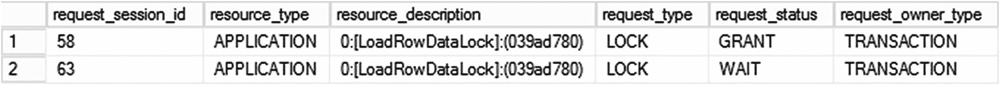

# 10. 应用程序锁

本章将讨论 `SQL Server` 的另一个锁功能，称为应用程序锁，它在按名称标识的应用程序资源上放置锁。应用程序锁允许你序列化对 `T-SQL` 代码的访问，类似于客户端应用程序中的临界区和互斥体。

## 应用程序锁概述

`应用程序锁` 允许应用程序在与数据库对象无关、仅通过名称标识的 `应用程序资源` 上放置锁。该锁在锁兼容性方面遵循常规规则，可以是以下类型之一：共享（`S`）、更新（`U`）、排他（`X`）、意向共享（`IS`）和意向排他（`IX`）。

应用程序需要调用 `sp_getapplock` 存储过程，使用以下参数来获取锁：

*   `@Resource:` 指定应用程序锁的名称。无论数据库和服务器排序规则如何，它都是区分大小写的。
*   `@LockMode:` 指定锁类型。你需要使用以下值之一来指定类型：`Shared`、`Update`、`IntentShared`、`IntentExclusive` 或 `Exclusive`。
*   `@LockOwner:` 应为两个值之一—`Transaction` 或 `Session`—并控制锁的所有者（和作用域）。
*   `@LockTimeout:` 指定超时时间（毫秒）。如果存储过程无法在此时间间隔内获取锁，将返回错误。
*   `@DbPrincipal:` 指定安全上下文（调用者需要是 `database_principal`、`dbo` 或 `db_owner` 角色的成员）。

该存储过程在成功时返回大于或等于零的值，在失败时返回负值。与常规锁一样，存在死锁的可能性，尽管这不会回滚被选为牺牲品的会话的事务，而是返回指示死锁状况的错误代码。

应用程序需要调用 `sp_releaseapplock` 存储过程来释放应用程序锁。或者，如果锁的 `@LockOwner` 是 `transaction`，则在事务提交或回滚时会自动释放。此行为类似于常规锁。


### 应用锁的使用

计算机科学中有一个概念叫做 **互斥锁**。它表示多个线程或进程不能同时执行特定代码。举个例子，设想一个多线程应用程序，其中的线程使用共享对象。在这些系统中，通常需要对访问这些对象的代码进行序列化，以防止多个线程同时读取和更新同一对象时发生竞态条件。

每种开发语言都有一套可以完成此类任务的同步原语（例如，互斥锁和临界区）。当你需要对 T-SQL 代码的某部分进行序列化时，应用锁也能起到同样的作用。

举个例子，假设有一个系统收集一些数据，将其保存到数据库中，并且有一组用于数据处理的应用服务器。每台应用服务器读取数据包，处理它，最后从原始表中删除已处理的数据。显然，你不希望不同的应用服务器处理相同的行，而对数据加载过程进行序列化是可用的选项之一。排他（X）表锁不起作用，因为它会阻塞所有表访问，而不仅仅是数据加载。在应用服务器级别实现序列化也并非易事。幸运的是，应用锁可以帮助解决这个问题。

假设你有如代码清单 10-1 所示的表。为简单起见，有一个名为 `Attributes` 的列代表所有行数据。

```sql
create table dbo.RawData
(
    ID int not null,
    Attributes char(100) not null
        constraint DEF_RawData_Attributes
        default 'Row Data',
    ProcessingTime datetime not null
        constraint DEF_RawData_ProcessingTime
        default '2000-01-01', -- Default constraint simplifies data loading in the code below
    constraint PK_RawData
        primary key clustered(ID)
)
```
代码清单 10-1
表结构

有两个重要的列：作为主键的 `ID`，以及代表行加载处理时间的 `ProcessingTime`。你应该使用 UTC 时间而非本地时间，以支持应用服务器位于不同时区的情况，并防止夏令时调整时钟引发问题。该列还有助于防止其他会话在数据仍在处理时重新读取它。最好避免为此目的使用布尔（`bit`）列，因为如果应用服务器崩溃，该行将永远留在表中。而使用时间列，系统可以在超时后再次读取它。

现在，让我们创建一个读取数据的存储过程，如代码清单 10-2 所示。

```sql
create proc dbo.LoadRawData(@PacketSize int)
as
begin
    set nocount, xact_abort on

    declare
        @EarliestProcessingTime datetime
        ,@ResCode int

    declare
        @Data table
        (
            ID int not null primary key,
            Attributes char(100) not null
        )

    begin tran
        exec @ResCode = sp_getapplock
            @Resource = 'LoadRowDataLock'
            ,@LockMode = 'Exclusive'
            ,@LockOwner = 'Transaction'
            ,@LockTimeout = 15000; -- 15 seconds

        if @ResCode >= 0 -- success
        begin
            -- We assume that app server processes the packet within 1 minute unless crashed
            set @EarliestProcessingTime = dateadd(minute,-1,getutcdate());

            ;with DataPacket(ID, Attributes, ProcessingTime)
            as
            (
                select top (@PacketSize) ID, Attributes, ProcessingTime
                from dbo.RawData
                where ProcessingTime <= @EarliestProcessingTime
                order by ID
            )
            update DataPacket
            set ProcessingTime = getutcdate()
            output inserted.ID, inserted.Attributes into @Data(ID, Attributes);
        end

        -- we don't need to explicitly release application lock because @LockOwner is Transaction
    commit

    select ID, Attributes from @Data;
end
```
代码清单 10-2
读取数据的存储过程

该存储过程在事务开始时获取一个排他（X）应用锁。结果，所有其他调用该存储过程的会话都会被阻塞，直到事务提交且应用锁被释放。这保证了只有一个会话可以在存储过程内更新和读取数据。同时，其他会话仍然可以处理该表（例如，插入新行或删除已处理的行）。应用锁独立于数据锁，除非会话试图通过 `sp_getapplock` 调用为相同的 `@Resource` 获取不兼容的应用锁，否则不会阻塞。

图 10-1 展示了当两个会话同时调用 `dbo.LoadRawData` 存储过程时，`sys.dm_tran_locks` 数据管理视图的输出。`SPID=58` 的会话成功获取了应用锁，而 `SPID=63` 的另一个会话被阻塞。`Resource_type` 值为 `APPLICATION` 表示这是一个应用锁。



图 10-1
`sys.dm_tran_locks` 的输出

值得一提的是，如果我们的目标仅仅是保证多个会话不能同时读取相同的行，而不是序列化整个读取过程，还有另一种更简单的解决方案。你可以使用锁定表提示，如代码清单 10-3 所示。

```sql
create proc dbo.LoadRawData(@PacketSize int)
as
begin
    set nocount, xact_abort on

    declare
        @EarliestProcessingTime datetime = dateadd(minute,-1,getutcdate());

    declare
        @Data table
        (
            ID int not null primary key,
            Attributes char(100) not null
        )

    ;with DataPacket(ID, Attributes, ProcessingTime)
    as
    (
        select top (@PacketSize) ID, Attributes, ProcessingTime
        from dbo.RawData with (updlock, readpast)
        where ProcessingTime <= @EarliestProcessingTime
        order by ID
    )
    update DataPacket
    set ProcessingTime = getutcdate()
    output inserted.ID, inserted.Attributes into @Data(ID, Attributes);

    select ID, Attributes from @Data;
end
```
代码清单 10-3
使用表锁提示序列化对数据的访问

`UPDLOCK` 提示强制 SQL Server 在 `SELECT` 操作期间使用更新（U）锁，而不是共享（S）锁。这可以防止其他会话同时读取相同的行。同时，`READPAST` 提示强制会话跳过持有不兼容锁的行，而不是被阻塞。

尽管两种实现方式都达到了相同的目标，但它们采用了不同的方法。后者通过使用数据（行级）锁来序列化对相同行的访问。应用锁则序列化对代码的访问，防止多个会话同时运行该语句。

虽然这两种方法都可以用于基于磁盘的表，但在使用内存优化表实现队列的情况下，锁定提示将不起作用。在这种场景下锁定提示无效，但应用锁可以帮助实现所需的序列化。


#### 注意

我们将在第 13 章讨论内存 OLTP 并发模型。

当系统具有结构化的数据访问层时，应用程序锁可能有助于减少阻塞，并在某些会话获取表级锁时改善用户体验。一个这样的例子是在不支持低优先级锁的 SQL Server 系统中进行索引维护或分区切换。

考虑一个场景，你有一个多租户系统，其中一组服务按租户查询数据。清单 10-4 所示的代码在查询表之前尝试获取一个共享的(S)应用程序锁。如果此操作不成功，它会返回一个空的结果集，模拟“无新数据”的情况，而不对表执行任何访问。

```sql
create table dbo.CollectedData
(
TenantId int not null,
OnDate datetime not null,
Id bigint not null identity(1,1),
Attributes char(100) not null
constraint DEF_CollectedData_Attributes
default 'Other columns'
);
create unique clustered index IDX_CollectedData_TenantId_OnDate_Id
on dbo.CollectedData(TenantId,OnDate,Id);
go
create proc dbo.GetTenantData
(
@TenantId int
,@LastOnDate datetime
,@PacketSize int
)
as
begin
set nocount, xact_abort on
declare
@ResCode int
begin tran
exec @ResCode = sp_getapplock
@Resource = 'TenantDataAccess'
,@LockMode = 'Shared'
,@LockOwner = 'Transaction'
,@LockTimeout = 0 ; -- 无等待
if @ResCode >= 0 -- 成功
begin
if @LastOnDate is null
set @LastOnDate = '2018-01-01';
select top (@PacketSize) with ties
TenantId, OnDate, Id, Attributes
from dbo.CollectedData
where
TenantId = @TenantId and
OnDate > @LastOnDate
order by
OnDate;
end
else
-- 返回空结果集
select
convert(int,null) as TenantId
,convert(datetime,null) as OnDate
,convert(char(100),null) as Attributes
where
1 = 2;
commit
end
```
`清单 10-4`
在索引重建期间防止对表进行访问：表和存储过程

第二个需要获取完整表级锁的会话，可以先获取一个排他的(X)应用程序锁，如清单 10-5 所示。这将防止在索引重建期间，存储过程在查询表时被阻塞。

```sql
begin tran
exec sp_getapplock
@Resource = 'TenantDataAccess'
,@LockMode = 'Exclusive'
,@LockOwner = 'Transaction'
,@LockTimeout = -1 ; -- 无限期等待
alter index IDX_CollectedData_TenantId_OnDate_Id
on dbo.CollectedData rebuild;
commit
```
`清单 10-5`
在索引重建期间防止对表进行访问：获取对表的排他访问权

这种方法可以通过消除系统中可能的查询超时来改善用户体验。此外，它还可以减少获取排他表锁所需的时间。SQL Server 不使用应用程序锁的锁分区，因此应用程序锁请求只需在单个锁定队列中被授予权限，而不是在每个分区上顺序进行。

最后，值得注意的是，如果在`ALTER INDEX REBUILD`运行时需要编译存储过程，仍然存在阻塞的可能性。编译过程将需要获取一个表级锁，而这将被索引重建所持有的架构修改(Sch-M)锁所阻塞。

## 总结

应用程序锁允许应用程序对一个与数据库对象无关、通过名称标识的应用程序资源放置锁。这是一个有用的工具，帮助你实现互斥代码模式，这些模式序列化对 T-SQL 代码的访问，类似于客户端应用程序中的临界区和互斥体。

你可以分别使用`sp_getapplock`和`sp_releaseapplock`存储过程来创建和释放应用程序锁。应用程序锁可以具有会话或事务范围，并且它们遵循常规的锁兼容性规则。

