# 12. 并发问题故障排除

系统故障排除既是一门艺术，也是一门科学。它也是一个非常庞大和复杂的话题。如果我要写一本涵盖系统故障排除所有方面的书，它的页数会比你正在阅读的这本还要多。

系统故障排除和性能调优的过程要求你从全局视角审视系统。SQL Server 从不孤立存在，问题的根本原因可能不一定在数据库中。硬件不足、操作系统和 SQL Server 配置不当、数据库和应用程序设计效率低下——所有这些因素都可能导致各种问题和糟糕的系统性能。

并发性只是这个难题中的一小部分。每个多用户数据库都会遭受一定程度的阻塞。然而，并发问题可能不是问题的主要来源，而且通常通过关注系统中的其他领域，你可以获得更好的投资回报率。

本章将讨论一种常见的故障排除技术，称为`等待统计信息分析`。尽管我们将重点讨论与锁相关的等待和并发问题，但这种技术在一般的故障排除中非常有用。我建议你多了解这种技术以及系统中可能存在的其他等待类型。

然而，请记住采取全局视角，在专注于数据库内部问题之前，先分析整个系统——硬件和软件。

## SQL Server 执行模型

从高层来看，SQL Server 的架构包括六个不同的组件，如图 12-1 所示。

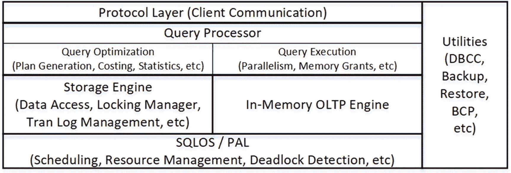

图 12-1

高层 SQL Server 架构

*   `协议层`处理 SQL Server 和客户端应用程序之间的通信。数据以称为`表格数据流 (TDS)`的内部格式通过标准网络通信协议（如 TCP/IP 或命名管道）进行传输。另一种称为`共享内存`的通信协议，可在 SQL Server 和客户端应用程序本地运行在同一服务器上时使用。
*   `查询处理器`层负责查询优化和执行。
*   `存储引擎`由与 SQL Server 中数据访问和数据管理相关的组件组成。它处理磁盘上的数据，处理事务和并发，管理事务日志，并执行其他几个功能。
*   `内存中 OLTP 引擎`于 SQL Server 2014 引入。这种无锁、无闩锁的技术有助于提高 OLTP 工作负载的性能。它与将所有数据存储在内存中的内存优化表一起工作。我们将在下一章讨论内存中 OLTP 并发模型。
*   SQL Server 包括一组`实用工具`，它们负责备份和还原操作、数据大容量加载、全文索引管理以及其他几个操作。
*   最后，SQL Server 的关键组件是`SQL Server 操作系统 (SQLOS)`。SQLOS 是位于 SQL Server 和操作系统（Windows 或 Linux）之间的层，负责调度和资源管理、同步、异常处理、死锁检测、CLR 托管等。例如，当任何 SQL Server 组件需要分配内存时，它不会直接调用操作系统 API 函数，而是向 SQLOS 请求内存，然后 SQLOS 使用内存分配器组件来满足该请求。

SQLOS 最初在 SQL Server 2005 中引入，旨在提高 SQL Server 中调度的效率并最小化上下文和内核模式切换。Windows 和 SQLOS 之间的主要区别在于调度模型。Windows 是使用抢占式调度的通用操作系统。它控制当前正在运行的进程，根据需要挂起和恢复它们。相反，除 CLR 代码外，SQLOS 使用协作式调度，进程会定期自愿让出。

SQL Server 2017 中的 Linux 支持导致了 SQLOS 的进一步转型，并引入了`平台抽象层 (SQL PAL)`。它作为 SQLOS 和操作系统之间的网关工作，为操作系统 API/内核调用提供抽象。在性能关键代码中极少数例外情况下，SQLOS 不会直接调用操作系统 API，而是使用 PAL。

SQLOS 在启动时创建一组`调度程序`。调度程序的数量等于系统中逻辑 CPU 的数量，另有一个用于专用管理员连接的额外调度程序。例如，如果一个服务器有两个启用超线程的四核 CPU，SQL Server 将创建 17 个调度程序。根据处理器关联性设置和基于核心的许可模型，每个调度程序可以处于`在线`或`离线`状态。

尽管调度程序的数量与系统中的 CPU 数量相匹配，但除非启用了处理器关联性设置，否则它们之间没有严格的一一对应关系。在某些情况下，在高负载下，有可能出现多个调度程序在同一 CPU 上运行的情况。或者，当设置了处理器关联性时，调度程序以严格的一一对应关系绑定到 CPU。


### SQL Server 执行模型与调度器

每个调度器负责管理称为 *工作线程 (workers)* 的工作线程。系统中的最大工作线程数由 `Max Worker Thread` 配置选项指定。默认值 `zero` 表示 SQL Server 会根据系统中的调度器数量来计算最大工作线程数。在大多数情况下，您无需更改此默认值。

每当有任务需要执行时，它会被分配给一个处于空闲状态的 *工作线程 (worker)*。如果没有空闲的 *工作线程 (worker)*，调度器会创建一个新的。它还会在 15 分钟不活动后或遇到内存压力时销毁空闲的 *工作线程 (worker)*。值得注意的是，在 32 位 SQL Server 中，每个 *工作线程 (worker)* 的线程堆栈会使用 512 KB 的 RAM，而在 64 位系统中则使用 2 MB 的 RAM。

*工作线程 (Worker)* 不会在调度器之间移动。同样，一个任务也绝不会在 *工作线程 (worker)* 之间移动。然而，SQLOS 可以创建子任务并将其分配给不同的 *工作线程 (worker)*；例如，在并行执行计划的情况下。

#### 任务状态

每个任务可能处于以下六种状态之一：

*   `Pending`：任务正在等待可用的 *工作线程 (worker)*。
*   `Done`：任务已完成。
*   `Running`：任务当前正在调度器上执行。
*   `Runnable`：任务正在等待被调度器执行。
*   `Suspended`：任务正在等待外部事件或资源。
*   `Spinloop`：任务正在处理自旋锁。自旋锁是保护某些内部对象的同步对象。当 SQL Server 预期能快速获得对对象的访问权限时可能会使用它们，从而避免 *工作线程 (worker)* 的上下文切换。

每个调度器最多有一个处于 `running` 状态的任务。此外，它有两个不同的队列——一个用于 `runnable` 任务，另一个用于 `suspended` 任务。当正在运行的任务需要某些资源（例如来自磁盘的数据页）时，它会提交一个 I/O 请求并将状态更改为 `suspended`。它会停留在 `suspended` 队列中，直到请求完成且页面被读取。当任务准备好恢复执行时，它会被移动到 `runnable` 队列。

#### 生活中的类比：杂货店

杂货店或许是 SQL Server 执行模型最贴切的现实类比。将收银员视为调度器，在结账队伍中的顾客视为 `runnable` 队列中的任务。正在结账的顾客类似于 `running` 状态的任务。

如果某件商品缺少通用产品代码（UPC），收银员会派一名商店员工去核查价格。收银员会暂停当前顾客的结账过程，请他或她站到一边（进入 `suspended` 队列）。当员工带着价格信息回来后，那位站到一边的顾客会移动到结账队伍的末尾（`runnable` 队列的末尾）。

值得一提的是，与现实生活相比，SQL Server 的处理过程要高效得多，因为其他人会在价格核查期间耐心排队等待。然而，一位被迫移动到 `runnable` 队列末尾的顾客可能不会同意这样的结论。

#### 任务生命周期与等待统计

图 12-2 展示了 SQL Server 执行模型中一个典型的任务生命周期。任务的总执行时间可以计算为任务在 `running` 状态（在调度器上运行时）、`runnable` 状态（等待可用调度器时）和 `suspended` 状态（等待资源或外部事件时）所花费时间的总和。

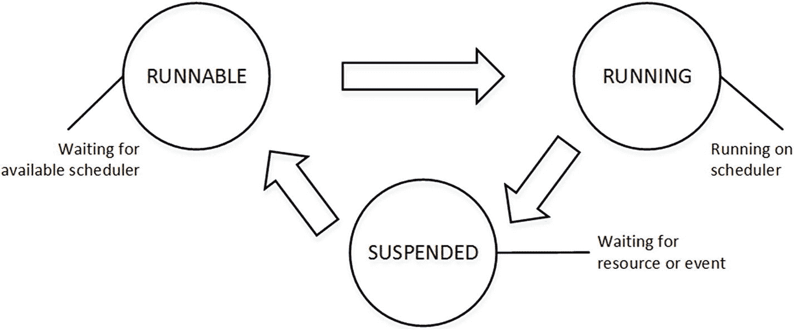

**图 12-2** 任务生命周期

SQL Server 会跟踪任务因不同类型的等待而处于 `suspended` 状态的累积时间，并通过 `sys.dm_os_wait_tasks` 视图暴露这些信息。该信息自上次 SQL Server 重启以来或使用 `DBCC SQLPERF('sys.dm_os_wait_stats', CLEAR)` 命令清除以来一直被收集。

代码清单 12-1 展示了如何查找系统中的 *top* 等待类型，即 *工作线程 (worker)* 花费等待时间最长的等待类型。它过滤掉了一些非必要的等待类型，主要是那些与 SQL Server 内部进程相关的类型。尽管在高级性能调优期间分析其中一些类型是有益的，但在系统故障排除的初始阶段，您很少会关注它们。


#### 注意

每个新版本的 SQL Server 都会引入新的等待类型。您可以在[此链接](https://docs.microsoft.com/en-us/sql/relational-databases/system-dynamic-management-views/sys-dm-os-wait-stats-transact-sql)查看等待类型的列表。请确保选择相应版本的 SQL Server。

```sql
;with Waits
as
(
select
wait_type, wait_time_ms, waiting_tasks_count,signal_wait_time_ms
,wait_time_ms - signal_wait_time_ms as resource_wait_time_ms
,100\. * wait_time_ms / SUM(wait_time_ms) over() as Pct
,row_number() over(order by wait_time_ms desc) as RowNum
from sys.dm_os_wait_stats with (nolock)
where
wait_type not in /* Filtering out non-essential system waits */
(N'BROKER_EVENTHANDLER',N'BROKER_RECEIVE_WAITFOR'
,N'BROKER_TASK_STOP',N'BROKER_TO_FLUSH'
,N'BROKER_TRANSMITTER',N'CHECKPOINT_QUEUE',N'CHKPT'
,N'CLR_SEMAPHORE',N'CLR_AUTO_EVENT'
,N'CLR_MANUAL_EVENT',N'DBMIRROR_DBM_EVENT'
,N'DBMIRROR_EVENTS_QUEUE',N'DBMIRROR_WORKER_QUEUE'
,N'DBMIRRORING_CMD',N'DIRTY_PAGE_POLL'
,N'DISPATCHER_QUEUE_SEMAPHORE',N'EXECSYNC'
,N'FSAGENT',N'FT_IFTS_SCHEDULER_IDLE_WAIT'
,N'FT_IFTSHC_MUTEX',N'HADR_CLUSAPI_CALL'
,N'HADR_FILESTREAM_IOMGR_IOCOMPLETION'
,N'HADR_LOGCAPTURE_WAIT'
,N'HADR_NOTIFICATION_DEQUEUE'
,N'HADR_TIMER_TASK',N'HADR_WORK_QUEUE'
,N'KSOURCE_WAKEUP',N'LAZYWRITER_SLEEP'
,N'LOGMGR_QUEUE',N'MEMORY_ALLOCATION_EXT'
,N'ONDEMAND_TASK_QUEUE'
,N'PARALLEL_REDO_WORKER_WAIT_WORK'
,N'PREEMPTIVE_HADR_LEASE_MECHANISM'
,N'PREEMPTIVE_SP_SERVER_DIAGNOSTICS'
,N'PREEMPTIVE_OS_LIBRARYOPS'
,N'PREEMPTIVE_OS_COMOPS'
,N'PREEMPTIVE_OS_CRYPTOPS'
,N'PREEMPTIVE_OS_PIPEOPS'
, N'PREEMPTIVE_OS_AUTHENTICATIONOPS'
,N'PREEMPTIVE_OS_GENERICOPS'
,N'PREEMPTIVE_OS_VERIFYTRUST
',N'PREEMPTIVE_OS_FILEOPS'
,N'PREEMPTIVE_OS_DEVICEOPS'
,N'PREEMPTIVE_OS_QUERYREGISTRY'
,N'PREEMPTIVE_OS_WRITEFILE'
,N'PREEMPTIVE_XE_CALLBACKEXECUTE'
,N'PREEMPTIVE_XE_DISPATCHER'
,N'PREEMPTIVE_XE_GETTARGETSTATE'
,N'PREEMPTIVE_XE_SESSIONCOMMIT'
,N'PREEMPTIVE_XE_TARGETINIT'
,N'PREEMPTIVE_XE_TARGETFINALIZE'
,N'PWAIT_ALL_COMPONENTS_INITIALIZED'
,N'PWAIT_DIRECTLOGCONSUMER_GETNEXT'
,N'QDS_PERSIST_TASK_MAIN_LOOP_SLEEP'
,N'QDS_ASYNC_QUEUE'
,N'QDS_CLEANUP_STALE_QUERIES_TASK_MAIN_LOOP_SLEEP'
,N'REQUEST_FOR_DEADLOCK_SEARCH'
,N'RESOURCE_QUEUE',N'SERVER_IDLE_CHECK'
,N'SLEEP_BPOOL_FLUSH',N'SLEEP_DBSTARTUP'
,N'SLEEP_DCOMSTARTUP'
,N'SLEEP_MASTERDBREADY',N'SLEEP_MASTERMDREADY'
,N'SLEEP_MASTERUPGRADED',N'SLEEP_MSDBSTARTUP'
, N'SLEEP_SYSTEMTASK', N'SLEEP_TASK'
,N'SLEEP_TEMPDBSTARTUP',N'SNI_HTTP_ACCEPT'
,N'SP_SERVER_DIAGNOSTICS_SLEEP'
,N'SQLTRACE_BUFFER_FLUSH'
,N'SQLTRACE_INCREMENTAL_FLUSH_SLEEP'
,N'SQLTRACE_WAIT_ENTRIES',N'WAIT_FOR_RESULTS'
,N'WAITFOR',N'WAITFOR_TASKSHUTDOWN'
,N'WAIT_XTP_HOST_WAIT'
,N'WAIT_XTP_OFFLINE_CKPT_NEW_LOG'
,N'WAIT_XTP_CKPT_CLOSE',N'WAIT_XTP_RECOVERY'
,N'XE_BUFFERMGR_ALLPROCESSED_EVENT'
, N'XE_DISPATCHER_JOIN',N'XE_DISPATCHER_WAIT'
,N'XE_LIVE_TARGET_TVF',N'XE_TIMER_EVENT')
)
select
w1.wait_type as [Wait Type]
,w1.waiting_tasks_count as [Wait Count]
,convert(decimal(12,3), w1.wait_time_ms / 1000.0)
as [Wait Time]
,convert(decimal(12,1), w1.wait_time_ms / w1.waiting_tasks_count)
as [Avg Wait Time]
,convert(decimal(12,3), w1.signal_wait_time_ms / 1000.0)
as [Signal Wait Time]
,convert(decimal(12,1), w1.signal_wait_time_ms / w1.waiting_tasks_count)
as [Avg Signal Wait Time]
,convert(decimal(12,3), w1.resource_wait_time_ms / 1000.0)
as [Resource Wait Time]
,convert(decimal(12,1), w1.resource_wait_time_ms
/ w1.waiting_tasks_count) as [Avg Resource Wait Time]
,convert(decimal(6,3), w1.Pct) as [Percent]
,convert(decimal(6,3), w1.Pct + IsNull(w2.Pct,0)) as [Running Percent]
from
Waits w1 cross apply
(
select sum(w2.Pct) as Pct
from Waits w2
where w2.RowNum < w1.RowNum
) w2
where
w1.RowNum = 1 or w2.Pct <= 99
order by
w1.RowNum
option (recompile);
```

清单 12-1 检测系统中的顶级等待类型

图 12-3 展示了在故障排除过程开始时，从其中一台生产服务器上运行该脚本得到的输出结果。

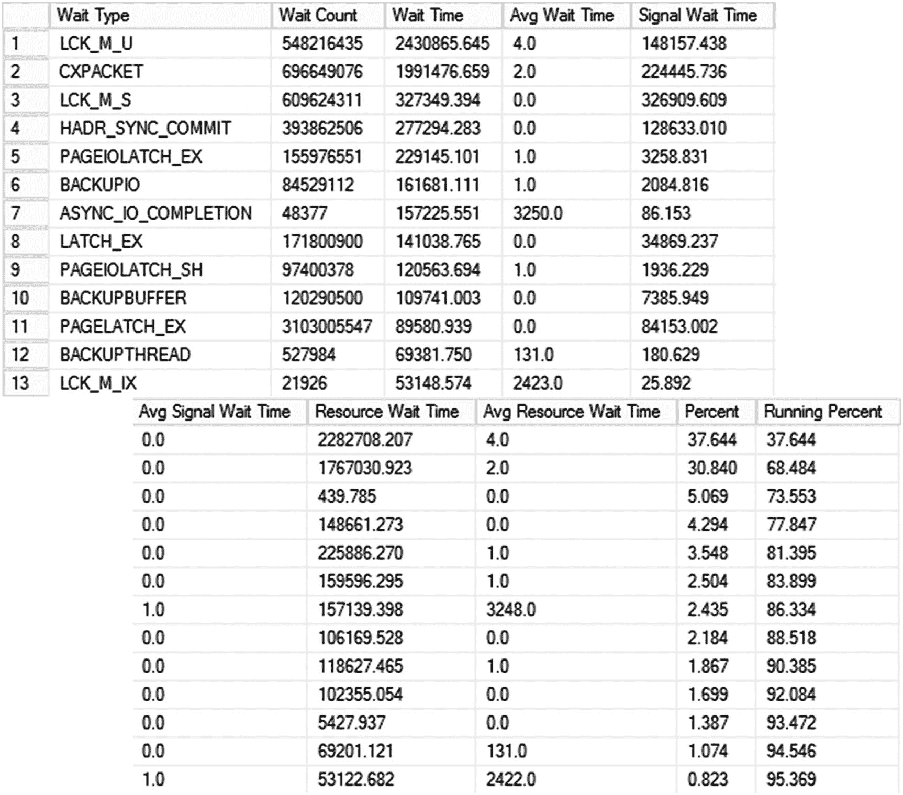

图 12-3 从其中一台生产服务器上运行脚本的输出

分析系统中顶级等待的过程被称为等待统计分析。这是 SQL Server 中最常用的故障排除和性能调优技术之一，它使您能够快速识别系统中的潜在问题。图 12-4 说明了一个典型的等待统计分析故障排除周期。

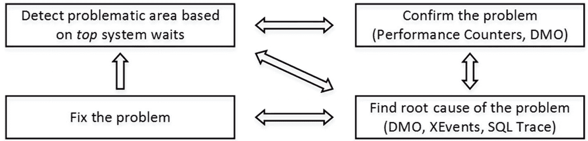

图 12-4 等待统计分析故障排除周期

作为第一步，查看等待统计信息，以检测系统中的顶级等待。这缩小了进一步分析的关注领域。之后，使用其他工具（如 `DMV`、`Windows Performance Monitor`、`SQL Traces` 和 `Extended Events`）确认问题，并检测问题的根本原因。当根本原因被确认后，修复它，然后再次分析等待统计信息，选择一个新的分析和改进目标。

让我们详细地看看与锁相关的等待类型。

#### 注意

我的 *Pro SQL Server Internals* 一书提供了关于等待统计分析的更深入内容，并解释了如何在系统中排除各种非锁相关的故障。

您还可以从[此链接](http://download.microsoft.com/download/4/7/a/47a548b9-249e-484c-abd7-29f31282b04d/performance_tuning_waits_queues.doc)下载关于等待统计分析的白皮书。虽然它侧重于 SQL Server 2005，但其内容对任何版本的 SQL Server 都有效。

## 锁等待

系统中的每种锁类型都有一个对应的等待类型，其名称以`LCK_M_`开头，后跟锁类型。例如，`LCK_M_U`和`LCK_M_IS`分别表示等待更新（U）锁和意向排他（IX）锁。

当锁请求在队列中等待时，就会发生锁等待，这发生在阻塞期间。如果请求可以立即被授予且没有发生阻塞，SQL Server 则不会生成锁等待。

您需要同时关注总等待时间和等待发生的次数。完全有可能出现一种等待类型，其总等待时间很长，但仅由少数几次长时间等待产生。您可以根据您的目标来决定是否对其进行故障排除或忽略。

您还应该记住，等待统计信息是从上次 SQL Server 重启开始累积的。运行时间较长的服务器的等待统计信息可能无法代表当前负载。在许多情况下，在开始故障排除之前，使用`DBCC SQLPERF('sys.dm_os_wait_stats', CLEAR)`命令清除等待统计信息，收集近期的等待信息可能是有益的。您显然需要在系统中有代表性的工作负载时执行此操作。

让我们看看锁等待类型，讨论可能导致此类等待的原因以及我们如何对其进行故障排除。


### LCK_M_U 等待类型

`LCK_M_U` 等待类型可以说是 OLTP 系统中最常见的与锁相关的等待类型之一，因为它表示正在等待更新（U）锁。

如你所知，SQL Server 在更新扫描期间使用更新（U）锁来查找需要更新或删除的行。SQL Server 在读取行时获取更新（U）锁，之后释放或将其转换为排他（X）锁。在大多数情况下，大量的 `LCK_M_U` 等待表明系统中存在优化不佳的写入查询（`UPDATE`、`DELETE`、`MERGE`）。

你可以将此数据与 `PAGEIOLATCH*` 等待类型关联分析。这些等待发生在 SQL Server 等待从磁盘读取数据页时。大量的此类等待指向高磁盘 I/O，这通常是系统中查询未优化的另一个迹象。除了未优化的查询外，还有其他情况可能导致此类等待，因此不应在未进行额外分析的情况下就得出结论。

`PAGEIOLATCH*` 等待类型表示系统中的物理 I/O。如今，配备足够内存以在缓冲池中缓存活动数据的服务器很常见。在此类环境中，未优化的查询不会产生物理读取和 `PAGEIOLATCH*` 等待。然而，它们可能遭遇阻塞，并在更新扫描期间产生 `LCK_M_U` 等待。

优化不佳的查询需要处理大量数据，这增加了执行计划的成本。在许多情况下，SQL Server 会为它们生成并行执行计划。高的 `CXPACKET` 等待表明大量的并行度，这可能是 OLTP 系统中查询未优化的另一个迹象。

然而，你应该记住，并行是完全正常且预期的。`CXPACKET` 等待并不一定表示存在问题，在分析时应考虑系统的工作负载。同样值得注意的是，*并行度成本阈值* 的默认值极低，在如今大多数情况下都需要提高。

有几种方法可以使用标准 SQL Server 工具检测资源密集型（I/O）的未优化查询。最常见的方法之一是使用 SQL Traces 或 Extended Events 捕获系统活动，按读取和/或写入次数过滤数据。然而，这种方法需要你在收集数据后进行额外分析。在确定优化目标时，应检查查询执行的频率。

### 重要提示

在繁忙系统中，捕获查询执行统计信息的 Extended Events 会话和 SQL Traces 可能导致显著开销。请谨慎使用，并且除非正在进行性能故障排除，否则不要保持它们运行。

另一种非常简单而强大的检测资源密集型查询的方法是 `sys.dm_exec_query_stats` 数据管理视图。SQL Server 跟踪缓存的执行计划的各种统计信息，包括执行次数和 I/O 操作、经过时间以及 CPU 时间，并通过该视图公开它们。此外，你可以将其与其他数据管理对象联接，获取这些查询的 SQL 文本和执行计划。这简化了分析，并且对系统中各种性能和计划缓存问题的故障排除很有帮助。

清单 12-2 展示了一个查询，它返回截至执行时计划已缓存的 50 个 I/O 最密集的查询。值得注意的是，`sys.dm_exec_query_stats` 视图在不同版本的 SQL Server 中的结果集列略有不同。清单 12-2 中的查询适用于 SQL Server 2008R2 及以上版本。你可以从 `SELECT` 列表中移除最后四列，以使其兼容 SQL Server 2005-2008。

```
select top 50
substring(qt.text, (qs.statement_start_offset/2)+1,
((
case qs.statement_end_offset
when -1 then datalength(qt.text)
else qs.statement_end_offset
end - qs.statement_start_offset)/2)+1) as SQL
,qp.query_plan as [Query Plan]
,qs.execution_count as [Exec Cnt]
,(qs.total_logical_reads + qs.total_logical_writes) /
qs.execution_count as [Avg IO]
,qs.total_logical_reads as [Total Reads], qs.last_logical_reads
as [Last Reads]
,qs.total_logical_writes as [Total Writes], qs.last_logical_writes
as [Last Writes]
,qs.total_worker_time as [Total Worker Time], qs.last_worker_time
as [Last Worker Time]
,qs.total_elapsed_time / 1000 as [Total Elapsed Time]
,qs.last_elapsed_time / 1000 as [Last Elapsed Time]
,qs.creation_time as [Cached Time], qs.last_execution_time
as [Last Exec Time]
,qs.total_rows as [Total Rows], qs.last_rows as [Last Rows]
,qs.min_rows as [Min Rows], qs.max_rows as [Max Rows]
from
sys.dm_exec_query_stats qs with (nolock)
cross apply sys.dm_exec_sql_text(qs.sql_handle) qt
cross apply sys.dm_exec_query_plan(qs.plan_handle) qp
order by
[Avg IO] desc
清单 12-2
使用 sys.dm_exec_query_stats
```

如图 12-5 所示，它允许你根据资源使用情况和执行次数轻松定义优化目标。例如，结果集中的第二个查询是优化的最佳候选，因为它运行得非常频繁。显然，如果我们的目标是减少系统中的更新锁等待量，我们需要专注于数据修改查询。

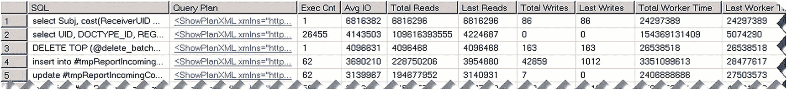

图 12-5
Sys.dm_exec_query_stats 结果

不幸的是，`sys.dm_exec_query_stats` 视图不返回任何对于没有缓存执行计划的查询的信息。通常这不是问题，因为我们的优化目标不仅是资源密集型，而且是频繁执行的查询。这些查询的计划通常由于频繁重用而保留在缓存中。但是，在发生语句级重新编译的情况下，SQL Server 不会缓存计划；因此，`sys.dm_exec_query_stats` 会遗漏它们。你应该使用 Extended Events 和/或 SQL Traces 来捕获它们。我通常从 `sys.dm_exec_query_stats` 输出的查询开始，然后使用 Extended Events 交叉检查优化目标。

在 SQL Server 重新启动、内存压力、由于统计信息更新引起的重新编译以及其他一些情况下，查询计划可能会从缓存中移除，因此不会包含在 `sys.dm_exec_query_stats` 的结果中。除了执行次数之外，分析 `creation_time` 和 `last_execution_time` 列也是有益的。

在 SQL Server 2016 及以上版本中，你可以使用 *查询存储* 来收集系统中所有查询的执行统计信息。它提供了丰富的报告和数据管理视图，你可以使用它们快速识别系统中的低效查询。来自查询存储的数据持久存储在数据库中，并且会在 SQL Server 重启后保留。查询存储是一个极其强大的工具，对故障排除有巨大帮助。

你也可以使用我们在第 4 章讨论过的阻塞监控框架。你可以分析更新（U）锁等待的数据，选择优化的目标。我们将在本章后面更详细地讨论这个框架。

正如我们已经讨论过的，阻塞条件和锁等待也可能由于系统中不正确的事务管理而发生。长事务可能长时间持有锁，阻止其他会话在受影响的行上获取不兼容的锁。请记住这种行为，并将其纳入分析和故障排除中。


### LCK_M_S 等待类型

`LCK_M_S` 等待类型表示对共享 (S) 锁的等待。此锁类型由 `SELECT` 查询在 `READ COMMITTED`、`REPEATABLE READ` 和 `SERIALIZABLE` 隔离级别中获取。

在许多情况下，`LCK_M_S` 等待的根本原因与 `LCK_M_U` 等待类似。优化不佳的 `SELECT` 查询可能扫描大量数据，并可能被其他会话持有的排他 (X) 锁阻塞。你可以使用与刚才讨论的相同的故障排除技术来识别此类查询。

对于在 `READ COMMITTED` 隔离级别下运行的查询，你可以考虑启用 `READ_COMMITTED_SNAPSHOT` 数据库选项来消除读写阻塞。在此模式下，SQL Server 在 `READ COMMITTED` 隔离级别下不再获取共享 (S) 锁，而是依赖行版本控制。请记住，这种方法并不能解决问题的根本原因，只是掩盖了由优化不佳的查询引入的问题。同时也要记住它带来的额外开销。

#### 注意

除非不需要数据一致性，否则不要使用 `(NOLOCK)` 提示或 `READ UNCOMMITTED` 隔离级别。

在某些情况下，`LCK_M_S` 等待可能由 SQL Server 在某些操作期间获取的表级锁等待引起，或者由于代码中的 `(TABLOCK)` 提示导致。一个例子是在线索引重建过程，它在执行开始时获取一个短期的共享 (S) 表级锁。在繁忙的 OLTP 系统中，数据的易变性可能导致阻塞，尤其是在涉及锁分区的情况下。

此类情况在等待统计信息中可能表现为发生次数相对较少但平均等待时间较长的等待类型。然而，你不应仅依赖等待统计信息得出结论。分析单个阻塞案例是有益的，在这种情况下，阻塞监控框架可能非常有用。

### LCK_M_X 等待类型

`LCK_M_X` 等待类型表示对排他 (X) 锁的等待。听起来很奇怪，但在数据易变的 OLTP 系统中，`LCK_M_X` 等待可能比 `LCK_M_U` 等待发生得更少。

正如你已经知道的，SQL Server 通常在更新扫描期间使用更新 (U) 锁。然而，这种行为并不能保证。在某些情况下，SQL Server 可能决定省略更新 (U) 锁，而直接使用排他 (X) 锁。一个例子是点查找搜索，当查询使用索引列上的谓词更新单行时。在这种情况下，SQL Server 可能会立即获取排他 (X) 锁，而不使用更新 (U) 锁。在此条件下的阻塞将导致 `LCK_M_X` 等待。

在从更新 (U) 锁转换为排他 (X) 锁时，你也可能遇到 `LCK_M_X` 等待。更新 (U) 和共享 (S) 锁彼此兼容，因此查询可能在持有共享 (S) 锁的行上获取更新 (U) 锁。但是，如果该行需要更新，SQL Server 将无法将其转换为排他 (X) 锁。

这种情况发生在 `SELECT` 查询使用 `REPEATABLE READ` 或 `SERIALIZABLE` 隔离级别时，共享 (S) 锁会一直保持到事务结束。它也可能发生在 `READ COMMITTED` 级别，当 `SELECT` 查询有时会在整个语句期间持有共享 (S) 锁时；例如，当它读取 LOB 列时。

当多个会话处理相同的数据时，可能会发生 `LCK_M_X` 等待。常见场景之一是 *计数器表* 实现，多个会话尝试同时递增同一个计数器，或者使用 `(TABLOCKX)` 提示。你可以通过切换到 `SEQUENCE` 对象或标识列来解决此冲突。

与往常一样，当你在系统中看到大量 `LCK_M_X` 等待时，应分析单个阻塞案例并理解阻塞的根本原因。

### LCK_M_SCH_S 和 LCK_M_SCH_M 等待类型

`LCK_M_SCH_S` 和 `LCK_M_SCH_M` 等待类型表示对架构稳定性 (Sch-S) 和架构修改 (Sch-M) 锁的等待。这些等待不应在系统中大规模发生。

SQL Server 在架构更改期间获取架构修改 (Sch-M) 锁。此锁要求对表进行独占访问，在所有其他会话断开与表的连接之前，请求将被阻塞，从而产生等待。

有几种常见情况可能导致此类阻塞：

*   在有其他用户连接到系统的情况下在线进行数据库架构更改。请记住，在这种情况下，架构修改 (Sch-M) 锁会一直保持到事务结束。
*   离线索引重建。
*   分区切换或在线索引重建的最后阶段。需要架构修改 (Sch-M) 锁来修改数据库中的元数据。如果支持，可以通过使用低优先级锁来减少阻塞。

架构稳定性 (Sch-S) 锁用于避免在表使用时进行表更改。SQL Server 在查询编译期间以及在未使用意向锁的隔离级别（如 `READ UNCOMMITTED`、`READ COMMITTED SNAPSHOT` 和 `SNAPSHOT`）中执行 `SELECT` 查询期间获取它们。

架构稳定性 (Sch-S) 锁与除架构修改 (Sch-M) 锁之外的任何其他锁类型都兼容。`LCK_M_SCH_S` 等待的存在总是表明存在由架构修改引起的阻塞。

如果你在系统中遇到大量的架构锁等待，你应该识别是什么导致了这种阻塞。在大多数情况下，你可以通过更改系统中的部署或数据库维护策略，或者切换到低优先级锁来解决它们。

### Intent LCK_M_I* 等待类型

意向锁等待类型表示系统中对意向锁的等待。每种意向锁类型都有对应的等待类型。例如，`LCK_M_IS` 表示意向共享 (IS) 锁等待，`LCK_M_IX` 表示意向排他 (IX) 锁等待。

SQL Server 在对象（表）和页级别获取意向锁。在表级别，阻塞可能在两种条件下发生。首先，由于对象上持有不兼容的架构修改 (Sch-M) 锁，会话无法获取意向锁。通常，在这种情况下你还会看到一些架构锁等待，你需要排查它们在系统中发生的原因。

另一种情况是表上存在不兼容的完全锁。例如，当表上持有完全排他 (X) 锁时，任何意向锁都无法获取。

在某些情况下，这可能是由于代码中的表级锁提示（如 `(TABLOCK)` 或 `(TABLOCKX)`）导致的。然而，这种状况也可能由大规模批处理修改期间成功的锁升级触发。你可以通过监控 `lock_escalation` 扩展事件来确认这一点，并通过在某些关键表上禁用锁升级来解决。我还将在本章后面演示如何使用阻塞监控框架识别涉及对象级阻塞的表。

当会话请求对持有不兼容完全锁的页获取意向锁时，也可能发生意向锁阻塞。考虑一种情况，SQL Server 需要运行一个扫描整个表的 `SELECT` 语句。在此场景中，SQL Server 可能选择使用页级而不是行级锁，在页上获取完全共享 (S) 锁。如果另一个会话尝试通过获取页上的意向排他 (IX) 锁来修改行，这将引入阻塞。

与往常一样，当你遇到此类问题时，你需要识别并解决阻塞的根本原因。


### 锁等待：总结

表 12-1 总结了常见锁相关等待类型的根本原因及故障排除步骤。

**表 12-1** 最常见的锁相关等待类型

| 等待类型 | 可能的根本原因 | 故障排除步骤 |
| --- | --- | --- |
| `LCK_M_U` | 由于查询优化不佳导致的更新扫描 | 使用查询存储、`sys.dm_exec_query_stats`、xEvent 会话、阻塞监控框架检测并优化优化不佳的查询 |
| `LCK_M_X` | 多个会话处理相同数据 | 更改代码 |
| | 由于查询优化不佳导致的更新扫描 | 使用查询存储、`sys.dm_exec_query_stats`、xEvent 会话、阻塞监控框架检测并优化优化不佳的查询 |
| `LCK_M_S` | 由于查询优化不佳导致的扫描 | 使用查询存储、`sys.dm_exec_query_stats`、xEvent 会话、阻塞监控框架检测并优化优化不佳的查询<br>考虑切换到乐观隔离级别 |
| `LCK_M_U`, `LCK_M_S`, `LCK_M_X` | 事务管理不正确，长时间运行的事务持有不兼容的锁 | 重新设计事务策略。优化查询 |
| `LCK_M_SCH_S`, `LCK_M_SCH_M` | 由于数据库架构更改或索引或分区维护导致的阻塞 | 评估部署和维护策略。如果可能，切换到低优先级锁 |
| `LCK_M_I*` | 由于数据库架构更改或索引或分区维护导致的阻塞 | 评估部署和维护策略 |
| | 锁升级 | 分析并在受影响的表上禁用锁升级 |

正如我已经提到的，系统中的每种锁类型都有对应的等待类型。你可能会遇到本章未涉及的其他锁相关等待类型。尽管如此，了解 SQL Server 并发模型将有助于你进行故障排除。分析可能产生此类锁类型的阻塞状况，并确定阻塞的根本原因。

## 数据管理视图

SQL Server 提供了一组庞大的数据管理视图，用于公开有关系统运行状况和 SQL Server 状态的信息。我想提及几个我们尚未介绍的视图。

### sys.dm_exec_requests 视图

`sys.dm_exec_requests` 视图提供了当前正在执行的请求列表。此视图在故障排除过程中极为有用，它为你提供了服务器上当前运行会话的极高可见性。该视图中最值得注意的列如下：

*   `session_id` 列提供会话的 ID。系统中的用户会话的 `session_id` 始终大于 50，尽管某些系统会话的 `session_id` 也可能大于 50。你可以通过将结果与 `sys.dm_exec_sessions` 和 `sys.dm_exec_connections` 视图进行联接来获取有关会话和客户端应用程序的信息。

*   `start_time`、`total_elapsed_time`、`cpu_time`、`reads`、`logical_reads` 和 `writes` 列提供了请求的执行统计信息。

*   `sql_handle`、`statement_start_offset` 和 `statement_end_offset` 列允许你获取有关查询的信息。在 SQL Server 2016 及更高版本中，你可以将其与函数 `sys.dm_exec_input_buffer` 结合使用，以获取有关当前正在运行的 SQL 语句的信息。你也可以使用 `sys.dm_exec_sql_text` 函数达到此目的，正如你在本书中已经看到的那样。

*   `plan_handle` 列允许你使用 `sys.dm_exec_query_plan` 和 `sys.dm_exec_text_query_plan` 函数获取语句的执行计划。

*   `status` 列为你提供工作线程的状态。对于处于 `SUSPENDED` 状态的被阻塞会话，你可以使用 `wait_type`、`wait_time`、`wait_resource` 和 `blocking_session_id` 列来获取有关会话等待和阻塞者的信息。此外，`last_wait_type` 列将显示会话的上一次等待类型。

有许多场景下 `sys.dm_exec_requests` 视图可能有助于故障排除。其中之一是在分析长时间运行语句的状态时。你可以查看状态和与等待相关的列，以查看请求是正在运行还是被阻塞，并通过 `blocking_session_id` 列识别阻塞会话。

**注意**

你可以在 [`https://docs.microsoft.com/en-us/sql/relational-databases/system-dynamic-management-views/sys-dm-exec-requests-transact-sql`](https://docs.microsoft.com/en-us/sql/relational-databases/system-dynamic-management-views/sys-dm-exec-requests-transact-sql) 获取有关 `sys.dm_exec_requests` 视图的更多信息。

### sys.dm_os_waiting_tasks 视图

你可以使用 `sys.dm_os_waiting_tasks` 视图获取有关被阻塞会话的更多信息。此视图在任务/工作线程级别返回数据，这在分析具有并行执行计划的查询的阻塞时是有益的。输出包括每个被阻塞工作线程一行，并提供有关等待类型和持续时间、被阻塞资源以及阻塞会话 ID 的信息。

**注意**

你可以在 [`https://docs.microsoft.com/en-us/sql/relational-databases/system-dynamic-management-views/sys-dm-os-waiting-tasks-transact-sql`](https://docs.microsoft.com/en-us/sql/relational-databases/system-dynamic-management-views/sys-dm-os-waiting-tasks-transact-sql) 获取有关 `sys.dm_os_waiting_tasks` 视图的更多信息。

### sys.dm_exec_session_wait_stats 视图和 wait_info xEvent

在某些情况下，你可能希望在会话级别跟踪等待；例如，当你排查长时间运行查询的性能问题时。详细的等待信息将使你能够理解可能导致延迟的原因，并相应地调整你的优化策略。

SQL Server 2016 及更高版本通过 `sys.dm_exec_session_wait_stats` 视图为你提供此信息。简而言之，此视图返回与 `sys.dm_os_wait_stats` 类似的数据，但在会话级别收集。它在会话打开或轮询连接重置时清除信息。

当你怀疑某个查询遭受大量短期阻塞等待时，`sys.dm_exec_session_wait_stats` 视图非常有用。此类等待可能不会触发*被阻塞进程报告*；但是，它们可能导致累积阻塞时间很长。

在 SQL Server 2016 之前的版本中，你可以使用 `opcode=1` 谓词（指示等待结束）通过 `wait_info` 扩展事件来跟踪会话级等待。正如你可以猜到的，此会话可能会生成海量信息，从而影响服务器性能。除非你正在进行故障排除，否则不要保持其运行，并且由于它会引入 I/O 系统延迟，不要使用 `event_file` 目标。

你可以将谓词设置在 `duration` 字段上，仅捕获长期等待——例如，等待时间超过 50 毫秒。你也可以通过使用 `session_id` 过滤器来减少收集的信息量。不幸的是，`session_id` 是 `wait_type` 事件的一个操作，这会在数据收集期间增加一些开销。SQL Server 在对扩展事件字段评估谓词后执行操作，因此从处理中移除不必要的等待类型是有益的。

清单 12-3 提供了与每个等待类型对应的映射值列表，你可以将其用作等待类型的过滤器。

```
select name, map_key, map_value
from sys.dm_xe_map_values
where name = 'wait_types'
order by map_key
Listing 12-3
Wait_type 映射值
```

最后，另一个扩展事件 `wait_type_external` 捕获有关抢先式等待（`PREEMPTIVE*` 等待类型）的信息。这些等待与外部 OS 调用相关联；例如，当 SQL Server 需要将日志文件零初始化或在 Active Directory 中验证用户身份时。在某些情况下，你需要对它们进行故障排除；然而，这些情况与阻塞和并发问题无关。


## 注意事项

你可以从 [`https://docs.microsoft.com/en-us/sql/relational-databases/system-dynamic-management-views/sys-dm-exec-session-wait-stats-transact-sql`](https://docs.microsoft.com/en-us/sql/relational-databases/system-dynamic-management-views/sys-dm-exec-session-wait-stats-transact-sql) 获取关于 `sys.dm_exec_session_wait_stats` 视图的更多信息。你可以在 [`https://docs.microsoft.com/en-us/sql/relational-databases/extended-events/extended-events`](https://docs.microsoft.com/en-us/sql/relational-databases/extended-events/extended-events) 阅读关于扩展事件的内容。

### sys.dm_db_index_operational_stats 和 sys.dm_db_index_usage_stats 视图

SQL Server 使用 `sys.dm_db_index_usage_stats` 和 `sys.dm_db_index_operational_stats` 视图来跟踪索引使用统计信息。它们提供了关于索引访问模式的信息，例如查找、扫描和查找的次数；索引中的数据修改次数；闩锁和锁统计信息；以及许多其他有用的指标。

`sys.dm_db_index_usage_stats` 视图主要关注索引访问模式，计算利用索引的查询数量。另一方面，`sys.dm_db_index_operational_stats` 视图则按行跟踪操作。例如，如果你运行了一个在单个批处理中更新了十行索引的查询，`sys.dm_db_index_usage_stats` 视图会将其计为一次数据修改，并将 `user_updates` 列增加 1，而 `sys.dm_db_index_operational_stats` 视图则会根据操作影响的行数将 `leaf_update_count` 列增加 10。

这两个视图在索引分析期间都极其有用，并允许你检测未使用和效率低下的索引。此外，`sys.dm_db_index_operational_stats` 视图还为你提供了关于索引操作指标的非常有用的洞察，有助于识别那些遭受大量阻塞、闩锁和物理磁盘活动的索引。

从锁的角度来看，`sys.dm_db_index_operational_stats` 视图包含三组不同的列：

*   `row_lock_count`、`row_lock_wait_count` 和 `row_lock_wait_ms` 表示索引中请求的行级锁的数量以及锁等待统计信息。
*   `page_lock_count`、`page_lock_wait_count` 和 `page_lock_wait_ms` 显示页级锁的信息。
*   `index_lock_promotion_count` 和 `index_lock_promotion_attempt_count` 返回锁升级统计信息。

你可以在故障排除期间将此信息与其他来源关联起来。例如，当你分析系统中锁升级的影响时，你可以查看 `index_lock_promotion_count` 列值，并识别最常触发锁升级的索引。

代码清单 12-4 展示了一个查询，该查询返回行级和页级锁等待时间最长的十个索引，帮助你识别阻塞最严重的索引。

```sql
select top 10
t.object_id
,i.index_id
,sch.name + '.' + t.name as [table]
,i.name as [index]
,ius.user_seeks
,ius.user_scans
,ius.user_lookups
,ius.user_seeks + ius.user_scans + ius.user_lookups as reads
,ius.user_updates
,ius.last_user_seek
,ius.last_user_scan
,ius.last_user_lookup
,ius.last_user_update
,ios.*
from
sys.tables t with (nolock) join sys.indexes i with (nolock) on
t.object_id = i.object_id
join sys.schemas sch with (nolock)  on
t.schema_id = sch.schema_id
left join sys.dm_db_index_usage_stats ius with (nolock) on
i.object_id = ius.object_id and
i.index_id = ius.index_id
outer apply
(
select
sum(range_scan_count) as range_scan_count
,sum(singleton_lookup_count) as singleton_lookup_count
,sum(row_lock_wait_count) as row_lock_wait_count
,sum(row_lock_wait_in_ms) as row_lock_wait_in_ms
,sum(page_lock_wait_count) as page_lock_wait_count
,sum(page_lock_wait_in_ms) as page_lock_wait_in_ms
,sum(page_latch_wait_count) as page_latch_wait_count
,sum(page_latch_wait_in_ms) as page_latch_wait_in_ms
,sum(page_io_latch_wait_count) as page_io_latch_wait_count
,sum(page_io_latch_wait_in_ms) as page_io_latch_wait_in_ms
from sys.dm_db_index_operational_stats(db_id(),i.object_id,i.index_id,null)
) ios
order by
ios.row_lock_wait_in_ms + ios.page_lock_wait_in_ms desc
```

**代码清单 12-4** 锁等待时间最长的索引

图 12-6 显示了其中一个生产服务器上该查询的部分输出。请注意，输出中的第一个索引读取次数非常低，但更新开销很高，有可能可以从系统中移除。

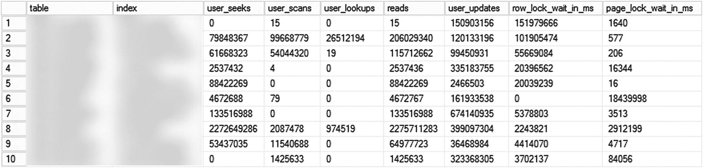

**图 12-6** 锁等待时间最长的索引

你可以使用代码清单 12-5 中的代码来检测使用特定索引的查询。然而，结果并非绝对可靠；此代码分析的是缓存的执行计划，可能会因为某些原因错过那些计划未被缓存的查询。如果系统中启用了查询存储，你可以调整它以使用查询存储 DMV。

需要注意的是，此代码对 CPU 的消耗很大。在 CPU 受限且缓存中有大量计划的生产服务器上运行时请务必小心。

```sql
declare
@IndexName sysname = quotename('IDX_CI'); -- 在此添加索引名称
;with xmlnamespaces(default 'http://schemas.microsoft.com/sqlserver/2004/07/showplan')
,CachedData
as
(
select distinct
obj.value('@Database','sysname') as [Database]
,obj.value('@Schema','sysname') + '.' +
obj.value('@Table','sysname') as [Table]
,obj.value('@Index','sysname') as [Index]
,obj.value('@IndexKind','varchar(64)') as [Type]
,stmt.value('@StatementText', 'nvarchar(max)') as [Statement]
,convert(nvarchar(max),qp.query_plan) as query_plan
,cp.plan_handle
from
sys.dm_exec_cached_plans cp with (nolock)
cross apply sys.dm_exec_query_plan(plan_handle) qp
cross apply query_plan.nodes
('/ShowPlanXML/BatchSequence/Batch/Statements/StmtSimple') batch(stmt)
cross apply stmt.nodes
('.//IndexScan/Object[@Index=sql:variable("@IndexName")]') idx(obj)
)
select
cd.[Database]
,cd.[Table]
,cd.[Index]
,cd.[Type]
,cd.[Statement]
,convert(xml,cd.query_plan) as query_plan
,qs.execution_count
,(qs.total_logical_reads + qs.total_logical_writes) /
qs.execution_count as [Avg IO]
,qs.total_logical_reads
,qs.total_logical_writes
,qs.total_worker_time
,qs.total_worker_time / qs.execution_count /
1000 as [Avg Worker Time (ms)]
,qs.total_rows
,qs.creation_time
,qs.last_execution_time
from
CachedData cd
outer apply
(
select
sum(qs.execution_count) as execution_count
,sum(qs.total_logical_reads) as total_logical_reads
,sum(qs.total_logical_writes) as total_logical_writes
,sum(qs.total_worker_time) as total_worker_time
,sum(qs.total_rows) as total_rows
,min(qs.creation_time) as creation_time
,max(qs.last_execution_time) as last_execution_time
from sys.dm_exec_query_stats qs with (nolock)
where qs.plan_handle = cd.plan_handle
) qs
option (recompile, maxdop 1)
```

**代码清单 12-5** 识别使用特定索引的查询

`sys.dm_db_index_usage_stats` 和 `sys.dm_db_index_operational_stats` 这两个视图都提供了在性能故障排除期间非常有用的信息。然而，数据可能不完整。这些视图不包含在可用组的可读辅助副本上运行的查询的使用统计信息。SQL Server 也不会持久化数据库中的数据以使其在 SQL Server 重启后保留。最后，在 SQL Server 2012 RTM-SP3 CU2、SQL Server 2014 RTM 和 SP1 中，这些视图在索引重建操作时会被清除。

请谨慎使用数据，并在分析时将结果与其他来源关联起来。


#### 注意

你可以通过以下链接获取关于 `sys.dm_db_index_usage_stats` 视图的更多信息：[`https://docs.microsoft.com/en-us/sql/relational-databases/system-dynamic-management-views/sys-dm-db-index-usage-stats-transact-sql`](https://docs.microsoft.com/en-us/sql/relational-databases/system-dynamic-management-views/sys-dm-db-index-usage-stats-transact-sql)。关于 `sys.dm_db_index_operational_stats` 视图的信息可在此处找到：[`https://docs.microsoft.com/en-us/sql/relational-databases/system-dynamic-management-views/sys-dm-db-index-operational-stats-transact-sql`](https://docs.microsoft.com/en-us/sql/relational-databases/system-dynamic-management-views/sys-dm-db-index-operational-stats-transact-sql)。

## 阻塞链

在解决并发问题时，一个常见的挑战是*阻塞链*，它代表了一种多级阻塞的情况。正如你所记得的，锁请求只有在与资源上所有其他请求（无论它们是已授予还是待处理状态）都兼容时，才能被授予。

图 12-7 说明了这种情况。会话 1 在表上持有意向排他锁，这与请求的模式修改锁不兼容。模式修改锁与所有锁类型都不兼容，因此会阻止其他所有试图访问该表的会话，即使它们的锁请求与会话 1 持有的意向排他锁兼容。

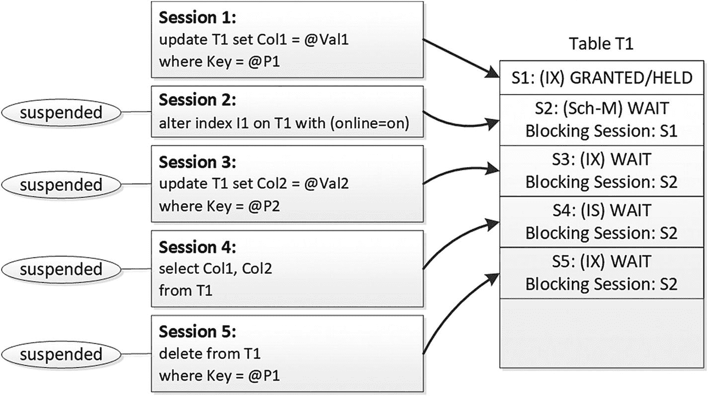

**图 12-7 阻塞链**

当这种情况发生时，会话 2 可能成为系统中大量其他会话的*阻塞会话*。在数据管理视图和被阻塞的进程报告中，它将作为*阻塞者*被显示出来。另一方面，会话 1 只会成为会话 2 的阻塞会话，这在故障排除时可能会产生误导。

让我们用一个稍微复杂的代码示例来说明这一点。清单 12-6 在 `SPID=53` 的会话中更新了 `Delivery.Customers` 表的一行。

```sql
begin tran
update Delivery.Customers
set Phone = '111-111-1234'
where CustomerId = 1;
-- 清单 12-6
-- 阻塞链：步骤 1（SPID=53）
```

作为下一步，我们在 `SPID=56` 的会话中运行清单 12-7 的代码。第一条语句在 `Delivery.Orders` 表上获取一个意向排他锁。第二条语句扫描 `Delivery.Customers` 表，并因与第一个 `SPID=53` 的会话存在不兼容的排他锁而被阻塞。

```sql
begin tran
update Delivery.Orders
set Pieces += 1
where OrderId = 1;
select count(*)
from Delivery.Customers with (readcommitted);
-- 清单 12-7
-- 阻塞链：步骤 2（SPID=56）
```

接下来，我们在 `SPID=57` 的会话中运行清单 12-8 的代码。此代码试图在 `Delivery.Orders` 表上获取一个共享锁，并将被 `SPID=56` 的会话持有的不兼容的意向排他锁阻塞。

```sql
select count(*)
from Delivery.Orders with (tablock);
-- 清单 12-8
-- 阻塞链：步骤 3（SPID=57）
```

最后，我们在几个 `SPID=60` 及以上的会话（你可以在每个会话中使用不同的 `OrderId`）中运行清单 12-9 的代码。这些会话需要获取 `Delivery.Orders` 表上的意向排他锁，并将被 `SPID=57` 的会话持有的不兼容的共享锁请求阻塞。

```sql
update Delivery.Orders
set Pieces += 1
where OrderId = 5000;
-- 清单 12-9
-- 阻塞链：步骤 4（SPID>=60）
```

图 12-8 展示了 `sys.dm_os_waiting_tasks` 和 `sys.dm_exec_requests` DMV 的部分输出。它可能显示 `SPID=57` 的会话是阻塞源。然而，这是不正确的，你需要在故障排除时将阻塞链展开，直到 `SPID=53` 的会话。

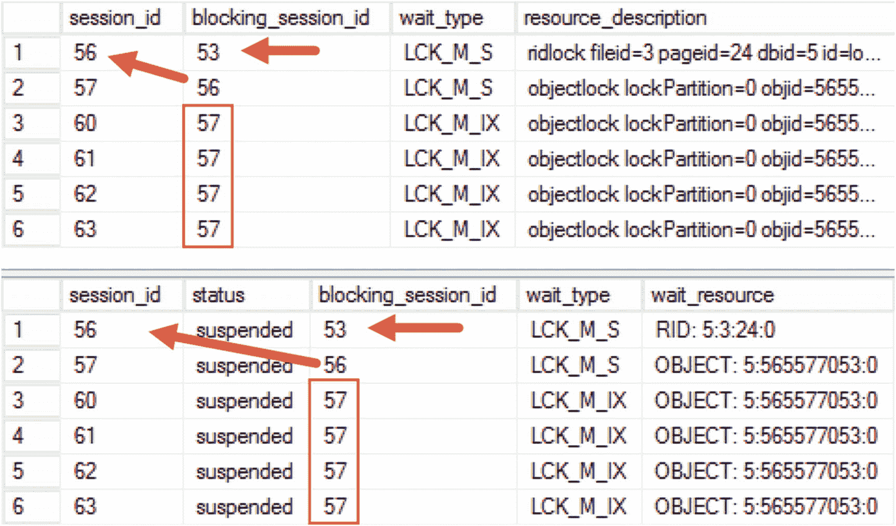

**图 12-8 sys.dm_os_waiting_tasks 和 sys.dm_exec_requests 视图的输出**

同样值得注意的是，根本阻塞者 `SPID=53` 并未出现在输出中。`sys.dm_os_waiting_tasks` 和 `sys.dm_exec_requests` 视图分别显示当前挂起和已执行的请求。在我们的例子中，`SPID=53` 的会话处于*睡眠*状态，因此这两个视图都不包含它。

图 12-9 显示了 `SPID` 为 60、57 或 56 的会话的阻塞进程报告的部分输出。你可以通过阻塞进程的 `suspended` 状态以及与锁定相关的 `waitresource` 来检测阻塞链状况。

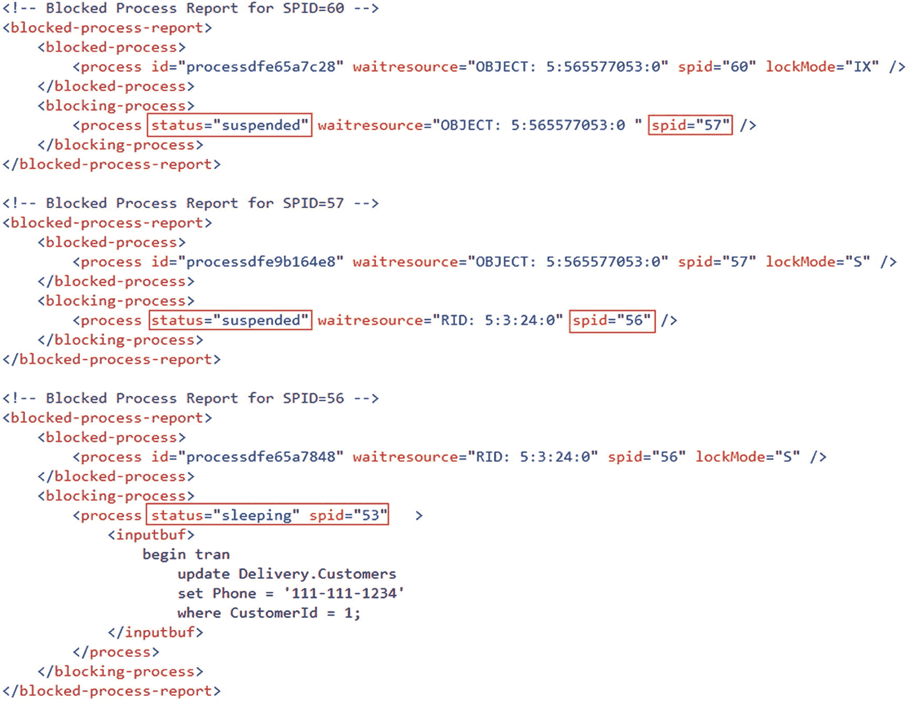

**图 12-9 被阻塞的进程报告**

尽管阻塞链可能会增加额外的复杂性，但它们不会改变你的故障排除方法。你需要展开阻塞链以识别阻塞的根本原因并解决该问题。

## AlwaysOn 可用性组与阻塞

AlwaysOn 可用性组可能已成为与 SQL Server 一起使用的最常见的高可用性技术。该技术提供数据库组级别的保护，并在每个服务器/节点上存储数据库的单独副本。这消除了 SQL Server 级别的单点故障；然而，其内部仍然依赖于 Windows 或 Linux 故障转移群集。

AlwaysOn 可用性组的实现和维护值得单独写一本书来探讨。然而，有几件事可能会影响系统中的阻塞和并发性。


### 同步提交延迟

AlwaysOn 可用性组由一个*主*节点和一个或多个*辅助*节点/服务器组成。所有数据修改均在主节点上进行，主节点将事务日志记录流发送到辅助节点。这些日志记录在辅助节点上的事务日志中被保存（*固化*），然后由一组*REDO 线程*异步地重新应用到那里的数据文件中。假设没有延迟，可用性组中的每个服务器都将存储与数据库字节级完全相同的副本。

辅助节点可以配置为使用*异步*或*同步*提交。在异步提交模式下，当 `COMMIT` 日志记录在主节点上固化后，事务即被视为已提交。然后 SQL Server 会将该 `COMMIT` 记录发送给辅助节点；但是，它不会等待该记录在辅助节点的日志中固化的确认。此过程如图 12-10 所示。

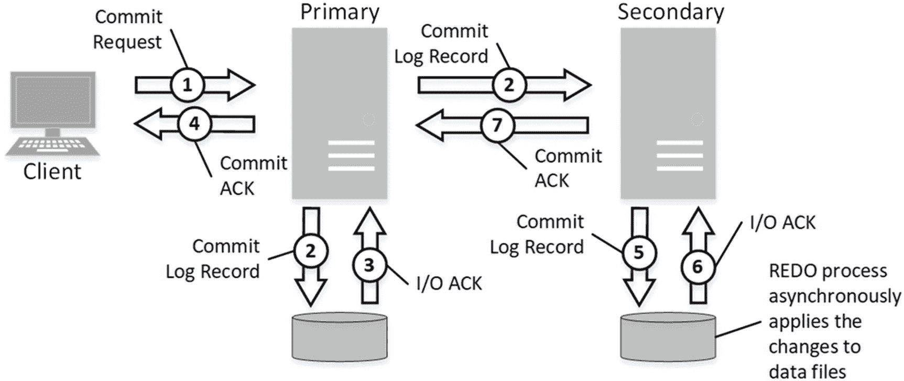

图 12-10 异步提交

可以想到，这种行为会降低可用性组引入的开销，但代价是，在某些日志记录尚未发送到辅助节点之前，如果主节点发生崩溃/数据损坏，则可能发生数据丢失。

当您使用同步提交时，这种行为会发生变化，如图 12-11 所示。在此模式下，SQL Server 在收到 `COMMIT` 日志记录已在辅助节点日志中固化的确认之前，不会认为事务已提交。虽然这种方法可以避免数据丢失，但会导致额外的提交延迟，因为主节点正在等待辅助服务器的确认。

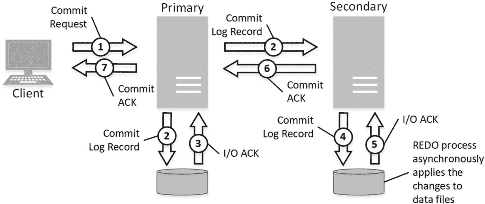

图 12-11 同步提交

高同步提交延迟可能会在系统中引入微妙且难以理解的并发问题。SQL Server 会保持事务处于活动状态，并且在收到提交确认之前不会释放锁。这会增加锁请求竞争和系统中阻塞的可能性。

还有另一个潜在问题。某些操作——例如索引维护——可能会生成大量的事务日志记录并使发送队列饱和。这可能导致极高的提交延迟，并在系统中引入严重的阻塞。

#### 提示

您可以通过降低语句的 `MAXDOP` 选项来限制索引维护操作的日志生成速率。请记住，这会增加操作所需的时间。

您可以使用 `HADR_SYNC_COMMIT` 等待类型来监控同步提交延迟。从 `sys.dm_os_wait_stats` 视图中获取的平均等待时间将为您提供延迟信息。请记住，在非典型的、日志密集型工作负载期间，延迟可能会严重偏离；在对特定时间点的延迟进行故障排除时，可以考虑使用 `DBCC SQLPERF('sys.dm_os_wait_stats', CLEAR)` 命令清除等待统计信息。

高提交延迟故障排除需要您定位瓶颈并识别在此过程中消耗时间最多的部分。主要有三个因素导致延迟：

1.  日志记录在发送队列中等待的时间。您可以使用清单 12-10 中的代码，利用 `[Send Queue Size(KB)]` 和 `[Send Rate KB/Sec]` 列的数据来分析这一点。值得注意的是，队列管理过程是 CPU 密集型的，在 CPU 负载高的系统中可能会导致额外的延迟。
2.  网络吞吐量。您可以使用与网络相关的性能计数器对其进行故障排除。还有一些与可用性组相关的性能计数器，它们指示节点之间发送的数据量。
3.  辅助节点上的 I/O 延迟。同步提交要求 `COMMIT` 日志记录在事务日志中固化后才会向主节点发送确认。您可以使用 `sys.dm_io_virtual_file_stats` 视图来监控事务日志文件的写入延迟。我在本书的配套材料中包含了允许您执行此操作的脚本。

```
select
ag.name as [Availability Group]
,ar.replica_server_name as [Server]
,db_name(drs.database_id) as [Database]
,case when ars.is_local = 1 then 'Local' else 'Remote' end
,case as [DB Location]
,ars.role_desc as [Replica Role]
,drs.synchronization_state_desc as [Sync State]
,ars.synchronization_health_desc as [Health State]
,drs.log_send_queue_size as [Send Queue Size (KB)]
,drs.log_send_rate as [Send Rate KB/Sec]
,drs.redo_queue_size as [Redo Queue Size (KB)]
,drs.redo_rate as [Redo Rate KB/Sec]
from
sys.availability_groups ag with (nolock)
join sys.availability_replicas ar  with (nolock) on
ag.group_id = ar.group_id
join sys.dm_hadr_availability_replica_states ars  with (nolock) on
ar.replica_id = ars.replica_id
join sys.dm_hadr_database_replica_states drs  with (nolock) on
ag.group_id = drs.group_id and drs.replica_id = ars.replica_id
order by
ag.name, drs.database_id, ar.replica_server_name
```

清单 12-10 分析可用性组队列

虽然网络和 I/O 性能有时可以通过硬件升级来解决，但在非常繁忙的 OLTP 系统中，处理由大量日志记录引起的延迟要困难得多。您可以通过使用更高时钟频率的 CPU 来减少队列管理的影响；然而，硬件所能达到的效果存在一些限制。

当您遇到这种情况时，可以采取以下几项措施：

*   确保 SQL Server 调度程序在 NUMA 节点之间均匀平衡。例如，如果 SQL Server 在一个具有 2 个 NUMA 节点、每个节点 8 个内核的服务器上使用 10 个内核，则设置关联性掩码以使用每个节点 5 个内核。调度不均衡可能会在系统中引入各种性能问题，并影响可用性组吞吐量。
*   减少系统中生成的日志记录数量。一些选择是：重新设计事务策略以避免自动提交的事务；删除未使用和冗余的索引；微调索引的 `FILLFACTOR` 属性以减少系统中的页拆分。
*   重新设计系统中的数据层。系统中的不同数据可能具有不同的 RPO（*恢复点目标*）要求和对数据丢失的容忍度，这种情况非常常见。您可以考虑将某些数据移动到另一个不需要同步提交的可用性组，和/或对某些实体利用 NoSQL 技术。
*   最后，如果您使用的是 SQL Server 2016 之前的版本，您应该考虑升级到产品的最新版本。SQL Server 2016 具有若干内部优化，可显著提高可用性组吞吐量，远超 SQL Server 2012 和 2014。在许多情况下，这可能是最简单的解决方案。

#### 注意

在同步数据库镜像中，您也可能会遇到相同的提交延迟问题。在这种情况下，您应该监控 `DBMIRROR_SEND` 等待类型。


### 可读辅助副本与行版本控制

SQL Server 企业版允许你配置 AlwaysOn 可用性组中辅助节点的只读访问，从而扩展系统中的只读工作负载。然而，这可能会对可用性组中的主节点产生意外副作用。

当针对辅助节点运行查询时，SQL Server 总是使用 `SNAPSHOT` 隔离级别，忽略 `SET TRANSACTION ISOLATION LEVEL` 语句和锁定提示。这使得它能够消除可能的读写阻塞，即使你没有启用 `ALLOW_SNAPSHOT_ISOLATION` 数据库选项，此行为也会发生。

这也意味着 SQL Server 将在主节点上使用行版本控制。当乐观隔离级别未在数据库中启用时，你可能无法在程序中使用它们；但尽管如此，SQL Server 仍会在内部使用行版本控制。主节点和辅助节点上的数据库是完全相同的，因此不可能只在辅助节点上使用行版本控制。

正如你在第 6 章所了解到的，此行为将引入额外的 `tempdb` 负载以支持版本存储。由于数据修改时附加到数据行的 14 字节指针，它还可能增加索引碎片。然而，这还会导致另一种现象：辅助节点上长时间运行的 `SNAPSHOT` 事务可能会延迟主节点上的幽灵记录和版本存储清理。SQL Server 无法删除已删除的行并重用空间，因为辅助节点上的 `SNAPSHOT` 事务可能需要访问这些行的旧版本。

让我们看一个例子，并在数据库中创建两个表，如代码清单 12-11 所示。表 `dbo.T1` 将有 65,536 行，并占用 65,536 个页面——每个数据页面一行。

```sql
create table dbo.T1
(
ID int not null,
Placeholder char(8000) null,
constraint PK_T1
primary key clustered(ID)
);
create table dbo.T2
(
Col int
);
;with N1(C) as (select 0 union all select 0) -- 2 rows
,N2(C) as (select 0 from N1 as T1 cross join N1 as T2) -- 4 rows
,N3(C) as (select 0 from N2 as T1 cross join N2 as T2) -- 16 rows
,N4(C) as (select 0 from N3 as T1 cross join N3 as T2) -- 256 rows
,N5(C) as (select 0 from N4 as T1 cross join N4 as T2 ) -- 65,536 rows
,IDs(ID) as (select row_number() over (order by (select null)) from N5)
insert into dbo.T1(ID)
select ID from IDs;
```
代码清单 12-11: 可读辅助副本：创建表

下一步，让我们在辅助节点上启动一个事务，并针对 `dbo.T2` 表运行查询，如代码清单 12-12 所示。即使我们使用显式事务，在自动提交事务中长时间运行的语句也会发生相同的行为。

```sql
begin tran
select * from dbo.T2;
```
代码清单 12-12: 可读辅助副本：在辅助节点上启动事务

接下来，让我们从 `dbo.T1` 表中删除所有数据，然后在主节点上运行一个将进行聚集索引扫描的查询。代码如代码清单 12-13 所示。

```sql
delete from dbo.T1;
go
-- 等待 1 分钟
waitfor delay '00:01:00.000';
set statistics io on
select count(*) from dbo.T1;
set statistics io off
--输出：Table 'T1'. Scan count 1, logical reads 65781
```
代码清单 12-13: 可读辅助副本：删除数据并执行聚集索引扫描

如你所见，尽管表是空的，但数据页并未被释放。这导致主节点上显著的 I/O 开销。

最后，让我们使用代码清单 12-14 中的代码查看索引统计信息。

```sql
select index_id, index_level, page_count, record_count, version_ghost_record_count
from sys.dm_db_index_physical_stats(db_id(),object_id(N'dbo.T1'),1,NULL,'DETAILED');
```
代码清单 12-14: 可读辅助副本：分析索引统计信息

图 12-12 显示了查询的输出。如你所见，索引叶子级在 `version_ghost_record_count` 列中显示了 65,536 行。此列包含由于系统中依赖行版本控制的活动事务而无法删除的幽灵记录数量。在我们的例子中，此事务运行在另一个（辅助）节点上。

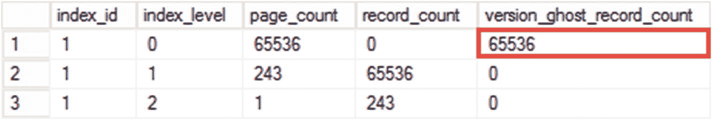

图 12-12: 索引统计信息

这种行为本身并不特殊。如果 `SNAPSHOT` 事务在主节点上运行，幽灵记录和版本存储清理任务的行为方式也会相同。然而，常见的情况是，人们在没有理解其可能对主节点产生影响的情况下，将未优化的报表查询卸载到辅助节点上。

在计划使用可读辅助副本时请记住此行为，并应用与在系统中启用乐观隔离级别时相同的考虑因素。另一方面，在启用可读辅助副本时，完全没有理由避免使用乐观隔离级别。即使你未在数据库中启用它，SQL Server 也已经在内部使用行版本控制。


## 使用阻塞监控框架

等待统计分析提供了系统健康的整体视图，有助于识别系统所有区域（包括锁和阻塞）的瓶颈。你可能能够评估系统受并发问题影响的严重程度；然而，最终你仍需要检测并处理个别的阻塞和死锁案例来解决问题。

正如我们已经在本书第 4 章和第 5 章中讨论过的，故障排除相对直接。你需要通过反向工程阻塞或死锁状况来理解问题的根本原因。你需要识别涉及的资源、锁类型和进程，并分析为什么这些进程获取、持有并竞争相同资源上的锁。在大多数情况下，这需要你分析查询及其执行计划。

被阻塞进程报告和死锁图都包含所需的信息。然而，它们依赖于事件发生时的 SQL Server 状态。在许多情况下，你需要查询 `计划缓存` 和其他 `数据管理视图` 来获取查询的文本和计划。等待的时间越长，信息可用的可能性就越低。

市场上有大量的监控工具，其中许多会捕获并为你提供数据。作为另一种选择，你可以安装本书前面提到过的阻塞监控框架。该框架使用 `事件通知`，它解析被阻塞进程报告和死锁图，并将数据持久化在一组表中。解析发生在事件发生时，此时信息仍可通过 `数据管理视图` 获取。

在撰写本书时，该框架包含三个主要表：

*   `dbo.BlockedProcessesInfo` 表根据被阻塞进程报告存储有关阻塞发生的信息。它包括阻塞的持续时间、涉及的资源和锁类型、阻塞会话和被阻塞会话的详细信息，以及查询及其执行计划。

*   `dbo.Deadlocks` 表存储有关系统中死锁事件的信息。

*   `dbo.DeadlockProcesses` 表提供有关涉及死锁的进程的信息，包括触发死锁的语句的文本和执行计划。

你可以使用捕获的数据来排除个别的阻塞事件。此外，你还可以对其进行聚合，以识别最常涉及阻塞或死锁情况的查询。

代码清单 12-15 展示了返回过去三天内被阻塞次数最多的十个查询的代码。它按 `plan_hash` 对数据进行分组，该字段将具有相似执行计划的查询组合在一起。考虑那些参数值不同但最终执行计划相似的即席查询，如示例所示。

该代码返回与 `plan_hash` 值匹配的第一个查询和执行计划，以及阻塞统计信息。或者，在 SQL Server 2016 及以上版本中，你可以将数据与查询存储数据管理视图连接，以关联来自多个来源的信息。

#### 注意

你可以使用 `dbo.DeadlockProcesses` 表代替 `dbo.BlockedProcessesInfo` 表，来获取最常涉及死锁的查询的信息。

```sql
;with Data
as
(
select top 10
i.BlockedPlanHash
,count(*) as [Blocking Counts]
,sum(WaitTime) as [Total Wait Time (ms)]
from
dbo.BlockedProcessesInfo i
group by
i.BlockedPlanHash
order by
sum(WaitTime) desc
)
select
d.*, q.BlockedSql
from
Data d
cross apply
(
select top 1 BlockedSql
from dbo.BlockedProcessesInfo i2
where i2.BlockedPlanHash = d.BlockedPlanHash
order by EventDate desc
) q;
```
代码清单 12-15
获取被阻塞次数最多的前 10 个查询

代码清单 12-16 展示了返回最常因等待对象级意向（I*）锁而导致阻塞的表列表的代码。这种阻塞可能由于锁升级而发生，你可以在受影响的表上禁用它来获益。

别忘了，架构修改（Sch-M）锁也会阻塞所有其他对象级锁请求——在分析时请将其考虑在内。

```sql
;with Objects(DBID,ObjID,WaitTime)
as
(
select
ltrim(rtrim(substring(b.Resource,8,o.DBSeparator - 8)))
,substring(b.Resource, o.DBSeparator + 1, o.ObjectLen)
,b.WaitTime
from
dbo.BlockedProcessesInfo b
cross apply
(
select
charindex(':',Resource,8) as DBSeparator
,charindex(':',Resource, charindex(':',Resource,8) + 1) -
charindex(':',Resource,8) - 1 as ObjectLen
) o
where
left(b.Resource,6) = 'OBJECT' and
left(b.BlockedLockMode,1) = 'I'
)
select
db_name(DBID) as [database]
,object_name(ObjID, DBID) as [table]
,count(*) as [# of events]
,sum(WaitTime) / 1000 as [Wait Time(Sec)]
from Objects
group by
db_name(DBID), object_name(ObjID, DBID);
```
代码清单 12-16
识别可能因锁升级相关阻塞而受影响的表

阻塞监控框架是分析和排除并发问题的极其有用的工具。我建议你在服务器上安装它。

#### 注意

该框架的当前（2018 年 8 月）版本包含在本书的配套材料中。你可以从我的博客下载最新版本： [`http://aboutsqlserver.com/bmframework/`](http://aboutsqlserver.com/bmframework/) 。

## 总结

数据库并非存在于真空中。它们是一个庞大生态系统的一部分，该系统包括各种硬件和软件组件。客户端应用程序的缓慢和无响应不一定是数据库或 SQL Server 相关的问题。问题的根本原因可能存在于系统中的任何地方，从硬件配置错误到不正确的应用程序代码。

在故障排除过程中，将检查整个系统基础设施作为初始步骤非常重要。这包括硬件的性能特性、网络拓扑和吞吐量、操作系统和 SQL Server 配置，以及在服务器上运行的进程和数据库。

SQL Server 由几个主要组件组成，包括协议层、查询处理器、存储引擎、实用工具和 SQL Server 操作系统（`SQLOS`）。`SQLOS` 是操作系统和所有其他 SQL Server 组件之间的层，它负责调度、资源管理和其他一些低级任务。

`SQLOS` 创建的调度器数量等于系统中逻辑处理器的数量。每个调度器负责管理一组执行工作的工作者。每个任务在执行期间被分配给一个或多个工作者。

任务在执行期间保持三种主要状态之一：`运行中`（当前在调度器上执行）、`可运行`（等待调度器执行）和`已挂起`（等待资源）。SQL Server 追踪不同类型等待的累计等待时间，并将此信息暴露给用户。等待统计分析是一种常见的性能故障排除技术，它分析系统主要的等待类型，并消除等待的根本原因。

每种锁类型都有对应的等待类型，这有助于你识别系统中发生最多的阻塞类型。尽管如此，你仍然需要分析个别的阻塞和死锁案例，理解事件的根本原因，并在故障排除过程中解决它们。


