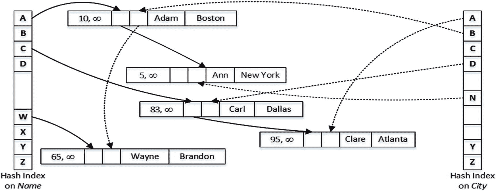
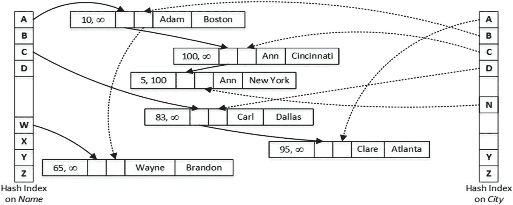
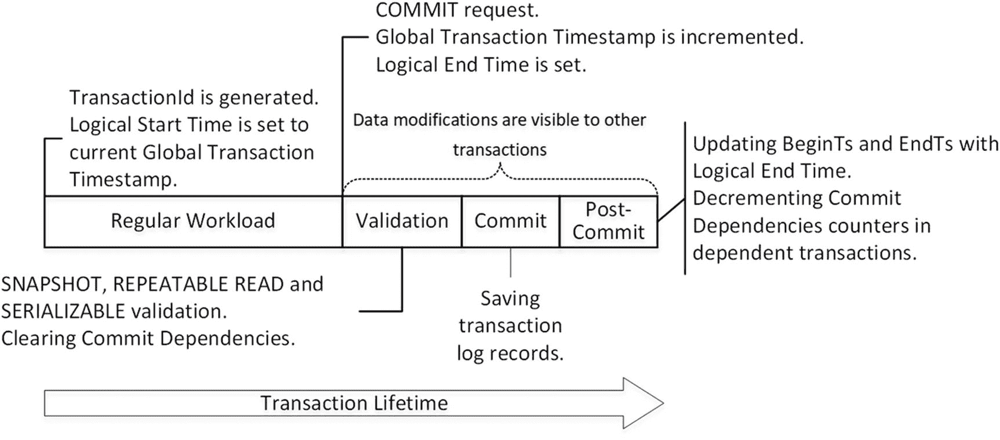
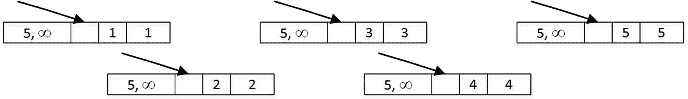
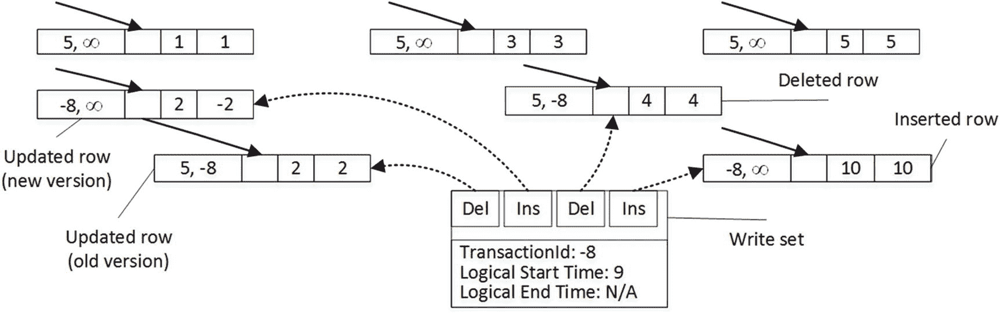
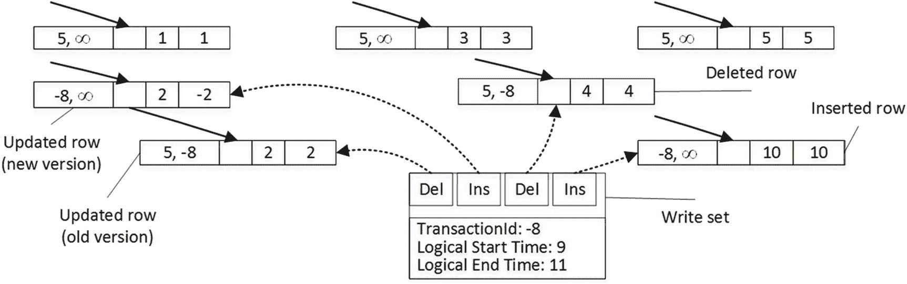
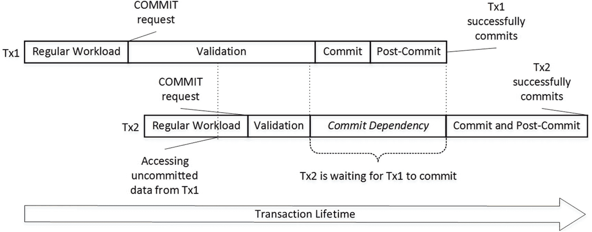
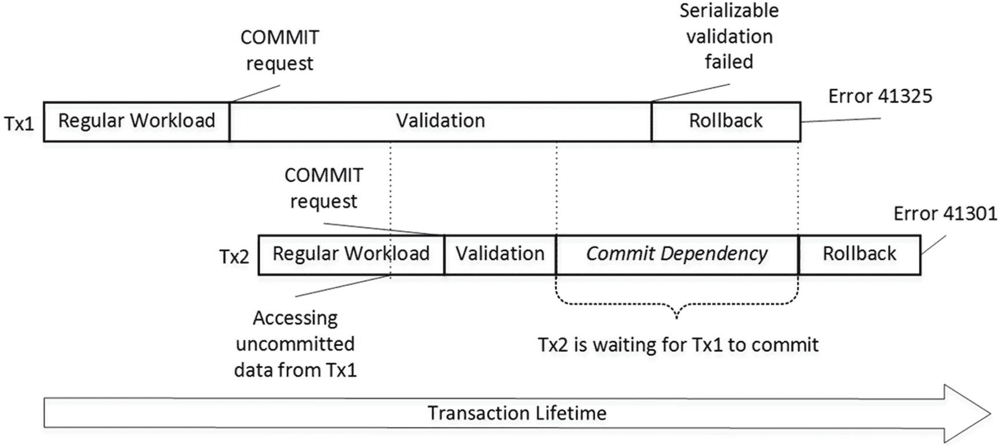
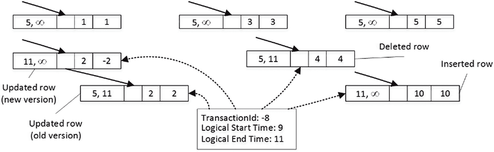
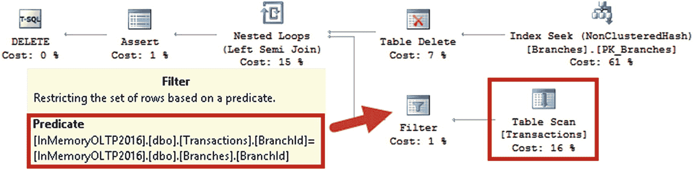

# 13. 内存 OLTP 并发模型

内存 OLTP 技术于 SQL Server 2014 中引入，能显著提升 OLTP 系统的性能和吞吐量。其关键技术组件——内存优化表——将数据存储在内存中，采用无锁无闩的多版本并发控制。

本章将概述内存 OLTP 并发模型，并解释引擎内部如何处理事务。

## 内存 OLTP 概述

回溯到 SQL Server 及其他主流数据库最初设计的年代，硬件非常昂贵。那时的服务器仅有单个或极少几个 CPU，以及少量已安装内存。数据库服务器必须处理驻留在磁盘上的数据，按需将其加载到内存。

自那时起，情况已发生翻天覆地的变化。过去 30 年间，内存价格每五年就下降十倍，硬件也变得更加经济实惠。虽然数据库确实变得更大了，但通常*活跃的*运营数据已能装入内存。

显然，将数据缓存在缓冲池中是有益的。它减轻了 I/O 子系统的负载并提升了系统性能。然而，当系统处于高并发负载下时，仅靠此往往不足以获得所需的吞吐量。SQL Server 管理和保护内存中的页结构，这引入了巨大的开销，且扩展性不佳。即使采用行级锁，多个会话也无法同时修改同一数据页上的数据；它们必须彼此等待。

或许最后一句话需要澄清。显然，多个会话可以修改同一数据页上的数据行，同时持有不同行上的排他锁（`X`）。然而，它们无法同时更新*物理*数据页和行对象，因为这可能破坏内存中的页结构。SQL Server 通过*闩锁*保护页来解决此问题。闩锁的工作方式类似于锁，在物理级别保护内部 SQL Server 数据结构，通过串行化对它们的写访问，使得在任何给定时间点只有一个线程能更新内存中数据页上的数据。

最终，这限制了当前数据库引擎架构所能实现的性能提升。尽管你可以通过添加更多 CPU 和核心来扩展硬件，但那种串行化迅速成为瓶颈，并限制了系统可扩展性的提升。

#### 注意

你可以监控用户数据库中资源的`PAGELATCH*`等待，以理解系统中闩锁争用的影响。

于 SQL Server 2014 引入的内存 OLTP 引擎解决了该问题。该引擎的核心组件——内存优化表——完全在内存中存储和管理所有数据，仅出于持久化目的将其持久化到磁盘。简而言之，数据行是独立的内存对象。它们不存储在数据页上；行通过内存指针链链接在一起——每个索引一条链。同样值得注意的是，内存优化表不与基于磁盘的表共享内存，它们存在于缓冲池之外。

让我们通过一个例子来说明这一点，并创建一个内存优化表，如代码清单 13-1 所示。

#### 注意

该技术要求你在数据库中创建另一个文件组来存储内存 OLTP 数据。数据库创建脚本包含在本书的配套材料中。

```sql
create table dbo.People
(
Name varchar(64) not null
constraint PK_People
primary key nonclustered
hash with (bucket_count = 1024),
City varchar(64) not null,
index IDX_City nonclustered hash(City)
with (bucket_count = 1024),
)
with (memory_optimized = on, durability = schema_and_data);
```
代码清单 13-1
创建内存优化表

该表在`Name`和`City`列上定义了两个哈希索引。哈希索引是内存 OLTP 支持的一种新型索引。本书不会深入讨论它们，但概括而言，它们由一个哈希表（哈希桶数组，每个桶包含一个指向数据行的内存指针）组成。SQL Server 对索引键列应用哈希函数，函数的结果决定一行属于哪个桶。所有具有相同哈希值并属于同一桶的行链接在一个行链中；每一行都有一个指向链中下一行的指针。

#### 注意

正确设定哈希索引中的哈希表大小极为重要。你应该将`bucket_count`定义为索引中唯一键值数量的约 1.5 到 2 倍。

内存 OLTP 也支持非聚集索引，其结构与基于磁盘的表中的 B-Tree 索引相对相似。当索引选择性无法估计时，它们是不错的选择。

图 13-1 对此进行了说明。实线箭头代表`Name`列索引中的指针。虚线箭头代表`City`列索引中的指针。为简便起见，我们假设哈希函数根据字符串的首字母生成哈希值。每行中显示的两个数字表示行生存期，我稍后会解释。



图 13-1
具有两个哈希索引的内存优化表


## 多版本并发控制

### 行版本与时间戳

正如我刚才提到的，内存优化表中的每一行都有两个值，称为 `BeginTs` 和 `EndTs`，它们定义了该行的生命周期。SQL Server 实例维护一个 `Global Transaction Timestamp` 值，该值在事务提交时自动递增，且对于每个已提交的事务都是唯一的。`BeginTs` 存储插入该行事务的 `Global Transaction Timestamp`，而 `EndTs` 存储删除该行事务的时间戳。对于尚未删除的行，使用一个称为 `Infinity` 的特殊值作为其 `EndTs`。

内存优化表中的行永远不会被更新。更新操作会创建该行的一个新版本，并将新的 `Global Transaction Timestamp` 设置为该版本的 `BeginTs`，然后通过将旧版本行的 `EndTs` 时间戳设置为相同的值来将其标记为已删除。

### 事务可见性规则

当一个新事务开始时，内存 OLTP 会为其分配一个 `logical start time`，该值代表事务开始时的 `Global Transaction Timestamp`。这决定了哪些版本的行对该事务可见。一个事务只有在其 `logical start time`（即事务开始时的全局时间戳）介于某行的 `BeginTs` 和 `EndTs` 之间时，才能看到该行。

为了说明这一点，假设我们运行了清单 [13-2] 所示的语句，并在 `Global Transaction Timestamp` 值为 100 时提交了该事务。

```sql
update dbo.People
set City = 'Cincinnati'
where Name = 'Ann'
```

> 清单 13-2
> 在 `dbo.People` 表中更新数据

图 [13-2] 展示了此更新事务提交后表中的数据。如你所见，我们现在有两行 `Name='Ann'` 但生命周期不同的数据。新行被追加到由 `Name` 列索引的哈希桶 `A` 所引用的行链中。`City` 列上的哈希索引的 `C` 桶之前没有引用任何行；因此，新行成为从该桶引用的行链中的第一行。



> 图 13-2
> 更新后表中的数据

假设你需要在一个 `logical start time`（事务开始时的 `Global Transaction Timestamp`）为 110 的事务中运行一个查询，该查询选择所有 `Name='Ann'` 的行。SQL Server 会计算 `Ann` 的哈希值（即 `A`），然后在 `Name` 列的哈希索引中找到对应的桶。它跟随从该桶发出的指针，该指针引用了一个 `Name='Adam'` 的行。此行的 `BeginTs` 为 10，`EndTs` 为 `Infinity`，因此它对事务可见。然而，`Name` 值不匹配谓词，因此该行被忽略。

接下来，SQL Server 跟随从 `Adam` 索引指针数组发出的指针，该指针引用了第一个 `Ann` 行。此行的 `BeginTs` 为 100，`EndTs` 为 `Infinity`，因此它对事务可见并需要被选中。

作为最后一步，SQL Server 跟随索引中的下一个指针。尽管最后一行也有 `Name='Ann'`，但它的 `EndTs` 为 100，因此对该事务不可见。

### 垃圾回收

SQL Server 会跟踪系统中的活动事务，并检测那些 `EndTs` 时间戳早于系统中 `oldest active transaction` 的 `logical start time` 的过时行。这些过时行对系统中的活动事务不可见，并最终由 `garbage collection` 进程从索引行链中移除并释放。

### 与隔离级别的关系

正如你可能已经注意到的，这种并发行为和数据一致性对应于 `SNAPSHOT` 事务隔离级别，即每个事务看到的数据都是其开始时的状态。`SNAPSHOT` 是内存 OLTP 引擎的默认事务隔离级别，该引擎也支持 `REPEATABLE READ` 和 `SERIALIZABLE` 隔离级别。然而，内存 OLTP 中的 `REPEATABLE READ` 和 `SERIALIZABLE` 事务的行为与基于磁盘的表不同。如果违反了 `REPEATABLE READ` 或 `SERIALIZABLE` 数据一致性规则，内存 OLTP 会引发异常并回滚事务，而不是像基于磁盘的表那样阻塞事务。

内存 OLTP 文档还指出，自动提交的（单条语句）事务可以在 `READ COMMITTED` 隔离级别下运行。但这有点误导性。SQL Server 会在 `SNAPSHOT` 隔离级别下提升并执行此类事务，而不需要你在代码中显式指定隔离级别。与 `SNAPSHOT` 事务类似，自动提交的 `READ COMMITTED` 事务不会看到在其开始之后提交的更改，这与针对基于磁盘的表执行的 `READ COMMITTED` 事务的行为不同。

让我们更详细地研究事务隔离级别和内存 OLTP 并发模型。

## 内存 OLTP 中的事务隔离级别

内存 OLTP 支持三种事务隔离级别：`SNAPSHOT`、`REPEATABLE READ` 和 `SERIALIZABLE`。然而，与基于磁盘的表相比，内存 OLTP 采用了一种完全不同的方法来执行数据一致性规则。内存 OLTP 不会阻塞其他会话或被其他会话阻塞，而是在事务 `COMMIT` 时验证数据一致性，如果违反了规则，则会引发异常并回滚事务：

### 快照隔离级别

在 `SNAPSHOT` 隔离级别下，其他会话所做的任何更改对该事务都是不可见的。`SNAPSHOT` 事务始终使用事务开始时的数据快照进行工作。在提交时进行的唯一验证是检查主键约束是否被违反，这称为 `快照验证`。

### 可重复读隔离级别

在 `REPEATABLE READ` 隔离级别下，内存 OLTP 会验证事务读取的行是否未被其他事务修改或删除。如果发生这种情况，`REPEATABLE READ` 事务将无法提交。该操作称为 `可重复读验证`，它在快照验证之外额外执行。

### 可序列化隔离级别

在 `SERIALIZABLE` 隔离级别下，SQL Server 会执行可重复读验证，并检查其他会话可能插入的幻影行。此过程称为 `可序列化验证`，它在快照验证之外额外执行。

让我们看几个展示此行为的示例。第一步，如清单 13-3 所示，我们创建一个内存优化表并插入几行数据。我们将在每次测试前运行该脚本，将数据重置为其原始状态。

```sql
drop table if exists dbo.HKData;
create table dbo.HKData
(
ID int not null
constraint PK_HKData
primary key nonclustered hash with (bucket_count=64),
Col int not null
)
with (memory_optimized=on, durability=schema_only);
insert into dbo.HKData(ID, Col) values(1,1),(2,2),(3,3),(4,4),(5,5);
```

*清单 13-3* 数据一致性与事务隔离级别：表创建

### 可重复读事务隔离级别中的并发

表 13-1 展示了在 `REPEATABLE READ` 事务隔离级别下并发是如何工作的。需要注意的是，SQL Server 在首次数据访问时启动事务，而不是在 `BEGIN TRAN` 语句执行时启动。因此，会话 1 的事务在第一个 `SELECT` 操作符执行时开始。

*表 13-1* `REPEATABLE READ` 事务隔离级别中的并发

| 会话 1 | 会话 2 | 结果 |
| --- | --- | --- |
| `begin tran`     `select ID, Col`     `from dbo.HKData`         `with (repeatableread)` |   |   |
|   | `update dbo.HKData``set Col = -2``where ID = 2` |   |
|      `select ID, Col`     `from dbo.HKData`         `with (repeatableread)` |   | 返回旧行的版本 (`Col` = 2) |
| `commit` |   | 消息 41305，级别 16，状态 0，第 0 行<br>当前事务因可重复读验证失败而未能提交。 |
| `begin tran`     `select ID, Col`     `from dbo.HKData`         `with (repeatableread)` |   |   |
|   | `insert into dbo.HKData``values(10,10)` |   |
|      `select ID, Col`     `from dbo.HKData`         `with (repeatableread)` |   | 不返回新行 (10,10) |
| `commit` |   | 成功 |

如您所见，对于内存优化表，其他会话能够修改活动 `REPEATABLE READ` 事务读取的数据。这导致了在 `COMMIT` 时，由于可重复读验证失败而中止事务。这与基于磁盘的表的行为完全不同，在后者中，其他会话会被阻塞，无法修改数据，直到 `REPEATABLE READ` 事务成功提交。

同样值得注意的是，对于内存优化表，`REPEATABLE READ` 隔离级别可以保护您免受 `幻读` 现象的影响，而基于磁盘的表则不具备此特性。新插入行的 `BeginTs` 值将超过活动事务的逻辑开始时间（稍后会详细说明），使其对该事务不可见。

### 可序列化事务隔离级别中的并发

下一步，让我们在 `SERIALIZABLE` 隔离级别下重复这些测试。您可以在表 13-2 中看到代码和执行结果。请记得在测试前重新运行清单 13-3 中的初始化脚本。

*表 13-2* `SERIALIZABLE` 事务隔离级别中的并发

| 会话 1 | 会话 2 | 结果 |
| --- | --- | --- |
| `begin tran`     `select ID, Col`     `from dbo.HKData`         `with (serializable)` |   |   |
|   | `update dbo.HKData``set Col = -2``where ID = 2` |   |
|      `select ID, Col`     `from dbo.HKData`         `with (serializable)` |   | 返回旧行的版本 (`Col` = 2) |
| `commit` |   | 消息 41305，级别 16，状态 0，第 0 行<br>当前事务因可重复读验证失败而未能提交。 |
| `begin tran`     `select ID, Col`     `from dbo.HKData`         `with (serializable)` |   |   |
|   | `insert into dbo.HKData``values(10,10)` |   |
|      `select ID, Col`     `from dbo.HKData`         `with (serializable)` |   | 不返回新行 (10,10) |
| `commit` |   | 消息 41325，级别 16，状态 0，第 0 行<br>当前事务因可序列化验证失败而未能提交。 |

如您所见，`SERIALIZABLE` 隔离级别会阻止会话提交事务，前提是另一个会话插入了新行并违反了可序列化验证。与 `REPEATABLE READ` 隔离级别类似，此行为也不同于基于磁盘的表，后者会成功阻塞其他会话，直到 `SERIALIZABLE` 事务完成。

### 快照事务隔离级别中的并发

最后，让我们在 `SNAPSHOT` 隔离级别下重复测试。代码和结果如表 13-3 所示。

*表 13-3* `SNAPSHOT` 事务隔离级别中的并发

| 会话 1 | 会话 2 | 结果 |
| --- | --- | --- |
| `begin tran`     `select ID, Col`     `from dbo.HKData`         `with (snapshot)` |   |   |
|   | `update dbo.HKData``set Col = -2``where ID = 2` |   |
|      `select ID, Col`     `from dbo.HKData`         `with (snapshot)` |   | 返回旧行的版本 (`Col` = 2) |
| `commit` |   | 成功 |
| `begin tran`     `select ID, Col`     `from dbo.HKData`         `with (snapshot)` |   |   |
|   | `insert into dbo.HKData``values(10,10)` |   |
|      `select ID, Col`     `from dbo.HKData`         `with (snapshot)` |   | 不返回新行 (10,10) |
| `commit` |   | 成功 |

`SNAPSHOT` 隔离级别的行为类似于基于磁盘的表，它可以防止不可重复读和幻读现象。正如您所猜测的，它不需要在提交阶段执行可重复读和可序列化验证，因此减轻了 SQL Server 的负载。但是，仍然存在快照验证，用于检查主键约束是否被违反，此验证在任何事务隔离级别下都会执行。

### 主键违反

表 13-4 展示了导致主键违反情况的代码。与基于磁盘的表不同，异常是在提交阶段引发的，而不是在第二次 `INSERT` 操作时引发的。

*表 13-4* 主键违反

## 跨容器事务

内存中 OLTP 引擎与 SQL Server 完全集成，并与经典存储引擎协同工作。数据库可以同时包含基于磁盘的表和内存优化表，并且无论其底层技术如何，您都可以透明地对它们进行查询。

涉及基于磁盘的表和内存优化表的事务称为 `跨容器事务`。您可以为基于磁盘的表和内存优化表使用不同的事务隔离级别。然而，并非所有组合都受支持。表 13-6 说明了跨容器事务中允许的事务隔离级别组合。

**表 13-6**
跨容器事务中允许的隔离级别

| 基于磁盘的表的隔离级别 | 内存优化表的隔离级别 |
| --- | --- |
| `READ UNCOMMITTED`，`READ COMMITTED`，`READ COMMITTED SNAPSHOT` | `SNAPSHOT`，`REPEATABLE READ`，`SERIALIZABLE` |
| `REPEATABLE READ`，`SERIALIZABLE` | 仅 `SNAPSHOT` |
| `SNAPSHOT` | 不支持 |

如您所知，`REPEATABLE READ` 和 `SERIALIZABLE` 隔离级别的内部实现对于基于磁盘的表和内存优化表差异很大。基于磁盘表的数据一致性规则依赖于锁，而内存中 OLTP 使用的是提交前验证。这导致在跨容器事务中出现一种情况：当基于磁盘的表需要 `REPEATABLE READ` 或 `SERIALIZABLE` 隔离级别时，SQL Server 仅支持内存优化表使用 `SNAPSHOT` 隔离级别。

此外，当基于磁盘的表需要 `SNAPSHOT` 隔离时，SQL Server 不允许访问内存优化表。简而言之，跨容器事务由两个内部事务组成：一个用于基于磁盘的表，另一个用于内存优化表。不可能在同一时刻启动这两个事务并保证事务开始时数据的状态。

作为一般准则，建议在常规工作负载的跨容器事务中使用 `READ COMMITTED`/`SNAPSHOT` 组合。这种组合提供了最小的阻塞和最低的提交前开销，在大量用例中应该是可接受的。其他组合更适用于数据迁移期间，当避免不可重复读和幻读现象很重要时。

您可能已经注意到，SQL Server 要求您在访问内存优化表时，通过表提示来指定事务隔离级别。这不适用于在显式启动（使用 `BEGIN TRAN`）的事务之外执行的单独语句。与基于磁盘的表一样，此类语句在单独的 `自动提交事务` 中执行，这些事务在语句执行期间处于活动状态。

在自动提交事务中运行的语句不需要隔离级别提示。如果省略提示，语句将以 `SNAPSHOT` 隔离级别运行。

#### 注意
内存中 OLTP 不支持隐式事务。

SQL Server 允许您在从自动提交事务访问内存优化表时保留 `NOLOCK` 提示。该提示将被忽略。但是，`READUNCOMMITTED` 提示不受支持并会触发错误。

有一个非常有用的数据库选项称为 `MEMORY_OPTIMIZED_ELEVATE_TO_SNAPSHOT`，默认情况下是禁用的。启用此选项后，SQL Server 允许您在非自动提交事务中省略隔离级别提示。如果未指定隔离级别提示并且启用了 `MEMORY_OPTIMIZED_ELEVATE_TO_SNAPSHOT` 选项，则 SQL Server 将使用 `SNAPSHOT` 隔离级别，就像自动提交事务一样。在将现有系统移植到内存中 OLTP 并且有访问已变为内存优化的表的 T-SQL 代码时，请考虑启用此选项。

| 会话 1 | 会话 2 | 结果 |
| --- | --- | --- |
| `begin tran`  `insert into dbo.HKData`    `with (snapshot)`       `(ID, Col)`  `values(100,100)` |   |   |
|   | `begin tran` `insert into dbo.HKData` `with (snapshot)` `(ID, Col)` `values(100,100)` |   |
| `commit` |   | 第一个会话成功提交 |
|   | `commit` | 消息 41325，级别 16，状态 1，第 0 行 当前事务因序列化验证失败而未能提交。 |

值得注意的是，错误编号和消息与序列化验证失败时相同，尽管 SQL Server 验证的是不同的规则。

无论内存中 OLTP 中的事务隔离级别如何，写/写冲突的工作方式都相同。SQL Server 不允许事务修改已被其他未提交事务修改的行。表 13-5 说明了此行为。它使用了 `SNAPSHOT` 隔离级别；然而，行为在不同的隔离级别下不会改变。

**表 13-5**
内存中 OLTP 中的写/写冲突

| 会话 1 | 会话 2 | 结果 |
| --- | --- | --- |
| `begin tran`     `select ID, Col`     `from dbo.HKData`         `with (snapshot)` |   |   |
|   | `begin tran` `update dbo.HKData` `with (snapshot)` `set Col = -3` `where ID = 2` `commit` |   |
| `update dbo.HKData`     `with (snapshot)`  `set Col = -2`  `where ID = 2` |   | 消息 41302，级别 16，状态 110，第 1 行 当前事务尝试更新一条自本事务启动以来已被更新的记录。该事务已中止。消息 3998，级别 16，状态 1，第 1 行 在批处理结束时检测到无法提交的事务。该事务已回滚。该语句已终止。 |
| `begin tran`    `select ID, Col`    `from dbo.HKData`        `with (snapshot)` |   |   |
|   | `begin tran` `update dbo.HKData` `with (snapshot)` `set Col = -3` `where ID = 2` |   |
|    `update dbo.HKData`      `with (snapshot)`  `set Col = -2`  `where ID = 2` |   | 消息 41302，级别 16，状态 110，第 1 行 当前事务尝试更新一条自本事务启动以来已被更新的记录。该事务已中止。消息 3998，级别 16，状态 1，第 1 行 在批处理结束时检测到无法提交的事务。该事务已回滚。该语句已终止。 |
|   | `commit` | 会话 2 的事务成功提交 |

## 事务生命周期

虽然我已经讨论了内存中 OLTP 用于管理数据访问和并发模型的几个关键元素，但让我们在这里回顾一下：

*   `全局事务时间戳`（`Global Transaction Timestamp`）是一个自动递增的值，用于唯一标识系统中的每个事务。SQL Server 在事务提交阶段递增并获取此值。

*   每行都有 `BeginTs` 和 `EndTs` 时间戳，它们对应于创建或删除该行此版本的事务的全局事务时间戳。

当新事务启动时，内存中 OLTP 会生成一个 `TransactionId` 值，用于唯一标识该事务。此外，内存中 OLTP 会为该事务分配 `逻辑开始时间`（`logical start time`），它表示事务启动时的全局事务时间戳值。它决定了该行的哪个版本对事务是可见的。逻辑开始时间必须介于 `BeginTs` 和 `EndTs` 之间，该行才可见。

当事务发出 `COMMIT` 语句时，内存中 OLTP 会递增全局事务时间戳值，并将其分配给该事务的 `逻辑结束时间`（`logical end time`）。在事务提交后，逻辑结束时间将成为事务插入行的 `BeginTs` 和删除行的 `EndTs`。

图 13-3 展示了与内存优化表一起工作的事务的生命周期。



**图 13-3 事务生命周期**

当事务需要删除一行时，它会使用 `TransactionId` 值更新 `EndTs` 时间戳。请记住，此时事务的逻辑结束时间是未知的，因此内存中 OLTP 使用 `TransactionId` 作为临时值。插入操作创建一个新行，其 `BeginTs` 为 `TransactionId`，`EndTs` 为 `Infinity`。最后，更新操作在内部由删除和插入操作组成。还值得注意的是，在数据修改期间，如果存在正在修改的行的任何未提交版本，事务会引发错误。这可以防止多个会话修改相同数据时发生写/写冲突。

当另一个事务（称其为 `Tx1`）遇到未提交的行，且其 `BeginTs` 和 `EndTs` 时间戳内包含 `TransactionId`（`TransactionId` 有一个标志指示这种情况）时，它会检查具有该 `TransactionId` 的事务的状态。如果该事务正在提交且逻辑结束时间已设置，则那些未提交的行可能对 `Tx1` 事务变得可见，这会导致一种称为 `提交依赖`（`commit dependency`）的情况。`Tx1` 不会被阻塞；然而，在它所依赖的提交的原始事务自行提交之前，它不会向客户端返回数据也不会提交。我稍后将讨论提交依赖项。

让我们详细看看一个事务的生命周期。图 13-4 显示了我们在清单 13-3 中创建并填充 `dbo.HKData` 表后的数据行，其中我们向表中插入了五行不同的数据：`(1,1), (2,2), (3,3), (4,4), (5,5)`。让我们假设这些行是由全局事务时间戳为 5 的事务创建的。（为简单起见，省略了哈希索引结构。）



**图 13-4 插入后 `dbo.HKData` 表中的数据**

让我们假设该事务执行清单 13-4 中所示的操作。显式事务已经启动，清单中未包含 `BEGIN TRAN` 语句。所有三个语句都在单个活动事务的上下文中执行。

```sql
insert into dbo.HKData with (snapshot) (ID, Col) values(10,10);
update dbo.HKData with (snapshot) set Col = -2 where ID = 2;
delete from dbo.HKData with (snapshot) where ID = 4;
```
**清单 13-4 数据修改操作**

图 13-5 说明了数据修改后的数据状态。`INSERT` 语句创建了一个新行，`DELETE` 语句更新了 `ID=4` 行的 `EndTs` 值，而 `UPDATE` 语句更改了 `ID=2` 行的 `EndTs` 值，并创建了一个具有相同 `ID` 的行的新版本。我使用 `TransactionId` 的负值 (-8) 来指示事务处于活动状态且尚未分配逻辑结束时间。

重要的是要注意，事务维护一个 `写入集`（`write set`），或指向由事务插入和删除的行的指针，用于生成事务日志记录。

除了写集之外，在 `REPEATABLE READ` 和 `SERIALIZABLE` 隔离级别中，事务维护一个由事务读取的行的 `读取集`（`read set`），并将其用于可重复读验证。最后，在 `SERIALIZABLE` 隔离级别中，事务维护一个 `扫描集`（`scan set`），其中包含事务中查询使用的谓词信息。扫描集用于可序列化验证。



**图 13-5 修改后 `dbo.HKData` 表中的数据**

当发出 `COMMIT` 请求时，事务开始验证阶段。首先，它自动递增当前的全局事务时间戳值，该值成为事务的逻辑结束时间。图 13-6 说明了此状态，假设新的全局事务时间戳值是 11。请注意，在此阶段，行中的 `BeginTs` 和 `EndTs` 时间戳仍然具有 `TransactionId (-8)`。



**图 13-6 验证阶段开始**

作为下一步，事务开始一个验证阶段。SQL Server 根据事务的隔离级别执行若干验证，如表 13-7 所示。

**表 13-7 不同事务隔离级别中完成的验证（是/否）**

|   | 快照验证 | 可重复读验证 | 可序列化验证 |
| --- | --- | --- | --- |
|   | 检查主键冲突 | 检查不可重复读 | 检查幻读 |
| SNAPSHOT | 是 | 否 | 否 |
| REPEATABLE READ | 是 | 是 | 否 |
| SERIALIZABLE | 是 | 是 | 是 |


### 重要提示

`REPEATABLE READ` 和 `SERIALIZABLE` 隔离级别的验证会给系统带来额外开销。除非有确保数据一致性的合法用例，否则不要使用 `REPEATABLE READ` 和 `SERIALIZABLE` 隔离级别。

在所需规则验证通过后，事务会等待提交依赖项被清除以及它所依赖的事务进行提交。如果这些事务因任何原因（例如，违反验证规则）未能提交，依赖它的事务也将被回滚，并生成一个错误 41301。

此时，被事务修改的行即使在该事务尚未提交时，也对系统中的其他事务变得可见，这可能导致提交依赖。我们稍后会再讨论它们。

图 13-7 展示了一个提交依赖场景。在事务 `Tx1` 的验证和提交阶段，事务 `Tx2` 可以访问来自 `Tx1` 的未提交行，因此 `Tx2` 对 `Tx1` 存在一个提交依赖。在 `Tx2` 的验证阶段完成后，`Tx2` 必须等待 `Tx1` 提交并且提交依赖被清除，才能进入提交阶段。



图 13-7
提交依赖：成功提交

如果 `Tx1` 由于串行化验证违规而未能提交，`Tx2` 将随错误 41301 一起被回滚，如图 13-8 所示。



图 13-8
提交依赖：验证错误

从技术上讲，提交依赖是内存 OLTP 中一种阻塞情况。然而，事务的验证和提交阶段相对较短，这种阻塞不应过度。

SQL Server 允许单个事务最多有八个提交依赖项。当达到此数字时，其他尝试建立依赖关系的事务将因错误 41839 而失败。

#### 注意

您可以使用扩展事件 `dependency_acquiredtx_event` 和 `waiting_for_dependenciestx_event` 来跟踪提交依赖项。

当所有提交依赖项都被清除后，事务移动到提交阶段，生成一个或多个日志记录，将它们保存到事务日志，然后进入提交后阶段。

值得注意的是，内存 OLTP 的事务日志记录比基于磁盘的表高效得多。内存 OLTP 引擎将多个数据修改合并到一个或几个事务日志记录中，并且仅在事务成功提交后才将它们写入事务日志。对于回滚的事务，不会记录任何内容。

在提交后阶段，事务用逻辑结束时间值替换 `BeginTs` 和 `EndTs` 时间戳，并在依赖事务中递减提交依赖项计数器。图 13-9 展示了事务的最终状态。



图 13-9
已完成的事务

最后，如果一个事务由于显式的 `ROLLBACK` 命令或验证违规而被回滚，内存 OLTP 会将被删除行的 `EndTs` 时间戳重置回 `Infinity`。事务插入行的新版本将被“幽灵化”。它们将由系统中运行的常规垃圾回收过程释放。

## 引用完整性强制实施

在**纯** `SNAPSHOT` 隔离级别中强制实施引用完整性是不可能的，因为事务彼此完全隔离。考虑这样一种情况：一个事务删除了一行，而该行被另一个在原事务之后启动的事务中新插入的行所引用。对于在引用完整性检查期间执行 `DELETE` 语句的 `SNAPSHOT` 事务来说，这个新插入的行将是不可见的。

内存 OLTP 通过在 `SNAPSHOT` 隔离级别中为受引用完整性验证影响的表和查询维护读取集和/或扫描集来解决此问题。

与 `REPEATABLE READ` 和 `SERIALIZABLE` 事务不同，这些读取集和扫描集仅为受影响的表维护，而不是为整个事务维护。然而，它们会包含在引用完整性检查期间读取的所有行以及应用的所有谓词。

当引用表在外键列上没有索引时，这种行为可能会导致问题。类似于基于磁盘的表，当您在被引用（主）表中删除一行时，SQL Server 将必须扫描整个引用（详细）表。除了性能影响之外，该事务还将维护读取集，该集合包含它在扫描期间读取的所有行，无论这些行是否引用了被删除的行。如果任何其他事务更新或删除了来自读取集的任何行，原始事务将因*重复读取规则违规*错误而失败。

让我们看一个示例，并使用清单 13-5 中的代码创建两个表。

```
create table dbo.Branches
(
BranchId int not null
constraint PK_Branches
primary key nonclustered hash with (bucket_count = 4)
)
with (memory_optimized = on, durability = schema_only);
create table dbo.Transactions
(
TransactionId int not null
constraint PK_Transactions
primary key nonclustered hash with (bucket_count = 4),
BranchId int not null
constraint FK_Transactions_Branches
foreign key references dbo.Branches(BranchId),
Amount money not null
)
with (memory_optimized = on, durability = schema_only);
insert into dbo.Branches(BranchId) values(1),(10);
insert into dbo.Transactions(TransactionId,BranchId,Amount)
values(1,1,10),(2,1,20);
Listing 13-5
引用完整性验证：表创建
```

`dbo.Transactions` 表有一个引用 `dbo.Branches` 表的外键约束。然而，没有行引用 `BranchId = 10` 的行。作为下一步，让我们运行清单 13-6 中所示的代码，从 `dbo.Branches` 表中删除此行并使事务保持活动状态。

```
begin tran
delete from dbo.Branches with (snapshot) where BranchId = 10;
Listing 13-6
引用完整性验证：第一段会话代码
```

`DELETE` 语句将验证外键约束并成功完成。然而，`dbo.Transactions` 表在 `BranchId` 列上没有索引，验证将需要扫描整个表，如图 13-10 所示。



图 13-10
引用完整性验证：DELETE 语句的执行计划

此时，`dbo.Transactions` 表中的所有行都将包含在事务读取集中。如果另一个会话使用清单 13-7 中所示的代码更新了读取集中的一行，它将成功，而第一个会话将无法提交，并出现*重复读取规则违规*错误。

```
update dbo.Transactions with (snapshot)
set Amount = 30
where TransactionId = 2;
Listing 13-7
引用完整性验证：第二段会话代码
```

### 重要提示

类似于基于磁盘的表，您应始终在引用表的外键列上创建索引以避免此问题。


## 附加资源

内存 OLTP 是一项引人入胜的技术，它能显著提升 OLTP 系统的性能和可扩展性。本章仅聚焦于该技术的一个方面——内存 OLTP 并发模型——甚至未能触及技术其他领域的皮毛。

我已在 Apress 出版了另一本书《`Expert SQL Server In-Memory OLTP`》，该书对这项技术提供了深入的概述。如果您计划在系统中利用内存 OLTP，可以考虑阅读它。第一版侧重于 SQL Server 2014 的实现。第二版则涵盖了 SQL Server 2016 和 2017 的技术增强功能。

## 总结

内存 OLTP 支持三种事务隔离级别：`SNAPSHOT`、`REPEATABLE READ`和`SERIALIZABLE`。与基于磁盘的表（其中通过获取和保持锁来解决不可重复读和幻读）不同，内存 OLTP 在事务提交阶段验证数据一致性规则。如果规则被违反，将引发异常并且回滚事务。

可重复读验证和可序列化验证会给事务处理增加开销。除非需要`REPEATABLE READ`或`SERIALIZABLE`的数据一致性，否则建议在常规工作负载期间使用`SNAPSHOT`隔离级别。

SQL Server 执行可重复读和可序列化验证以强制系统中的参照完整性。请始终在引用表的外键列上创建索引，以提高性能并避免验证错误。

在跨容器事务中，您可以为基于磁盘的表和内存优化表使用不同的事务隔离级别；但是，并非所有组合都受支持。推荐的实践是对基于磁盘的表使用`READ COMMITTED`隔离级别，对内存优化表使用`SNAPSHOT`隔离级别。

