# 14. 列存储索引中的锁定

列存储索引是一种按列而非按行存储数据的索引类型。这种存储格式有利于数据仓库、报表和分析环境中的查询处理，因为尽管这些查询通常读取大量行，但它们只处理表中列的子集。

本章将概述基于列的存储，讨论列存储索引的锁定行为及其在 OLTP 系统中的使用。

## 基于列存储概述

尽管每个数据库系统都是独特的，但存在两种通用工作负载——OLTP 和数据仓库。OLTP，即`在线事务处理`，描述了支持企业运营活动的系统。此类系统通常在短事务中处理大量并发请求，并处理易变数据。

另一方面，数据仓库系统支持企业的报告和分析活动。这些系统中的数据相对静态，通常基于某种计划进行更新。查询很复杂，通常执行聚合操作并处理大量数据。

例如，考虑一家向客户销售商品的公司。来自公司`销售点`（POS）系统的典型 OLTP 查询可能具有以下语义：*提供本月该特定客户下的订单列表*。或者，数据仓库系统中的典型查询可能表述如下：*提供截至当前日期的总销售额，按商品类别和客户地区对结果进行分组*。

然而，OLTP 和数据仓库系统之间的界限相对模糊。几乎每个 OLTP 系统都有一些报表查询。在数据仓库系统中看到 OLTP 查询也并非罕见。最后，还有另一类任务称为`运营分析`，它们针对`热门的`OLTP 数据运行分析查询。想象一个销售点系统，您希望监控最新的销售情况，并根据商品的受欢迎程度动态调整其销售价格。

对具有混合工作负载的系统进行性能调优并非易事。OLTP 和数据仓库查询将受益于不同的数据库模式设计和索引策略，它们也可能受益于不同的存储技术。

在经典的基于行的存储格式中，所有列的数据都存储在一个单一的`数据行`对象中。这种方法在处理易变数据时效果很好——所有列的数据被组合在一起，并且`INSERT`、`UPDATE`和`DELETE`操作可以作为单一操作完成。B-Tree 索引对于 OLTP 工作负载很有用，此时查询通常处理大型表中的一个或少数几行。

然而，对于扫描大量数据的数据仓库查询来说，基于行的存储并非最优。此类查询通常只处理表中列的子集，并且无法在跳过不必要列的同时避免读取整个数据行对象。

数据压缩可能有助于减少数据大小和 I/O 开销。但是，对于基于行的存储，`页`压缩作用于数据页范围。来自不同列的数据相似度不足以使压缩有效，`页`压缩很少能将数据压缩超过 2 倍或 2.5 倍。

SQL Server 2012 引入了一种新型索引——`列存储索引`——它以`基于列的存储`格式保存数据。这些索引按列而非按行存储数据。每列的数据存储在一起，与其他列分离，如图 14-1 所示。

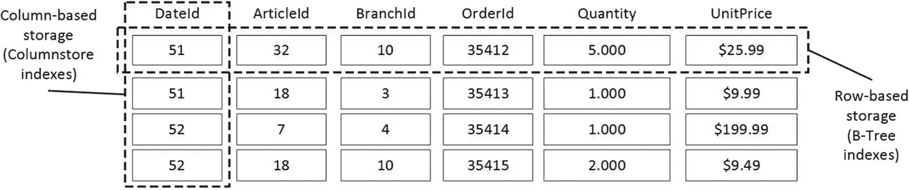

图 14-1：基于行和基于列的存储

列存储索引中的数据使用算法进行了高度压缩，即使与`页`压缩相比，也能显著节省空间。此外，SQL Server 可以跳过查询未请求的列，并且不会将这些列的数据加载到内存中，从而显著减少查询的 I/O 占用空间。

此外，列存储索引的新数据存储格式允许 SQL Server 实现新的`批处理`执行模型。在此模型中，SQL Server 按行组或`批`处理数据，而不是一次处理一行。批处理的大小会调整以适应 CPU 缓存，这减少了 CPU 需要从内存或其他组件请求`外部`数据的次数。所有这些增强功能显著降低了数据仓库查询的 CPU 负载和执行时间。

列存储索引是 SQL Server 中一个相对较新的功能，并且发展迅速。SQL Server 2012 的初始实现仅支持只读的`非聚集列存储索引`，这些索引以基于列的存储格式存储表中数据的副本。这些索引实际上使表变为只读，导入数据的唯一方式是通过`分区切换`。我们将不讨论这些索引；从锁定角度来看，它们的行为很简单。

从 SQL Server 2014 开始，您可以创建具有聚集列存储索引的表，并将整个表存储在基于列的存储格式中。这些索引是可更新的；但是，您不能在这些表上定义任何非聚集索引。

此限制已在 SQL Server 2016 中解除，您可以在表上为索引利用不同的存储技术。您可以通过在具有聚集列存储索引的表上创建非聚集 B-Tree 索引来支持混合工作负载，或者，您也可以在 B-Tree 表上创建可更新的非聚集列存储索引。值得注意的是，您可以在内存优化表中创建列存储索引，从而提升内存 OLTP 中运营分析查询的性能。


## 列存储索引内部结构概述

在基于列的存储中，每个数据列都单独存储在一组称为 `行组` 的结构中。每个 `行组` 存储最多约一百万行——准确地说，是 `2²⁰=1,048,576` 行——的数据。SQL Server 在创建索引时会尽量填满行组，仅最后一个行组可能部分填充。例如，如果一个表有五百万行，SQL Server 将创建四个各包含 1,048,576 行的行组，以及一个包含 805,696 行的行组。

在实践中，当多个线程使用并行执行计划创建列存储索引时，可能会出现多个部分填充的行组。每个线程处理自己的数据子集，从而创建独立的行组。此外，对于分区表，每个表分区都将拥有自己的一组行组。

行组构建完成后，SQL Server 会对每个行组中的列数据进行编码和压缩。如果有助于实现更好的压缩率，行组内的行可以被重新排列。

行组内的列数据称为一个 `段`。当需要访问列存储数据时，SQL Server 会将整个段加载到内存中。SQL Server 还会保留有关段中数据的元数据信息——例如，段中存储的最小值和最大值——并可以跳过不包含所需数据的段。

属于同一数据行的行通过段内的 `偏移量` 来识别。例如，表中的第一行由第一个分区上第一个行组中所有段的第一个值组成。第二行由同一行组中所有段的第二个值组成，依此类推。`分区 _id`、`行组 _id` 和 `偏移量` 的组合唯一标识一行，在列存储索引中称为 `行 ID`。

列存储索引中的数据经过高度压缩，相比页面压缩可显著节省空间。基于列的存储提供的压缩率通常比基于行的数据高出 10 倍以上。此外，SQL Server 2014 引入了另一种称为 `归档压缩` 的压缩选项，可进一步减少存储空间。它使用 Xpress 8 压缩库，这是微软对 LZ77 算法的内部实现。此压缩直接作用于行组数据，无需了解底层的 SQL Server 数据结构。

可更新的列存储索引有两个额外的元素来支持数据修改。第一个是 `删除位图`，它存储从表中删除的行的 `行 ID`。第二个结构是 `增量存储`，它存储新插入的行。在基于磁盘的列存储索引中，增量存储和删除位图都作为常规的堆表实现。

#### 注意

在内存优化表上定义的列存储索引的内部结构在概念上是相同的；但是，增量存储和删除位图的实现方式不同。此类索引支持内存中 OLTP 多版本并发控制，并且不会在内存优化表中引入任何锁。您可以在书 `《SQL Server 内存中 OLTP 高级编程》` 中阅读有关它们的更多信息；我们本书中不重点讨论它们。

图 14-2 说明了一个包含两个分区的表中可更新列存储索引的结构。每个分区可以有一个删除位图和多个增量存储。这种结构使每个分区自包含且独立于其他分区，从而允许您对定义了列存储索引的表执行分区切换。

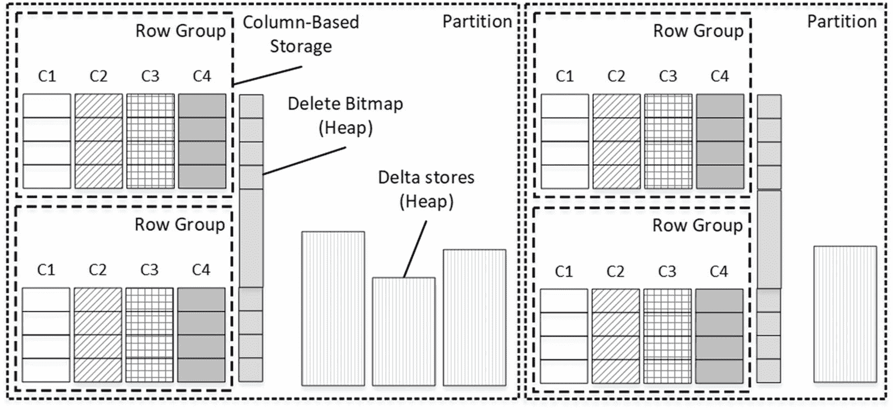
图 14-2
可更新列存储索引结构

值得注意的是，删除位图和增量存储是 `按需` 创建的。例如，除非行组中的某些行被删除，否则不会创建删除位图。

每次删除存储在压缩行组（而非增量存储）中的行时，SQL Server 都会将有关该已删除行的信息添加到删除位图中。原始行不会发生任何变化，它仍然存储在行组中。但是，SQL Server 在查询执行期间会检查删除位图，将已删除的行排除在处理过程之外。

如前所述，当您向列存储索引插入数据时，数据会进入增量存储，这是一个堆表。更新存储在行组中的行也不会更改行数据。此类更新会触发一行的删除，实际上就是向删除位图中插入一条记录，将旧版本标记为 `已删除`，然后将行的新版本插入增量存储。但是，对增量存储中行的任何数据修改都是通过原地更新和删除其中的实际行来完成的，就像在常规堆表中一样。

每个增量存储可以处于 `打开` 或 `关闭` 状态。打开的增量存储接受新行，并允许对数据进行修改和删除。当增量存储达到 1,048,576 行（即行组可存储的最大行数）时，SQL Server 会将其关闭。另一个称为 `元组移动器` 的 SQL Server 进程每五分钟运行一次，将关闭的增量存储转换为以列基存储格式存储数据的行组。

大量的增量存储和删除位图都可能影响查询性能。SQL Server 必须访问删除位图以检查压缩行是否已被删除，并且在查询执行期间会从增量存储中读取行。如果 ETL 流程导致产生大量的增量存储和删除位图，请考虑在受影响的分区上重建索引。

#### 提示

您可以使用 `sys.column_store_row_groups` 视图检查行组和增量存储的状态。处于 `OPEN` 或 `CLOSED` 状态的行对应于增量存储。处于 `COMPRESSED` 状态的行对应于以列基存储格式存储数据的行组。最后，`deleted_rows` 列提供了有关存储在删除位图中的已删除行的统计信息。


## 列存储索引中的锁定行为

存储空间的节省以及聚集列存储索引的可更新特性，使其在 OLTP 环境中作为大型事务表的替代品颇具吸引力。然而，它们的锁定行为与 B-Tree 索引截然不同，在并发事务数量庞大的环境中可能无法良好扩展。

让我们看几个例子。第一步，如清单 14-1 所示，我们将创建一个带有聚集列存储索引的表，并向其中插入约四百万行数据。创建列存储索引后，我们将尝试向该表插入另一行，随后回滚事务。这将在索引中创建一个空的增量存储。最后，我们将使用 `sys.column_store_row_groups` 视图分析行组的状态。

```sql
create table dbo.Test
(
ID int not null,
Col int not null
);
;with N1(C) as (select 0 union all select 0) -- 2 rows
,N2(C) as (select 0 from N1 as T1 cross join N1 as T2) -- 4 rows
,N3(C) as (select 0 from N2 as T1 cross join N2 as T2) -- 16 rows
,N4(C) as (select 0 from N3 as T1 cross join N3 as T2) -- 256 rows
,N5(C) as (select 0 from N4 as T1 cross join N4 as T2 ) -- 65,536 rows
,N6(C) AS (select 0 from N5 as T1 cross join N3 as T2 cross join N2 as T3)
-- 4,194,304 rows
,IDs(ID) as (select row_number() over (order by (select null)) from N6)
insert into dbo.Test(ID, Col)
select ID, ID from IDs;
create clustered columnstore index CCI_Test
on dbo.Test
with (maxdop = 1);
begin tran
insert into dbo.Test(ID, Col) values(-1,-1);
rollback
go
select *
from sys.column_store_row_groups
where object_id = object_id(N'dbo.Test');
```
清单 14-1
创建测试表

图 14-3 展示了该视图的输出结果。四个处于 `COMPRESSED` 状态的行组以基于列的格式存储数据。一个 `row_group_id = 4`、处于 `OPEN` 状态的空行组位于增量存储中。

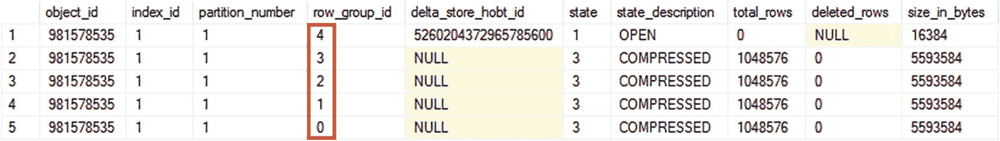
图 14-3
表创建后的行组

现在，让我们运行一些测试并分析索引的锁定行为。

### 向聚集列存储索引插入数据

列存储索引支持两种数据加载类型。第一种也是最高效的方法，需要您利用 `BULK INSERT` API 来大批量加载数据。在此模式下，SQL Server 为每个批处理创建一个新的行组，并实时将数据压缩为基于列的格式。由于每个批处理都成为一个单独的行组，因此多个插入操作不会相互阻塞，并且可以并行运行。

触发此行为所需的最小批处理大小约为 102,000 行；但是，如果您使用与最大行组大小（即 1,048,576 行）匹配的批处理，将会获得最佳效果。

对于较小的批处理和单行插入，SQL Server 使用 `trickle inserts`，将数据放入增量存储。每个表分区将有单独的增量存储，在某些情况下，您可能每个分区有多个打开的增量存储。当增量存储达到 1,048,576 行或您运行索引重新生成操作时，SQL Server 会关闭该增量存储并将其数据压缩为基于列的格式。

让我们向表中插入一行，然后分析在此过程中获取了哪些锁。代码如清单 14-2 所示。

```sql
begin tran
insert into dbo.Test(ID, Col)
values(-1,-1);
select
resource_type, resource_description
,request_mode, request_status
,resource_associated_entity_id
from sys.dm_tran_locks
where
request_session_id = @@SPID;
rollback
```
清单 14-2
向表中插入数据

如图 14-4 所示，其锁定行为类似于堆表中的锁定。SQL Server 对新插入的行获取了排他 (`X`) 锁，同时对页和 HOBT（分配单元）获取了意向排他 (`IX`) 锁。它还对行组获取了意向排他 (`IX`) 锁，这在概念上类似于表上的对象级锁。

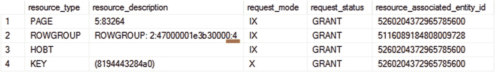
图 14-4
INSERT 操作获取的锁

正如您所猜测的，这种行为表明您可以按照与处理堆表类似的方式扩展插入工作负载。多个会话可以并行插入数据而不会相互阻塞。


## 从列存储索引中更新和删除数据

当你在表中更新或删除数据时，情况就变了。不幸的是，这类工作负载不像插入操作那样具有良好的扩展性。

让我们使用清单 14-3 中的代码来更新表中的一行。你可能还记得，当一行存储在增量存储区中时，该操作是*原地*进行的。而更新一个已被压缩的行，则会导致两个操作：通过将`row-id`插入删除位图来将行标记为*已删除*，并将行的新版本插入增量存储区。

```sql
begin tran
update dbo.Test
set Col += 1
where ID=1;
select
resource_type, resource_description
,request_mode, request_status
,resource_associated_entity_id
from sys.dm_tran_locks
where
request_session_id = @@SPID
rollback
-- 清单 14-3
-- 在表中更新数据
```

图 14-5 显示了操作完成后持有的锁。你可以看到在增量存储区和删除位图对象（两者都是堆表）上获取了排他（X）和意向排他（IX）锁。然而，行组和增量存储区的 HOBT（堆或 B 树）受到更新意向排他（UIX）锁的保护，而不是意向排他（IX）锁。

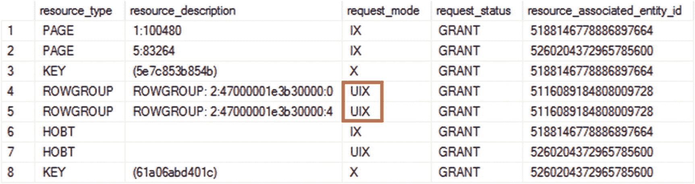

图 14-5: UPDATE 操作获取的锁

如果你从表中删除一个压缩行，也会出现相同的模式。清单 14-4 显示了执行该操作的代码。

```sql
begin tran
delete from dbo.Test where ID=1;
select
resource_type, resource_description
,request_mode, request_status
,resource_associated_entity_id
from sys.dm_tran_locks
where
request_session_id = @@SPID
rollback
-- 清单 14-4
-- 从表中删除数据
```

图 14-6 显示了`DELETE`语句之后持有的锁。此操作不会触及增量存储区，只影响删除位图。尽管如此，我们从中删除行的行组上仍然有一个更新意向排他（UIX）锁。

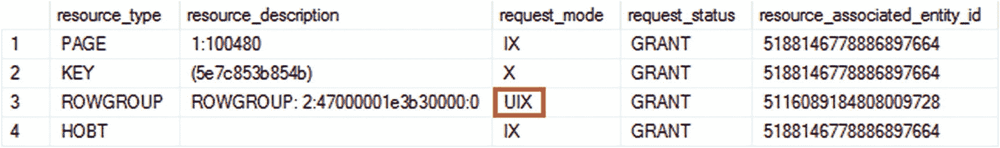

图 14-6: DELETE 操作获取的锁

SQL Server 使用更新意向排他（UIX）锁的原因很简单。列存储索引中的数据是未排序的，SQL Server 必须在查询执行期间扫描它。分区和段消除可能使 SQL Server 跳过某些行组；然而，当扫描一个行组时，SQL Server 会对其获取一个更新意向排他（UIX）锁并运行更新扫描，从那里读取所有行。

图 14-7 通过显示清单 14-3 中`UPDATE`语句的执行计划证明了这一点。你可以在那里看到*列存储索引扫描*操作符。

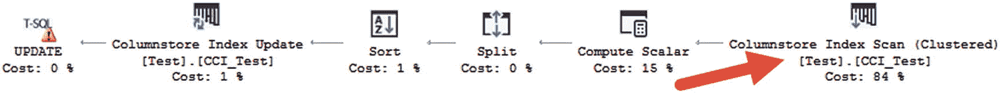

图 14-7: UPDATE 语句的执行计划

不幸的是，更新意向排他（UIX）锁彼此不兼容。此外，它们会一直持有到事务结束。这意味着并发的更新和删除工作负载可能会引入大量阻塞，并且在 OLTP 系统中扩展性不佳。

SQL Server 2016 及更高版本允许你在聚集列存储索引表上创建非聚集 B 树索引。这些索引可以通过使用*非聚集索引查找*和*键查找*操作来消除对列式数据的更新扫描。

#### 注意

在聚集列存储索引和 B 树索引上的键查找操作在概念上是相似的。SQL Server 根据`row-id`中的`partition_id`、`row_group_id`和`offset`在聚集列存储索引中定位一行。

让我们使用`CREATE NONCLUSTERED INDEX Idx_Test_ID ON dbo.Test(ID)`语句创建索引，并再次运行清单 14-3 中的代码。图 14-8 展示了带有*非聚集索引查找*和*键查找*操作的`UPDATE`语句的执行计划。

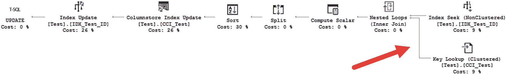

图 14-8: 带有非聚集索引的 UPDATE 语句的执行计划

图 14-9 显示了此`UPDATE`语句之后持有的锁。如你所见，SQL Server 没有在行组上获取更新意向排他（UIX）锁，而是使用了意向排他（IX）锁。这种锁类型与其他会话的意向锁是兼容的。

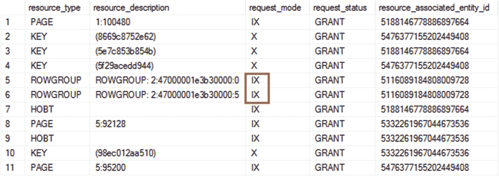

图 14-9: 带有非聚集索引的 UPDATE 语句持有的锁

即使你可以*在技术上*通过非聚集 B 树索引来扩展更新和删除工作负载，这种方法也是危险的。是否使用非聚集索引将取决于索引的选择性和查询。如果 SQL Server 预计需要大量的`键查找`，它可能会决定扫描列存储索引，这将导致系统中的阻塞。

## 非聚集列存储索引

SQL Server 2016 及更高版本允许你在 B 树表上创建非聚集列存储索引。这些索引以列式格式持久化数据的副本，从而有助于优化 OLTP 系统中的运营分析和报告工作负载。与 SQL Server 2012 的实现不同，这些索引是可更新的，并且不会使表变为只读。

清单 14-5 显示了删除`dbo.Test`表上的聚集列存储索引，然后创建聚集 B 树索引和非聚集列存储索引的代码。和之前一样，我们运行一条`INSERT`语句并回滚事务，以在索引中创建一个空的增量存储区。

```sql
drop index IDX_Test_ID on dbo.Test;
drop index CCI_Test on dbo.Test;
create unique clustered index CI_Test_ID
on dbo.Test(ID);
create nonclustered columnstore index NCCI_Test
on dbo.Test(ID,Col)
with (maxdop=1);
begin tran
insert into dbo.Test(ID, Col) values(-1,-1);
rollback
-- 清单 14-5
-- 在表上创建非聚集列存储索引
```

图 14-10 显示了`NCCI_TestData`索引的`sys.column_store_row_groups`视图的输出。表中的数据保持不变，索引由四个压缩行组和一个空的增量存储区组成。

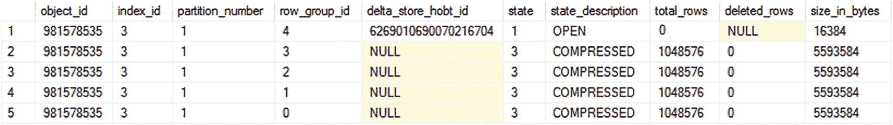

图 14-10: 非聚集列存储索引中的行组

图 14-11 显示了使用`UPDATE`语句再次运行清单 14-3 中的代码时持有的锁。SQL Server 通过另一个称为*删除缓冲区*的内部结构跟踪非聚集列存储索引中的行位置，该结构映射聚集索引键和列存储`row-id`的值。这使得 SQL Server 能够避免对列式存储进行更新扫描，并使用意向排他（IX）锁而不是更新意向排他（UIX）锁。

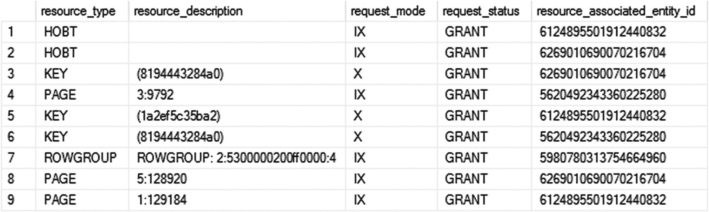

图 14-11: UPDATE 语句后持有的锁

非聚集列存储索引专为在 OLTP 工作负载中工作而设计，它们能够良好扩展，而不会给系统带来额外的并发问题。


### 元组移动器与 `ALTER INDEX REORGANIZE` 的锁定行为

最后，我们来看一下**元组移动器**进程和 `ALTER INDEX REORGANIZE` 操作的锁定行为。两者都将关闭的增量存储区压缩到压缩行组中，本质上做的是相同的事情；但是，它们的实现方式略有不同。元组移动器是一个在后台运行的单线程进程，以节省系统资源。而索引重组则使用多线程并行运行。

在压缩过程中，SQL Server 会对增量存储区获取并保持一个共享 (`S`) 锁。这些锁既不会阻止你从表中选择数据，也不会阻塞插入操作。新数据将被插入到其他打开的增量存储区中；但是，在整个操作期间，对被锁定的增量存储区的删除和数据修改操作将被阻塞。

图 14-12 展示了在执行 `ALTER INDEX REORGANIZE` 命令期间，在增量存储区上捕获的 `lock_acquired` 和 `lock_released` 扩展事件。你可以看到在此操作期间获取的共享 (`S`) 锁。

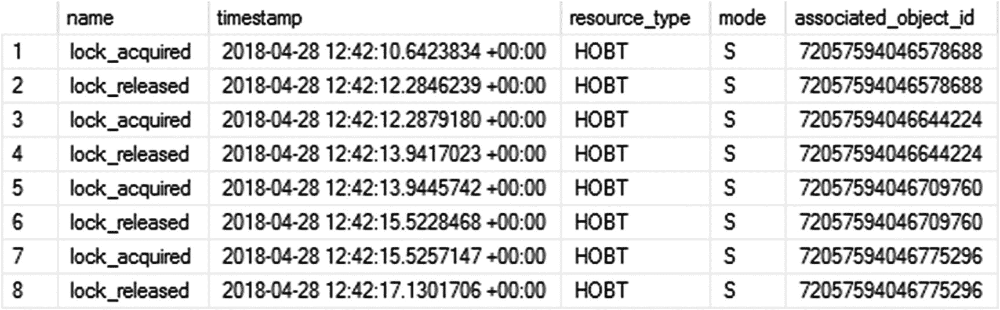

图 14-12
ALTER INDEX REORGANIZE 命令期间的锁定

`associated_object_id` 列表示增量存储区的 `hobt_id`，我们可以通过分析 `sys.column_store_row_groups` 视图来确认。图 14-13 显示了 `ALTER INDEX REORGANIZE` 完成后行组的状态。处于 `TOMBSTONE` 状态的行组表示刚刚被压缩并等待释放的增量存储区。正如你所见，这些文件组的 `delta_store_hobt_id` 值与获取了共享 (`S`) 锁的资源相匹配。

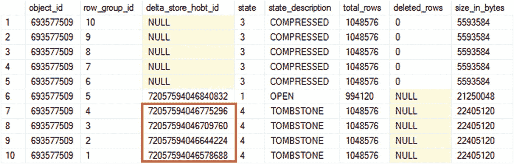

图 14-13
ALTER INDEX REORGANIZE 命令后的行组

正如你可能猜到的，这种行为在 OLTP 系统中面对更新和删除工作负载时，扩展性并不好。

## 总结

虽然在 OLTP 环境中使用**聚集列存储索引**来存储数据很有吸引力，但这很少是最佳选择。这些索引中的可更新性设计是为了简化 ETL 过程并执行不频繁的数据修改。虽然聚集列存储索引可能处理仅追加的工作负载，但在具有大量并发事务修改表中数据的通用 OLTP 工作负载中，它们的扩展性并不好。

你仍然可以从 OLTP 系统中的聚集列存储索引中受益。许多系统需要长时间保留数据，随着数据变得陈旧，其数据和工作负载的易变性也会发生变化。你可以将数据分区到多个表中，将列存储索引、B-树索引、内存中 OLTP 表与分区视图结合起来。这将使你能够充分发挥每种技术的优势，从而提高系统性能并减少数据库中的数据大小。

#### 注意

我在我的《`Pro SQL Server Internals`》一书中详细讨论了这种架构，包括表之间数据移动的方法。

## 小结

列存储索引以基于列而非基于行的格式存储数据。这种方法可以显著提高系统中数据仓库、操作型分析和报表工作负载的性能。

列存储索引中的数据被高度压缩。与 B-树表相比，聚集列存储索引可以显著减少存储空间。然而，从锁定的角度来看，在多个并发会话并行修改数据的 OLTP 工作负载下，它们的扩展性并不好。你不应在这样的环境中将它们用作 OLTP 表的替代品。

最后，再次感谢你阅读本书！为你写作是我的荣幸！

## 索引

### A

`ABORT_AFTER_WAIT`（低优先级锁选项）
ACID
分配映射
分配映射扫描，14
分配单元
`ALTER DATABASE SET ALLOW_SNAPSHOT_ISOLATION` 语句
`ALTER DATABASE SET READ_COMMITTED_SNAPSHOT` 语句
`ALTER INDEX REBUILD` 语句
`ALTER INDEX REORGANIZE` 语句（在列存储索引中）
`ALTER TABLE REBUILD` 语句
`ALTER TABLE SET LOCK_ESCALATION` 语句
AlwaysOn 可用性组
应用程序锁
归档压缩（在列存储索引中）
异步提交（在 AlwaysOn 可用性组中）
原子性，事务属性
自动提交的事务

### B

批处理模式执行
`BEGIN TRAN` 语句
`BeginTs` 时间戳
被阻塞进程报告
`blocked_process_report` 扩展事件，*参见* 扩展事件
被阻塞进程阈值配置选项
阻塞
阻塞链
阻塞监控框架
B-树，*参见* B-树索引
B-树索引
哈希索引中的 `bucket_count`

### C

目录视图，*参见* 数据管理与目录视图
聚集列存储索引
聚集索引
基于列的存储
列存储索引
提交依赖
`COMMIT` 语句
复合索引
复合索引，*参见* 复合索引
一致性模型，27
一致性，事务属性
转换锁
`CONVERT_IMPLICIT` 运算符
并行度的成本阈值配置设置
覆盖索引
临界区
交叉容器事务（在内存中 OLTP 中）
`CXPACKET` 等待类型，*参见* 等待类型

### D

数据一致性现象
数据管理与目录视图
`sys.column_store_row_groups` 视图
`sys.databases` 目录视图
`sys.dm_db_file_space_usage` 视图
`sys.dm_db_index_operational_stats` 函数
`sys.dm_db_index_physical_stats` 函数
`sys.dm_db_index_usage_stats` 视图
`sys.dm_exec_buffer` 函数
`sys.dm_exec_connections` 视图
`sys.dm_exec_procedure_stats` 视图
`sys.dm_exec_query_plan` 函数
`sys.dm_exec_query_plan_text` 函数
`sys.dm_exec_query_stats` 视图
`sys.dm_exec_sessions` 视图
`sys.dm_exec_session_wait_stats` 视图
`sys.dm_exec_sql_text` 函数
`sys.dm_io_virtual_file_stats` 函数
`sys.dm_os_exec_requests` 视图
`sys.dm_os_waiting_tasks` 视图
`sys.dm_os_wait_tasks` 视图
`sys.dm_tran_locks` 视图
`sys.dm_tran_version_store_space_usage` 视图
`sys.dm_tran_version_store` 视图
`sys.tables` 目录视图
数据仓库
`DBMIRROR_SEND` 等待类型，*参见* 等待类型
`DBCC SQLPERF`
死锁
`IGNORE_DUP_KEY` 死锁
键查找死锁
多个更新死锁
非优化查询死锁
死锁图
死锁监视器任务
专用管理员连接
延迟持久性
删除位图
删除缓冲区
增量存储区
`dependency_acquiredtx_event` 扩展事件，*参见* 扩展事件
脏读
基于磁盘的表
已完成任务状态，*参见* 任务状态
重复读现象
持久性，事务属性

### E

`EndTs` 时间戳
`@@ERROR`
错误 1204
1205，110，135
3960
错误处理
`ERROR_LINE()` 函数
`ERROR_MESSAGE()` 函数
`ERROR_NUMBER()` 函数
`ERROR_PROCEDURE()` 函数
`ERROR_SEVERITY()` 函数
`ERROR_STATE()` 函数
事件通知
排他 (`X`) 锁，*参见* 锁类型
SQL Server 中的执行模型
显式事务
扩展事件
`blocked_process_report`
`dependency_acquiredtx_event`
`wait_info`
`wait_info_external`
`waiting_for_dependency_acquiredtx_event`
`xml:deadlock_report`
区

### F

`FILLFACTOR` 索引属性
`forwarded_record_count`
转发行
转发指针

### G

全局事务时间戳

### H

`HADR_SYNC_COMMIT` 等待类型，*参见* 等待类型
哈希索引
堆表
高可用性
`HOLDLOCK` 锁定提示，*参见* 锁定提示

### I, J

IAM 页
`IGNORE_DUP_KEY` 索引选项
隐式事务
包含列，*参见* 带包含列的索引
索引分配映射
带包含列的索引
索引碎片
索引扫描
索引查找
内存中 OLTP
`IN_ROW_DATA` 分配单元
意向 (`I*`) 锁，*参见* 锁类型
B-树中的中间级别
隔离级别，*参见* 事务隔离级别
隔离，事务属性

### K

键查找操作


### L

锁存器 `LCK_M_*` 等待类型，`参见` 等待类型 B 树中的叶级 大型对象 (LOB) 列 `LOB_DATA` 分配单元 锁兼容性 锁升级 锁定提示 `HOLDLOCK` `NOLOCK` `NOWAIT` `PAGLOCK` `READCOMMITTED` `READPAST` `READUNCOMMITTED` `REPEATABLEREAD` `ROWLOCK` `SERIALIZABLE` `TABLOCK` `TABLOCKX` `UPDLOCK` `XLOCK` 锁管理器 锁存器 内存 (KB) 性能计数器，`参见` 性能计数器 锁分区 锁队列 锁 锁类型 排他 (X) 锁 意向 (I*) 锁 范围 (Range*) 锁 架构修改 (Sch-M) 锁 架构稳定性 (Sch-S) 锁 共享意向排他 (SIX) 锁 共享意向更新 (SIU) 锁 共享 (S) 锁 更新意向排他 (UIX) 锁 更新 (U) 锁 日志缓冲区 内存中 OLTP 事务的逻辑结束时间，内存中 OLTP 事务的逻辑开始时间 最长事务运行时间 性能计数器，`参见` 性能计数器 低优先级锁

### M

低优先级锁的 `MAX_DURATION` 选项 最大工作线程配置选项 `MEMORY_OPTIMIZED_ELEVATE_TO_SNAPSHOT` 数据库选项 内存优化表 Microsoft Azure SQL 数据库 混合区 多版本并发控制 (MVCC) 互斥体 互斥

### N

嵌套事务 `NOLOCK` 锁定提示，`参见` 非聚集列存储索引 非聚集索引 不可重复读 非统一内存访问 (NUMA) `NOWAIT` 锁定提示，`参见`

### O

最老的活动事务 在线索引重建 业务分析 乐观并发 乐观隔离级别 有序扫描

### P

`PAGEIOLATCH*` 等待类型，`参见` 等待类型 `PAGELATCH*` 等待类型，`参见` 等待类型 页拆分 `PAGLOCK` 锁定提示，`参见` 待处理任务状态，`参见` 任务状态 平台抽象层 (PAL) 分区 分区切换 页 页空闲空间 (PFS) 页 性能计数器 `Lock Memory (KB)` `longest transaction running time` `snapshot transactions` `update conflict ratio` `version cleanup rate (KB/s)` `version generation rate (KB/s)` `version store size (KB)` 悲观并发 PFS 页 幻读 点查找 `PREEMPTIVE*` 等待类型，`参见` 等待类型 协议层

### Q

查询处理器 查询存储

### R

范围 (Range*) 锁，`参见` 锁类型 范围扫描 `READ COMMITTED` 隔离级别，`参见` 事务隔离级别 `READCOMMITTED` 锁定提示，`参见` 锁定提示 `READ_COMMITTED_SNAPSHOT`，`参见` 事务隔离级别 `READPAST` 锁定提示，`参见` 锁定提示 读取集 `READ UNCOMMITTED` 隔离级别，`参见` 事务隔离级别 `READUNCOMMITTED` 锁定提示，`参见` 锁定提示 `READ UNCOMMITTED SNAPSHOT` 隔离级别，`参见` 事务隔离级别 引用完整性强制实施 `REPEATABLE READ` 隔离级别，`参见` 事务隔离级别 `REPEATABLEREAD` 锁定提示，`参见` 锁定提示 不可重复读违反错误 RID 查找 `ROLLBACK` 语句 B 树中的根级 基于行的存储 行链 row-id 列存储索引中的行组 `ROWLOCK` 锁定提示，`参见` 锁定提示 `ROW_OVERFLOW_DATA` 分配单元 行版本控制 可运行任务状态，`参见` 任务状态 正在运行的任务状态，`参见` 任务状态

### S

SARGable 谓词 保存点 `SAVE TRANSACTION` 语句 扫描集 调度器 架构修改 (Sch-M) 锁，`参见` 锁类型 架构稳定性 (Sch-S) 锁，`参见` 锁类型 列存储索引中的段 `SERIALIZABLE` 隔离级别，`参见` 事务隔离级别 `SERIALIZABLE` 锁定提示，`参见` 锁定提示 可序列化违反错误 `SET ANSI_DEFAULT` 选项 `SET DEADLOCK_PRIORITY` 选项 `SET IMPLICIT_TRANSACTION` 选项 `SET LOCK_TIMEOUT` 选项 `SET TRANSACTION ISOLATION LEVEL` 选项 `SET XACT_ABORT` 选项 共享意向排他 (SIX) 锁，`参见` 锁类型 共享意向更新 (SIU) 锁，`参见` 锁类型 共享内存协议 共享 (S) 锁，`参见` 锁类型 单例查找，`参见` 点查找 跳过的行 `SNAPSHOT` 隔离级别，`参见` 事务隔离级别 快照事务 性能计数器，`参见` 性能计数器 快照违反错误 `sp_getapplock` 存储过程 自旋锁 自旋循环任务状态，`参见` 任务状态 `sp_releaseapplock` 存储过程 SQLOS 语句级一致性 存储引擎 已挂起的任务状态，`参见` 任务状态 AlwaysOn 可用性组中的同步提交 `sys.column_store_row_groups` 视图，`参见` 数据管理和目录视图 `sys.databases` 目录视图，`参见` 数据管理和目录视图 `sys.dm_db_file_space_usage` 视图，`参见` 数据管理和目录视图 `sys.dm_db_index_operational_stats` 函数，`参见` 数据管理和目录视图 `sys.dm_db_index_physical_stats` 函数，`参见` 数据管理和目录视图 `sys.dm_db_index_usage_stats` 视图，`参见` 数据管理和目录视图 `sys.dm_exec_buffer` 函数，`参见` 数据管理和目录视图 `sys.dm_exec_connections` 视图，`参见` 数据管理和目录视图 `sys.dm_exec_procedure_stats` 视图，`参见` 数据管理和目录视图 `sys.dm_exec_query_plan` 函数，`参见` 数据管理和目录视图 `sys.dm_exec_query_plan_text` 函数，`参见` 数据管理和目录视图 `sys.dm_exec_query_stats` 视图，`参见` 数据管理和目录视图 `sys.dm_exec_sessions` 视图，`参见` 数据管理和目录视图 `sys.dm_exec_session_wait_stats` 视图，`参见` 数据管理和目录视图 `sys.dm_exec_sql_text` 函数，`参见` 数据管理和目录视图 `sys.dm_io_virtual_file_stats` 函数，`参见` 数据管理和目录视图 `sys.dm_os_exec_requests` 视图，`参见` 数据管理和目录视图 `sys.dm_os_waiting_tasks` 视图，`参见` 数据管理和目录视图 `sys.dm_os_wait_tasks` 视图，`参见` 数据管理和目录视图 `sys.dm_tran_locks` 视图，`参见` 数据管理和目录视图 `sys.dm_tran_version_store_space_usage` 视图，`参见` 数据管理和目录视图 `sys.dm_tran_version_store` 视图，`参见` 数据管理和目录视图 `sys.tables` 目录视图，`参见` 数据管理和目录视图 `system_health` 扩展事件会话

### T

表扫描 `TABLOCK` 锁定提示，`参见` 锁定提示 `TABLOCKX` 锁定提示，`参见` 锁定提示 表格数据流 (TDS) 任务状态 tempdb `THROW` 运算符 跟踪标志 `T1118` `T1211` `T1222` `T1223`, 170 `T1229` `@@TRANCOUNT` 事务 事务隔离级别 `READ COMMITTED` `READ COMMITTED SNAPSHOT` `READ UNCOMMITTED` `REPEATABLE READ` `SERIALIZABLE` `SNAPSHOT` 事务级一致性 内存中 OLTP 中的事务生存期 事务日志记录 内存中 OLTP 中的 `TransactionId` `TRY..CATCH` 块 元组移动器

### U

不可提交的事务 统一区 更新冲突比率 性能计数器，`参见` 性能计数器 更新意向排他 (UIX) 锁，`参见` 锁类型 更新 (U) 锁，`参见` 锁类型 `UPDLOCK` 锁定提示，`参见` 锁定提示

### V

内存中 OLTP 事务的验证阶段 版本清理速率 (KB/s) 性能计数器，`参见` 性能计数器 版本生成速率 (KB/s) 性能计数器，`参见` 性能计数器 版本指针 版本存储区 版本存储区清理任务 版本存储区大小 (KB) 性能计数器，`参见` 性能计数器

### W

`WAIT_AT_LOW_PRIORITY` 选项 `wait_info` 扩展事件，`参见` 扩展事件 `wait_info_external` 扩展事件，`参见` 扩展事件 `waiting_for_dependency_acquiredtx_event` 扩展事件，`参见` 扩展事件 等待统计信息分析 等待类型 `CXPACKET` `DBMIRROR_SEND` `HADR_SYNC_COMMIT` `LCK_M_I*` `LCK_M_S` `LCK_M_SCH*`, 240–241 `LCK_M_U` `LCK_M_X` `PAGEIOLATCH*` `PAGELATCH*` `PREEMPTIVE*` 工作线程，`参见` 工作线程 工作线程 预写日志记录 写-写冲突 写入集

### X, Y, Z

`XACT_STATE()` 函数 `XLOCK` 锁定提示，`参见` 锁定提示 `xml:deadlock_report` 扩展事件，`参见` 扩展事件
