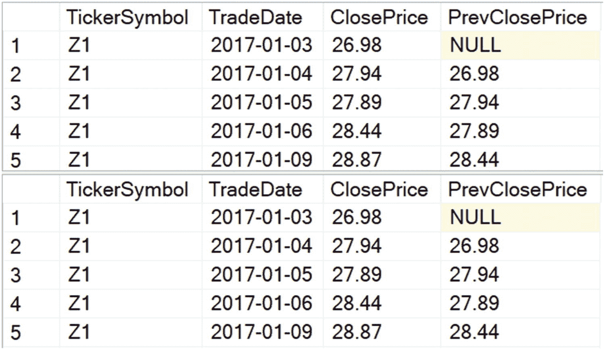
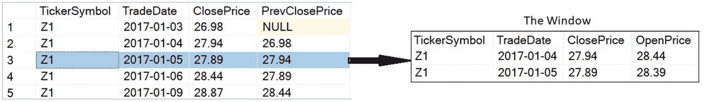
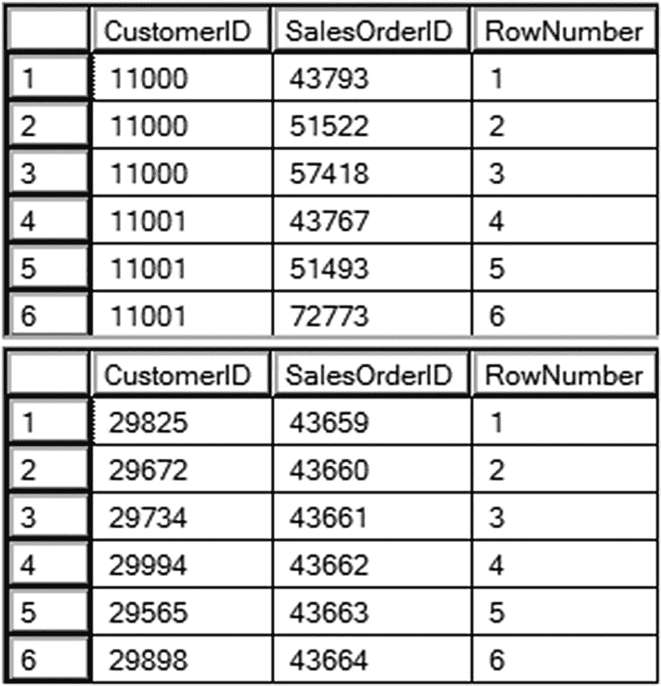
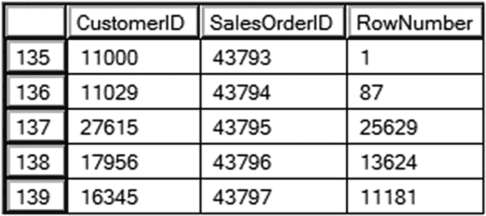
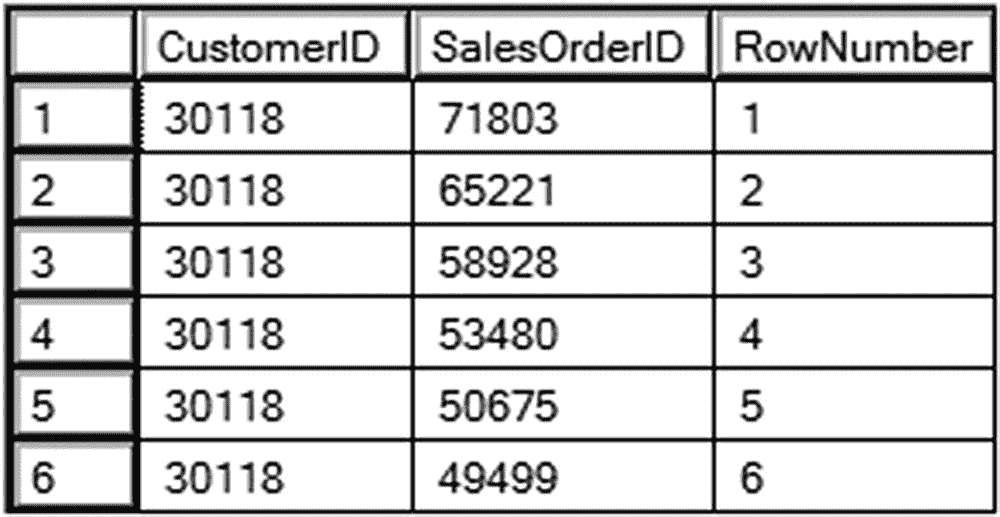

# 1. 初识窗口

SQL Server 是一个强大的数据库平台，拥有一个名为 T-SQL 的多功能查询语言。在我看来，多年来 T-SQL 最令人兴奋的增强就是**窗口函数**。窗口函数使您能够以新的、更简单的方式解决查询问题，并且在大多数情况下，其性能优于传统技术。它们是进行数据分析的绝佳工具。您可能还会听到它们被称为“windowing”或“windowed”函数。在讨论此功能时，这三个术语是同义词。

在 SQL Server 2000 发布之后，SQL Server 爱好者们苦苦等待了漫长的 5 年，才迎来下一个版本。微软带来了全新的产品——SQL Server 2005。此版本引入了 SQL Server Management Studio、SQL Server Integration Services、快照隔离和数据库镜像。微软还用许多强大的功能增强了 T-SQL，例如公用表表达式（CTEs）。而在 2005 版本中，所有 T-SQL 增强中最激动人心的，莫过于引入了窗口函数。

而这仅仅是个开始。窗口函数从 ANSI SQL2003 开始成为标准 ANSI SQL 规范的一部分。SQL Server 2012 版本根据标准发布了更多功能。2019 年，微软通过批处理模式处理（一种曾专属于列存储索引的功能）为部分窗口函数提供了性能提升。您将在第 8 章了解该性能特性的工作原理。即便如此，目前的功能仍未涵盖整个规范，因此未来还有更多值得期待的内容。

本章将初步介绍两个 T-SQL 窗口函数：`LAG` 和 `ROW_NUMBER`。您将了解什么是窗口，以及如何用 `OVER` 子句来定义它。您还将学习如何将窗口划分为更小的部分，称为分区。

## 探索窗口函数

窗口函数并没有让您能做以前无法完成的事情，它们也与 Microsoft Windows API 毫无关系。使用以前可用的方法，例如自联接、相关子查询和游标，只要您投入足够的时间和精力，几乎可以解决任何 T-SQL 问题。窗口函数的主要好处在于，您可以轻松地解决这些棘手的查询。大多数情况下，相较于旧方法，您还能获得巨大的性能提升。您通常可以使用窗口函数将涉及多条语句或子查询的解决方案，转变为更简单的单条语句。

我喜欢将窗口函数分为几类，这些分类与微软的定义并不完全一致：排名函数、窗口聚合函数、累积窗口聚合函数、偏移函数和统计函数。（微软将四种偏移函数和四种统计函数统称为“分析”函数。）您可以使用这些函数为每一行分配排名、在不分组的情况下计算汇总值、计算运行总计、在结果中包含来自不同行的列，以及计算组内百分比。随着您阅读本书，您将逐步了解这些函数。

我最喜欢的 T-SQL 函数恰好也是一个窗口函数，名为 `LAG`。它是偏移函数之一，您将在第 6 章学习到。`LAG` 允许您在结果中包含来自不同行的列。与实现相同功能的旧方法相比，使用 `LAG` 更简单，性能也更好。

在同一年内（仅相隔几个月），有两个人分别向我寻求帮助，解决的几乎是同一个问题：如何利用股市数据，将某只股票一天的收盘价与下一天进行比较？传统的解决方案需要将数据的每一行与前一行进行联接，以获取前一天的收盘价。而使用 `LAG` 函数，解决方案不仅编写起来更简单，而且性能也大大提升。


### 注意

如果您想跟随本示例操作，可以创建 `StockAnalysisDemo` 数据库并生成股票市场数据的示例脚本，该脚本与本章代码一同可在 Apress 网站上找到。

若想快速了解如何先使用一种传统方法，再使用 `LAG` 函数来解决此问题，请审阅并运行代码清单 1-1。

```sql
USE StockAnalysisDemo;
GO
--1-1.1 使用子查询
SELECT TickerSymbol, TradeDate, ClosePrice,
(SELECT TOP(1) ClosePrice
FROM StockHistory AS SQ
WHERE SQ.TickerSymbol  = OQ.TickerSymbol
AND SQ.TradeDate < OQ.TradeDate
ORDER BY TradeDate DESC) AS PrevClosePrice
FROM StockHistory AS OQ
ORDER BY TickerSymbol, TradeDate;
--1-1.2 使用 LAG
SELECT TickerSymbol, TradeDate, ClosePrice,
LAG(ClosePrice) OVER(PARTITION BY TickerSymbol
ORDER BY TradeDate) AS PrevClosePrice
FROM StockHistory
ORDER BY TickerSymbol, TradeDate;
```
**代码清单 1-1**
两种解决股票市场问题的方法

部分结果显示在图 1-1 中。由于数据是随机生成的，图中的 `ClosePrice` 和 `PrevClosePrice` 值与您的值不会匹配。查询 1 使用关联子查询（旧方法）为每一外部行选择一个 `ClosePrice`。通过将内部查询的 `TickerSymbol` 与外部查询连接，您可以确保不会比较两只不同的股票。内部查询和外部查询也通过 `TradeDate` 进行连接，但内部查询的 `TradeDate` 必须小于外部查询的 `TradeDate`，以确保您获取的是前一天的数据。内部查询还必须排序，以获取日期小于当前日期但最新的数据行。在我的笔记本电脑（16GB RAM，使用 SSD 存储）上运行此查询耗时超过一分钟。返回了近 700,000 行数据。


**图 1-1**
股票市场问题的部分结果

查询 2 使用窗口函数 `LAG` 解决相同的问题，并产生相同的结果。暂时不必担心语法；读完本书时您将成为专家。在我的笔记本电脑上，使用 `LAG` 的查询仅用了 13 秒运行。

仅通过查看代码清单 1-1 中的代码，您就可以看到使用 `LAG` 的查询 2 编写起来要简单得多，即使您可能还不理解其语法。它的运行速度也快得多，因为它只读取表一次，而不像查询 1 那样每行读取一次。当您继续阅读本书并运行示例时，您将了解到像 `LAG` 这样的窗口函数如何让您的工作更轻松，让您的客户更满意！

## 理解窗口

窗口函数不同于常规函数，因为它们在一组行（也称为 *窗口*）上操作。这可能听起来类似于聚合函数的工作方式。聚合函数（例如 `SUM` 和 `AVG`）在行组上操作并提供汇总值。当您编写聚合查询时，除了 `GROUP BY` 子句中的列之外，您会丢失详细信息列。

当添加 `GROUP BY` 子句时，您将看到的不是返回所有行的摘要，而是每个 `GROUP BY` 列唯一集合的一行摘要行。例如，要使用聚合查询获取所有行的计数，您必须省略其他列。一旦将列添加到 `SELECT` 和 `GROUP BY` 中，您将获得每个唯一分组的计数，而不是整个结果集的计数。

带有窗口函数的查询与传统聚合查询大不相同。`SELECT` 列表中出现的列没有限制，也不需要 `GROUP BY` 子句。您还可以将窗口函数添加到聚合查询中，这将在第 3 章讨论。返回的不是摘要行，而是所有详细信息，并且包含窗口函数的表达式的结果仅作为另一列包含在内。实际上，通过使用窗口函数获取行的总计数，您仍然可以包含表中的所有列。

想象一下，在查询运行时，透过一扇窗户查看一组特定的行。您还有最后一次机会执行操作，例如从另一行中获取其中一个列。操作的结果将作为附加列添加。随着您阅读本书，您将了解窗口函数的实际工作原理，但“透过窗户查看”的概念帮助我理解并在许多 SQL Server 活动中向听众解释了窗口函数。图 1-2 说明了这一概念。


**图 1-2**
透过窗户对一组行执行操作

窗口并不局限于查询的 `SELECT` 列表中的列。例如，如果您查看 `StockHistory` 表，您会看到还有一个 `OpenPrice` 列。某一天的 `OpenPrice` 与前一天的 `ClosePrice` 是不同的。如果您愿意，您可以使用 `LAG` 将之前的 `OpenPrice` 包含在结果中，即使它最初不在 `SELECT` 列表中。

在使用 `LAG` 的股票历史示例中，每一行都有自己的窗口，在其中查找前一个收盘价。当对数据的第三行执行计算时，窗口由第二行和第三行组成。当对第四行执行计算时，窗口由第三行和第四行组成。

如果通过 `WHERE` 子句从查询中移除了 `2017-12-02` 的行，会发生什么？窗口是否包含被过滤掉的行？答案是“否”，这引出了使用窗口函数时需要理解的两个非常重要的概念：窗口函数可以在查询中使用的位置，以及操作的逻辑顺序。

窗口函数只能用于 `SELECT` 列表和 `ORDER BY` 子句中。您不能基于窗口函数进行筛选或分组。在必须基于窗口函数的结果进行筛选或分组的情况下，解决方案是分离逻辑。您可以使用临时表、派生表子查询或 CTE，然后在外部查询中进行筛选或分组。

窗口函数在 `FROM`、`WHERE`、`GROUP BY` 和 `HAVING` 子句之后操作。它们在计算 `TOP` 和 `DISTINCT` 子句之前操作。您将在本章后面的“揭开特殊情况窗口”一节中了解更多关于 `DISTINCT` 和 `TOP` 如何影响带有窗口函数的查询。

窗口由 `OVER` 子句定义。请注意，在代码清单 1-1 的查询 2 中，`LAG` 函数后跟一个 `OVER` 子句。每种类型的窗口函数对 `OVER` 子句都有特定的要求。`LAG` 函数必须有一个 `ORDER BY` 表达式，并且可以有一个 `PARTITION BY` 表达式。

## 理解 OVER 子句

窗口函数的一个独特之处是 `OVER` 子句，它定义了窗口或集合。除了我将在第 7 章解释的一个特例外，窗口函数都将有一个 `OVER` 子句，学习如何使用 `OVER` 子句是理解窗口函数的必要条件。在某些情况下，`OVER` 子句可能是空的。在第 3 章处理窗口聚合函数时，您将看到空的 `OVER` 子句。

### 注意

在一种情况下，你会看到查询中 `OVER` 关键字没有跟在窗口函数后面，那就是与序列对象一起使用。序列对象是 SQL Server 2008 引入的，它是一个包含递增数字的容器，通常用作标识列的替代方案。

对于查询 `SELECT` 列表中的任何类型的表达式，都会对结果集中的每一行执行一次计算。例如，如果你有一个包含表达式 `Col1 + Col2` 的查询，那么对于返回的每一行，这两个列都会被相加一次。对第 1 行、第 2 行、第 3 行等等都会执行计算。包含窗口函数的表达式也必须为每一行计算一次。然而，在这种情况下，表达式是在一组行上操作的，而这组行对于执行计算的每一行可能都是不同的。

`OVER` 子句决定了哪些行组成了窗口。`OVER` 子句有三个可能的组成部分：`PARTITION BY`、`ORDER BY` 和窗口框架。`PARTITION BY` 表达式用于划分行，根据你要完成的任务，它是可选的。`ORDER BY` 表达式对于某些类型的窗口函数是必需的。在使用时，它决定了窗口函数的执行顺序。最后，窗口框架用于某些特定类型的窗口函数，以提供更细的粒度。你将在第 5 章学习有关框架的内容。

许多 T-SQL 开发人员和数据库专业人士都使用过 `ROW_NUMBER` 函数。他们甚至可能没有意识到这是窗口函数之一。在许多情况下，为查询添加行号是解决复杂查询问题的一个步骤。

`ROW_NUMBER` 为每一行提供一个从 1 开始的递增数字。数字的分配顺序由 `ORDER BY` 表达式中指定的列决定，这独立于查询本身中的 `ORDER BY` 子句。运行清单 1-2 中的查询以了解其工作原理。

```
USE AdventureWorks;
GO
--1-2.1 按 CustomerID 分配行号
SELECT CustomerID, SalesOrderID,
ROW_NUMBER() OVER(ORDER BY CustomerID) AS RowNumber
FROM Sales.SalesOrderHeader;
--1-2.2 按 SalesOrderID 分配行号
SELECT CustomerID, SalesOrderID,
ROW_NUMBER() OVER(ORDER BY SalesOrderID) AS RowNumber
FROM Sales.SalesOrderHeader;
清单 1-2
将行号应用于不同列
```

### 注意

本书中的许多示例都使用了 `AdventureWorks` 和 `AdventureWorksDW` 数据库。你可以使用 2014 或更高版本的任何版本来跟随操作，本书撰写时最新的版本是 2017 版。只需确保在包含 `USE` 语句时，根据你的数据库版本进行调整。

`OVER` 子句跟在 `ROW_NUMBER` 函数后面。在 `OVER` 子句内部，你会看到 `ORDER BY` 后面跟着一个或多个列。查询 1 和 2 之间的区别仅在于 `OVER` 子句中的 `ORDER BY` 表达式。请注意图 1-3 所示的部分结果，行号最终按照 `OVER` 子句中 `ORDER BY` 表达式所指定列的顺序应用，这也是数据返回的顺序。由于必须对数据进行排序才能应用行号，因此数据很容易保持该顺序，但这并不能保证。真正保证结果顺序的唯一方法是在查询中添加一个 `ORDER BY`。



图 1-3

对不同的 `OVER` 子句使用 `ROW_NUMBER` 的部分结果

如果查询本身有一个 `ORDER BY` 子句，它可以与 `OVER` 中的 `ORDER BY` 不同。清单 1-3 演示了这一点。

```
--1-3.1 使用不同 ORDER BY 的行号
SELECT CustomerID, SalesOrderID,
ROW_NUMBER() OVER(ORDER BY CustomerID) AS RowNumber
FROM Sales.SalesOrderHeader
ORDER BY SalesOrderID;
清单 1-3
在 OVER 子句中使用与查询 ORDER BY 不同的 ROW_NUMBER
```

在这种情况下，行号是按 `CustomerID` 的顺序分配的，但结果是按 `SalesOrderID` 的顺序返回的。部分结果如图 1-4 所示。为了显示行号分配正确，图中显示了网格滚动到第一个客户 `CustomerID 11000` 的位置。



图 1-4

显示查询的 `ORDER BY` 与 `OVER` 子句不同的部分结果

就像查询的 `ORDER BY` 子句一样，你可以在 `OVER` 子句中使用 `DESCENDING` 或 `DESC` 关键字来指定降序，如清单 1-4 所示。

```
--1-4.1 使用降序 ORDER BY 的行号
SELECT CustomerID, SalesOrderID,
ROW_NUMBER() OVER(ORDER BY CustomerID DESC) AS RowNumber
FROM Sales.SalesOrderHeader;
清单 1-4
使用降序 ORDER BY 的 ROW_NUMBER
```

图 1-5 显示了部分结果。由于数据库引擎可以轻松地按 `CustomerID` 降序返回结果，你可以很容易地看到行号 1 被分配给了最大的 `CustomerID`。



图 1-5

使用降序 `ORDER BY` 的 `ROW_NUMBER` 的部分结果

在 `SalesOrderHeader` 表中，`CustomerID` 不是唯一的。请注意，在最后一个例子中，30118 是最大的 `CustomerID`。`SalesOrderID` 为 71803 的行号是 1，而 `SalesOrderID` 为 65221 的行号是 2。无法保证行号会精确地按这种方式分配，只要最小的 `RowNumber` 与 `CustomerID` 30118 对齐即可。为了确保行号按预期对齐，请在 `OVER` 子句的 `ORDER BY` 表达式中使用唯一的列或列的组合。如果使用多个列，请用逗号分隔。你甚至可以以随机顺序应用行号。清单 1-5 演示了这一点。


