# 1-5. 使用随机 ORDER BY 的行号

```sql
--1-5.1 使用随机 ORDER BY 的行号
SELECT CustomerID, SalesOrderID,
ROW_NUMBER() OVER(ORDER BY NEWID()) AS RowNumber
FROM Sales.SalesOrderHeader;
```

通过使用 `NEWID()` 函数，行号以随机方式分配。图 1-6 展示了这一点。运行此代码，您将看到不同的 `CustomerID` 值与行号对齐。每次数据按行号顺序返回，这只是因为数据库引擎这样做更容易。

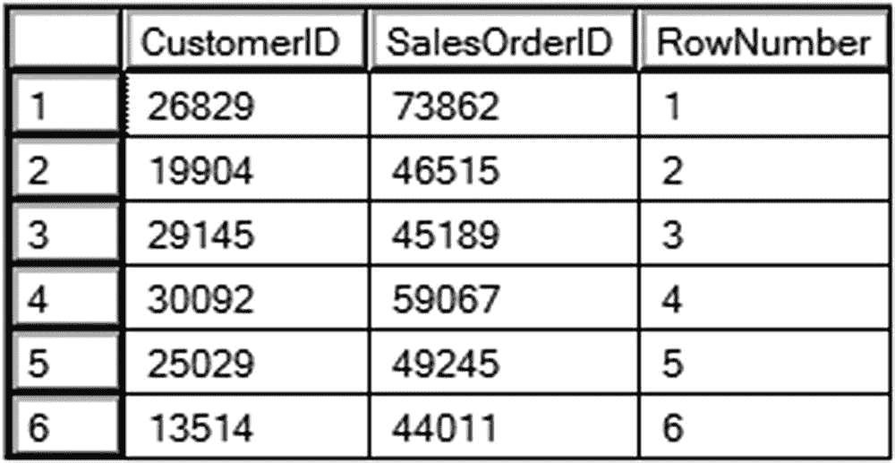

*图 1-6：使用随机 ORDER BY 的 ROW_NUMBER 的部分结果*

如您所料，以特定顺序应用行号涉及排序，这是一个开销很大的操作。如果您希望生成行号但不关心顺序，可以使用选择字面值而非列名的子查询。清单 1-6 演示了如何做到这一点。

```sql
--1-6.1 使用常量作为 ORDER BY
SELECT CustomerID, SalesOrderID,
ROW_NUMBER() OVER(ORDER BY (SELECT 1)) AS RowNumber
FROM Sales.SalesOrderHeader;
--1-6.2 对查询应用 ORDER BY
SELECT CustomerID, SalesOrderID,
ROW_NUMBER() OVER(ORDER BY (SELECT 1)) AS RowNumber
FROM Sales.SalesOrderHeader
ORDER BY SalesOrderID;
--1-6.3 无 ROW_NUMBER 和无 ORDER BY
SELECT CustomerID, SalesOrderID
FROM Sales.SalesOrderHeader;
```

图 1-7 显示了部分结果。在查询 1 和 2 中，选择常量的子查询替代了 `ORDER BY` 列。`OVER` 子句是相同的，但行号的应用方式不同，即以最简单的方式应用。两个查询的区别在于查询 2 有一个 `ORDER BY` 子句。由于没有指定行号分配的特定顺序，最简单的方式就是即使没有 `ROW_NUMBER` 函数时结果也会返回的顺序。查询 3 展示了在没有 `ROW_NUMBER` 和 `ORDER BY` 的情况下行是如何返回的。您可能想知道优化器为何选择在查询 1 和 3 中按 `CustomerID` 顺序返回结果。恰好在 `CustomerID` 上有一个覆盖这些查询的非聚集索引。优化器选择了在 `CustomerID` 上有序的索引来解决查询。

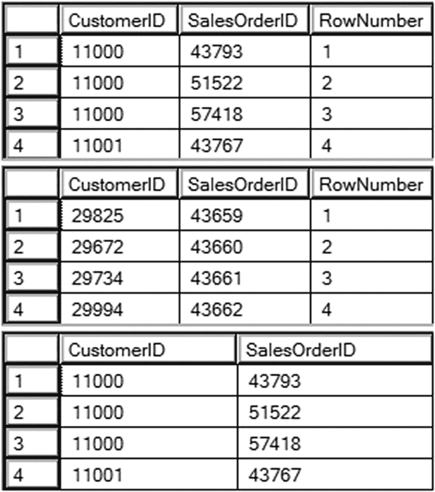

*图 1-7：让引擎决定如何应用行号的部分结果*

从这个例子中还可以了解到 `ROW_NUMBER` 是非确定性的。它不能保证在相同情况下返回相同的值。通过查看每个窗口函数的文档，您会发现每一个都是非确定性的。您可能会认为这是错误的，因为两个查询使用了不同的 `ORDER BY` 子句，导致两个 `ROW_NUMBER` 函数具有不同的输入。SQL Server 文档中的文章“确定性和非确定性函数”指出：

> *您无法影响任何内置函数的确定性。每个内置函数是确定性的还是非确定性的，取决于 SQL Server 的实现方式。例如，在查询中指定 `ORDER BY` 子句不会改变该查询中使用的函数的确定性。*

如果 `ORDER BY` 子句由唯一的列集组成，您可以预测行号的分配方式，但 `ROW_NUMBER` 仍然是非确定性的。清单 1-7 是一个例子。

```sql
--1-7.1 OVER 子句仅包含 CustomerID
SELECT CustomerID, SalesOrderID,
ROW_NUMBER() OVER(ORDER BY CustomerID) AS RowNumber
FROM Sales.SalesOrderHeader
ORDER BY CustomerID, SalesOrderID;
--1-7.2 相同的查询，仅更改 ORDER BY 子句
SELECT CustomerID, SalesOrderID,
ROW_NUMBER() OVER(ORDER BY CustomerID) AS RowNumber
FROM Sales.SalesOrderHeader
ORDER BY CustomerID, SalesOrderID DESC;
```

图 1-8 显示了部分结果。注意，`SalesOrderID` 在查询 1 中被分配为 1，在查询 2 中被分配为 3。两个查询之间唯一的区别是 `ORDER BY` 子句。由于 `CustomerID` 11000 有三个订单，数字 1、2 和 3 必须分配给这三行，但无法保证它们将如何被分配。

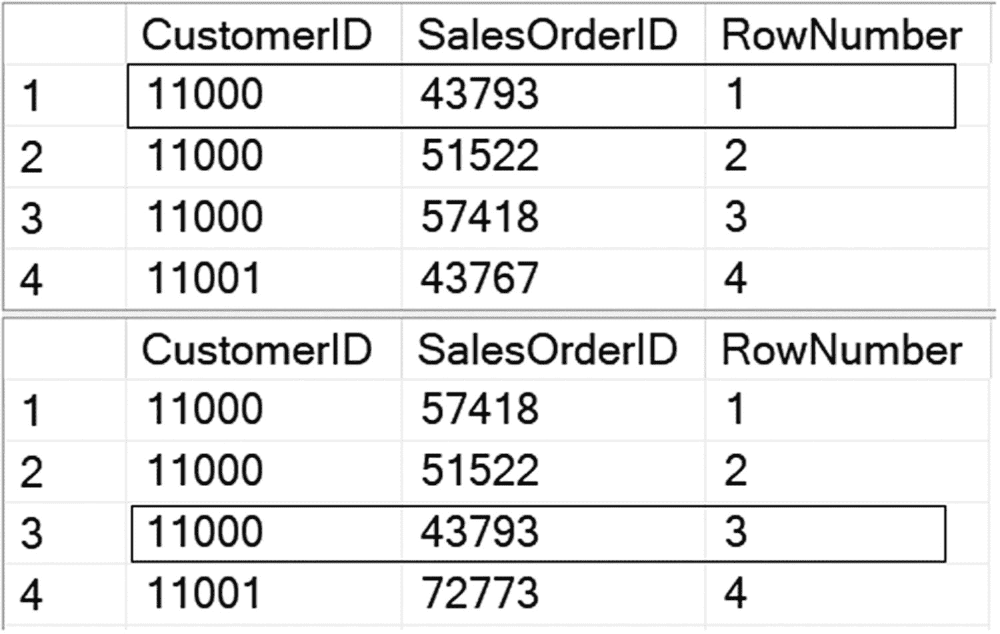

*图 1-8：演示非确定性*

关于确定性，您无法使用窗口函数完成的有几件事。您不能在计算列（表中由表达式组成的列）中使用窗口函数表达式，也不能将窗口函数表达式用作视图聚集索引的键。

`OVER` 子句中的 `ORDER BY` 表达式非常灵活。您可以使用表达式而不是列，就像之前示例中的 `NEWID()` 所展示的那样。您也可以列出多个列或表达式。清单 1-8 演示了在 `ORDER BY` 中使用 `CASE` 语句。

```sql
--1-8.1 在 ORDER BY 中使用表达式
SELECT CustomerID, SalesOrderID, OrderDate,
ROW_NUMBER() OVER(ORDER BY CASE WHEN OrderDate > '2013/12/31'
THEN 0 ELSE 1 END, SalesOrderID) AS RowNumber
FROM Sales.SalesOrderHeader;
```

图 1-9 显示了部分结果。在这种情况下，行号首先应用于 2014 年的订单，然后按 `SalesOrderID` 分配。网格向下滚动到 2014 年的最后三个订单，以便您可以看到接下来应用的数字来自数据的开头，即 2011 年。

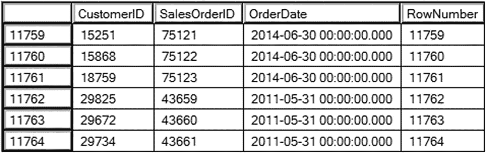

*图 1-9：使用表达式和另一个列的部分结果*

`OVER` 子句还有两个额外的组成部分：分区和框架。您将在第 5 章中学习到 2012 年引入的框架。分区将窗口划分为多个更小的窗口，接下来您将了解这部分内容。


## 使用分区划分窗口

如果你所在的房间正好有一扇窗户，现在就看看它。它是一整块大玻璃，还是被分成了多个小窗格？一扇被分成多个窗格的窗户仍然是一扇窗户。每一个单独的窗格本身也是一扇窗户。

同样的概念适用于窗口函数。整个结果集就是窗口，但你也可以根据一个或多个列将设置划分为更小的窗口。`OVER` 子句包含一个可选组件 `PARTITION BY`。当没有提供 `PARTITION BY` 时，分区就是整个大窗口。

使用 `LAG` 解决股票市场问题的查询通过 `TickerSymbol` 列对数据进行了分区。通过按 `TickerSymbol` 分离数据，一只股票的 `ClosePrice` 不会被另一只股票的行所检索。在本章前面演示的 `ROW_NUMBER` 函数的情况下，你可以强制数字为每个客户重新从 1 开始。清单 1-9 演示了这一特性。

```sql
--1-9.1 结合 PARTITION BY 使用 ROW_NUMBER
SELECT CustomerID, SalesOrderID,
ROW_NUMBER() OVER(PARTITION BY CustomerID ORDER BY SalesOrderID)
AS RowNumber
FROM Sales.SalesOrderHeader;
```
清单 1-9 使用 PARTITION BY

图 1-10 展示了部分结果。注意，行号为每个客户重新从 1 开始。

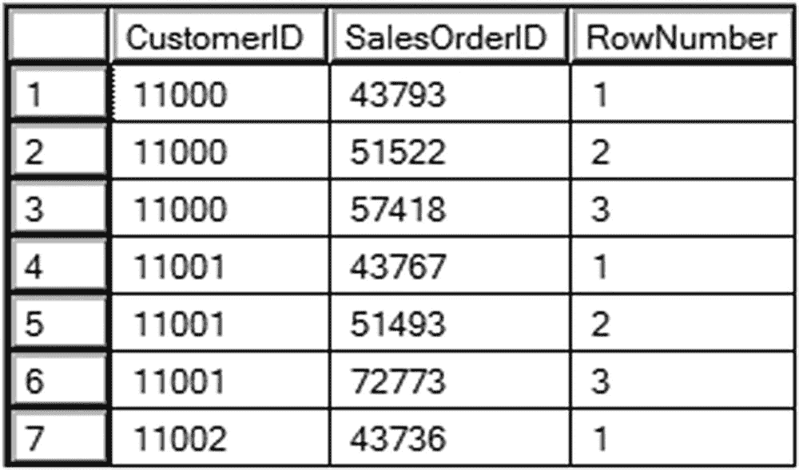
图 1-10 结合 `ROW_NUMBER` 使用 `PARTITION BY` 选项的部分结果

所有窗口函数都支持 `OVER` 子句的 `PARTITION BY` 表达式。它也总是可选的。如果省略 `PARTITION BY`，所有行都将包含在窗口中。当使用 `PARTITION BY` 时，每个窗口将仅包含与 `PARTITION BY` 列匹配的行。

## 揭示特殊案例窗口

到目前为止，示例都很直接，但如果你不知道发生了什么，有些情况会显得违反直觉。本节中的示例使用了 `ROW_NUMBER` 函数，但这些概念适用于任何窗口函数。

首先，看看当 `DISTINCT` 关键字与 `ROW_NUMBER` 一起使用时会发生什么。窗口函数在 `DISTINCT` 之前操作，这可能导致你意想不到的结果。清单 1-10 演示了将 `DISTINCT` 与 `ROW_NUMBER` 结合使用，以获取唯一的 `OrderDates` 列表及其行号。

```sql
--1-10.1 使用 DISTINCT
SELECT DISTINCT OrderDate,
ROW_NUMBER() OVER(ORDER BY OrderDate) AS RowNumber
FROM Sales.SalesOrderHeader
ORDER BY RowNumber;

--1-10.2 使用 CTE 分离逻辑
WITH OrderDates AS (
    SELECT DISTINCT OrderDate
    FROM Sales.SalesOrderHeader)
SELECT OrderDate,
    ROW_NUMBER() OVER(ORDER BY OrderDate) AS RowNumber
FROM OrderDates
ORDER BY RowNumber;
```
清单 1-10 将 `DISTINCT` 与 `ROW_NUMBER` 结合使用

图 1-11 展示了部分结果。查询 1 返回了 31,465 行，尽管许多订单日期相同，表中每个订单都返回了一行。这绝对不是预期的答案。行号是在应用 `DISTINCT` 之前生成的。因为行号是唯一的，结果中的每一行最终都是唯一的，所以 `DISTINCT` 无法消除任何行。查询 2 展示了解决方案：首先在 CTE 中获取订单日期的唯一列表，然后在外部查询中应用行号。查询 2 返回 1124 行，即唯一订单日期的数量。你也可以使用临时表、表变量、视图或派生表来首先创建唯一列表。

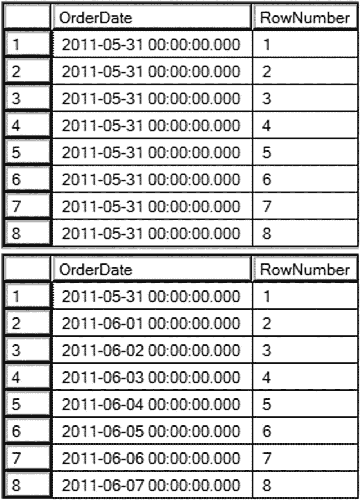
图 1-11 将 `DISTINCT` 与 `ROW_NUMBER` 结合使用的部分结果

当你使用 `TOP` 时，也会发现有趣的行为。同样，行号是在应用 `TOP` 之前生成的。我最初是在为一些单元测试向表中插入随机行时发现这一点的。思路是将示例行以新的 ID 号重新插入到同一个表中。为了生成新的 ID，我希望在现有最大 ID 的基础上添加行号。因为我希望插入特定数量的行，所以我使用了 `TOP`。结果行号并没有像我预期的那样从 1 开始，而是从一个随机值开始。清单 1-11 展示了使用 `TOP` 如何影响窗口函数。

```sql
--1-11.1 将 TOP 与 ROW_NUMBER 结合使用
SELECT TOP(6) CustomerID, SalesOrderID,
ROW_NUMBER() OVER(ORDER BY SalesOrderID) AS RowNumber
FROM Sales.SalesOrderHeader
ORDER BY NEWID();

--1-11.2 使用 CTE 分离逻辑
WITH Orders AS (
    SELECT TOP(6) CustomerID, SalesOrderID
    FROM Sales.SalesOrderHeader
    ORDER BY NEWID())
SELECT CustomerID, SalesOrderID,
ROW_NUMBER() OVER(ORDER BY SalesOrderID) AS RowNumber
FROM Orders;
```
清单 1-11 将 `TOP` 与 `ROW_NUMBER` 结合使用

图 1-12 展示了结果。如果你运行这个示例，会看到不同的随机结果。该示例的目的是生成六行随机数据，并且行号从 1 开始。查询 1 返回了行号，但行号并非从 1 开始，也没有任何顺序。通过使用 CTE 分离逻辑，`TOP` 可以首先操作。查询 2 返回一组随机的行，但行号如预期那样从 1 开始。

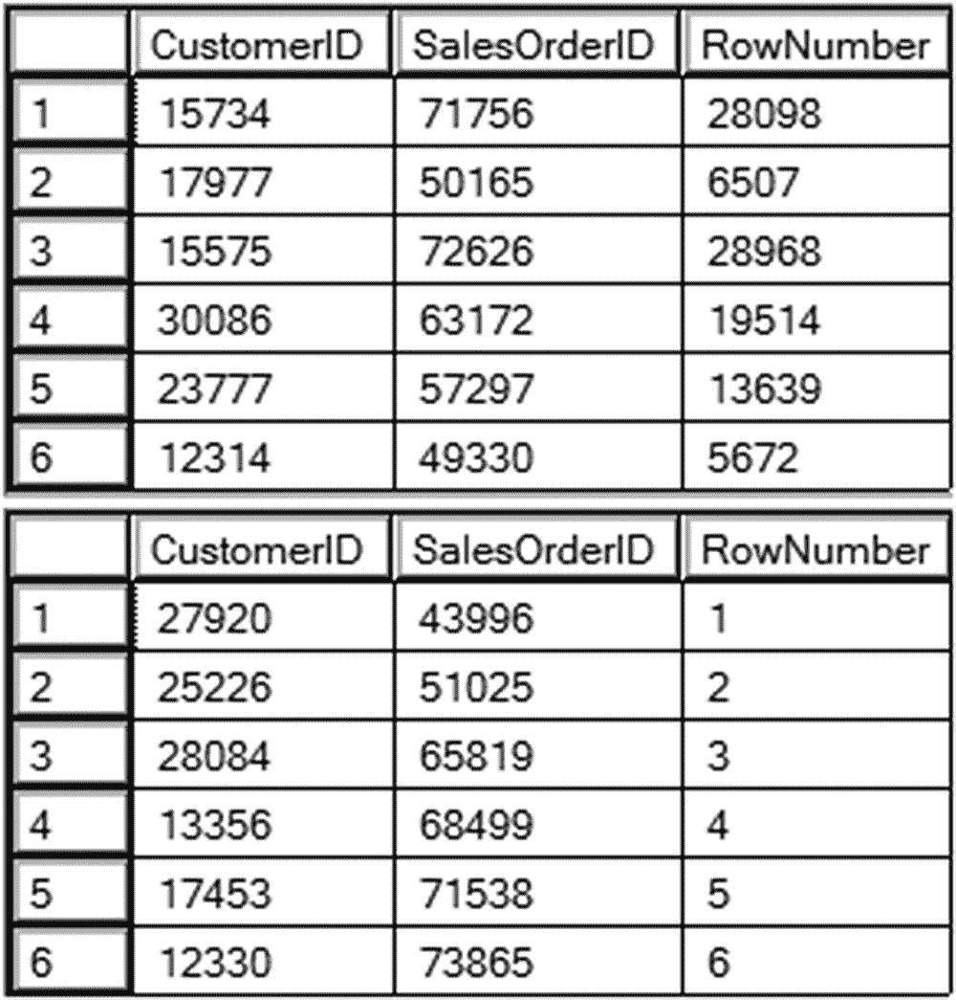
图 1-12 将 `TOP` 与 `ROW_NUMBER` 结合使用的结果

最后一个有趣的情况涉及将窗口函数添加到聚合查询中。此功能在第 3 章的“向聚合查询添加窗口聚合”一节中介绍。

## 总结

窗口函数随 SQL Server 2005 和 2012 引入，为解决具有挑战性的查询提供了新的、简便的方法。窗口函数是 SQL ANSI 标准的一部分。标准委员会已经定义了更多的功能，因此微软未来可能会包含额外的函数。窗口函数必须包含一个 `OVER` 子句，该子句定义了每行要操作的窗口。根据所使用的窗口函数，`OVER` 子句可能包含 `ORDER BY` 和框架表达式。`PARTITION BY` 表达式在所有窗口函数中都受支持，并将根据所需结果酌情使用。在许多情况下，使用窗口函数比旧方法提供更好的性能，但它们几乎总是让查询更容易编写。

既然你已经了解了窗口函数的基础知识，现在该研究排名函数了。在第 2 章中，你将学习如何使用 SQL Server 2005 引入的四个排名函数来解决复杂的 T-SQL 查询。

## 探索排名函数

这四个排名函数是由微软在 2005 年引入 T-SQL 的。其中三个函数，`ROW_NUMBER`、`RANK` 和 `DENSE_RANK`，为查询结果中的每一行分配一个序列号。第四个排名函数 `NTILE`，通过为结果中的每一行分配一个桶编号来划分行。低排名行组获得 `NTILE` 值 1，而最高排名的行组则被分配最大的编号。

虽然为一行添加编号本身通常不是最终答案，但这个功能往往是许多解决方案的基础。本章展示了如何使用这四个排名函数，以及如何在本章和本书后续章节中将它们应用于一些实际问题。


## 使用 ROW_NUMBER

根据我在 SQL Server 活动中对听众的调查，`ROW_NUMBER` 是最广为人知且最常用的窗口函数。许多 SQL Server 专业人士承认使用过 `ROW_NUMBER`，即使他们并未意识到这是窗口函数之一。在第 1 章中，当你学习 `OVER` 子句时，你已经看到了 `ROW_NUMBER` 的实际应用。现在，你将更深入地了解 `ROW_NUMBER`。

`ROW_NUMBER` 函数为窗口中的每一行返回一个从 1 开始的唯一整数。`OVER` 子句内部的 `ORDER BY` 表达式是必需的，它决定了编号的应用顺序。所有窗口函数都支持一个可选的 `PARTITION BY` 表达式，该表达式将窗口划分为更小的窗口（分区）。每个分区的行号从 1 开始并递增 1。以下是 `ROW_NUMBER` 的基本语法，它可能出现在查询的 `SELECT` 列表和 `ORDER BY` 子句中：

```sql
ROW_NUMBER() OVER([PARTITION BY column1[, column2, ...]]
ORDER BY column1 [ASC | DESC][, column2 [ASC | DESC] ...])
```

清单 [2-1] 展示了使用和不使用 `PARTITION BY` 表达式的 `ROW_NUMBER`。为了按 `CustomerID` 对齐行号以便比较，`OVER` 子句的 `ORDER BY` 表达式是不同的。

```sql
-- 2-1.1 使用带 PARTITION BY 和不带 PARTITION BY 的 ROW_NUMBER
SELECT CustomerID, CAST(OrderDate AS DATE) AS OrderDate, SalesOrderID,
ROW_NUMBER() OVER(PARTITION BY CustomerID ORDER BY SalesOrderID) AS WithPart,
ROW_NUMBER() OVER(ORDER BY CustomerID) AS WithoutPart
FROM Sales.SalesOrderHeader;
```

图 [2-1] 显示了部分结果。行号列 `WithPart` 和 `WithoutPart` 对于前三行（`CustomerID` 11000）的值是相同的。在此之后，由于 `PARTITION BY` 表达式，`WithPart` 行对于每个新的 `CustomerID` 重新开始编号。

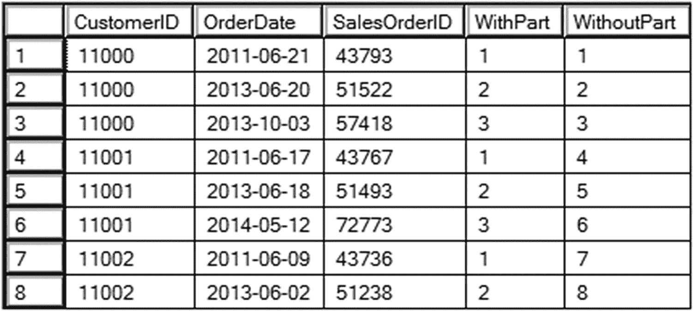

关于这个查询还有另一个有趣的事情需要考虑。第二个 `OVER` 子句中的 `ORDER BY` 表达式 `CustomerID` 在此数据中不是唯一的。`SalesOrderID` 为 43793 的两行的行号都返回 1。对于该行，`WithoutPart` 的值可能是 2 或 3，因为 `CustomerID` 11000 有三个订单，并且 `ORDER BY` 表达式仅基于该列。行号是正确应用的，因为它们是按 `CustomerID` 顺序排列的，但由于 `CustomerID` 不唯一，不能保证在 `CustomerID` 内部应用行号的顺序。`SalesOrderID` 43793 的 `WithoutPart` 值可能是 1、2 或 3。在第 1 章中，我简要提到所有窗口函数都是非确定性的，清单 [2-2] 展示了如何使用相同的 `OVER` 子句产生不同的行号。

```sql
-- 2-2.1 查询 ORDER BY 升序
SELECT CustomerID,
CAST(OrderDate AS DATE) AS OrderDate,
SalesOrderID,
ROW_NUMBER() OVER(ORDER BY CustomerID) AS RowNumber
FROM Sales.SalesOrderHeader
ORDER BY CustomerID, SalesOrderID;

-- 2-2.2 查询 ORDER BY 降序
SELECT CustomerID,
CAST(OrderDate AS DATE) AS OrderDate,
SalesOrderID,
ROW_NUMBER() OVER(ORDER BY CustomerID) AS RowNumber
FROM Sales.SalesOrderHeader
ORDER BY CustomerID, SalesOrderID DESC;
```

图 [2-2] 显示了部分结果。`OVER` 子句是相同的，但查询的排序方式不同。`SalesOrderID` 43793 在查询 1 中的行号是 1，但在查询 2 中的行号是 3。

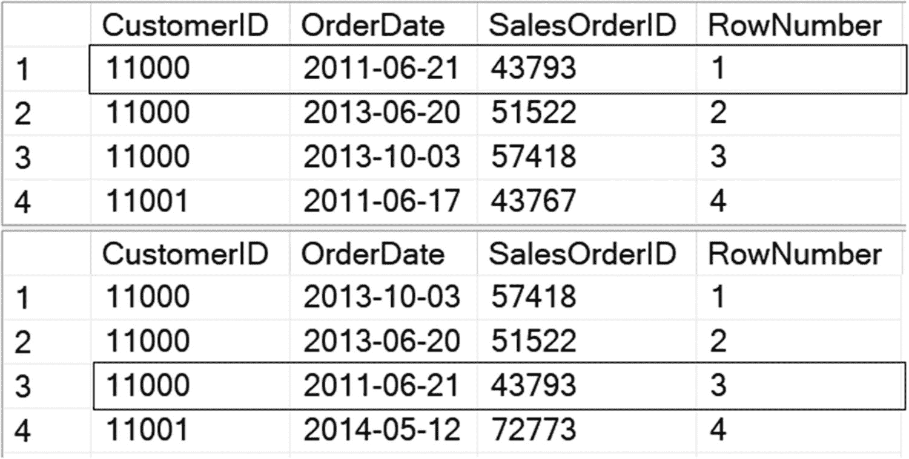

这证明 `ROW_NUMBER` 是非确定性的；换句话说，在相同的情况下，你可以从该函数获得不同的值。查询的 `ORDER BY` 子句不影响确定性，因此这是一个有效的测试。

为了确保使用 `ROW_NUMBER`（实际上是使用任何窗口函数）时获得可重复的结果，请确保 `OVER` 子句中的 `ORDER BY` 列是唯一的。清单 [2-3] 是一个使用多个 `ORDER BY` 列以使表达式唯一的示例。

```sql
-- 2-3.1 使用唯一 ORDER BY 的 ROW_NUMBER
SELECT CustomerID,
CAST(OrderDate AS DATE) AS OrderDate,
SalesOrderID,
ROW_NUMBER() OVER(ORDER BY CustomerID, SalesOrderID) AS RowNum
FROM Sales.SalesOrderHeader
ORDER BY CustomerID, SalesOrderID;

-- 2-3.2 改为降序
SELECT CustomerID,
CAST(OrderDate AS Date) AS OrderDate,
SalesOrderID,
ROW_NUMBER() OVER(ORDER BY CustomerID, SalesOrderID) AS RowNum
FROM Sales.SalesOrderHeader
ORDER BY CustomerID, SalesOrderID DESC;
```

图 [2-3] 显示了部分结果。在这种情况下，无论查询的 `ORDER BY` 子句如何，`SaleOrderID` 43793 的行号都是 1。`ROW_NUMBER` 仍然是一个非确定性函数，但由于唯一的 `ORDER BY` 列，赋值是一致的。

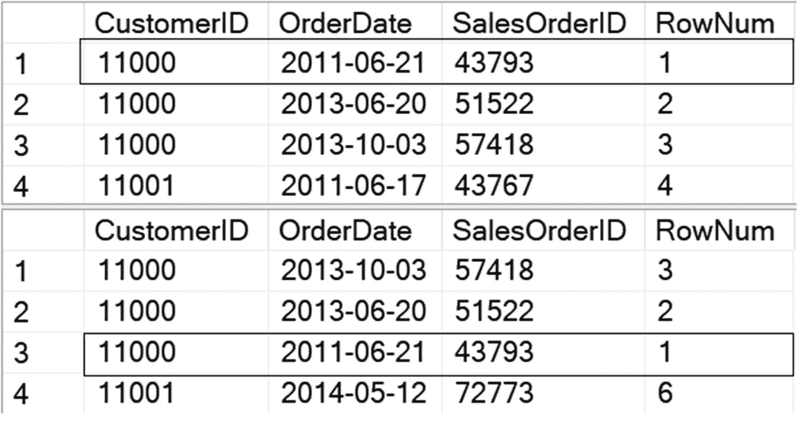

在 `OVER` 子句的 `PARTITION BY` 表达式中也可以包含多个列、表达式和子查询。事实上，正如你将在本章末尾的“使用排名函数解决查询”部分看到的，在 `PARTITION BY` 中使用多个列是解决一些实际示例的关键。

使用 `ROW_NUMBER` 时，数据库引擎对每个分区中的行进行排序，并根据每行的位置分配唯一编号。你已经看到 `OVER` 的 `ORDER BY` 表达式不唯一的情况，因此当值存在并列时，不能保证行号每次完全一致。现在你将学习两个以不同方式处理并列情况的函数：`RANK` 和 `DENSE_RANK`。


## 理解 RANK 与 DENSE_RANK

`RANK` 和 `DENSE_RANK` 函数与 `ROW_NUMBER` 看起来非常相似。事实上，在许多查询中，它们返回的值与 `ROW_NUMBER` 完全相同。然而，`RANK` 和 `DENSE_RANK` 函数却大不相同，因为它们不是简单地分配连续数字，而是根据 `ORDER BY` 表达式对行进行排名。

当 `OVER` 子句的 `ORDER BY` 列不唯一时，差异就会显现。例如，许多客户可能在同一天下单，但每个订单都有一个唯一的 `SalesOrderID`。如果使用 `OrderDate` 列而不是 `SalesOrderID`，结果中就会出现并列。并列行的排名将是相同的。

`RANK` 和 `DENSE_RANK` 之间也有区别。`RANK` 函数返回当前行相对于分区中所有行位置的排名。`DENSE_RANK` 函数则根据当前行在分区内 `ORDER BY` 表达式的唯一值返回排名。`RANK` 表示当前行之前有多少行，而 `DENSE_RANK` 表示当前值之前有多少个 *唯一值*。另一种理解方式是：`ROW_NUMBER` 是基于位置的，`DENSE_RANK` 是基于逻辑的，而 `RANK` 介于两者之间。`ROW_NUMBER` 基于行排好序后的位置，而 `DENSE_RANK` 基于唯一值的排列顺序。

这两个函数的语法与 `ROW_NUMBER` 的语法非常相似：

```
RANK() OVER([PARTITION BY [,,...]] ORDER BY  [,,...])
DENSE_RANK() OVER([PARTITION BY [,,...]]
ORDER BY  [,,...])
```

代码清单 2-4 对比了 `ROW_NUMBER`、`RANK` 和 `DENSE_RANK`。该查询经过筛选，显示在同一天下了多个订单的客户。

```
--2-4.1 使用 RANK 和 DENSE_RANK
SELECT CustomerID, CAST(OrderDate AS DATE) AS OrderDate,
ROW_NUMBER() OVER(ORDER BY OrderDate) AS RowNumber,
RANK() OVER(ORDER BY OrderDate) AS [Rank],
DENSE_RANK() OVER(ORDER BY OrderDate) AS DenseRank
FROM Sales.SalesOrderHeader
WHERE CustomerID IN (11330, 29676);
代码清单 2-4
使用 RANK 和 DENSE_RANK
```

图 2-4 显示了部分结果。每个 `OVER` 子句中的 `ORDER BY` 列是 `OrderDate`，它不是唯一的。行号是唯一的且连续的，正如预期的那样。请注意，第三行和第四行的 `Rank` 值都是 3。这两行的 `OrderDate` 都是 2013-07-31，形成了并列。这是数据集中的第三个排名 `OrderDate`。在第五行，`Rank` 值“追上”了 `RowNumber` 值，均为 5。第五行的日期 2013-08-09 是数据集中的第五个排名 `OrderDate`。

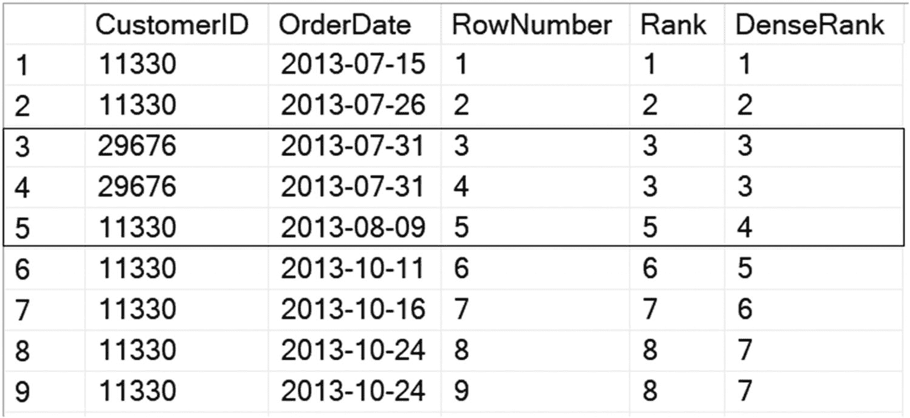

图 2-4: 比较 ROW_NUMBER、RANK 和 DENSE_RANK 的部分结果

第三行和第四行的 `DenseRank` 值也都是 3。然而，请注意第五行的 `DenseRank` 是 4。日期 2013-08-09 是数据集中的第四个 *不同* `OrderDate`。

`ROW_NUMBER`、`RANK` 和 `DENSE_RANK` 函数为每一行分配一个数字。现在你将了解一种不同类型的排名函数，`NTILE`。

## 使用 NTILE 划分数据

`NTILE` 函数是一个排名函数，但有点特别。它分配的数字用于将结果划分为等分的桶。你必须指定需要多少个桶，并且与其他排名函数一样，`OVER` 子句中需要包含 `ORDER BY` 表达式。以下是 `NTILE` 的语法：

```
NTILE() OVER([PARTITION BY [,,...]]
ORDER BY  [,,...])
```

在 `NTILE` 单词后面的括号内，提供你希望在结果中看到的桶的数量。`PARTITION BY` 表达式是可选的，`ORDER BY` 是必需的。代码清单 2-5 展示了一个示例，该示例根据 2013 年的销售额将月份划分为四个桶。

```
--2.5.1 使用 NTILE
WITH Orders AS (
SELECT MONTH(OrderDate) AS OrderMonth,
FORMAT(SUM(TotalDue),'C') AS Sales
FROM Sales.SalesOrderHeader
WHERE OrderDate >= '2013/01/01' and OrderDate < '2014/01/01'
GROUP BY MONTH(OrderDate))
SELECT OrderMonth, Sales, NTILE(4) OVER(ORDER BY Sales) AS Bucket
FROM Orders;
代码清单 2-5
使用 NTILE
```

图 2-5 显示了结果。该查询在名为 `Orders` 的 CTE 中将 2013 年的销售额按月份进行聚合。在外部查询中，应用了 `NTILE` 函数。每个月份所属的桶取决于该月份的销售额。`桶 #1` 包含销售额最低的三个月。`桶 #4` 包含销售额最高的三个月。


图 2-5: 使用 NTILE

在此示例中，使用四个桶，数据被均匀地分配到各个桶中。有时，行无法被桶数均匀分配。当分配后多出一行时，`桶 #1` 将获得这一额外行。当分配后多出两行时，`桶 #1` 和 `#2` 将各获得一个额外行，以此类推。代码清单 2-6 演示了这种情况。

```
--2.6.1 使用不均匀的桶进行 NTILE
WITH Orders AS (
SELECT MONTH(OrderDate) AS OrderMonth, FORMAT(SUM(TotalDue),'C')
AS Sales
FROM Sales.SalesOrderHeader
WHERE OrderDate >= '2013/01/01' and OrderDate < '2014/01/01'
GROUP BY MONTH(OrderDate))
SELECT OrderMonth, Sales, NTILE(5) OVER(ORDER BY Sales) AS Bucket
FROM Orders;
代码清单 2-6
使用不均匀的桶进行 NTILE
```

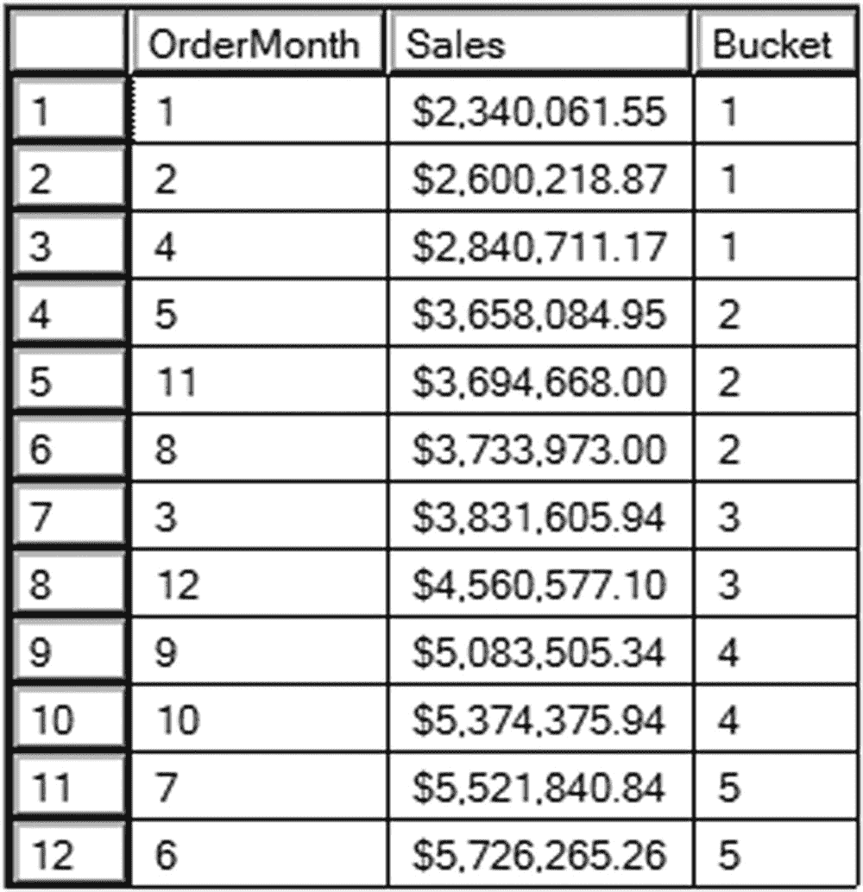

图 2-6: NTILE 使用不均匀桶的结果

此查询返回五个桶。十二除以五等于二余二。如果你查看图 2-6 中显示的结果，会看到 `桶 #1` 和 `桶 #2` 各有三行。其他桶各有两行。

在本章中，你已经看到了许多解释如何使用排名函数的示例，但还没有看到任何实际应用的例子。下一节将演示一些可以用这些函数解决的真实世界问题。

## 使用排名函数解决查询

自 2005 年这些函数首次引入以来，我在编写查询时发现越来越多使用排名函数的理由。我相信它们帮助我学会了以基于集合的方式思考，并且随着时间的推移，使用窗口函数变得自然而然。当我面临一个具有挑战性的查询时，我通常会先添加一个行号，看看是否能找到任何模式，然后据此继续。


### 数据去重

解决问题的方法总是不止一种，数据去重就是一个很好的例子。传统方法涉及将不同的行存储在临时表中。然后你可以截断原始表，并将这些行从临时表插回。可能存在无法清空原始表，而必须有选择地删除多余行的情况。你可以使用行号来解决这个问题。清单 2-7 创建了一个包含重复行的表。

```sql
--2-7.1 创建一个用于存放重复行的表
CREATE TABLE #dupes(Col1 INT, Col2 CHAR(1));
--2-7.2 插入一些行
INSERT INTO #dupes(Col1, Col2)
VALUES (1,'a'),(1,'a'),(2,'b'),
(3,'c'),(4,'d'),(4,'d'),(5,'e');
--2-7.3
SELECT Col1, Col2
FROM #dupes;
```

**清单 2-7** 创建包含重复行的表

图 2-7 显示了结果。你可以看到有几行是重复的。在实际应用中，该表可能有更多列，但两列足以演示此技术。

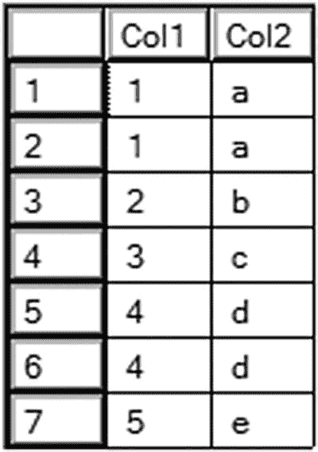
**图 2-7** 包含重复行的表

清单 2-8 包含一个删除重复项的脚本。为了更好地理解其工作原理，它被分解为两个步骤。请确保在与清单 2-7 相同的查询窗口中运行此代码，以便临时表存在。

```sql
--2-8.1 添加 ROW_NUMBER 并按所有列分区
SELECT Col1, Col2,
ROW_NUMBER() OVER(PARTITION BY Col1, Col2 ORDER BY Col1) AS RowNumber
FROM #dupes;
--2-8.2 删除 RowNumber > 1 的行
WITH Dupes AS (
SELECT Col1, Col2,
ROW_NUMBER() OVER(PARTITION BY Col1, Col2 ORDER BY Col1)
AS RowNumber
FROM #dupes)
DELETE Dupes WHERE RowNumber > 1;
--2-8.3 结果
SELECT Col1, Col2
FROM #dupes;
```

**清单 2-8** 删除重复行

图 2-8 显示了运行此脚本的结果。查询 1 中添加了一个 `ROW_NUMBER` 函数。为了使行号对于每个唯一的行重新开始编号，需要按表中的所有列进行分区。该表只有两列，但如果它有更多列，它们都应列在 `PARTITION BY` 表达式中。由于行号对于每个唯一的行重新开始编号，因此很容易看出要删除的行：它们的行号都大于 1。语句 2 删除了这些行。因为你不能将 `ROW_NUMBER` 函数添加到 `WHERE` 子句中，所以通过将行号添加到 CTE 中来分离逻辑。直接从 CTE 中删除重复项。最后，查询 3 证明重复项已消失。

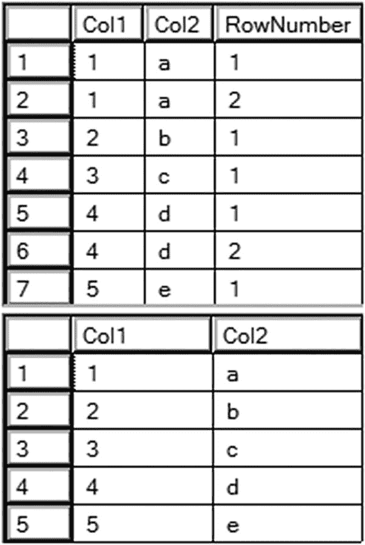
**图 2-8** 删除重复行

### 查找每组的前 N 行

我第一次思考这个问题是在一次技术面试中。潜在客户想知道我会如何找到特定年份内每个月的前四个订单。解决它的一种方法涉及使用 `CROSS APPLY` 和 `TOP`。最容易编写的方法是使用 `ROW_NUMBER`。清单 2-9 展示了这两种方法。

```sql
--2-9.1 使用 CROSS APPLY 查找前四个订单
WITH Months AS (
SELECT MONTH(OrderDate) AS OrderMonth
FROM Sales.SalesOrderHeader
WHERE OrderDate >= '2013-01-01' AND OrderDate < '2014-01-01')
SELECT OrderMonth, OrderDate, SalesOrderID, TotalDue
FROM Months
CROSS APPLY (
SELECT TOP 4 OrderDate, SalesOrderID, TotalDue
FROM Sales.SalesOrderHeader
WHERE MONTH(OrderDate) = Months.OrderMonth
AND OrderDate >= '2013-01-01' AND OrderDate < '2014-01-01'
ORDER BY SalesOrderID) AS Orders
ORDER BY OrderMonth, SalesOrderID;

--2-9.2 使用 ROW_NUMBER 查找前四个订单
WITH Orders AS (
SELECT MONTH(OrderDate) AS OrderMonth, OrderDate,
SalesOrderID, TotalDue,
ROW_NUMBER() OVER(PARTITION BY MONTH(OrderDate)
ORDER BY SalesOrderID) AS RowNumber
FROM Sales.SalesOrderHeader
WHERE OrderDate >= '2013-01-01' AND OrderDate < '2014-01-01')
SELECT OrderMonth, CAST(OrderDate AS DATE) AS OrderDate,
SalesOrderID, TotalDue
FROM Orders
WHERE RowNumber <= 4
ORDER BY OrderMonth, SalesOrderID;
```

**清单 2-9** 查找每月前四个订单

图 2-9 显示了部分结果，即一月和二月的行。每个查询总共返回了 48 行。查询 1 比较复杂。在我看来，它不容易理解。CTE 创建了一个 2013 年销售月份的列表。外部查询使用 `CROSS APPLY` 将 `Months` CTE 连接到内部查询。为了为外部查询的每一行拉回前四行，使用了 `TOP`。在这种情况下必须使用 `CROSS APPLY`，因为使用派生表只会拉回总共四行，而不是每月四行。

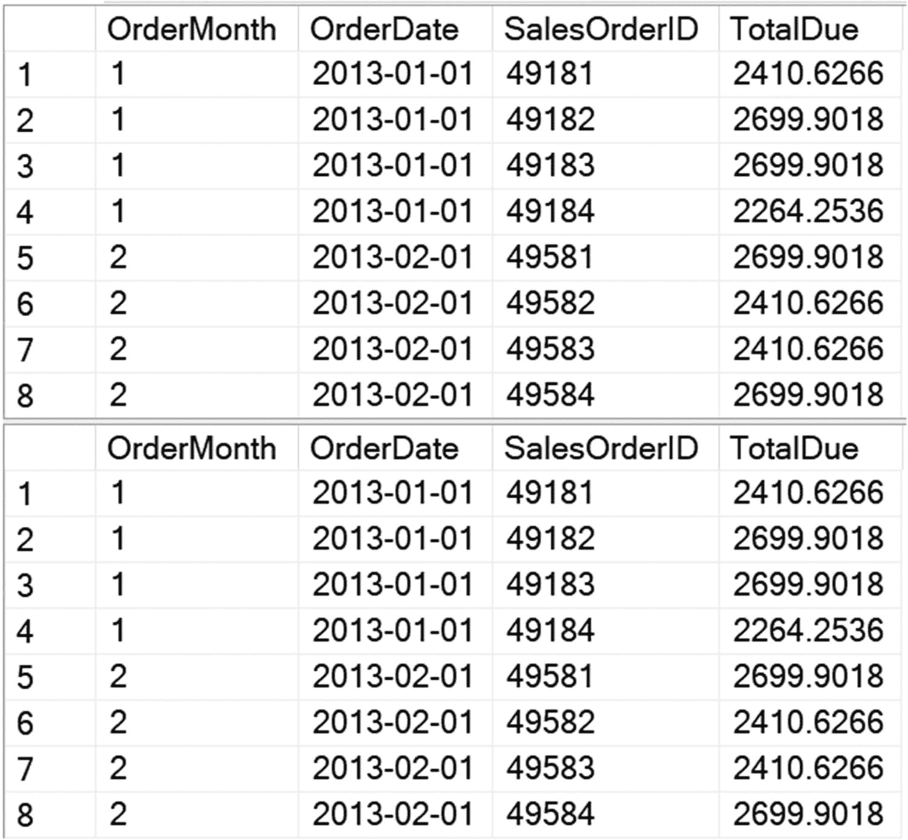
**图 2-9** 返回每月前四个销售的部分结果

查询 2 使用 `ROW_NUMBER` 来完成同样的事情。CTE 包含结果所需的所有表达式，外加一个行号。行号按月份分区，以便编号为每个月重新开始。外部查询只是从 CTE 中检索数据并根据行号进行过滤。

对于这个问题的另一种变化，如何找出每个月价格最高的四个订单呢？清单 2-10 展示了如何编写此查询。

```sql
--2-10.1 使用 ROW_NUMBER 查找前四个订单
WITH Orders AS (
SELECT  MONTH(OrderDate) AS OrderMonth, OrderDate,
SalesOrderID, TotalDue,
ROW_NUMBER() OVER(PARTITION BY MONTH(OrderDate)
ORDER BY TotalDue DESC) AS RowNumber
FROM Sales.SalesOrderHeader
WHERE OrderDate >= '2013-01-01' AND OrderDate < '2014-01-01')
SELECT OrderMonth, CAST(OrderDate AS DATE) AS OrderDate,
SalesOrderID,
TotalDue
FROM Orders
WHERE RowNumber <= 4
ORDER BY OrderMonth, TotalDue DESC;
```

**清单 2-10** 查找每月最昂贵的四个订单

图 2-10 显示了部分结果。在这种情况下，返回了每个月的四个订单，并且这些是每个月的最高销售额。

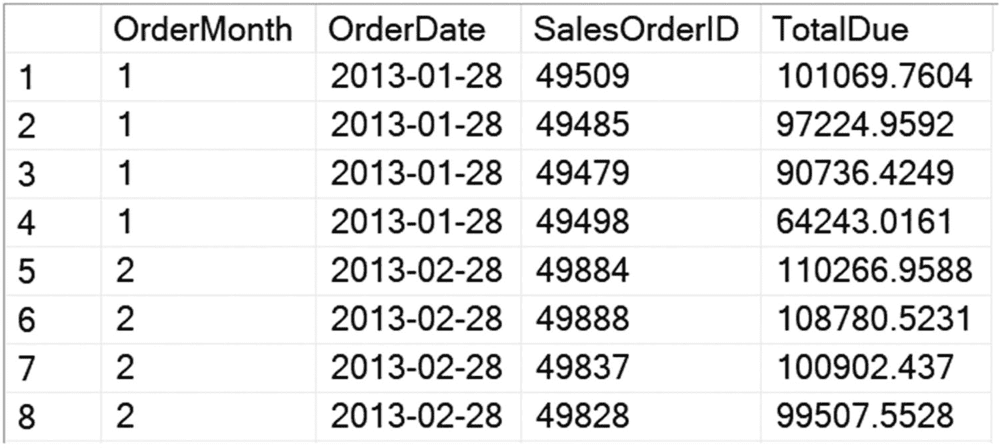
**图 2-10** 每月四个最昂贵订单的部分结果

你也可以使用此技术查找特定位置的行或一系列行，例如用于分页。例如，你可能需要在网页上一次显示十行。只需在查询中添加行号到 CTE 后，在 `WHERE` 子句中为你想要显示的第一行和最后一行提供一个变量，这很容易。还有另一种可能效果更好的方法，即 `OFFSET/FETCH` 技术，该技术从 SQL Server 2012 首次可用。这是 `ORDER BY` 子句的一个选项，更多信息可以在这里找到： [`https://docs.microsoft.com/en-us/sql/t-sql/queries/select-order-by-clause-transact-sql?view=sql-server-2017`](https://docs.microsoft.com/en-us/sql/t-sql/queries/select-order-by-clause-transact-sql%253Fview%253Dsql-server-2017)

### 创建计数表

在许多问题中，计数表（或数字表）都能派上用场，而且创建这种表也有几种方法。清单 2-11 展示了一个使用 `ROW_NUMBER` 的示例脚本。

```sql
--2-11.1 创建表
CREATE TABLE #Numbers(Number INT);
--2-11.2 填充计数表
INSERT INTO #Numbers(Number)
SELECT TOP(1000000) ROW_NUMBER() OVER(ORDER BY a.object_id)
FROM sys.objects a
CROSS JOIN sys.objects b
CROSS JOIN sys.objects c;
清单 2-11
创建数字表
```

通过使用 `CROSS JOIN`，你可以生成大量行，本例中通过 `TOP` 限制为一百万行。然后通过添加 `ROW_NUMBER`，数字 1 到 1,000,000 就会被加入表中。

现在你有了一个计数表，你可能会想用它做什么。当你需要在表中查找缺失的日期或 ID 号时，计数表通常很有用。清单 2-12 是一个示例。请确保在创建计数表的查询窗口中运行。

```sql
--2-12.1 找到最早日期和天数差
DECLARE @Min DATE, @DayCount INT;
SELECT @Min = MIN(OrderDate),
       @DayCount = DATEDIFF(DAY,MIN(OrderDate),MAX(OrderDate))
FROM Sales.SalesOrderHeader;
--2-12.2 将数字转换为日期，然后查找缺失的日期
WITH Dates AS (
    SELECT TOP(@DayCount) DATEADD(DAY,Number,@Min) AS OrderDate
    FROM #Numbers AS N
    ORDER BY Number
)
SELECT Dates.OrderDate
FROM Dates
LEFT JOIN Sales.SalesOrderHeader AS SOH
    ON Dates.OrderDate = SOH.OrderDate
WHERE SOH.SalesOrderID IS NULL;
清单 2-12
使用计数表查找没有订单的日期
```

此示例首先在表中找到最小日期以及最小日期和最大日期之间的差值。然后，它使用一个 CTE（公用表表达式）将数字从最早日期的次日开始转换为日期。在外部查询中，它将 `Dates` CTE 与表进行比较，基于 `OrderDate` 进行连接，并找出那些 `NULL` 的行。图 2-11 显示了结果。有三个日期没有任何订单。

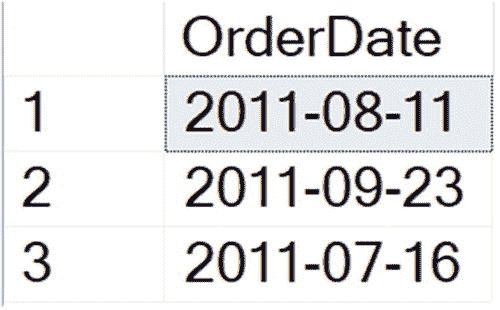

图 2-11：没有订单的日期

### 解决奖金问题

这个例子是我多年来用来解释如何使用 `NTILE` 函数的一个典型场景。假设你是一位销售团队的经理。你有一笔奖金要发放，并希望根据每个人的销售额来分配这笔钱。业绩最好的销售小组每人将获得 $4000，业绩最差的小组将获得 $1000。清单 2-13 展示了如何使用 `NTILE` 来解决这个问题。

```sql
--2-13.1 使用 NTILE 分配奖金
WITH Sales AS (
    SELECT SP.FirstName, SP.LastName,
           SUM(SOH.TotalDue) AS TotalSales
    FROM [Sales].[vSalesPerson] SP
    JOIN Sales.SalesOrderHeader SOH
        ON SP.BusinessEntityID = SOH.SalesPersonID
    WHERE SOH.OrderDate >= '2011-01-01' AND SOH.OrderDate < '2012-01-01'
    GROUP BY FirstName, LastName)
SELECT FirstName, LastName, TotalSales,
       NTILE(4) OVER(ORDER BY TotalSales) * 1000 AS Bonus
FROM Sales;
清单 2-13
解决奖金问题
```

图 2-12 显示了结果。此查询仅筛选了 2011 年这一年的数据。数据被聚合，并在一个名为 `Sales` 的 CTE 中计算每个人的 `TotalSales` 总和。在外部查询中，`NTILE` 函数将行分成四个组（桶）。提供给 `NTILE` 的参数指定了组的数量。通过将组号乘以 1000，就得到了奖金数额。销售额最低的销售人员获得的奖金较少。

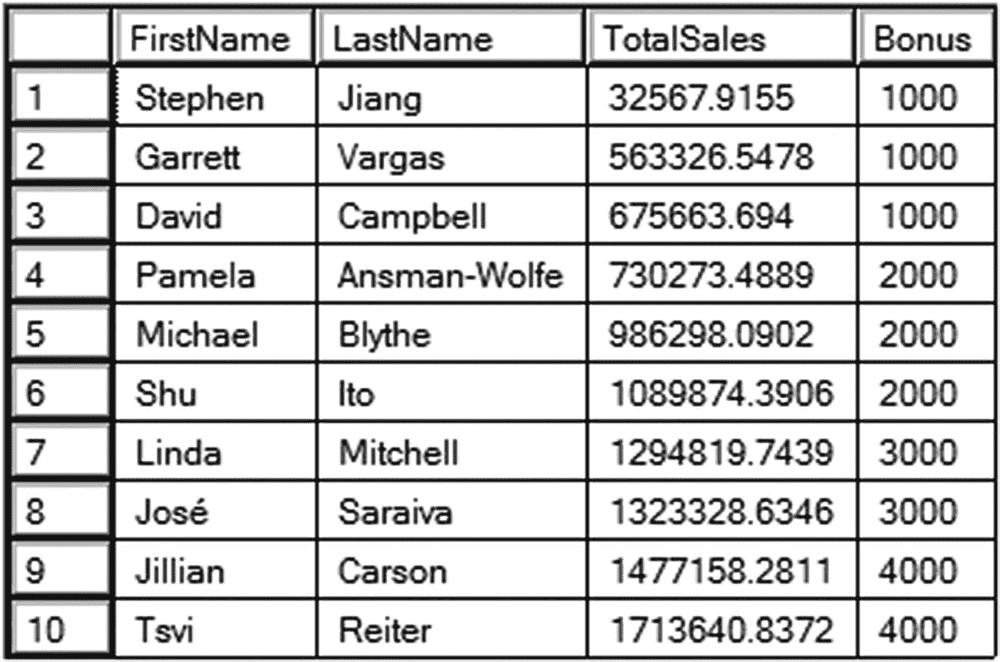

图 2-12：奖金问题的结果

你可能注意到，前两组各有三个人，而后两组只有两个人。这是因为十不能被四整除。余数中的一行被分配给了前两组。在这个例子中，有两个人获得了最高奖金，但如果你想将余数行分配给表现最好的组呢？你可以按降序对行排序以将额外的行移动到顶部，但接下来就出现了如何计算奖金的问题。通过重新使用直线的代数公式 `y = mx + b`，就可以得到正确的结果。直线的斜率 (`m`) 是 -1000，截距 (`b`) 是 5000。清单 2-14 展示了这种做法。

```sql
--2-14.1 按相反顺序分配奖金
WITH Sales AS (
    SELECT SP.FirstName, SP.LastName,
           SUM(SOH.TotalDue) AS TotalSales
    FROM [Sales].[vSalesPerson] SP
    JOIN Sales.SalesOrderHeader SOH
        ON SP.BusinessEntityID = SOH.SalesPersonID
    WHERE SOH.OrderDate >= '2011-01-01' AND SOH.OrderDate < '2012-01-01'
    GROUP BY FirstName, LastName)
SELECT FirstName, LastName, TotalSales,
       -1000 * NTILE(4) OVER(ORDER BY TotalSales DESC) + 5000 AS Bonus
FROM Sales;
清单 2-14
使用代数让三个人获得最高奖金
```

图 2-13 显示了结果。通过按相反方向排序，然后将 `NTILE` 的结果乘以 -1000 再加 5000，就有三个人获得了最高奖金。

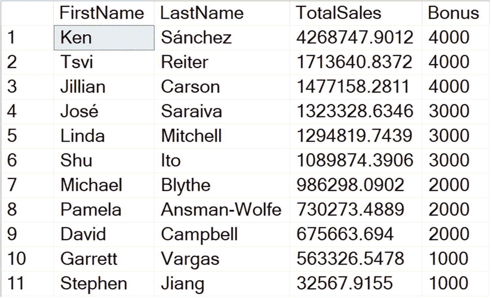

图 2-13：让三个人获得最高奖金时的结果

我还听说一些公司使用 `NTILE` 来划分比赛结果或捐赠者群体。虽然不常用，但如果你有适用场景，请记住它。

## 总结

排名函数 `ROW_NUMBER`、`RANK`、`DENSE_RANK` 和 `NTILE` 是所有窗口函数中最基础的。排名函数为结果的每一行添加一个编号。`OVER` 子句中的 `ORDER BY` 表达式是必需的，并且根据具体情况，你可能还需要添加 `PARTITION BY`。这些函数本身通常不是最终解决方案，但常常构成更复杂解决方案的基础。

当面对一个棘手的查询时，你可能想添加一个行号来查找行之间的模式或关系。然后利用这些模式和关系来找出解决方案。在第 9 章和第 10 章中，你将看到排名函数被用来解决更多查询问题。

第 3 章将介绍窗口聚合，它允许你在查询中添加像 `SUM` 或 `Avg` 这样的函数，而无需将查询转变为聚合查询。你将不需要 `GROUP BY`，也不会丢失任何明细数据。

