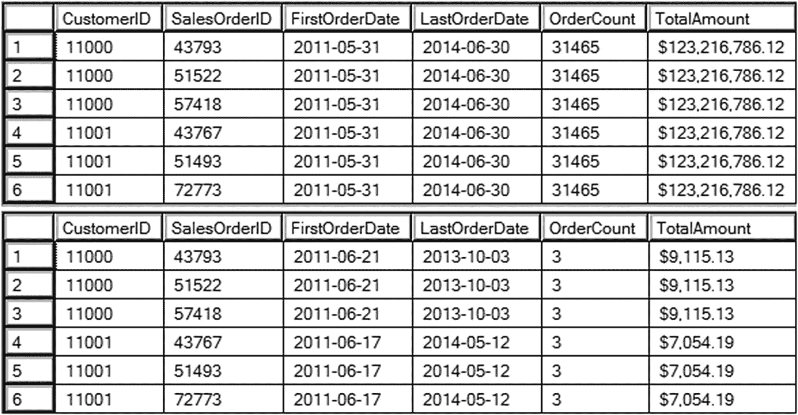
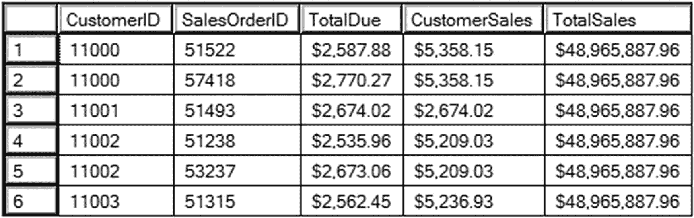
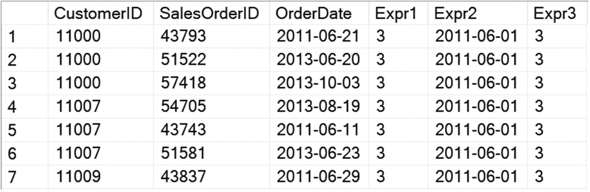
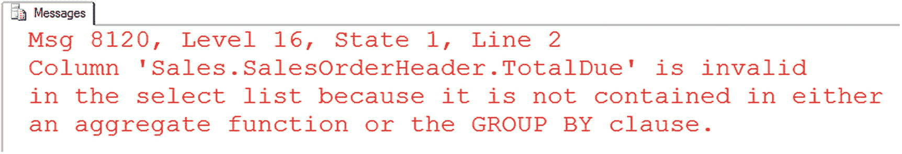
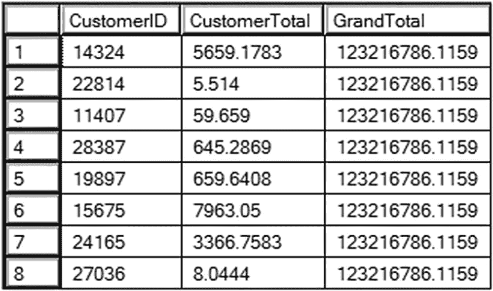
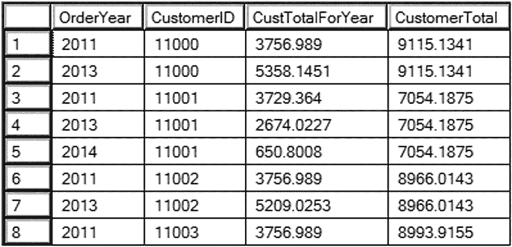
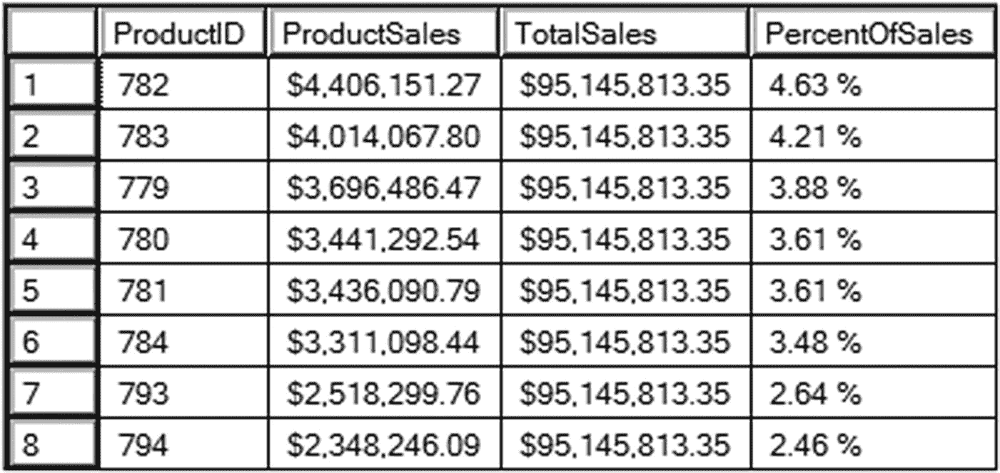
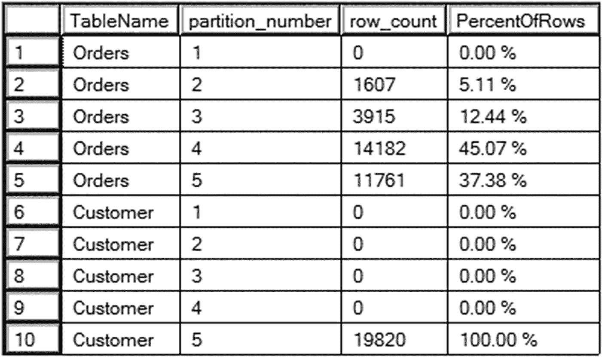
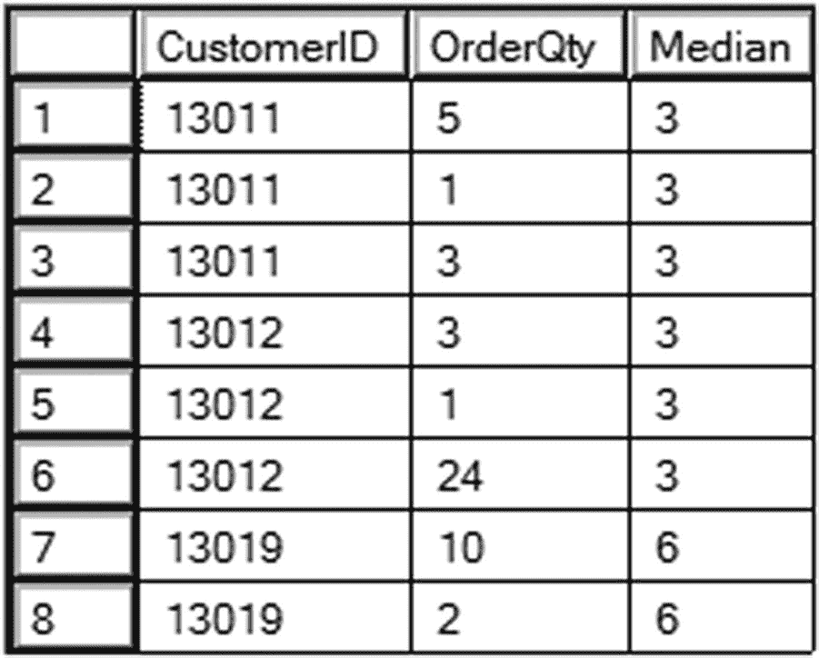

# 3. 使用窗口聚合进行汇总

2005 年，微软为 T-SQL 引入了另一种类型的窗口函数：窗口聚合。通过在聚合函数上添加一个 `OVER` 子句，你可以避免通常必须遵守的规则。在编写聚合查询时，你会丢失那些未包含在 `GROUP BY` 子句中的明细数据。从 SQL Server 2005 开始，你可以通过添加 `OVER` 子句来消除这一限制。通过添加 `OVER`，你也可以省略 `GROUP BY` 和 `HAVING` 子句。你还可以将窗口聚合函数添加到聚合查询中，以返回不同聚合级别的汇总值。

在本章中，你将学习如何通过窗口函数将聚合函数添加到非聚合查询中。你还将学习通过 OVER 子句将窗口聚合函数添加到聚合查询中，但实现不同级别的聚合。在本章的最后，我们将一起看一些实际问题。

## 使用窗口聚合

窗口聚合就是你日常使用的那些常用聚合函数，比如 `SUM` 和 `AVG`，只不过加上了 `OVER` 子句。到目前为止，你已经见过 `OVER` 子句与 `LAG` 和排名函数一起使用。在那些情况下，`ORDER BY` 组件是必需的。但 SQL Server 2005 的窗口聚合功能**不支持** `ORDER BY` 组件。第 4 章将介绍一个 2012 年的增强功能，该功能确实使用 `ORDER BY`，但你必须先了解 2005 年的这个功能。

虽然窗口聚合的 `OVER` 子句中不支持 `ORDER BY` 组件，但所有窗口函数都支持 `PARTITION BY`，窗口聚合也不例外。如果省略 `PARTITION BY`，你将得到一个空的 `OVER` 子句，该函数将应用于整个结果集，例如，计算总计或整体平均值。如果包含 `PARTITION BY`，则函数将应用于各个分区，例如，计算小计。语法如下：
```
() OVER([PARTITION BY [,,...])
```

可以作为窗口聚合使用的内置聚合函数列于表 3-1。

表 3-1
窗口聚合函数列表

| 聚合函数 | 定义 |
| --- | --- |
| AVG | 计算组的平均值。 |
| CHECKSUM_AGG | 计算组的校验和。常用于检测数据变化。 |
| COUNT | 用于获取行数或列的非空值计数。 |
| COUNT_BIG | 功能类似 COUNT，但返回一个大整数。 |
| MAX | 返回集合中的最大值。 |
| MIN | 返回集合中的最小值。 |
| STDEV | 计算组的标准差。 |
| STDEVP | 计算组中总体的标准差。 |
| SUM | 对组中的值进行求和。 |
| VAR | 返回组的统计方差。 |
| VARP | 返回组中总体的统计方差。 |

如果你查看 SQL Server 2019 支持的聚合函数，会发现有三个函数未包含在此列表中：`GROUPING`、`GROUPING_ID` 和 `APPROX_COUNT_DISTINCT`。当使用更高级的 `GROUP BY` 选项（如 `ROLLUP`）时，`GROUPING` 和 `GROUPING_ID` 用于标识分组级别。`APPROX_COUNT_DISTINCT` 是 SQL Server 2019 的新函数。对于大型数据集，当近似值足够好时，可以使用此新函数代替 `COUNT(DISTINCT)`。`COUNT(DISTINCT)` 不能用作窗口函数，因此 `APPROX_COUNT_DISTINCT` 同样不被允许也是合理的。

本章示例将重点介绍常用函数 `AVG`、`SUM`、`MIN`、`MAX` 和 `COUNT`。代码清单 3-1 展示了一些窗口聚合的示例。
```
--3.1.1 窗口聚合示例
SELECT CustomerID, SalesOrderID,
CAST(MIN(OrderDate) OVER() AS DATE) AS FirstOrderDate,
CAST(MAX(OrderDate) OVER() AS DATE) AS LastOrderDate,
COUNT(*) OVER() OrderCount,
FORMAT(SUM(TotalDue) OVER(),'C') TotalAmount
FROM Sales.SalesOrderHeader
ORDER BY CustomerID, SalesOrderID;
--3.1.2 使用 PARTITION BY
SELECT CustomerID, SalesOrderID,
CAST(MIN(OrderDate) OVER(PARTITION BY CustomerID) AS DATE)
AS FirstOrderDate,
CAST(MAX(OrderDate) OVER(PARTITION BY CustomerID) AS DATE)
AS LastOrderDate,
COUNT(*) OVER(PARTITION BY CustomerID) OrderCount,
FORMAT(SUM(TotalDue) OVER(PARTITION BY CustomerID),'C') AS TotalAmount
FROM Sales.SalesOrderHeader
ORDER BY CustomerID, SalesOrderID;
```
代码清单 3-1
使用窗口聚合

图 3-1 显示了部分结果。关于这些示例，首先要注意的是两个查询中都没有 `GROUP BY` 子句。向原本非聚合的查询中添加窗口聚合表达式，并不会将该查询变为聚合查询。这些查询在显示每行详细信息的同时，也显示了汇总值。


图 3-1
使用窗口聚合的部分结果

查询 1 使用了空的 `OVER` 子句。这意味着计算是在整个结果集上进行的。`FirstOrderDate` 是数据中最早的 `OrderDate`，`LastOrderDate` 是数据中最新的 `OrderDate`。`OrderCount` 是总计数，`TotalAmount` 是所有行的总金额。查询 2 在每个 `OVER` 子句中包含了对 `CustomerID` 的 `PARTITION BY`。注意在结果中，查询 2 的值是针对每个客户特定的。

在之前的例子中，每个查询内的 `OVER` 子句是相同的。你可以在同一个查询中使用不同的 `OVER` 子句。代码清单 3-2 在一个查询中有两个具有不同 `OVER` 子句的窗口聚合函数。
```
--3.2.1 使用不同的 OVER 子句
SELECT CustomerID, SalesOrderID, FORMAT(TotalDue,'c') AS TotalDue,
FORMAT(SUM(TotalDue) OVER(PARTITION BY CustomerID),'c') AS CustomerSales,
FORMAT(SUM(TotalDue) OVER(),'c') AS TotalSales
FROM Sales.SalesOrderHeader
WHERE OrderDate >= '2013-01-01' AND OrderDate < '2014-01-01'
ORDER BY CustomerID, SalesOrderID;
```
代码清单 3-2
使用不同的 OVER 子句

图 3-2 显示了部分结果。此查询返回每个客户的总计和整体总计。


图 3-2
使用不同 OVER 子句的部分结果

在前面的例子中还注意到，有些窗口聚合函数嵌套在 `CAST` 或 `FORMAT` 函数内部。窗口函数也可以像常规聚合函数一样，在列、更复杂的表达式或子查询上操作。代码清单 3-3 展示了一个例子。
```
--3-3-1 在表达式中使用窗口函数
SELECT CustomerID, SalesOrderID,
CAST(OrderDate AS Date) AS OrderDate,
MIN(SalesOrderID/CustomerID)
OVER(PARTITION BY CustomerID) AS Expr1,
CAST(MIN(DATEADD(d,1,OrderDate)) OVER() AS DATE) AS Expr2,
AVG((SELECT COUNT(*)
FROM Sales.SalesOrderDetail AS SOD
WHERE SalesOrderID = SOH.SalesOrderID)) OVER() AS Expr3
FROM Sales.SalesOrderHeader AS SOH;
```
代码清单 3-3
在表达式中使用窗口函数

部分结果如图 3-3 所示。`Expr1` 是 `SalesOrderID` 除以 CustomerID 的商。`Expr2` 将 `DATEADD` 函数嵌套在 `MIN` 函数内，而 `MIN` 函数又嵌套在 `CAST` 函数内。`Avg` 函数应用于一个子查询，并返回明细行的平均数量。


图 3-3
嵌套函数的部分结果

你可以看到，向任何非聚合查询中添加窗口聚合函数是很容易的。务必遵循数据类型规则；例如，不能对字符数据计算总和。你不会为此功能使用 `ORDER BY`，如果你希望将计算应用于划分成子集的行，则会使用 `PARTITION BY` 表达式。

窗口聚合的一个非常直观的用法是在聚合查询中使用它们。


## 将窗口聚合添加到聚合查询中

当我第一次尝试将窗口聚合添加到聚合查询中时，它没有正常工作，这让我很惊讶，而错误信息则让我更加意外。清单 3-4 展示了一个例子。

```sql
--3-4.1 将窗口聚合添加到聚合查询
SELECT CustomerID, SUM(TotalDue) AS CustomerTotal,
SUM(TotalDue) OVER() AS GrandTotal
FROM Sales.SalesOrderHeader
GROUP BY CustomerID;
```
**清单 3-4**
将窗口聚合添加到聚合查询

图 3-4 显示了错误信息。



**图 3-4**
将窗口聚合添加到聚合查询后产生的错误信息

显然，`TotalDue` 列*被包含*在一个聚合表达式中，将其添加到 `GROUP BY` 子句中显然不是解决办法。要理解这里发生了什么，你必须思考窗口聚合所操作的窗口。窗口中的行集是在 `GROUP BY` 操作之后创建的。该窗口包含 `GROUP BY` 子句中列出的任何表达式加上任何聚合表达式。窗口函数任何部分中包含的任何表达式都必须遵循与 `SELECT` 列表相同的规则。这意味着将 `CustomerID` 作为窗口函数的参数或作为 `PARTITION BY` 列是没问题的，因为 `CustomerID` 是 `GROUP BY` 的一部分。但要在窗口聚合表达式的任何角色中使用 `TotalDue`，必须先将其聚合。清单 3-5 展示了正确的解决方案。

```sql
--3-5.1 如何将窗口聚合添加到聚合查询
SELECT CustomerID, SUM(TotalDue) AS CustomerTotal,
SUM(SUM(TotalDue)) OVER() AS GrandTotal
FROM Sales.SalesOrderHeader
GROUP BY CustomerID;
```
**清单 3-5**
如何将窗口聚合添加到聚合查询

语法看起来可能有些奇怪，因为你不能嵌套聚合函数，但窗口函数必须应用于 `TotalDue` 的总和，而不仅仅是 `TotalDue` 本身。图 3-5 显示了部分结果，并证明了这是有效的。



**图 3-5**
将窗口聚合添加到聚合查询后的部分结果

另一种更直观的方法是将窗口聚合分离到一个 CTE（公用表表达式）中，或者使用其他方法来分离逻辑。清单 3-6 展示了如何做到这一点。

```sql
--3.6.1 使用 CTE
WITH SALES AS (
SELECT CustomerID, SUM(TotalDue) AS CustomerTotal
FROM Sales.SalesOrderHeader
GROUP BY CustomerID)
SELECT CustomerID, CustomerTotal,
SUM(CustomerTotal) OVER() AS GrandTotal
FROM Sales;
```
**清单 3-6**
使用 CTE 替代嵌套

结果与图 3-5 相同。在 CTE 内部，查询按 `CustomerID` 分组。为每个客户计算总和 `CustomerTotal`。在外层查询中，窗口聚合被应用于 `CustomerTotal`。窗口聚合仍然是应用于聚合表达式，但逻辑被分离开了，因此更容易理解。以这种方式编写查询除了增加清晰度之外，并没有其他优势。

清单 3-7 有另一个有趣的例子，涉及 `GROUP BY` 子句中的多个表达式。

```sql
--3-7.1 对多个分组依据应用窗口聚合
SELECT YEAR(OrderDate) AS OrderYear,
CustomerID, SUM(TotalDue) AS CustTotalForYear,
SUM(SUM(TotalDue)) OVER(PARTITION BY CustomerID) AS CustomerTotal
FROM Sales.SalesOrderHeader
GROUP BY CustomerID, YEAR(OrderDate)
ORDER BY CustomerID, OrderYear;
```
**清单 3-7**
向包含多个表达式的 GROUP BY 子句的查询添加窗口聚合

部分结果显示在图 3-6 中。`GROUP BY` 子句列出了 `CustomerID` 列和 `YEAR(OrderDate)` 表达式。在应用窗口聚合之前，结果集包含每个客户每年的数据行。`CustTotalForYear` 是一个常规的聚合表达式。最后一个表达式是一个窗口聚合，其 `PARTITION BY` 表达式基于 `CustomerID`，因此 `CustomerTotal` 是该客户的总体小计。这个例子的重点是，你可以使用窗口聚合函数来返回不同聚合级别的值。



**图 3-6**
在包含多个表达式的 GROUP BY 查询中使用窗口聚合

在聚合查询内的窗口函数所操作的窗口中，行已经被过滤和分组。可供窗口函数使用的列列表受到 `GROUP BY` 子句的限制。这是默认的窗口；你可以对其进行分区，但不能包含窗口之外的任何内容。你可以缩小窗口范围，但不能扩大。你可以将 `PARTITION BY` 表达式基于整个结果集（空的 `OVER` 子句）、按 `CustomerID` 或按 `YEAR(OrderYear)` 进行分区，而不会出错。你不会使用 `CustomerID` 和 `YEAR(OrderYear)` 的组合，因为那与 `GROUP BY` 完全匹配。

向聚合查询添加窗口聚合的规则适用于所有窗口函数。请始终牢记，`GROUP BY` 和 `HAVING` 子句首先执行。`FROM`、`WHERE`、`GROUP BY` 和 `HAVING` 子句的结果决定了基础窗口中的行、列及其粒度。在窗口函数任何位置使用的任何列都必须是 `GROUP BY` 列之一，或者在窗口函数内部进行了聚合。

为避免混淆，首先在 CTE 中执行第一次聚合。然后，在外层查询中应用窗口函数。

## 使用窗口聚合解决常见查询

将窗口聚合添加到复杂的非聚合查询中非常容易。而用其他方法实现同样的功能可能会使查询的规模加倍。

### 销售额占比问题

这个特定的例子可以应用于许多情况。你可以使用窗口聚合来执行计算，例如百分比。清单 3-8 演示了如何在显示详细信息的同时显示销售额占比。

```sql
--3-8.1 计算销售额占比
SELECT P.ProductID,
FORMAT(SUM(OrderQty * UnitPrice),'C') AS ProductSales,
FORMAT(SUM(SUM(OrderQty * UnitPrice)) OVER(),'C') AS TotalSales,
FORMAT(SUM(OrderQty * UnitPrice)/
SUM(SUM(OrderQty * UnitPrice)) OVER(), 'P') AS PercentOfSales
FROM Sales.SalesOrderDetail AS SOD
JOIN Production.Product AS P ON SOD.ProductID = P.ProductID
JOIN Production.ProductSubcategory AS SUB ON P.ProductSubcategoryID
= SUB.ProductSubcategoryID
JOIN Production.ProductCategory AS CAT ON SUB.ProductCategoryID
= CAT.ProductCategoryID
WHERE CAT.Name = 'Bikes'
GROUP BY P.ProductID
ORDER BY PercentOfSales DESC;
```
**清单 3-8**
使用窗口函数显示销售额占比

图 3-7 显示了部分结果。这是一个聚合查询，因此在窗口聚合内部任何角色中使用的列都必须是 `GROUP BY` 列或进行了聚合。空的 `OVER` 子句用于计算 `TotalSales`。按 `ProductID` 计算的总和除以整个结果集的总销售额，并进行格式化，从而得出每种自行车型号的销售额占比。



**图 3-7**
按 ProductID 显示的销售额占比


### 分区表问题

我最喜欢的一个例子涉及查看表分区的元数据。表分区与 `PARTITION BY` 无关；它是一项让大型数据库中的数据管理更轻松的功能。由于 AdventureWorks 数据库中没有表是分区的，请运行清单 3-9 来创建一个分区表。过去，你需要企业版才能运行此功能。从 2016 SP 1 开始，Microsoft 将该功能移植到了所有版本。

```
--3-9.1 创建分区函数
CREATE PARTITION FUNCTION testFunction (DATE)
AS RANGE RIGHT
FOR VALUES ('2011-01-01','2012-01-01','2013-01-01','2014-01-01');
GO
--3-9.2 创建分区方案
CREATE PARTITION SCHEME testScheme
AS PARTITION testFunction ALL TO ('Primary');
GO
--3-9.3 创建分区表
CREATE TABLE dbo.Orders(CustomerID INT, SalesOrderID INT,
OrderDate DATE, TotalDue MONEY)
ON testScheme(OrderDate);
GO
--3-9.4 填充表
INSERT INTO dbo.Orders(customerID, SalesOrderID,
OrderDate, TotalDue)
SELECT CustomerID, SalesOrderID,
OrderDate, TotalDue
FROM Sales.SalesOrderHeader;
GO
--3-9.5 创建另一个分区表
CREATE TABLE dbo.Customer (CustomerID INT, ModifiedDate DATE)
ON testScheme(ModifiedDate);
GO
--3-9.6 填充表
INSERT INTO dbo.Customer(CustomerID, ModifiedDate)
SELECT CustomerID, ModifiedDate
FROM Sales.Customer;
GO
```
清单 3-9：创建一个分区表

当一个表被分区后，尽管在底层数据被分开了，你仍然可以用与以往相同的方式编写查询来检索数据。如果你想了解更多关于表分区的知识，请务必查阅 SQL Server 关于此主题的文档，因为这超出了本书的范围。

几年前，我的同事发给我一个查询并寻求帮助。他想查看分区表中每个分区的数据行占比。清单 3-10 展示了他发给我的查询以及我想出的解决方案。

```
--3-10.1 同事的查询
SELECT OBJECT_NAME(p.OBJECT_ID) TableName,
ps.partition_number, ps.Row_count
FROM sys.data_spaces  d
JOIN sys.indexes i
JOIN (SELECT DISTINCT OBJECT_ID
FROM sys.partitions
WHERE partition_number > 1) p
ON i.OBJECT_ID = p.OBJECT_ID
ON d.data_space_id = i.data_space_id
JOIN sys.dm_db_partition_stats ps
ON i.OBJECT_ID = ps.OBJECT_ID and i.index_id = ps.index_id
WHERE i.index_id <= 1;

--3-10.2 解决方案
SELECT OBJECT_NAME(p.OBJECT_ID) TableName,
ps.partition_number, ps.Row_count,
ps.Row_count * 1.0 / SUM(ps.Row_count) OVER (PARTITION BY p.OBJECT_ID)
AS PercentOfRows
FROM sys.data_spaces  d
JOIN sys.indexes i
JOIN (SELECT DISTINCT OBJECT_ID
FROM sys.partitions
WHERE partition_number > 1) p
ON i.OBJECT_ID = p.OBJECT_ID
ON d.data_space_id = i.data_space_id
JOIN sys.dm_db_partition_stats ps
ON i.OBJECT_ID = ps.OBJECT_ID and i.index_id = ps.index_id
WHERE i.index_id < 2;
```
清单 3-10：分区表问题与解决方案

图 3-8 显示了查询 2 的结果。原始查询（查询 1）包含结果中除 `PercentOfRows` 列之外的所有列。希望你同意原始查询相当复杂。期望的解决方案可以在查询 2 中找到。`Row_count` 列除以按 `OBJECT_ID` 分区后的 `Row_count` 总和。该分区使得结果对每个表都是特定的。答案还乘以了 1.0 以消除整数除法。它还为了可读性进行了格式化。使用旧方法来完成同样的事情编写起来会困难得多。


图 3-8：分区表问题的解决方案

要清理本节中创建的数据库对象，请运行清单 3-11。

```
--3-11 删除本节中创建的对象
DROP TABLE dbo.Customer;
DROP TABLE dbo.Orders;
DROP PARTITION SCHEME testScheme;
DROP PARTITION FUNCTION testFunction;
GO
```
清单 3-11：清理数据库对象

每当你需要使用某个聚合函数在不同于查询结果的层级上进行汇总时，考虑使用窗口聚合函数。

## 创建自定义窗口聚合函数

从 SQL Server 2005 开始，你可以使用 .NET 语言通过 CLR（公共语言运行时）集成来创建自定义聚合函数。令人惊讶的是，这些函数也可以作为窗口聚合函数工作。创建一个 C# DLL 超出了本书的范围，但本章的代码下载包含了一个用于此类函数的 C# 程序。如果你想学习如何创建自己的自定义函数，可以使用这个项目作为模板。有关创建自定义聚合函数的更多信息，请在 SQL Server 文档中搜索“CLR User-Defined Aggregates”。

该项目在章节的代码文件夹中包含一个 DLL 文件。将此文件复制到 SQL Server 可以访问的位置，例如 `C:\Custom` 文件夹。如果你已将文件复制到其他位置，则需要修改清单 3-12 中的命令。还必须启用 CLR 集成，因此请确保在本地 SQL Server 实例上执行此操作，或者至少在允许更改此设置的实例上执行。运行清单 3-12 来设置自定义窗口聚合函数。请注意，CLR 严格安全功能是在 SQL Server 2017 中添加的，但在安装了一些更新的 SQL Server 2016 上也可用。如果你的 SQL Server 版本较低，请注释掉代码的 3-12.2 部分。

```
--3-12.1 启用 CLR
EXEC sp_configure 'clr_enabled', 1;
GO
RECONFIGURE;
GO
--3-12.2 启用未签名的程序集
EXEC sp_configure 'show advanced options', 1;
RECONFIGURE;
EXEC sp_configure 'clr strict security',0;
GO
RECONFIGURE;
--3-12.3 注册 DLL
CREATE ASSEMBLY CustomAggregate FROM
'C:\Custom\CustomAggregate.dll' WITH PERMISSION_SET = SAFE;
GO
--3-12.4 创建函数
CREATE Aggregate Median (@Value INT) RETURNS INT
EXTERNAL NAME CustomAggregate.Median;
GO
--3-12.5 测试函数
WITH Orders AS (
SELECT CustomerID, SUM(OrderQty) AS OrderQty, SOH.SalesOrderID
FROM Sales.SalesOrderHeader AS SOH
JOIN Sales.SalesOrderDetail AS SOD
ON SOH.SalesOrderID = SOD.SalesOrderDetailID
GROUP BY CustomerID, SOH.SalesOrderID)
SELECT CustomerID, OrderQty, dbo.Median(OrderQty) OVER(PARTITION BY CustomerID) AS Median
FROM Orders
WHERE CustomerID IN (13011, 13012, 13019);
GO
```
清单 3-12：设置自定义窗口聚合函数

语句 1 为服务器打开 CLR 集成。语句 2 启用运行未签名程序集的能力。你应该对你计划使用的任何程序集进行签名。语句 3 注册程序集。语句 4 启用新的自定义函数。查询 5 测试名为 `MEDIAN` 的新函数。图 3-9 显示了使用 `MEDIAN` 函数的结果。当数值个数为奇数时，中位数返回中间值。当数值个数为偶数时，它返回两个中间值的平均值。客户 13011 有三个订单。5、1 和 3 的中位数是 3。客户 13019 有两个订单。中位数是 6，即 2 和 10 的中间值。


图 3-9：使用自定义 MEDIAN 函数

如果你希望删除该函数并关闭 CLR 集成，请运行清单 3-13。

```
--3-13.1 删除对象
DROP AGGREGATE Median;
DROP ASSEMBLY CustomAggregate;
GO
--3-13.2 将 CLR 集成重置为默认值
EXEC sp_configure 'clr_enabled', 0;
GO
RECONFIGURE;
EXEC sp_configure 'clr strict security',1;
GO
```
清单 3-13：清理数据库


## 概述

窗口聚合使得向非聚合查询添加摘要计算，或向聚合查询添加不同聚合级别的摘要变得非常容易。当你需要将详细数据与整体总计进行比较或生成小计时，这非常方便。如果你灵感迸发，甚至可以创建自己的自定义窗口聚合函数。

现在你已经了解了如何使用 SQL Server 2005 发布的所有窗口函数特性。第 4 章 将展示 2012 年引入的首个特性：移动和累积窗口聚合。

