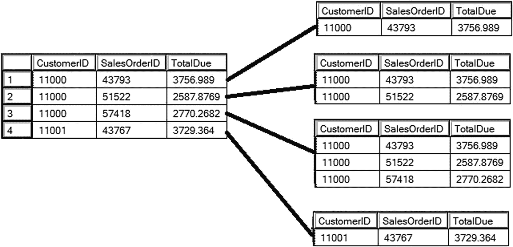
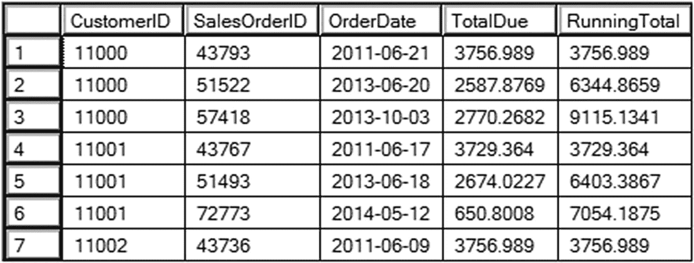
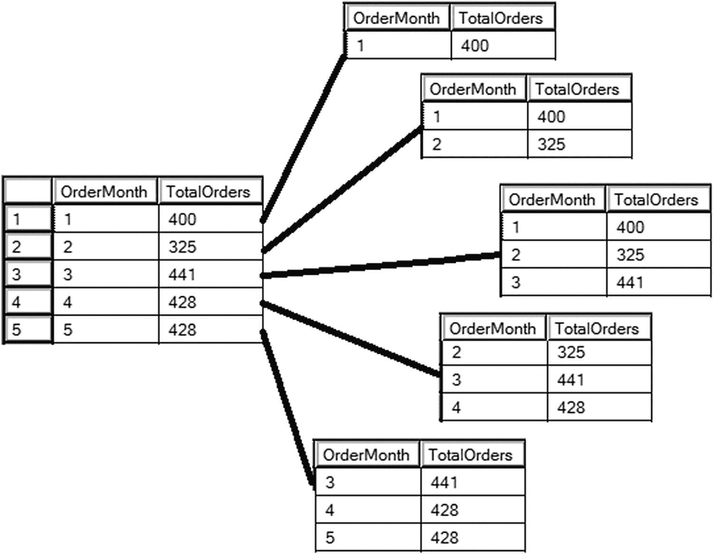
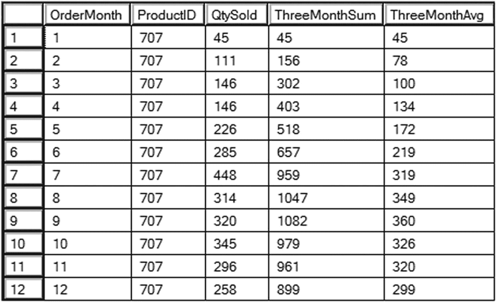
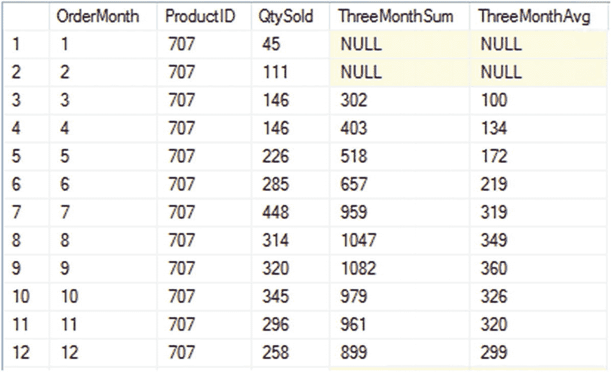
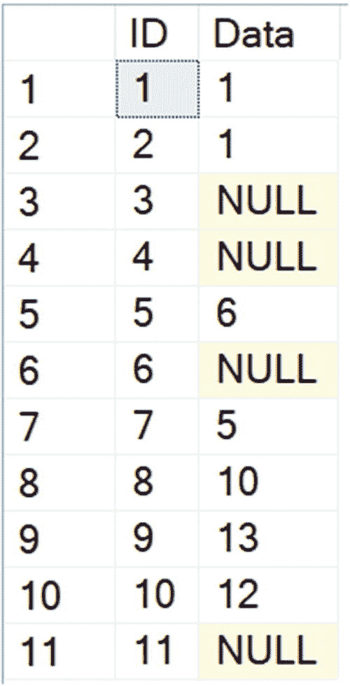
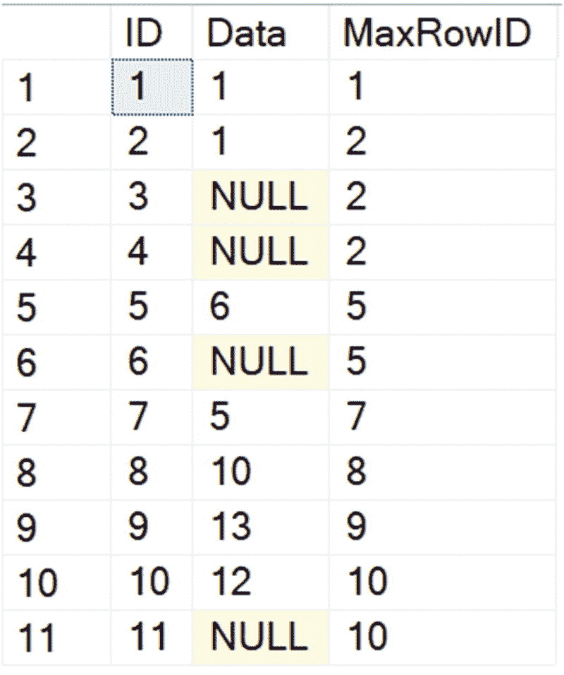
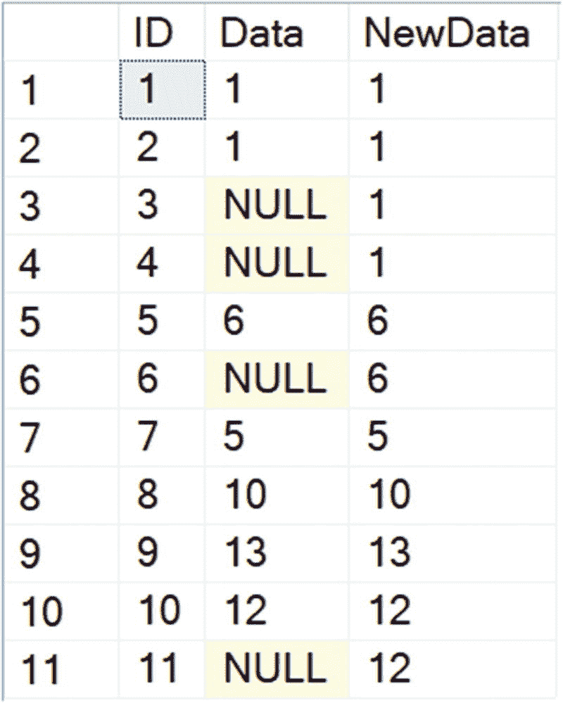

# 4. 计算累积和移动聚合

假设你被分配了一项任务，编写一个带有按客户分类的销售累积总计的 T-SQL 查询。也许你首先想到的是使用游标来完成，或者你可能熟悉一些查询技术，如自连接。如果你运行的是 SQL Server 2012 或更高版本，那么你很幸运！窗口函数使得计算累积总计、移动平均值等变得非常容易。

在本章中，你将学习如何在窗口聚合表达式中添加 `ORDER BY` 子句会改变一切！你将学习如何为累积和移动聚合添加计算，这在业务报告和仪表盘中经常需要。

## 向窗口聚合添加 ORDER BY

在第 3 章中，你学习了如何使用窗口聚合在不分组的情况下向查询添加摘要。2005 版的窗口聚合功能不支持 `OVER` 子句中的 `ORDER BY` 组件。从 SQL Server 2012 开始，你可以向窗口聚合添加 `ORDER BY` 来计算累积总计。为了区分此功能与 2005 功能，本书将 2012 功能称为*累积窗口聚合*。添加 `ORDER BY` 时，窗口会发生变化。每一行都有不同的行集（即窗口）用于操作。窗口基于 `ORDER BY` 表达式。默认情况下，窗口由结果集中的第一行开始，并包括直到当前行的所有后续行。图 4-1 展示了按 `CustomerID` 分区时窗口的工作原理。



图 4-1
每一行都有不同的窗口

在本章之前的示例中，组成窗口的实际行由 `PARTITION BY` 表达式确定。对于累积聚合，窗口中的行由 `PARTITION BY`、`ORDER BY` 和一个*框架*共同定义。框架可用于更精细地定义窗口。本节中的示例使用了默认框架。你将在本章的“计算移动总计和平均值”部分以及第 5 章中了解更多关于框架的信息。语法如下：

```
() OVER([PARTITION BY ]
ORDER BY  [Frame definition])
```

代码清单 4-1 演示了如何使用累积窗口聚合来计算累积总计。

```
--4-1.1 累积总计
SELECT CustomerID, SalesOrderID, CAST(OrderDate AS DATE) AS OrderDate,
TotalDue, SUM(TotalDue) OVER(PARTITION BY CustomerID
ORDER BY SalesOrderID) AS RunningTotal
FROM Sales.SalesOrderHeader;
```

代码清单 4-1
计算累积总计

图 4-2 展示了部分结果。`RunningTotal` 列的值不断增加，直到遇到不同的 `CustomerID`。此时，总计重新开始计算。



图 4-2
使用累积聚合计算累积总计的部分结果

代码清单 4-1 示例中的 `OVER` 子句使用了默认框架，该框架是 `OVER` 子句的一部分。第 5 章 将深入介绍框架，但你将在下一节中先了解一些基础知识。通过修改框架，你可以计算移动聚合。


## 计算移动总计和平均值

移动总计和平均值是非常流行的商业和经济指标。例如，开发者可能被要求提供按 3 个月或 12 个月计算这些指标的报告。默认情况下，用于累积窗口聚合的窗口在分区内持续增长，但对于移动聚合，你希望窗口大小保持不变。这可以通过添加窗口框架定义来实现。以下是包含移动聚合窗口框架的累积窗口聚合语法。第 5 章详细介绍了窗口框架，所以现在只需复制示例中的代码。

```sql
() OVER([PARTITION BY ]]
ORDER BY 
[ROWS BETWEEN  PRECEDING AND CURRENT ROW])
```

窗口对每一行都不同。图 4-3 展示了移动聚合的窗口工作原理。



图 4-3：按 3 个月计算的移动聚合窗口

运行清单 4-2 查看示例。

```sql
--4-2.1 产品销售数量的三个月总和与平均值
SELECT MONTH(SOH.OrderDate) AS OrderMonth, SOD.ProductID, SUM(SOD.OrderQty) AS QtySold,
SUM(SUM(SOD.OrderQty))
OVER(PARTITION BY SOD.ProductID ORDER BY MONTH(SOH.OrderDate)
ROWS BETWEEN 2 PRECEDING AND CURRENT ROW) AS ThreeMonthSum,
AVG(SUM(SOD.OrderQty))
OVER(PARTITION BY SOD.ProductID ORDER BY MONTH(SOH.OrderDate)
ROWS BETWEEN 2 PRECEDING AND CURRENT ROW) AS ThreeMonthAvg
FROM Sales.SalesOrderHeader AS SOH
JOIN Sales.SalesOrderDetail AS SOD ON SOH.SalesOrderID = SOD.SalesOrderID
JOIN Production.Product AS P ON SOD.ProductID = P.ProductID
WHERE OrderDate >= '2013-01-01' AND OrderDate < '2014-01-01'
GROUP BY MONTH(SOH.OrderDate), SOD.ProductID;
--清单 4-2：计算移动平均值和总和
```

该查询筛选出 2013 年下的订单，并按月份和`ProductID`进行聚合。图 4-4 显示了部分结果，即产品 707 一年的销售情况。注意，每种情况下的窗口函数都应用于聚合值，即`OrderQty`的总和。在聚合查询中使用窗口函数时，函数或`OVER`子句中使用的任何列都遵循与`SELECT`列表相同的规则。更多信息请参见第 3 章的“将窗口聚合添加到聚合查询”部分。通过在`OVER`子句中添加`ORDER BY`和`ROWS`表达式（框架），窗口每次向前移动，最多包含三行。



图 4-4：计算移动聚合的部分结果

大多数情况下，对三个月计算的要求是，如果不足三个月无法计算平均值，则值应为`NULL`，但这些函数只会对可用数据进行求和。例如，一月和二月的三个月总和与平均值应为`NULL`。从三月开始，三个月的数据已备齐，因此会返回总和。为此，你需要检查月份的数量。清单 4-3 展示了一种方法。

```sql
--4-3.1 当不足三个月时显示 NULL
SELECT MONTH(SOH.OrderDate) AS OrderMonth, SOD.ProductID,
SUM(SOD.OrderQty) AS QtySold,
CASE WHEN ROW_NUMBER() OVER(PARTITION BY SOD.ProductID
ORDER BY MONTH(SOH.OrderDate)) = '2013-01-01' AND OrderDate < '2014-01-01'
GROUP BY MONTH(SOH.OrderDate), SOD.ProductID;
--清单 4-3：当行数不足时返回 NULL
```

图 4-5 显示了部分结果，即`ProductID` 707 一年的销售情况。通过使用`CASE`语句检查`ROW_NUMBER`，当可用行数不足三行时返回`NULL`。



图 4-5：当可用行数不足三行时返回 NULL

## 使用累积聚合解决查询

创建累加和移动聚合非常简单！你将在第 5 章学习如何利用`OVER`子句的框架组件，以确保得到预期的结果。在第 8 章中，还将讨论框架的性能，这也很重要。与排名函数不同，计算累加或移动聚合可能本身就是解决方案，而不仅仅是解决方案中的一个步骤。下一节将展示如何使用累积窗口函数来解决更有趣的问题。


### 上一个有效值问题

我在一个论坛上看到这个问题，有几个人尝试过解决。最好的解决方案是由 T-SQL 专家 Itzik Ben-Gan 开发的。

该问题所用的表有两列。第一列 `ID` 是一个递增的整数，是表的主键。第二列可能包含 `NULL` 值。任务是将每个 `NULL` 替换为前一个非 `NULL` 值。

#### 清单 4-4：创建并填充表

以下代码创建并填充表，并显示各行数据。

```sql
--4-4.1 创建表
CREATE TABLE #TheTable(ID INT, Data INT);
--4-4.2 填充表
INSERT INTO #TheTable(ID, Data)
VALUES(1,1),(2,1),(3,NULL),
(4,NULL),(5,6),(6,NULL),
(7,5),(8,10),(9,13),
(10,12),(11,NULL);
--4-4.3 显示结果
SELECT * FROM #TheTable;
```

#### 图 4-6：上一个有效值问题的原始数据

图 4-6 显示了表中的原始数据。注意第 3、4、6 和 11 行的 `Data` 列为 `NULL`。解决方案将用 1 替换第 3 和第 4 行的 `NULL`，用 6 替换第 6 行的，用 12 替换第 11 行的。



我发现 Itzik 的解决方案非常优雅和巧妙。它利用了这样一个事实：你可以使用任何聚合函数作为累积窗口聚合，而不仅仅是 `SUM` 和 `AVG`。看一下第 4 行。需要用来替换 `NULL` 的值是第 2 行的 `Data` 值。第 2 行的 `ID` 也是从第 1 行到第 4 行中，`Data` 列非 `NULL` 的所有行中的最大 `ID`。一个从分区第 1 行开始一直到当前行的窗口，与计算运行总计所需的窗口是相同的！你可以利用这个事实来找到截至当前行、`Data` 值非 `NULL` 的最大 `ID`。

#### 清单 4-5：解决方案步骤 1

```sql
--4-5.1 找到最大的非空行
SELECT ID, Data,
MAX(CASE WHEN Data IS NOT NULL THEN ID END)
OVER(ORDER BY ID) AS MaxRowID
FROM #TheTable;
```

#### 图 4-7：步骤 1 的结果

图 4-7 显示了目前的结果。`MaxRowID` 列是每一行所需的 `Data` 值所在行的 `ID`。`MAX` 函数查找截至当前行、`Data` 值非 `NULL` 的所有行中的最大 `ID` 值。



我最初的想法是，我可以使用 `MaxRowID` 列将表与自身连接，但仔细看看这些数据。在 `MaxRowID` 值相同的每一组行中，有一行非 `NULL` 的 `Data`，其余都是 `NULL`。有三行的 `MaxRowID` 是 2。其中只有一行有非 `NULL` 的 `Data` 值。我接下来的想法是直接按 `MaxRowID` 分组，并对 `Data` 列使用 `MAX` 函数。但问题在于，这样做会丢失你需要查看的细节信息。然而，窗口聚合函数允许你在不将查询更改为聚合查询的情况下添加聚合函数。与其在 `MaxRowID` 上分组，不如按它进行分区。

#### 清单 4-6：完整解决方案

```sql
--4-6.1 解决方案
WITH MaxData AS
(SELECT ID, Data,
MAX(CASE WHEN Data IS NOT NULL THEN ID END)
OVER(ORDER BY ID) AS MaxRowID
FROM #TheTable)
SELECT ID, Data,
MAX(Data) OVER(PARTITION BY MaxRowID) AS NewData
FROM MaxData;
```

#### 图 4-8：上一个有效值问题的完整结果

图 4-8 显示了结果。解决方案的第一部分被添加到了一个 CTE 中。在外层查询中，`MAX` 函数用于查找最大的 `Data` 值（实际上是唯一非 `NULL` 的那个值），并按 `MaxRowID` 进行分区。



一旦看到这个解决方案，它似乎就变得相当简单了。感谢 Itzik Ben-Gan 想出了这个方法。


### 订阅问题

在当今世界，我们许多人不再订阅杂志或报纸，但就在不久之前，它们还非常流行。客户会订阅出版物，有时会在某个时间点取消订阅。在这个问题中，你必须计算每个月底的有效订阅数量。数据中可能会有晚于最晚订阅日期的取消日期，对于这些行你可以忽略。

解决这个问题最直观的方法是使用一个临时表，为每个月创建一行。然后遍历数据的每一行，根据开始和停止日期进行加减。遗憾的是，这种方法运行速度极慢。利用累积聚合功能可以轻松解决这个问题，而且运行速度快！

首先，创建一个包含一些随机注册数据的临时表。由于是随机的，你的最终结果将与我的不同。此脚本创建一个包含 100,000 行的表，但你可以根据需要调整这个数字。清单 4-7 创建并填充了该表。

```sql
--4-7.1 创建临时表
CREATE TABLE #Registrations(ID INT NOT NULL IDENTITY PRIMARY KEY,
DateJoined DATE NOT NULL, DateLeft DATE NULL);
--4-7.2 变量
DECLARE @Rows INT = 10000, @Years INT = 5, @StartDate DATE = '2019-01-01'
--4-7.3 插入 10,000 行，包含五年的可能日期
INSERT INTO #Registrations (DateJoined)
SELECT TOP(@Rows) DATEADD(DAY,CAST(RAND(CHECKSUM(NEWID())) * @Years * 365  as INT) ,@StartDate)
FROM sys.objects a
CROSS JOIN sys.objects b
CROSS JOIN sys.objects c;
--4-7.4 为 75%的订阅者添加取消日期
UPDATE TOP(75) PERCENT #Registrations
SET DateLeft = DATEADD(DAY,CAST(RAND(CHECKSUM(NEWID())) * @Years * 365  as INT),DateJoined)
--4-7.5 订阅数据
SELECT *
FROM #Registrations
ORDER BY DateJoined;
```
清单 4-7
创建订阅表

部分结果将如图 4-9 所示。


图 4-9
部分订阅数据

如果你阅读我在 2009 年写的一篇用于解决类似问题的文章（[`www.red-gate.com/simple-talk/sql/performance/writing-efficient-sql-set-based-speed-phreakery/`](http://www.red-gate.com/simple-talk/sql/performance/writing-efficient-sql-set-based-speed-phreakery/)），你会发现高效的代码也曾很复杂且难以理解。在那篇文章中，我解释了 SQL 专家 Peter Larsson 提出的一种解决方案，它使用了临时表、`UNPIVOT`和一个不受支持的“古怪”更新。有了 SQL Server 2012，这个问题的解决方案写起来就非常容易，而且性能很好。清单 4-8 展示了该解决方案。

```sql
--4-8.1 解决订阅问题
WITH NewSubs AS (
SELECT EOMONTH(DateJoined) AS TheMonth,
COUNT(DateJoined) AS PeopleJoined
FROM #Registrations
GROUP BY EOMONTH(DateJoined)),
Cancelled AS (
SELECT EOMONTH(DateLeft) AS TheMonth,
COUNT(DateLeft) AS PeopleLeft
FROM #Registrations
GROUP BY EOMONTH(DateLeft))
SELECT NewSubs.TheMonth AS TheMonth, NewSubs.PeopleJoined,
Cancelled.PeopleLeft,
SUM(NewSubs.PeopleJoined - ISNULL(Cancelled.PeopleLeft,0))
OVER(ORDER BY NewSubs.TheMonth) AS Subscriptions
FROM NewSubs
LEFT JOIN Cancelled ON NewSubs.TheMonth = Cancelled.TheMonth;
```
清单 4-8
使用 SQL Server 2012 功能解决订阅问题

部分结果如图 4-10 所示。第一步是按月获取新订阅和取消订阅的计数。为此，必须按月对数据进行分组。在这个案例中，使用了 `EOMONTH` 函数，它将每个日期更改为当月的最后一天。


图 4-10
订阅问题的部分结果

新订阅数和取消订阅数被分别放入 CTE 中，以分别获取每个月的 `PeopleJoined` 和 `PeopleLeft` 值。外部查询将 `NewSubs` CTE 与 `Cancelled` CTE 通过 `LEFT JOIN` 连接，因为有许多月份没有取消订阅。`PeopleJoined` 减去已处理了 `NULL` 值的 `PeopleLeft` 之后的总和被计算为一个累计总计。

该查询编写起来非常容易，而且运行相当快。在我的 Azure 虚拟机上，针对 100,000 行数据运行，耗时少于 100 毫秒。

## 总结

从 SQL Server 2012 开始，在 `OVER` 子句中添加 `ORDER BY` 会将窗口聚合变为累积窗口聚合。这让你可以轻松创建累计总计，以及移动总计和平均值。然而，此功能并不仅限于用于求和与平均值。`MAX` 函数也曾被用于解决一个难题。

在本章中，通过观察移动总和与平均值，你初步了解了帧。第 5 章将深入探讨帧。

---

