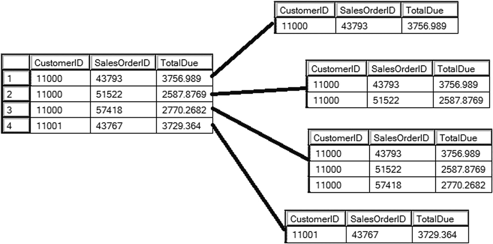
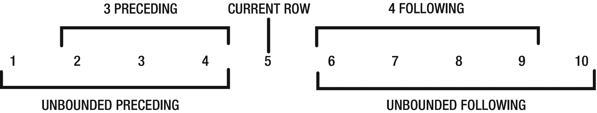
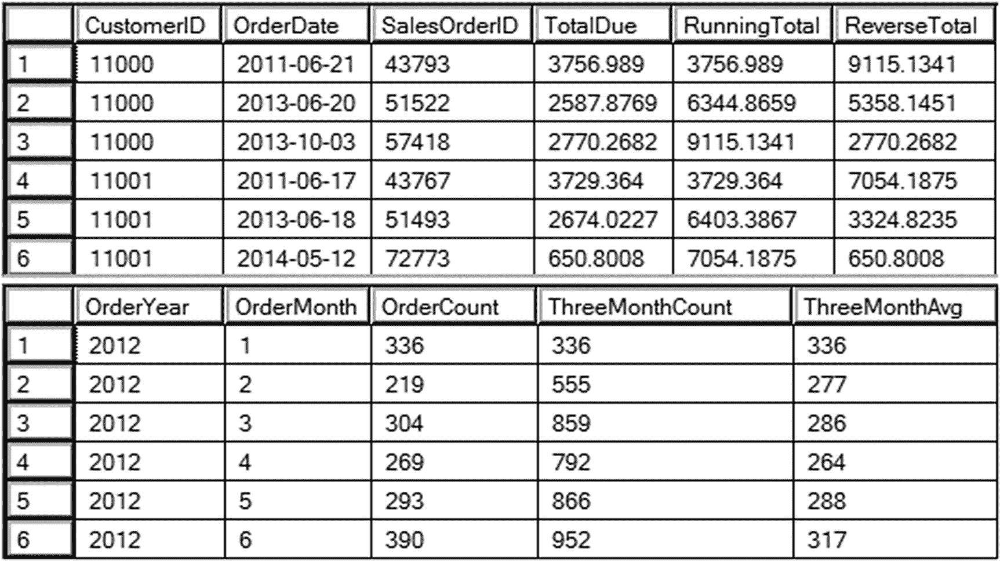
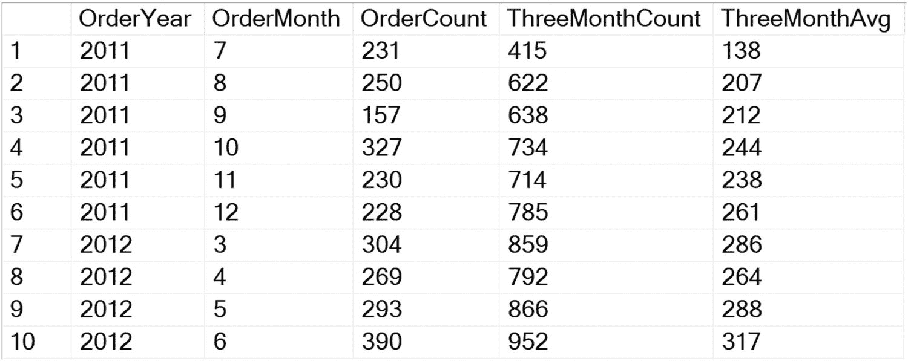
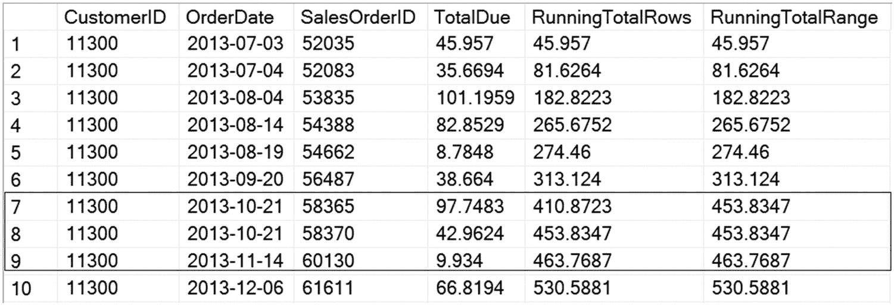
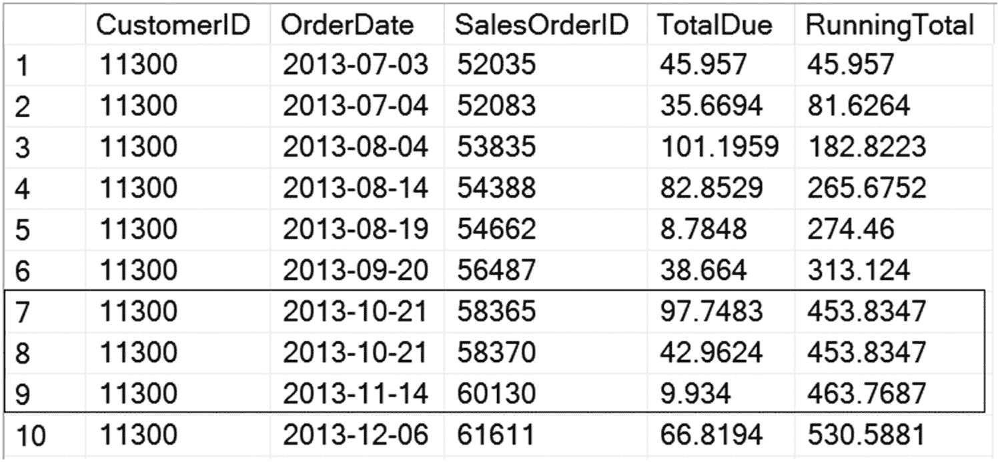

# 5. 向窗口添加帧

你已经审视过窗口，并利用它编写了强大的查询来解决一些常见问题。你已将窗口分区，就像大窗户上较小的窗格。现在，你将学习如何通过使用帧来创建非常精细的窗口，就像彩色玻璃一样。

在本章中，你将了解在支持帧的情况下，帧对于结果的准确性为何如此重要。帧对于性能也很重要，但你将在第 8 章学习相关内容。


## 理解 Framing

当 2012 年的 T-SQL 功能在 2011 年首次公布时，我必须承认 framing 让我有些畏惧。我尽可能避免学习它，因为我实在不太喜欢那个语法，也不太理解它到底是怎么回事。幸运的是，frames 只在特定的窗口函数中支持，所以它们并不常用。生活中最可怕的事情，比如公开演讲，往往带来最大的回报，窗口函数表达式中的 framing 也是如此。花时间理解 framing 将真正帮助你从窗口函数中获得最大收益。

使用 framing，你可以指定一个比分区更小的窗口。例如，你可能想要一个从集合的第一行开始但在当前行停止的窗口。你可能想要一个从当前行之前仅 12 行开始，而不管分区中有多少行的窗口。使用 frames，你可以定义满足这些特殊要求的窗口。

在开始向你的 `OVER` 子句添加 frames 之前，你应该理解几个关键术语。表 5-1 列出了这些术语及其定义。

**表 5-1**

**关键 Framing 术语**

| 关键术语 | 定义 |
| --- | --- |
| `ROWS` | 一个物理操作符。查看行的位置。 |
| `RANGE` | 一个逻辑操作符，但在当前版本的 SQL Server 中未完全实现。查看表达式的值而非位置。 |
| `UNBOUNDED PRECEDING` | 帧从集合中的第一行开始。 |
| `UNBOUNDED FOLLOWING` | 帧在集合中的最后一行结束。 |
| `N PRECEDING` | 当前行之前的物理行数。仅与 `ROWS` 一起支持。 |
| `N FOLLOWING` | 当前行之后的物理行数。仅与 `ROWS` 一起支持。 |
| `CURRENT ROW` | 当前计算所在的行。 |

你在第 4 章看到，用于累计聚合的窗口对于每一行都是不同的。如果你在计算累计总和，第 1 行的窗口就是第 1 行。第 2 行的窗口是第 1 行和第 2 行。第 3 行的窗口是第 1 行到第 3 行，依此类推。在每种情况下，窗口都从分区的第一行开始，在当前行结束。图 5-1 展示了按 `CustomerID` 分区时帧的样子。注意，第 4 行的窗口在一个新的分区 `CustomerID` 11001 中，并且第 4 行是该分区的第一行。



**图 5-1**

**每一行都有一个不同的窗口**

帧定义由关键字 `ROWS` 或 `RANGE` 后跟单词 `BETWEEN` 组成。然后你必须指定一个起点和终点。语法如下：

```
ROWS BETWEEN  AND 
RANGE BETWEEN  AND 
```

有两种可能的帧表达式可以给你一个累计聚合，比如累计总和，从分区的第一行开始，到当前行结束：`ROWS BETWEEN UNBOUNDED PRECEDING AND CURRENT ROW` 和 `RANGE BETWEEN UNBOUNDED PRECEDING AND CURRENT ROW`。你将在本章后面了解更多关于 `ROWS` 和 `RANGE` 之间的区别，但现在你应该理解，`RANGE BETWEEN UNBOUNDED PRECEDING AND CURRENT ROW` 是默认的帧，即当支持帧但未指定时使用的帧。这就是为什么你可以只为 `SUM` 的 `OVER` 子句添加一个 `ORDER BY` 表达式就能产生累计总和。表达式 `SUM(TotalDue) OVER(ORDER BY OrderID)` 和 `SUM(TotalDue) OVER(ORDER BY OrderID RANGE BETWEEN UNBOUNDED PRECEDING AND CURRENT ROW)` 是等效的。

出于你将在本章后面了解的原因，首选的帧表达式使用 `ROWS` 而不是 `RANGE`。你也可以使用累计总和帧的缩写语法：`ROWS UNBOUNDED PRECEDING`。

要创建一个从当前行开始并包含到集合末尾的所有行的帧，请使用 `ROWS BETWEEN CURRENT ROW AND UNBOUNDED FOLLOWING`。这将允许你创建一个反向的累计总和。使用帧的另一种方式是指定帧中包含的行数。此语法只能与 `ROWS` 一起使用。你可以指定当前行之前、之后或前后的行数。如果你打算指定当前行之前的行数，这个表达式还有一个快捷方式：`ROWS <N> PRECEDING`。想象一下，你有一个由 10 行组成的分区，当前行是第 5 行。表 5-2 列出了几个帧示例以及这些示例所引用的行。

**表 5-2**

**Framing 示例**

| 帧定义 | 行 |
| --- | --- |
| `ROWS BETWEEN 3 PRECEDING AND CURRENT ROW` | 2–5 |
| `ROWS BETWEEN CURRENT ROW AND 4 FOLLOWING` | 5–9 |
| `ROWS BETWEEN 3 PRECEDING AND 4 FOLLOWING` | 2–9 |
| `ROWS | RANGE BETWEEN UNBOUNDED PRECEDING AND CURRENT ROW` | 1–5 |
| `ROWS | RANGE BETWEEN CURRENT ROW AND UNBOUNDED FOLLOWING` | 5–10 |

图 5-2 说明了这些示例。



**图 5-2**

**一些 framing 示例**

`RANGE` 操作符不能在指定之前或之后的行数时使用，但它可以与 `UNBOUNDED PRECEDING` 和 `UNBOUNDED FOLLOWING` 短语一起使用。不太可能有人会故意指定 RANGE；他们很可能是漏掉了帧而默认得到了 `RANGE`。

SQL 标准中有一些功能在 T-SQL 的实现中被遗漏了。该功能允许你指定一个时间段而不是行数。清单 5-1 是一个理论上的查询，可能在将来可用。

```sql
--5-1.1 一个理论上的查询
SELECT SUM(TotalDue) OVER(ORDER BY OrderDate
RANGE BETWEEN INTERVAL 5 MONTH PRECEDING and 1 MONTH FOLLOWING
) SixMonthTotal
FROM Sales.SalesOrderHeader;
```
**清单 5-1**
**一个使用预期中 RANGE 功能的理论查询**

在了解当前实现功能中 `ROWS` 和 `RANGE` 的区别之前，先回顾几个使用帧的示例。


## 将框架应用于累计聚合和移动聚合

框架概念最早随 SQL Server 2012 版本被引入。它适用于一部分窗口函数，包括你在第 4 章学到的累计聚合函数，以及两个偏移函数：`FIRST_VALUE` 和 `LAST_VALUE`。你将在第 6 章学习偏移函数。

通过指定框架，你可以计算反向累计总和和移动聚合。运行代码清单 5-2 查看一些示例。

```sql
--5-2.1 累计与反向累计总和
SELECT CustomerID, CAST(OrderDate AS DATE) AS OrderDate, SalesOrderID, TotalDue,
SUM(TotalDue) OVER(PARTITION BY CustomerID ORDER BY SalesOrderID
ROWS UNBOUNDED PRECEDING) AS RunningTotal,
SUM(TotalDue) OVER(PARTITION BY CustomerID ORDER BY SalesOrderID
ROWS BETWEEN CURRENT ROW AND UNBOUNDED FOLLOWING) AS ReverseTotal
FROM Sales.SalesOrderHeader
ORDER BY CustomerID, SalesOrderID;
--5-2.2 移动求和与移动平均
SELECT YEAR(OrderDate) AS OrderYear, MONTH(OrderDate) AS OrderMonth,
COUNT(*) AS OrderCount,
SUM(COUNT(*)) OVER(ORDER BY YEAR(OrderDate), MONTH(OrderDate)
ROWS BETWEEN 2 PRECEDING AND CURRENT ROW) AS ThreeMonthCount,
AVG(COUNT(*)) OVER(ORDER BY YEAR(OrderDate), MONTH(OrderDate)
ROWS BETWEEN 2 PRECEDING AND CURRENT ROW) AS ThreeMonthAvg
FROM Sales.SalesOrderHeader
WHERE OrderDate >= '2012-01-01' AND OrderDate < '2013-01-01'
GROUP BY YEAR(OrderDate), MONTH(OrderDate);
```
代码清单 5-2
使用框架

图 5-3 展示了部分结果。通过指定窗口应从当前行开始并持续到分区末尾，你可以像查询 1 那样创建一个反向累计总和。通过指定窗口由当前行及前两行组成，如查询 2，你便创建了一个移动窗口。


图 5-3
使用框架计算的部分结果

你可能会注意到，使用 `N PRECEDING` 的计算在行数不足三个月时也会返回值。为了解决这个问题，你可以过滤掉不合格的行。代码清单 5-3 展示了你可能会如何操作。

```sql
--5-3.1 过滤掉前置行数不足 2 的行
WITH Sales AS (
SELECT YEAR(OrderDate) AS OrderYear, MONTH(OrderDate) AS OrderMonth,
COUNT(*) AS OrderCount,
SUM(COUNT(*)) OVER(ORDER BY YEAR(OrderDate), MONTH(OrderDate)
ROWS BETWEEN 2 PRECEDING AND CURRENT ROW) AS ThreeMonthCount,
AVG(COUNT(*)) OVER(ORDER BY YEAR(OrderDate), MONTH(OrderDate)
ROWS BETWEEN 2 PRECEDING AND CURRENT ROW) AS ThreeMonthAvg,
ROW_NUMBER() OVER(PARTITION BY YEAR(OrderDate)
ORDER BY MONTH(OrderDate)) AS RowNum
FROM Sales.SalesOrderHeader
GROUP BY YEAR(OrderDate), MONTH(OrderDate)
)
SELECT OrderYear, OrderMonth, OrderCount, ThreeMonthCount, ThreeMonthAvg
FROM Sales
WHERE RowNum >= 3;
```
代码清单 5-3
过滤掉前置行数不足两行的行

此查询包含了按年分区的 `ROW_NUMBER`，因此不会返回 2011 年的 5 月和 6 月。图 5-4 展示了部分结果。


图 5-4
过滤掉不足行后的部分结果

要获得如前面示例中的 `ThreeMonthAvg` 这样的移动聚合值，你必须使用框架。如果你只是想要一个累计总和，或许可以不指定框架。`ReverseTotal` 确实需要框架，因为它从数据末尾开始，到当前行结束。通常在讲解窗口函数时，会有人提到将 `ORDER BY` 表达式改为降序 (descending) 可以得到反向累计总和，他们是对的。代码清单 5-4 展示了一个例子。

```sql
--5-4.1 不使用框架的累计与反向累计总和
SELECT CustomerID, CAST(OrderDate AS DATE) AS OrderDate, SalesOrderID, TotalDue,
SUM(TotalDue) OVER(PARTITION BY CustomerID ORDER BY SalesOrderID) AS RunningTotal,
SUM(TotalDue) OVER(PARTITION BY CustomerID ORDER BY SalesOrderID DESC
) AS ReverseTotal
FROM Sales.SalesOrderHeader
ORDER BY CustomerID, SalesOrderID;
```
代码清单 5-4
不使用框架的累计总和与反向累计总和

其结果与图 5-3 中第一个查询显示的结果相同。在 SQL Server 2019 之前，我会警告不要这样做，因为存在性能影响。你将在第 8 章了解更多关于 `ROWS` 和 `RANGE` 在性能上的差异。在此之前，你确实需要意识到这两种运算符在逻辑上的一个关键区别。


## 理解 ROWS 与 RANGE 的逻辑差异

在第 8 章中，你将会看到，在 2019 年之前的 SQL Server 版本中，使用 `ROWS` 的窗口框架相比 `RANGE` 具有显著的性能优势。这两个操作符之间还存在逻辑上的差异。`ROWS` 操作符是一个位置操作符，而 `RANGE` 操作符则是一个逻辑操作符。这非常类似于 `ROW_NUMBER` 和 `RANK` 之间的区别。当 `ORDER BY` 表达式中存在并列值时，`RANK` 会重复该值，而 `ROW_NUMBER` 会返回唯一值。同样地，在计算累计总和时，如果 `OVER` 子句的 `ORDER BY` 表达式中存在并列值，`ROWS` 和 `RANGE` 也会返回不同的结果。运行清单 5-5 来查看这种差异。

```sql
--5-5.1 比较 ROWS 与 RANGE 的逻辑差异
SELECT CustomerID, CAST(OrderDate AS DATE) AS OrderDate, SalesOrderID, TotalDue,
SUM(TotalDue) OVER(ORDER BY OrderDate
ROWS UNBOUNDED PRECEDING) AS RunningTotalRows,
SUM(TotalDue) OVER(ORDER BY OrderDate
RANGE UNBOUNDED PRECEDING) AS RunningTotalRange
FROM Sales.SalesOrderHeader
WHERE CustomerID =11300
ORDER BY SalesOrderID;
```

清单 5-5
ROWS 与 RANGE 的区别

部分结果如图 5-5 所示。`OVER` 子句中的 `ORDER BY` 表达式都是 `OrderDate`，该列的值并不唯一。请看第 7 行和第 8 行，该客户在同一天下了两个订单。`RunningTotalRows` 的值按预期递增，而 `RunningTotalRange` 的值对于这两行是相同的。在第 9 行，`RunningTotalRange` 的值又重新对齐了。



图 5-5
比较 ROWS 与 RANGE 的部分结果

在这种情况下，`ROWS` 的窗口从第一行开始，包含根据 `ORDER BY` 排序后直至当前行的所有行。`RANGE` 的窗口则是从第一行开始，包含所有与当前行的 `ORDER BY` 表达式具有 *相同值* 的行。在确定第 7 行的窗口时，`RANGE` 不仅查看位置，还查看值。第 8 行的 `OrderDate` 值与第 7 行的值相同，因此第 8 行也被包含在第 7 行的窗口中。

如果你认为 `RANGE` 存在 bug，可以运行清单 5-6，它使用了一种较旧的技术，返回的结果与使用 `RANGE` 相同。

```sql
--5-6.1 查看较旧的技术
SELECT CustomerID, CAST(OrderDate AS DATE) AS OrderDate,
SalesOrderID, TotalDue,
(SELECT SUM(TotalDue)
FROM Sales.SalesOrderHeader AS IQ
WHERE IQ.CustomerID = OQ.CustomerID
AND IQ.OrderDate <= OQ.OrderDate) AS RunningTotal
FROM Sales.SalesOrderHeader AS OQ
WHERE CustomerID =11300
ORDER BY SalesOrderID;
```

清单 5-6
使用较旧技术得到相同结果

部分结果如图 5-6 所示。请看第 7 行和第 8 行。你会发现，由于 `OrderDate` 值相同，`RunningTotal` 的值也相同。



图 5-6
使用较旧技术计算累计总和的部分结果

如果你确保 `ORDER BY` 表达式是唯一的，那么无论使用旧方法还是使用默认窗口框架的窗口聚合，都能得到预期的结果。

如前所述，`RANGE` 操作符实际上旨在与月份或季度等逻辑集合一起使用。此功能已由 ANSI 标准定义，但目前在 SQL Server 中尚未实现。在此期间，请务必始终使用 `ROWS` 来指定窗口框架。

## 总结

编写计算累计总和或移动平均值的查询很容易。默认情况下，窗口框架是用 `RANGE` 定义的，但建议使用 `ROWS`，以防 `ORDER BY` 表达式不唯一。在旧版本的 SQL Server 中，使用 `ROWS` 还会带来性能提升，你将在第 8 章中了解到这一点。窗口框架还允许你指定一个随结果向下移动的窗口大小，以便进行诸如三个月平均值之类的计算。

窗口框架的语法并不容易掌握，但时不时地查阅本章中的语法并不丢脸。幸运的是，除了使用累积窗口聚合以及 `FIRST_VALUE` 和 `LAST_VALUE` 函数时，你不必担心窗口框架的问题。你将在下一章，即第 6 章中学习 `FIRST_VALUE` 和 `LAST_VALUE`。

