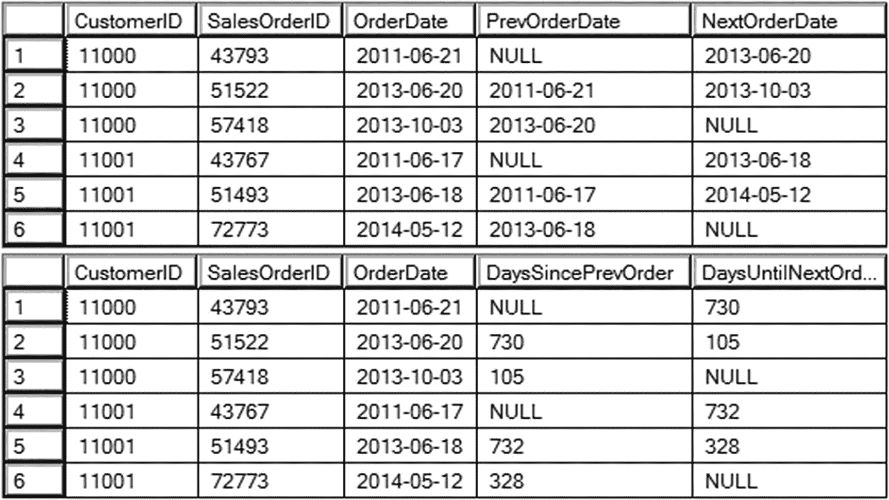
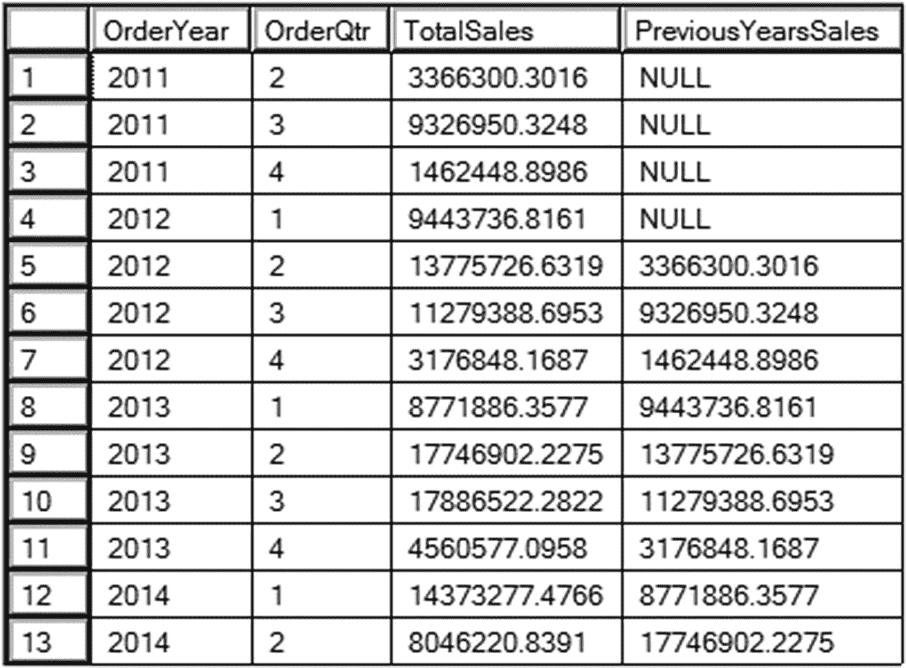
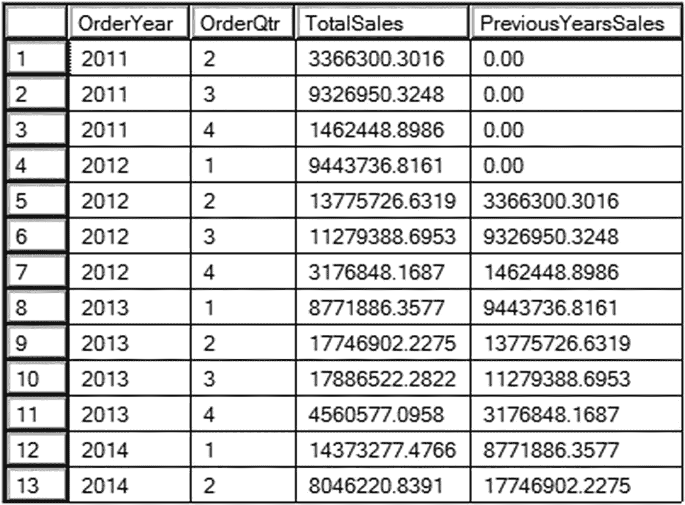
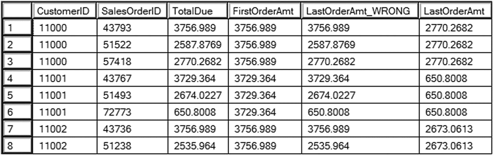
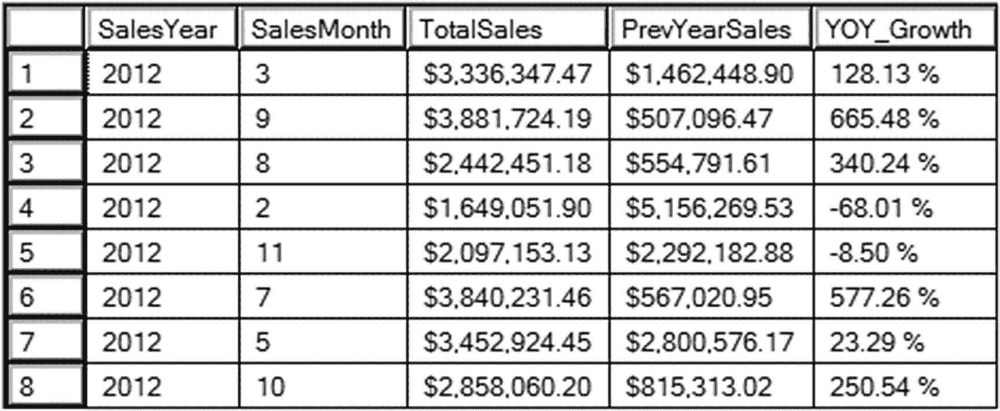
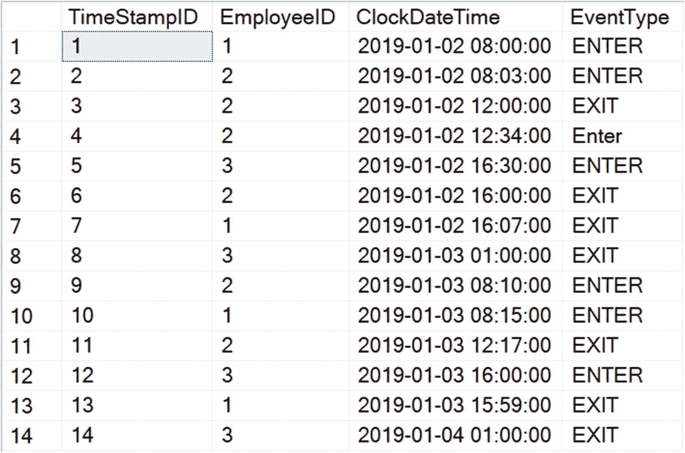
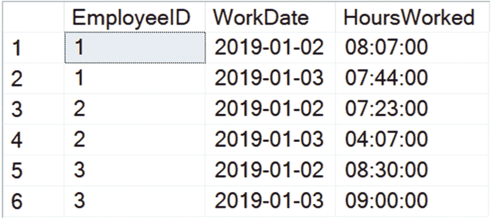

# 6. 瞥见另一行

除了累积窗口聚合，Microsoft 在 SQL Server 2012 中还新增了八个窗口函数。其中四个函数（在本书中我将称之为偏移函数）是我最喜欢的 T-SQL 函数，它们是 `LAG`、`LEAD`、`FIRST_VALUE` 和 `LAST_VALUE`。这些函数让你无需自连接，就能在结果中包含来自其他行的任何列，并且性能极佳。

在本章中，你将学习如何使用 `LAG`、`LEAD`、`FIRST_VALUE` 和 `LAST_VALUE`。你会看到它们是多么容易使用。性能非常出色，但你将在第 8 章中了解到这方面的信息。


## 理解 LAG 和 LEAD

你在第 1 章中已经学习了如何使用 `LAG` 来解决股票市场问题。根据 `OVER` 子句的 `ORDER BY` 表达式，你可以使用 `LAG` 来获取结果集中当前行之前某行的某一列，使用 `LEAD` 来获取当前行之后某行的某一列。`LAG` 和 `LEAD` 不支持框架，因此大多数情况下你无需担心性能问题。分区是可选的，就像其他窗口函数一样，而 `ORDER BY` 是必需的。基本语法如下：

```sql
LAG () OVER([PARTITION BY ] ORDER BY )
LEAD () OVER([PARTITION BY ] ORDER BY )
```

运行列表 6-1 来看看 `LAG` 和 `LEAD` 的实际应用。

```sql
--6-1.1 使用 LAG 和 LEAD
SELECT CustomerID, SalesOrderID, CAST(OrderDate AS DATE) AS OrderDate,
LAG(CAST(OrderDate AS DATE)) OVER(PARTITION BY CustomerID
ORDER BY SalesOrderID) AS PrevOrderDate,
LEAD(CAST(OrderDate AS DATE)) OVER(PARTITION BY CustomerID
ORDER BY SalesOrderID) AS NextOrderDate
FROM Sales.SalesOrderHeader;
--6-1.2 将 LAG 和 LEAD 作为参数使用
SELECT CustomerID, SalesOrderID, CAST(OrderDate AS DATE) AS OrderDate,
DATEDIFF(DAY,LAG(OrderDate)
OVER(PARTITION BY CustomerID ORDER BY SalesOrderID), OrderDate)
AS DaysSincePrevOrder,
DATEDIFF(DAY, OrderDate, LEAD(OrderDate)
OVER(PARTITION BY CustomerID ORDER BY SalesOrderID))
AS DaysUntilNextOrder
FROM Sales.SalesOrderHeader;
```
**列表 6-1**
使用 `LAG` 和 `LEAD`

图 6-1 展示了部分结果。查询 1 使用 `LAG` 和 `LEAD` 函数来查找相对于当前行的前一个和后一个订单日期。函数的参数是转换为 `DATE` 数据类型的 `OrderDate`。就像其他窗口函数一样，`PARTITION BY` 是可选的。在此例中，数据按 `CustomerID` 进行分区。`ORDER BY` 是 `OVER` 子句中非常重要的一部分，它决定了哪一行是前一行，哪一行是后一行。查询 2 的 `OVER` 子句与查询 1 相同，区别在于 `LAG` 和 `LEAD` 表达式被用作 `DATEDIFF` 函数的参数，以计算订单之间的天数。



**图 6-1**
`LAG` 和 `LEAD` 函数的部分结果

请注意结果中有几个 `NULL` 值。第 1 行是分区的第一行，你无法找到更早的行，因此 `PrevOrderDate` 和 `DaysSincePrevOrder` 返回 `NULL`。第 3 行是分区的最后一行，分区中没有第 3 行之后的行，所以第 3 行的 `NextOrderDate` 和 `DaysUntilNextOrder` 为 null。

到目前为止，你已经了解了使用 `LAG` 和 `LEAD` 的默认方式。这两个函数各自有两个可选参数。第一个参数是 `Offset`，默认值为 1。默认情况下，`LEAD` 从当前行之前的一行提取表达式，`LAG` 从当前行之后的一行提取表达式。通过使用 `Offset` 参数，你可以访问距离超过一行的行中的列。关于偏移量需要注意的一个有趣点是，它只允许正整数。使用 `LAG` 时，正数表示“向后”；使用 `LEAD` 时，正数表示“向前”。使用 `Offset` 参数的语法如下：

```sql
LAG( [,]) OVER()
LEAD( [,]) OVER()
```

列表 6-2 演示了如何使用 `Offset` 参数。

```sql
--6-2.1 在 LAG 中使用 Offset
WITH Totals AS (
SELECT YEAR(OrderDate) AS OrderYear,
MONTH(OrderDate)/4 + 1 AS OrderQtr,
SUM(TotalDue) AS TotalSales
FROM Sales.SalesOrderHeader
GROUP BY YEAR(OrderDate), MONTH(OrderDate)/4 + 1)
SELECT OrderYear, Totals.OrderQtr, TotalSales,
LAG(TotalSales, 4) OVER(ORDER BY OrderYear, OrderQtr)
AS PreviousYearsSales
FROM Totals
ORDER BY OrderYear, OrderQtr;
```
**列表 6-2**
在 `LAG` 中使用 `Offset` 参数

图 6-2 展示了结果。在此示例中，总计在一个 CTE 中按年和日历季度进行聚合。日历季度是通过计算月份、除以四再加一得到的。在外部查询中，通过使用偏移量为 4 的 `LAG`，返回了同一季度上一年的销售额。请注意，此方法仅在数据中没有间隔时有效，因为它使用的是物理偏移量，而非逻辑偏移量。为了证明结果的正确性，请将第 8 行（2013 年第一季度）的 `PreviousYearSales` 与第 4 行（2012 年第一季度）的 `TotalSales` 进行比较。



**图 6-2**
在 `LAG` 中使用 `Offset` 的结果

结果的前四行在 `PreviousYearSales` 中返回 `NULL`。这是因为在到达第 5 行之前，没有与当前行相距偏移量 4 的行。如果返回 `NULL` 是个问题，你可以使用第二个可选参数，用默认值替换 `NULL`。要使用第二个参数，你也必须填写第一个参数。语法如下：

```sql
LAG( [,] [,]) OVER()
LEAD( [,] [,]) OVER()
```

列表 6-3 演示了如何使用 `Default` 参数。

```sql
--6-3.1 在 LAG 中使用 Offset 和 Default
WITH Totals AS (
SELECT YEAR(OrderDate) AS OrderYear,
MONTH(OrderDate)/4 + 1 AS OrderQtr,
SUM(TotalDue) AS TotalSales
FROM Sales.SalesOrderHeader
GROUP BY YEAR(OrderDate), MONTH(OrderDate)/4 + 1)
SELECT OrderYear, Totals.OrderQtr, TotalSales,
LAG(TotalSales, 4, 0) OVER(ORDER BY OrderYear, OrderQtr)
AS PreviousYearsSales
FROM Totals
ORDER BY OrderYear, OrderQtr;
```
**列表 6-3**
在 `LAG` 中使用 `Default` 参数

图 6-3 展示了结果。此查询与列表 6-2 中的查询相同，只是增加了 `Default` 参数。`PreviousYearSales` 中的所有 `NULL` 值都被更改为零。当然，你也可以在 `LEAD` 中同时使用 `Offset` 和 `Default`。



**图 6-3**
在 `LAG` 中使用 `Default` 参数的结果


## 理解 `FIRST_VALUE` 和 `LAST_VALUE`

虽然 `LAG` 和 `LEAD` 允许你从距当前行指定行数的任意行中包含任何列，但 `FIRST_VALUE` 和 `LAST_VALUE` 函数让你可以包含分区中第一行或最后一行的任何列。乍一看，这似乎与 `MIN` 和 `MAX` 非常相似，但它们实际上大不相同。用于排序的列不一定是需要提取到结果中的列。第一个值不一定是最小值。这些函数没有任何可选参数，但它们确实支持**框架**。如果你对这个概念不熟悉，请回顾第 5 章以了解更多关于框架的信息。回想一下，默认框架从分区的第一行开始，并包括直到当前行的所有行。这在使用 `LAST_VALUE` 时会导致一个问题。如果你不指定框架，`LAST_VALUE` 会从当前行返回值，而不是从分区的最后一行返回。这是因为在默认框架下，当前行与最后一行是相同的。清单 6-4 演示了如何使用 `FIRST_VALUE` 和 `LAST_VALUE`。

```sql
--6-4.1 使用 FIRST_VALUE 和 LAST_VALUE
SELECT CustomerID, SalesOrderID, TotalDue,
FIRST_VALUE(TotalDue) OVER(PARTITION BY CustomerID
ORDER BY SalesOrderID) AS FirstOrderAmt,
LAST_VALUE(TotalDue) OVER(PARTITION BY CustomerID
ORDER BY SalesOrderID) AS LastOrderAmt_WRONG,
LAST_VALUE(TotalDue) OVER(PARTITION BY CustomerID
ORDER BY SalesOrderID
ROWS BETWEEN CURRENT ROW AND UNBOUNDED FOLLOWING) AS LastOrderAmt
FROM Sales.SalesOrderHeader
ORDER BY CustomerID, SalesOrderID;
```
清单 6-4
使用 `FIRST_VALUE` 和 `LAST_VALUE`

图 6-4 显示了部分结果。窗口按 `CustomerID` 进行分区，并按 `SalesOrderID` 排序。查询本身按 `CustomerID` 和 `SalesOrderID` 排序，以便你可以验证结果。看一下第 2 行。`FirstOrderAmt` 正确地返回了第 1 行的 `TotalDue` 值。`FirstOrderAmt` 的窗口框架是默认的，即从分区开始到当前行的所有行。由于没有为 `LastOrderAmt_WRONG` 指定框架，其框架也是相同的，只到当前行为止。然而，查询的本意是从分区的最后一行提取一个值。为了做到这一点，必须指定框架。`LastOrderAmt` 的表达式包含了正确的框架，因此它确实返回了预期的值。



图 6-4
使用 `FIRST_VALUE` 和 `LAST_VALUE` 的部分结果

新的图形数据库函数 `SHORTEST_PATH` 在不使用 `OVER` 子句的情况下使用了它。阅读这篇文章了解更多：[`https://www.red-gate.com/simple-talk/sql/sql-development/sql-server-2019-graph-database-and-shortest_path/`](https://www.red-gate.com/simple-talk/sql/sql-development/sql-server-2019-graph-database-and-shortest_path/)

## 使用偏移函数解决查询

我最喜欢的 T-SQL 函数一直是 `LAG` 和 `LEAD`。它们不仅易于使用，而且性能也非常出色。你将在第 8 章中了解更多关于偏移函数与其他方法性能比较的内容。在第 1 章中，你已经看到使用 `LAG` 比较收盘价是多么容易。现在你将看到如何使用偏移函数来解决其他一些现实世界的问题。

### 同比增长率计算

同比增长率（YOY）是商业中非常常用的指标。它将一个时期（如月份或季度）与上一年的同一时期进行比较。运行清单 6-5 看看使用 `LAG` 计算这个有多简单。

```sql
--6-5.1 计算同比增长
WITH
Level1 AS (
SELECT YEAR(OrderDate) AS SalesYear,
MONTH(OrderDate) AS SalesMonth,
SUM(TotalDue) AS TotalSales
FROM Sales.SalesOrderHeader
GROUP BY YEAR(OrderDate), MONTH(OrderDate)
),
Level2 AS (
SELECT SalesYear, SalesMonth,TotalSales,
LAG(TotalSales,12) OVER(ORDER BY SalesYear) AS PrevYearSales
FROM Level1)
SELECT SalesYear, SalesMonth,FORMAT(TotalSales,'C') AS TotalSales,
FORMAT(PrevYearSales,'C') AS PrevYearSales,
FORMAT((TotalSales-PrevYearSales)/PrevYearSales,'P') AS YOY_Growth
FROM Level2
WHERE PrevYearSales IS NOT NULL;
```
清单 6-5
使用 `LAG` 计算同比增长

图 6-5 显示了部分结果。为了演示一种循序渐进的方法，这个查询包含了两个 CTE。除了过滤掉 `NULL` 值外，通过两级编写查询也可以得到相同的结果，但我认为这种方法更容易理解。第一个 CTE `Level1` 创建了一个按年和月列出的销售清单。`Level2` 添加了使用 `LAG` 的表达式来计算上一年同一月份的销售额。最后，在外部查询中，通过从当前销售额中减去上一年的销售额，再除以上一年的销售额，来执行同比增长计算。`FORMAT` 函数用于将结果转换为百分比格式。无法与上一行进行比较的行从外部查询中过滤掉了。



图 6-5
计算同比增长的部分结果


### 考勤卡问题

此问题涉及员工每日上下班的考勤卡记录。目标是计算每位员工每个班次的工作时长。列表 6-6 包含了创建临时表并显示初始行的语句。

```sql
--6-6.1 创建表
DROP TABLE IF EXISTS #TimeCards;
CREATE TABLE #TimeCards(
TimeStampID INT NOT NULL IDENTITY PRIMARY KEY,
EmployeeID INT NOT NULL,
ClockDateTime DATETIME2(0) NOT NULL,
EventType VARCHAR(5) NOT NULL);
--6-6.2 插入数据
INSERT INTO #TimeCards(EmployeeID,
ClockDateTime, EventType)
VALUES
(1,'2019-01-02 08:00','ENTER'),
(2,'2019-01-02 08:03','ENTER'),
(2,'2019-01-02 12:00','EXIT'),
(2,'2019-01-02 12:34','Enter'),
(3,'2019-01-02 16:30','ENTER'),
(2,'2019-01-02 16:00','EXIT'),
(1,'2019-01-02 16:07','EXIT'),
(3,'2019-01-03 01:00','EXIT'),
(2,'2019-01-03 08:10','ENTER'),
(1,'2019-01-03 08:15','ENTER'),
(2,'2019-01-03 12:17','EXIT'),
(3,'2019-01-03 16:00','ENTER'),
(1,'2019-01-03 15:59','EXIT'),
(3,'2019-01-04 01:00','EXIT');
--6-6.2 显示行
SELECT TimeStampID, EmployeeID, ClockDateTime, EventType
FROM #TimeCards;
```

列表 6-6: 创建并填充 `#TimeCard` 表

图 6-6 展示了此问题的行数据。请注意，每一个 `ENTER` 行都有一个匹配的 `EXIT` 行。



图 6-6: 考勤卡行数据

使用 `LEAD` 函数可以轻松解决此问题。列表 6-7 展示了解决方案。

```sql
WITH Level1 AS (
SELECT EmployeeID, EventType, ClockDateTime,
LEAD(ClockDateTime) OVER(PARTITION BY EmployeeID ORDER BY ClockDateTime)
AS NextDateTime
FROM #TimeCards
),
Level2 AS (
SELECT EmployeeID, CAST(ClockDateTime AS DATE) AS WorkDate,
SUM(DATEDIFF(second, ClockDateTime,NextDateTime)) AS Seconds
FROM Level1
WHERE EventType = 'Enter'
GROUP BY EmployeeID, CAST(ClockDateTime AS DATE))
SELECT EmployeeID, WorkDate,
TIMEFROMPARTS(Seconds / 3600, Seconds % 3600 / 60,
Seconds % 3600 % 60, 0, 0) AS HoursWorked
FROM Level2
ORDER BY EmployeeID, WorkDate;
```

列表 6-7: 考勤卡问题的解决方案

该解决方案被拆分开以便于理解。第一个公共表表达式 `Level1` 使用 `LEAD` 函数来查找下一行的 `ClockDateTime`。计算了两行之间的时间差（秒数），并排除了 `Exit` 行。在该层级也对秒数进行了汇总，以防员工有午休打卡的情况。主查询使用 `TIMEFROMPARTS` 函数将秒数转换为“小时:分钟”格式。图 6-7 展示了结果。



图 6-7: 考勤卡问题的结果

## 小结

自 SQL Server 2012 起可用的偏移函数 `LAG`、`LEAD`、`FIRST_VALUE` 和 `LAST_VALUE` 功能非常强大。它们不仅使编写从不同行提取值的查询变得容易，而且性能也非常出色，你将在第 8 章亲身体会到。

还有一组函数需要学习，即统计函数。第 7 章将教你掌握利用这些窗口函数所需的知识。

