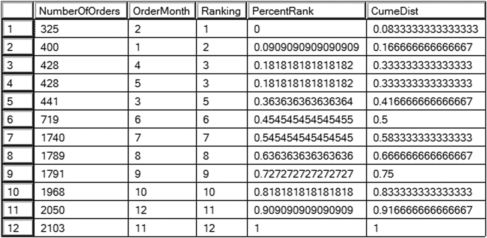
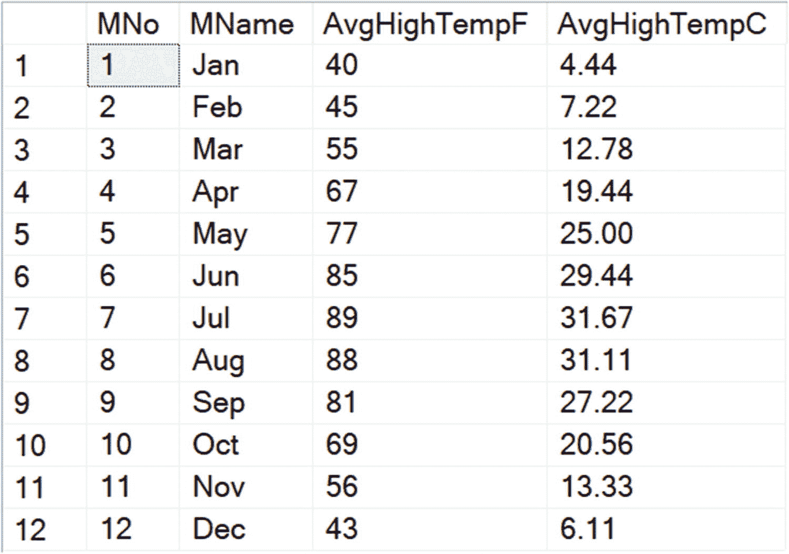
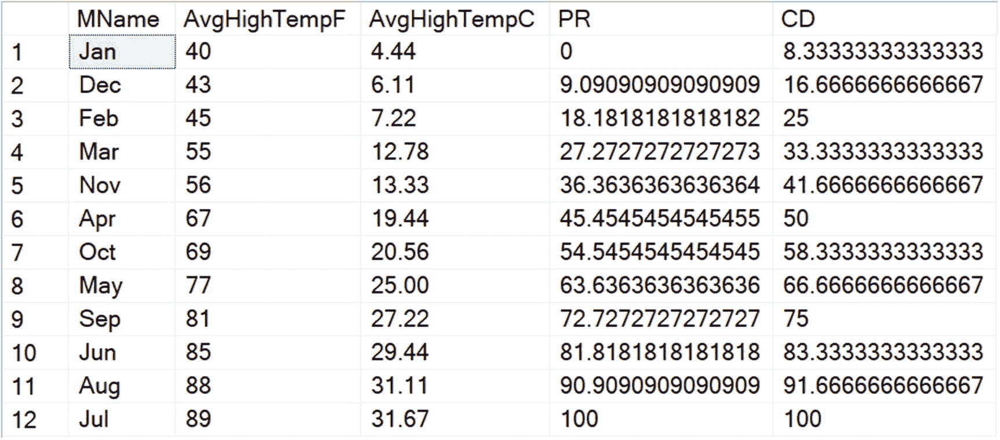
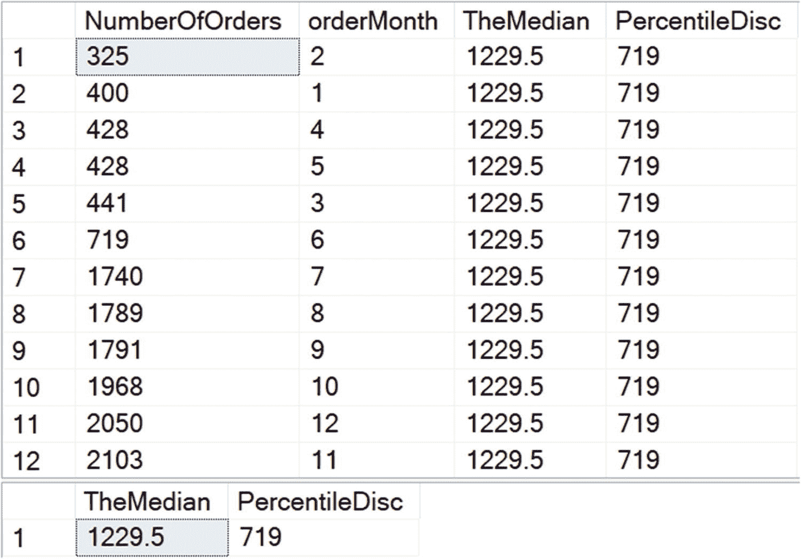
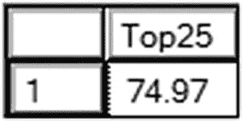
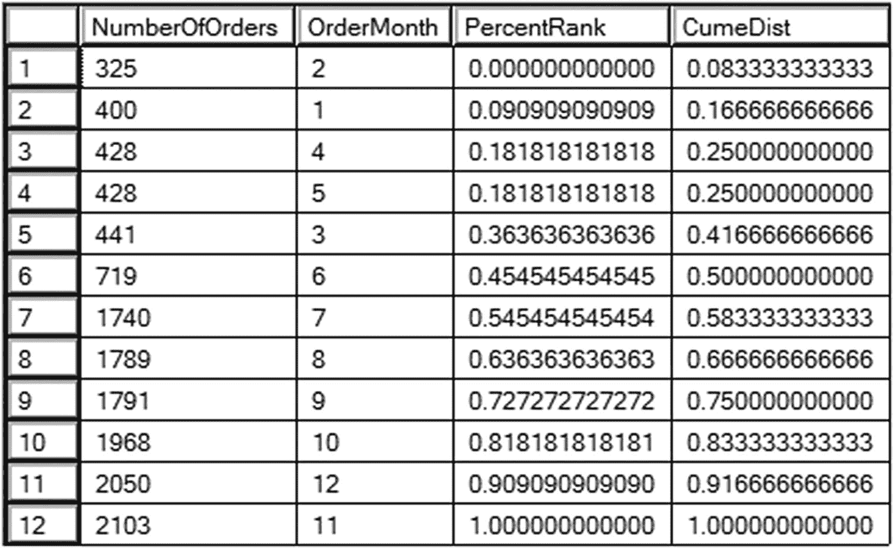
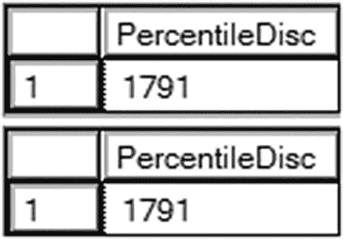
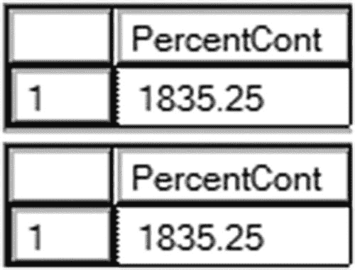

# 7. 理解统计函数

2012 年，微软为 SQL Server 新增了四个窗口函数。它们是统计函数 `PERCENT_RANK`、`CUME_DIST`、`PERCENTILE_CONT` 和 `PERCENTILE_DISC`。这些函数使得分析来自科学、学术或体育等众多领域的数据变得容易。

在本章中，你将学习如何使用这些统计函数。

## 使用 PERCENT_RANK 和 CUME_DIST

还记得你在学校参加的那些标准化考试吗？你可能会得到每个测试领域（如数学或语言技能）的原始分数和百分比。百分比排名是一种计算群体中每个个体与其他人相比情况的方法。

从 SQL Server 2012 开始，有两个函数可以对数据（如考试成绩，甚至身高）进行排名。假设有 100 名七年级学生按身高排队。我的孙子托马斯是个相当高的男孩，所以他可能会站在第 95 位。他比其他 94 名学生都高。他的身高高于 94% 的身高，并且高于或等于 95% 的身高。托马斯身高的 `PERCENT_RANK` 是 0.9494，`CUME_DIST`（累积分布）是 0.95。

你可能会疑惑为什么 `PERCENT_RANK` 是 0.9494 而不是 0.94。`PERCENT_RANK` 的公式是：（排名值 - 1）除以（总数 - 1）：`(rank-1)/(N-1)`。`CUME_DIST` 的公式是：排名值除以总数：`rank/N`。托马斯身高的 `PERCENT_RANK` 可以通过 94 除以 99 得到，而不是 94 除以 100。

就像所有其他窗口函数一样，使用这些函数时需要 `OVER` 子句。它必须包含一个 `ORDER BY` 表达式，用于确定分数或值的排列顺序。`PARTITION BY` 表达式是可选的。如果使用，则比较将在分区内进行，而不是跨分区。语法如下：

```sql
PERCENT_RANK OVER([PARTITION BY <partition_column>] ORDER BY <order_column>)
CUME_DIST OVER([PARTITION BY <partition_column>] ORDER BY <order_column>)
```

列表 7-1 演示了如何使用这些函数来比较给定年份中每个月的销售额。

```sql
--7-1.1 使用 PERCENT_RANK 和 CUME_DIST
SELECT COUNT(*) NumberOfOrders, Month(OrderDate) AS OrderMonth,
RANK() OVER(ORDER BY COUNT(*)) AS Ranking,
PERCENT_RANK() OVER(ORDER BY COUNT(*)) AS PercentRank,
CUME_DIST() OVER(ORDER BY COUNT(*)) AS CumeDist
FROM Sales.SalesOrderHeader
WHERE OrderDate >= '2013-01-01' AND OrderDate < '2014-01-01'
GROUP BY  Month(OrderDate);
```

列表 7-1: 使用 PERCENT_RANK 和 CUME_DIST

图 7-1 展示了结果。该查询经过筛选，仅包含 2013 年的订单，并按月份分组。每个函数的 `ORDER BY` 表达式都是订单数量。回想一下，当你在聚合查询中使用窗口函数时，函数中使用的任何列都必须遵循 `SELECT` 列表的规则。有关在聚合查询中添加窗口函数的更多信息，请参见第 3 章。第一行的 `PercentRank` 是 0。第一行的 `PercentRank` 值始终为 0，因为该行未排在任何其他行之上。最后一行的 `PercentRank` 和 `CumeDist` 都将是 1，即 100%。除最后一行外的所有行中，`CumeDist` 都大于 `PercentRank`。请注意，当出现并列情况时（如第 3 和第 4 行），值会重复。



图 7-1: 使用 PERCENT_RANK 和 CUME_DIST 的结果

这是另一个比较我居住的圣路易斯大都会区月平均最高气温的例子。运行列表 7-2 以创建并填充表格。

```sql
--7-2.1 创建表
CREATE TABLE #MonthlyTempsStl(MNo Int, MName varchar(15), AvgHighTempF INT, AvgHighTempC DECIMAL(4,2));
--7-2.2 插入华氏温度行
INSERT INTO #MonthlyTempsStl (Mno, Mname, AvgHighTempF)
VALUES(1,'Jan',40),(2,'Feb',45),(3,'Mar',55),(4,'Apr',67),(5,'May',77),(6,'Jun',85),
(7,'Jul',89),(8,'Aug',88),(9,'Sep',81),(10,'Oct',69),(11,'Nov',56),(12,'Dec',43);
--7-2.3 计算摄氏温度
UPDATE #MonthlyTempsStl
SET AvgHighTempC = (AvgHighTempF - 32) * 5.0/9;
--7-2.4 返回结果
SELECT * FROM #MonthlyTempsStl;
```

列表 7-2: 圣路易斯平均最高气温


图 7-2 展示了表中的行。

图 7-2 平均月最高温度

清单 7-3 返回了温度的百分比排名和累积分布。
```
--7-3.1 对温度进行排名
SELECT MName, AvgHighTempF, AvgHighTempC,
PERCENT_RANK() OVER(ORDER BY AvgHighTempF) * 100.0 AS PR,
CUME_DIST() OVER(ORDER BY AvgHighTempF) * 100.0 AS CD
FROM #MonthlyTempsStl;
```
清单 7-3 对温度进行排名

图 7-3 展示了结果。一月是最冷的月份，而七月是最热的。就像第一个例子一样，百分比排名和累积分布在七月都达到了 100。

图 7-3 排名后的温度

## 使用 PERCENTILE_CONT 和 PERCENTILE_DISC

你已经了解了如何使用 `PERCENT_RANK()` 和 `CUME_DIST()` 对一系列值进行排名和比较。另外两个统计函数 `PERCENTILE_CONT()`（百分位连续值）和 `PERCENTILE_DISC()`（百分位离散值）则执行相反的任务。给定一个百分比排名，这些函数会找到该位置的值。这两个函数的区别在于，`PERCENTILE_CONT()` 会在数据集上插值计算出一个值，而 `PERCENTILE_DISC()` 会从数据集中返回一个精确的值。

一个非常常见的需求是找到一组值的中位数或中间值。你可以通过使用 `PERCENTILE_CONT()` 并指定希望找到 50% 位置的值来完成此任务。

这些函数的语法与其他窗口函数也略有不同。你仍然需要提供一个 `OVER` 子句，但在 `OVER` 子句内部，你只需在需要时指定 `PARTITION BY` 表达式。

`ORDER BY` 不再放在 `OVER` 子句中，而是放在一个名为 `WITHIN GROUP` 的新子句中。`WITHIN GROUP` 子句必须返回一个数字列表。回想一下，其他函数的 `OVER` 子句中的 `ORDER BY` 是用来对行进行排序的，但在这里，`WITHIN GROUP` 表达式才是要操作的数字列表。`ORDER BY` 必须只包含一个表达式，并且计算结果为数值类型，如 `INT` 或 `DECIMAL`。

语法如下：
```
PERCENTILE_CONT() WITHIN GROUP(ORDER BY )
OVER([PARTITION BY ])
PERCENTILE_DISC() WITHIN GROUP(ORDER BY )
OVER([PARTITION BY ])
```

对于上一节图 7-1 中所示的结果，中位数是多少？由于返回的是偶数行，中位数是 719 和 1740 的平均值，即 1229.5。清单 7-4 演示了如何使用 `PERCENTILE_CONT()` 计算中位数。同时也展示了 `PERCENTILE_DISC()`，但由于行数是偶数，它返回的不是中位数。结果会在每一行上返回；如果你只想看到答案，请使用 `DISTINCT`。
```
--7-4.1 查找集合的中位数
SELECT COUNT(*) NumberOfOrders, Month(OrderDate) AS orderMonth,
PERCENTILE_CONT(.5) WITHIN GROUP (ORDER BY COUNT(*))
OVER() AS TheMedian,
PERCENTILE_DISC(.5) WITHIN GROUP (ORDER BY COUNT(*))
OVER() AS PercentileDisc
FROM Sales.SalesOrderHeader
WHERE OrderDate >= '2013-01-01' AND OrderDate < '2014-01-01'
GROUP BY Month(OrderDate);
```
清单 7-4 使用 PERCENTILE_CONT 查找中位数

结果如图 7-4 所示。查询 1 显示了全年的计数和月份，以及 `TheMedian` 和 `PercentileDisc`。由于集合中每一行的答案都相同，所以这些值在每一行上都是一样的。查询 2 去掉了计数和月份，并使用了 `DISTINCT`，因此只返回答案。请注意，`PERCENTILE_CONT()` 通过对两个中间值取平均值来进行插值计算，从而得出真正的中位数。然而，`PERCENTILE_DISC()` 返回的值是 719。这是集合中的一个实际值。如果值的数量是偶数，那么当要计算的百分位为 0.5 时，此函数将返回最接近中位数的第一个值。

图 7-4 查找中位数

当行数为奇数时，在这种情况下，这两个函数将返回相同的值。清单 7-5 通过过滤掉一个月来展示当行数为奇数时会发生什么。
```
--7-5.1 过滤掉一月份
SELECT  DISTINCT PERCENTILE_CONT(.5) WITHIN GROUP (ORDER BY COUNT(*))
OVER() AS TheMedian,
PERCENTILE_DISC(.5) WITHIN GROUP (ORDER BY COUNT(*))
OVER() AS PercentileDisc
FROM Sales.SalesOrderHeader
WHERE OrderDate >= '2013-02-01' AND OrderDate < '2014-01-01'
GROUP BY Month(OrderDate);
```
清单 7-5 在行数为奇数时查找中位数

图 7-5 展示了结果。在这种情况下，由于行数是奇数，两个函数返回相同的值。

图 7-5 行数为奇数时，两个函数返回相同的值

虽然寻找中位数是这些函数一个有趣的应用，但你也可以用它们来查找任何其他百分比排名位置的值。一个有用的应用是返回前 25% 位置的值。清单 7-6 创建并填充了一个包含学生成绩的 `#scores` 表，并返回了在前 25% 位置找到的分数。
```
--7-6.1 设置表
CREATE TABLE #scores(StudentID INT IDENTITY, Score DECIMAL(5,2));
--7-6.2
--使用 Itzik 风格的数字表插入分数
WITH lv0 AS (SELECT 0 g UNION ALL SELECT 0)
,lv1 AS (SELECT 0 g FROM lv0 a CROSS JOIN lv0 b)
,lv2 AS (SELECT 0 g FROM lv1 a CROSS JOIN lv1 b)
,lv3 AS (SELECT 0 g FROM lv2 a CROSS JOIN lv2 b)
,lv4 AS (SELECT 0 g FROM lv3 a CROSS JOIN lv3 b)
,Tally (n) AS (SELECT ROW_NUMBER() OVER (ORDER BY (SELECT NULL))
FROM lv4)
INSERT INTO #scores(Score)
SELECT TOP(1000) CAST(RAND(CHECKSUM(NEWID())) * 100 as DECIMAL(5,2)) AS Score
FROM Tally;
--7-6.3 返回前 25% 位置的分数
SELECT DISTINCT PERCENTILE_DISC(.25) WITHIN GROUP
(ORDER BY Score DESC) OVER() AS Top25
FROM #scores;
```
清单 7-6 查找前 25% 位置的分数

图 7-6 展示了结果。当然，你的结果会有所不同，因为分数是随机生成的。在设置好变量和表之后，插入了 1,000 行带有随机值的记录。查询 3 通过使用 `PERCENTILE_DISC()` 0.25 并按分数降序排序，返回了前 25% 位置的分数。

图 7-6 前 25% 位置的分数


## 比较统计函数与旧方法

函数 `PERCENT_RANK` 和 `CUME_DIST` 主要提供了一种便利性，而非像你在第 6 章学到的偏移函数那样的惊人突破。通过在一个简单计算中使用 `RANK` 函数，你也可以得出相同的答案。公式如下：

```
PERCENT_RANK = (排名 – 1)/(N – 1)
CUME_DIST = 排名/N
```

代码清单 7-7 演示了如何使用 SQL Server 2005 的功能得到与代码清单 7-1 相同的结果。

```
--7-7.1 使用 2005 功能
SELECT COUNT(*) NumberOfOrders, Month(OrderDate) AS OrderMonth,
((RANK() OVER(ORDER BY COUNT(*)) -1) * 1.0)/(COUNT(*) OVER() -1)
AS PercentRank,
(RANK() OVER(ORDER BY COUNT(*)) * 1.0)/COUNT(*) OVER()
AS CumeDist
FROM Sales.SalesOrderHeader
WHERE OrderDate >= '2013-01-01' AND OrderDate < '2014-01-01'
GROUP BY  Month(OrderDate);
代码清单 7-7
使用 SQL Server 2005 功能获得相同结果
```

图 7-7 展示了结果。除了零被填充到 12 位之外，结果看起来是一样的。在此示例中，使用了窗口聚合函数 `COUNT(*) OVER` 来计算分区中的行数。对于 `PercentRank`，在相除之前，排名和计数都减去了 1。


图 7-7
使用旧方法计算百分比的结果

对于 `PERCENTILE_CONT` 和 `PERCENTILE_DISC` 函数，是否可以使用旧方法呢？`PERCENTILE_DISC` 并不困难，因为它总是返回集合中的一个实际值。代码清单 7-8 展示了如何仅使用 2005 功能来计算 `PERCENTILE_DISC`。

```
--7-8.1 PERCENTILE_DISC
WITH Level1 AS (
SELECT DISTINCT Month(OrderDate) AS OrderMonth, 
COUNT(*) AS NumberOfOrders,
PERCENT_RANK() OVER(ORDER BY COUNT(*)) AS PercentRank
FROM Sales.SalesOrderHeader
WHERE OrderDate >= '2013-01-01' AND OrderDate < '2014-01-01'
GROUP BY  Month(OrderDate))
SELECT TOP(1) NumberOfOrders AS PercentileDisc
FROM Level1
WHERE Level1.PercentRank <= 0.75
ORDER BY Level1.PercentRank DESC;
代码清单 7-8
仅使用 SQL Server 2005 功能计算 PERCENTILE_DISC
```

图 7-8 展示了结果。查询 1 使用了新功能，以便与旧方法进行比较。查询 2 将计算百分比排名的查询移动到一个名为 `Level1` 的 CTE 中。在外层查询中，返回了一行百分比排名等于或小于 0.75 的数据。


图 7-8
使用旧方法计算 PERCENTILE_DISC 的结果

对 `PERCENTILE_CONT` 实现相同的目的则更为棘手，但仍可实现。在这种情况下，当确切行不可用时，会使用给定百分比排名之上和之下的一个值来计算一个值。尝试找到中位数时，你只需对两行取平均值，但在尝试找到任何其他百分比排名时则不然。代码清单 7-9 展示了解决方案。

```
--7-9.1 PERCENTILE_CONT
WITH Level1 AS (
SELECT DISTINCT Month(OrderDate) AS OrderMonth, 
COUNT(*) AS NumberOfOrders,
PERCENTILE_CONT(0.75) WITHIN GROUP (ORDER BY COUNT(*)) OVER() AS PercentCont,
PERCENT_RANK() OVER(ORDER BY COUNT(*)) AS PercentRank,
ROW_NUMBER() OVER(ORDER BY COUNT(*)) AS RowNum,
0.75 * (COUNT(*) OVER() - 1) + 1 AS TheRow
FROM Sales.SalesOrderHeader
WHERE OrderDate >= '2013-01-01' AND OrderDate < '2014-01-01'
GROUP BY Month(OrderDate)),
Level2 AS (
SELECT RowNum, NumberOfOrders,
FLOOR(TheRow) AS TheBottomRow,
CEILING(TheRow) AS TheTopRow,
TheRow
FROM Level1 ),
Level3 AS (
SELECT SUM(CASE WHEN RowNum = TheBottomRow THEN NumberOfOrders END) AS BottomValue,
SUM(CASE WHEN RowNum = TheTopRow THEN NumberOfOrders END) AS TopValue,
MAX(TheRow % Level2.TheBottomRow) AS Diff
FROM Level2)
SELECT Level3.BottomValue +
(Level3.TopValue - Level3.BottomValue) * Diff
FROM Level3;
代码清单 7-9
使用 SQL Server 2005 功能查找 PERCENTILE_CONT
```

图 7-9 展示了结果。查询 1 使用了 `PERCENTILE_CONT` 函数，以便与旧方法进行比较。`Level1` CTE 包含一个查询，列出了每个月的行号和订单计数。它还计算出如果列表中存在确切值，哪一行会包含该值，即 `TheRow`。在此例中，该行是 9.25。在 `Level2` 中，使用 `FLOOR` 函数找到 `TheRow` 之下的一行(9)，使用 `CEILING` 函数找到 `TheRow` 之上的一行(10)。在 `Level3` 中，找到了两行的值以及一个乘数 MP。MP 是 `TheRow` 的小数部分(0.25)。代码通过执行取模运算(9.25 % 9)找到它。外层查询将两行之间的差值乘以 MP 后，加到底行的值上。呼！


图 7-9
将 PERCENTILE_CONT 与旧方法进行比较

## 小结

既然你已经见识了统计函数 `PERCENT_RANK`、`CUME_DIST`、`PERCENTILE_DISC` 和 `PERCENTILE_CONT`，那么你已使用了 SQL Server 2012 至 2019 版可用的所有窗口函数。在第 8 章中，你将学习使用所有窗口函数时的性能考量。

