# 8. 为获得更佳性能进行调优

微软一直宣传窗口函数比旧技术具有更好的性能。在许多情况下，这是事实，但在我看来，最大的优势是这些函数让解决棘手的查询变得更容易。在某些情况下，它们替代了游标、临时表和三角连接。甚至在考虑性能之前，它们就是非常强大的工具。

然而，在使用窗口函数时，为了确保查询运行得尽可能快，有些事情你需要了解。自 2012 年以来，微软没有添加任何新功能，但在最近的版本中，它对查询处理进行了一些更改，这些更改直接影响窗口函数的性能。

在本章中，你将学习在执行计划中需要关注什么，瓶颈在哪里，以及如何创建索引来帮助任何使用窗口函数的查询。你还将学习窗口函数与使用旧方法相比如何，以及何时使用旧方法可能是个好主意。

## 使用执行计划

图形化执行计划让 T-SQL 查询的调优变得更加容易。您可以比较多个查询的性能，并寻找查询内部的瓶颈。如果您对图形化执行计划还不熟悉，可以阅读 Grant Fritchey 所著的*《SQL Server 2017 查询性能调优》*（Apress，2018），或者直接跟随本文了解您能学到什么。

多年来，数据库专业人员一直使用 SQL Server Management Studio (`SSMS`) 来运行查询。自本书第一版以来，微软不仅更新了图形化执行计划中使用的图标，最近还引入了一个新的跨平台工具——Azure Data Studio (`ADS`)，其执行计划的外观有所不同。要看到差异，可以在 `SSMS` 和 `ADS` 中分别运行清单 8-1 中的简单查询。在 `SSMS` 中运行查询前，请务必键入 `CTRL + M` 以开启执行计划。在 `ADS` 中，运行查询后只需点击 `Explain` 即可。

```
--8-1.1 一个简单查询
SELECT *
FROM HumanResources.Employee;
清单 8-1
要运行的简单查询
```

图 8-1 展示了这两个执行计划。

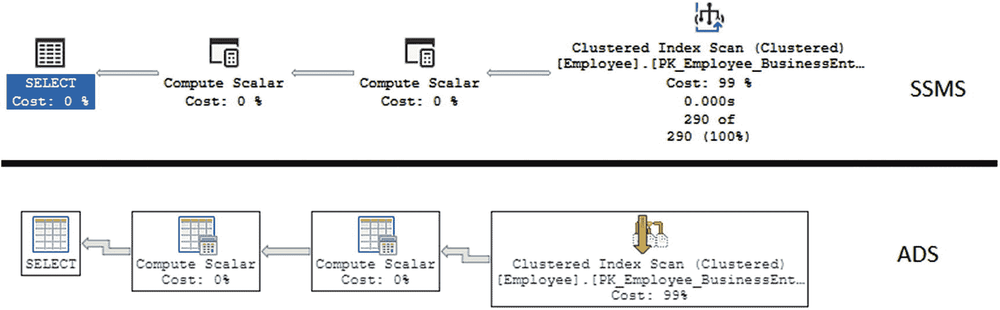
图 8-1：来自 `SSMS` 和 `ADS` 的图形化执行计划

本章将展示由 `SSMS` 18 版本生成的执行计划。要跟随操作，请确保本章所有示例都切换开启了实际执行计划。

有一个专门用于窗口函数的执行操作符；它是 `Sequence Project (Compute Scalar)` 操作符，如图 8-2 所示。这个操作符无需担心。它只是意味着计算所需的列已被添加到结果中。您会在包含某些窗口函数的查询执行计划中看到它，但并非所有情况都会出现。要查看该计划，请运行清单 8-2。

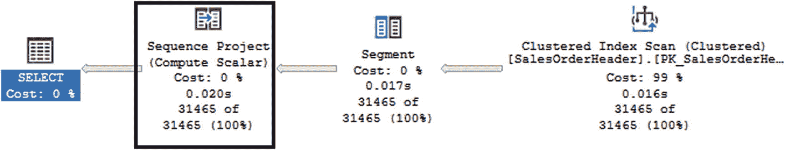
图 8-2：包含 `Sequence Project (Compute Scalar)` 操作符的执行计划

```
--8-2.1 生成 Sequence Project (Compute Scalar) 操作符的查询
SELECT CustomerID, ROW_NUMBER() OVER(ORDER BY SalesOrderID) AS RowNumber
FROM Sales.SalesOrderHeader;
清单 8-2
查看 Sequence Project 操作符 (Compute Scalar)
```

另一个在窗口函数查询中常见的操作符是 `Segment` 操作符，同样显示在图 8-2 中 `Sequence Project (Compute Scalar)` 操作符的右侧。`Segment` 操作符将输入划分为段或组。如果没有 `PARTITION BY` 表达式，那么段将是整个结果集。否则，段将根据 `PARTITION BY` 表达式进行划分。通过打开 `Segment` 操作符的属性，您会看到 `Group By` 属性是空白的。图 8-3 展示了这一点。

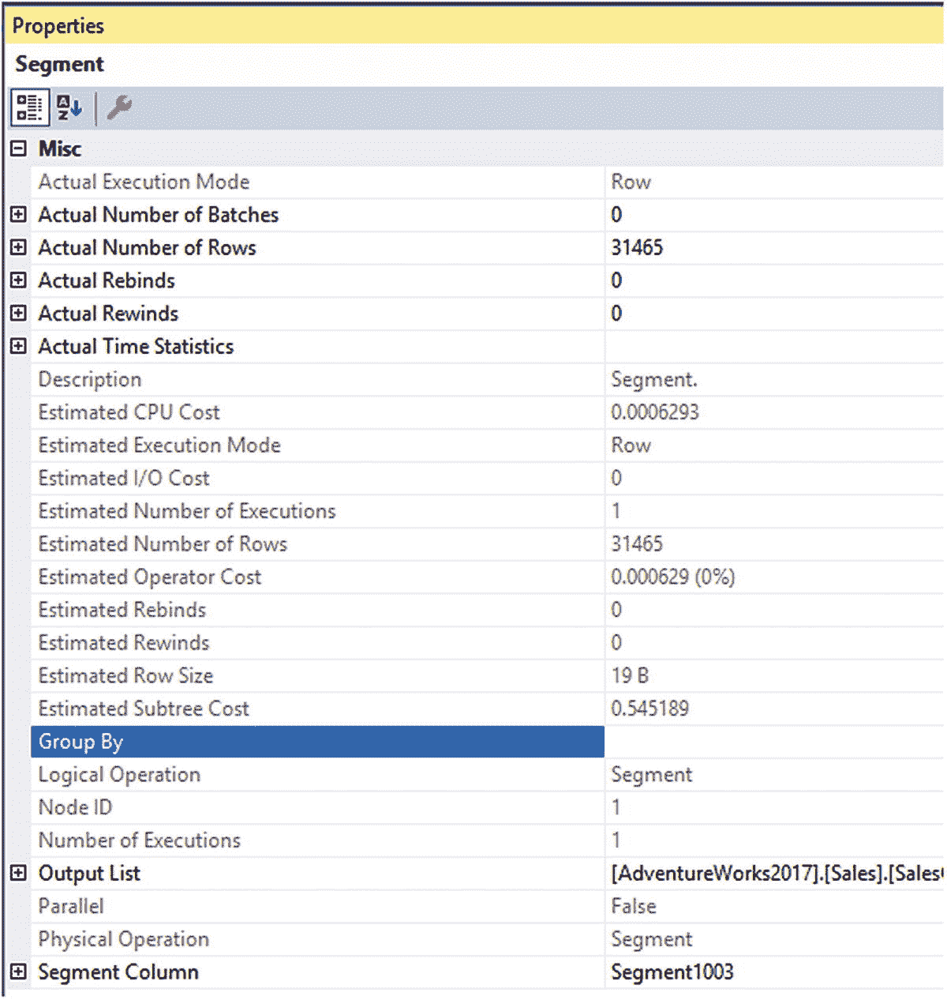
图 8-3：`Segment` 操作符的 `Group By` 属性

如果您通过添加 `PARTITION BY` 来修改查询，如清单 8-3 所示，`Group By` 属性就会显示 `PARTITION BY` 的列。

```
--8-3.1 添加 PARTITION BY
SELECT CustomerID,
ROW_NUMBER() OVER(PARTITION BY CustomerID ORDER BY SalesOrderID) AS RowNumber
FROM Sales.SalesOrderHeader;
清单 8-3
添加 PARTITION BY
```

图 8-4 显示了属性如何变化。

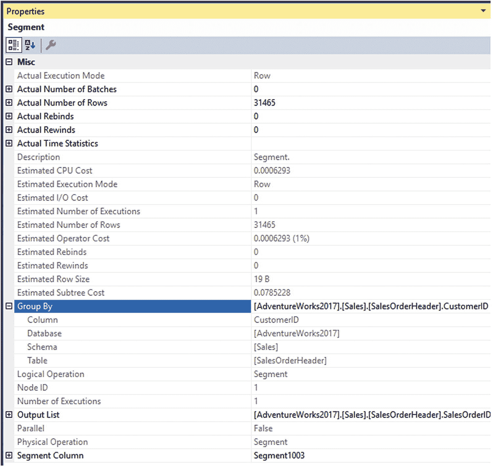
图 8-4：添加分区后的 `Group By` 属性

在调优查询时，`Sequence Project (Compute Scalar)` 和 `Segment` 操作符无需担心。需要注意且您可以采取措施的操作符是 `Sort` 操作符，如图 8-5 所示。`Sort` 操作符出现在多种查询中，并且常常是窗口函数查询中的瓶颈。要查看该计划，请运行清单 8-4。

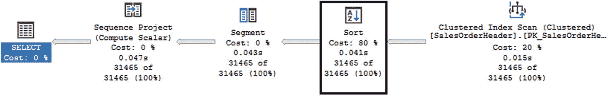
图 8-5：包含 `Sort` 操作符的执行计划

```
--8-4.1 展示 Sort 操作符的查询
SELECT CustomerID, SalesOrderID,
ROW_NUMBER() OVER(PARTITION BY CustomerID ORDER BY OrderDate) AS RowNumber
FROM Sales.SalesOrderHeader;
清单 8-4
包含 Sort 操作符的查询
```

请注意，即使执行了聚集索引扫描，`Sort` 操作符也占用了运行该查询所用资源的 80%。本章稍后将介绍如何创建索引以在许多情况下消除 `Sort`。

还有两个操作符需要注意。看一下图 8-6 中的 `Table Spool` 操作符。运行清单 8-5 来亲自生成该计划。

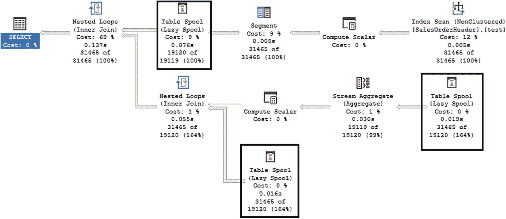
图 8-6：包含 `Table Spool` 操作符的执行计划

```
--8-5.1 包含 Table Spool 操作符的查询
SELECT CustomerID, SalesOrderID, SUM(TotalDue)
OVER(PARTITION BY CustomerID) AS SubTotal
FROM Sales.SalesOrderHeader;
清单 8-5
包含 Table Spool 操作符的查询
```

`Table Spool` 操作符意味着在 `tempdb` 中创建了一个工作表来帮助解决查询。您会在窗口聚合和一些其他窗口函数中看到 `Table Spool` 操作符。这个工作表会消耗大量资源，包括锁，但如果您使用的是 SQL Server 2019，则有个好消息，本章稍后会介绍。

另一个需要注意的操作符是 `Window Spool` 操作符，它与之类似，但*有时*会在内存中创建工作表。运行清单 8-6 以查看图 8-7 所示的计划。

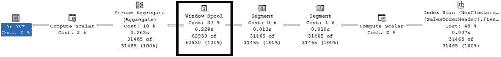
图 8-7：包含 `Window Spool` 操作符的计划

```
--8-6.1 包含窗口假脱机操作符的查询
SELECT CustomerID, SalesOrderID, TotalDue,
SUM(TotalDue) OVER(PARTITION BY CustomerID ORDER BY SalesOrderID) AS RunningTotal
FROM Sales.SalesOrderHeader;
清单 8-6
包含 Window Spool 操作符的查询
```

`Window Spool` 操作符理论上意味着工作表在内存中创建，但在某些情况下，它会在 `tempdb` 中创建。区别将在本章后面介绍。与 `Table Spool` 操作符一样，此操作符在 2019 版本中也有一些性能改进。

## 使用 STATISTICS IO

另一个理解查询性能的实用工具是 `STATISTICS IO`。该设置将提供运行查询时所读取页面的信息。其优点在于，无论服务器上是否有其他查询在运行，或者数据是否已在缓存中，结果都是一致的。如果缓存是“热的”，即所需数据已在内存中，查询通常会运行得更快，你可能会误以为是自己做了优化。只要查询、索引、数据或设置没有改变，返回的逻辑读数（读取的数据页数量）将保持一致。这使其成为比较两个查询或判断新索引是否有效的绝佳工具。我喜欢同时使用执行计划和 `STATISTICS IO` 来确保我理解正在发生的情况。

运行清单 8-7 来查看上一节中的查询如何比较。虽然这些查询产生的结果不同，但从性能角度观察它们之间的差异仍然很有趣。请注意，数据库兼容性模式已设置为 2014 版本。

```
--8-7.0 设置
USE [master];
GO
--根据需要更改数据库名称
ALTER DATABASE [AdventureWorks]
SET COMPATIBILITY_LEVEL = 120;
GO
USE [AdventureWorks];
SET STATISTICS IO ON;
SET NOCOUNT ON;
GO
--8-7.1 产生序列项目的查询
PRINT '8-7.1';
SELECT CustomerID, ROW_NUMBER() OVER(ORDER BY SalesOrderID) AS RowNumber
FROM Sales.SalesOrderHeader;
--8-7.2 显示排序运算符的查询
PRINT '8-7.2';
SELECT CustomerID, SalesOrderID,
ROW_NUMBER() OVER(PARTITION BY CustomerID ORDER BY OrderDate) AS RowNumber
FROM Sales.SalesOrderHeader;
--8-7.3 带有表假脱机运算符的查询
PRINT '8-7.3';
SELECT CustomerID, SalesOrderID, SUM(TotalDue) OVER(PARTITION BY CustomerID)
AS SubTotal
FROM Sales.SalesOrderHeader;
清单 8-7
使用 STATISTICS IO
```

图 8-8 显示了由 `STATISTICS IO` 设置在消息选项卡中产生的结果。代码清单首先开启 `STATISTICS IO` 并关闭行计数。在每个查询之前，一个 `PRINT` 语句会打印查询编号，以便你知道哪些信息对应哪个查询。

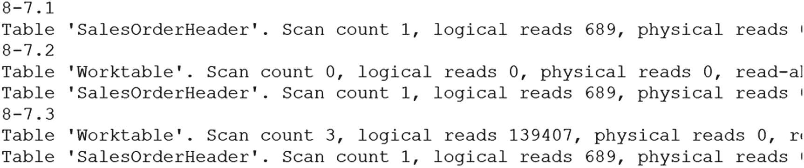

图 8-8
查询的 STATISTICS IO 输出

最有用的信息来自 `logical reads`（逻辑读），即读取的页数。查询 1 和查询 2 各需要 689 次 `logical reads`。这大约是 `Sales.SalesOrderHeader` 表聚集索引中的页数。如果你回顾图 8-1，你会看到执行了聚集索引扫描。使用窗口聚合的查询 3 也需要 689 次 `logical reads` 来扫描聚集索引，但它还在 `tempdb` 中创建了一个工作表。它使用了 139,407 次 `logical reads` 来通过工作表执行计算。

在执行计划显示相同成本但查询运行时间不同的情况下，使用 `STATISTICS IO` 非常有益。在调优查询时，我总是同时使用这两个工具。

## 通过索引提升窗口函数性能

排序通常是带有窗口函数的查询的瓶颈。你看到清单 8-4 中的查询里，排序运算符消耗了 95% 的资源。通过添加正确的索引，有可能消除排序并减少逻辑读数。最优索引将正确排序并覆盖查询。当然，你不能为编写的每个查询都添加索引，但对于性能至关重要的查询，你会知道该怎么做。

重新运行清单 8-4 中的查询，确保首先切换开启实际执行计划设置。单击 `Select` 运算符并查看工具提示，如图 8-9 所示。你可以看到预留的 `Memory Grant`（内存授予）为 4416，用作排序空间，`Estimated Subtree Cost`（估计子树成本）为 2.71698。

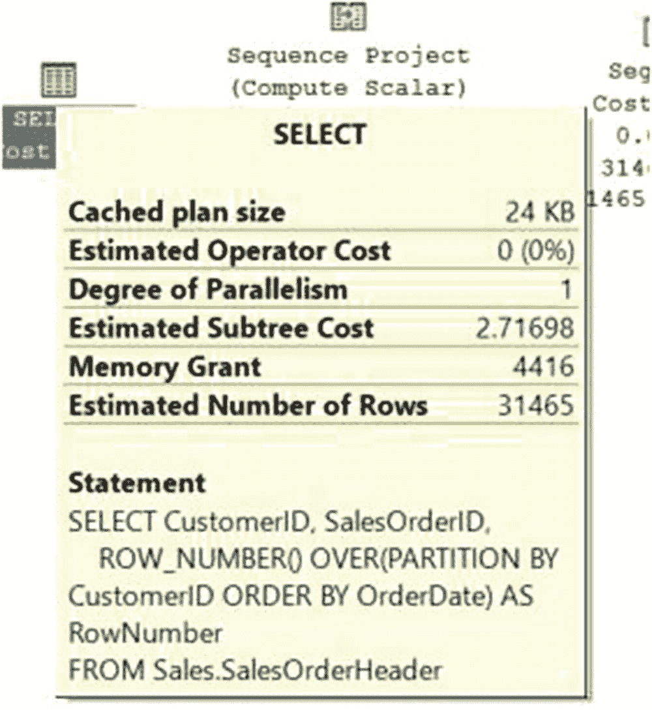

图 8-9
SELECT 工具提示

单击 `Sort` 运算符，然后按 `F4` 查看属性。`Order By` 属性列出了两个列。图 8-10 显示了相关信息。

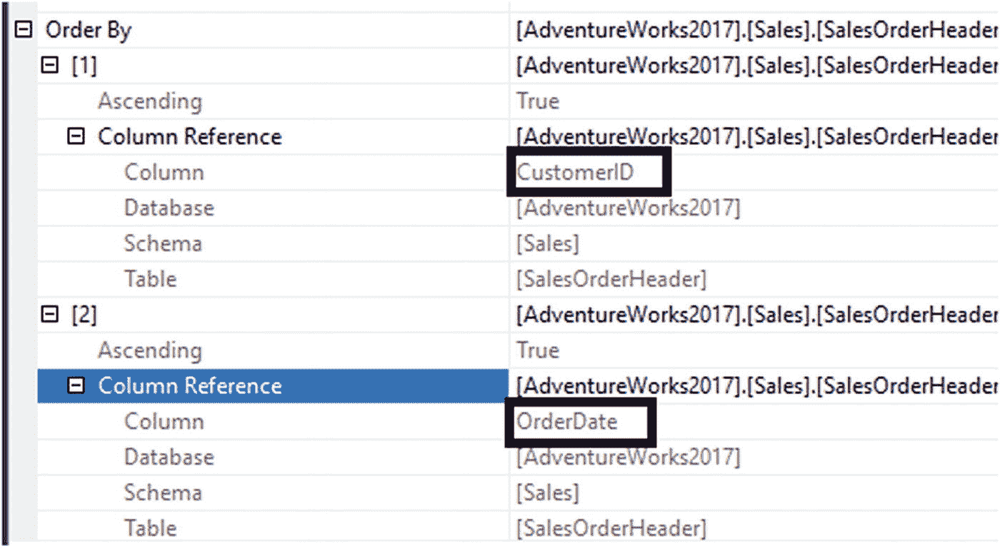

图 8-10
Order By 列

`Sort` 运算符正按 `CustomerID` 和 `OrderDate` 排序。这是合理的，因为 `PARTITION BY` 表达式是 `CustomerID`，而 `ORDER BY` 表达式是 `OrderDate`。数据必须先按 `PARTITION BY` 列划分，然后按 `ORDER BY` 列排序。另外请注意图中还有三个 `Output List`（输出列表）列。如果你查看 `Output List`，会看到 `CustomerID`、`OrderDate` 和 `SaleOrderID`，即查询中使用的三个列。候选索引将以 `CustomerID` 和 `OrderDate` 作为键，并将 `SalesOrderID` 作为包含列。在这种情况下，`SalesOrderID` 不是必需的，因为它是表的聚集键，并且已经是任何非聚集索引的一部分。

另一件需要考虑的事是表上现有的索引。该表在 `CustomerID` 上有一个非聚集索引 `IX_SalesOrderHeader_CustomerID`。你可以修改这个索引，而不是创建一个新索引。以前使用旧索引的查询现在可以使用新索引。运行清单 8-8 来删除现有索引并创建一个新索引。

```
--8-8.1 删除现有索引
DROP INDEX [IX_SalesOrderHeader_CustomerID] ON [Sales].[SalesOrderHeader];
GO
--8-8.2 为查询创建新索引
CREATE NONCLUSTERED INDEX [IX_SalesOrderHeader_CustomerID_OrderDate]
ON [Sales].[SalesOrderHeader] ([CustomerID], [OrderDate]);
清单 8-8
修改索引
```

现在重新运行清单 8-4 中的查询。新的执行计划如图 8-11 所示。

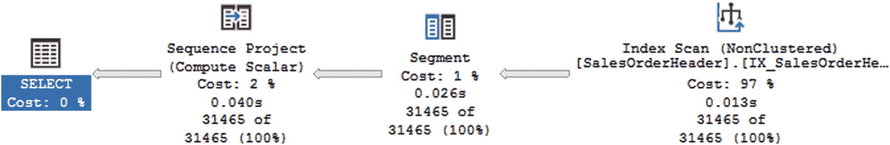

图 8-11
索引更改后的执行计划

首先你应该看到的是 `Sort` 运算符消失了。现在运行查询的主要成本是扫描新的非聚集索引。图 8-12 显示了 `SELECT` 工具提示。

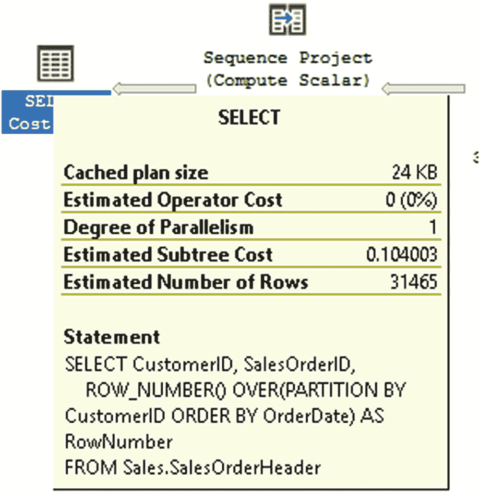

图 8-12
索引更改后的 SELECT 工具提示


内存授予不再需要，而估计子树成本仅为 `0.104003`。这是一个相当大的改进！对于带有 `WHERE` 子句的查询，应在 `PARTITION BY` 和 `OVER` 列之前，将该列添加到索引的首位。在前面的例子中，创建一个新的索引比在以 `CustomerID` 开头的索引上添加列更合理，这样可以不影响那些需要 `CustomerID` 作为第一个索引键的现有查询。不幸的是，如果新列不属于 `OVER` 子句的一部分，排序操作可能还会出现。

这样设计的索引能有效提升任何单表窗口函数查询的性能。然而，大多数查询涉及多个表。清单 8-9 展示了从多表查询返回相同结果的两种方式。这些查询具有不同的执行计划。此结果假设已应用了清单 8-8 中的索引更改。

```sql
--8-9.1 使用连接的查询
SELECT SOH.CustomerID, SOH.SalesOrderID, SOH.OrderDate, C.TerritoryID,
ROW_NUMBER() OVER(PARTITION BY SOH.CustomerID ORDER BY SOH.OrderDate)
AS RowNumber
FROM Sales.SalesOrderHeader AS SOH
JOIN Sales.Customer C ON SOH.CustomerID = C.CustomerID;
--8-9.2 重新排列查询
WITH Sales AS (
SELECT CustomerID, OrderDate, SalesOrderID,
ROW_NUMBER() OVER(PARTITION BY CustomerID ORDER BY OrderDate)
AS RowNumber
FROM Sales.SalesOrderHeader)
SELECT Sales.CustomerID, SALES.SalesOrderID, Sales.OrderDate,
C.TerritoryID, Sales.RowNumber
FROM Sales
JOIN Sales.Customer AS C ON C.CustomerID = Sales.CustomerID;
```

清单 8-9
带有连接的窗口函数

图 8-13 展示了执行计划。查询 1 通过合并连接将 `Customer` 表和 `SalesOrderHeader` 表的行连接起来，因为两个索引都按 `CustomerID` 排序。然后输出结果按 `CustomerID` 和 `OrderDate` 排序，并计算行号。查询 2 将 `SalesOrderHeader` 表移至一个 CTE 中，并在那里应用行号。从执行计划中可以看到，行号是在连接到 `Customer` 表之前应用的。您还可以看到排序操作消失了，其相对成本为 12%。在这种情况下，通过重新排列查询，第二个查询的性能更好。`PARTITION BY` 和 `ORDER BY` 列都来自同一个查询，但情况并非总是如此。查询会迅速变得复杂，您可能无法总是消除排序。我曾遇到过涉及多个连接表的查询中存在顽固的排序算子，无法将其移除。幸运的是，排序的成本通常与计划中的其他算子相比很小。

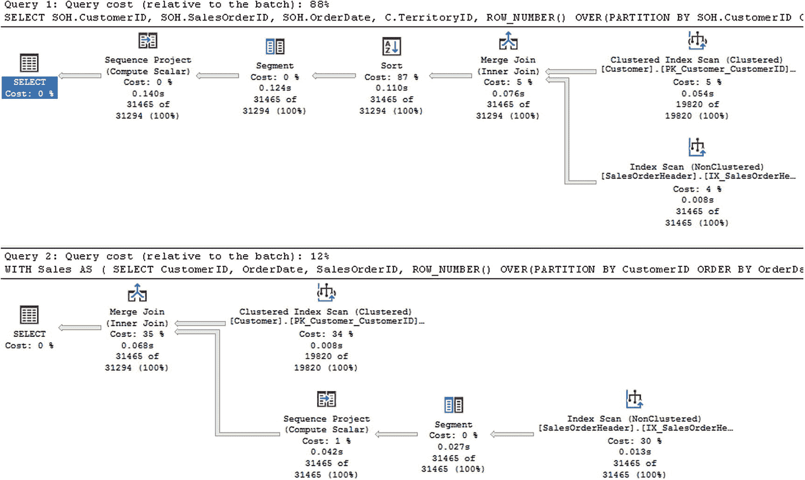

图 8-13
连接的执行计划

## 为性能而设计框架

在第 5 章中，您学习了如何向 `OVER` 子句添加框架以创建移动聚合。在第 6 章中，您看到了 `FIRST_VALUE` 和 `LAST_VALUE` 函数为何需要框架。在每种情况下，我都解释了有时需要框架才能获得正确的结果，但它对于性能原因也很重要。本章后面，我将介绍 SQL Server 2019 中一些令人兴奋的性能更新，但现在，本节中的示例将假设数据库处于 SQL Server 2017 兼容模式或更低版本。

如果表很小，即使省略框架，查询也能快速运行。清单 8-10 将数据库兼容模式设置为 2017 (`140`) 并打开统计信息。然后，它创建一个用于测试的表并填充数据。如果需要，请修改数据库名称。

```sql
--8-10.1 设置兼容性级别
USE master;
GO
ALTER DATABASE AdventureWorks2017
SET COMPATIBILITY_LEVEL = 140 WITH NO_WAIT;
GO
USE AdventureWorks2017;
GO
--8-10.2 打开 STATISTICS IO
SET STATISTICS IO ON;
SET NOCOUNT ON;
GO
--8-10.3 创建一个更大的测试表
DROP TABLE IF EXISTS dbo.SOD ;
CREATE TABLE dbo.SOD(SalesOrderID INT, SalesOrderDetailID INT, LineTotal Money);
--8-10.4 填充表
INSERT INTO dbo.SOD(SalesOrderID, SalesOrderDetailID, LineTotal)
SELECT SalesOrderID, SalesOrderDetailID, LineTotal
FROM Sales.SalesOrderDetail
UNION ALL
SELECT SalesOrderID + MAX(SalesOrderID) OVER(), SalesOrderDetailID, LineTotal
FROM Sales.SalesOrderDetail;
--8-10.5 创建非聚集索引
CREATE INDEX SalesOrderID_SOD ON dbo.SOD
(SalesOrderID, SalesOrderDetailID) INCLUDE(LineTotal);
```

清单 8-10
创建大型测试表

清单 8-11 包含两个性能不佳的查询。运行脚本前请务必打开实际执行计划。

```sql
--8-11.1 运行总和
PRINT '8-11.1'
SELECT SalesOrderID, SalesOrderDetailID, LineTotal,
SUM(LineTotal)
OVER(PARTITION BY SalesOrderID ORDER BY SalesOrderDetailID) RunningTotal
FROM SOD;
--8-11.2 使用 FIRST_VALUE 的查询
PRINT '8-11.2'
SELECT SalesOrderID, SalesOrderDetailID, LineTotal,
FIRST_VALUE(LineTotal)
OVER(PARTITION BY SalesOrderID ORDER BY SalesOrderDetailID) FirstValue
FROM SOD;
```

清单 8-11
两个性能不佳的查询

图 8-14 显示了统计信息。在每种情况下，从临时表中执行了超过 140 万次逻辑读取。

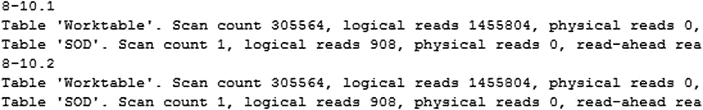

图 8-14
两个性能不佳查询的逻辑读取

图 8-15 显示了查询的执行计划。请注意窗口假脱机算子，它表明创建了一个临时表，但该表并非在内存中创建。

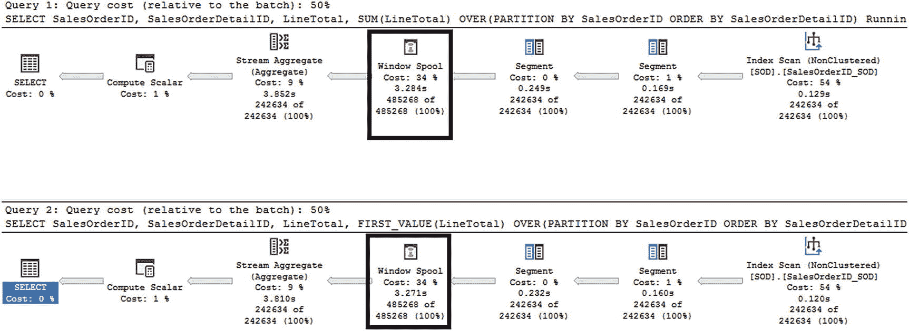

图 8-15
两个性能不佳查询的执行计划

当支持框架但被省略时，会使用默认框架。默认框架是 `RANGE BETWEEN UNBOUNDED PRECEDING AND CURRENT ROW`。`RANGE` 运算符旨在处理逻辑时间段，这在 SQL Server 中尚未实现。当使用 `RANGE` 时，临时表总是在 tempdb 中创建，而不是在内存中。为了解决此问题，请在框架中指定 `ROWS` 运算符。清单 8-12 显示了更正后的查询。

```sql
PRINT '8-12.1'
SELECT SalesOrderID, SalesOrderDetailID, LineTotal,
SUM(LineTotal)
OVER(PARTITION BY SalesOrderID ORDER BY SalesOrderDetailID
ROWS BETWEEN UNBOUNDED PRECEDING AND CURRENT ROW) RunningTotal
FROM SOD;
--8-12.2 使用 ROWS 的 FIRST_VALUE 查询
PRINT '8-12.2'
SELECT SalesOrderID, SalesOrderDetailID, LineTotal,
FIRST_VALUE(LineTotal)
OVER(PARTITION BY SalesOrderID ORDER BY SalesOrderDetailID
ROWS BETWEEN UNBOUNDED PRECEDING AND CURRENT ROW) RunningTotal
FROM SOD;
```

清单 8-12
使用 ROWS 的查询

图 8-16 显示临时表现在产生 0 次逻辑读取。这表明临时表是在内存中创建的。如果您回顾执行计划，它们将与图 8-15 所示的计划相同。

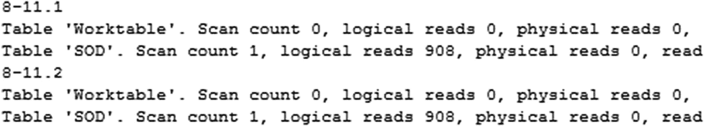

图 8-16
使用 ROWS 时的逻辑读取

这些示例比较了逻辑读取次数，但您如何知道这真的会对查询运行时间产生影响？如果您的客户打电话抱怨查询运行缓慢，解释逻辑读取情况良好对他们来说毫无意义。在本章的“时间测量比较”部分，您将看到逻辑读取确实暗示了性能差异。


## 利用行存储上的批处理模式

有两类窗口函数在过去扩展性不佳：窗口聚合函数和统计函数。这些函数易于使用，但如果在大量行上操作，性能就会下降。你可以通过预聚合来规避这些问题，使函数应用于更少的行，但这并非总是可行。清单 8-13 展示了两个示例，它们使用清单 8-10 中创建的表，并确保数据库处于 2017 (140) 兼容模式。

```sql
--8-13.1 设置兼容级别
USE master;
GO
ALTER DATABASE AdventureWorks2017
SET COMPATIBILITY_LEVEL = 140 WITH NO_WAIT;
GO
USE AdventureWorks2017;
GO
--8-13.2 一个窗口聚合函数
PRINT '8-13.1'
SELECT SalesOrderID, SalesOrderDetailID, LineTotal,
SUM(LineTotal) OVER(PARTITION BY SalesOrderID) AS SubTotal
FROM SOD;
--8-13.2 一个统计函数
PRINT '8-11.2'
SELECT SalesOrderID, SalesOrderDetailID, LineTotal,
PERCENT_RANK()
OVER(PARTITION BY SalesOrderID ORDER BY SalesOrderDetailID) AS Ranking
FROM SOD;
```

清单 8-13: 一个窗口聚合函数和一个统计函数

### 图 8-17: 窗口聚合函数和统计函数的逻辑读取

图 8-17 显示了逻辑读取情况。注意，由于使用了工作表，产生了大量的逻辑读取。

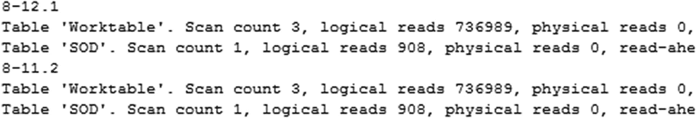

### 图 8-18: 显示表假脱机运算符的执行计划

尽管查询语法简单，但实际执行计划相当复杂。图 8-18 显示了部分计划。请注意，每个计划都有不止一个 `Table Spool`（表假脱机）运算符。`Table Spool` 运算符意味着在 `tempdb` 中创建了工作表。即使估计成本很低，这也总会消耗大量资源。

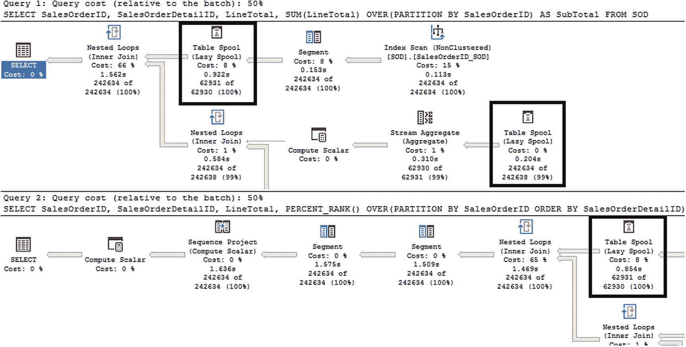

你可能想知道为什么 `PERCENT_RANK()` 函数性能不佳，而 `RANK()` 函数的性能尚可接受。这是因为 `PERCENT_RANK()` 函数的公式是 `(RANK -1)/(TotalRows -1)`。在内部，它使用了窗口聚合函数 `COUNT` 来计算总行数。其他三个统计函数也存在同样的性能问题。

2012 年，微软引入了非聚集 `列存储索引`（`CI`）。`CI` 是一种不同的数据存储方式，其中一页包含一列中的许多行（可能成千上万）。这意味着可以实现高压缩率，查询速度可以提升一个数量级。随着 SQL Server 的每个新版本，微软都增强了 `CI`，包括引入一种新的处理大数据集聚合的方法：`批处理模式`。这对于需要高 CPU 资源的查询尤其有用。在 SQL Server 2019 之前（在撰写本文时仍处于预览版），查询中必须涉及 `CI` 才能使用批处理模式。从 2019 版本开始，即使查询中没有 `CI`，优化器也可以选择使用 `批处理模式`。这被称为 `行存储上的批处理模式`。

清单 8-14 展示了新的 `行存储上的批处理模式` 如何提升窗口聚合查询的性能。

```sql
--8-14.1 设置兼容级别
USE master;
GO
ALTER DATABASE AdventureWorks2017
SET COMPATIBILITY_LEVEL = 150 WITH NO_WAIT;
GO
USE AdventureWorks2017;
GO
--8-14.2 一个窗口聚合函数
PRINT '8-14.1'
SELECT SalesOrderID, SalesOrderDetailID, LineTotal,
SUM(LineTotal) OVER(PARTITION BY SalesOrderID) AS SubTotal
FROM SOD;
```

清单 8-14: 使用行存储上的批处理模式

### 图 8-19: 使用批处理模式时的逻辑读取

图 8-19 显示了逻辑读取情况。注意，工作表的逻辑读取为 0。

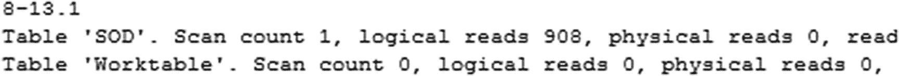

### 图 8-20: 带有窗口聚合运算符的执行计划

图 8-20 显示了实际执行计划。在这种情况下，与在 2017 兼容模式下运行相同查询相比，计划非常简单。另请注意，一个新的运算符 `Window Aggregate`（窗口聚合）成为了计划的一部分。

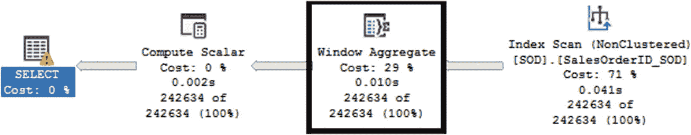

### 图 8-21: 批执行模式

当鼠标悬停在运算符上时，你会看到图 8-21 所示的属性。注意，`执行模式` 是 `Batch`（批处理）。

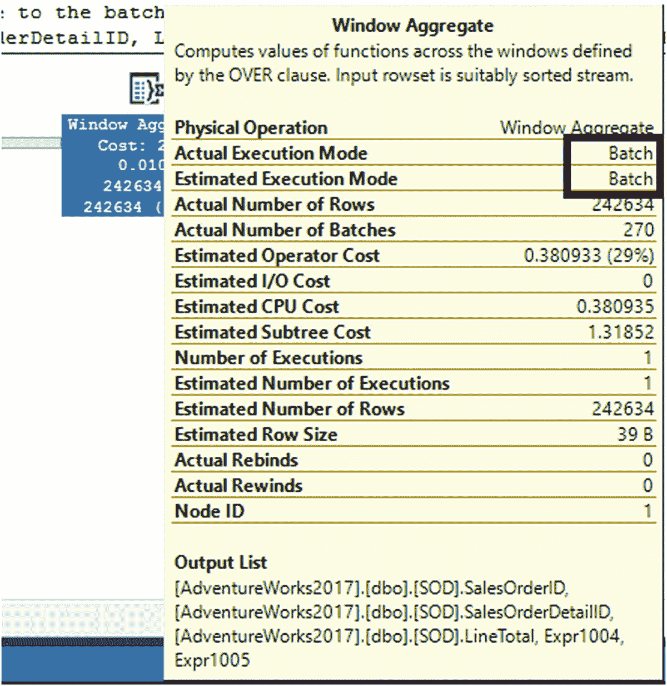

自从窗口聚合函数引入以来，我一直很喜欢使用它们，但我总是担心性能问题。现在，当函数必须在大量行上操作时，`批处理模式` 可以介入并提升性能。请注意，微软没有公布何时切换到 `批处理模式` 是值得的，因此你的结果可能会有所不同。

`行存储上的批处理模式` 也有助于提升统计函数 `PERCENT_RANK()`、`CUME_DIST()`、`PERCENTILE_CONT()` 和 `PERCENTILE_DISC()` 的性能。在内部，这些函数在其公式中使用了窗口聚合，因此它们受益于此是合理的。

在撰写本文时，尚不清楚 SQL Server 的哪些版本将包含此强大功能。


## 时间对比测量

到目前为止，你已经学习了在执行计划和 `STATISTICS IO` 中需要关注什么。然而，你的客户并不会关心执行计划或逻辑读取次数。你的客户只关心查询运行的速度。另一个名为 `STATISTICS TIME` 的设置可用于测量查询运行所需的时间。虽然 `STATISTICS IO` 有助于比较两个查询之间的 I/O，但你可能也会对查询实际运行多长时间感兴趣，尤其是在处理运行时间较长的查询时。清单 8-15 展示了一个使用本章前面创建的 `dbo.SOD` 表的示例。

```sql
--8-15.1 更改设置
SET STATISTICS IO OFF;
SET STATISTICS TIME ON;
GO
--8-15.2 更改兼容性
USE MASTER;
GO
ALTER DATABASE AdventureWorks2017
SET COMPATIBILITY_LEVEL = 140 WITH NO_WAIT;
USE AdventureWorks2017;
GO
--8-15.3
PRINT '
DEFAULT frame'
SELECT SalesOrderID, SalesOrderDetailID, LineTotal,
SUM(LineTotal) OVER(PARTITION BY SalesOrderID
ORDER BY SalesOrderDetailID) AS RunningTotal
FROM SOD;
--8-15.4
PRINT '
ROWS'
SELECT SalesOrderID, SalesOrderDetailID, LineTotal,
SUM(LineTotal) OVER(PARTITION BY SalesOrderID
ORDER BY SalesOrderDetailID
ROWS BETWEEN UNBOUNDED PRECEDING AND CURRENT ROW) AS SubTotal
FROM SOD;
```
清单 8-15
使用 `STATISTICS TIME`

该清单比较了两个返回累计值的查询。第一个使用 `DEFAULT` 框架，第二个使用 `ROWS`。兼容性模式也被更改为 SQL Server 2017，以避免利用批处理模式。图 8-22 展示了 `STATISTICS TIME` 返回的信息。

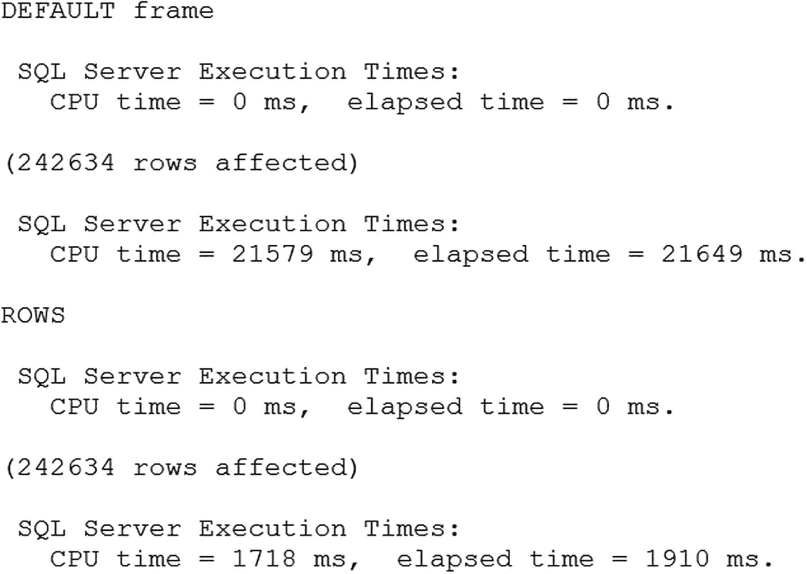
图 8-22
`STATISTICS TIME` 信息

使用 `ROWS` 耗时不到 2 秒，而不指定框架则耗时约 21 秒。测量查询运行时间还有其他几种方法。例如，你可以运行一个扩展事件会话。另外需要注意的一点是，如果你使用查询窗口来计时查询，填充网格所花费的时间也被包含在内。你也可以在 SSMS 选项中打开 *执行后放弃结果* 以避免填充网格。在 SSMS 的某些早期版本中，此设置也会影响“消息”选项卡。为避免此问题，清单 8-16 将行插入临时表而非直接显示它们。

```sql
--8-16.1
PRINT '
DEFAULT frame'
SELECT SalesOrderID, SalesOrderDetailID, LineTotal,
SUM(LineTotal) OVER(PARTITION BY SalesOrderID
ORDER BY SalesOrderDetailID) AS RunningTotal
INTO #temp1
FROM SOD;
--8-16.2
PRINT '
ROWS'
SELECT SalesOrderID, SalesOrderDetailID, LineTotal,
SUM(LineTotal) OVER(PARTITION BY SalesOrderID
ORDER BY SalesOrderDetailID
ROWS BETWEEN UNBOUNDED PRECEDING AND CURRENT ROW) AS SubTotal
INTO #Temp2
FROM SOD;
DROP TABLE #Temp1;
DROP TABLE #temp2;
```
清单 8-16
丢弃结果行

图 8-23 展示了差异。

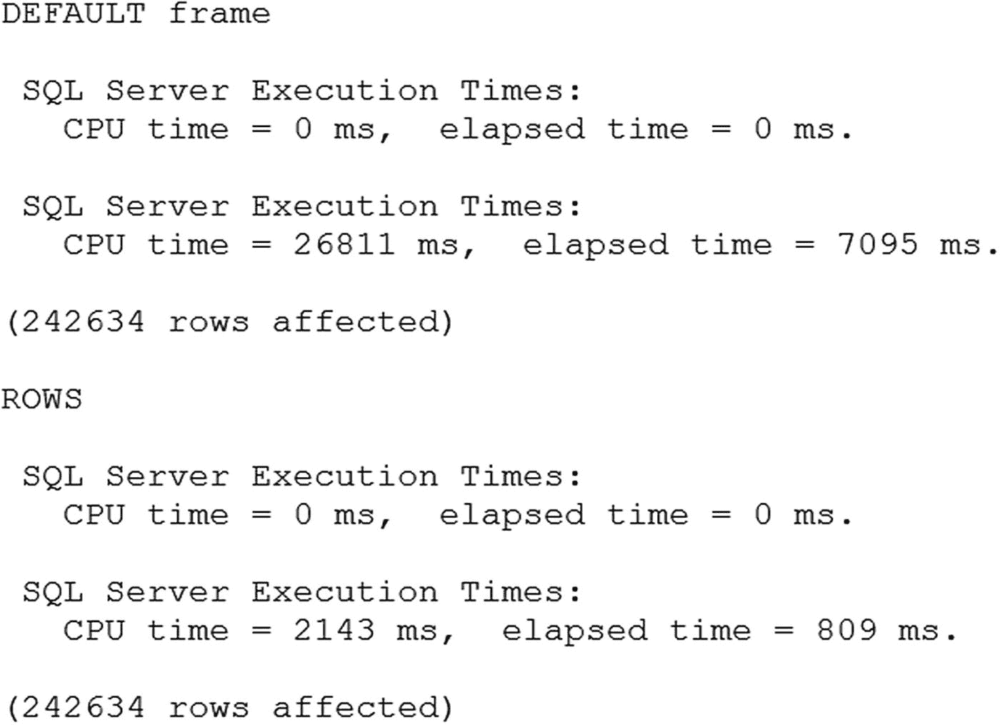
图 8-23
丢弃结果时的耗时

### 注意
你可能会注意到一些奇怪的现象。为什么 CPU 时间大于已用时间？这是因为优化器通过并行处理将查询分配到多个核心上执行，因此时间是所有核心上时间的总和。

我发现对更大数量的行进行比较非常有趣。为此，我运行了一个来自数据平台专家 Adam Machanic 的脚本，名为 `Thinking Big Adventure`。（你可以轻松地通过谷歌搜索找到这个脚本。）该脚本创建了一个包含 3000 万行的表，名为 `bigTransactionHistory`。如果你有兴趣自己运行计时测试，所使用的查询将与本章中的其他查询一起提供。

图 8-24 比较了使用窗口聚合与使用产生相同结果的 CTE 的性能。在我的虚拟机上以 2016 模式运行时，窗口聚合耗时 5 分钟，而使用 CTE 耗时 1.75 分钟。当切换到 2019 模式时，两种方法都运行得很快。

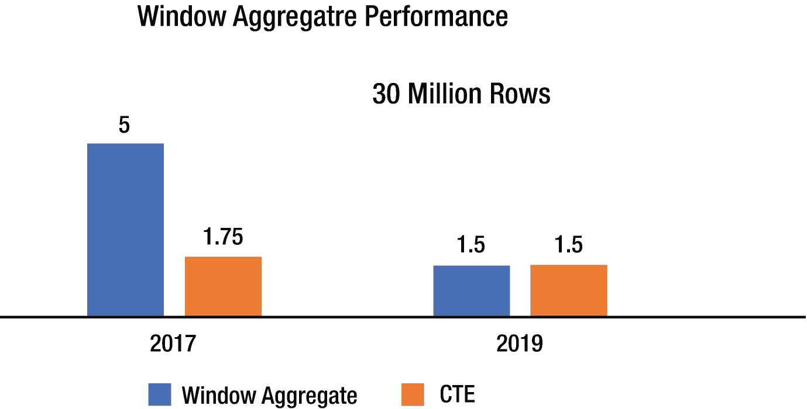
图 8-24
窗口聚合性能

图 8-25 显示了 `DEFAULT` 框架和 `ROWS` 在累计计算上的差异。在 2016 模式下，使用默认框架耗时 36 分钟，而使用 `ROWS` 耗时 3.5 分钟。切换到 2019 模式后，每种方法都仅需 1.3 分钟！

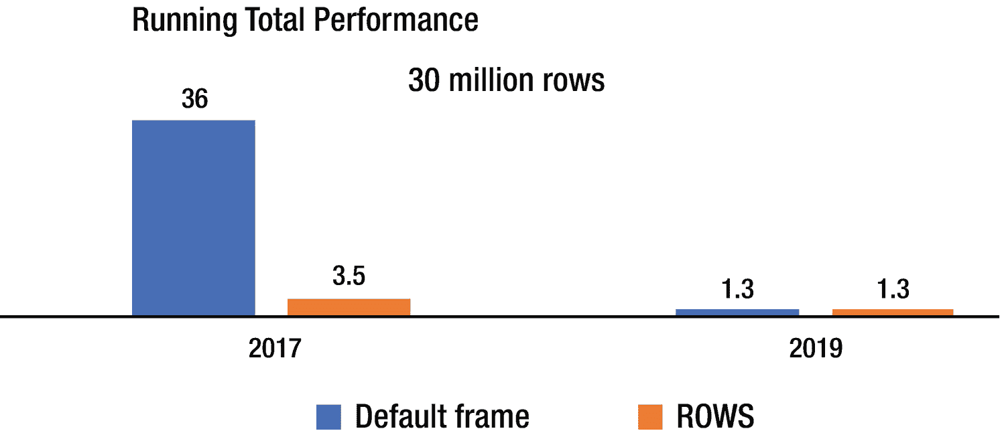
图 8-25
累计计算性能

## 清理数据库
如果你想将你的 AdventureWorks 数据库恢复到原始状态，可以运行清单 8-17。

```sql
--8-17.1 删除索引
DROP INDEX [IX_SalesOrderHeader_CustomerID_OrderDate]
ON Sales.SalesOrderHeader;
GO
--8-17-2 重新创建原始索引
CREATE INDEX [IX_SalesOrderHeader_CustomerID] ON Sales.SalesOrderHeader
(CustomerID);
--8-17-3 删除特殊表
DROP TABLE IF EXISTS dbo.SOD;
--8-17-4 删除 Thinking Big Adventure 表
DROP TABLE IF EXISTS dbo.bigTransactionHistory;
DROP TABLE IF EXISTS dbo.bigProduct;
```
清单 8-17
清理数据库

## 总结
你可以通过添加一个对 `PARTITION BY` 和 `ORDER BY` 子句进行排序的索引来影响包含窗口函数的查询的性能。一个构建得当的索引可以提高许多包含窗口函数的查询的性能。当框架受支持时，包含它非常重要。在某些情况下，你还可以利用 2019 的行存储上的批处理模式功能。

既然你已经了解了所有可能的窗口函数类型以及如何调优它们，是时候看更多真实世界的例子了。在第 9 章中，你将处理棒球数据！

