# 9. 利用间隙、岛屿和连续期打出全垒打
在任何数据集中，我们都可以检查数据如何分组。这可以让我们识别缺失的行、发现异常模式或开发高级分析技术。最基本地，能够定位间隙和岛屿将告诉我们有关缺失数据值的信息。当我们深入研究时，它将允许我们识别连续期、干旱期或值得进一步调查的异常事件。

这个概念的核心是边界。边界代表一个停止点或转折点，在此处具有统计显著性的数据集相遇。日期和时间是数据中最常见的自然边界条件，因为我们世界的很多事物都是按事件发生的时间组织的。我们也可以查看标识值的范围，并确定某个值何时缺失，或者在发现间隙之前存在多少连续值。任何可以有意义排序的数据都可以分析是否存在间隙、岛屿或数据组。

为了有效演示这些概念和技术，我们将使用一组棒球数据来进行我们的工作。因为棒球是一项古老的运动，而我们的数据跨越了一百多年，所以它是一组极好的测试数据，因为它庞大、混乱且充满了不寻常的事件。1920 年代的数据库远不如我们今天拥有的数据库，因此我们可以确保存在糟糕、缺失或异常的事件，这将为分析增添乐趣。

窗口函数对于执行间隙/岛屿分析至关重要，因为它们提供了极大的灵活性，并允许我们应用复杂的分析，而无需编写冗长的 T-SQL。虽然可以使用相关子查询、临时表或迭代，但我们的目标是呈现易于阅读和维护且性能合理的解决方案。


## 经典的间隔/岛屿问题

在本章的分析中，我们将**间隔**定义为一个序列的结束与下一个序列开始之间的距离。而一个**岛屿**则是由前一个间隔的结束与下一个间隔的开始所界定的数据集。间隔和岛屿都由一系列值来定义，这些值指明了间隔或岛屿的开始与结束。间隔和岛屿共存，一方的存在意味着另一方的存在。没有围绕它的数据岛屿，间隔就不可能存在；而没有间隔的环绕，岛屿也不可能存在。数据集的开始和结束通常被视为终止符，其作用类似于间隔，即使我们不认为它们是数据中的间隔。

间隔是两个数据序列之间的距离，而岛屿则是一对间隔所界定的数据。

间隔分析最简单的应用是查找表中缺失的 ID 值。考虑一个我们用一组整数填充的表，如清单 9-1 所示。

```sql
CREATE TABLE dbo.integers
(integer_id INT NOT NULL);
INSERT INTO dbo.integers
(integer_id)
VALUES
(1), (2), (3), (4), (5), (6), (7), (8), (9), (12), (13), (14), (15), (17), (19), (20), (21), (22), (23), (24);
```
清单 9-1
为间隔分析创建并填充一个整数值表

我们在 `INSERT` 语句中有意跳过了一些值。挑战在于确定使用 T-SQL 定位缺失整数值的最佳方法。由于这是一个小列表，我们可以直观地从 `INSERT` 语句中确认缺失值：

*   1 2 3 4 5 6 7 8 9…12 13 14 15…17…19 20 21 22 23 24

最简单但最慢的方法是遍历表，逐个计数整数，并在遇到缺失值时进行标记。这很容易理解，但速度极慢且局限性大。在包含数百万或数十亿行的更现实的数据集中，遍历每个值来查找缺失数据效率会低到不值得尝试。此外，该策略对于非整数数据（如日期和时间）会失效。对于这些数据类型，值之间的距离是不确定的，需要额外的分析来定义间隔和岛屿。

### 查找岛屿

窗口函数允许我们以单一步骤处理此数据并返回结果列表，如清单 9-2 所示。

```sql
WITH CTE_ISLANDS AS (
SELECT
integer_id,
integer_id - ROW_NUMBER() OVER (ORDER BY integer_id) AS gap_quantity
FROM dbo.integers)
SELECT
MIN(integer_id) AS island_start,
MAX(integer_id) AS island_end
FROM CTE_ISLANDS
GROUP BY gap_quantity;
```
清单 9-2
返回非重复整数列表中岛屿的查询

在此查询中，我们定义了一个公共表表达式，它返回整数值以及该值与其行号之间的差值。在不重复的正整数序列中，该差值只能由序列中的间隔造成，为此我们可以使用 `MIN` 和 `MAX` 来量化剩余数据岛屿的端点。结果如图 9-1 所示。

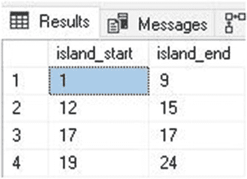
图 9-1
通过清单 9-2 的查询找到的整数岛屿

处理重复值很重要，因此我们通过向整数列表添加一些重复项来继续分析：

```sql
INSERT INTO dbo.integers
(integer_id)
VALUES
(2), (12), (12), (24);
```

如果我们运行之前的查询，图 9-2 所示的结果将显得毫无意义。

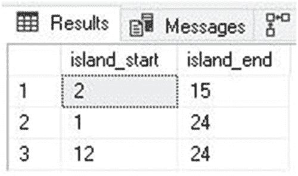
图 9-2
通过清单 9-2 的查询找到的整数岛屿

重复值的存在干扰了我们的计算，因为计算基于行数表示唯一值的假设。窗口函数 `DENSE_RANK` 可以为我们解决这个问题，因为它只考虑唯一值，不会为重复值分配多个 ID。清单 9-3 展示了一个使用此窗口函数提供准确岛屿列表的新查询。

```sql
WITH CTE_ISLANDS AS (
SELECT
integer_id,
integer_id - DENSE_RANK() OVER (ORDER BY integer_id) AS gap_quantity
FROM dbo.integers)
SELECT
MIN(integer_id) AS island_start,
MAX(integer_id) AS island_end,
COUNT(*) AS distinct_value_count
FROM CTE_ISLANDS
GROUP BY gap_quantity;
```
清单 9-3
使用 `DENSE_RANK` 处理重复值

此查询的结果证实，即使存在重复值，我们也可以返回岛屿集合，如图 9-3 所示。

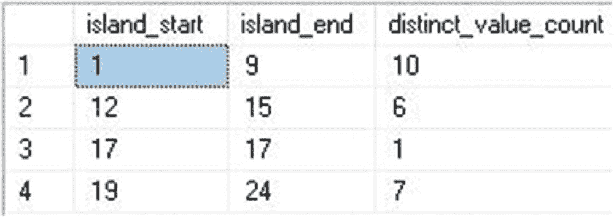
图 9-3
通过清单 9-2 的查询找到的整数岛屿

作为额外收获，我们包含了每个岛屿内的行数统计。这很有价值，因为它确实包含了重复值。范围 1-9 包含 10 个值，因为数字 2 重复了一次。这对于量化特定岛屿内的数据量（无论具体值如何）很有用。如果我们想返回忽略重复值的绝对岛屿长度，只需简单地用岛屿结束值减去开始值并加 1。例如，`9-1 + 1 = 9` 就是范围 1-9 内的 9 个唯一整数值。

### 查找间隔

定位数据中的间隔需要我们首先考虑岛屿集合，然后反转该数据集以查找它们之间的间隔。这需要更多工作，但可以用与定位岛屿类似的方式完成。清单 9-4 中的查询展示了一种在整数列表中查找间隔的方法。

```sql
WITH CTE_GAPS AS (
SELECT
integer_id,
ROW_NUMBER() OVER (ORDER BY integer_id) AS island_quantity
FROM dbo.integers)
SELECT
ISLAND_END.integer_id + 1 AS gap_starting_value,
ISLAND_START.integer_id - 1 AS gap_ending_value,
ISLAND_START.integer_id - ISLAND_END.integer_id - 1 AS gap_length
FROM CTE_GAPS AS ISLAND_END
INNER JOIN CTE_GAPS AS ISLAND_START
ON ISLAND_START.island_quantity = ISLAND_END.island_quantity + 1
WHERE ISLAND_START.integer_id - ISLAND_END.integer_id > 1;
```
清单 9-4
通过使用 `ROW_NUMBER` 的自连接公共表表达式查找间隔

此查询的结果可以在图 9-4 中找到，它提供了整数集中的三个间隔。

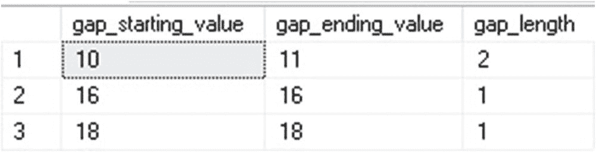
图 9-4
整数集中的间隔，包括间隔长度

结果显示了三个符合先前确定的四个岛屿的间隔。由于间隔被定义为值的缺失，因此间隔长度就是该范围内的整数数量。同样，重复值对我们的结果没有影响，我们特意使用 `ROW_NUMBER` 而不是 `DENSE_RANK`，因为计算重复值会干扰间隔计算，并在存在重复值时导致错误的范围。


## 限制与注意事项

数据集中的岛屿数量总是等于间隔数量加一。虽然这看起来是个微不足道的事实，但它允许我们对间隔和岛屿之间的关系做出简化假设，并为每个间隔分配一对与之相关的岛屿。在讨论数据邻近性时，紧邻间隔前后发生的事件可能具有重要意义，赋予它们特殊含义或许能帮助我们预测未来事件。如果某个间隔或岛屿代表异常，并且我们能够唯一量化导致该间隔或岛屿的相应事件，那么这些事件就可以被预警，并有可能通过自动化手段避免。

在数据集中识别间隔和岛屿的方法有很多种。我们将标准化采用那些最易于编写、记录和维护的方法。本章后续将讨论性能问题，并探讨在存在延迟或资源消耗顾虑时，如何加快间隔/岛屿分析的速度。

到目前为止，我们的示例都围绕一组正整数展开。虽然我们已经考虑了重复值，但我们的分析不适用于其他数据类型。如果我们希望在一组小数、日期或时间中寻找间隔或岛屿，我们的计算方法就显得不足了。本章的剩余部分将着重于扩展间隔和岛屿分析，以涵盖我们在现实世界中遇到的数据。这些数据通常通过分析日期和时间（而非整数或标识符）来进行处理，并且需要额外的代码才能进行有意义的分析。

## 数据聚类

真实数据很少由连续不重复的正整数组成。虽然标识符（ID）常被用来组织信息，但通常使用日期和时间来自然地引用数据。对基于日期时间组件的数据进行间隔和岛屿分析，引出了一个新实体的定义：**数据聚类**。

我们可以根据创建的边界来分组数据。例如，我们可以获取销售数据并按月、财季或年份进行分组，以观察随时间的变化。这些分组是静态且不变的。我们知道一份季度报告每年会包含 4 个数据桶，一份月度报告包含 12 个，一份周度报告包含 52 个。

我们也可以选择有机地对数据进行分组，创建规则并允许数据根据这些规则被划分成未知数量的分段。我们选择的规则将基于邻近性的度量，通过检查两个事件是否位于同一数据岛屿中来确定它们是否彼此相关。

**数据聚类**是一个有机分组的数据集合，在更大的数据集中由单个岛屿表示。用于确定分组规则的维度可以是数字型的，如整数或小数，也可以是日期时间型的。理论上，只要我们能构建关于数据如何交互的规则，任何数据类型都可以用于此目的。例如，如果邻近性恰好基于字母顺序距离计算，那么字符串也可以用来确定数据聚类。

为了引入这个概念，让我们考虑一下值班技术员的困境。当系统出现问题时会收到警报；技术员醒来修复问题，然后回去睡觉，直到下一个问题出现。回顾过去一周、一个月或一年的警报时，将事件按最可能相关的进行分组是有价值的。

最简单的方法是查看时间。时间上接近发生的事件很可能（尽管不保证）是相关的。如果一个网络交换机发生故障，那么所有连接到它的设备都将无法访问。如果一个云服务中断一分钟，那么任何使用该服务的应用程序也会遇到问题。

让我们构建一个简单的数据集来介绍这个概念。清单 9-5 展示了用于创建新表并填充测试数据的 T-SQL。

```sql
CREATE TABLE dbo.error_log
(        error_log_id INT NOT NULL IDENTITY(1,1) CONSTRAINT PK_error_log PRIMARY KEY CLUSTERED,
error_time_utc DATETIME NOT NULL,
error_source VARCHAR(50) NOT NULL,
severity VARCHAR(10) NOT NULL,
error_description VARCHAR(100) NOT NULL);
GO
INSERT INTO dbo.error_log (error_time_utc, error_source, severity, error_description)
VALUES
('2/20/2019 00:00:15', 'print_server_01', 'low', 'device unreachable'),
('2/21/2019 00:00:13', 'print_server_01', 'low', 'device unreachable'),
('2/22/2019 00:00:11', 'print_server_01', 'low', 'device unreachable'),
('2/23/2019 00:00:17', 'print_server_01', 'low', 'device unreachable'),
('2/24/2019 00:00:12', 'print_server_01', 'low', 'device unreachable'),
('2/25/2019 00:00:15', 'print_server_01', 'low', 'device unreachable'),
('2/26/2019 00:00:12', 'print_server_01', 'low', 'device unreachable'),
('2/22/2019 22:34:01', 'network_switch_05', 'critical', 'device unresponsive'),
('2/22/2019 22:34:06', 'sql_server_02', 'critical', 'device unreachable'),
('2/22/2019 22:34:06', 'sql_server_02 sql service', 'critical', 'service down'),
('2/22/2019 22:34:06', 'sql_server_02 sql server agent service', 'high', 'service down'),
('2/22/2019 22:34:06', 'app_server_11', 'critical', 'device unreachable'),
('2/22/2019 22:34:11', 'file_server_03', 'high', 'device unreachable'),
('2/22/2019 22:34:31', 'app_server_10', 'critical', 'device unreachable'),
('2/22/2019 22:34:39', 'web_server', 'medium', 'device unreachable'),
('2/22/2019 22:35:00', 'web_site', 'medium', 'http 404 thrown'),
('2/05/2019 03:05:00', 'app_git_repo', 'low', 'repo unavailable'),
('2/12/2019 03:05:00', 'app_git_repo', 'low', 'repo unavailable'),
('2/19/2019 03:05:00', 'app_git_repo', 'low', 'repo unavailable'),
('2/26/2019 03:05:00', 'app_git_repo', 'low', 'repo unavailable'),
('2/26/2019 03:07:15', 'git service error', 'medium', "),
('1/31/2019 23:59:50', 'sql_server_01', 'critical', 'corrupt database identified'),
('1/31/2019 23:59:53', 'sql_server_01', 'critical', 'corrupt database identified'),
('1/31/2019 23:59:57', 'sql_server_01', 'critical', 'corrupt database identified'),
('2/1/2019 00:00:00', 'sql_server_01 sql service', 'critical', 'service down'),
('2/1/2019 00:00:15', 'sql_server_01 sql server agent service', 'critical', 'service down'),
('2/1/2019 00:15:00', 'etl data load to sql_server_01', 'medium', 'job failed'),
('2/1/2019 00:30:00', 'etl data load to sql_server_01', 'medium', 'job failed'),
('2/1/2019 00:45:00', 'etl data load to sql_server_01', 'medium', 'job failed'),
('2/1/2019 01:00:00', 'etl data load to sql_server_01', 'medium', 'job failed'),
('2/1/2019 01:15:00', 'etl data load to sql_server_01', 'medium', 'job failed'),
('2/1/2019 01:30:00', 'etl data load to sql_server_01', 'medium', 'job failed')
GO
```

清单 9-5
创建用于演示简单数据聚类/邻近性分析的错误日志

对该表进行快速查询可以展示我们正在处理的数据类型，如图 9-5 所示。

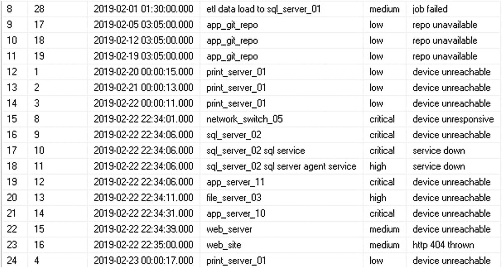

图 9-5
来自 `dbo.error_log` 的数据样本

我们的兴趣在于对警报进行分组，以显示那些彼此相关的警报。这可以通过 `GROUP BY` 来实现，但我们如何决定按什么分组呢？如果一个警报发生在晚上 11:59:59，另一个发生在凌晨 12:00:00，按日期或小时分组会将它们显示为不相关的事件。就我们的目的而言，我们假设所有在 5 分钟内发生的事件被视为同一个数据聚类的一部分并且是相关的。清单 9-6 展示了一个查询，该查询将按此规则从日志中返回错误。


## 9.4.2 使用 CTE 查询进行邻近性分析

```sql
WITH CTE_ERROR_HISTORY AS (
SELECT
LAG(error_log.error_time_utc) OVER (ORDER BY error_log.error_time_utc, error_log.error_log_id) AS previous_event_time,
LEAD(error_log.error_time_utc) OVER (ORDER BY error_log.error_time_utc, error_log.error_log_id) AS next_event_time,
ROW_NUMBER() OVER (ORDER BY error_log.error_time_utc, error_log.error_log_id) AS island_location,
error_log.error_time_utc,
error_log.error_log_id
FROM dbo.error_log),
CTE_ISLAND_START AS (
SELECT
ROW_NUMBER() OVER (ORDER BY CTE_ERROR_HISTORY.error_time_utc, CTE_ERROR_HISTORY.error_log_id) AS island_number,
CTE_ERROR_HISTORY.error_time_utc AS island_start_time,
CTE_ERROR_HISTORY.next_event_time,
CTE_ERROR_HISTORY.island_location AS island_start_location
FROM CTE_ERROR_HISTORY
WHERE DATEDIFF(MINUTE, CTE_ERROR_HISTORY.previous_event_time, CTE_ERROR_HISTORY.error_time_utc) > 5 OR CTE_ERROR_HISTORY.previous_event_time IS NULL),
CTE_ISLAND_END AS (
SELECT
ROW_NUMBER() OVER (ORDER BY CTE_ERROR_HISTORY.error_time_utc, CTE_ERROR_HISTORY.error_log_id) AS island_number,
CTE_ERROR_HISTORY.error_time_utc AS island_end_time,
CTE_ERROR_HISTORY.next_event_time,
CTE_ERROR_HISTORY.island_location AS island_end_location
FROM CTE_ERROR_HISTORY
WHERE DATEDIFF(MINUTE, CTE_ERROR_HISTORY.error_time_utc, CTE_ERROR_HISTORY.next_event_time) > 5 OR CTE_ERROR_HISTORY.next_event_time IS NULL)
SELECT
CTE_ISLAND_START.island_start_time,
CTE_ISLAND_END.island_end_time,
CTE_ISLAND_END.island_end_location - CTE_ISLAND_START.island_start_location + 1 AS count_of_events
FROM CTE_ISLAND_START
INNER JOIN CTE_ISLAND_END
ON CTE_ISLAND_START.island_number = CTE_ISLAND_END.island_number;
```

*代码清单 9-6 将错误按 5 分钟内的邻近性分组为相关数据簇的查询*

这个查询看起来很长，但遵循了一种有条理的方法，我们将在后续工作中采用这种方法：

1.  创建一个规则来确定邻近性以及事件何时相关。
2.  创建一个数据集，其中包含当前事件、前一个事件和下一个事件。
3.  使用邻近性规则定义所有数据簇的起点。
4.  使用邻近性规则定义所有数据簇的终点。
5.  将起点和终点连接在一起以生成结果集。

`LEAD` 和 `LAG` 用于快速检索数据集中的前一个和后一个事件，而 `ROW_NUMBER` 用于跟踪岛屿计数，以便在查询结束时用于连接。结果可以在图 9-6 中看到。

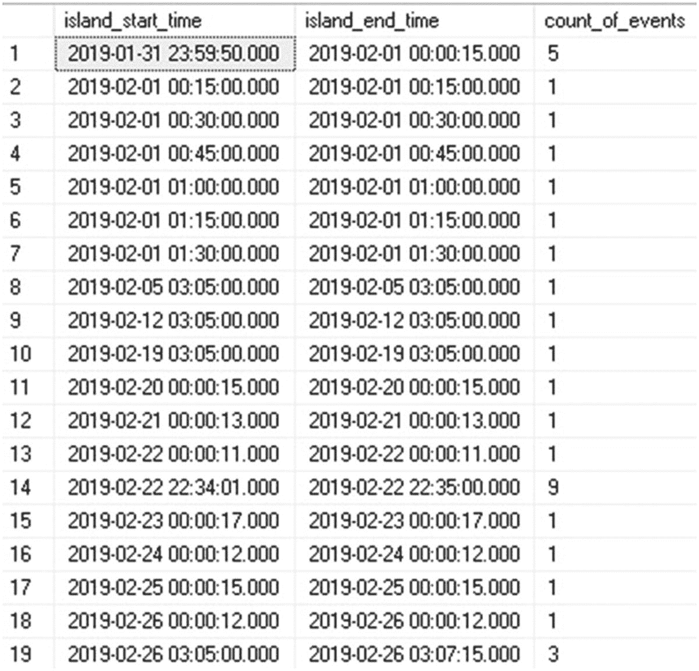

*图 9-6 错误日志数据，按发生在彼此 5 分钟内的事件分组*

我们可以看到，少量错误被分组到更大的数据簇中，而其余的则因邻近性而不相关。任何查看这些数据的人都能判断何时发生了重大中断，并可以根据这些中断的大小、长度或深度来追踪指标。

虽然我们的结果只包含时间和计数，但我们可以添加关于哪些事件在每个范围内发生得最多、最少，或者范围内第一个事件的详细信息（因为它通常是中断的原因）。

对数据进行唯一排序非常重要。`LEAD`、`LAG` 和 `ROW_NUMBER` 都必须有一个唯一的 `ORDER BY` 子句。在我们的示例中，我们在时间之后包含了 *error_log_id*，这是一个标识列。这确保了每次执行此查询时，数据都以相同的方式唯一排序。如果基础数据具有重复值，并且我们没有应用唯一的排序顺序，那么在这些边界上可能存在数据不一致或不准确的风险。

邻近性分析的关键是定义一个可用于将数据排序为编号组的规则。有了这个规则，我们就可以确定数据簇的边界并将它们连接起来，以产生一组分组的结果。与使用 `GROUP BY` 不同，我们直到运行时才知道结果集的大小。返回的行数将由数据驱动，可能是一行（包含许多相关事件），也可能是多行（包含一组不相关的事件）。

如果我们调整规则，就可以改变结果的形状。如果事件发生在彼此 15 分钟内被视为相关，而不是 5 分钟，那么我们将得到一个事件计数更高的较小数据集。如果我们将规则调整得更严格，将 1 分钟内发生的事件视为相关，那么我们的结果集将包含更多的行和更小的计数。试验规则是这种分析风格的关键组成部分，将帮助我们确定哪些指标对于给定的数据集最有意义。如有疑问，我们可以自动化一个过程，该过程遍历许多不同的规则，以确定哪一个能提供最大的价值。

## 追踪连续记录

一个数据簇可以表示多种类型的数据分组。在体育中，连续记录意义重大，并构成了许多用于持续数据驱动决策的统计数据的基础。赢和输是最常被报告的模式，但经理们也会追踪细节。在棒球中，连续安打、连续出局、失误以及许多其他指标都可以作为事件序列进行追踪。这些序列表现为岛屿或间隙，我们可以像处理错误日志数据那样以相同的方式进行报告。

在接下来的例子中，我们将使用一组棒球数据，这些数据定义在一个名为 `dbo.GameLog` 的单一宽表中。该表每场比赛包含一行，并包含详尽的细节，如图 9-7 中的样本所示。

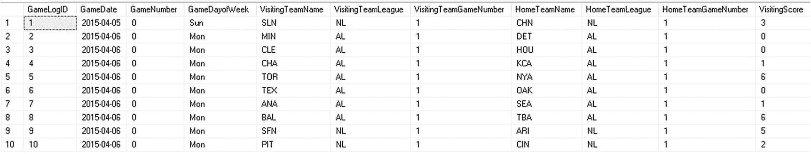

*图 9-7 棒球比赛日志数据样本*

其中包括天气、比赛得分以及裁判、教练和经理的姓名等详细信息。对于较旧的比赛，许多数据缺失或不完整，因此我们编写的任何查询都必须容忍这一事实。该数据包括从 1871 年到 2018 年的所有常规赛、全明星赛和季后赛，总计记录了 219,832 场棒球比赛。

所有缩写、名称、代码和模糊维度都有查找表，可用于验证其存在或含义。为了我们的工作，将跳过这些附加维度，因为它们不会为我们的连续记录分析提供任何额外价值。


## 连胜与连败

引入这个新的数据集后，让我们深入探讨最基本的连胜/连败情况。我们将连胜定义为被失利或平局所**界定**的一段连续胜利。一段连胜可能跨越多个赛季，默认情况下，我们不会将常规赛与季后赛混合计算。连败的计算方式相同：即被胜利或平局界定的一段连续失利。虽然平局在现代比赛中很少见，但在使用户外照明和室内球场之前，平局非常普遍。

首先，让我们考虑某支特定棒球队伍在历史上的最长连胜纪录。`代码清单 9-7`中的查询将获取比赛日志数据，将其分组为连续的胜/负区段，从而创建可供分析的数据集群。

```sql
WITH GAME_LOG AS (
    SELECT
        CASE WHEN (HomeScore > VisitingScore AND HomeTeamName = 'NYA') OR (VisitingScore > HomeScore AND VisitingTeamName = 'NYA') THEN 'W'
             WHEN (HomeScore > VisitingScore AND VisitingTeamName = 'NYA') OR (VisitingScore > HomeScore AND HomeTeamName = 'NYA') THEN 'L'
             WHEN VisitingScore = HomeScore THEN 'T'
        END AS result,
        LAG(CASE WHEN (HomeScore > VisitingScore AND HomeTeamName = 'NYA') OR (VisitingScore > HomeScore AND VisitingTeamName = 'NYA') THEN 'W'
                 WHEN (HomeScore > VisitingScore AND VisitingTeamName = 'NYA') OR (VisitingScore > HomeScore AND HomeTeamName = 'NYA') THEN 'L'
                 WHEN VisitingScore = HomeScore THEN 'T' END) OVER (ORDER BY GameLog.GameDate, GameLog.GameLogId) AS previous_game_result,
        LEAD(CASE WHEN (HomeScore > VisitingScore AND HomeTeamName = 'NYA') OR (VisitingScore > HomeScore AND VisitingTeamName = 'NYA') THEN 'W'
                  WHEN (HomeScore > VisitingScore AND VisitingTeamName = 'NYA') OR (VisitingScore > HomeScore AND HomeTeamName = 'NYA') THEN 'L'
                  WHEN VisitingScore = HomeScore THEN 'T' END) OVER (ORDER BY GameLog.GameDate, GameLog.GameLogId) AS next_game_result,
        ROW_NUMBER() OVER (ORDER BY GameLog.GameDate, GameLog.GameLogId) AS island_location,
        GameLog.GameDate,
        GameLog.GameLogId
    FROM dbo.GameLog
    WHERE (GameLog.HomeTeamName = 'NYA' OR GameLog.VisitingTeamName = 'NYA')
        AND GameLog.GameType = 'REG'),
CTE_ISLAND_START AS (
    SELECT
        ROW_NUMBER() OVER (ORDER BY GAME_LOG.GameDate, GAME_LOG.GameLogId) AS island_number,
        GAME_LOG.GameDate AS island_start_time,
        GAME_LOG.island_location AS island_start_location
    FROM GAME_LOG
    WHERE GAME_LOG.result = 'W'
        AND (GAME_LOG.previous_game_result <> 'W' OR GAME_LOG.previous_game_result IS NULL)),
CTE_ISLAND_END AS (
    SELECT
        ROW_NUMBER() OVER (ORDER BY GAME_LOG.GameDate, GAME_LOG.GameLogId) AS island_number,
        GAME_LOG.GameDate AS island_end_time,
        GAME_LOG.island_location AS island_end_location
    FROM GAME_LOG
    WHERE GAME_LOG.result = 'W'
        AND (GAME_LOG.next_game_result <> 'W' OR GAME_LOG.next_game_result IS NULL))
SELECT
    CTE_ISLAND_START.island_start_time,
    CTE_ISLAND_END.island_end_time,
    CTE_ISLAND_END.island_end_location - CTE_ISLAND_START.island_start_location + 1 AS count_of_events,
    DATEDIFF(DAY, CTE_ISLAND_START.island_start_time, CTE_ISLAND_END.island_end_time) + 1 AS length_of_streak_in_days
FROM CTE_ISLAND_START
INNER JOIN CTE_ISLAND_END
    ON CTE_ISLAND_START.island_number = CTE_ISLAND_END.island_number
ORDER BY CTE_ISLAND_END.island_end_location - CTE_ISLAND_START.island_start_location DESC;
```

`代码清单 9-7` 计算某球队所有连胜纪录并按最长优先排序的 TSQL

在这个例子中，我们查找的是纽约洋基队（NYA）的最长连胜纪录。我们特意保留了本章前面介绍的岛屿查询的结构。通过复用这段代码，随着我们提出的问题变得更具挑战性，我们的工作将大大简化。第一个 CTE 过滤了数据，只包含洋基队参与的比赛。它也说明了`LAG`和`LEAD`函数可以用来提供更复杂的度量指标，在此例中是使用`CASE`语句获取上一场比赛的结果。

第二个和第三个 CTE 非常相似，它们通过使用一个筛选器来定义每段连胜的开始和结束，该筛选器用于界定连胜与平局/失利的边界。请注意，我们在两种情况下都检查了`NULL`值，以确保考虑到数据集中的第一行和最后一行，这些行之前或之后没有比赛。

最后的`SELECT`语句与我们之前实现的几乎相同。唯一的增加是使用了`DATEDIFF`函数来确定连胜持续的天数。我们按连胜长度排序，以便最长的记录出现在列表顶部。排除季后赛和平局后，`图 9-8`中的结果提供了此查询的输出。

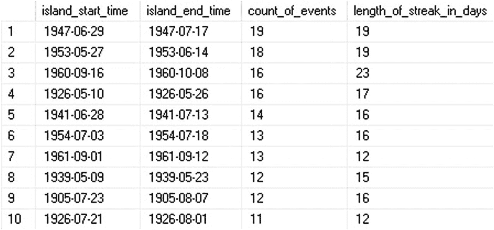

`图 9-8` 洋基队的连胜纪录，最长的记录位于列表顶部

我们可以看到最长的连胜发生在 1947 年 6 月 29 日至 7 月 17 日，历时 18 天，跨越了 19 场比赛。如果在`CTE_ISLAND_START`和`CTE_ISLAND_END`中将`W`替换为`L`，我们就可以返回洋基队的最长连败纪录，如`图 9-9`所示。

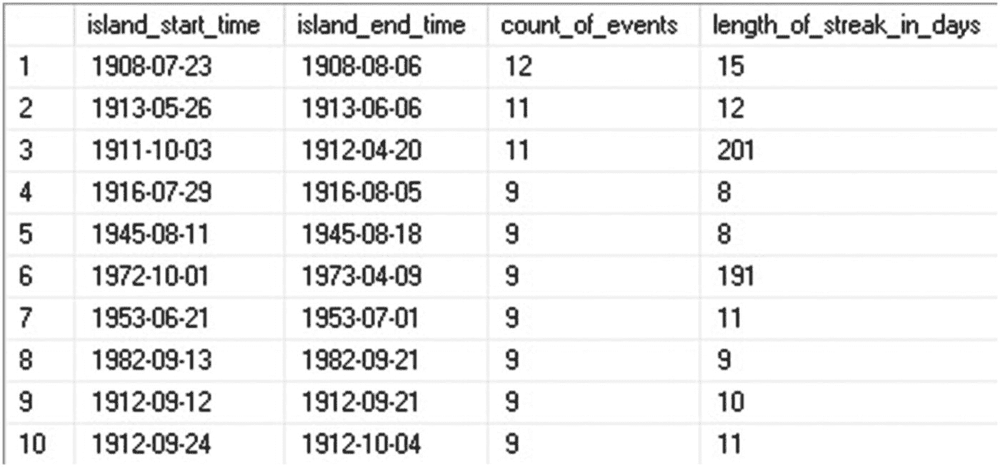

`图 9-9` 洋基队的连败纪录，最长的记录位于列表顶部

## 跨分区数据集的连胜/连败

虽然确定一支球队对阵所有对手的连胜或连败很有用，但我们可能想知道一支球队对阵其他各支球队的单独表现。这就引入了一个新的挑战：在应用空隙/岛屿分析返回每个对手球队的结果时，需要对数据进行分区。

这可以通过创建一个球队列表并逐个迭代来轻松完成。但这种方法速度较慢，并且缺乏我们目前流程所展现的创造性。另一种方法是调整窗口函数的使用方式，使其不仅按日期和 ID 排序，还按对手球队进行分区。

让我们考虑波士顿红袜队对阵美国职业棒球大联盟其他各支球队的连胜纪录。要计算对阵任何单支球队的最长连胜，我们需要对代码进行以下调整：

1.  按对手球队对所有窗口函数进行分区。
2.  将对手球队添加到`GAME_LOG`公共表表达式中。
3.  在选择最终数据集时，除了岛屿编号外，还需按对手球队进行连接。

`代码清单 9-8`展示了我们修改后的查询，该查询将返回对阵任何给定对手球队的连胜/连败。


```
WITH GAME_LOG AS (
SELECT
CASE WHEN (HomeScore > VisitingScore AND HomeTeamName = 'BOS') OR (VisitingScore > HomeScore AND VisitingTeamName = 'BOS') THEN 'W'
WHEN (HomeScore > VisitingScore AND VisitingTeamName = 'BOS') OR (VisitingScore > HomeScore AND HomeTeamName = 'BOS') THEN 'L'
WHEN VisitingScore = HomeScore THEN 'T'
END AS result,
LAG(CASE WHEN (HomeScore > VisitingScore AND HomeTeamName = 'BOS') OR (VisitingScore > HomeScore AND VisitingTeamName = 'BOS') THEN 'W'
WHEN (HomeScore > VisitingScore AND VisitingTeamName = 'BOS') OR (VisitingScore > HomeScore AND HomeTeamName = 'BOS') THEN 'L'
WHEN VisitingScore = HomeScore THEN 'T' END) OVER (PARTITION BY CASE WHEN VisitingTeamName = 'BOS' THEN HomeTeamName ELSE VisitingTeamName END
ORDER BY GameLog.GameDate, GameLog.GameLogId) AS previous_game_result,
LEAD(CASE WHEN (HomeScore > VisitingScore AND HomeTeamName = 'BOS') OR (VisitingScore > HomeScore AND VisitingTeamName = 'BOS') THEN 'W'
WHEN (HomeScore > VisitingScore AND VisitingTeamName = 'BOS') OR (VisitingScore > HomeScore AND HomeTeamName = 'BOS') THEN 'L'
WHEN VisitingScore = HomeScore THEN 'T' END) OVER (PARTITION BY CASE WHEN VisitingTeamName = 'BOS' THEN HomeTeamName ELSE VisitingTeamName END
ORDER BY GameLog.GameDate, GameLog.GameLogId) AS next_game_result,
ROW_NUMBER() OVER (PARTITION BY CASE WHEN VisitingTeamName = 'BOS' THEN HomeTeamName ELSE VisitingTeamName END ORDER BY GameLog.GameDate, GameLog.GameLogId) AS island_location,
CASE WHEN VisitingTeamName = 'BOS' THEN HomeTeamName ELSE VisitingTeamName END AS opposing_team,
GameLog.GameDate,
GameLog.GameLogId
FROM dbo.GameLog
WHERE GameLog.GameType = 'REG'
AND GameLog.HomeTeamName = 'BOS' OR GameLog.VisitingTeamName = 'BOS'),
CTE_ISLAND_START AS (
SELECT
ROW_NUMBER() OVER (PARTITION BY GAME_LOG.opposing_team ORDER BY GAME_LOG.GameDate, GAME_LOG.GameLogId) AS island_number,
GAME_LOG.GameDate AS island_start_time,
GAME_LOG.island_location AS island_start_location,
GAME_LOG.opposing_team
FROM GAME_LOG
WHERE GAME_LOG.result = 'W'
AND (GAME_LOG.previous_game_result <> 'W' OR GAME_LOG.previous_game_result IS NULL)),
CTE_ISLAND_END AS (
SELECT
ROW_NUMBER() OVER (PARTITION BY GAME_LOG.opposing_team ORDER BY GAME_LOG.GameDate, GAME_LOG.GameLogId) AS island_number,
GAME_LOG.GameDate AS island_end_time,
GAME_LOG.island_location AS island_end_location,
GAME_LOG.opposing_team
FROM GAME_LOG
WHERE GAME_LOG.result = 'W'
AND (GAME_LOG.next_game_result <> 'W' OR GAME_LOG.next_game_result IS NULL))
SELECT
CTE_ISLAND_START.island_start_time,
CTE_ISLAND_START.opposing_team,
CTE_ISLAND_END.island_end_time,
CTE_ISLAND_END.island_end_location - CTE_ISLAND_START.island_start_location + 1 AS count_of_events,
DATEDIFF(DAY, CTE_ISLAND_START.island_start_time, CTE_ISLAND_END.island_end_time) + 1 AS length_of_streak_in_days
FROM CTE_ISLAND_START
INNER JOIN CTE_ISLAND_END
ON CTE_ISLAND_START.island_number = CTE_ISLAND_END.island_number
AND CTE_ISLAND_START.opposing_team = CTE_ISLAND_END.opposing_team
ORDER BY CTE_ISLAND_END.island_end_location - CTE_ISLAND_START.island_start_location DESC;
```

### **清单 9-8：** 计算一支球队对阵每个对手的所有连胜记录的 T-SQL

对我们的初始通用表表达式进行进一步的数据分区增加了复杂性，但后续代码与我们之前编写的非常相似。图 9-10 展示了这种分区数据集以及其结果与我们之前连胜计算的区别。

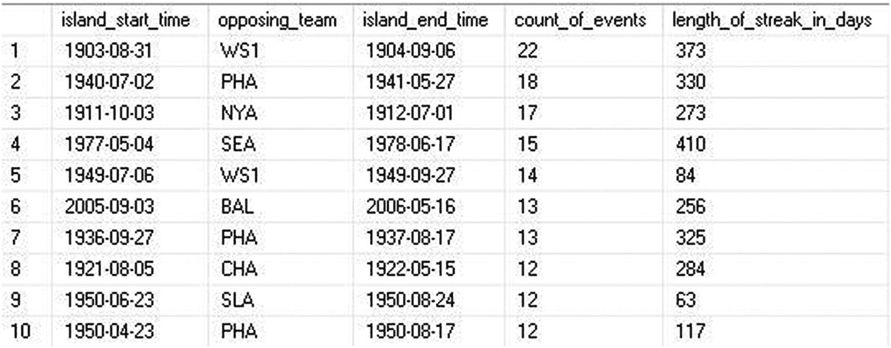

#### **图 9-10：** 红袜队对阵每个对手的连胜记录

我们可以看到，红袜队对阵华盛顿参议员队曾有过连续 22 场胜利的记录，这一壮举跨越了一年多的时间！通过按对手团队对数据集进行分区，我们不再将所有比赛作为一个集合来分析，而是将对阵每个其他团队的比赛作为一组集合来分析。

这种技术可用于隔离数据集中的模式，并了解在不同挑战下表现如何变化。有时，一个连胜记录会被大量其他数据和时间所分隔，如果不将其从噪音中隔离出来，可能不会立即显现。

我们可以将分析更进一步，在单个查询中计算所有球队对阵所有其他球队的所有连胜记录。这消除了硬编码团队名称的需要，并将为我们获得大量额外数据——前提是我们想同时为所有团队收集这些数据。清单 9-9 展示了如何实现这一点。需要更多的 T-SQL，但其中没有比我们迄今为止已经演示过的更复杂的部分。

```
WITH GAME_LOG AS (
SELECT
CASE WHEN HomeScore > VisitingScore THEN 'W'
WHEN VisitingScore > HomeScore THEN 'L'
WHEN HomeScore = VisitingScore THEN 'T'
END AS result,
VisitingTeamName AS opposing_team,
HomeTeamName AS team_to_trend,
GameLog.GameDate,
GameLog.GameLogId
FROM dbo.GameLog
WHERE GameLog.GameType = 'REG'
UNION ALL
SELECT
CASE WHEN VisitingScore > HomeScore THEN 'W'
WHEN HomeScore > VisitingScore THEN 'L'
END AS result,
HomeTeamName AS opposing_team,
VisitingTeamName AS team_to_trend,
GameLog.GameDate,
GameLog.GameLogId
FROM dbo.GameLog
WHERE GameLog.GameType = 'REG'
AND VisitingScore <> HomeScore),
GAME_LOG_ORDERED AS (
SELECT
GAME_LOG.GameLogId,
GAME_LOG.GameDate,
GAME_LOG.team_to_trend,
GAME_LOG.opposing_team,
GAME_LOG.result,
LAG(GAME_LOG.result) OVER (PARTITION BY team_to_trend, opposing_team ORDER BY GAME_LOG.GameDate, GAME_LOG.GameLogId) AS previous_game_result,
LEAD(GAME_LOG.result) OVER (PARTITION BY team_to_trend, opposing_team ORDER BY GAME_LOG.GameDate, GAME_LOG.GameLogId) AS next_game_result,
ROW_NUMBER() OVER (PARTITION BY team_to_trend, opposing_team ORDER BY GAME_LOG.GameDate, GAME_LOG.GameLogId) AS island_location
FROM GAME_LOG),
CTE_ISLAND_START AS (
SELECT
ROW_NUMBER() OVER (PARTITION BY GAME_LOG_ORDERED.team_to_trend, GAME_LOG_ORDERED.opposing_team ORDER BY GAME_LOG_ORDERED.GameDate, GAME_LOG_ORDERED.GameLogId) AS island_number,
GAME_LOG_ORDERED.GameDate AS island_start_time,
GAME_LOG_ORDERED.island_location AS island_start_location,
GAME_LOG_ORDERED.opposing_team,
GAME_LOG_ORDERED.team_to_trend
FROM GAME_LOG_ORDERED
WHERE GAME_LOG_ORDERED.result = 'W'
AND (GAME_LOG_ORDERED.previous_game_result <> 'W' OR GAME_LOG_ORDERED.previous_game_result IS NULL)),
CTE_ISLAND_END AS (
SELECT
ROW_NUMBER() OVER (PARTITION BY GAME_LOG_ORDERED.team_to_trend, GAME_LOG_ORDERED.opposing_team ORDER BY GAME_LOG_ORDERED.GameDate, GAME_LOG_ORDERED.GameLogId) AS island_number,
GAME_LOG_ORDERED.GameDate AS island_end_time,
GAME_LOG_ORDERED.island_location AS island_end_location,
GAME_LOG_ORDERED.opposing_team,
GAME_LOG_ORDERED.team_to_trend
FROM GAME_LOG_ORDERED
WHERE GAME_LOG_ORDERED.result = 'W'
AND (GAME_LOG_ORDERED.next_game_result <> 'W' OR GAME_LOG_ORDERED.next_game_result IS NULL))
SELECT
CTE_ISLAND_START.island_start_time,
CTE_ISLAND_START.team_to_trend,
CTE_ISLAND_START.opposing_team,
CTE_ISLAND_END.island_end_time,
CTE_ISLAND_END.island_end_location - CTE_ISLAND_START.island_start_location + 1 AS count_of_events,
DATEDIFF(DAY, CTE_ISLAND_START.island_start_time, CTE_ISLAND_END.island_end_time) + 1 AS length_of_streak_in_days
FROM CTE_ISLAND_START
INNER JOIN CTE_ISLAND_END
ON CTE_ISLAND_START.island_number = CTE_ISLAND_END.island_number
AND CTE_ISLAND_START.opposing_team = CTE_ISLAND_END.opposing_team
AND CTE_ISLAND_START.team_to_trend = CTE_ISLAND_END.team_to_trend
ORDER BY CTE_ISLAND_END.island_end_location - CTE_ISLAND_START.island_start_location DESC;
```

### **清单 9-9：** 计算所有球队对阵所有其他球队的连胜记录的查询


为了总结我们的研究发现，我们需要将比赛结果转换为一个一维数据集，其中仅体现一支队伍与另一支队伍的对决，而不区分主客场。为此，我们使用第一个`CTE`将比赛数据展平为一组统一的比赛记录。我们谨慎地只计算一次平局，否则可能会扭曲结果。

第二个`CTE`接收这些数据，并应用`LAG`、`LEAD`和`ROW_NUMBER`函数，为连续区间的分析提供基础。我们查询的其余部分类似于之前，但增加了一个`JOIN`操作，以确保我们能根据趋势球队、对手球队和区间编号来编译连胜记录。这个扩展分析的结果可以在图 9-11 中找到。

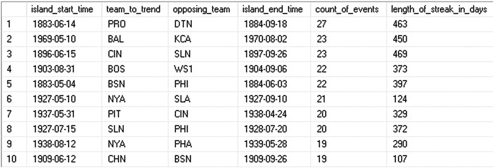

**图 9-11**

各队对阵所有对手球队的连胜记录

我们可以看到，历史上任何一支队伍对阵另一支队伍的最长连胜发生在 1883 年至 1884 年间，由底特律狼獾队对阵普罗维登斯灰队。红袜队早先的 22 场连胜在该列表中排名第四。

我们能完成的最终任务是确定如列表 9-10 所示所有球队的整体最长连胜记录，而不是针对某支队伍对阵特定对手的情况。这将是一个极其相似的过程，并将突出展示一致的编码实践如何使我们能够重用相当多的`TSQL`，并减少在此过程中出错的机会。

```
WITH GAME_LOG AS (
    SELECT
        CASE WHEN HomeScore > VisitingScore THEN 'W'
             WHEN VisitingScore > HomeScore THEN 'L'
             WHEN HomeScore = VisitingScore THEN 'T'
        END AS result,
        VisitingTeamName AS opposing_team,
        HomeTeamName AS team_to_trend,
        GameLog.GameDate,
        GameLog.GameLogId
    FROM dbo.GameLog
    WHERE GameLog.GameType = 'REG'
    UNION ALL
    SELECT
        CASE WHEN VisitingScore > HomeScore THEN 'W'
             WHEN HomeScore > VisitingScore THEN 'L'
        END AS result,
        HomeTeamName AS opposing_team,
        VisitingTeamName AS team_to_trend,
        GameLog.GameDate,
        GameLog.GameLogId
    FROM dbo.GameLog
    WHERE GameLog.GameType = 'REG'
        AND VisitingScore  HomeScore),
GAME_LOG_ORDERED AS (
    SELECT
        GAME_LOG.GameLogId,
        GAME_LOG.GameDate,
        GAME_LOG.team_to_trend,
        GAME_LOG.result,
        LAG(GAME_LOG.result) OVER (PARTITION BY team_to_trend ORDER BY GAME_LOG.GameDate, GAME_LOG.GameLogId) AS previous_game_result,
        LEAD(GAME_LOG.result) OVER (PARTITION BY team_to_trend ORDER BY GAME_LOG.GameDate, GAME_LOG.GameLogId) AS next_game_result,
        ROW_NUMBER() OVER (PARTITION BY team_to_trend ORDER BY GAME_LOG.GameDate, GAME_LOG.GameLogId) AS island_location
    FROM GAME_LOG),
CTE_ISLAND_START AS (
    SELECT
        ROW_NUMBER() OVER (PARTITION BY GAME_LOG_ORDERED.team_to_trend ORDER BY GAME_LOG_ORDERED.GameDate, GAME_LOG_ORDERED.GameLogId) AS island_number,
        GAME_LOG_ORDERED.GameDate AS island_start_time,
        GAME_LOG_ORDERED.island_location AS island_start_location,
        GAME_LOG_ORDERED.team_to_trend
    FROM GAME_LOG_ORDERED
    WHERE GAME_LOG_ORDERED.result = 'W'
        AND (GAME_LOG_ORDERED.previous_game_result  'W' OR GAME_LOG_ORDERED.previous_game_result IS NULL)),
CTE_ISLAND_END AS (
    SELECT
        ROW_NUMBER() OVER (PARTITION BY GAME_LOG_ORDERED.team_to_trend ORDER BY GAME_LOG_ORDERED.GameDate, GAME_LOG_ORDERED.GameLogId) AS island_number,
        GAME_LOG_ORDERED.GameDate AS island_end_time,
        GAME_LOG_ORDERED.island_location AS island_end_location,
        GAME_LOG_ORDERED.team_to_trend
    FROM GAME_LOG_ORDERED
    WHERE GAME_LOG_ORDERED.result = 'W'
        AND (GAME_LOG_ORDERED.next_game_result  'W' OR GAME_LOG_ORDERED.next_game_result IS NULL))
SELECT
    CTE_ISLAND_START.island_start_time,
    CTE_ISLAND_START.team_to_trend,
    CTE_ISLAND_END.island_end_time,
    CTE_ISLAND_END.island_end_location - CTE_ISLAND_START.island_start_location + 1 AS count_of_events,
    DATEDIFF(DAY, CTE_ISLAND_START.island_start_time, CTE_ISLAND_END.island_end_time) + 1 AS length_of_streak_in_days
FROM CTE_ISLAND_START
INNER JOIN CTE_ISLAND_END
    ON CTE_ISLAND_START.island_number = CTE_ISLAND_END.island_number
    AND CTE_ISLAND_START.team_to_trend = CTE_ISLAND_END.team_to_trend
ORDER BY CTE_ISLAND_END.island_end_location - CTE_ISLAND_START.island_start_location DESC;
```
**列表 9-10**
计算所有球队整体连胜记录的查询

为了计算整体连胜记录，我们从`JOIN`和窗口函数中移除了对`opposing_team`的引用，并让`SQL Server`处理其余部分。图 9-12 显示了这些更改的结果。

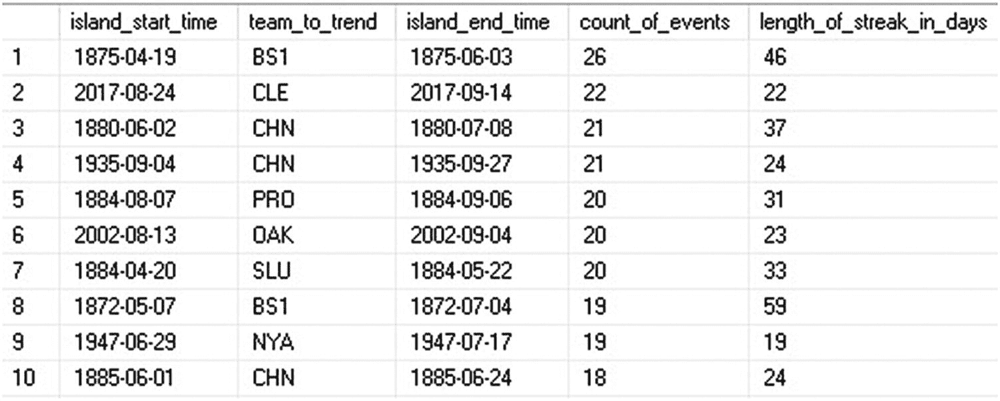

**图 9-12**

历史上最长的整体连胜记录

我们可以看到，历史上最长的连胜记录是 1875 年由波士顿红袜队创造的，而下一个最长的连胜记录发生在 142 年后，由克利夫兰印第安人队创造。由于我们进行的是对阵所有其他球队的分析，对手球队已从结果中移除。

## 数据质量

在基于连续区间进行数据分析之前，我们需要仔细考虑底层数据的质量。因为我们将数据集分区并排序为不同的端点，一个错误的数据点可能会打乱集合内剩余的数据。如果我们不事先测试，可能会有多种情况使分析失效，这些情况值得在此简要讨论。

### 空值

考虑我们之前对棒球比分的分析。我们通过比较比分来计算结果，从而分配“W”表示胜利，“L”表示失败，“T”表示平局。如果一个比分为`NULL`会怎样？我们的相等操作将无法返回预期结果，我们的分析也会被破坏。

列表 9-11 提供了一个查询，该查询将单场比赛的比分更新为`NULL`。

```
UPDATE GameLog
SET HomeScore = null,
    VisitingScore = null
FROM GameLog
WHERE GameLogID = 209967;
```
**列表 9-11**
为数据质量测试设置比分为`NULL`

该行对应于 1875 年 7 月 7 日波士顿的比赛。图 9-13 显示了在我们将一行比分为`NULL`之前和之后波士顿的连胜记录。

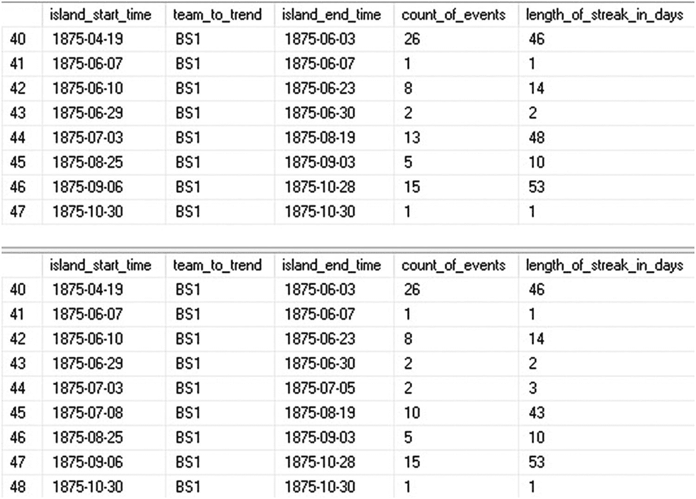

**图 9-13**
波士顿红袜队在设置`NULL`值前后的连胜记录

`NULL`值的出现导致通过将一场连胜分裂为两部分而创建了一个新的数据区间。这是一个相当良性的结果，只在一个位置导致了坏数据，但并未破坏我们的整个数据集。如果更基本的指标包含`NULL`，例如`GameType`，我们可能会在结果中看到更广泛的无效数据。

### 意外或无效值

如同任何数据分析一样，我们经常会遇到可能影响我们工作的垃圾数据。日期字段常包含“1/1/1900”作为虚拟值，字符串可能包含空格，而本应为正整数的字段可能包含-1。虽然我们可以在遇到坏数据时尝试验证和纠正，但我们也应编写能尽可能防范它的查询，这样我们的分析才不会被单个异常条目破坏。以下是管理这些场景的一些建议：

*   使用`CASE`语句时，要么包含一个捕获所有情况的`ELSE`子句，要么在`WHEN`子句集合中涵盖所有可能的选项。
*   考虑在分析之前过滤掉坏数据。这消除了需要为其编写特殊处理代码的麻烦，并且可以在稍后将问题的存在告知相关方。
*   如果坏数据可能被创建并传入你的系统，请在报告中加以说明，以便其使用者了解其存在和局限性。
*   如果可以容忍，修复坏数据。例如，如果我们知道任何`NULL`或小于零的值都应为零，那么我们可以在分析前将其修复，从而消除问题。


### 重复数据

在我们的分析中，重复数据是通过窗口函数进行管理的。确保重复数据被正确处理的关键在于，确保每个窗口函数内的`ORDER BY`子句能产生一个唯一的排序。

这要求在整个查询中依赖一个主键或可替换键。例如，本章前面提到的`error_log`数据，在除错误时间外的所有`ORDER BY`子句中都使用了一个唯一的整数主键。这确保了我们的数据首先按日期时间排序，但如果两个错误同时发生，则会进一步按主键排序。

在我们的棒球数据中，我们使用了`log`表中的整数主键来确保所有查询中的排序都是唯一的。如果不存在唯一的列，那么请考虑使用一组列构成一个可替换键，以便有效地对数据进行排序。

一个数据集必须拥有一个唯一的列或一组列，才能准确地执行间隙/孤岛分析。

如果不存在唯一的列或列组合，那么我们的数据就存在一个根本性问题，这可能会使我们的间隙/孤岛分析无效。如果这项分析是必要的，那么最佳解决方案是添加一个新的唯一列，比如一个标识列，以确保我们在分析数据集时能唯一地标记每一行。

一般来说，没有主键的数据集分析起来具有挑战性，但对于许多类型的分析（如间隙/孤岛），如果没有主键，我们就无法保证能够一致地准确返回结果。

## 性能

窗口函数能够生成一些在 T-SQL 中难以用其他方法返回的独特指标。与所有分析过程一样，性能将取决于分析前需要扫描的数据量。计算单支球队在 1 万行数据上的连胜场次需要扫描 1 万行数据。对于一个包含十亿行的数据集进行同样的操作，则需要读取所有十亿行数据。我们可以通过重新考虑数据集本身以及我们访问它的方式来管理和提升性能。

以下是一些选项，当在大型数据集上执行间隙/孤岛分析时，如果性能不足，这些选项有助于提升性能：

1.  针对一个 OLAP/报告数据库。任何大规模分析在针对具有高事务性工作负载的数据库运行时都会引起资源竞争。请考虑使用由复制、AlwaysOn、ETL、日志传送或其他数据复制过程支持的报告环境，这些过程将分析工作负载与事务性工作负载分离。

2.  如果这些查询必须在 OLTP 环境中运行，请在非高峰时段或其他进程运行较少时运行它们。

3.  每个查询开始时的基础筛选器会减少需要分析的数据量。对这些筛选器中的列进行索引，将确保您不会读取任何满足查询所不需要的额外数据。这使得数据可以被切分成更窄的集合，这些集合可以独立于数据集的其余部分进行单独分析。

4.  增量数据加载可以大大减少满足定期请求的分析所需的数据量。如果间隙/孤岛是按天计算的，那么只需要重新计算前一天的指标即可得到结果。唯一需要注意的是，要从上一个已知的间隙或孤岛的结束点开始分析。这确保了报告期开始时正在进行的事件被完整地报告为一个单一事件，而不是被一次数据加载的结束和下一次加载的开始分割成两个事件。

5.  自动化分析，使这些任务能够无人值守地执行，并将结果存储在表中以供将来检查。如果间隙/孤岛分析的结果被放入一个永久性存储库，那么未来的报告只需读取该表，而不必每次需要时都执行复杂的查询。

## 总结

像`LEAD`、`LAG`和`ROW_NUMBER`这样的窗口函数可以组合使用，从而能够对数据集执行各种各样的分析。在本章中，我们演示了它们在查找缺失数据、聚合相关事件以及计算不同类型连胜（或干旱期）中的应用。

我们还可以使用类似的方法收集许多其他指标。间隙和孤岛分析可用于对数据排序，并确定行在整个集合中与附近行的关系。它们可以让我们定位在大型/复杂表格集合中原本可能不明显的异常。

计算连胜（或干旱期）使我们能够将随时间推移的重要事件链条串联起来，但我们也可以考虑干旱期。重要事件之间的时间间隔是多长？经过长时间的干旱期后，事件发生的概率是否会增加？任何间隙分析也可以用来生成孤岛，反之，孤岛分析也可以用来生成间隙数据。在这方面，我们总可以将重要事件的存在和不存在都视为值得考虑的指标。

一旦我们构建了能够执行这些分析的查询，我们就可以以最小的改动重用我们的代码，来处理其他数据集、更改筛选器，或以完全不同的方式处理数据。通过试验筛选器和我们所使用的窗口函数的内容，这些分析的潜在应用是无限的！

