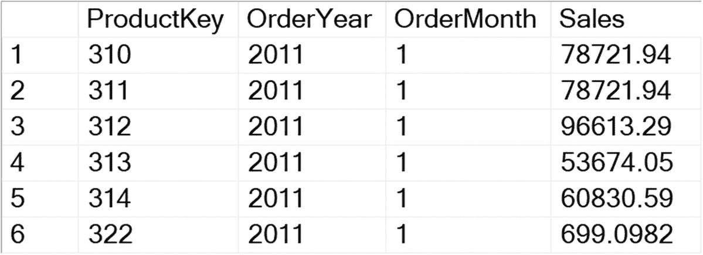
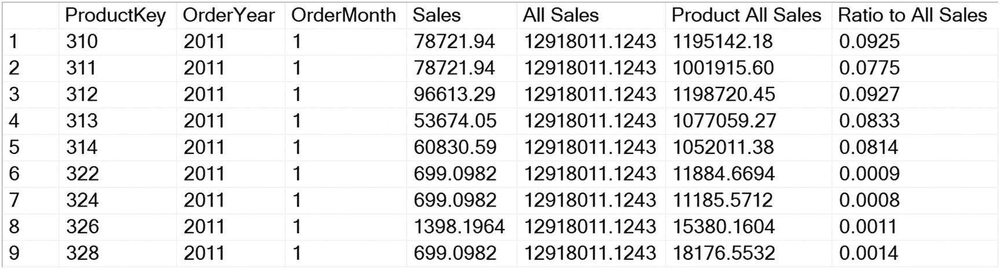
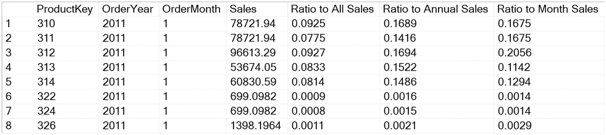
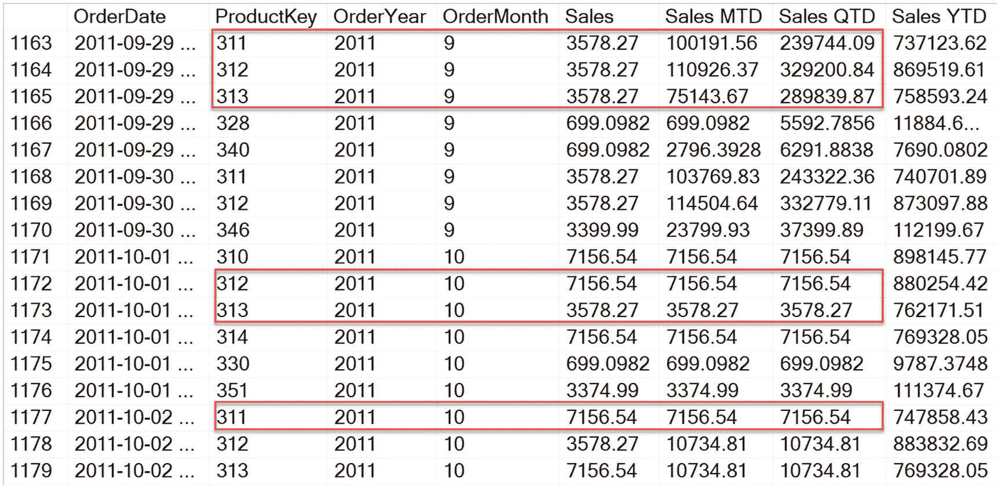
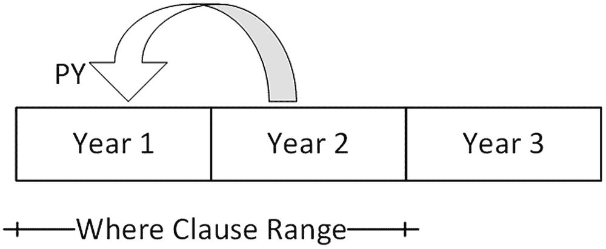
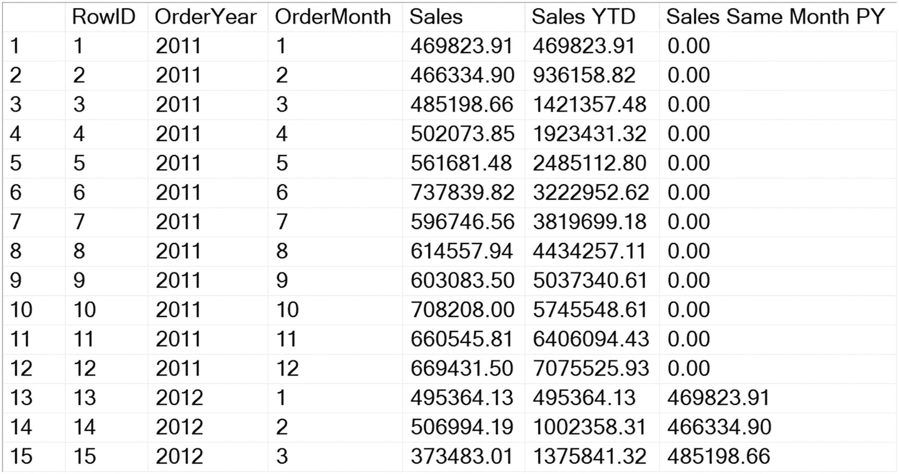
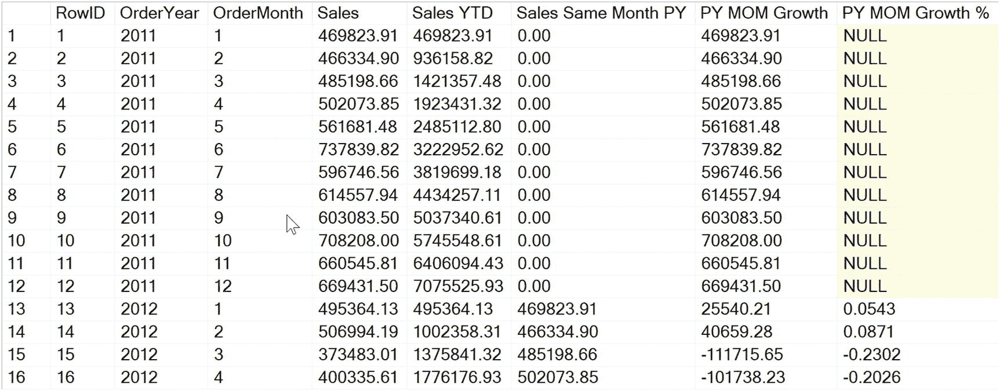
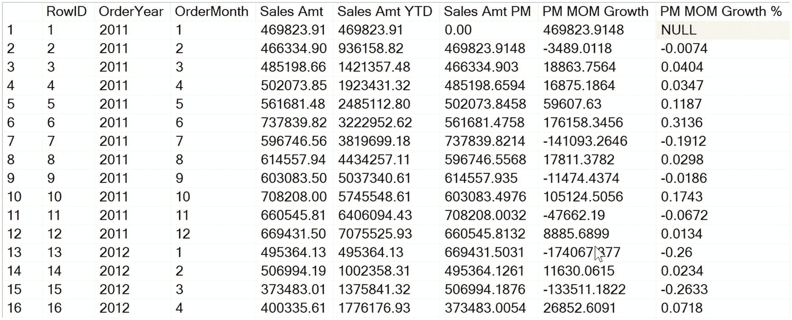

# 10. 时间范围计算

一个非常常见的报告需求是按不同的时间范围生成总计以进行比较。典型的报告将包含按月、季度和年的总计，有时还会与去年同期进行比较，或包含累计至今的月总计（MTD）和累计至今的年总计（YTD）。像 SQL Server Analysis Services 和 Power BI 这样的产品提供了导航日期层次结构的函数。使用 SQL Server 2012 或更高版本中的窗口函数，您可以利用本书前面提供的技术实现相同的计算。

在本章中，您将把之前学到的所有技术付诸实践，创建用于导航时间线的计算，以生成以下计算：

*   占父级百分比（Percent of Parent）
*   年初至今（Year-to-date, YTD）
*   季度初至今（Quarter-to-date, QTD）
*   月初至今（Month-to-date, MTD）
*   去年同期（Same Period Prior Year, SP PY）
*   去年年初至今（Prior year-to-date, PY YTD）
*   平均值、移动平均（MA）
*   增长、增长百分比

您已经在第 3 章学习了使用窗口聚合在不进行分组的情况下向查询添加汇总信息，在第 4 章学习了累积聚合，在第 5 章学习了窗口帧定义。您将把这些知识与一些常识结合起来，创建复杂的计算，如果没有窗口函数，这些计算将需要更多的步骤。

请记住，在累积聚合的情况下，`PARTITION BY` 和 `ORDER BY` 子句决定了哪些行最终进入窗口。`FRAME DEFINITION`（帧定义）用于定义分区内将被聚合的行的子集。本节中的示例将使用帧定义来完成繁重的工作。回顾一下，其语法如下：

```
() OVER([PARTITION BY [,,...]]
ORDER BY [,,...] [Frame definition])
```

在本章中，您需要使用 AdventureWorksDW 示例数据库。

## 父级百分比

将特定时期内产品的表现与该时期所有产品的表现进行比较，或将类别中的每个产品与该类别进行比较，是一种非常常见的分析技术。在接下来的这组示例中，你将基于清单 10-1 中的简单基础查询进行扩展，通过添加计算列来生成最终的“父级百分比”结果，如图 10-1 所示。你将从一个按月汇总销售的直接查询开始，并随着内容的介绍添加新的计算列，使得每个新列都能独立引入，而无需为每个迭代重复整个代码块示例。



**图 10-1** 我们简单基础查询的结果

```sql
--10.1 基础查询。只是一个普通的 GROUP BY。
SELECT f.ProductKey,
YEAR(f.orderdate) AS OrderYear,
MONTH(f.orderdate) AS OrderMonth,
SUM(f.SalesAmount) AS [Sales]
FROM dbo.FactInternetSales AS f
WHERE OrderDate BETWEEN '2011-01-01' AND '2012-12-31'
GROUP BY f.ProductKey,
YEAR(f.orderdate),
MONTH(f.orderdate)
ORDER BY 2, 3, f.ProductKey;
```

**清单 10-1** 基础查询

“父级百分比”或“父级比率”计算通常可以定义为“[子级总计] / [父级总计]”。为了计算定义的比率，你需要计算分子和分母输入，并在第三个度量中将它们组合起来。要计算每个产品对所有销售的总体贡献，你需要确定`[All Sales]`和`[Product All Sales]`的总计。一旦定义了这些，你就可以将`[Ratio to All Sales]`计算为`[Product All Sales] / [All Sales]`。你可以将得到的比率乘以 100 以百分比形式显示，或者依赖报表或前端工具的格式化功能将其显示为百分比。

对于这些度量中的每一个，窗口聚合`SUM()`函数都封装了一个常规的`SUM()`函数，一开始可能看起来有点奇怪，但这是将`[SalesAmount]`聚合到高于查询粒度级别所必需的。结果，如图 10-2 所示，是能够在单个查询中将同一源列聚合到不同级别，而无需借助临时表或公用表表达式。

清单 10-2 中的代码包含了你需要附加到基础查询的额外列逻辑，位置在`select`列表的最后一列之后。务必在`[Sales]`后面加上逗号。



**图 10-2** 计算产品销售额占所有销售额百分比的结果

```sql
SUM(SUM(f.SalesAmount)) OVER () AS [All Sales],
SUM(SUM(f.SalesAmount)) OVER (PARTITION BY f.productkey)
AS [Product All Sales],
SUM(SUM(f.SalesAmount)) OVER (PARTITION BY f.productkey)
/ SUM(SUM(f.SalesAmount)) OVER()
AS [Ratio to All Sales]
```

**清单 10-2** 用于`[All Sales]`的额外列

`[All Sales]`列的框架没有`PARTITION`子句，这意味着它将聚合查询可用的所有数据，提供所有时间的销售总计。此值对于结果表中的每一行都是相同的。`[Product All Sales]`列的`PARTITION`子句将分区限制为每个产品键的实例，提供按产品所有时间的销售总计。此值对于共享相同`[ProductKey]`值的所有行都是相同的。

`[Ratio to All Sales]`列结合了前两个语句来计算它们之间的比率。关键是要认识到，你可以在单个列中组合多个聚合结果。了解这一点将使你能够创建各种复杂的计算，而这些计算原本可能只能留在报表工具或应用程序代码中。用简单的术语写出计算逻辑是记录你想要实现目标的好方法，并为组合现有计算以形成新计算提供了模板。以下伪代码描述了将在 T-SQL 中实现的逻辑：

```sql
[Sales] = 按产品、年和月汇总的 SalesAmount
[All Sales] = 所有产品和所有日期的 SalesAmount 总和
[Annual Sales] = 按年汇总的所有产品的 SalesAmount 总和
[Month All Sales] = 按年和月汇总的所有产品的 SalesAmount 总和
[Product All Sales] = 按产品汇总的所有日期的 SalesAmount 总和
[Product Annual Sales] = 按产品和年汇总的 SalesAmount 总和
[Ratio to All Sales] = [Product All Sales] / [All Sales]
[Ratio to Annual Sales] = [Product Annual Sales] / [Annual Sales]
[Ratio to Month Sales] = [Sales] / [Month All Sales]
```

这种方法最有效的方式是，你首先为给定计算的每个输入列理清逻辑，然后创建利用输入列计算的复杂计算。年度和月级别的列计算遵循类似的模式，因此一旦你为一个级别理清了计算，其余的也会很快跟进。本章后面你将学习如何使用公用表表达式来简化复杂计算的创建。

无需担心在“全部”级别处理被零除错误，因为唯一会导致错误的情况是源表中完全没有行，但对于低于它的每个级别，你必须考虑分母值可能为零的情况。清单 10-3 中“年度”和“月”级别的计算演示了如何做到这一点。通过将窗口`SUM()`语句包装在`NULLIF()`函数中，任何零聚合值都会转换为`NULL`值，从而避免被零除错误。你也可以使用`CASE`语句代替`NULLIF()`，但考虑到所涉及的函数嵌套，`NULLIF()`更简洁。

```sql
--10.3 年度和月度父级百分比
SUM(SUM(f.SalesAmount))
OVER (PARTITION BY YEAR(f.OrderDate)) AS [Annual Sales],
SUM(SUM(f.SalesAmount))
OVER (PARTITION BY f.productkey, YEAR(f.OrderDate))
AS [Product Annual Sales],
--组内百分比:
--[Ratio to Annual Sales] = [Product Annual Sales] / [Annual Sales]
SUM(SUM(f.SalesAmount))
OVER (PARTITION BY f.productkey, YEAR(f.OrderDate))
/ NULLIF(SUM(SUM(f.SalesAmount))
OVER (PARTITION BY YEAR(f.OrderDate))
, 0) AS [Ratio to Annual Sales],
SUM(SUM(f.SalesAmount))
OVER (PARTITION BY YEAR(f.OrderDate), MONTH(f.OrderDate))
AS [Month All Sales],
SUM(SUM(f.SalesAmount))
OVER (PARTITION BY f.productkey, YEAR(f.OrderDate),
MONTH(f.OrderDate))
/ NULLIF(SUM(SUM(f.SalesAmount))
OVER (PARTITION BY YEAR(f.OrderDate), MONTH(f.OrderDate))
, 0) AS [Ratio to Month Sales]
```

**清单 10-3** 用于计算年度和月度父级百分比列的额外列

## 使用 CTE 简化计算

如果你想让代码更易于阅读、理解和维护，可以在一个公共表表达式（`CTE`）中一次性计算所有基本聚合，如列表 10-4 所示，然后在后续查询中执行二阶计算。使用`CTE`中命名的结果列，而不是之前使用的扩展逻辑列，可以显著提高代码的可读性。一旦为任何给定的组合计算推导出逻辑，你就可以注释掉或删除输入列，只返回你感兴趣的最终结果列，如图 10-3 所示。



图 10-3

列表 10-4 的结果

```
--10.4 父级百分比、年度和月度销售额
--重构以使用 CTE，使得最终的 SELECT 语句对凡人来说也清晰可读。
WITH CTE_Base
AS ( SELECT f.ProductKey,
YEAR(f.orderdate) AS OrderYear,
MONTH(f.orderdate) AS OrderMonth,
SUM(f.SalesAmount) AS [Sales],
SUM(SUM(f.SalesAmount)) OVER () AS [All Sales],
SUM(SUM(f.SalesAmount)) OVER (PARTITION BY f.productkey)
AS [Product All Sales],
SUM(SUM(f.SalesAmount))
OVER (PARTITION BY YEAR(f.OrderDate)) AS [Annual Sales],
SUM(SUM(f.SalesAmount))
OVER (PARTITION BY YEAR(f.OrderDate), MONTH(f.OrderDate))
AS [Month All Sales],
SUM(SUM(f.SalesAmount))
OVER (PARTITION BY f.productkey, YEAR(f.OrderDate))
AS [Product Annual Sales]
FROM dbo.FactInternetSales AS f
WHERE OrderDate BETWEEN '2011-01-01' AND '2012-12-31'
GROUP BY f.ProductKey,
YEAR(f.orderdate),
MONTH(f.orderdate)
)
SELECT ProductKey,
OrderYear,
OrderMonth,
[Sales],
[Product All Sales] / [All Sales] AS [Ratio to All Sales],
[Product Annual Sales] / NULLIF([Annual Sales], 0)
AS [Ratio to Annual Sales],
[Sales] / NULLIF([Month All Sales], 0) AS [Ratio to Month Sales]
FROM CTE_Base
ORDER BY OrderYear,
OrderMonth,
ProductKey;
```
列表 10-4
针对 `[SalesAmount]` 的包含父级百分比计算的基本查询

## 期间至今计算

期间至今（Period-to-date）计算是财务报告的主要内容，但众所周知，在不借助多个`CTE`或临时表的情况下，很难将其整合到基于查询的报告中。通常，分组是在`SQL Server Reporting Services`或`Excel`等报告工具中执行的，以提供聚合结果，但这仍然可能很棘手。你将通过接下来的示例学习如何通过在`ORDER BY`子句后添加一个`FRAME`子句，在单个结果集中创建多级滚动总计。`FRAME`子句在第 5 章有更详细的介绍。

列表 10-5 演示了如何使用帧定义来按日期、按产品计算月份、季度和年份的期间至今总计。基本查询与之前基本相同，但粒度级别是日期级别而不是月份级别。这样你就可以更详细地查看聚合列的结果。

```
--10.5 日级别聚合，包含 MTD、QTD、YTD 的滚动总计
SELECT f.OrderDate,
f.ProductKey,
YEAR(f.orderdate) AS OrderYear,
MONTH(f.orderdate) AS OrderMonth,
SUM(f.SalesAmount) AS [Sales],
SUM(SUM(f.SalesAmount))
OVER(PARTITION BY f.productkey, YEAR(f.orderdate),
MONTH(f.orderdate)
ORDER BY f.productkey, f.orderdate
ROWS BETWEEN UNBOUNDED PRECEDING AND CURRENT ROW
) AS [Sales MTD],
SUM(SUM(f.SalesAmount))
OVER(PARTITION BY f.productkey, YEAR(f.orderdate),
DATEPART(QUARTER, f.OrderDate)
ORDER BY f.productkey, YEAR(f.orderdate), MONTH(f.orderdate)
ROWS BETWEEN UNBOUNDED PRECEDING AND CURRENT ROW
) AS [Sales QTD],
SUM(SUM(f.SalesAmount))
OVER(PARTITION BY f.productkey, YEAR(f.orderdate)
ORDER BY f.productkey, f.orderdate
ROWS BETWEEN UNBOUNDED PRECEDING AND CURRENT ROW
) AS [Sales YTD],
SUM(SUM(f.SalesAmount))
OVER(PARTITION BY f.productkey
ORDER BY f.productkey, f.orderdate
ROWS BETWEEN UNBOUNDED PRECEDING AND CURRENT ROW
) AS [Sales Running Total]
FROM dbo.FactInternetSales AS f
GROUP BY f.orderdate, f.ProductKey, YEAR(f.orderdate), MONTH(f.orderdate)
ORDER BY f.ProductKey, f.OrderDate;
```
列表 10-5
按日期计算期间至今运行总计

列表 10-5 所示的 `OVER` 子句示例使用了 `ROWS BETWEEN UNBOUNDED PRECEDING AND CURRENT ROW` 帧。这导致计算聚合从帧的开始到当前行的所有行，为你提供在 `PARTITION` 子句中指定的级别的正确至今总计。例如，`[Sale Amt MTD]` 聚合列将计算从本月的第一天（第一个无界前置行）到当前行的 `SUM([SalesAmount])`。当使用 `FRAME` 子句时，`ORDER BY` 子句成为必需，为帧提供在 `PARTITION` 中按顺序遍历行的上下文。

图 10-4 显示了部分结果。列 [`Sales MTD], [Sales QTD]` 和 [`Sales YTD]` 的值会增加，直到遇到不同的 [`ProductKey]` 或 [`ProductKey]` 和时间级别（月份和季度）。图 10-4 中的结果显示聚合在第二季度末中断，因此通过查看 `[ProductKey]` 等于 311、312 或 313 的行，你可以看到 MTD 和 QTD 聚合在 10 月 1 日重置。



图 10-4

列表 10-5 在季度末（9 月 30 日）的部分结果

## 平均值和移动平均值


### 处理日期范围中的间隙

在进入更复杂的示例之前，你需要停下来思考一下处理日期时所面临的挑战。日期作为一种数据类型是连续且顺序的。处理日期的 T-SQL 函数在设计时考虑到了这一点，并能正确处理任何相关的日期运算。然而，实际上，基于日期的数据并不会是连续的。交易数据会出现间隙，可能某天、某周，甚至某个月或更长时间内没有数据。

窗口函数并不具备日期感知能力，因此你需要确保任何聚合计算都能正确处理数据中的间隙。如果你在日期范围或日期周期范围上使用 `LEAD()` 和 `LAG()` 窗口函数，你必须在结果集中提供根据计算需要而包含连续完整日期、月份、季度或年份的分区。未能做到这一点将导致结果不正确。原因在于 `LEAD()` 和 `LAG()` 函数是在查询的结果集上操作的，它会在结果集中向前或向后移动指定的行数，而不管这些行所代表的天数或月数。

例如，一个使用窗口函数错误实现的三个月移动平均值，就不会考虑到某个产品在特定月份没有数据的情况。它会在提供的数据上执行框架子集操作，并对前三个月的数据进行平均，而不考虑它们是否为连续的月份。清单 10-6 演示了不考虑日期范围中的间隙将如何导致错误或误导性的结果。在此示例中，通过移除任何对 `[OrderDate]` 的分组引用，将数据聚合到月份级别：

```sql
--10.6 处理日期间隙，月份级别：未处理间隙
SELECT ROW_NUMBER()
OVER(ORDER BY f.ProductKey, YEAR(f.OrderDate), MONTH(f.OrderDate))
AS [RowID],
f.ProductKey,
YEAR(f.OrderDate) AS OrderYear,
MONTH(f.OrderDate) AS OrderMonth,
ROUND(SUM(f.SalesAmount), 2) AS [Sales], -- 月份级别
ROUND(SUM(SUM(f.SalesAmount))
OVER(PARTITION BY f.ProductKey, YEAR(f.OrderDate)
ORDER BY f.ProductKey, YEAR(f.OrderDate), MONTH(f.OrderDate)
ROWS BETWEEN UNBOUNDED PRECEDING AND CURRENT ROW
), 2) AS [Sales YTD],
ROUND(AVG(SUM(f.SalesAmount))
OVER(PARTITION BY f.ProductKey
ORDER BY f.ProductKey, YEAR(f.OrderDate), MONTH(f.OrderDate)
ROWS BETWEEN 3 PRECEDING AND CURRENT ROW
),2) AS [3 Month Moving Avg]
FROM [dbo].[FactInternetSales] AS f
WHERE ProductKey = 332
AND f.OrderDate BETWEEN '2010-12-01' AND '2011-12-31'
GROUP BY f.ProductKey, YEAR(f.OrderDate), MONTH(f.OrderDate)
ORDER BY f.ProductKey ,YEAR(f.OrderDate), MONTH(f.OrderDate)
清单 10-6
错误地处理日期间隙
```

请注意图 10-5 中的结果，对于所选的时间范围，只显示了 9 个月。在包含无数据的月份范围上计算移动平均值会产生错误的结果。接下来，你将学习如何通过填补间隙来解决这个问题。


*图 10-5*
*移动平均值的错误计算*

为了解决这个问题，需要使用一个补充的“日期”表来填补交易数据中的间隙。这不是一个新问题，在数据仓库设计中通过包含一个“日期”维度表已经得到了解决，该表包含指定年份范围内每一天的一行。AdventureWorksDW 数据库包含一个 `DimDate` 表，将在以下示例中使用。如果你没有可用的日期维度，也可以使用公用表表达式 (CTE) 来创建一个日期维度表。使用日期值表比使用 CTE 性能要好得多。代码下载中包含一个 CTE 派生的日历维度视图示例。

在清单 10-7 中，`DimDate` 表与 `DimProduct` 表进行交叉连接，生成一个包含指定范围内所有日期所有产品的集合。生成的 CTE “表”被用作查询 SELECT 部分的主表，这样，即使某个产品在给定时间段内没有交易，范围内的每个日期也会在每个产品的聚合结果中得到体现。你还可以从产品表中获取其他属性，如产品类别、颜色等，以及从事实表中获取行计数和不同计数。这些可以用来创建额外的统计数据。在图 10-6 中，你可以看到添加了 `[ProductAlternateKey]`，并在所有分组操作中取代了 `[ProductKey]`，以使结果更易于用户理解。


*图 10-6*
*考虑销售数据间隙后的移动平均值*

```sql
--10.7 月份级别。现在处理交易日期间隙
WITH CTE_ProductPeriod
AS (
SELECT p.ProductKey, p.ProductAlternateKey as [ProductID],
Datekey, CalendarYear,
CalendarQuarter, MonthNumberOfYear AS CalendarMonth
FROM DimDate AS d
CROSS JOIN DimProduct p
WHERE d.FullDateAlternateKey BETWEEN '2011-01-01' AND '2013-12-31'
AND EXISTS(SELECT * FROM FactInternetSales f
WHERE f.ProductKey = p.ProductKey
AND f.OrderDate BETWEEN '2011-01-01' AND '2013-12-31')
)
SELECT      ROW_NUMBER()
OVER(ORDER BY p.[ProductID],
p.CalendarYear,
p.CalendarMonth
) as [RowID],
p.[ProductID],
p.CalendarYear  AS OrderYear,
p.CalendarMonth AS OrderMonth,
ROUND(SUM(COALESCE(f.SalesAmount,0)), 2) AS [Sales],
ROUND(SUM(SUM(f.SalesAmount))
OVER(PARTITION BY p.[ProductID], p.CalendarYear
ORDER BY P.[ProductID], p.CalendarYear, p.CalendarMonth
ROWS BETWEEN UNBOUNDED PRECEDING AND CURRENT ROW
), 2) AS [Sales YTD],
ROUND(SUM(SUM(COALESCE(f.SalesAmount, 0)))
OVER(PARTITION BY p.[ProductID]
ORDER BY p.[ProductID], p.CalendarYear, p.CalendarMonth
ROWS BETWEEN 3 PRECEDING AND CURRENT ROW
) / 3, 2) AS [3 Month Moving Avg]
FROM CTE_ProductPeriod AS p
LEFT OUTER JOIN [dbo].[FactInternetSales]  AS f
ON p.ProductKey = f.ProductKey
AND p.DateKey = f.OrderDateKey
WHERE p.ProductKey = 332
AND p.CalendarYear =  2011
GROUP BY p.[ProductID], p.CalendarYear, p.CalendarMonth
ORDER BY p.[ProductID], p.CalendarYear, p.CalendarMonth
清单 10-7
正确处理日期间隙
```

比较前两个查询的结果。`[3 Month Moving Avg]` 列现在对于产品没有销售的月份（二月、三月、十一月）以及紧接空时间段之后的月份（五月、六月、十二月）都是正确的。第二个查询中的计算没有使用 `AVG()` 函数，而是将 `SUM()` 除以三来得出平均值。这确保了前三期的平均值更加准确。在接下来的部分中，你将学习在计算移动平均值时，如何将计算仅限制在完整的范围上。


### 同一时期上一年

作为提供期初至今计算的一部分，您还需要提供与上一年同一时期、同年上一时期的比较，很可能还要提供差额和差异百分比。这些汇总值的计算方式可以与您目前处理的项目相同：通过用简单的术语定义公式、在列级别确定输入计算，然后使用这些输入计算来构建输出列。

在此示例中，`[ProductKey]` 已从查询中移除，因此结果的粒度是月级别。这使您能更轻松地在较少的行数中看到新计算的效果。为了计算上一年的值，查询不能在 `WHERE` 子句中被限制在单一年份。`图 10-7` 显示，窗口函数要能够回溯到上一年，结果集中必须包含不止一年的数据。



`图 10-7` WHERE 子句必须覆盖先前范围的日期

`LAG()` 函数可以通过在记录集中回溯指定的行数来检索和汇总数据。它还有一个可选的默认参数，可用于在向后导航记录时没有可用行的情况下返回零值。`清单 10-8` 和 `图 10-8` 展示了这一点：



`图 10-8` 同一月份上一年

```
--10.8 同一月份，上一年
WITH CTE_ProductPeriod
AS (
SELECT p.ProductKey, --p.ProductAlternateKey as [ProductID],
Datekey, CalendarYear, CalendarQuarter,
MonthNumberOfYear AS CalendarMonth
FROM DimDate AS d
CROSS JOIN DimProduct p
WHERE d.FullDateAlternateKey BETWEEN '2011-01-01' AND '2013-12-31'
AND EXISTS(SELECT * FROM FactInternetSales f
WHERE f.ProductKey = p.ProductKey
AND f.OrderDate BETWEEN '2011-01-01' AND '2013-12-31')
)
SELECT
ROW_NUMBER()
OVER(ORDER BY p.CalendarYear, p.CalendarMonth) as [RowID],
p.CalendarYear AS OrderYear,
p.CalendarMonth AS OrderMonth,
ROUND(SUM(COALESCE(f.SalesAmount,0)), 2) AS [Sales],
ROUND(SUM(SUM(COALESCE(f.SalesAmount, 0)))
OVER(PARTITION BY p.CalendarYear
ORDER BY p.CalendarYear, p.CalendarMonth
ROWS BETWEEN UNBOUNDED PRECEDING AND CURRENT ROW
), 2) AS [Sales YTD],
ROUND(LAG(SUM(f.SalesAmount), 12 , 0)
OVER(ORDER BY p.CalendarYear, p.CalendarMonth),2)
as [Sales Same Month PY]
FROM CTE_ProductPeriod AS p
LEFT OUTER JOIN [dbo].[FactInternetSales] AS f
ON p.ProductKey = f.ProductKey
AND p.DateKey = f.OrderDateKey
GROUP BY p.CalendarYear, p.CalendarMonth
ORDER BY p.CalendarYear, p.CalendarMonth
```

`清单 10-8` 检索上一年同一月份的结果

### 增长与增长率计算

一旦您可以回溯并提取过去的某个值，就能非常轻松地计算这些值之间的差异。计算增长率（Percent Growth）的公认方法是 `([当前值] - [先前值]) / [先前值]`。如果您希望百分比值采用 "##.###" 的格式，还可以将结果乘以 100。将 `清单 10-9` 中的以下部分添加到 `清单 10-8` 的查询中，以合并新的计算并运行查询。您的结果应与 `图 10-9` 匹配。



`图 10-9` 增长：当月与上一年同一月份比较

```
-- [增长] = [本年值] - [上年值]
ROUND(SUM(COALESCE(f.SalesAmount,0))
- LAG(SUM(f.SalesAmount), 12, 0)
OVER(ORDER BY p.CalendarYear, p.CalendarMonth), 2)
as [PY MOM Growth],
-- [增长率] = ([本年值] - [上年值]) / [上年值]
(SUM(COALESCE(f.SalesAmount,0))
- LAG(SUM(f.SalesAmount), 12, 0)
OVER(ORDER BY p.CalendarYear, p.CalendarMonth)
) / nullif(LAG(SUM(f.SalesAmount), 12, 0 )
OVER(ORDER BY p.CalendarYear, p.CalendarMonth), 0)
as [PY MOM Growth %]
```

`清单 10-9` 增长：当月与上一年同一月份比较

相同的方法可用于确定上个月的值及其与当前月份的差值。添加 `清单 10-10` 中的代码并运行查询，以计算上个月的值、月环比增长和月环比增长率。`图 10-10` 中的表格显示了结果。



`图 10-10` 差异：当月与上个月比较

```
LAG(SUM(f.SalesAmount), 1, 0)
OVER(ORDER BY p.CalendarYear, p.CalendarMonth) as [Sales PM],
-- [增长] = [本月值] - [上月值]
SUM(COALESCE(f.SalesAmount,0))
- LAG(SUM(f.SalesAmount), 1, 0)
OVER(ORDER BY p.CalendarYear, p.CalendarMonth)
AS [MOM Growth],
-- [增长率] = ([本月值] - [上月值]) / [上月值]
(SUM(COALESCE(f.SalesAmount,0))
- LAG(SUM(f.SalesAmount), 1, 0)
OVER(ORDER BY p.CalendarYear, p.CalendarMonth))
/ NULLIF(LAG(SUM(f.SalesAmount), 1, 0 )
OVER(ORDER BY p.CalendarYear, p.CalendarMonth),0)
AS [MOM Growth %]
```

`清单 10-10` 增长：当月与上个月比较

## 总结

本章内容丰富，在先前所学概念的基础上，创建了用于基于时间的财务分析的复杂计算。其中一些计算过去在 T-SQL 中不易实现，更不用说在单个查询中完成。您了解了需要一致的时间线作为查询的主干，以及如何处理数据中的间隙。您学习了如何创建期初至今、同一时期上一年、上一年年初至今、与父级比率、移动平均值以及增长和增长率计算。

接下来，`第 11 章` 将教您如何利用这些技术来创建更有用的趋势计算。

