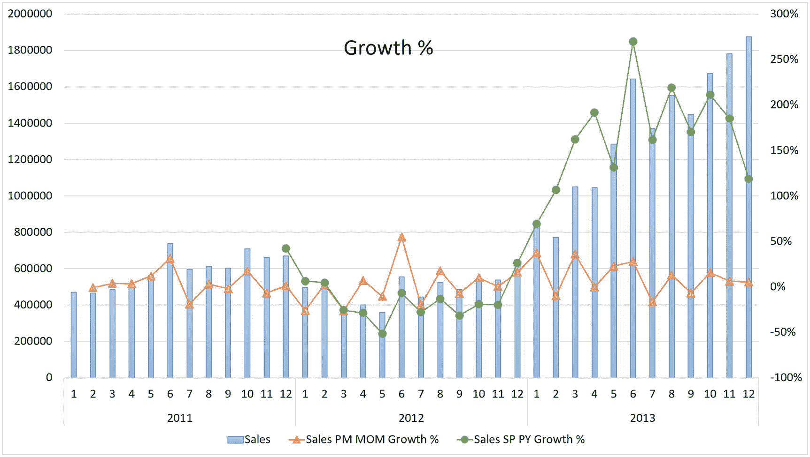
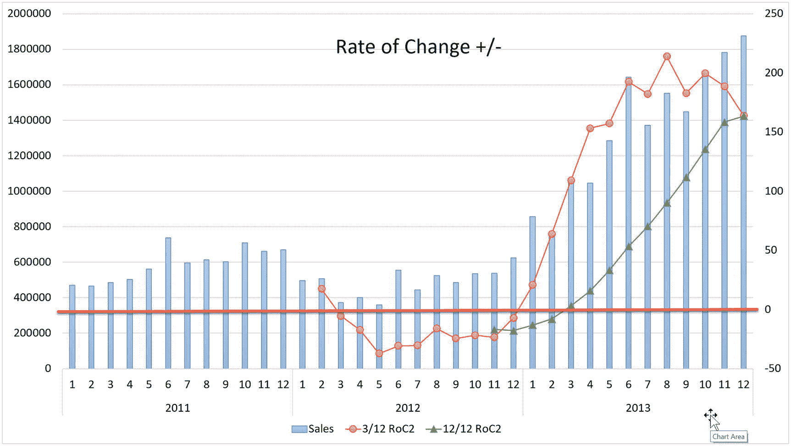
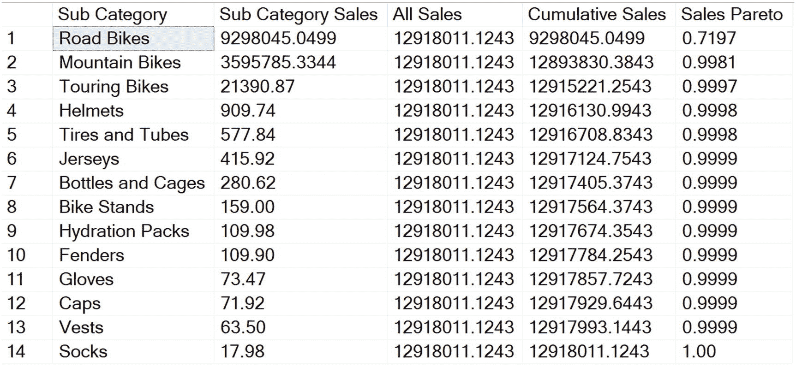
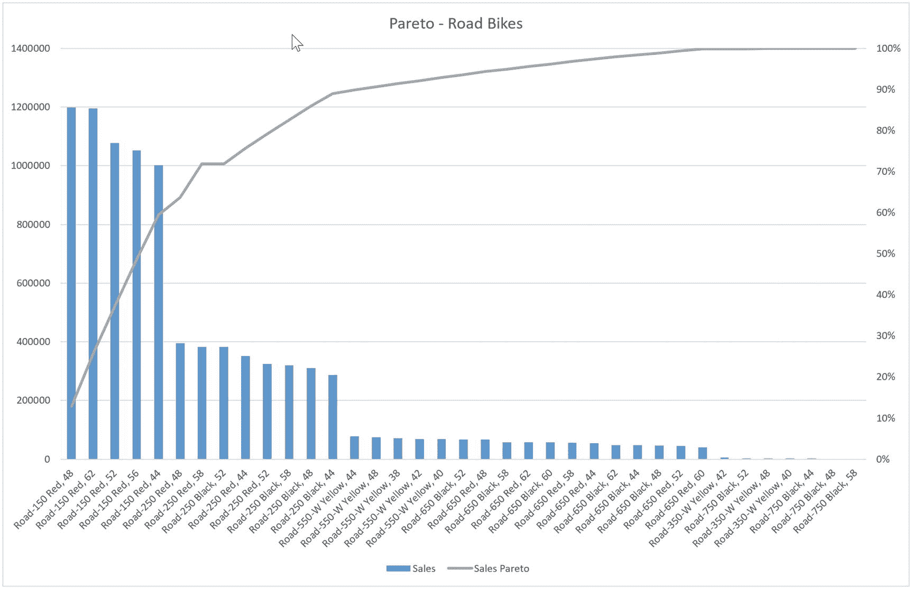

# 11.1 月度级别，无产品维度。处理数据空隙，全产品，三步操作查询

```sql
/* 11.1 月度级别，无产品维度。处理数据空隙，全产品，三步操作查询 */
WITH CTE_ProductPeriod /* 操作#1 生成产品周期框架 */
AS  (
SELECT `p.ProductKey`, `Datekey`,
`CalendarYear`, `CalendarQuarter`,
`MonthNumberOfYear` AS `CalendarMonth`
FROM `DimDate` AS d
CROSS JOIN `DimProduct` p
WHERE `d.FullDateAlternateKey` BETWEEN '2011-01-01' AND `GETDATE()`
AND EXISTS(SELECT * FROM `FactInternetSales` f
WHERE `f.ProductKey` = `p.ProductKey`
AND `f.OrderDate` BETWEEN '2011-01-01' AND `GETDATE()`)
),
CTE_MonthlySummary /* 操作#2 计算基础统计数据 */
AS (
SELECT `ROW_NUMBER`
OVER(ORDER BY `p.CalendarYear`, `p.CalendarMonth`) AS `[RowID]`,
`p.CalendarYear` AS `OrderYear`,
`p.CalendarMonth` AS `OrderMonth`,
count(distinct `f.SalesOrderNumber`) AS `[Order Count]`,
count(distinct `f.CustomerKey`) AS `[Customer Count]`,
ROUND(SUM(`COALESCE(f.SalesAmount,0)`), 2) AS `[Sales]`,
ROUND(SUM(SUM(`COALESCE(f.SalesAmount, 0)`)
OVER(PARTITION BY `p.CalendarYear`
ORDER BY `p.CalendarYear`, `p.CalendarMonth`
ROWS BETWEEN UNBOUNDED PRECEDING AND CURRENT ROW
), 2)
AS `[Sales YTD]`,
ROUND(`LAG(SUM(f.SalesAmount), 11, 0 )`
OVER(ORDER BY `p.CalendarYear`, `p.CalendarMonth`), 2)
AS `[Sales SP PY]`,
ROUND(`LAG(SUM(f.SalesAmount), 1, 0)`
OVER(ORDER BY `p.CalendarYear`, `p.CalendarMonth`), 2)
AS `[Sales PM]`,
CASE WHEN `COUNT(*)`
OVER(ORDER BY `p.CalendarYear`, `p.CalendarMonth`
ROWS BETWEEN 2 PRECEDING AND CURRENT ROW) = 3
THEN `AVG(SUM(f.SalesAmount))`
OVER(ORDER BY `p.CalendarYear`, `p.CalendarMonth`
ROWS BETWEEN 2 PRECEDING AND current row)
ELSE null
END AS `[Sales 3 MMA]`,  /* 3 个月移动平均 */
CASE WHEN `count(*)`
OVER(ORDER BY `p.CalendarYear`, `p.CalendarMonth`
ROWS BETWEEN 2 PRECEDING AND current row) = 3
THEN `SUM(SUM(f.SalesAmount))`
OVER(ORDER BY `p.CalendarYear`, `p.CalendarMonth`
ROWS BETWEEN 2 PRECEDING AND current row)
ELSE null
END AS `[Sales 3 MMT]`,   /* 3 个月移动总计 */
CASE WHEN `COUNT(*)`
OVER (ORDER BY `p.CalendarYear`, `p.CalendarMonth`
ROWS BETWEEN 11 PRECEDING AND CURRENT ROW) = 12
THEN `AVG(SUM(f.SalesAmount))`
OVER(ORDER BY `p.CalendarYear`, `p.CalendarMonth`
ROWS BETWEEN 11 PRECEDING AND current row)
ELSE null
END AS `[Sales 12 MMA]`, /* 12 个月移动平均 */
CASE WHEN `count(*)`
OVER(ORDER BY `p.CalendarYear`, `p.CalendarMonth`
ROWS BETWEEN 11 PRECEDING AND current row) = 12
THEN `SUM(SUM(f.SalesAmount))`
OVER (ORDER BY `p.CalendarYear`, `p.CalendarMonth`
ROWS BETWEEN 11 PRECEDING AND current row)
ELSE null
END AS `[Sales 12 MMT]`  /* 12 个月移动总计 */
FROM `CTE_ProductPeriod` AS p
LEFT OUTER JOIN `[dbo].[FactInternetSales]` AS f
ON `p.ProductKey` = `f.ProductKey`
AND `p.DateKey` = `f.OrderDateKey`
GROUP BY `p.CalendarYear`, `p.CalendarMonth`
)
SELECT `[RowID]`,
`[OrderYear]`,
`[OrderMonth]`,
`[Order Count]`,
`[Customer Count]`,
`[Sales]`,
`[Sales SP PY]`,
`[Sales PM]`,
`[Sales YTD]`,
`[Sales 3 MMA]`,
`[Sales 3 MMT]`,
`[Sales 12 MMA]`,
`[Sales 12 MMT]`,
`[Sales]` - `[Sales SP PY]` AS `[Sales SP PY Growth]`,
(`[Sales]` - `[Sales SP PY]`)
/ `NULLIF([Sales SP PY], 0)` AS `[Sales SP PY Growth %]`,
`[Sales]` - `[Sales SP PY]` AS `[Sales PY MOM Growth]`,
(`[Sales]` - `[Sales PM]`)
/ `NULLIF([Sales PM], 0)` AS `[Sales PY MOM Growth %]`
FROM `CTE_MonthlySummary`
ORDER BY `[OrderYear]`, `[OrderMonth]`
```

**代码清单 11-1**
使用 CTE 更新的基础查询

请注意最终的 `SELECT` 语句简化和可读性提升了多少。因为你将逻辑封装在了前一个 CTE 操作的列后面，所以生成的列也可以用于操作，包括窗口函数！

### 月度移动总计与平均值

在汇总中添加的月度移动总计 (MMT) 和月度移动平均值 (MMA) 提供了一种通过跨多个月份求平均值来解决数据中季节性的方法。移动总计和平均值很有用，因为它们平滑了季节性/噪声数据中的波动性。它们还可以用来计算年度变化率 (RoC)，可用于识别趋势和衡量较长时间内的周期性变化。

## 计算同期上年累计至今值

在此之前，你无法为 `[Sales YTD PY]` 创建列。现在，由于 `[Sales YTD]` 列存在于 CTE 的每一行中，你现在可以使用窗口函数来回溯上年的同一时期，并用它来计算本年累计至今与上年累计至今之间的差值。请记住，即使你正在处理返回月度级别数据的查询，此技术同样适用于日期级别的结果。将代码清单 11-2 中的以下列计算块添加到代码清单 11-1 的新基础查询中，并探索结果。

```sql
`LAG([Sales YTD], 11,0)`
OVER(ORDER BY `[OrderYear]`, `[OrderMonth]`)
AS `[Sales PY YTD]`,
`[Sales YTD]` - `LAG([Sales YTD], 11,0)`
OVER(ORDER BY `[OrderYear]`, `[OrderMonth]`)
AS `[Sales PY YTD Diff]`,
(`[Sales YTD]` - `LAG([Sales YTD], 11,0)`
OVER(ORDER BY `[OrderYear]`, `[OrderMonth]`))
/`NULLIF(LAG([Sales YTD], 11, 0)`
OVER(ORDER BY `[OrderYear]`, `[OrderMonth]`), 0)
AS `[Sales PY YTD Pct Diff]`
```

**代码清单 11-2**
同期上年累计至今值计算

## 可视化趋势

由于此查询返回的列数很多，图 11-1 中的图表更能直观地展示结果。创建增长率和增长百分比计算的全部目的，就是为了能够利用它们来分析数据趋势。将数据绘制在图表中是可视化结果并向业务用户展示的好方法。



**图 11-1**
显示月环比差异百分比和同期上年差异百分比的月度趋势图

## 月环比 vs. 同期上年

月环比 (MOM) 差异计算通常作为直接度量指标并不是那么有用。它们显示了从一个时期到下一个时期的变化，这可能非常“嘈杂”，并且可能掩盖潜在趋势。同期上年 (SP PY) 差异计算能更好地展示相对于去年的增长趋势，但也可能受到季节性的影响。销售的巨大变化往往可以归因于假日季节，并不总是反映整体趋势。话虽如此，你现在将通过实现前面提到的变化率计算来改进这些计算，并将季节性的起伏平滑为长期趋势。


## 变化率

变化率是移动总量或移动平均值的百分比变化，用于衡量一个指标相比前一年是改善还是恶化。它们对于确定不同信息源之间的领先和滞后指标非常有用。领先指标是可以用来预测企业变化力量的事物。例如，如果你的企业依赖石油化工原料生产产品，石油价格的变化很可能预示着你产品需求的变化，因此可以被视为领先指标。将公司销售额的变化率与股票市场和大宗商品指数的变化率进行对比图表分析，可以确定你公司的表现是领先、滞后还是与股票市场表现同步。

将清单 11-3 中的以下列计算块添加到清单 11-2 的查询中，并探索结果。

```
/* Rate of Change [3 MMT]/([3 MMT].LAG( 12 months)) */
[Sales 3 MMT]
/ LAG(NULLIF([Sales 3 MMT], 0), 11, null)
OVER(ORDER BY [OrderYear], [OrderMonth])
as [3/12 RoC],
/* [12 MMT] /([12 MMT].LAG( 12 months)) */
[Sales 12 MMT]
/ LAG(NULLIF([Sales 12 MMT],0), 11, null)
OVER(ORDER BY [OrderYear], [OrderMonth])
as [12/12 RoC]
```

清单 11-3
变化率计算

变化率小于 1.0 (100%) 表示下降趋势，变化率大于或等于 1.0 表示正增长。也可以修改计算，将比率转换为正数或负数，如下所示：

```
/* Rate of Change +/- ([3 MMT]/([3 MMT].LAG( 12 months))* 100) -100 */
([Sales 3 MMT] / LAG(NULLIF([Sales 3 MMT], 0), 11, null)
OVER(ORDER BY [OrderYear], [OrderMonth]) *100) - 100
as [3/12 RoC2],
/* ([12 MMT] /([12 MMT].LAG( 12 months))* 100) -100 */
([Sales 12 MMT] / LAG(NULLIF([Sales 12 MMT],0), 11, null)
OVER(ORDER BY [OrderYear], [OrderMonth]) *100) - 100
as [12/12 RoC2]
```

变化率计算的结果最好用图表可视化。与差异百分比的图表相比，你应该会注意到 `[RoC]` 度量与总量的自然曲线相关性更紧密。本例中的 `[RoC]` 度量是销售额的滞后指标，因为它基于销售额。比较来自不同源度量的多个 `[ROC]` 序列，可以发现你业务中关键指标的领先指标。图 11-2 使用了 `[ROC]` 计算的第二种形式。请注意，在 2012 年的大部分时间里，尽管销售额按月来看相对平稳，但变化率是负数。



图 11-2
3 个月和 12 个月区间的变化率趋势

## 帕累托原则

帕累托原则以意大利经济学家维尔弗雷多·帕累托命名，通常被称为 80/20 法则。它指出，大约 80% 的结果来自 20% 的原因。^(²) 应用该原则可以帮助我们确定业务中需要重点关注的最重要领域。例如，确定销售额前 20% 的产品可以为其他类型的分析和决策提供依据。

帕累托分析/图表的计算方法是：按分析金额对项目进行排序，并计算每个项目的累计或滚动总和。然后将累计总和除以总金额以确定百分比。

伪代码如下：

```
[All Sales] = SUM([SalesAmount])
[Cumulative Sales] = cumulative SUM([SalesAmount])
[PARETO] = [Cumulative Sales] / [All Sales]
```

在我们的样本数据中，如清单 11-4 所实现并在图 11-3 中所示的帕累托原则，将帮助我们确定产生大部分收入的产品。



图 11-3
所有子类别的帕累托计算

```
SELECT ps.EnglishProductSubcategoryName AS [Sub Category],
SUM(f.SalesAmount) AS [Sub Category Sales],
SUM(SUM(f.SalesAmount)) OVER ()        AS [All Sales],
SUM(SUM(f.SalesAmount)) OVER (ORDER BY SUM(f.SalesAmount) DESC)    AS [Cumulative Sales],
SUM(SUM(f.SalesAmount)) OVER (ORDER BY SUM(f.SalesAmount) DESC)
/ SUM(SUM(f.SalesAmount)) OVER () AS [Sales Pareto]
FROM dbo.FactInternetSales AS f
INNER JOIN dbo.DimProduct AS p
ON f.ProductKey = p.ProductKey
INNER JOIN dbo.DimProductSubcategory AS ps
ON p.ProductSubcategoryKey = ps.ProductSubcategoryKey
WHERE OrderDate BETWEEN '2011-01-01' AND '2012-12-31'
GROUP BY ps.ProductSubCategoryKey,
ps.EnglishProductSubcategoryName
order by [Sales Pareto]
```

清单 11-4
帕累托原则

这个例子展示了确定 `[Sales Pareto]` 列所涉及的所有部分，但由于公路自行车占据了如此大的销售份额，我们需要深入研究该子类别以展示更典型的帕累托结果。在清单 11-5 中，可以移除 `[All Sales]` 和 `[Cumulative Sales]` 列，因为它们仅用于 `[Sales Pareto]` 计算本身。添加数量总和可以为结果提供更多上下文，如图 11-4 所示。



图 11-4
按产品划分的公路自行车销售帕累托

```
SELECT p.EnglishProductName as [Product],
SUM(f.SalesAmount) AS [Sub Category Sales],
SUM(f.OrderQuantity) AS [Sub Category Qty],
SUM(SUM(f.SalesAmount)) OVER (ORDER BY SUM(f.SalesAmount) DESC)
/ SUM(SUM(f.SalesAmount)) OVER () AS [Sales Pareto]
FROM dbo.FactInternetSales AS f
INNER JOIN dbo.DimProduct AS p
ON f.ProductKey = p.ProductKey
INNER JOIN dbo.DimProductSubcategory AS ps
ON p.ProductSubcategoryKey = ps.ProductSubcategoryKey
WHERE OrderDate BETWEEN '2011-01-01' AND '2012-12-31'
and ps.EnglishProductSubcategoryName = 'Road Bikes'
GROUP BY P.EnglishProductName
,ps.ProductSubCategoryKey,
ps.EnglishProductSubcategoryName
order by [Sales Pareto]
```

清单 11-5
精细化的帕累托

多亏了窗口函数的强大功能，现在将帕累托列添加到现有报告查询中是一项高价值、低投入的工作！

## 总结

本章内容丰富，在先前所学概念的基础上，为基于时间的财务分析创建了复杂的变化趋势计算。在开发你自己的复杂窗口计算时，在着手处理更复杂计算之前，先创建和验证输入计算的方法，以及使用 CTE 来规避窗口函数嵌套限制的逐步方法，都将对你大有裨益。

我希望通过阅读本书的各页内容，你已经认识到窗口函数是多么通用和强大。当你使用这些函数时，你将开始看到更多使用它们的方法。它们将改变你处理查询的方式，你将成为一名更出色的 T-SQL 开发人员。查询愉快！

脚注 1

