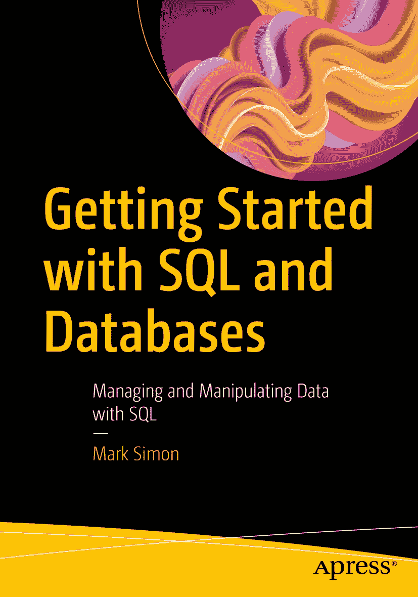

ISBN 978-1-4842-9492-5 e-ISBN 978-1-4842-9493-2 [`doi.org/10.1007/978-1-4842-9493-2`](https://doi.org/10.1007/978-1-4842-9493-2) © Mark Simon 2023

本作品受版权保护。出版商独家拥有所有权利，无论涉及材料的全部或部分，具体包括翻译权、转载权、插图再利用权、朗诵权、广播权、缩微胶片或其他任何物理方式的复制权，以及信息存储与检索、电子改编、计算机软件方面的传输权，或任何目前已知或未来开发的类似或不同方法。在本出版物中使用通用描述性名称、注册商标、服务标志等，即使未作特别说明，也不意味着这些名称不受相关保护性法律法规的约束而可自由使用。出版商、作者和编辑均善意地认为本书出版时的建议和信息真实准确。出版商、作者或编辑均不对本书所含材料或其中可能存在的任何错误或遗漏提供明示或暗示的保证。出版商对出版地图中的管辖主张和机构从属关系保持中立。

此 Apress 印记由 Springer Nature 旗下的注册公司 APress Media, LLC 出版。

注册公司地址为：美国纽约州纽约市 New York Plaza 1 号，邮编 10004。

*献给 Sachiko。感谢你的耐心、包容和信任。*

