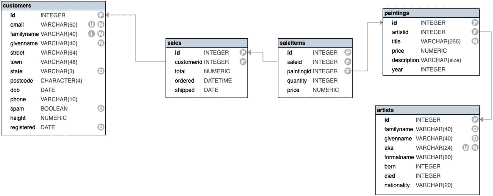
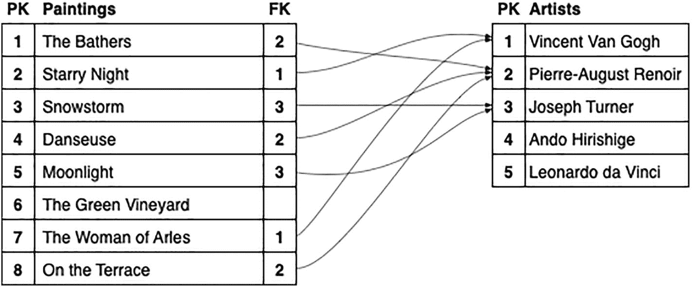
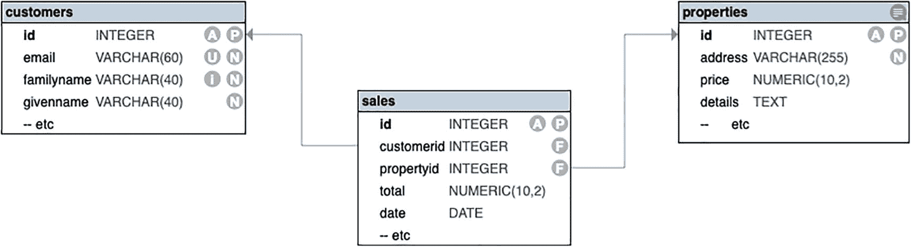
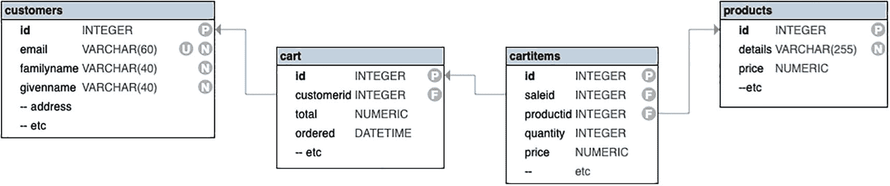

# 2. Database

在第[1]章中，你体验了使用 SQL 从数据库中提取数据。我们当时有点摸不着头脑，因为我们并未完全了解数据库中有什么。遗憾的是，在现实生活中情况常常如此，但在这里，我们将更仔细地审视数据库本身。

在本章中，我们将探讨其内部机制。这将从两个方面进行：

*   你将了解数据库设计的理论和实践：为什么它是这样的？
*   你还将了解示例数据库本身的细节：这个数据库里具体有什么？

理论部分不会太重。你将了解表，它是所有数据的基础结构，以及所谓规范表的规则：数据如何被组织得尽可能简单可靠。你还将了解我们如何处理多值情况。

示例数据库遵循典型的设计，即使它是一个相当小的数据库。它将包含足够的内容以使其值得搜索和分析。更重要的是，它将包含我们需要探索的几乎所有内容。

## About the Sample Database

对于示例数据库，我们将设想一个在线商店，销售著名艺术作品的印刷复制品。

为了管理这个商店，我们至少需要以下表格：

*   一个`customers`表，用于保存客户详细信息。
*   一个`paintings`表，包含可用画作的一些详细信息。这*不是*库存表，因为画作是按需印刷的。
*   画作的一个细节是艺术家。我们不会在`paintings`表中存储艺术家的详细信息。相反，有一个单独的表，并且画作通过引用与艺术家关联。
*   一个`artists`表，在前面的`paintings`表中被引用。
*   *两个*表来管理销售：一个`sales`表用于管理客户购买，一个`saleitems`表用于管理销售中的各个商品。

图[2-1]将让你对数据库的结构有一个清晰的了解。


图 2-1 示例数据库

在本章中，我们将了解设计数据库时考虑的一些理念，并且我们也将更详细地查看用于练习的示例数据库。

### Database

SQL 数据库基于关系数据库理论。而关系数据库理论又基于一些重要的数学概念，包括集合和逻辑。

关系数据库的一个重要原则是：

*每个数据项都有一个唯一的位置。*

这尤其意味着：

*   数据永不重复。
*   永远不会对*在哪里*放置或查找一个数据项产生任何歧义。

理论上，SQL 数据库是“纯”关系数据库的一个有限版本。因此，我们将更具体地称它们为 SQL 数据库。

#### Database Terminology

我们将尽量不纠结于术语，但有些术语对于澄清问题很重要。

**数据库**是数据的集合。理论上，这些数据可以以任何你喜欢的方式管理，例如在文字处理文档、记录卡或木片上的凹口里。当然，这里我们谈论的是在计算机系统上管理数据。

**DBMS**是管理数据的软件。当然，有许多可用的 DBMS，本书涵盖了一些比较流行的。

SQL，或结构化查询语言（官方上，它的发音就是按字母拼读），是与数据库通信的语言。有一个官方的 ISO 标准，但所有的 DBMS 都对这个标准有所变通。

一些用户试图将其发音为**SeQueL**，这曾被提议为其正式名称。由于与其他软件存在命名冲突，最终它被称为**SQL**。如果你愿意，你也可以将其发音为**SQuaLl**、**SQueaL**、**SQueLch**或**SQuaLlid**。

#### Data vs. Value

你的名字是什么？我们将把你的名字称为一个**数据**项。而对这个问题的*回答*，则被称为其**值**。

将数据视为一个占位符（例如表格上的一个框），而值则是占位符的内容。

说数据永不重复意味着你的名字只有一个占位符：没有重复项。

另一方面，*值*可以被复制。没有什么能阻止另一个人拥有和你一样的名字。然而，在其技术性的、非神秘的意义上，这将被视为一种**巧合**。

更重要的是，更改你的名字的值并不会强制另一个人也要做同样的更改。值之间是相互独立的。

### Tables

一个 SQL 数据库是**不同**表的集合。每个表描述一种数据类型，例如一个客户或一幅画。

例如：

```sql
SELECT * FROM customers;
SELECT * FROM paintings;
```

当你运行前面的代码时，你会发现客户表与画作无关，反之亦然。


#### 表术语

SQL 使用表的语言，而表由行和列组成。

*   一个 `table`（表）是一个集合，例如客户的集合。
*   一个 `row`（行）是该集合的一个实例或成员，例如其中一位客户。
*   一个 `column`（列）是成员的一个细节，例如客户的出生日期。

有时你可能会看到其他一些词语被用来描述数据，但它们并非 SQL 的术语。表 2-1 展示了用于某些概念的一些替代术语。

**表 2-1** 替代名称

| | 关系数据库 | SQL | 其他 |
| --- | --- | --- | --- |
| 集合 | Relation（关系） | Table（表） | File（文件） |
| 实例 | Tuple（元组） | Row（行） | Record（记录） |
| 细节 | Attribute（属性） | Column（列） | Field（字段） |

特别要注意的是，在其他 SQL 开发者面前，避免使用 `Record`（记录）和 `Field`（字段）这些术语，因为他们可能会对你嗤之以鼻。另一方面，特别是 `Field`（字段）这个词有时确实会出现在官方文档中，所以也不算太糟。

在本书中，我们将使用标准的 SQL 术语。你有时可能会看到 `record`（记录）一词以其原始含义（即保存信息）被使用。

### 规范化表

原则上，你可以以任何你想要的方式组织数据表，但如果你希望你的数据尽可能易于维护，它就需要遵循一些规则。

以下规则不仅仅是为了增加趣味性。这些规则将使表中的数据处于最简单、最可靠的形式。数学家将这种形式称为其 `normal`（范式）形式。

总的来说，规范化的目标是确保每一份数据都只有一个存放位置。不应有重复，也不应有歧义。

正如你将看到的，这通常意味着要创建额外的表，因此你所需的数据可能分散在各处。这可能会带来不便。稍后，当我们学习连接表时，我们会了解如何管理这种不便。

数据库理论定义了多个规范化级别，但大部分原理将在下文中涵盖。

在现实中，你会发现数据库开发者常常会放宽其中一些原则，以避免数据分散在太多地方，导致即使是最简单的查询也变得困难。然而，这样做总是有降低数据可靠性的风险。

#### 数据是原子的

如果你执行以下查询

```sql
SELECT
    id,
    givenname, familyname
FROM customers;
```

你会注意到，given name（名）和 family name（姓）位于不同的列中。这使得排序和搜索数据变得更加容易。

数据应处于其最小的 *实际* 单位。如果做到了这一点，我们就说数据是 `atomic`（原子的），这个词源自一个希腊词汇，意指它不能再被拆分。

注意前面的“实际”一词。你可以对电子邮件地址尝试同样的做法：

```sql
SELECT
    id,
    email
FROM customers;
```

你可能会争辩说电子邮件地址可以进一步分解为两部分：`user@host`（用户@主机）。如果你真想这么做，当然可以。然而，大多数人会认为这有点过分了，因为你可能*永远*不会单独使用这些部分。

另一方面，如果你确实需要按电子邮件主机对客户进行分组，例如用于过滤或排序目的，那么电子邮件地址确实应该被分成两列。

决定数据是否应该进一步分离是经验丰富的数据库开发者的技能之一。

#### 列是独立的

当你选择多个列时：

```sql
SELECT
    id,
    givenname, familyname,
    phone,
    dob
FROM customers;
```

你会注意到的一件事是，一列中的值无法提供任何关于另一列中值的线索。例如，知道你的出生日期并不能告诉我们你的电话号码。此外，更改你的出生日期并不要求更改你的电话号码。²

这是维护“干净”数据的一个关键因素。这意味着你可以在不影响任何其他内容的情况下维护单个数据项。

并非所有表都严格遵循此规则。例如：

```sql
SELECT
    id,
    givenname, familyname,
    street,
    town, state, postcode
FROM customers;
```

如果客户更改了他们的地址，你可能需要更新*四*项数据（`street`、`town`、`state` 和 `postcode`）。除此之外，更改邮政编码很可能会决定州和城镇。显然，这三者并非彼此独立。即使是街道也是有限制的：相同的街道名称在下一个城镇可能存在也可能不存在，但街道号码可能仍然是错误的。

*这是示例 `customers` 表设计中的一个弱点。正确的做法会涉及另一个位置表，以便 `customers` 表包含对其中一个位置的单一引用。*

有时，我们可以勉强接受一个宽松的设计，但这不会是永久的。在未来某个时候，某个客户的地址可能会被部分更新，而你的数据将失去一些可靠性。

目前，我们将坚持这种宽松的设计，并希望一切顺利。这是因为获取所有可能地址的完整列表太难了。

#### 列是单一类型的

如果你检查一个日期列：

```sql
SELECT
    id, givenname, familyname,
    dob
FROM customers;
```

你会注意到，`dob` 列中的所有值当然都是日期。根据设计，`dob` 列将只接受日期，而不接受数字、字符串或任何其他类型的数据。

在 SQL 中，每一列都被分配一个单一类型。³ 你唯一能输入的值必须与该类型兼容。

这一原则有几个优点：

*   限制数据类型提供了一点有效性检查；例如，数字或字符串对于出生日期来说是无效的。
*   当你需要处理数据时，例如根据出生日期计算年龄，SQL 无需处理因不适当数据而产生的错误，因为没有这样的数据。
*   在对数据排序时，数据类型会影响结果。你将在第 4 章关于排序的内容中看到更多相关信息。

也有一些缺点。例如，对于日期：

*   你无法改变详细程度，例如在日期列中只记录年份或包含时间。
*   你不能在日期列中拥有文本，例如“很久以前”或“土豚之年”。

在关系理论中，数据项可接受的值被称为其 `domain`（域）。例如：

```sql
SELECT
    id,
    givenname, familyname,
    state
FROM customers;
```

`state` 的值是一个字符串，理论上可以是任何字符串，但实际上应该被限制为合法的州名缩写。

#### 行是无序的

更现实地说，行的顺序并不重要。

如果你简单地从表中选择：

```sql
SELECT *
FROM customers;
```

无法保证行的顺序。在数据库理论中，这完全没问题，因为集合是无序的。

SQL 标准特别*不*对行顺序做任何说明。具体来说

*   数据本身可以按照 DBMS 认为合适的任何顺序*存储*。
*   数据可以按照 DBMS 认为合适的任何顺序*返回*。

对于某些 DBMS，数据可能看起来是随机顺序的。然而，对于另一些 DBMS，它可能是 `insertion order`（插入顺序）：数据被添加的顺序。不过，实际顺序将取决于数据的处理方式以及数据的更改情况。

当然，你总是可以使用 `ORDER BY` 子句来强制指定你自己的顺序。


#### 行是唯一的

如果你只是从表中简单查询：

```sql
SELECT *
FROM artists;
```

你会看到没有艺术家会出现两次。如果你初次接触数据管理是通过电子表格程序，你很可能会发现累积了多份艺术家副本，因为交叉引用并非电子表格的强项。

在一个管理良好的数据库中，每位艺术家只被记录一次，然后多幅画作可以引用同一位艺术家。

当然，错误总是难免的；例如，一位艺术家可能被注册了两次。请记住，数据库本身并不真正“知道”发生了什么，因此需要一些人为干预来确保这种情况不会发生。

SQL 确实提供了一些帮助来维护唯一性：

*   每个表都应定义一个 `主键` 列，作为唯一标识符。原则上，即使所有其他细节都相同，主键也能区分它们。

*   一些列可以添加 `唯一约束`，这将禁止意外的重复。例如，你可能会认为客户的电子邮件地址永远不应重复，因此在该列上设置唯一约束。

在关于表操作的第 8 章中，你将看到如何构建各种附加需求，即约束。目前，主键和唯一属性很重要。

#### 行是独立的

如果你只是从表中简单查询：

```sql
SELECT *
FROM artists;
```

你会看到，一位艺术家的细节与另一位艺术家的细节无关。一行的数据变化只影响该行本身。

这并不是说多位艺术家不能拥有一些相同的细节。例如，伦勃朗和梵高都被列为 `荷兰` 国籍。但是，如果你决定将梵高的国籍改为，比如 `法国`，这将对伦勃朗的国籍没有影响。

然而，这对于 `customers` 表来说并不完全正确。如果一个城镇的邮政编码发生变化，可能意味着同一城镇的其他客户也需要更新。这就是为什么地点信息本应放在一个单独的表中。

#### 列名是唯一的

这不言自明。你不能有两个同名的列；否则，将无法可靠地标识该列。

对于一个结构良好的表，这应该不是问题，但有时对于如何处理多个值会有一点不确定性。我们稍后会看到如何正确处理多个值。

#### 列是无序的

当你从一个表中查询时，你当然会以某种行顺序和列顺序获得结果。然而，与行顺序一样，列顺序并不重要。不过，与行顺序不同的是，列顺序并非完全不可预测。

例如：

```sql
SELECT *
FROM customers;
```

如果你使用 `SELECT *`，你将按照表创建时或后续修改表结构时定义的顺序获得列。

```sql
SELECT id, givenname, familyname, dob, email
FROM customers;
```

如果你指定了列，你当然会按照指定的顺序获得列。

关键在于，数据库没有*偏好*的列顺序，你可以按任何顺序选择它们，而不会影响结果的意义。

SQL 允许你在原始设计之后添加额外的列。有时，在任意位置添加这些列很棘手甚至不可能，因此你可能会发现新添加的列位于末尾。这并不总是方便，但至少无关紧要。

### 多值处理

一个结构良好的表的原则之一涉及多值处理。例如：

*   如何管理客户的多个电话号码？
*   如何管理多位作者的书籍？

应避免的两种错误是：

*   将多个值放在单个列中，可能用逗号或分号分隔。这样数据项就不再有明确的位置，因为你无法确定它在哪一列中。此外，你最终总会遇到一些空列，并且在某些情况下列数可能不够。

*   为多个值设置多个列，例如 `phone1`、`phone2` 等。你之前已经看到数据应该是原子性的。这将违反该原则，并使搜索和排序变得不切实际。稍后，你可能需要将数据分组，而像这样使用多个值将使分组成为不可能。

可能存在*如果*列之间有明确区分的情况，才使用多个列。例如，对于客户，你*可能*记录一个手机号码、一个固定电话号码和一个传真（还记得传真吗？）号码。它们都是电话号码，但彼此差异足够大，不会产生歧义。

#### 使用关联表

在示例数据库中，我们多次遇到这个问题：

*   销售单可以包含多个销售项。
*   艺术家可以创作多幅画作。
*   客户可以有多笔销售。

在所有情况下，解决方案都是一样的：使用另一个表。例如，为了管理多个销售项，有一个额外的 `saleitems` 表，用于记录每个销售项。使其运作的关键是，所有这些销售项都引用一个 `sale`。

#### 示例：画作与艺术家

正如我们之前提到的，我们面临的情况是一位艺术家可以创作许多幅画作。换句话说，许多幅画作是同一位艺术家创作的。这实际上是同一个问题，只是从两个不同的方向来看待。

你看待问题的方式取决于数据库的目的。例如，如果你在管理艺术家代理机构，那么你的主要兴趣点将在艺术家表上，问题将是如何管理每位艺术家的多幅画作。这将与如何管理每笔销售的多项物品，或每位客户的多笔销售是同一个问题。

在这个数据库中，我们更感兴趣的是画作，因此问题是如何管理同一位艺术家的多幅画作。

在这两种情况下，解决方案都是一样的。

如果你查看这两个表：

```sql
SELECT * FROM paintings;
SELECT * FROM artists;
```

你会看到 `paintings` 表中重要的 `artistid` 列。`artistid` 是对 `artists` 表中某个 `id` 的引用。这被称为 `外键`，因为它引用了另一个表。

图 2-2 展示了这种关系的简化版本。



两个表，画作表和艺术家表，包含主键和外键将两个表连接在一起。画作表包含 8 列。艺术家表包含 5 列。

图 2-2 表之间的关系

如果你看那些箭头，你会注意到它们是从画作指向艺术家，即从外键指向主键。你还会注意到许多幅画作指向一位艺术家。这种关系通常称为一对多关系，即从一位艺术家到多幅画作。

无论你更关注画作还是艺术家，实际的关系是在“多”的那一方，即 `artist` 表中定义的。

#### 替代术语示例

虽然大多数参考资料会简单地称为一对多关系，但使用更非正式的术语往往更方便，例如表 2-2 中的那些。

表 2-2 一对多关系

|      | 一方       | 多方       |
|------|------------|------------|
| 父子   | 父         | 子         |
| 容器   | 容器       | 内容物     |
| 购物   | 购物车     | 商品项     |

稍后，我们将探讨如何组合来自关联表的数据。

#### 更复杂的关系

在示例数据库中，我们有画作，也有顾客。我们还需要管理画作销售给顾客的业务。

顾客与画作之间的关系比画作与艺术家之间的关系更复杂。一幅画作只能有一位艺术家，而顾客可以购买多幅画作，并且多位顾客可以购买同一幅画作。

显然，多位顾客实际上购买的并非**相同的**物品，而仅仅是复制品。实际上，你完全可能有多位顾客**串行地**购买同一件物品，即一个接一个地购买，就像古董或房产交易一样。借阅也是如此：一旦物品被归还，多位借阅者就可以借阅同一件物品。

为了管理销售，你将需要额外的一两个专门用于销售的表。

如果销售的性质足够简单，你可以用一张表来管理。例如，如果你从事房地产行业，你可以有一张房产表和一张用于管理销售的单一表，如图 2-3 所示。



该关系数据库包含三张表：`Customers`、`sales` 和 `Properties`，通过主键和外键连接。其中，`Customers` 表存储客户信息，包括 `ID`、`email`、`family name`、`given name`；而 `Properties` 表存储房产详情，如 `ID`、`address`、`price`、`details`，以及用于关联表的 `customer ID` 和 `sale date`。

图 2-3

房产销售

由于你一次只销售一处房产，你可以在一个简单的 `sales` 表中管理交易。该表记录了哪位客户购买了哪处房产，以及相关的其他数据，如日期和金额。

如果客户要实际购买两处房产，他们会很乐意将其作为两笔交易来处理。

你可以将相同的设计用于，比如说，汽车租赁，其中大多数客户一次只租一辆车。

对于较小的物品，如画作，顾客很可能一次购买多件物品，并可能购买多件复制品。在这种情况下，进行多次销售交易会很麻烦，你需要一个更巧妙的方法。这里，你将需要*两张*表，如图 2-4 所示。



该关系数据库包含 4 张表：`customers`、`cart`、`products` 和 `cart items`。这些表包含诸如 `customer ID`、`name`、`address`、`email`、`product details`、`quantity`、`price` 等各种属性的列。

图 2-4

购物车

你可能有过在互联网上购买多件物品的经历。通常，你的购买是以购物车的形式呈现，其中包含一个或多个购物车项目。即使你只购买了一件物品的一份副本，情况也是如此。

为了在数据库中管理购买行为，你有一张购物车表，每张购物车通过一个外键与一位客户关联。最终的细节，如 `checkout date`、`total price` 以及 `payment` 和 `delivery methods`，都将存储在此表中。

购买的每件产品将存储在第二张项目表中。这张表有两个外键。一个与购物车关联，而购物车又与一位客户关联。另一个与产品表关联。你可以将购物车视为购物车项目的*容器*。

每当需要在单次交易中管理多个项目时，都会使用相同的结构。这包括多个图书馆借阅项目，或者在我们的示例数据库中，多个销售项目。

## 总结

数据库是不同表的集合。每张表是相关数据的集合。

在设计良好的表中，每个数据项都有唯一正确的存放位置。

#### 术语

关于数据库本身

*   `database`（数据库）是数据的完整集合。
*   `DBMS` 或 `Database Management System`（数据库管理系统）是管理数据的软件。
*   `SQL` 或 `Structured Query Language`（结构化查询语言）是用于与数据库通信的语言。

关于数据项

*   将数据视为占位符，而值（value）则是占位符的内容。

SQL 使用表的语言。对于每张表

*   `row`（行）是表中数据的一个实例，例如一个客户或一本书。
*   `column`（列）是行的细节，例如名称。

#### 规范化的表

SQL 表需要组织得遵循某些规则，以使数据尽可能简单和可靠。

*   数据是原子的
*   列是独立的
*   列是单一类型的
*   行是无序的
*   行是唯一的
*   行是独立的
*   列名是唯一的
*   列是无序的

#### 多值

数据库表不应在单个列中存储多个值。管理多个值需要一张额外的表，并引用回原始表。

### 后续内容

现在你对示例数据库的设计方式及其原因有了概念。在现实生活中，并非所有工作数据库都完全遵循这些原则构建，有些数据库确实非常随意。关键在于，你偏离这些原则越远，使用数据库的难度就越大。

下一章将聚焦于一个简单的概念：如何从一张表中选择*某些*行，即如何用 `WHERE` 子句*过滤*表。

脚注 1 2

