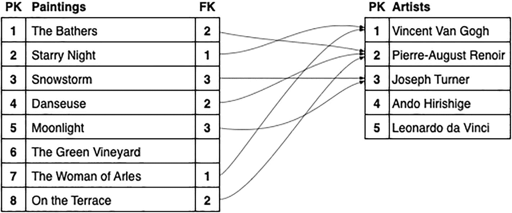
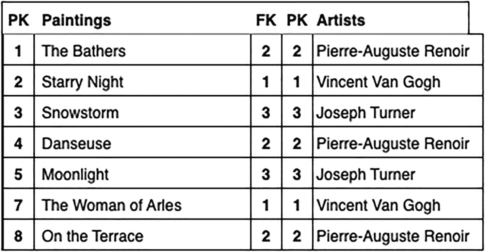

# 6. 连接表

如果你从 `paintings` 表中选择数据：

```
SELECT *
FROM paintings;
```

你会看到艺术家是用 `artistid` 表示的，而不是姓名或其他任何细节。在良好的数据库设计中就应该如此，但这并不方便。在上一章中，你通过包含一个子查询来解决这个问题：

```
SELECT
title,
(SELECT givenname||' '||familyname FROM artists
WHERE artists.id=paintings.artistid) AS artist
--  等等
FROM paintings;
```

除了繁琐之外，子查询在额外处理方面也可能成本高昂，并且可能难以管理。

如果艺术家的姓名能包含在 paintings 表中会更容易。然而，正如之前所讨论的，那将导致数据组织不善。

解决方案，即两全其美的方法，是生成一个临时的 `虚拟` 表，其中艺术家的详细信息确实与绘画的详细信息一起包含在内。这被称为 `join`。

当你连接两个表时，你从一个表中取出一行并将其附加到另一个表的一行的末尾。当然，你需要确保附加的行以某种方式与另一行匹配。完成此操作后，你可以将结果作为单个表读取，而无需处理子查询。

在本章中，我们将学习如何连接两个或更多表，以便从组合表中提取数据变得简单实用。

我们将通过使用连接而不是子查询来重新创建价格列表开始。在此过程中，我们将看到存在不同类型的连接，用于控制当某些行不匹配时会发生什么。

我们还将探讨连接两个以上的表、将表与其自身连接，以及如何连接那些没有明显关系的表。

然而，首先，我们需要看看执行连接时会发生什么。


## 连接如何工作

要理解连接，你需要先理解关于表如何关联的一些基本概念。当然，SQL 并非真的要求你理解其内部机制，但如果你不了解，连接操作可能会变得非常棘手。

在第 2 章中，设计数据库的一些核心要点如下：

*   一张表包含单一类型对象的数据。因此，例如，`paintings` 表中不应有 `artists` 的详情，而 `books` 表中也不应有 `authors` 的详情。
*   多行数据不应相同。因此，例如，同一位画家的两幅画作不应都包含画家的姓名，同一作者的两本书也不应有相同的作者姓名。

实际上，这两点并非独立，而是同一原则的两种表现形式：一张表描述单一类型的数据。如果你试图包含不相关的数据，最终会导致数据重复。

正确的解决方案是将相关数据放入其自己的表中，并使用一个 `外键` 将一张表链接到另一张表的 `主键`，如图 6-1 所示。



这两张表分别描绘了画作和艺术家的信息。画作表和艺术家表分别有 8 行和 5 行。画作表的外键与艺术家表的主键相关联。

图 6-1

表之间的关系

当时机到来，下一步就是将这些表连接成一个单一的虚拟表。连接两张表，就是将一张表中的一行复制到另一张表中匹配行的末尾，如图 6-2 所示。



通过连接画作表和艺术家表形成一个表。结果表有 7 行 5 列。列标题是 P K、paintings、F K、P K 和 artists。

图 6-2

连接后的表

然后，你可以使用生成的虚拟表从两张表中读取数据。

你可能会注意到连接的一些重要特性：

*   任一张表中都可能缺失某些行。稍后，你将看到如何包含这些缺失的行。
*   一些关联的行会被复制。如果这是一张真实的表，你会在数据管理上遇到各种问题，但对于虚拟表来说，这完全没问题且很方便。

还有一个重要特性，你稍后会在 SQL 本身中看到：

*   仅仅指定要连接的表是不够的；你还需要指定哪一列与哪一列匹配。虽然通常你会将外键连接到主键，但 SQL 允许更复杂的连接。

一旦连接了表，你就可以使用 `SELECT` 语句从结果中读取数据。

为了说明这个过程，我们将使用以下连接：

```sql
SELECT *
FROM paintings JOIN artists ON paintings.artistid=artists.id;
```

你会得到类似这样的结果，包含两张表的所有列：

| id | artistid | title | … | id | familyname | … |
| --- | --- | --- | --- | --- | --- | --- |
| 1222 | 147 | Haymakers Resting | … | 147 | Pissarro | … |
| 251 | 40 | Death in the Sickroom | … | 40 | Munch | … |
| 2190 | 135 | Cache-cache (Hide-and-Seek) | … | 135 | Morisot | … |
| 1560 | 293 | Indefinite Divisibility | … | 293 | Tanguy | … |
| 172 | 156 | Girl with Racket and Shuttlecock | … | 156 | Chardin | … |
| 2460 | 83 | The Procession to Calvary | … | 83 | Bruegel | … |
| ~ 1228 行 ~ |

具体细节将在后续讲解。现在，我们先看一个包含合并表数据的结果集。

之前的查询结果阐明了上述所有要点。尤其要注意，一些行缺失了。我们稍后会探讨这个问题。

### 连接表

基本的连接是通过 `JOIN ... ON` 子句实现的：

```sql
SELECT *
FROM paintings JOIN artists ON paintings.artistid=artists.id;
```

你会注意到一些重复的数据。例如，梵高有 57 幅画作。这意味着你会得到 57 份他的姓名、国籍和日期信息的副本。

如果这是一张真实表，这将是非常糟糕的设计标志。你有 57 次可能犯错的机会，还可能引入其他差异。这就是为什么将此类数据保存在单独的表中非常重要，在那里数据只输入一次并可以得到妥善维护。

然而，连接产生的只是一张*虚拟*表：重复的数据便于阅读，且永远不会被存储在任何地方。

请注意，连接可以用不同的方式书写。因为重点是画作，所以先写 `paintings` 表在视觉上更合理。不过，你也可以以相反的顺序写这两张表：

```sql
SELECT *
FROM artists JOIN paintings ON paintings.artistid=artists.id;
```

这将产生完全相同的结果，只是列的顺序会不同。

这同样适用于 `ON` 子句：以哪种顺序书写并不重要，因为匹配结果是一样的。

目前，你先写哪张表无关紧要。不过，稍后当涉及到 `JOIN` 子句的变体时，你将需要*记住*顺序。

### 替代语法

`JOIN` 关键字并非最初 SQL 标准的一部分。相反，你会使用这种语法：

```sql
SELECT *
FROM paintings,artists WHERE paintings.artistid=artists.id;
```

也就是说，`JOIN` 被逗号代替，`ON` 被 `WHERE` 代替。

从技术上讲，发生的是生成了 `paintings` 和 `artists` 所有可能的组合（这称为 `交叉连接`），然后只筛选出画家与画作匹配的那些行。实际上，数据库管理系统从未以这种低效的方式执行。

这是一种非常古老的语法，你只会看到那些尚未适应新语法的顽固派使用它。在内部，SQL 会使用与 `JOIN` 语法相同的过程生成相同的结果。

你*应该总是*使用更新的语法：

*   旧语法会将你标识为顽固派之一。
*   新语法更灵活，在考察连接类型时你会看到这一点。正如你稍后将看到的，前面的语法仅限于所谓的 `内连接`。
*   新语法使得使用额外的 `WHERE` 子句筛选器更容易。

关于最后一点，假设你只想要较便宜的画作。使用 `JOIN` 子句，你可以运行

```sql
SELECT *
FROM paintings JOIN artists ON paintings.artistid=artists.id
WHERE price<150;
```

以下是较便宜的画作：

| id | artistid | title | price | … | id | familyname | … |
| --- | --- | --- | --- | --- | --- | --- | --- |
| 1222 | 147 | Haymakers Resting | 125.00 | … | 147 | Pissarro | … |
| 251 | 40 | Death in the Sickroom | 105.00 | … | 40 | Munch | … |
| 1560 | 293 | Indefinite Divisibility | 125.00 | … | 293 | Tanguy | … |
| 1836 | 273 | Male and Female | 105.00 | … | 273 | Pollock | … |
| 575 | 18 | Corner of Quarry | 125.00 | … | 18 | Cézanne | … |
| 1353 | 67 | Nini in the Garden | 105.00 | … | 67 | Renoir | … |
| ~ 543 行 ~ |

使用旧语法，你必须将筛选条件附加到现有的 `WHERE` 子句上：

```sql
SELECT *
FROM paintings,artists
WHERE paintings.artistid=artists.id
AND price<150;
```

同样，SQL 在内部会使用相同的过程给出相同的结果，但新语法使你的意图更加清晰。

