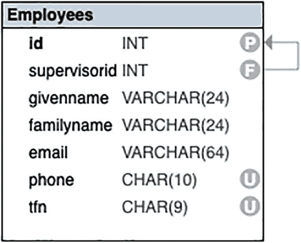
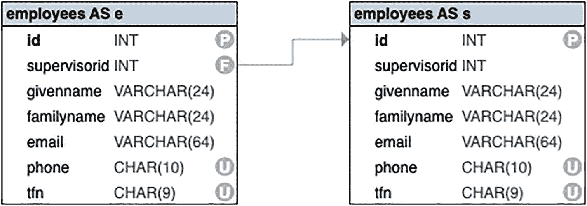

# 连接多个表

连接的目的是组合来自两个或更多表的数据。有时，附加数据来自许多其他表；有时，数据来自另一个不直接与主表相关的表。

例如，假设你想要一个客户列表以及他们向哪些画家购买了画作。你可能正在考虑一个促销活动，对于客户以前购买过的画家的新作品，客户可以获得折扣。

查询语句可能类似于这样：

```sql
SELECT
c.id, c.givenname, c.familyname,
a.id,
a.givenname||' '||a.familyname AS artist
FROM ... ;
```

你知道你将使用一个包含 `customers`（客户）和 `artists`（画家）表的连接，并且你会用合适的首字母缩写来为这些表设置别名。

问题在于涉及的这两个表彼此并不直接相关。

从数据库关系图中你可以看到，这些表之间的关系很长，涉及 `sales`（销售）、`saleitems`（销售项）和 `paintings`（画作）表。直观上看，这很有道理：对于每个客户，你可以查看他们的销售记录和销售项，然后查看每个销售项对应的画作，最后找到每幅画的画家。

为了实现这一点，你需要连接所有五个表，每次连接两个：

```
customers ← sales ← saleitems → paintings → artists
```

注意箭头的方向。它们表示外键引用主键的方向。更详细地说：

```
customers.id
← customerid.sales.id
← saleid.saleitems.paintingid
→ id.paintings.artistid
→ id.artists
```

你的真实数据库可能有更多的表。但通常，原理是相同的：对于一个特定的查询，你通常只需处理相对较少数量的表。

## 构建更大的连接

连接的目的是从末端表获取数据。然而，我们也可以从中间的任何表获取数据。

如果你从链的一端开始，一直连接到另一端，连接五个表是很容易的：

```sql
SELECT
*
FROM
customers AS c
JOIN sales AS s ON c.id=s.customerid
JOIN saleitems AS si ON s.id=si.saleid
JOIN paintings AS p ON si.paintingid=p.id
JOIN artists AS a ON p.artistid=a.id
;
```

如果你使用 Oracle，记得省略 `AS`。

这将给你一个很长的列表：

| id | givenname | familyname | … | id | givenname | familyname | … |
| --- | --- | --- | --- | --- | --- | --- | --- |
| 79 | Daisy | Chain | … | 20 | Frans | Hals | … |
| 459 | Matt | Black | … | 314 | (Eugène-Henri-) Paul | Gauguin | … |
| 28 | Meg | Aphone | … | 43 | Johan-Barthold | Jongkind | … |
| 179 | Ivan | Inkling | … | 266 | Vincent | Van Gogh | … |
| 94 | Stan | Dover | … | 344 | Edgar | Degas | … |
| 373 | April | Showers | … | 3 | Diego | Velázquez | … |
| ~ 6099 行 ~ |

请注意，所有的连接都遵循外键。模式是：

```
table
JOIN table ON relationship
JOIN table ON relationship
JOIN table ON relationship
JOIN table ON relationship
```

五个表，它们之间有四个连接。

布局纯粹是个人喜好问题。在简单的两表连接中，我们将所有内容放在一行。在更大的连接中，我们将连接分开写，以便于阅读。

通常，我们使用简单的首字母作为表别名。在一种情况下，`saleitems`（销售项）这样做不行，因为它的首字母已被使用，所以 `si` 看起来是合适的。一如既往，任何不同的别名都可以，但使用一个直观的别名是有意义的。

一旦你这样做，你会发现大量的列和 `大量` 的行。我们先来处理列。你可以简化 `SELECT` 子句，只包含你感兴趣的列：

```sql
SELECT
c.id,
c.givenname, c.familyname,
s.id,
a.givenname||' '||a.familyname AS artist
FROM
customers AS c
JOIN sales AS s ON c.id=s.customerid
JOIN saleitems AS si ON s.id=si.saleid
JOIN paintings AS p ON si.paintingid=p.id
JOIN artists AS a ON p.artistid=a.id
;
```

这给出了一个简化的结果，如下所示：

| id | givenname | familyname | id | artist |
| --- | --- | --- | --- | --- |
| 79 | Daisy | Chain | 1066 | Frans Hals |
| 459 | Matt | Black | 2067 | (Eugène-Henri-) Paul Gauguin |
| 28 | Meg | Aphone | 271 | Johan-Barthold Jongkind |
| 179 | Ivan | Inkling | 2749 | Vincent Van Gogh |
| 94 | Stan | Dover | 361 | Edgar Degas |
| 373 | April | Showers | 2681 | Diego Velázquez |
| ~ 6099 行 ~ |

为方便起见，画家的姓名被连接在一起。记得在 MSSQL 中使用 `+`。

这个查询可以工作，但有一个小的技术问题在于 `id`。如果你打算认真使用这个查询，例如在视图中，你不能有两个同名的列。给其中一个列起一个别名并不难：

```sql
SELECT
c.id,
c.givenname, c.familyname,
s.id AS sid,
a.givenname||' '||a.familyname AS artist
FROM
customers AS c
JOIN sales AS s ON c.id=s.customerid
JOIN saleitems AS si ON s.id=si.saleid
JOIN paintings AS p ON si.paintingid=p.id
JOIN artists AS a ON p.artistid=a.id
;
```

如果你愿意，也可以给其他列起别名，但只有 `id` 是必须的。


## 简化结果

那里有大量数据，可能会让人有点不知所措。首先，数据中可能存在一些重复。

完全可以想象，某个特定的客户/组合会出现多次。毕竟，如果某位艺术家真的是客户的最爱，那么你预计会有多个购买记录。

要查看是否属于这种情况，你可以先按客户姓名对结果排序：

| id | givenname | familyname | sid | artist |
| --- | --- | --- | --- | --- |
| 260 | Aiden | Abet | 902 | Pierre-Auguste Renoir |
| 260 | Aiden | Abet | 902 | Pierre-Auguste Renoir |
| 260 | Aiden | Abet | 902 | Rembrandt van Rijn |
| 260 | Aiden | Abet | 1006 | Kasimir Malevich |
| 260 | Aiden | Abet | 1006 | Paul Cézanne |
| 260 | Aiden | Abet | 818 | Rembrandt van Rijn |
| ~ 6099 行 ~ |

```sql
SELECT
c.id,
c.givenname, c.familyname,
s.id AS sid,
a.givenname||' '||a.familyname AS artist
FROM
customers AS c
JOIN sales AS s ON c.id=s.customerid
JOIN saleitems AS si ON s.id=si.saleid
JOIN paintings AS p ON si.paintingid=p.id
JOIN artists AS a ON p.artistid=a.id
ORDER BY c.familyname, c.givenname
;
```

如果你仔细观察，会发现一些重复项。目前，我们对重复出现的频率或花费了多少钱并不感兴趣。我们只想要名字。为此，我们可以使用 `DISTINCT`：

| id | givenname | familyname | sid | artist |
| --- | --- | --- | --- | --- |
| 260 | Aiden | Abet | 818 | Auguste Rodin |
| 260 | Aiden | Abet | 818 | Paul Cézanne |
| 260 | Aiden | Abet | 818 | Rembrandt van Rijn |
| 260 | Aiden | Abet | 902 | Pierre-Auguste Renoir |
| 260 | Aiden | Abet | 902 | Rembrandt van Rijn |
| 260 | Aiden | Abet | 1006 | Jean-Antoine Watteau |
| ~ 5997 行 ~ |

```sql
SELECT DISTINCT
c.id,
c.givenname, c.familyname,
s.id AS sid,
a.givenname||' '||a.familyname AS artist
FROM
customers AS c
JOIN sales AS s ON c.id=s.customerid
JOIN saleitems AS si ON s.id=si.saleid
JOIN paintings AS p ON si.paintingid=p.id
JOIN artists AS a ON p.artistid=a.id
ORDER BY c.familyname, c.givenname
;
```

这将大大减少结果数量，尽管它仍然是一个很大的数字。

请记住，`DISTINCT` 只作用于 `SELECT` 子句中的内容；它不知道（也不在乎）其他值。假设你忘了客户的 `id`：

```sql
SELECT DISTINCT
--  c.id,
c.givenname, c.familyname,
s.id AS sid,
a.givenname||' '||a.familyname AS artist
FROM
customers AS c
JOIN sales AS s ON c.id=s.customerid
JOIN saleitems AS si ON s.id=si.saleid
JOIN paintings AS p ON si.paintingid=p.id
JOIN artists AS a ON p.artistid=a.id
ORDER BY c.familyname, c.givenname
;
```

你会得到一个稍小的数据集，但从技术上讲这是不正确的。有些客户与其他客户同名，而且两个同名的客户可能恰好购买了同一位艺术家的作品。如果没有独特的东西来区分他们，他们就会被合并。

这仍然是大量的数据。在下一章中，我们将看到如何对这样的大量数据生成摘要。

## 重新审视一些子查询

在第 3 章中，我们使用了一些子查询，将一个表中的数据用作另一个表的过滤器。在这里，我们将研究使用连接表来替代。

对于第一个例子，我们找到了在单次销售中花费金额较大的客户：

```sql
SELECT *
FROM customers
WHERE id IN(SELECT customerid FROM sales WHERE total>1200);
```

你可以使用连接得到类似的结果：

```sql
SELECT DISTINCT c.*
FROM customers AS c JOIN sales AS s on c.id=s.customerid
WHERE s.total>1200;
```

这会给出以下结果：

| id | givenname | familyname | … |
| --- | --- | --- | --- |
| 115 | Robin | Banks | … |
| 163 | Artie | Choke | … |
| 172 | Kenny | Doit | … |
| 241 | Gail | Warning | … |
| 26 | Orson | Buggy | … |
| 29 | June | Hills | … |
| ~ 106 行 ~ |

注意

*   我们使用 `c.*` 来获得与第一个查询（仅查询 `customers` 表）相同的结果。
*   为了获得*完全*相同的结果，第二个查询使用了 `DISTINCT`，因为连接可能产生重复的行。

实际上，使用连接，你还可以获取 `sales` 表中的结果，例如销售的实际金额。但是，这时你不应该使用 `DISTINCT`，因为我们谈论的是不同的销售记录：

```sql
SELECT c.*, s.total
FROM customers AS c JOIN sales AS s on c.id=s.customerid
WHERE s.total>1200;
```

以下是包含销售总额的结果：

| id | givenname1 | familyname | … | total |
| --- | --- | --- | --- | --- |
| 2 | Laurel | Wreath | … | 1380.00 |
| 10 | Terry | Fied | … | 1230.00 |
| 19 | Millie | Pede | … | 2005.00 |
| 46 | Hank | Ering | … | 1555.00 |
| 24 | Bart | Ender | … | 1830.00 |
| 69 | Pat | Downe | … | 1315.00 |
| ~ 147 行 ~ |

你可以用同样的方法来获取你的荷兰画作：

```sql
SELECT *
FROM paintings
WHERE artistid IN (
SELECT id FROM artists  WHERE nationality IN
('Dutch','Netherlandish')
);
```

使用连接，你可以用

```sql
SELECT p.*
FROM paintings AS p JOIN artists AS a on p.artistid=a.id
WHERE a.nationality IN ('Dutch','Netherlandish');
```

以下是荷兰（和尼德兰）画家：

| id | artistid | title | year | price |
| --- | --- | --- | --- | --- |
| 541 | 256 | Butcher’s Stall with the Flight … | | 110.00 |
| 81 | 198 | The Garden of Earthly Delights | | |
| 1503 | 182 | Breakfast of Crab | 1648 | 160.00 |
| 2128 | 370 | The Geographer | | 125.00 |
| 264 | 370 | Girl with a Pearl Earring | 1666 | 140.00 |
| 1446 | 266 | Entrance to the Public Garden … | 1888 | 115.00 |
| ~ 186 行 ~ |

同样，我们已将结果限制在一个表中，但你也可以包含来自另一个表的数据。


## 一个更复杂的连接

我们之前所有的连接都涉及外键与主键的关联。你可能会认为 SQL 或许能自行推断这种关系而无需通过 `ON` 子句明确告知。然而，并非所有的连接都以相同的方式工作。

在我们的示例数据库中，有一个名为 `artistsdates` 的补充表。该表仅包含艺术家 ID 以及已知的出生和死亡日期：

```sql
SELECT * FROM artistsdates;
```

这里，你将只看到几列：

| id | borndate | dieddate |
| --- | --- | --- |
| 41 | 1619-02-24 | 1690-02-12 |
| 302 |   |   |
| 369 | 1833-08-28 | 1898-06-17 |
| 170 | 1823-09-28 | 1889-01-23 |
| 176 | 1848-08-19 | 1894-02-21 |
| 164 | 1601-03-19 | 1667-09-03 |
| ~ 187 行 ~ |

虽然 `artists` 表也包含类似信息，但它只有年份，而非完整的日期。单独来看，这个额外的表价值不大，但你可以将其与 `artists` 表连接起来：

```sql
SELECT *
FROM artists JOIN artistsdates ON artists.id=artistsdates.id;
```

现在你拥有了更完整的艺术家详情：

| id | givenname | familyname | … | borndate | dieddate |
| --- | --- | --- | --- | --- | --- |
| 120 | Rembrandt | van Rijn | … | 1606-07-15 | 1669-10-04 |
| 252 | Hendrick | Avercamp | … | 1585-01-27 | 1634-05-15 |
| 17 | Jan Davidsz | de Heem | … | 1606-04-17 | 1684-04-26 |
| 288 | Antoine | Caron | … |   |   |
| 361 | Pieter de | Hooch | … | 1629-12-20 | 1684-03-24 |
| 147 | Camille | Pissarro | … | 1830-07-10 | 1903-11-13 |
| ~ 187 行 ~ |

在这里，你连接的是两个表的主键。实际上，`artistsdates` 表的作用是为 `artists` 表提供额外的列，我们称这两个表之间存在 **一对一** 关系。

大多数 SQL 有一个更简单的连接语法，其中 `ON` 子句连接两个同名的列：

```sql
--  非 MSSQL
SELECT *
FROM artists NATURAL JOIN artistsdates;
```

如你所见，这不包括 Microsoft SQL。

沿主键连接两个一对一表是显而易见的事情。现在，假设我们想要一些不那么显而易见的东西。

假设我们正在运行一个促销活动，如果客户的生日与艺术家相同，则该客户可以获得折扣。我们将获取客户及其匹配艺术家的列表。

从前面的连接开始，我们先获取艺术家的详细信息。我们还将为下一步给表起别名：

```sql
SELECT
a.id, a.givenname, a.familyname, ad.borndate
FROM
artists AS a
JOIN artistsdates AS ad ON a.id=ad.id;
```

以下是艺术家及其出生日期：

| id | givenname | familyname | borndate |
| --- | --- | --- | --- |
| 120 | Rembrandt | van Rijn | 1606-07-15 |
| 252 | Hendrick | Avercamp | 1585-01-27 |
| 17 | Jan Davidsz | de Heem | 1606-04-17 |
| 288 | Antoine | Caron |   |
| 361 | Pieter de | Hooch | 1629-12-20 |
| 147 | Camille | Pissarro | 1830-07-10 |
| ~ 187 行 ~ |

为了获取生日，我们需要月份和日期，不包括年份。在不同的 DBMS 中，对于客户，我们可以使用以下方法：

```sql
--  PostgreSQL, Oracle
SELECT to_char(dob,'MM-DD') AS birthday FROM customers;
--  MariaDB / MySQL
SELECT date_format(dob,'%m-%d') AS birthday
FROM customers;
--  MSSQL
SELECT format(dob,'MM-dd') AS birthday FROM customers;
--  SQLite
SELECT strftime('%m-%d',dob) AS birthday FROM customers;
```

以下是生日列表：

| birthday |
| --- |
| 04-01 |
| 12-06 |
| 01-06 |
| ~ 304 行 ~ |

我们现在可以使用生日计算将之前的查询与客户表连接起来：

```sql
--  PostgreSQL, Oracle
SELECT
c.id, c.givenname, c.familyname, c.dob,
a.id, a.givenname, a.familyname, ad.borndate
FROM
artists AS a
JOIN artistsdates AS ad ON a.id=ad.id
JOIN customers AS c ON
to_char(ad.borndate,'MM-DD')=
to_char(c.dob,'MM-DD');
--  MSSQL
SELECT
c.id, c.givenname, c.familyname, c.dob,
a.id, a.givenname, a.familyname, ad.borndate
FROM
artists AS a
JOIN artistsdates AS ad ON a.id=ad.id
JOIN customers AS c ON
format(ad.borndate,'MM-dd')= format(c.dob,'MM-dd');
--  SQLite
SELECT
c.id, c.givenname, c.familyname, c.dob,
a.id, a.givenname, a.familyname, ad.borndate
FROM
artists AS a
JOIN artistsdates AS ad ON a.id=ad.id
JOIN customers AS c ON
strftime('%m-%d',ad.borndate)=
strftime('%m-%d',c.dob);
--  MySQL / MariaDB
SELECT
c.id, c.givenname, c.familyname, c.dob,
a.id, a.givenname, a.familyname, ad.borndate
FROM
artists AS a
JOIN artistsdates AS ad ON a.id=ad.id
JOIN customers AS c ON
date_format(ad.borndate,'%m-%d')=
date_format(c.dob,'%m-%d');
```

这现在给出了我们匹配的生日：

| id | givenname | … | dob | id | givenname | … | borndate |
| --- | --- | --- | --- | --- | --- | --- | --- |
| 475 | Drew | … | 1989-12-06 | 10 | Frédéric | … | 1841-12-06 |
| 523 | Seymour | … | 1965-01-06 | 327 | Gustave | … | 1832-01-06 |
| 588 | Grace | … | 1999-06-28 | 188 | Peter Paul | … | 1577-06-28 |
| 422 | Wanda | … | 1999-07-15 | 120 | Rembrandt | … | 1606-07-15 |
| 377 | Xavier | … | 1969-07-14 | 71 | Gustav | … | 1862-07-14 |
| 86 | Dicky | … | 1980-06-02 | 284 | Domenico | … | 1448-06-02 |
| ~ 93 行 ~ |

前面版本之间的唯一区别在于计算生日的 `ON` 子句。

在大多数情况下，只要数据兼容，你可以将任何你想要的东西连接到其他任何东西。并非所有的连接都有意义。最显而易见的连接当然是外键，但你也可以连接任何你认为值得匹配的其他列。


## 使用自连接

通常，你会期望在两个或多个表之间进行连接。当我们在下一章查看汇总数据时，会看到其中一个表可能是虚拟的汇总表。在这里，我们将查看如何将一个表与它自身进行连接。

有一个 `employees` 表，其中包含对主管的引用，如图 6-3 所示。



该表显示了员工详细信息，包括 `id`、`supervisorid`、`givenname`、`familyname`、`email`、`phone` 和 `tfn`。它为 `id` 和 `supervisorid` 分配了外键和主键约束，而 `phone` 和 `tfn` 被指定为唯一。

图 6-3

一个自引用表

在设计这样的表时，在主管问题上存在两个常见错误：

*   新手设计师可能会将主管详细信息与其他员工详细信息放在一起。这是一个糟糕的设计，原因与你不应该将画家详细信息与画作放在一起相同。
*   新手设计师可能会为管理者创建一个额外的表。

第二个错误更为微妙，但它仍然是个错误。首先，主管也是一名员工，因此他们的详细信息会在两个表中重复。这与画作和画家是不同事物的情况不同。其次，可能存在更高级别的监督，这将需要创建额外的主管表，使情况变得更糟。

解决方案是注意到主管是另一名员工。我们需要的是一个引用同一表中另一名员工的外键。这正是我们在图中看到的引用。

你可以通过以下方式查看 `employees` 表的内容：

```
SELECT * FROM employees ORDER BY id;
```

你将看到一个员工及其主管 ID 的列表。

```
| id | supervisorid | givenname | familyname | … |
| --- | --- | --- | --- | --- |
| 1 | 21 | Marmaduke | Mayhem | … |
| 2 | 16 | Clarisse | Cringinghut | … |
| 3 | 12 | Joe | Kerr | … |
| 4 | 29 | Beryl | Bubbles | … |
| 5 | 30 | Norris | Toof | … |
| 6 | 27 | Osric | Pureheart | … |
| ~ 34 行 ~ |
```

你会注意到 `supervisorid` 外键列。如果你想实际查看主管的姓名，你需要像之前在画作中获取画家姓名那样，沿着外键追踪下去。

你可以使用子查询来完成此操作，就像之前的价格列表版本一样：

```
--  这将不起作用：
SELECT
id, supervisorid, givenname, familyname,
(
SELECT givenname||' '||familyname FROM employees
WHERE employees.supervisorid=employees.id
) as supervisor
FROM employees
ORDER BY id;
```

如果你这样做，会遇到表名歧义的问题。解决方案是在子查询中使用别名来重命名表：

```
| id | supervisorid | givenname | familyname | supervisor |
| --- | --- | --- | --- | --- |
| 1 | 21 | Marmaduke | Mayhem | Irving Klutzmeyer |
| 2 | 16 | Clarisse | Cringinghut | Sylvester Underbar |
| 3 | 12 | Joe | Kerr | Beryl Standover |
| 4 | 29 | Beryl | Bubbles | Beryl Standover |
| 5 | 30 | Norris | Toof | Mildred Codswallup |
| 6 | 27 | Osric | Pureheart | Fred Nurke |
| ~ 34 行 ~ |
```

```
SELECT
id, supervisorid, givenname, familyname,
(
SELECT givenname||' '||familyname
FROM employees AS supervisors
WHERE employees.supervisorid=supervisors.id
) as supervisor
FROM employees
ORDER BY id;
```

这样可以工作，但一个更清晰的解决方案是连接表。技巧是使用不同的别名连接相同的表，如图 6-4 所示。



2 张表显示员工详细信息，包括 `ID`、`supervisorID`、名字、姓氏、电子邮件、电话号码和税号。这些表具有分配给 `ID` 和 `supervisorID` 列的外键和主键约束，并且电话和 `TFN` 列被指定为唯一。

图 6-4

连接后的自引用表

它应该类似于这样：

```
--  这也不起作用：
SELECT
id, supervisorid, givenname, familyname,
givenname||' '||familyname as supervisor
FROM employees AS e JOIN employees AS s
ON e.supervisorid=s.id
ORDER BY id;
```

然而，这仍然不行，因为现在你有多个同名列，你必须限定所有列：

```
SELECT
e.id, e.supervisorid, e.givenname, e.familyname,
s.givenname||' '||s.familyname as supervisor
FROM employees AS e JOIN employees AS s ON e.supervisorid=s.id
ORDER BY e.id;
```

现在唯一的问题是并非所有员工都有主管，因此他们的 `supervisor` 是 `NULL`。前面的 (`INNER`) 连接会忽略这些行，所以我们需要一个外连接：

```
SELECT
e.id, e.supervisorid, e.givenname, e.familyname,
s.givenname||' '||s.familyname as supervisor
FROM employees AS e LEFT JOIN employees AS s
ON e.supervisorid=s.id
ORDER BY e.id;
```

这花了一些功夫来修复，但它仍然是比使用前面的子查询更清晰的解决方案。

如果你使用的是 Microsoft SQL，请记住使用 `+` 进行拼接，或者将 MySQL/MariaDB 置于 `ANSI` 模式。否则，你总是可以使用 `concat()` 函数进行拼接。

## 总结

为了确保数据库的完整性，多个值被保存到单独的表中。当你需要来自多个相关表的数据时，可以使用 `JOIN` 子句将它们组合起来。

连接的基本原理是子表的列由来自匹配父表的列进行补充。

连接的结果是一个虚拟表；你可以根据需要添加 `WHERE` 和 `ORDER BY` 子句。

### 语法

连接的基本语法是：

```
SELECT columns
FROM table JOIN table;
```

有一种使用 `WHERE` 子句的旧语法，但对于大多数连接来说，它不那么有用。

尽管表是成对连接的，但你可以连接任意数量的表以从任何相关表中获取结果。

### 表别名

在连接表时，最好区分开列名。如果表有共同的列名，这一点尤其重要。

*   你应该完全限定所有列名。
*   使用表别名来简化名称会很有帮助。然后可以使用这些别名来限定列名。

### ON 子句

`ON` 子句用于描述如何将一个表中的行与另一个表中的行进行匹配。

标准的连接是从子表的外键连接到父表的主键。更复杂的连接也是可能的。

### 连接类型

默认的连接类型是 `INNER JOIN`。当未指定连接类型时，会默认使用 `INNER`。

*   `INNER JOIN` 仅返回那些存在父行的子行。具有 `NULL` 外键的行将被省略。
*   `OUTER JOIN` 是 `INNER JOIN` 与不匹配行的组合。

### 后续内容

到目前为止，我们一直在处理原始或计算的数据。接下来，我们将处理汇总数据。


