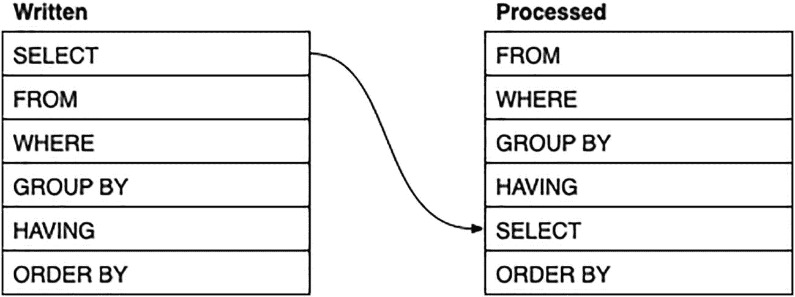

# 汇总字符串

这里有一个最终的例子。在讨论连接（JOIN）时，我们研究了如何连接多个表来获取客户最喜爱的艺术家：

```sql
SELECT DISTINCT
c.id,
c.givenname, c.familyname,
s.id AS sid,
a.givenname||' '||a.familyname AS artist
FROM
customers AS c
JOIN sales AS s ON c.id=s.customerid
JOIN saleitems AS si ON s.id=si.saleid
JOIN paintings AS p ON si.paintingid=p.id
JOIN artists AS a ON p.artistid=a.id
ORDER BY c.familyname, c.givenname;
```

（请记住，MSSQL 使用`+`进行连接，Oracle 不喜欢表别名使用`AS`，下面的例子也是如此。）

| id | givenname | familyname | sid | artist |
| --- | --- | --- | --- | --- |
| 260 | Aiden | Abet | 818 | Auguste Rodin |
| 260 | Aiden | Abet | 818 | Paul Cézanne |
| 260 | Aiden | Abet | 818 | Rembrandt van Rijn |
| 260 | Aiden | Abet | 902 | Pierre-Auguste Renoir |
| 260 | Aiden | Abet | 902 | Rembrandt van Rijn |
| 260 | Aiden | Abet | 1006 | Jean-Antoine Watteau |
| ~ 5997 rows ~ |

问题在于你仍然会得到一长串单独的客户/艺术家组合。如果能将所有艺术家合并成一个字符串，就不会那么令人不知所措了。

不同的数据库管理系统（DBMS）对用于合并字符串的聚合函数有不同的名称（而且较旧版本的 MSSQL 根本没有这样的函数，只有一个*非常*复杂的解决方法）。

| DBMS | 函数 |
| --- | --- |
| PostgreSQL | `string_agg(data, separator)` |
| Oracle | `listagg(data, separator)` |
| MySQL/MariaDB | `group_concat(data SEPARATOR separator)` |
| SQLite | `group_concat(data, separator)` |
| MSSQL | `string_agg(data, separator)` |

现在，我们可以将前面的查询用作公共表表达式（CTE），并利用它为每个客户生成一个艺术家列表：

```sql
WITH cte AS (
SELECT DISTINCT
c.id,
c.givenname, c.familyname,
s.id AS sid,
a.givenname||' '||a.familyname AS artist
FROM    --  Oracle: 省略表别名的 AS：
customers AS c
JOIN sales AS s ON c.id=s.customerid
JOIN saleitems AS si ON s.id=si.saleid
JOIN paintings AS p ON si.paintingid=p.id
JOIN artists AS a ON p.artistid=a.id
)
--  PostgreSQL, MSSQL:
SELECT
id, givenname, familyname, string_agg(artist, ', ')
--  Oracle:
--  SELECT id, givenname, familyname, listagg(artist, ', ')
--  MySQL / MariaDB:
--  SELECT
--      id, familyname, givenname,
--      group_concat(artist SEPARATOR ', ')
--  SQLite:
--  SELECT
--      id, givenname, familyname, group_concat(artist, ', ')
FROM cte
GROUP BY id, givenname, familyname
ORDER BY familyname, givenname, id;
```

这将给我们一个客户及其所有艺术家的列表：

| id | givenname | familyname | truncate |
| --- | --- | --- | --- |
| 260 | Aiden | Abet | Piero della Francesca, Sandro Bottic … |
| 323 | Alf | Abet | James Abbott McNeill Whistler, Jacop … |
| 563 | Ollie | Agenous | Claude Monet, Kasimir Malevich, Henr … |
| 54 | Corey | Ander | Juan Gris, Amedeo Modigliani, Berthe … |
| 549 | Ike | Andy | Ando Hiroshige, Jackson Pollock, Rem … |
| 263 | Adam | Ant | Kasimir Malevich, Joseph Mallord Wil … |
| ~ 256 rows ~ |

从结果中你可以看到，合并后的字符串可能会变得非常长。在实际应用中，如果你希望结果实用，就需要确保它不会变得太长。

## 使用 HAVING 过滤分组结果

之前，你获取了每位客户的销售额和销售数量。然后你可能希望将结果限制在总额或数量较高的范围内。要做到这一点，你需要使用 `HAVING` 子句。

例如，要仅显示消费金额更多的客户，你可以根据 `sum(total)` 值进行筛选：

```sql
SELECT customerid, sum(total) AS total, count(*) AS countrows
FROM sales
GROUP BY customerid
HAVING sum(total)>10000
--  SELECT
ORDER BY customerid;
```

我们现在得到了一个过滤后的汇总结果：

| customerid | total | countrows |
| --- | --- | --- |
| 2 | 14920 | 24 |
| 9 | 10645 | 19 |
| 11 | 16460 | 29 |
| 19 | 16530 | 23 |
| 20 | 12145 | 17 |
| 24 | 16565 | 28 |
| ~ 42 rows ~ |

`HAVING` 子句的作用与 `WHERE` 子句类似，区别在于它过滤的是汇总结果，而不是原始表数据。^⁹ 注意，它位于 `GROUP BY` 子句之后，而 `GROUP BY` 子句执行实际的汇总操作。

此外，请注意 `HAVING` 子句仍在 `SELECT` 子句之前处理，因此如果你试图根据前面的计算列进行筛选，是无法实现的。这给出了如图 7-1 所示的子句顺序。



一张表格，展示了带有 GROUP BY 和 HAVING 函数的子句的书写顺序和处理顺序。

图 7-1 带有 GROUP BY 和 HAVING 的子句顺序

当然，如果需要，你也可以同时使用 `WHERE` 和 `HAVING` 子句，在汇总前后对数据进行筛选。

例如，假设你对最近一个月内总销售额较大的客户感兴趣。为此，你将需要两个筛选条件：

*   最近的销售：通过筛选 `sales.ordered` 减去一个月来实现。
*   较大的总额：通过在汇总中筛选 `sum(total)` 来实现。

这给出如下查询：

```sql
--  PostgreSQL, MySQL/MariaDB
SELECT customerid, sum(total) AS total
FROM sales
WHERE ordered>current_timestamp - INTERVAL '1' MONTH
GROUP BY customerid
HAVING sum(total)>2000
--  SELECT
ORDER BY customerid;
```

这应该会得到类似以下的结果：

| customerid | total |
| --- | --- |
| 167 | 2155 |
| 179 | 2105 |
| 250 | 5000 |
| 379 | 2010 |
| 445 | 2350 |
| 455 | 3890 |

请记住，其他 DBMS 使用不同的计算方式来减去一个月：

```sql
--  MSSQL
SELECT customerid, sum(total) AS total
FROM sales
WHERE ordered>dateadd(month,-1,current_timestamp)
GROUP BY customerid
HAVING sum(total)>2000
--  SELECT
ORDER BY customerid;
--  SQLite
SELECT customerid, sum(total) AS total
FROM sales
WHERE ordered>date('now','-1 month')
GROUP BY customerid
HAVING sum(total)>2000
--  SELECT
ORDER BY customerid;
--  Oracle
SELECT customerid, sum(total) AS total
FROM sales
WHERE ordered>add_months(current_timestamp,-1)
GROUP BY customerid
HAVING sum(total)>2000
--  SELECT
ORDER BY customerid;
```

破坏前面例子简洁性的唯一因素是，`SELECT` 子句中的别名在 `HAVING` 子句中尚不可用，因此你不得不重写计算。然而，在内部，SQL 足够智能，不会实际重新计算这些值。

如果你是很久以前安装的示例数据库，可能不会得到任何结果，因为日期已经过期了。示例脚本的最后有一条 `UPDATE` 语句。如果你运行它，它会将日期调整到更近的日期。

### 在 CTE 中使用结果

如果你想更早地获取高额消费客户的更多详情，可以使用**公共表表达式**（Common Table Expression）的结果，然后与 `customers` 表进行连接：

```sql
WITH cte AS (
SELECT customerid, sum(total) AS total
FROM sales
WHERE ordered>current_timestamp - INTERVAL '1' MONTH
--  MSSQL:
--  WHERE ordered>dateadd(month,-1,current_timestamp)
--  SQLite:
--  WHERE ordered>date('now','-1 month')
--  Oracle:
--  WHERE ordered>add_months(current_timestamp,-1)
GROUP BY customerid
HAVING sum(total)>2000
)
SELECT * FROM customers JOIN cte ON customers.id=cte.customerid
ORDER BY customers.id;
```

你现在得到了一个合并后的结果集：

| id | email | familyname | givenname | … | total |
| --- | --- | --- | --- | --- | --- |
| 167 | lucy.fer167@example.net | Fer | Lucy | … | 2155 |
| 179 | ivan.inkling179@example.com | Inkling | Ivan | … | 2105 |
| 250 | rae.ning250@example.net | Ning | Rae | … | 5000 |
| 379 | artie.chokes379@example.net | Chokes | Artie | … | 2010 |
| 445 | ida.dunnit445@example.net | Dunnit | Ida | … | 2350 |
| 455 | pierce.dears455@example.com | Dears | Pierce | … | 3890 |
| ~ 共 6 行 ~ |

请注意，你再次尝试在此处混合两种不同类型的数据。你需要一个汇总查询来查找近期的高额消费者，并且需要一个非汇总查询来查找客户详情。

在之前的示例中，你以子查询的形式放置了汇总部分。而这里，它放在了 CTE 中，这实际上是一种子查询。

还需注意，CTE 中省略了 `ORDER BY` 子句。在该上下文中它毫无用处，而且 MSSQL 在没有一些额外技巧的情况下不会允许它。

### 查找重复值

`HAVING` 子句的一个简单应用是查找重复值。重复值不一定是个问题，因为它们可能只是巧合，但有时检查一下还是有用的。

`HAVING` 子句只需要筛选出存在多于一个记录的分组，即 `count(*)>1`。

例如，要查找重复的出生日期：

```sql
SELECT dob
FROM customers
GROUP BY dob
HAVING count(*)>1;
```

你将获得一个重复项列表：

| dob |
| --- |
| `NULL` |
| 1963-01-20 |
| 1996-12-09 |
| 2002-01-29 |
| 1990-06-21 |
| 1980-06-02 |
| ~ 共 15 行 ~ |

你也会得到一些 `NULL`。SQL 对 `NULL` 的关系确实是矛盾的，而在这种情况下，它准备将它们视为一个分组。

再次使用 CTE，你可以获取有关这些客户的更多详情：

```sql
WITH cte AS (
SELECT dob FROM customers
GROUP BY dob HAVING count(*)>1
)
SELECT * FROM customers AS c JOIN cte ON c.dob=cte.dob
ORDER BY c.dob;
```
（记住 Oracle 不喜欢表别名使用 `AS`；后续示例同理。）

| id | email | familyname | givenname | dob | … |
| --- | --- | --- | --- | --- | --- |
| 344 | rose.boat344@example.net | Boat | Rose | 1962-09-24 | … |
| 545 | jack.knife545@example.com | Knife | Jack | 1962-09-24 | … |
| 440 | percy.monn440@example.com | Monn | Percy | 1962-12-12 | … |
| 261 | vic.tory261@example.net | Tory | Vic | 1962-12-12 | … |
| 187 | mikey.fitz187@example.com | Fitz | Mikey | 1963-01-20 | … |
| 28 | meg.aphone28@example.net | Aphone | Meg | 1963-01-20 | … |
| ~ 共 28 行 ~ |

在这里，CTE 中的任何 `NULL` 都会在内连接中被排除，因为没有客户的 id 为 `NULL`。

你也可以对多个列执行此操作。例如，要查找重复的姓名，你需要同时检查 `familyname` 和 `givenname`：

```sql
SELECT familyname, givenname
FROM customers
GROUP BY familyname, givenname
HAVING count(*)>1;
```

这将得到一个姓名列表：

| familyname | givenname |
| --- | --- |
| Money | Owen |
| O’Shea | Rick |
| Gon | Tara |
| Dover | Eileen |
| Highwater | Camilla |
| Knife | Jack |
| ~ 共 11 行 ~ |

要获取更多详情：

```sql
WITH cte AS (
SELECT familyname, givenname FROM customers
GROUP BY familyname, givenname HAVING count(*)>1
)
SELECT *
FROM customers AS c JOIN cte
ON c.givenname=cte.givenname AND c.familyname=cte.familyname
ORDER BY c.familyname, c.givenname;
```

这将得到客户详情：

| id | familyname | givenname | … |
| --- | --- | --- | --- |
| 455 | Dears | Pierce | … |
| 317 | Dears | Pierce | … |
| 145 | Dover | Eileen | … |
| 197 | Dover | Eileen | … |
| 287 | Gettit | Carmen | … |
| 223 | Gettit | Carmen | … |
| ~ 共 22 行 ~ |

注意，这里的 `ON` 子句匹配了两列，而不是通常的一列。

### 在聚合上使用聚合

之前，我们提到过查找最受欢迎的画作。这实际上比听起来更复杂。一方面，你不能使用像 `max(count())` 这样的表达式（它本可以让事情简单一点）：SQL 不允许嵌套聚合函数。

我们将从找出每幅画售出多少份开始。你可以在包含 `paintingid` 的 `saleitems` 表中找到这些信息。你只需要按 `paintingid` 分组：

```sql
SELECT paintingid, count(*) AS countrows
FROM saleitems
GROUP BY paintingid;
```

你将得到一个画作 id 列表：

| paintingid | countrows |
| --- | --- |
| 1798 | 8 |
| 1489 | 4 |
| 1269 | 5 |
| 1989 | 3 |
| 273 | 6 |
| 1560 | 5 |
| ~ 共 1136 行 ~ |

这告诉我们每幅画被包含的次数。但是，请记住还有一个 `quantity` 列，其中包含售出的副本数量，我们可以将其加总。不幸的是，该列可能包含 `NULL`，因此必须使用 `coalesce` 处理：

```sql
SELECT paintingid, sum(coalesce(quantity,1)) AS quantity
FROM saleitems
GROUP BY paintingid;
```

这给出了一个更正确的结果：

| paintingid | quantity |
| --- | --- |
| 1798 | 13 |
| 1489 | 7 |
| 1269 | 5 |
| 1989 | 5 |
| 273 | 6 |
| 1560 | 5 |
| ~ 共 1136 行 ~ |

这为我们提供了所需处理的数据，因此我们将其放入一个 CTE 中：

```sql
WITH quantities AS (
SELECT paintingid, sum(coalesce(quantity,1)) AS quantity
FROM saleitems
GROUP BY paintingid
)
SELECT paintingid, quantity
FROM quantities
GROUP BY paintingid, quantity;
```

目前来看，最后这个查询是多余的，因为它给出的结果与我们没有使用 CTE 时相同。然而，第二次分组允许我们使用一个额外的聚合函数，而这个函数在其他情况下无法嵌套：

```sql
WITH quantities AS (
SELECT paintingid, sum(coalesce(quantity,1)) AS quantity
FROM saleitems
GROUP BY paintingid
)
SELECT paintingid, quantity
FROM quantities
GROUP BY paintingid, quantity
HAVING quantity=(SELECT max(quantity) FROM quantities);
```

我们现在得到了最终结果：

| paintingid | quantity |
| --- | --- |
| 1246 | 23 |
| 2138 | 23 |

子查询绕过了缺少嵌套聚合函数的限制，因为它只是对一个先前计算出的值进行聚合。`HAVING` 子句筛选出总数量与最大值匹配的行。当然，可能不止一个。

如果你想获取有关画作的更多详情，需要将结果与 paintings 表连接。为此，我们可以使用第二个 CTE：

```sql
WITH
quantities AS (
SELECT paintingid,
sum(coalesce(quantity,1)) AS quantity
FROM saleitems
GROUP BY paintingid
),
favourites AS (
SELECT paintingid, quantity
FROM quantities
GROUP BY paintingid, quantity
HAVING quantity=(SELECT max(quantity) FROM quantities)
)
SELECT *
FROM paintings JOIN favourites ON paintings.id=favourites.paintingid;
```

我们现在有了合并的结果：

| id | artistid | title | … | quantity |
| --- | --- | --- | --- | --- |
| 2138 | 256 | Cook in front of the Sto … | … | 23 |
| 1246 | 85 | Two Studies of the Head … | … | 23 |

这里，第二个 `SELECT` 语句被包装在了第二个 CTE 中。你可以像以前一样拥有多个 CTE，只要用逗号分隔它们即可。

你会注意到第二个 CTE 查询了第一个 CTE。这样，你就可以从较小的组件构建出复杂的查询。你还会注意到布局稍有改变，以便于跟踪 CTE。

最后，我们将第二个 CTE 与 `paintings` 表连接起来，以获取其余的详情。当然，你可以在选择列时更具选择性。


