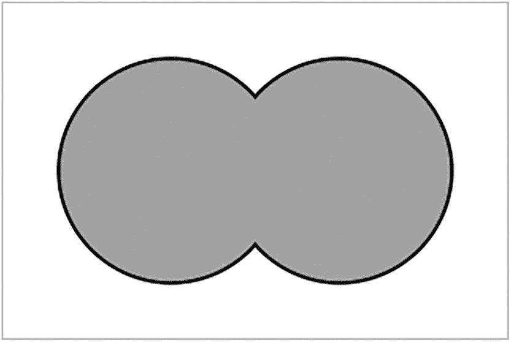

# 9. 集合操作

所有 SQL 数据库的背后都是关系数据库理论，这为数据库奠定了坚实的数学基础。其中很重要的一点是，数据库是基于数学上的`集合`。

在数学中，集合是事物的汇集。你不需要担心所有的细节，但有两点很重要：

*   集合中没有重复项。这是良好数据库设计确保没有重复记录的部分原因。
*   集合是无序的。当然，你查看其内容时必然呈现某种顺序，但这个顺序本身并不重要。

目前，所有这些内容中最重要的部分是：一个表就是一个行的集合，这意味着行不会重复，并且行的顺序不重要。

到目前为止，我们所有的查询都只产生一个结果集。即使你连接了表，结果也是一个单一的结果集。在本章中，我们将探讨如何组合多个结果集。


## 并集

并集是两个或多个集合最基本的组合方式。结果是一个包含所有集合成员的新集合。通常的图示类似于图 9-1。



图示表示两个集合的并集。

图 9-1

两个集合的并集

有时，会有一些元素是两个集合的共同成员，正如你在图 9-1 中所见。我们稍后将讨论这种重叠部分。

在 SQL 中，有时我们需要将来自多个表或虚拟表的行组合起来。这与连接两个表不同。当你连接表时，你是向现有表添加 `列`。而在这里，我们谈论的是添加 `行`。

假设你正在策划某个活动，并希望同时邀请客户和员工。你可以很容易地获取他们的姓名：

```sql
SELECT givenname, familyname FROM customers;
SELECT givenname, familyname FROM employees;
```

在这个阶段，你将得到两组数据。要将它们组合成一组数据，你可以在 `SELECT` 语句之间使用 `UNION` 子句：

| givenname | familyname |
| --- | --- |
| Matt | Black |
| Ali | Gator |
| Emmy | Grate |
| Claire | de Lune |
| Len | Till |
| Jack | Potts |
| ~ 322 行 ~ |

```sql
SELECT givenname, familyname FROM customers
UNION
SELECT givenname, familyname FROM employees
;
```

请注意，第一个语句末尾的分号已被移除。这是因为 `UNION` 是一个单一语句。第二个分号已向下移动，以便容纳更多的更改。

如果你运行前面的语句，可能会注意到总行数实际上少于客户数和员工数之和。这是因为 `UNION` 操作的一个特性。

由于 `UNION` 的结果应该是一个集合，因此不应有重复项，所以在数据组合后，重复项会被移除。不幸的是，SQL 无法知道哪些姓名是真正的重复项，因此它只能根据结果姓名来判断。

在这种情况下，有三种重复项的来源：

*   `customers` 表中的重复姓名

*   `employees` 表中的重复姓名

*   同时出现在 `customers` 和 `employees` 表中的姓名

请注意，它们并非 *真正的* 重复项，实际上是不同的人，只是碰巧巧合地共享了他们的名和姓，因此 SQL 将它们视为相同。

如果你确定重复的姓名没问题，那么可以使用 `UNION ALL` 子句：

| givenname | familyname |
| --- | --- |
| Judy | Free |
| Ray | Gunn |
| Ray | King |
| Ivan | Inkling |
| Drew | Blood |
| Seymour | Sights |
| ~ 338 行 ~ |

```sql
SELECT givenname, familyname FROM customers
UNION ALL   --  不移除重复项
SELECT givenname, familyname FROM employees
;
```

`UNION ALL` 子句不会移除重复值，因此总行数应该是正确的。

使用 `UNION ALL` 还有一个额外的好处。查找和移除重复项实际上需要数据库管理系统（DBMS）执行额外的工作，因此，如果它不必移除它们，涉及的工作量就更少。

请注意，重复项的定义完全取决于 `SELECT` 子句。如果你选择了额外的信息，比如 `email`：

| givenname | familyname | email |
| --- | --- | --- |
| Judy | Free | judy.free474@example.net |
| Ray | Gunn | ray.gunn186@example.net |
| Ray | King | ray.king144@example.net |
| Ivan | Inkling | ivan.inkling179@example.com |
| Drew | Blood | drew.blood475@example.net |
| Seymour | Sights | seymour.sights523@example.net |
| ~ 338 行 ~ |

```sql
SELECT givenname, familyname, email FROM customers
UNION ALL
SELECT givenname, familyname, email FROM employees
;
```

在这里，很可能根本不需要担心任何重复项。这是因为电子邮件地址应该是唯一的。

使用 `UNION ALL` 仍然是一个好主意，因为当没有重复项时，你不想浪费时间去查找它们。

你可以根据需要使用任意多个 `SELECT` 语句，全部用 `UNION` 或 `UNION ALL` 语句连接：

| givenname | familyname |
| --- | --- |
| Judy | Free |
| Ray | Gunn |
| Ray | King |
| Ivan | Inkling |
| Drew | Blood |
| Seymour | Sights |
| ~ 525 行 ~ |

```sql
SELECT givenname, familyname FROM customers
UNION ALL
SELECT givenname, familyname FROM employees
UNION ALL
SELECT givenname, familyname FROM artists
;
```

不同的 DBMS 可能对你可以拥有的 `SELECT` 语句数量有理论上的限制，但这很可能比你想要的还要多。

### 选择性并集

每个 `SELECT` 语句都可以按你希望的那样复杂。例如，它们可以包含连接和聚合。它们也可以是公用表表达式（Common Table Expressions）。有一件事你不能做，那就是使用 `ORDER BY`，我们稍后会讲到。

例如，假设你想包括所有员工，但只包括部分客户：

| givenname | familyname | email |
| --- | --- | --- |
| Ray | Gunn | ray.gunn186@example.net |
| Seymour | Sights | seymour.sights523@example.net |
| Jack | Knife | jack.knife545@example.com |
| Carol | Singers | carol.singers505@example.net |
| Miles | Long | miles.long492@example.com |
| Sharon | Sharalike | sharon.sharalike374@example.com |
| ~ 86 行 ~ |

```sql
SELECT givenname, familyname, email FROM customers
WHERE state='VIC'
UNION ALL
SELECT givenname, familyname, email FROM employees
;
```

你甚至可以从同一张表中组合不同筛选条件的结果：

| givenname | familyname | email |
| --- | --- | --- |
| Ray | Gunn | ray.gunn186@example.net |
| Seymour | Sights | seymour.sights523@example.net |
| Jack | Knife | jack.knife545@example.com |
| Carol | Singers | carol.singers505@example.net |
| Miles | Long | miles.long492@example.com |
| Sharon | Sharalike | sharon.sharalike374@example.com |
| ~ 148 行 ~ |

```sql
SELECT givenname, familyname, email FROM customers
WHERE state='VIC'
UNION ALL
SELECT givenname, familyname, email FROM customers
WHERE dob<'1980-01-01'
;
```

但你可能不应该这样做。前面的例子用 `OR` 操作符表达会更好：

```sql
SELECT givenname, familyname, email FROM customers
WHERE state='VIC' OR dob<'1980-01-01'
;
```

这不仅表达得更好，而且效率可能高得多。生成两个筛选结果集然后将它们组合起来，比筛选单个结果集要多做很多工作。换句话说，只有在没有其他方法可以实现时，你才会使用 `UNION`。


