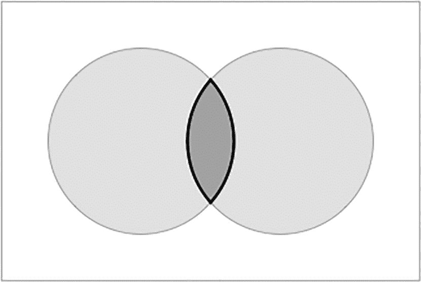
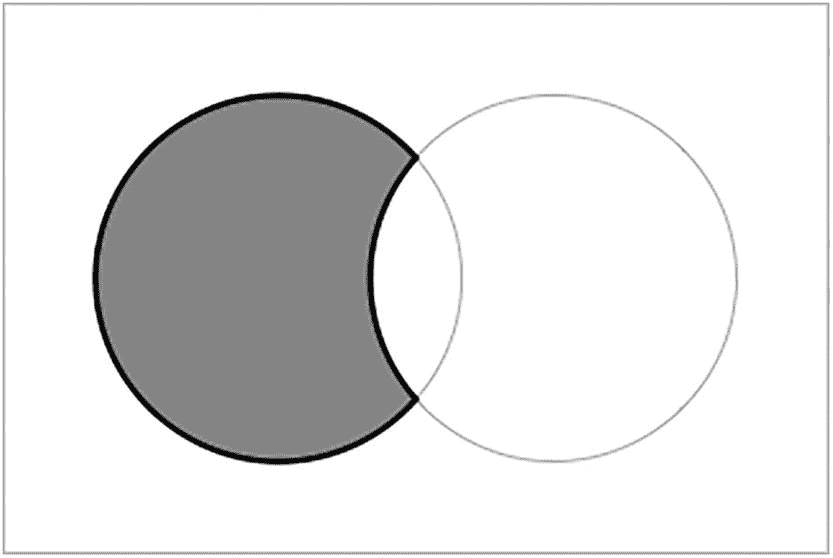

# SQL UNION 操作符的兼容性与使用注意事项

## SELECT 子句必须兼容

SQL 实际上并不关心你组合的是什么，只要数据是兼容的即可。首先，每个 `SELECT` 语句必须有相同数量的列：

```sql
--  这样不行：
SELECT givenname, familyname, email --  3 列
FROM customers
UNION ALL
SELECT givenname, familyname        --  2 列
FROM employees
;
```

其次，每列的数据类型*应该*匹配：

```sql
--  这样也不应该行：
SELECT /* 字符串： */ email, givenname, familyname
FROM customers
UNION ALL
SELECT /* 数字： */ id, givenname, familyname
FROM employees
;
```

这在 PostgreSQL、Oracle 和 MSSQL 中将无法工作。这是因为 `email` 是字符串，而 `id` 是数字，你不能混合数据类型。

然而，在 MariaDB/MySQL 中你可能蒙混过关，因为它会自动将数字转换为字符串；在 SQLite 中也行，因为它本来就不关心数据类型。

如果你想正确地混合类型，应该自己进行类型转换：

```sql
--  使用 cast()
SELECT email, givenname, familyname
FROM customers
UNION ALL
SELECT cast(id as varchar(4)), givenname, familyname
FROM employees
;
```

当然，你是否真的想要下面这样的结果是另一个问题：

| email | givenname | familyname |
| --- | --- | --- |
| may.bea350@example.com | May | Bea |
| 16 | Sylvester | Underbar |
| pearl.divers20@example.net | Pearl | Divers |
| tom.morrow429@example.com | Tom | Morrow |
| grace.skies588@example.com | Grace | Skies |
| 8 | Seymour | Something |
| ~ 94 行 ~ |

真正的陷阱在于，`UNION` 对齐 `SELECT` 子句中的*值*时，完全不考虑它们的名称或含义。下面两个语句都会产生结果：

```sql
--  列顺序颠倒
SELECT givenname, familyname FROM customers
UNION ALL
SELECT familyname, givenname FROM employees
;
--  列未对齐
SELECT email, givenname, familyname FROM customers
UNION ALL
SELECT givenname, familyname, email FROM employees
;
```

但结果很可能毫无意义。不过，如果你确实需要对齐名称不同的列，这就很有用了：

```sql
--  混合列名
SELECT givenname, familyname FROM customers
UNION ALL
SELECT firstname, lastname FROM sorting
;
```

在这种情况下，我们知道你是什么意思：

| givenname | familyname |
| --- | --- |
| Judy | Free |
| Ray | Gunn |
| Ray | King |
| Ivan | Inkling |
| Drew | Blood |
| Seymour | Sights |
| ~ 312 行 ~ |

当你尝试组合来自不同表的数据时，情况常常如此。

## 仅使用第一个 SELECT 语句的列名

如果你运行了前面的几个例子，你会注意到所有的列名都只来自于*第一个* `SELECT` 语句。这使得在你开始切换 `SELECT` 列时，尤其令人困惑。

你也可以在 `UNION` 中给列名起别名：

```sql
SELECT givenname AS gn, familyname FROM customers
UNION ALL
SELECT givenname, familyname AS fn FROM employees;
```

你将得到以下结果：

| gn | familyname |
| --- | --- |
| Judy | Free |
| Ray | Gunn |
| Ray | King |
| Ivan | Inkling |
| Drew | Blood |
| Seymour | Sights |
| ~ 338 行 ~ |

你会看到 `givenname` 列成功地被别名为 `gn`，但 `familyname` 列保持未别名状态。第二个及后续的 `SELECT` 语句中的名称会被忽略，即使你不厌其烦地为它们起了别名。这个故事的寓意是，你只应该在第一个 `SELECT` 语句上费心：

```sql
SELECT givenname AS gn, familyname AS fn FROM customers
UNION ALL
SELECT givenname, familyname FROM employees;
```

当然，如果你觉得这样更清晰，你仍然可以为额外的 `SELECT` 子句起别名。

## 对结果排序

如果你尝试以下语句：

```sql
--  注定失败
SELECT givenname, familyname, email FROM customers
ORDER BY familyname, givenname
UNION ALL
SELECT givenname, familyname, email FROM employees
ORDER BY familyname, givenname
;
```

它不会工作。`UNION` 只能发生在两个**集合**之间，而集合是无序的。无论如何，这都没有意义，因为在完成组合之前就对部分结果进行排序是没有意义的。

这样写是可行的：

```sql
--  这样可行
SELECT givenname, familyname, email FROM customers
UNION ALL
SELECT givenname, familyname, email FROM employees
ORDER BY familyname, givenname
;
```

但这容易被误解。就像第一个 `SELECT` 不能有 `ORDER BY` 子句一样，第二个也不能，原因相同。被排序的不是单个 `SELECT` 语句，而是 `UNION` 的结果。因此，将 `ORDER BY` 子句分开写可能有助于阐明这一点：

```sql
SELECT givenname, familyname, email FROM customers
UNION ALL
SELECT givenname, familyname, email FROM employees
ORDER BY familyname, givenname;
```

现在它按预期工作：

| givenname | familyname | email |
| --- | --- | --- |
| Aiden | Abet | aiden.abet260@example.net |
| Alf | Abet | alf.abet323@example.com |
| Ollie | Agenous | ollie.agenous563@example.com |
| Corey | Ander | corey.ander54@example.com |
| Ike | Andy | ike.andy549@example.com |
| Adam | Ant | adam.ant263@example.net |
| ~ 338 行 ~ |

如果你不喜欢那个空行，你总可以用注释填充它：

```sql
SELECT givenname, familyname, email FROM customers
UNION ALL
SELECT givenname, familyname, email FROM employees
--  排序结果：
ORDER BY familyname, givenname;
```

无论哪种方式，请记住 `ORDER BY` 子句是用于整个 `UNION` 的，而不仅仅是其中一个 `SELECT` 语句。


## 交集

两个集合的**交集**是指同时属于这两个集合的元素。图示化来看，如图 9-2 所示。



一幅表示两个集合交集的图。

图 9-2

两个集合的交集

当然，也有可能两个集合毫无共同之处，在这种情况下，我们称它们为**不相交**。

例如，假设你想知道你的某些`客户`是否碰巧也是`员工`。你当然可以直接问他们，但让我们看看 SQL 如何提供帮助。

要找出同时出现在`客户`表和`员工`表中的名字，你可以运行以下查询：

```
SELECT givenname, familyname FROM customers
INTERSECT
SELECT givenname, familyname FROM employees;
```

你可能会得到几条结果：

| givenname | familyname |
| --- | --- |
| Bonnie | Banks |
| Joe | Kerr |
| Russell | Leaves |

请记住，只有`SELECT`子句中的数据会被检查，所以你能确定的只是这些名字在两个表中都出现。这本身并不能保证他们是同一个人。

这里有一个稍微复杂点的例子。假设你想找出在全国各地都受欢迎的画作。这将涉及两个思路：

*   首先，你需要获取与各州相关的画作集合。你在获取客户和艺术家集合时已经做过类似的事情。这将涉及多个表的连接。

*   其次，SQL 没有简单的方法来测试某个东西是否有时是这个有时是那个。这正是`INTERSECT`可以提供帮助的地方。

要获取州和画作的列表，我们可以使用以下连接查询：

```
SELECT p.id, c.state,p.title
FROM
customers AS c
JOIN sales AS s ON c.id=s.customerid
JOIN saleitems AS si ON s.id=si.saleid
JOIN paintings AS p ON si.paintingid=p.id
;
```

你会得到一个相当长的列表：

| id | state | truncate |
| --- | --- | --- |
| 1065 | TAS | Pieter van den Broecke … |
| 870 | NT | Nave, Nave Moe (Miraculous Source) … |
| 2061 | QLD | The Church of Overschie … |
| 1796 | WA | Wheat Field … |
| 1874 | QLD | L’etoile [La danseuse sur la scene] … |
| 1516 | WA | The Count-Duke of Olivares on Horseb … |
| ~ 6315 rows ~ |

得到这个结果后，我们将其包装在一个公共表表达式中：

```
WITH cte AS (
SELECT p.id, c.state, p.title
FROM
customers AS c
JOIN sales AS s ON c.id=s.customerid
JOIN saleitems AS si ON s.id=si.saleid
JOIN paintings AS p ON si.paintingid=p.id
)
--  more
;
```

接下来的部分有些繁琐，但复制粘贴是你的好帮手：

```
WITH cte AS (
SELECT p.id, c.state, p.title
FROM
customers AS c
JOIN sales AS s ON c.id=s.customerid
JOIN saleitems AS si ON s.id=si.saleid
JOIN paintings AS p ON si.paintingid=p.id
)
SELECT id, title FROM cte WHERE state='NSW'
INTERSECT
SELECT id, title FROM cte WHERE state='VIC'
INTERSECT
SELECT id, title FROM cte WHERE state='QLD'
ORDER BY title;
```

只要我们只选择相关的列，就会得到类似这样的结果：

| id | title |
| --- | --- |
| 2144 | A Domestic Affliction |
| 1745 | Aeneas’ Flight from Troy |
| 1426 | Aesop |
| 2214 | Alexander and Porus |
| 16 | Algerian Women in Their Apartments |
| 964 | Allegory |
| ~ 384 rows ~ |

在这个例子中，我们只列出了三个较大的州，这些州很可能包含这些画作。这里需要小心。如果你也包括较小的州，那也没问题，但它们匹配到的画作会更少，因此`INTERSECT`返回的结果也会更少。

另外，注意包含了`id`列。就像`UNION`一样，只有`SELECT`子句中的列会被匹配。如果你不包含`id`列，那么两个标题相同但不同的画作就会被匹配，从而导致错误的印象。

## 差集

还有一种操作是找出在一个集合中但*不*在另一个集合中的元素。这使用`EXCEPT`操作符。Oracle 将其称为`MINUS`，这在技术上不是标准语法，但含义非常清晰。

该操作如图 9-3 所示。



一幅表示两个集合差集的图。

图 9-3

两个集合的差集

例如，如果你想查找名字与`客户`不匹配的`员工`，你可以这样做：

```
SELECT givenname, familyname FROM employees
EXCEPT      --  标准 SQL
--  MINUS   --  Oracle 语法
SELECT givenname, familyname FROM customers
ORDER BY familyname, givenname;
```

这会给你以下结果：

| givenname | familyname |
| --- | --- |
| Gladys | Bowles |
| Beryl | Bubbles |
| Mildred | Codswallup |
| Clarisse | Cringinghut |
| Rubin | Croucher |
| Nugent | Dirt |
| ~ 29 rows ~ |

与`UNION`和`INTERSECT`不同，这个操作不是对称的：如果你交换两个`SELECT`语句的顺序，你会得到不同的结果：

```
SELECT givenname, familyname FROM customers
EXCEPT      --  标准 SQL
--  MINUS   --  Oracle 语法
SELECT givenname, familyname FROM employees
ORDER BY familyname, givenname;
```

这会给你一个不同的结果：

| givenname | familyname |
| --- | --- |
| Aiden | Abet |
| Alf | Abet |
| Ollie | Agenous |
| Corey | Ander |
| Ike | Andy |
| Adam | Ant |
| ~ 290 rows ~ |

假设，例如，你想找出从未购买过任何东西的`客户`。最直接的方法是获取所有客户的`id`，并排除那些`customerid`出现在`sales`表中的客户：

```
SELECT id FROM customers
EXCEPT  --  Oracle 使用: MINUS
SELECT customerid FROM sales;
```

在这里，你会得到一个客户 id 列表：

| id |
| 394 |
| 169 |
| 309 |
| 556 |
| 493 |
| 529 |
| ~ 48 rows ~`

当然，你得到的只有这个。像所有的集合操作一样，如果你不希望额外的列干扰，就不能选择它们。如果你想要客户的其他详细信息，你可能更倾向于使用外连接并筛选缺失的销售记录：

```
SELECT c.id, c.givenname, c.familyname --  等等
FROM customers AS c LEFT JOIN sales AS s
ON s.customerid=c.id
WHERE s.id IS NULL;
```

这会给你更多有用的信息：

| id | givenname | familyname |
| --- | --- | --- |
| 209 | Gideon | Wine |
| 101 | Lindsay | Doyle |
| 330 | Clara | Fied |
| 178 | Kurt | See |
| 17 | Anne | Onymous |
| 57 | Bess | Twishes |
| ~ 48 rows ~`

同样的技术可以用来查找那些作品我们没有的`艺术家`：

```
--  使用 EXCEPT
SELECT id FROM artists
EXCEPT  --  Oracle 使用: MINUS
SELECT artistid FROM paintings;
--  使用 OUTER JOIN
SELECT a.id, a.givenname, a.familyname  --  等等
FROM paintings AS p RIGHT JOIN artists AS a
ON p.artistid=a.id
WHERE p.id IS NULL;
```

与所有的集合操作符一样，`EXCEPT`在你只想获取实际有差异的数据（比如之前的`id`）时最有用。如果你想要更多细节，使用替代方法可能更好。

## 集合操作的一些技巧

通常，`UNION`最常见的用例是合并来自多个表的数据，如我们的第一个例子所示。在设计良好的数据库中，你可能不太需要这样做。

例如，你可能为不同州的`客户`设置了不同的表，然后使用`UNION`合并它们。然而，一开始就把所有客户放在一个表中会更好。

多表并不总是设计不佳的结果。例如，你可能将销售记录分为当前销售和历史销售，这样处理当前销售更容易、更快。当你偶尔需要搜索全部记录时，你可以将它们合并。

在本节中，我们将探讨如何使用`UNION`实现一些特殊技巧。


### 结果比较

在第 7 章关于聚合的内容中，我们曾提到两个查询会给出相同的结果：
```sql
--  子查询
SELECT
customerid,
(SELECT givenname||' '||familyname  --  MSSQL: 使用 `+`
FROM customers
WHERE customers.id = sales.customerid
) AS customer,
count(*) AS number_of_sales,
sum(total) AS total
FROM sales
GROUP BY customerid;
--  连接
SELECT
c.id, c.givenname||' '||c.familyname AS customer,
count(*) AS number_of_sales, sum(s.total) AS total
FROM sales AS s JOIN customers AS c ON s.customerid=c.id
GROUP BY c.id, c.givenname||' '||c.familyname;
```

两者应该给出相同的结果：
| 客户 ID | 客户 | 销售次数 | 总额 |
| --- | --- | --- | --- |
| 384 | Mickey Finn | 6 | 5445 |
| 351 | Dick Tate | 12 | 7650 |
| 184 | Dee Lighted | 11 | 5040 |
| 116 | Tim Burr | 14 | 8470 |
| 273 | Harry Leggs | 13 | 9070 |
| 550 | Kate Ering | 1 | 805 |
| ~ 约 256 行 ~ |

我们省略了 `ORDER BY` 子句，因为我们只关注数据本身。

我们如何能确保两个结果确实相同呢？如果只有几行数据，你可以直接比较，但如果数据量很大，就需要不同的方法。

首先，请注意两个查询产生的行数相同。这是一个起点。另外，请注意列是相同的。

之后，你可以使用集合操作来完成繁重的工作。实际上，你使用哪一种并不重要，但所有三种操作都能给你更强的保证感：
```sql
--  子查询
SELECT
customerid,
(SELECT givenname||' '||familyname  --  MSSQL: 使用 `+`
FROM customers
WHERE customers.id = sales.customerid
) AS customer,
count(*) AS number_of_sales,
sum(total) AS total
FROM sales
GROUP BY customerid
UNION   --  或 `INTERSECT` 或 `EXCEPT` / `MINUS`
SELECT
c.id, c.givenname||' '||c.familyname AS customer,
count(*) AS number_of_sales, sum(s.total) AS total
FROM sales AS s JOIN customers AS c ON s.customerid=c.id
GROUP BY c.id, c.givenname||' '||c.familyname;
```

记得移除第一个查询后的分号。

如果两者的结果确实相同，那么第二个结果集应该与第一个相同。测试结果将如下所示：

*   `UNION`：由于 `UNION` 会移除重复项，你应该只得到第一个结果集。
*   `INTERSECT`：这仅返回同时存在于两者的结果，应该是所有结果。
*   `EXCEPT`/`MINUS`：这应该返回一个空集，因为你要移除第二个结果集中所有相同的结果。在这种情况下，你不必担心调换顺序，因为你已经知道它们具有相同的行数。

任何一个测试都足以证明，但如果你不完全相信，尝试所有三种也并非难事。

### 虚拟表

在第 5 章关于计算的内容中，我们提到可以对日期进行加法运算。日期问题众所周知地棘手，因为月份的长度各不相同，你可能想测试将天数加到不同月份时会发生什么。

我们可以通过一个样本表来测试会发生什么。在这种情况下，我们将以 `UNION` 的形式生成一个虚拟表。

首先，我们可以用一些样本值生成一个 `UNION`：
```sql
--  PostgreSQL, MSSQL, MySQL / MariaDB
SELECT 'one' AS test,
cast('2020-01-29' as date) AS testdate
UNION
SELECT 'two', cast('2020-02-28' as date)
UNION
SELECT 'three', cast('2020-03-30' as date);
--  SQLite
SELECT 'one' AS test, '2020-01-29' AS testdate
UNION
SELECT 'two', '2020-02-28'
UNION
SELECT 'three', '2020-03-30';
--  Oracle
SELECT 'one' AS test,
cast('29 Jan 2020' as date) AS testdate
FROM dual
UNION
SELECT 'two', cast('28 Feb 2020' as date)
FROM dual
UNION
SELECT 'three', cast('30 Mar 2020' as date)
FROM dual;
```

你会得到一个简单的三行表格：
| test | testdate |
| --- | --- |
| one | 2020-01-29 |
| three | 2020-03-30 |
| two | 2020-02-28 |

我们现在可以将其包装在一个 `CTE`（公共表表达式）中：
```sql
WITH samples AS (
SELECT …
UNION
SELECT …
UNION
SELECT …
)
```
并测试算术运算：
```sql
--  PostgreSQL, MySQL / MariaDB, Oracle
WITH samples AS (…)
SELECT test, testdate, testdate+interval '30' day
FROM samples;
--  MSSQL
WITH samples AS (…)
SELECT test, testdate, dateadd(day,30,testdate)
FROM samples;
--  SQLite
WITH samples AS (…)
SELECT test, testdate,
strftime('%Y-%m-%d',testdate,'+30 day')
FROM samples;
```

现在我们有了样本及其计算值：
| test | testdate | ?column? |
| --- | --- | --- |
| one | 2020-01-29 | 2020-02-28 00:00:00 |
| three | 2020-03-30 | 2020-04-29 00:00:00 |
| two | 2020-02-28 | 2020-03-29 00:00:00 |

一些数据库管理系统还提供表值字面量表示法，这可能更简单：
```sql
--  PostgreSQL, MySQL / MariaDB, SQLite
WITH samples(test, testdate) AS (
VALUES('one','2020-01-29'),('two','2020-02-28'),('three', '2020-03-30')
)
SELECT …
FROM samples;
```

使用这样的样本虚拟表，可以更轻松地测试一些技术，而无需创建真实的表。


## 混合聚合

使用聚合时你会注意到，结果往往比较单一。例如：

```sql
--  城镇总数
SELECT state, town, count(*) AS count
FROM customers
GROUP BY state, town
ORDER BY state, town;
```

这将给出每个单独城镇的总数，但不会包含其他总计：

| state | town | count |
| --- | --- | --- |
| NSW | Bald Hills | 6 |
| NSW | Belmont | 4 |
| NSW | Broadwater | 5 |
| NSW | Buchanan | 3 |
| NSW | Darlington | 1 |
| NSW | Glenroy | 2 |
| ~ 约 79 行 ~ |

如果你想要其他总计，你需要

```sql
--  州总计
SELECT state, count(*) AS count
FROM customers
GROUP BY state
ORDER BY state;
--  总计
SELECT count(*) FROM customers AS count;
```

两组结果如下：

| state | count |
| --- | --- |
| NSW | 67 |
| NT | 3 |
| QLD | 52 |
| SA | 22 |
| TAS | 26 |
| VIC | 52 |
| WA | 47 |
| [null] | 35 |
| `count` | 304 |

如果你想将它们放在同一个结果集中，可以进行合并。例如，要合并州总计和总体总计，你可以使用

```sql
SELECT state, count(*) AS count
FROM customers
GROUP BY state
UNION
SELECT 'total', count(*)
FROM customers;
```

请注意，第二个 `SELECT` 有一个 `total` 的虚拟值。正如预期的那样，它位于 `state` 列中。

| state | count |
| --- | --- |
| [null] | 35 |
| WA | 47 |
| total | 304 |
| QLD | 52 |
| VIC | 52 |
| TAS | 26 |
| NT | 3 |
| SA | 22 |
| NSW | 67 |

根据不同的数据库管理系统，排序可能符合也可能不符合你的喜好。你可以使用 `ORDER BY` 子句，但你有可能会将 `total` 放到结果中间，因为字母顺序就是这样工作的。不过，你可以通过使用一个级别编号来强制处理这个问题：

```sql
SELECT 0 AS statelevel, state, count(*) AS count
FROM customers GROUP BY state
UNION
SELECT 1, 'total', count(*) FROM customers
ORDER BY statelevel, state;
```

现在将按级别和顺序排序。

| statelevel | state | count |
| --- | --- | --- |
| 0 | NSW | 67 |
| 0 | NT | 3 |
| 0 | QLD | 52 |
| 0 | SA | 22 |
| 0 | TAS | 26 |
| 0 | VIC | 52 |
| 0 | WA | 47 |
| 0 |  | 35 |
| 1 | total | 304 |

你也可以对城镇进行同样的操作。这里，你需要两个级别：

```sql
SELECT
0 AS statelevel, 0 as townlevel,
state, town, count(*) AS count
FROM customers GROUP BY state, town
UNION
SELECT
0, 1,
state, 'total', count(*) AS count
FROM customers
GROUP BY state
UNION
SELECT
1, 1,
'national', 'total', count(*)
FROM customers
--  对结果排序：
ORDER BY statelevel, state, townlevel, town;
```

在这个例子中，我们使用 0 和 1 进行二进制排序：

| statelevel | townlevel | state | town | count |
| --- | --- | --- | --- | --- |
| 0 | 0 | NSW | Bald Hills | 6 |
| 0 | 0 | NSW | Belmont | 4 |
| 0 | 0 | NSW | Broadwater | 5 |
| 0 | 0 | NSW | Buchanan | 3 |
| 0 | 0 | NSW | Darlington | 1 |
| 0 | 0 | NSW | Glenroy | 2 |
| ~ 约 88 行 ~ |

大多数数据库管理系统都支持一个更简单的版本，称为 `ROLLUP`。语法各不相同：

```sql
--  PostgreSQL, MSSQL, Oracle
SELECT state, town, count(*) AS count
FROM customers GROUP BY rollup(state, town)
ORDER BY grouping(state),state, grouping(town), town;
--  MSSQL, MySQL / MariaDB
SELECT state, town, count(*) AS count
FROM customers
GROUP BY state, town WITH rollup;
```

第二种语法更简单，但灵活性较差。

另请注意，MariaDB 不支持 `ORDER BY` 子句中的 `grouping(…)` 函数，因此你无法控制顺序；不过，它很可能还是会得到正确的顺序。

## 总结

在 SQL 中，表是行的数学集合。这意味着它们不包含重复项且是无序的。这也意味着你可以使用集合操作来组合表和虚拟表。

一个表不一定是一个存储表；任何虚拟表的行为方式都相同。使用集合操作时，你使用的是由 `SELECT` 语句产生的虚拟表。

主要有三种集合操作：

*   `UNION` 组合两个或多个表，结果包含所有行，任何重复项都会被过滤掉。如果你想保留重复项，请使用 `UNION ALL` 子句。

*   `INTERSECT` 仅返回出现在所有参与表中的行。

*   `EXCEPT`（在 Oracle 中又名 `MINUS`）返回第一个表中存在但第二个表中 `不存在` 的行。

应用集合操作时，关于每个 `SELECT` 语句中的列有一些规则：

*   列的数量和类型必须匹配。

*   只使用第一个 `SELECT` 的名称和别名。

*   只匹配值，这意味着如果你的各个 `SELECT` 改变了列顺序或选择了不同的列，只要它们是兼容的，它们就会被匹配。

一个 `SELECT` 可以包含任何标准子句，例如 `WHERE` 和 `GROUP BY`，但不能包含 `ORDER BY` 子句。不过，你可以在最后使用 `ORDER BY` 对最终结果进行排序。

集合操作也可用于特殊技术，例如创建示例数据、比较结果集和合并聚合。


